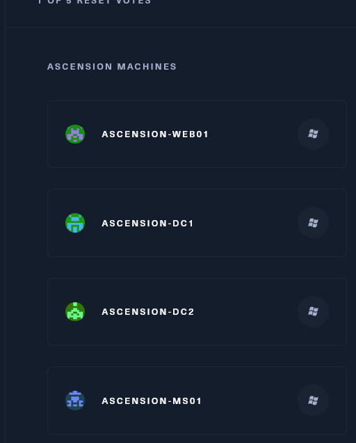

## Preface:

We are given a entry point on the IP: 10.13.38.20

From the machine preface we know it's about a Small AD environment with most likely several forests which means AD enumeration, pivoting, PE, exploitations will be involved here.

Even the website shows us what machines are involved here with their pseudonames:



* * *

## Enumeration:

Our first step will be to fire up rustscan and do an extensive scan ours our first IP to check which services are open to the outside world and identify possible service versions.

```Bash
PORT   STATE SERVICE REASON          VERSION
80/tcp open  http    syn-ack ttl 127 Microsoft IIS httpd 10.0
| http-methods:
|   Supported Methods: OPTIONS TRACE GET HEAD POST
|_  Potentially risky methods: TRACE
|_http-title: Daedalus Airlines
|_http-favicon: Unknown favicon MD5: AC72ED4FDB48B2DC36139034ED34832F
|_http-server-header: Microsoft-IIS/10.0
Warning: OSScan results may be unreliable because we could not find at least 1 open and 1 closed port
Device type: general purpose
Running (JUST GUESSING): Microsoft Windows 2019 (89%)
OS fingerprint not ideal because: Missing a closed TCP port so results incomplete
Aggressive OS guesses: Microsoft Windows Server 2019 (89%)
No exact OS matches for host (test conditions non-ideal).
TCP/IP fingerprint:
SCAN(V=7.94%E=4%D=6/22%OT=80%CT=%CU=%PV=Y%DS=2%DC=T%G=N%TM=64941D6A%P=x86_64-pc-linux-gnu)
SEQ(SP=106%GCD=1%ISR=10C%TI=I%II=I%SS=S%TS=U)
OPS(O1=M53CNW8NNS%O2=M53CNW8NNS%O3=M53CNW8%O4=M53CNW8NNS%O5=M53CNW8NNS%O6=M53CNNS)
WIN(W1=FFFF%W2=FFFF%W3=FFFF%W4=FFFF%W5=FFFF%W6=FF70)
ECN(R=Y%DF=Y%TG=80%W=FFFF%O=M53CNW8NNS%CC=Y%Q=)
T1(R=Y%DF=Y%TG=80%S=O%A=S+%F=AS%RD=0%Q=)
T2(R=N)
T3(R=N)
T4(R=N)
U1(R=N)
IE(R=Y%DFI=N%TG=80%CD=Z)

Network Distance: 2 hops
TCP Sequence Prediction: Difficulty=262 (Good luck!)
IP ID Sequence Generation: Incremental
Service Info: OS: Windows; CPE: cpe:/o:microsoft:windows

TRACEROUTE (using port 80/tcp)
HOP RTT      ADDRESS
1   41.37 ms 10.10.14.1
2   41.48 ms 10.13.38.20
```

As we see here we have only one port open from the outside, port 80 aka HTTP service. We can see that website is hosting an Dedalus an Airline company, and NMAP identified the Webserver as IIS10 which let's us know we are dealing with a Windows based server.

I can guess with High probability that this is the first machine in the previous picture I posted, Ascension-web01, furthermore I will continue with Footprinting and enumeration in other pages dedicated to its own servers.

* * *

## Back to Enumeration:

I will try to run nmap and scan the /24 of 10.13.38.20 to find all available hosts:

```Bash
Found the following live hosts:

10.13.38.2
10.13.38.11
10.13.38.12
10.13.38.16
10.13.38.18
10.13.38.19
10.13.38.20
10.13.38.21
10.13.38.23
```

- The ip 10.13.38.2 seemed not reachable.
- The ip 10.13.38.11 gave back:

```Bash
PORT     STATE SERVICE  REASON          VERSION
80/tcp   open  http     syn-ack ttl 127 Microsoft IIS httpd 10.0
|_http-server-header: Microsoft-IIS/10.0
| http-methods: 
|   Supported Methods: OPTIONS TRACE GET HEAD POST
|_  Potentially risky methods: TRACE
|_http-title: IIS Windows Server
1433/tcp open  ms-sql-s syn-ack ttl 127 Microsoft SQL Server 2017 14.00.2027.00; RTM+
| ms-sql-info: 
|   10.13.38.11:1433: 
|     Version: 
|       name: Microsoft SQL Server 2017 RTM+
|       number: 14.00.2027.00
|       Product: Microsoft SQL Server 2017
|       Service pack level: RTM
|       Post-SP patches applied: true
|_    TCP port: 1433
| ssl-cert: Subject: commonName=SSL_Self_Signed_Fallback
| Issuer: commonName=SSL_Self_Signed_Fallback
| Public Key type: rsa
| Public Key bits: 2048
| Signature Algorithm: sha256WithRSAEncryption
| Not valid before: 2023-06-17T15:22:13
| Not valid after:  2053-06-17T15:22:13
| MD5:   a094:aee0:3b72:d706:74ca:e5aa:5b18:1b51
| SHA-1: d80a:c66c:195c:944a:6835:60b8:d408:db46:30c1:950f
| -----BEGIN CERTIFICATE-----
| MIIDADCCAeigAwIBAgIQJOTt3yzp84ZIqogsCkf0WzANBgkqhkiG9w0BAQsFADA7
| MTkwNwYDVQQDHjAAUwBTAEwAXwBTAGUAbABmAF8AUwBpAGcAbgBlAGQAXwBGAGEA
| bABsAGIAYQBjAGswIBcNMjMwNjE3MTUyMjEzWhgPMjA1MzA2MTcxNTIyMTNaMDsx
| OTA3BgNVBAMeMABTAFMATABfAFMAZQBsAGYAXwBTAGkAZwBuAGUAZABfAEYAYQBs
| AGwAYgBhAGMAazCCASIwDQYJKoZIhvcNAQEBBQADggEPADCCAQoCggEBAMxsl1LL
| nZPiDM4ecI60J7zJE1pImk8CW74Gh8lwpidJ7XwMe1zgjegJciMWAgxjVvl5fKGV
| YinungIQvTF+kn+N9yy8jFu9BkIJpU23it35AVhH2n7f+q2zsqPETNIr60q0qd5f
| qQtqNYkhOD56/nXRmNw704tNTimzR1BY8VJ4nkSUyUVBpJqN4MLvkp5Gys+7Np4/
| a9rYyVJ3qcEeVKZqp3sY6nJyvYtaVvS9HfXVH1dk7+UDVjgLeVCPLhndhNkb05go
| ED4kg/8ZcU4vYiMMRnepgzIqCOc224ORnbb3kWXg7KRUK79i3qC6WYmAd/W0qsz3
| Q/ibrKrzhfxO+BUCAwEAATANBgkqhkiG9w0BAQsFAAOCAQEAGmTgLWnot0wsIWMK
| M5zgB0SeJCO/oDRuhGY5QHtrMPUvTyMj+ROfZTCLPdau3+UPMH9f3ZtaeeyKUeCO
| Aqf8RhlOXau8enqpLGycSCrz3BRQEWm49ZSaMiRfkFQTc9nXZNRx4bT8CDKM1vrt
| EjNEQoqFbipWg0yuCIgVfhbn9u8D8dIFOPdcIJ0LHKErxKCe4am/ph7HbBCcj7/I
| BeG11mthB5X6sS3CDnN6Z31RleBBlQ7y4SEhmTMbdZEwj9TSpDcYczfHguDO7kxz
| ZX/RotU+1W4IbdL6SaVCyhLCV0o0qJ1RRO7yeppAgCBGm9qUNqSEuiz5WgeCXN1T
| zjAi5Q==
|_-----END CERTIFICATE-----
| ms-sql-ntlm-info: 
|   10.13.38.11:1433: 
|     Target_Name: POO
|     NetBIOS_Domain_Name: POO
|     NetBIOS_Computer_Name: COMPATIBILITY
|     DNS_Domain_Name: intranet.poo
|     DNS_Computer_Name: COMPATIBILITY.intranet.poo
|     DNS_Tree_Name: intranet.poo
|_    Product_Version: 10.0.17763
|_ssl-date: 2023-06-22T17:29:59+00:00; +5s from scanner time.
Warning: OSScan results may be unreliable because we could not find at least 1 open and 1 closed port
Device type: general purpose
```

- The ip 10.13.38.12 gave back:

```Bash
PORT    STATE SERVICE  REASON          VERSION
25/tcp  open  smtp     syn-ack ttl 127
| smtp-commands: CITRIX, SIZE 20480000, AUTH LOGIN, HELP
|_ 211 DATA HELO EHLO MAIL NOOP QUIT RCPT RSET SAML TURN VRFY
| fingerprint-strings: 
|   GenericLines, GetRequest: 
|     220 ESMTP MAIL Service ready (EXCHANGE.HTB.LOCAL)
|     sequence of commands
|     sequence of commands
|   Hello: 
|     220 ESMTP MAIL Service ready (EXCHANGE.HTB.LOCAL)
|     EHLO Invalid domain address.
|   Help: 
|     220 ESMTP MAIL Service ready (EXCHANGE.HTB.LOCAL)
|     DATA HELO EHLO MAIL NOOP QUIT RCPT RSET SAML TURN VRFY
|   NULL: 
|_    220 ESMTP MAIL Service ready (EXCHANGE.HTB.LOCAL)
80/tcp  open  http     syn-ack ttl 127 Microsoft IIS httpd 7.5
| http-methods: 
|_  Supported Methods: GET HEAD POST OPTIONS
|_http-title: Did not follow redirect to https://humongousretail.com/
|_http-server-header: Microsoft-IIS/7.5
443/tcp open  ssl/http syn-ack ttl 127 Microsoft IIS httpd 7.5
| sslv2: 
|   SSLv2 supported
|   ciphers: 
|     SSL2_RC4_128_WITH_MD5
|_    SSL2_DES_192_EDE3_CBC_WITH_MD5
| ssl-cert: Subject: commonName=humongousretail.com
| Subject Alternative Name: DNS:humongousretail.com
| Issuer: commonName=humongousretail.com
| Public Key type: rsa
| Public Key bits: 2048
| Signature Algorithm: sha256WithRSAEncryption
| Not valid before: 2019-03-31T21:05:35
| Not valid after:  2039-03-31T21:15:35
| MD5:   5450:ca4c:6a04:6e05:db08:0ffb:b2e2:cb6f
| SHA-1: b9d4:7475:b2a7:d0ff:3375:d7df:3d5a:d211:f79c:425e
| -----BEGIN CERTIFICATE-----
| MIIDNjCCAh6gAwIBAgIQFSJYJW2O86lDzYCIhPvbXzANBgkqhkiG9w0BAQsFADAe
| MRwwGgYDVQQDDBNodW1vbmdvdXNyZXRhaWwuY29tMB4XDTE5MDMzMTIxMDUzNVoX
| DTM5MDMzMTIxMTUzNVowHjEcMBoGA1UEAwwTaHVtb25nb3VzcmV0YWlsLmNvbTCC
| ASIwDQYJKoZIhvcNAQEBBQADggEPADCCAQoCggEBANCDII25HZYTWgmh5r+GXHJa
| 1+L22BlsFQjbYsa45l5/UaVrjZ/s9L1jVStxoMPiq8ZBTGNbZ2+A/g5Y0FNZyoL/
| JHXNfPuJNUhivXZyWPkERvzAtDbusIgfTMXiExxJmoGXUucLuSyMiuVU81AeHfcd
| gFGQ4X8hE2rit2hj6jU9FhUroEO0Qbn6pi0hX9f4lx9svoJH49c+oueRuWCAIy1j
| AlLyoSMxq3D8T8/o2EkbwM/neKl4itFTxG81lO4IlK2Kah+w8XeGTz0yfhJFpEB8
| SSj6jfNV8Ld1tFoTsyPvINTb/4eZwv76ckC/SIjZ5i1Aj2m0qf9BfYRRe+RIDT8C
| AwEAAaNwMG4wDgYDVR0PAQH/BAQDAgWgMB0GA1UdJQQWMBQGCCsGAQUFBwMCBggr
| BgEFBQcDATAeBgNVHREEFzAVghNodW1vbmdvdXNyZXRhaWwuY29tMB0GA1UdDgQW
| BBROkbOiMaBsPZsemp30pWrNxPwFxzANBgkqhkiG9w0BAQsFAAOCAQEApepCYJ4b
| EyB/i5TY6FoDX+erF7+rCU1v38w3sPSq2EjpNLFDaGh+G0IQ6yA1bltHQgwkITmX
| JNaYK2nhi2mHZSO66OeYfOn+kubojq8EaweAhudfw4BoJUPgiBeolFOWoX1HLdvX
| ZLS5Gmy+U0N2z6gQX4LTyHPx2wzG1VAEcefaKrZF1KDg4ry6qlIxKV9qSllXDmU3
| tEjpYK/9wCL0xHX+FengyFbHyoJazWVW6ZMkUMCF5rKB46TCDcQLlNYacEAlPzkZ
| jZv7nsipUYi0QhA9k5YqHNQQ895H1xqWWKALOkC5f3zUAFT2l/9K9w00Gx8VtKPm
| 6Fjwab63s852Ow==
|_-----END CERTIFICATE-----
| http-methods: 
|_  Supported Methods: GET HEAD POST OPTIONS
|_http-server-header: Microsoft-IIS/7.5
|_ssl-date: 2023-06-22T17:27:25+00:00; 0s from scanner time.
|_http-title: Did not follow redirect to https://humongousretail.com/
1 service unrecognized despite returning data. If you know the service/version, please submit the following fingerprint at https://nmap.org/cgi-bin/submit.cgi?new-service :
```

- The ip 10.13.38.16 gave back:

```Bash
PORT    STATE SERVICE  REASON          VERSION
443/tcp open  ssl/http syn-ack ttl 127 Apache httpd 2.4.29 ((Ubuntu))
|_ssl-date: TLS randomness does not represent time
|_http-title: Gigantic Hosting | Home
| tls-alpn: 
|_  http/1.1
| ssl-cert: Subject: commonName=10.13.38.16/organizationName=Gigantic Hosting Limited/stateOrProvinceName=New York/countryName=US/localityName=New York City/organizationalUnitName=IT/emailAddress=it@gigantichosting.com
| Issuer: commonName=10.13.38.16/organizationName=Gigantic Hosting Limited/stateOrProvinceName=New York/countryName=US/localityName=New York City/organizationalUnitName=IT/emailAddress=it@gigantichosting.com
| Public Key type: rsa
| Public Key bits: 2048
| Signature Algorithm: sha256WithRSAEncryption
| Not valid before: 2019-09-04T21:52:00
| Not valid after:  2039-08-30T21:52:00
| MD5:   dd99:de17:1f85:680c:ed43:5c97:c2e6:fabe
| SHA-1: de2f:65d5:5335:b952:742c:c29e:bf09:97f9:140d:7617
| -----BEGIN CERTIFICATE-----
| MIIELTCCAxWgAwIBAgIUSRiwVAcLWo38HKWkibECxDdPEhgwDQYJKoZIhvcNAQEL
| BQAwgaUxCzAJBgNVBAYTAlVTMREwDwYDVQQIDAhOZXcgWW9yazEWMBQGA1UEBwwN
| TmV3IFlvcmsgQ2l0eTEhMB8GA1UECgwYR2lnYW50aWMgSG9zdGluZyBMaW1pdGVk
| MQswCQYDVQQLDAJJVDEUMBIGA1UEAwwLMTAuMTMuMzguMTYxJTAjBgkqhkiG9w0B
| CQEWFml0QGdpZ2FudGljaG9zdGluZy5jb20wHhcNMTkwOTA0MjE1MjAwWhcNMzkw
| ODMwMjE1MjAwWjCBpTELMAkGA1UEBhMCVVMxETAPBgNVBAgMCE5ldyBZb3JrMRYw
| FAYDVQQHDA1OZXcgWW9yayBDaXR5MSEwHwYDVQQKDBhHaWdhbnRpYyBIb3N0aW5n
| IExpbWl0ZWQxCzAJBgNVBAsMAklUMRQwEgYDVQQDDAsxMC4xMy4zOC4xNjElMCMG
| CSqGSIb3DQEJARYWaXRAZ2lnYW50aWNob3N0aW5nLmNvbTCCASIwDQYJKoZIhvcN
| AQEBBQADggEPADCCAQoCggEBAK6F03ogbseu20lGg+oKprjEJuuOXpxrgOvGTPwo
| xyJu8H5ovqBaW8RVmr/ETXtfJPfLSkAa5i02RYqb6JGmjL9Tyo6EWhb9ICLtA7qY
| zfMaPTqo5mSyJ6Vto7J/+uhtHS7LnOAEizCuHDeXGFPF7xsPv6W67P7qNBtgvi1g
| m80lWT+01BF1emGWkdwOcJwEGJPuEQ4xRTKNATlfBAHMGSDG8fziZOVjFUUz1Z7A
| YFQUSblMLibDLHAw05eINrQiPGuCQRUjkJf5WGqKfWef57tHQhjyKcOjLt0Tdo6o
| nGEFLZ3nOjAj7k9WeSS+ClaHh325yNR6VWBm9icJlecBxaECAwEAAaNTMFEwHQYD
| VR0OBBYEFFg1H4UDNudm6xELb7Ajk/KStfCiMB8GA1UdIwQYMBaAFFg1H4UDNudm
| 6xELb7Ajk/KStfCiMA8GA1UdEwEB/wQFMAMBAf8wDQYJKoZIhvcNAQELBQADggEB
| AAhfyyUPWNTbqANmJFBKSDctbAD5RGH0gECx9Mls92xQMQfJRIrolJZZbOX6jGLZ
| xd7ld545zB6khEwGgSDCLascs53QnABChtrsVVuqtnpxQFSPY6Al4wIe8qkj3g5+
| c/z6YGI0nbdul6SoZlNq89ZI0U3juSlJ8SBw3tIjbgliVU0aPQUQZ+lxoWMmXOL8
| 4ys2fMlTzdAF7rWd+YdAV0A3QbRbd41QCKFOhCiVPvtfM+uX1Ewkn5sZxfLxes6/
| GbMRq5yPmhybMlmUfs6EZcFQAi+iLwFuHUjckAxQwY3LGBcz833GHjVHEWX4jHWt
| octUAduziVSht+OxS49JJcY=
|_-----END CERTIFICATE-----
|_http-server-header: Apache/2.4.29 (Ubuntu)
| http-methods: 
|_  Supported Methods: GET POST OPTIONS HEAD
Warning: OSScan results may be unreliable because we could not find at least 1 open and 1 closed port
Device type: general purpose
Running (JUST GUESSING): Microsoft Windows 2012|2008 (97%)
OS CPE: cpe:/o:microsoft:windows_server_2012:r2 cpe:/o:microsoft:windows_server_2008:r2:sp1
OS fingerprint not ideal because: Missing a closed TCP port so results incomplete
Aggressive OS guesses: Microsoft Windows Server 2012 R2 (97%), Microsoft Windows Server 2008 R2 SP1 (90%), Microsoft Windows Server 2012 or Windows Server 2012 R2 (89%), Microsoft Windows Server 2012 (88%)
No exact OS matches for host (test conditions non-ideal).
```

- The ip 10.13.38.18 gave back:

```Bash
PORT     STATE SERVICE REASON         VERSION
22/tcp   open  ssh     syn-ack ttl 63 OpenSSH 7.6p1 Ubuntu 4ubuntu0.3 (Ubuntu Linux; protocol 2.0)
| ssh-hostkey: 
|   2048 7b:86:51:3e:50:78:7f:0a:19:57:0d:6c:a3:b8:fd:09 (RSA)
| ssh-rsa AAAAB3NzaC1yc2EAAAADAQABAAABAQCrd6KqC3+mhVK5FIK+CuqRk+M8q+wtMFqcWvnr8NrP2Z8xWFWBbjcz3tuFJJuVpZacE+eo8F0lXHePzvTiGe7H36lEC+uwbcAelGjVe1bOwSl8fg8kRordD9/PvrVEPywlujbIlP5hK4CKr+4leauP3XDshpl4m/OlM3cVIXD0qsaje5gvoVogYAkrV1NG+/YiLMpSgTqa+NhfnWCEl84xYeCZhQYETZ5yHC8elBbpdMvWHJ0s9tBlT+298wDnbbwGnDUYf+ohPnf6zoBDFc5FZv9ysMWxBJGQrMKcfk08qpZWyvJup4sCXQo6Z+vXNpVDJTBSIkigBDMqOJ5Fnf7J
|   256 e5:01:c2:cd:ed:63:be:1f:b3:c2:c3:51:a4:f8:1d:90 (ECDSA)
| ecdsa-sha2-nistp256 AAAAE2VjZHNhLXNoYTItbmlzdHAyNTYAAAAIbmlzdHAyNTYAAABBBEHycYPcCL5mdoUjjU5NRb4jCOQ1rLZnmGEW29wBi0bPt+10W8eCAde85QsfMnGS8lF5oPoFps1OHbb3XLiGsdA=
|   256 ce:12:d1:0e:83:1d:63:34:42:fa:48:47:eb:06:1a:66 (ED25519)
|_ssh-ed25519 AAAAC3NzaC1lZDI1NTE5AAAAIEk2xmjXddjF5KJSlqc9As2nlZBhNq/8nguXJo2eD5Kx
80/tcp   open  http    syn-ack ttl 63 Apache httpd 2.4.29 ((Ubuntu))
|_http-server-header: Apache/2.4.29 (Ubuntu)
|_http-favicon: Unknown favicon MD5: 9BF17D5D596D8F5C7E7C1BCF7498EB08
| http-methods: 
|_  Supported Methods: GET POST OPTIONS HEAD
|_http-title: Roundsoft Inc.
3000/tcp open  ppp?    syn-ack ttl 63
| fingerprint-strings: 
|   GetRequest, HTTPOptions: 
|     HTTP/1.1 200 OK
|     X-XSS-Protection: 1
|     X-Content-Type-Options: nosniff
|     Content-Security-Policy: default-src 'self' ; connect-src *; font-src 'self' data:; frame-src *; img-src * data:; media-src * data:; script-src 'self' 'unsafe-eval' ; style-src 'self' 'unsafe-inline' 
|     X-Instance-ID: 8GAjmdL249DjvCkm2
|     Content-Type: text/html; charset=utf-8
|     Vary: Accept-Encoding
|     Date: Thu, 22 Jun 2023 17:27:44 GMT
|     Connection: close
|     <!DOCTYPE html>
|     <html>
|     <head>
|     <link rel="stylesheet" type="text/css" class="__meteor-css__" href="/a3e89fa2bdd3f98d52e474085bb1d61f99c0684d.css?meteor_css_resource=true">
|     <meta charset="utf-8" />
|     <meta http-equiv="content-type" content="text/html; charset=utf-8" />
|     <meta http-equiv="expires" content="-1" />
|     <meta http-equiv="X-UA-Compatible" content="IE=edge" />
|     <meta name="fragment" content="!" />
|     <meta name="distribution" content="global" />
|_    <meta name="rat
7777/tcp open  http    syn-ack ttl 63 SimpleHTTPServer 0.6 (Python 2.7.17)
| http-methods: 
|_  Supported Methods: GET HEAD
|_http-title: Directory listing for /
|_http-server-header: SimpleHTTP/0.6 Python/2.7.17
1 service unrecognized despite returning data. If you know the service/version, please submit the following fingerprint at https://nmap.org/cgi-bin/submit.cgi?new-service :
```

- the ip 10.13.38.19 gave back:

```Bash
PORT      STATE SERVICE       REASON          VERSION
80/tcp    open  http          syn-ack ttl 127 Microsoft IIS httpd 10.0
|_http-title: IIS Windows Server
| http-methods: 
|   Supported Methods: OPTIONS TRACE GET HEAD POST
|_  Potentially risky methods: TRACE
|_http-server-header: Microsoft-IIS/10.0
135/tcp   open  msrpc         syn-ack ttl 127 Microsoft Windows RPC
445/tcp   open  microsoft-ds? syn-ack ttl 127
51371/tcp open  msrpc         syn-ack ttl 127 Microsoft Windows RPC
Warning: OSScan results may be unreliable because we could not find at least 1 open and 1 closed port
Device type: general purpose
Running (JUST GUESSING): Microsoft Windows 2019 (88%)
OS fingerprint not ideal because: Missing a closed TCP port so results incomplete
Aggressive OS guesses: Microsoft Windows Server 2019 (88%)
No exact OS matches for host (test conditions non-ideal).
```

- The ip 10.13.38.21 gave back:

```Bash
PORT      STATE SERVICE       REASON          VERSION
25/tcp    open  smtp          syn-ack ttl 127 hMailServer smtpd
| smtp-commands: ONLINE, SIZE 20480000, AUTH LOGIN, HELP
|_ 211 DATA HELO EHLO MAIL NOOP QUIT RCPT RSET SAML TURN VRFY
80/tcp    open  http          syn-ack ttl 127 Microsoft IIS httpd 10.0
|_http-server-header: Microsoft-IIS/10.0
| http-methods: 
|   Supported Methods: OPTIONS TRACE GET HEAD POST
|_  Potentially risky methods: TRACE
|_http-title: Odyssey
110/tcp   open  pop3          syn-ack ttl 127 hMailServer pop3d
|_pop3-capabilities: USER TOP UIDL
135/tcp   open  msrpc         syn-ack ttl 127 Microsoft Windows RPC
139/tcp   open  netbios-ssn   syn-ack ttl 127 Microsoft Windows netbios-ssn
143/tcp   open  imap          syn-ack ttl 127 hMailServer imapd
|_imap-capabilities: SORT RIGHTS=texkA0001 NAMESPACE QUOTA CAPABILITY IDLE ACL CHILDREN OK IMAP4 completed IMAP4rev1
445/tcp   open  microsoft-ds? syn-ack ttl 127
587/tcp   open  smtp          syn-ack ttl 127 hMailServer smtpd
| smtp-commands: ONLINE, SIZE 20480000, AUTH LOGIN, HELP
|_ 211 DATA HELO EHLO MAIL NOOP QUIT RCPT RSET SAML TURN VRFY
5985/tcp  open  http          syn-ack ttl 127 Microsoft HTTPAPI httpd 2.0 (SSDP/UPnP)
|_http-server-header: Microsoft-HTTPAPI/2.0
|_http-title: Not Found
28016/tcp open  unknown       syn-ack ttl 127
28083/tcp open  unknown       syn-ack ttl 127
47001/tcp open  http          syn-ack ttl 127 Microsoft HTTPAPI httpd 2.0 (SSDP/UPnP)
|_http-server-header: Microsoft-HTTPAPI/2.0
|_http-title: Not Found
49664/tcp open  msrpc         syn-ack ttl 127 Microsoft Windows RPC
49665/tcp open  msrpc         syn-ack ttl 127 Microsoft Windows RPC
49666/tcp open  msrpc         syn-ack ttl 127 Microsoft Windows RPC
49667/tcp open  msrpc         syn-ack ttl 127 Microsoft Windows RPC
49668/tcp open  msrpc         syn-ack ttl 127 Microsoft Windows RPC
49669/tcp open  msrpc         syn-ack ttl 127 Microsoft Windows RPC
49670/tcp open  msrpc         syn-ack ttl 127 Microsoft Windows RPC
Warning: OSScan results may be unreliable because we could not find at least 1 open and 1 closed port
```

- The ip 10.13.38.23 gave back:

```Bash
PORT      STATE SERVICE   REASON         VERSION
22/tcp    open  ssh       syn-ack ttl 63 OpenSSH 7.9 (FreeBSD 20200214; protocol 2.0)
| ssh-hostkey: 
|   2048 6b:85:9a:fa:fb:ce:81:23:da:ab:d6:49:e7:43:ea:26 (RSA)
| ssh-rsa AAAAB3NzaC1yc2EAAAADAQABAAABAQCxi/1bNrJwnemnc4FYkPP0n3q0By4Iot0QYEeoVwwhnlZ9yy/9gX2g8aMruZodHRF6Vz6hwbpK5wuPZGdMmucVfW3G3Kuocd+lv/K0BiigaTAlnqH1N0npIj3uPdIheBDRxTJvWUXALqt6JuS1A5MB9poiVkc4ncL1Gfz2yvZP9NRmqFlcH3iyUg89IZqeoDQJhuWe25R5r329JSzmggq573KTLVJb9FmA9vopiRMSlk0lRXEJEzRKmN2K16cQeW7ZvMthHpJhfwUqxCqm8HPwWAqnMQyiJe92eVRhNd04Ds834lh5LlMHt9+UqxICIBQep46zX3dD345CuXe0DISJ
|   256 8d:eb:ce:4a:9b:72:d0:82:6a:df:8e:45:7b:a6:cf:29 (ECDSA)
| ecdsa-sha2-nistp256 AAAAE2VjZHNhLXNoYTItbmlzdHAyNTYAAAAIbmlzdHAyNTYAAABBBDZBw/hyt2DJFgfNjD6BmfvOKEKqY0CXoQ2OS9scFz0iAOugurgfJEi74n6YxJoJAXWYbRVZE95yvsIncs8bJI8=
|   256 c0:30:09:70:02:6a:0a:66:0d:f4:6d:bc:f5:4e:d5:02 (ED25519)
|_ssh-ed25519 AAAAC3NzaC1lZDI1NTE5AAAAIBPsui5pYivsE1VccXQVbNYZaax+9qMUIBK2Jn+C3Ok6
443/tcp   open  ssl/http  syn-ack ttl 62 Apache httpd 2.4.46 ((FreeBSD) OpenSSL/1.1.1h-freebsd PHP/7.4.15)
|_http-title: SolarSystem Space Prospection
|_http-server-header: Apache/2.4.46 (FreeBSD) OpenSSL/1.1.1h-freebsd PHP/7.4.15
| tls-alpn: 
|_  http/1.1
| ssl-cert: Subject: commonName=www.solarsystem.htb/organizationName=SolarSystem Ltd/stateOrProvinceName=Some-State/countryName=UK
| Issuer: commonName=www.solarsystem.htb/organizationName=SolarSystem Ltd/stateOrProvinceName=Some-State/countryName=UK
| Public Key type: rsa
| Public Key bits: 2048
| Signature Algorithm: sha256WithRSAEncryption
| Not valid before: 2020-02-19T22:48:07
| Not valid after:  2021-02-18T22:48:07
| MD5:   5412:531f:3eb7:33a4:388d:f25b:61c3:8737
| SHA-1: 0970:d875:4175:e4ed:6d5d:f62f:c3bd:a052:0209:a737
| -----BEGIN CERTIFICATE-----
| MIIDlTCCAn2gAwIBAgIUWkvCujIN6VqCfhivzGwOcAvPAIwwDQYJKoZIhvcNAQEL
| BQAwWjELMAkGA1UEBhMCVUsxEzARBgNVBAgMClNvbWUtU3RhdGUxGDAWBgNVBAoM
| D1NvbGFyU3lzdGVtIEx0ZDEcMBoGA1UEAwwTd3d3LnNvbGFyc3lzdGVtLmh0YjAe
| Fw0yMDAyMTkyMjQ4MDdaFw0yMTAyMTgyMjQ4MDdaMFoxCzAJBgNVBAYTAlVLMRMw
| EQYDVQQIDApTb21lLVN0YXRlMRgwFgYDVQQKDA9Tb2xhclN5c3RlbSBMdGQxHDAa
| BgNVBAMME3d3dy5zb2xhcnN5c3RlbS5odGIwggEiMA0GCSqGSIb3DQEBAQUAA4IB
| DwAwggEKAoIBAQC9UnhIUCmoocU/6qArOe+Pi5tU2fk3amXh0PxXXc0YH1cOhWz4
| AisCdzJbBhp1tmGUfYtMrl9UyKxM8kR5ZtIt5Z/WyDWTdVQ1Mil5UDnyOs4E7vlA
| MC3c7su2axYzHuQodC7SyD0IKYLCVyrh1lXPxlrrRfa+2jzX4Mn5dI37K9Xx4AyF
| vH+Zuf+OE7DyaYcGN/k7nGnKPkVU8eC8ml9p26O6T/nUfypUfLCK+GihqPoX3gEm
| I+xIjKOzHot7cNgbdh4VMiWjyQtwUozWQ7O/2fCIcNNJdhGasJgonf+s2wEHPKqf
| SV10ax8zc1xb3Hnwllby7nq+Ld4yl986SNq3AgMBAAGjUzBRMB0GA1UdDgQWBBSZ
| U0PIbUbaP54BzV6GSDvhuHmLxDAfBgNVHSMEGDAWgBSZU0PIbUbaP54BzV6GSDvh
| uHmLxDAPBgNVHRMBAf8EBTADAQH/MA0GCSqGSIb3DQEBCwUAA4IBAQA0qrKkAPTk
| 1n4Uwr0BZR9hVkyj8PYXbN3jPlpCABDw/ruTWfY8W2/M6fHSRfampEccq4JNvY3V
| obsajsFEq+D1dIJWHsoJ7G9W8xsscZC1+V5xXX4+Y3sZ7i1mNBv2pWSiYSU4BIEW
| dw2iEfUYR2GV104/omWhhiaBaqcVq9N4l8/wIIOTIVxDc6qQrmMSUfbwDBe/R0lU
| iQvhChKCUxvBpJAD0Bz0Lk8nlK3SNBS2nZL0yUt0mnw3vbZhc2c17/cQXxPNYq1a
| zHYlpKMTr4GBHQCNDar7VeogK4CR3yO0ISrnyM/OhBZbPN0FKCja6byIc3nvFPOs
| RvFxFVxlV/rQ
|_-----END CERTIFICATE-----
| http-methods: 
|   Supported Methods: POST OPTIONS HEAD GET TRACE
|_  Potentially risky methods: TRACE
|_ssl-date: TLS randomness does not represent time
2222/tcp  open  ssh       syn-ack ttl 62 OpenSSH 7.9 (FreeBSD 20200214; protocol 2.0)
| ssh-hostkey: 
|   2048 90:03:a2:8b:6d:6d:92:cb:14:20:86:13:bf:95:00:42 (RSA)
| ssh-rsa AAAAB3NzaC1yc2EAAAADAQABAAABAQDDU9YaVDPnLLSWfmwkX7UC7VkxZhGtFzEzT8BC1slq+XKtP8BBXqPeIz6fs9TxXWti7ZiUhbuGTUxL6kvbRCpEiyS3ekJvYzbGC73R6L9Hrct8gtI/DH2b+gUkSAuBrU6frnbriNmi4a2w87mZlwgOOrdWxjhEx04u1wvkHKU+w+yi+qu0RMIjHEHE/4bR+mJGZZZlIsVFDs+sgHQAC0/xXR6qHVm3VVh0qR0w3CP9NyRSFme+UH6z6LH9U/lYPcl/ZxYTxLXQDbY2a5rZ0BD2ZmXhiVgMyiLASzHYWVyMgf+iAuIjGiH0scLF1Le5HOh53JrB4qvv5DzHbc0NqAo3
|   256 fe:54:e4:42:90:9f:10:73:33:fe:58:44:a9:d4:52:7a (ECDSA)
| ecdsa-sha2-nistp256 AAAAE2VjZHNhLXNoYTItbmlzdHAyNTYAAAAIbmlzdHAyNTYAAABBBHswSe8ZbPJo6+HmKJqdFpfU5m9h5tgVuyLbpqGyISz4fILXB+WQyXqaD81Xjq3h5T01939YnXoW2yPtxQSst58=
|   256 f1:f0:ba:d1:ec:71:88:8b:10:82:c5:c2:45:a7:1a:8f (ED25519)
|_ssh-ed25519 AAAAC3NzaC1lZDI1NTE5AAAAIPzs6waeFTlo++obfarRpYD8tTAJKu28NZfn6XT7MxFO
33333/tcp open  dgi-serv? syn-ack ttl 62
| fingerprint-strings: 
|   DNSStatusRequestTCP, Help, LDAPBindReq, LPDString, TerminalServer, X11Probe, ms-sql-s, oracle-tns: 
|     Username: Password:
|   DNSVersionBindReqTCP, GenericLines, JavaRMI, LANDesk-RC, NCP, NULL, NotesRPC, RPCCheck, afp, giop: 
|     Username:
|   FourOhFourRequest, GetRequest, HTTPOptions, Kerberos, LDAPSearchReq, RTSPRequest, SIPOptions, SMBProgNeg, SSLSessionReq, TLSSessionReq, TerminalServerCookie, WMSRequest: 
|     Username: Password: 
|     Fetching index...
|_    Error.
1 service unrecognized despite returning data. If you know the service/version, please submit the following fingerprint at https://nmap.org/cgi-bin/submit.cgi?new-service :
```

So doing some filtering by knowing that all the 3 remain hosts are Windows based and lastly filtering out machines that are from other environmets we don't have anything extra here!