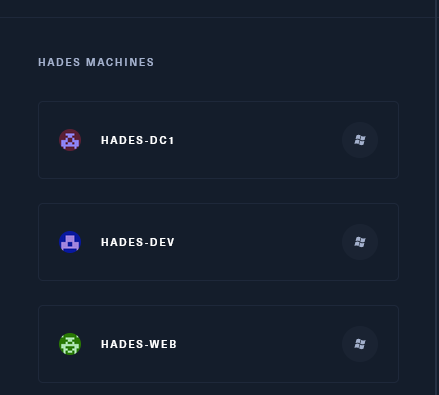

On our initial enumeration we are presented with only one IP as entry point: `10.13.38.16`

From the challenge Dashboard we know we have 3 different servers, all of them are Windows OS



And judging by following Rustscan report I guess this is the Machine called HADES-WEB

```Bash
PORT    STATE SERVICE  REASON          VERSION
443/tcp open  ssl/http syn-ack ttl 127 Apache httpd 2.4.29 ((Ubuntu))
|_http-server-header: Apache/2.4.29 (Ubuntu)
| ssl-cert: Subject: commonName=10.13.38.16/organizationName=Gigantic Hosting Limited/stateOrProvinceName=New York/countryName=US/localityName=New York City/emailAddress=it@gigantichosting.com/organizationalUnitName=IT
| Issuer: commonName=10.13.38.16/organizationName=Gigantic Hosting Limited/stateOrProvinceName=New York/countryName=US/localityName=New York City/emailAddress=it@gigantichosting.com/organizationalUnitName=IT
| Public Key type: rsa
| Public Key bits: 2048
| Signature Algorithm: sha256WithRSAEncryption
| Not valid before: 2019-09-04T21:52:00
| Not valid after:  2039-08-30T21:52:00
| MD5:   dd99:de17:1f85:680c:ed43:5c97:c2e6:fabe
| SHA-1: de2f:65d5:5335:b952:742c:c29e:bf09:97f9:140d:7617
| -----BEGIN CERTIFICATE-----
| MIIELTCCAxWgAwIBAgIUSRiwVAcLWo38HKWkibECxDdPEhgwDQYJKoZIhvcNAQEL
| BQAwgaUxCzAJBgNVBAYTAlVTMREwDwYDVQQIDAhOZXcgWW9yazEWMBQGA1UEBwwN
| TmV3IFlvcmsgQ2l0eTEhMB8GA1UECgwYR2lnYW50aWMgSG9zdGluZyBMaW1pdGVk
| MQswCQYDVQQLDAJJVDEUMBIGA1UEAwwLMTAuMTMuMzguMTYxJTAjBgkqhkiG9w0B
| CQEWFml0QGdpZ2FudGljaG9zdGluZy5jb20wHhcNMTkwOTA0MjE1MjAwWhcNMzkw
| ODMwMjE1MjAwWjCBpTELMAkGA1UEBhMCVVMxETAPBgNVBAgMCE5ldyBZb3JrMRYw
| FAYDVQQHDA1OZXcgWW9yayBDaXR5MSEwHwYDVQQKDBhHaWdhbnRpYyBIb3N0aW5n
| IExpbWl0ZWQxCzAJBgNVBAsMAklUMRQwEgYDVQQDDAsxMC4xMy4zOC4xNjElMCMG
| CSqGSIb3DQEJARYWaXRAZ2lnYW50aWNob3N0aW5nLmNvbTCCASIwDQYJKoZIhvcN
| AQEBBQADggEPADCCAQoCggEBAK6F03ogbseu20lGg+oKprjEJuuOXpxrgOvGTPwo
| xyJu8H5ovqBaW8RVmr/ETXtfJPfLSkAa5i02RYqb6JGmjL9Tyo6EWhb9ICLtA7qY
| zfMaPTqo5mSyJ6Vto7J/+uhtHS7LnOAEizCuHDeXGFPF7xsPv6W67P7qNBtgvi1g
| m80lWT+01BF1emGWkdwOcJwEGJPuEQ4xRTKNATlfBAHMGSDG8fziZOVjFUUz1Z7A
| YFQUSblMLibDLHAw05eINrQiPGuCQRUjkJf5WGqKfWef57tHQhjyKcOjLt0Tdo6o
| nGEFLZ3nOjAj7k9WeSS+ClaHh325yNR6VWBm9icJlecBxaECAwEAAaNTMFEwHQYD
| VR0OBBYEFFg1H4UDNudm6xELb7Ajk/KStfCiMB8GA1UdIwQYMBaAFFg1H4UDNudm
| 6xELb7Ajk/KStfCiMA8GA1UdEwEB/wQFMAMBAf8wDQYJKoZIhvcNAQELBQADggEB
| AAhfyyUPWNTbqANmJFBKSDctbAD5RGH0gECx9Mls92xQMQfJRIrolJZZbOX6jGLZ
| xd7ld545zB6khEwGgSDCLascs53QnABChtrsVVuqtnpxQFSPY6Al4wIe8qkj3g5+
| c/z6YGI0nbdul6SoZlNq89ZI0U3juSlJ8SBw3tIjbgliVU0aPQUQZ+lxoWMmXOL8
| 4ys2fMlTzdAF7rWd+YdAV0A3QbRbd41QCKFOhCiVPvtfM+uX1Ewkn5sZxfLxes6/
| GbMRq5yPmhybMlmUfs6EZcFQAi+iLwFuHUjckAxQwY3LGBcz833GHjVHEWX4jHWt
| octUAduziVSht+OxS49JJcY=
|_-----END CERTIFICATE-----
| tls-alpn: 
|_  http/1.1
|_ssl-date: TLS randomness does not represent time
| http-methods: 
|_  Supported Methods: GET POST OPTIONS HEAD
|_http-title: Gigantic Hosting | Home
Warning: OSScan results may be unreliable because we could not find at least 1 open and 1 closed port
Device type: general purpose|phone|specialized
Running (JUST GUESSING): Microsoft Windows 2012|8|Phone|7 (89%)
OS CPE: cpe:/o:microsoft:windows_server_2012:r2 cpe:/o:microsoft:windows_8 cpe:/o:microsoft:windows cpe:/o:microsoft:windows_7
OS fingerprint not ideal because: Missing a closed TCP port so results incomplete
Aggressive OS guesses: Microsoft Windows Server 2012 or Windows Server 2012 R2 (89%), Microsoft Windows Server 2012 R2 (89%), Microsoft Windows Server 2012 (88%), Microsoft Windows 8.1 Update 1 (86%), Microsoft Windows Phone 7.5 or 8.0 (86%), Microsoft Windows Embedded Standard 7 (85%)
No exact OS matches for host (test conditions non-ideal).
TCP/IP fingerprint:
SCAN(V=7.94%E=4%D=7/17%OT=443%CT=%CU=%PV=Y%DS=2%DC=T%G=N%TM=64B5302F%P=x86_64-pc-linux-gnu)
SEQ(SP=103%GCD=1%ISR=105%TI=I%II=I%SS=S%TS=7)
OPS(O1=M53CNW8ST11%O2=M53CNW8ST11%O3=M53CNW8NNT11%O4=M53CNW8ST11%O5=M53CNW8ST11%O6=M53CST11)
WIN(W1=2000%W2=2000%W3=2000%W4=2000%W5=2000%W6=2000)
ECN(R=Y%DF=Y%TG=80%W=2000%O=M53CNW8NNS%CC=Y%Q=)
T1(R=Y%DF=Y%TG=80%S=O%A=S+%F=AS%RD=0%Q=)
T2(R=N)
T3(R=N)
T4(R=N)
U1(R=N)
IE(R=Y%DFI=N%TG=80%CD=Z)

Uptime guess: 0.408 days (since Mon Jul 17 04:25:20 2023)
```

I will add this IP to my Hosts file and move on with Enumeration.

* * *