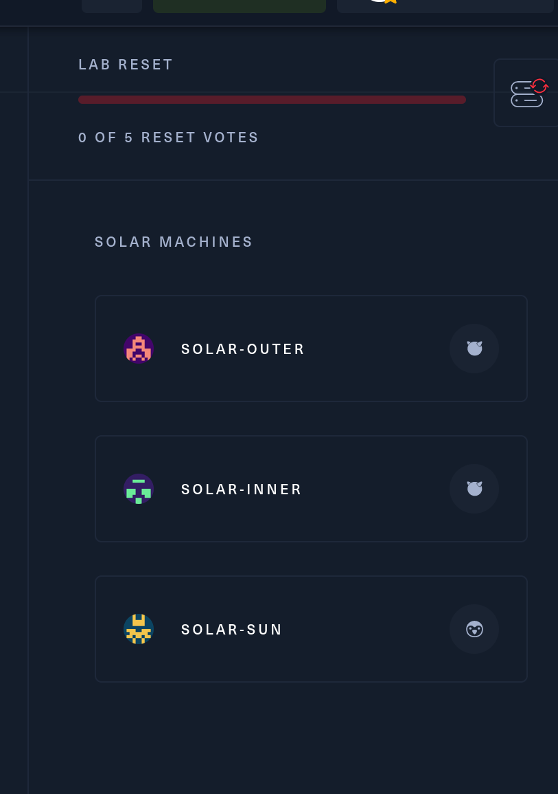

From description we are given a entry point IP: 10.13.38.23

We know that we have 3 servers: 



* * *

## Network enumeration:

I suggest to start by enumerating our initial machine with NMAP or similar and then check from there how to procede:

```Bash
PORT      STATE SERVICE   REASON         VERSION
22/tcp    open  ssh       syn-ack ttl 63 OpenSSH 7.9 (FreeBSD 20200214; protocol 2.0)
| ssh-hostkey: 
|   2048 6b:85:9a:fa:fb:ce:81:23:da:ab:d6:49:e7:43:ea:26 (RSA)
| ssh-rsa AAAAB3NzaC1yc2EAAAADAQABAAABAQCxi/1bNrJwnemnc4FYkPP0n3q0By4Iot0QYEeoVwwhnlZ9yy/9gX2g8aMruZodHRF6Vz6hwbpK5wuPZGdMmucVfW3G3Kuocd+lv/K0BiigaTAlnqH1N0npIj3uPdIheBDRxTJvWUXALqt6JuS1A5MB9poiVkc4ncL1Gfz2yvZP9NRmqFlcH3iyUg89IZqeoDQJhuWe25R5r329JSzmggq573KTLVJb9FmA9vopiRMSlk0lRXEJEzRKmN2K16cQeW7ZvMthHpJhfwUqxCqm8HPwWAqnMQyiJe92eVRhNd04Ds834lh5LlMHt9+UqxICIBQep46zX3dD345CuXe0DISJ
|   256 8d:eb:ce:4a:9b:72:d0:82:6a:df:8e:45:7b:a6:cf:29 (ECDSA)
| ecdsa-sha2-nistp256 AAAAE2VjZHNhLXNoYTItbmlzdHAyNTYAAAAIbmlzdHAyNTYAAABBBDZBw/hyt2DJFgfNjD6BmfvOKEKqY0CXoQ2OS9scFz0iAOugurgfJEi74n6YxJoJAXWYbRVZE95yvsIncs8bJI8=
|   256 c0:30:09:70:02:6a:0a:66:0d:f4:6d:bc:f5:4e:d5:02 (ED25519)
|_ssh-ed25519 AAAAC3NzaC1lZDI1NTE5AAAAIBPsui5pYivsE1VccXQVbNYZaax+9qMUIBK2Jn+C3Ok6
443/tcp   open  ssl/http  syn-ack ttl 62 Apache httpd 2.4.46 ((FreeBSD) OpenSSL/1.1.1h-freebsd PHP/7.4.15)
|_http-server-header: Apache/2.4.46 (FreeBSD) OpenSSL/1.1.1h-freebsd PHP/7.4.15
| ssl-cert: Subject: commonName=www.solarsystem.htb/organizationName=SolarSystem Ltd/stateOrProvinceName=Some-State/countryName=UK
| Issuer: commonName=www.solarsystem.htb/organizationName=SolarSystem Ltd/stateOrProvinceName=Some-State/countryName=UK
| Public Key type: rsa
| Public Key bits: 2048
| Signature Algorithm: sha256WithRSAEncryption
| Not valid before: 2020-02-19T22:48:07
| Not valid after:  2021-02-18T22:48:07
| MD5:   5412:531f:3eb7:33a4:388d:f25b:61c3:8737
| SHA-1: 0970:d875:4175:e4ed:6d5d:f62f:c3bd:a052:0209:a737
|_ssl-date: TLS randomness does not represent time
|_http-title: SolarSystem Space Prospection
| http-methods: 
|   Supported Methods: GET POST OPTIONS HEAD TRACE
|_  Potentially risky methods: TRACE
| tls-alpn: 
|_  http/1.1
2222/tcp  open  ssh       syn-ack ttl 62 OpenSSH 7.9 (FreeBSD 20200214; protocol 2.0)
| ssh-hostkey: 
|   2048 90:03:a2:8b:6d:6d:92:cb:14:20:86:13:bf:95:00:42 (RSA)
| ssh-rsa AAAAB3NzaC1yc2EAAAADAQABAAABAQDDU9YaVDPnLLSWfmwkX7UC7VkxZhGtFzEzT8BC1slq+XKtP8BBXqPeIz6fs9TxXWti7ZiUhbuGTUxL6kvbRCpEiyS3ekJvYzbGC73R6L9Hrct8gtI/DH2b+gUkSAuBrU6frnbriNmi4a2w87mZlwgOOrdWxjhEx04u1wvkHKU+w+yi+qu0RMIjHEHE/4bR+mJGZZZlIsVFDs+sgHQAC0/xXR6qHVm3VVh0qR0w3CP9NyRSFme+UH6z6LH9U/lYPcl/ZxYTxLXQDbY2a5rZ0BD2ZmXhiVgMyiLASzHYWVyMgf+iAuIjGiH0scLF1Le5HOh53JrB4qvv5DzHbc0NqAo3
|   256 fe:54:e4:42:90:9f:10:73:33:fe:58:44:a9:d4:52:7a (ECDSA)
| ecdsa-sha2-nistp256 AAAAE2VjZHNhLXNoYTItbmlzdHAyNTYAAAAIbmlzdHAyNTYAAABBBHswSe8ZbPJo6+HmKJqdFpfU5m9h5tgVuyLbpqGyISz4fILXB+WQyXqaD81Xjq3h5T01939YnXoW2yPtxQSst58=
|   256 f1:f0:ba:d1:ec:71:88:8b:10:82:c5:c2:45:a7:1a:8f (ED25519)
|_ssh-ed25519 AAAAC3NzaC1lZDI1NTE5AAAAIPzs6waeFTlo++obfarRpYD8tTAJKu28NZfn6XT7MxFO
8080/tcp  open  http      syn-ack ttl 62 Apache httpd 2.4.46 ((FreeBSD) PHP/7.4.19)
| http-methods: 
|   Supported Methods: HEAD GET POST OPTIONS TRACE
|_  Potentially risky methods: TRACE
|_http-title: Site doesn't have a title (text/html).
|_http-server-header: Apache/2.4.46 (FreeBSD) PHP/7.4.19
|_http-open-proxy: Proxy might be redirecting requests
33333/tcp open  dgi-serv? syn-ack ttl 62
| fingerprint-strings: 
|   DNSStatusRequestTCP, Help, LDAPBindReq, LPDString, TerminalServer, X11Probe, ms-sql-s, oracle-tns: 
|     Username: Password:
|   DNSVersionBindReqTCP, GenericLines, JavaRMI, LANDesk-RC, NCP, NULL, NotesRPC, RPCCheck, afp, giop: 
|     Username:
|   FourOhFourRequest, GetRequest, HTTPOptions, Kerberos, LDAPSearchReq, RTSPRequest, SIPOptions, SMBProgNeg, SSLSessionReq, TLSSessionReq, TerminalServerCookie, WMSRequest: 
|     Username: Password: 
|     Fetching index...
|_    Error.
1 service unrecognized despite returning data. If you know the service/version, please submit the following fingerprint at https://nmap.org/cgi-bin/submit.cgi?new-service :
SF-Port33333-TCP:V=7.94%I=7%D=7/21%Time=64BACB86%P=x86_64-pc-linux-gnu%r(N
SF:ULL,A,"Username:\x20")%r(GenericLines,A,"Username:\x20")%r(GetRequest,2
SF:F,"Username:\x20Password:\x20\nFetching\x20index\.\.\.\n\nError\.\n")%r
SF:(HTTPOptions,2F,"Username:\x20Password:\x20\nFetching\x20index\.\.\.\n\
SF:nError\.\n")%r(RTSPRequest,2F,"Username:\x20Password:\x20\nFetching\x20
SF:index\.\.\.\n\nError\.\n")%r(RPCCheck,A,"Username:\x20")%r(DNSVersionBi
SF:ndReqTCP,A,"Username:\x20")%r(DNSStatusRequestTCP,14,"Username:\x20Pass
SF:word:\x20")%r(Help,14,"Username:\x20Password:\x20")%r(SSLSessionReq,2F,
SF:"Username:\x20Password:\x20\nFetching\x20index\.\.\.\n\nError\.\n")%r(T
SF:erminalServerCookie,2F,"Username:\x20Password:\x20\nFetching\x20index\.
SF:\.\.\n\nError\.\n")%r(TLSSessionReq,2F,"Username:\x20Password:\x20\nFet
SF:ching\x20index\.\.\.\n\nError\.\n")%r(Kerberos,2F,"Username:\x20Passwor
SF:d:\x20\nFetching\x20index\.\.\.\n\nError\.\n")%r(SMBProgNeg,2F,"Usernam
SF:e:\x20Password:\x20\nFetching\x20index\.\.\.\n\nError\.\n")%r(X11Probe,
SF:14,"Username:\x20Password:\x20")%r(FourOhFourRequest,2F,"Username:\x20P
SF:assword:\x20\nFetching\x20index\.\.\.\n\nError\.\n")%r(LPDString,14,"Us
SF:ername:\x20Password:\x20")%r(LDAPSearchReq,2F,"Username:\x20Password:\x
SF:20\nFetching\x20index\.\.\.\n\nError\.\n")%r(LDAPBindReq,14,"Username:\
SF:x20Password:\x20")%r(SIPOptions,2F,"Username:\x20Password:\x20\nFetchin
SF:g\x20index\.\.\.\n\nError\.\n")%r(LANDesk-RC,A,"Username:\x20")%r(Termi
SF:nalServer,14,"Username:\x20Password:\x20")%r(NCP,A,"Username:\x20")%r(N
SF:otesRPC,A,"Username:\x20")%r(JavaRMI,A,"Username:\x20")%r(WMSRequest,2F
SF:,"Username:\x20Password:\x20\nFetching\x20index\.\.\.\n\nError\.\n")%r(
SF:oracle-tns,14,"Username:\x20Password:\x20")%r(ms-sql-s,14,"Username:\x2
SF:0Password:\x20")%r(afp,A,"Username:\x20")%r(giop,A,"Username:\x20");
Warning: OSScan results may be unreliable because we could not find at least 1 open and 1 closed port
OS fingerprint not ideal because: Missing a closed TCP port so results incomplete
Aggressive OS guesses: FreeBSD 12.0-RELEASE - 13.0-CURRENT (96%), FreeBSD 11.2-RELEASE - 11.3 RELEASE or 11.2-STABLE (93%), FreeBSD 13.1-RELEASE (93%), FreeBSD 11.1-RELEASE (92%), FreeBSD 11.0-RELEASE (91%), FreeBSD 11.1-STABLE (90%), FreeBSD 12.0-RELEASE (90%), FreeBSD 11.0-RELEASE - 12.0-CURRENT (90%), FreeBSD 11.1-RELEASE or 11.2-STABLE (90%), FreeBSD 12.0-RELEASE - 12.1-RELEASE or 12.0-STABLE (90%)
No exact OS matches for host (test conditions non-ideal).
TCP/IP fingerprint:
SCAN(V=7.94%E=4%D=7/21%OT=22%CT=%CU=42216%PV=Y%DS=2%DC=T%G=N%TM=64BACBE6%P=x86_64-pc-linux-gnu)
SEQ(SP=106%GCD=1%ISR=10D%TI=Z%CI=Z%II=RI%TS=22)
SEQ(SP=107%GCD=1%ISR=10B%TI=Z%CI=Z%II=RI%TS=22)
OPS(O1=M550NW6ST11%O2=M550NW6ST11%O3=M550NW6NNT11%O4=M550NW6ST11%O5=M550NW6ST11%O6=M550ST11)
WIN(W1=FFFF%W2=FFFF%W3=FFFF%W4=FFFF%W5=FFFF%W6=FFFF)
ECN(R=Y%DF=Y%T=40%W=FFFF%O=M550NW6SLL%CC=Y%Q=)
T1(R=Y%DF=Y%T=40%S=O%A=S+%F=AS%RD=0%Q=)
T2(R=N)
T3(R=Y%DF=Y%T=40%W=FFFF%S=O%A=S+%F=AS%O=M550NW6ST11%RD=0%Q=)
T4(R=Y%DF=Y%T=40%W=0%S=A%A=Z%F=R%O=%RD=0%Q=)
T5(R=Y%DF=Y%T=40%W=0%S=Z%A=S+%F=AR%O=%RD=0%Q=)
T6(R=Y%DF=Y%T=40%W=0%S=A%A=Z%F=R%O=%RD=0%Q=)
T7(R=Y%DF=Y%T=40%W=0%S=Z%A=S+%F=AR%O=%RD=0%Q=)
U1(R=Y%DF=N%T=40%IPL=164%UN=0%RIPL=G%RID=G%RIPCK=G%RUCK=G%RUD=G)
IE(R=Y%DFI=S%T=40%CD=S)

Uptime guess: 0.000 days (since Fri Jul 21 20:18:09 2023)
Network Distance: 2 hops
TCP Sequence Prediction: Difficulty=263 (Good luck!)
IP ID Sequence Generation: All zeros
Service Info: OS: FreeBSD; CPE: cpe:/o:freebsd:freebsd
```

As we can see we are in front of a Free-BSD linux machine with some standard services and some other non stadard, briefly I see a LDAP server on 33333 a custom SSH on 2222 and HTTP on port 80 and 8080.

I guess we are infront of the machine called SOLAR-OUTER, so from here I will move to the specific host page.