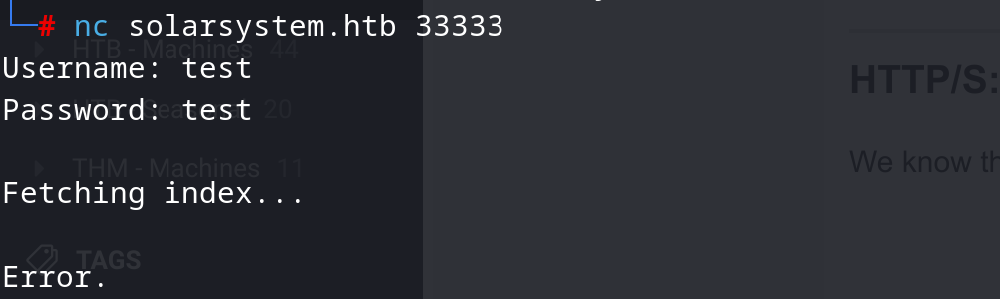
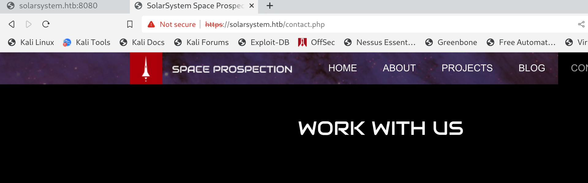
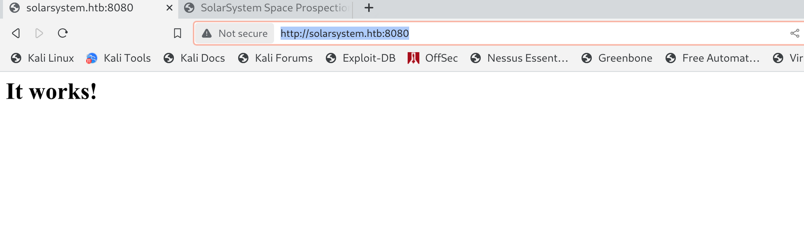
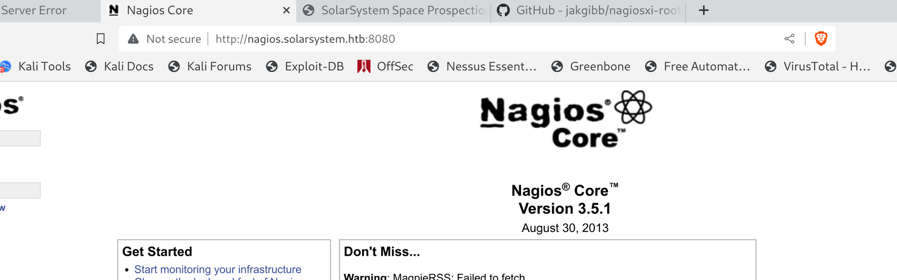
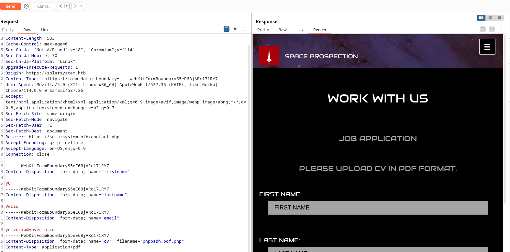
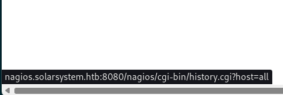
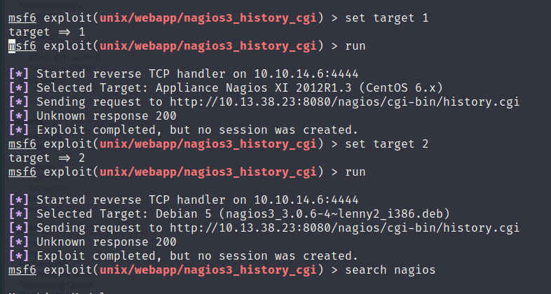
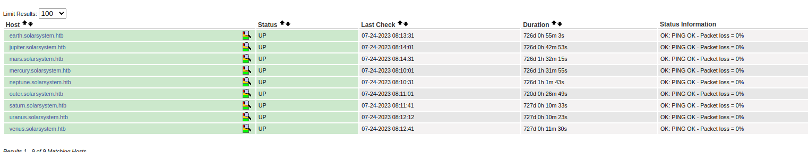

## SSH:

So first thing first I see 2 SSH servers one on port 22(standard) and the other on a custom port 2222, I don't think there are any know exploit in the wild available plus it can denote the presence of a Containerization.

Both services are relying on a pretty new version with no known exploit in the wild, bruteforce is not a contempt way in.

* * *

## Port 33333:

Here is relaying some kidn of LDAP server:



I tried some simple payloads to try to bypass login without succeeding but we may want either try to dig deeper or come back as soon we find some valid credentials.

* * *

## HTTP/S:

We know there are 2 HTTP/S services one running on a default port 443(HTTPS) and the other on a custom port 8080(HTTP).

On first sign seems like only the HTTPS service is hosting a proper webpage:



Where instead the port 8080 seems like it's hosting the default home for Apache webserver:



Next trying to check for hidden webdirs on the 8080 shows us traces of cgi:

```Bash
┌──(root㉿kali-linux)-[/home/millycash/Downloads]
└─# dirsearch -u "http://solarsystem.htb:8080/"                            

  _|. _ _  _  _  _ _|_    v0.4.2
 (_||| _) (/_(_|| (_| )

Extensions: php, aspx, jsp, html, js | HTTP method: GET | Threads: 30 | Wordlist size: 10927

Output File: /root/.dirsearch/reports/solarsystem.htb-8080/-_23-07-21_20-36-45.txt

Error Log: /root/.dirsearch/logs/errors-23-07-21_20-36-45.log

Target: http://solarsystem.htb:8080/

[20:36:45] Starting: 
[20:36:48] 403 -  199B  - /.ht_wsr.txt
[20:36:48] 403 -  199B  - /.htaccess.bak1
[20:36:48] 403 -  199B  - /.htaccess.orig
[20:36:48] 403 -  199B  - /.htaccess.sample
[20:36:48] 403 -  199B  - /.htaccess.save
[20:36:48] 403 -  199B  - /.htaccess_extra
[20:36:48] 403 -  199B  - /.htaccess_orig
[20:36:48] 403 -  199B  - /.htaccessBAK
[20:36:48] 403 -  199B  - /.htaccess_sc
[20:36:48] 403 -  199B  - /.htaccessOLD
[20:36:48] 403 -  199B  - /.htaccessOLD2
[20:36:48] 403 -  199B  - /.html
[20:36:48] 403 -  199B  - /.htm
[20:36:48] 403 -  199B  - /.htpasswd_test
[20:36:48] 403 -  199B  - /.htpasswds
[20:36:48] 403 -  199B  - /.httr-oauth
[20:37:03] 403 -  199B  - /cgi-bin/
[20:37:03] 500 -  528B  - /cgi-bin/test-cgi
[20:37:07] 200 -   45B  - /index.html

Task Completed
```

The same is for the "real" website residing on HTTPS service:

```Bash
┌──(root㉿kali-linux)-[/home/millycash/Downloads]
└─# dirsearch -u "https://solarsystem.htb/"     

  _|. _ _  _  _  _ _|_    v0.4.2
 (_||| _) (/_(_|| (_| )

Extensions: php, aspx, jsp, html, js | HTTP method: GET | Threads: 30 | Wordlist size: 10927

Output File: /root/.dirsearch/reports/solarsystem.htb/-_23-07-21_20-37-40.txt

Error Log: /root/.dirsearch/logs/errors-23-07-21_20-37-40.log

Target: https://solarsystem.htb/

[20:37:40] Starting: 
[20:37:51] 403 -  199B  - /.htaccess.bak1
[20:37:51] 403 -  199B  - /.ht_wsr.txt
[20:37:51] 403 -  199B  - /.htaccess.orig
[20:37:51] 403 -  199B  - /.htaccess.sample
[20:37:51] 403 -  199B  - /.htaccess.save
[20:37:51] 403 -  199B  - /.htaccess_extra
[20:37:51] 403 -  199B  - /.htaccess_orig
[20:37:51] 403 -  199B  - /.htaccessOLD
[20:37:51] 403 -  199B  - /.htaccessBAK
[20:37:51] 403 -  199B  - /.htaccess_sc
[20:37:51] 403 -  199B  - /.htaccessOLD2
[20:37:51] 403 -  199B  - /.htm
[20:37:51] 403 -  199B  - /.html
[20:37:51] 403 -  199B  - /.htpasswd_test
[20:37:51] 403 -  199B  - /.htpasswds
[20:37:51] 403 -  199B  - /.httr-oauth
[20:37:52] 301 -  235B  - /js  ->  https://solarsystem.htb/js/
[20:37:55] 200 -    3KB - /about.html
[20:38:08] 403 -  199B  - /cgi-bin/test-cgi
[20:38:09] 200 -    3KB - /contact.php
[20:38:09] 301 -  236B  - /css  ->  https://solarsystem.htb/css/
[20:38:12] 301 -  238B  - /fonts  ->  https://solarsystem.htb/fonts/
[20:38:13] 301 -  239B  - /images  ->  https://solarsystem.htb/images/
[20:38:13] 200 -    2KB - /images/
[20:38:14] 200 -    3KB - /index.html
[20:38:15] 200 -  252B  - /js/
```

This could indicate a potential attack vector on Apache tomcat via CGIs.

Before anything I will check for hidden VHOSTS, and nothing came out from the main website:

```Bash
┌──(root㉿kali-linux)-[/home/millycash/Downloads]
└─# ffuf -w /usr/share/seclists/Discovery/DNS/subdomains-top1million-20000.txt -u https://solarsystem.htb -H "Host:FUZZ.solarsystem.htb" -fl 115

        /'___\  /'___\           /'___\       
       /\ \__/ /\ \__/  __  __  /\ \__/       
       \ \ ,__\\ \ ,__\/\ \/\ \ \ \ ,__\      
        \ \ \_/ \ \ \_/\ \ \_\ \ \ \ \_/      
         \ \_\   \ \_\  \ \____/  \ \_\       
          \/_/    \/_/   \/___/    \/_/       

       v2.0.0-dev
________________________________________________

 :: Method           : GET
 :: URL              : https://solarsystem.htb
 :: Wordlist         : FUZZ: /usr/share/seclists/Discovery/DNS/subdomains-top1million-20000.txt
 :: Header           : Host: FUZZ.solarsystem.htb
 :: Follow redirects : false
 :: Calibration      : false
 :: Timeout          : 10
 :: Threads          : 40
 :: Matcher          : Response status: 200,204,301,302,307,401,403,405,500
 :: Filter           : Response lines: 115
________________________________________________

:: Progress: [19966/19966] :: Job [1/1] :: 1298 req/sec :: Duration: [0:00:20] :: Errors: 0 ::
```

But a Nagios website came out from the service on port 8080:

```Bash
┌──(root㉿kali-linux)-[/home/millycash/Downloads]
└─# ffuf -w /usr/share/seclists/Discovery/DNS/subdomains-top1million-20000.txt -u http://solarsystem.htb:8080/ -H "Host:FUZZ.solarsystem.htb" -fl 2  

        /'___\  /'___\           /'___\       
       /\ \__/ /\ \__/  __  __  /\ \__/       
       \ \ ,__\\ \ ,__\/\ \/\ \ \ \ ,__\      
        \ \ \_/ \ \ \_/\ \ \_\ \ \ \ \_/      
         \ \_\   \ \_\  \ \____/  \ \_\       
          \/_/    \/_/   \/___/    \/_/       

       v2.0.0-dev
________________________________________________

 :: Method           : GET
 :: URL              : http://solarsystem.htb:8080/
 :: Wordlist         : FUZZ: /usr/share/seclists/Discovery/DNS/subdomains-top1million-20000.txt
 :: Header           : Host: FUZZ.solarsystem.htb
 :: Follow redirects : false
 :: Calibration      : false
 :: Timeout          : 10
 :: Threads          : 40
 :: Matcher          : Response status: 200,204,301,302,307,401,403,405,500
 :: Filter           : Response lines: 2
________________________________________________

[Status: 200, Size: 889, Words: 64, Lines: 33, Duration: 32ms]
    * FUZZ: nagios

:: Progress: [19966/19966] :: Job [1/1] :: 1315 req/sec :: Duration: [0:00:19] :: Errors: 0 ::
```

And checking it we could see that is a very old version of Nagios that is vulnerable to several exploits and some can leverage RCE ex(https://gist.github.com/xl7dev/bf2f2f91ecee6fbe0675fd59492bef20):



* * *

## Attacking the Main Website:

Before testing the Nagios Core istance I will try to check if the CV upload function is vulnerable to some kind of file upload bypass?

First i create a dummy request with a legit pdf:


I catch the request in Burpsuite listening in background:



But seems like a control is on place on Magic Bytes and it's happening in the Background since we get a page refresh in between I guess we can move forward with attacking of Nagios core instead.

* * *

## Attacking Nagios Core:

Knowing the websherver running on port 8080 is hosting a very old version of Nagios Core(3.5.1) I will try to use these payloads in Metasploit and check if we can somehow get a Foothold.


We can see the path of the CGI:



And the first [Exploit](https://www.exploit-db.com/exploits/16908) is not working, seems like it´s already patched:

```Bash
msf6 exploit(unix/webapp/nagios3_statuswml_ping) > run
[*] Started reverse TCP handler on 10.10.14.6:4444 
[*] Sending request to http://10.13.38.23:8080/nagios/cgi-bin/statuswml.cgi
[-] This server has already been patched
[*] Exploit completed, but no session was created.
msf6 exploit(unix/webapp/nagios3_statuswml_ping) >
```

What about the other one?



Seems like it's still not working, but there is [another](https://gist.github.com/xl7dev/bf2f2f91ecee6fbe0675fd59492bef20) exploit we may want to test:

But moving on we can see that nagios is monitoring the status of other possible VHOSTS in the Domain:



What about adding those to our HOSTS file and checking if we can login to them? Edit: all those seems like they are pointing to local addresses, which could be a help to move to step 2.

After a simple fuzzing seems like none of these hosts are visible from the Outside. And seems like no exploits are working to get a Command execution.