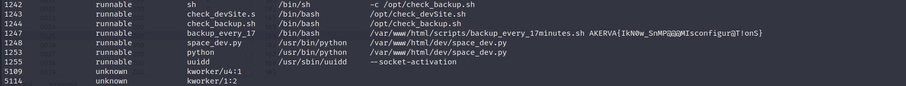
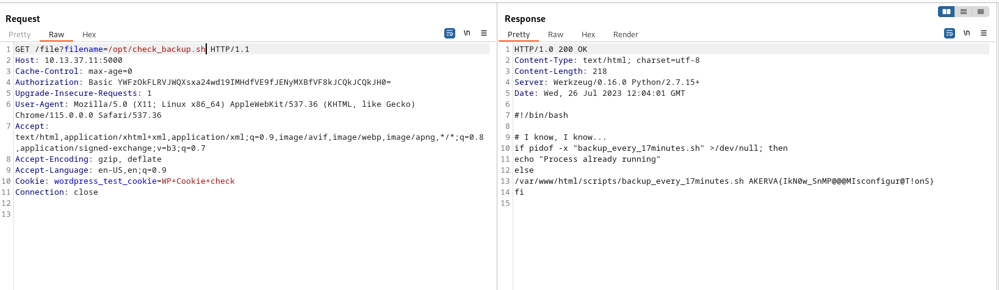
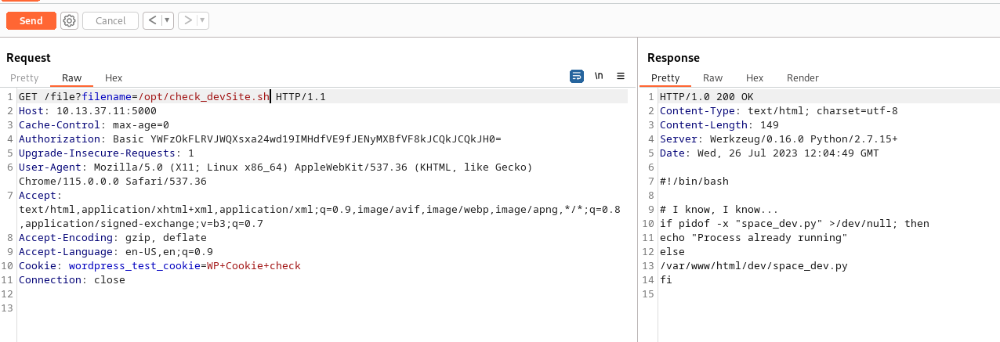
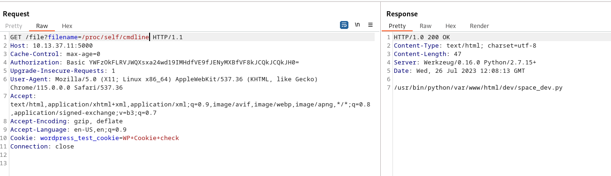
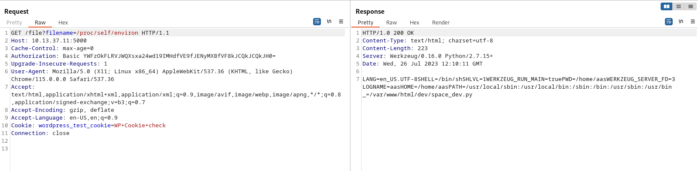
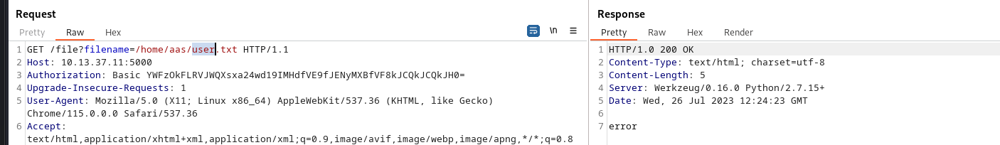
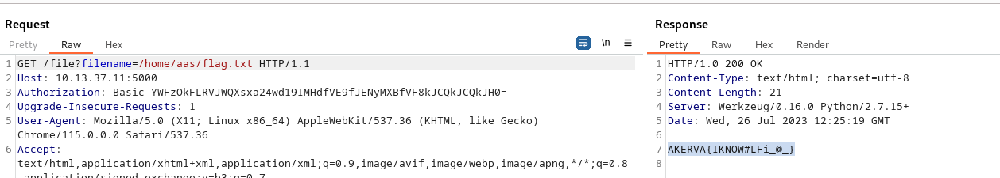
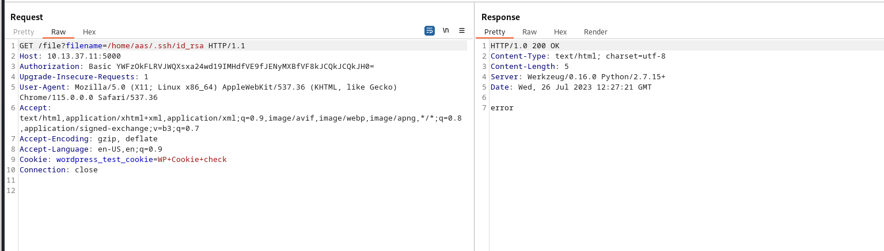

Before going "crazy" on the HTTP service on port 5000 I will go thru the SNMP service on port 161 UDP and check if it can unveil something interesting about the Backend and If any hidden flag? To keep the page slim I will upload the whole log from SMTP enumeration here: [smtp.txt](../../../_resources/smtp.txt)

But from the backlog we could see one of the flags hidden in one of the backup scripts between the running services on the host:

Except that we can see the list of installed packages that don't show us that much and some running scripts on /opt and /html folder that we can target as soon we get a foothold and RCE on the machine.

Let's see if there is anything in here...

Not on the first but what about the dev?

Not much... But let's check for some default ENV path first:

And knowing the base path we can try some manual enumerations:

And by guessing flag.txt we could read it:

But can we see if we can find any SSH keys?

Answer: NO!