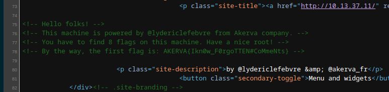

We can start by spinning up a NMAP scan and checking what addresses are open outside from our initial IP given on:


And out initial scan unveil only 2 open ports on TCP service:

```Bash
PORT     STATE SERVICE REASON         VERSION
22/tcp   open  ssh     syn-ack ttl 63 OpenSSH 7.6p1 Ubuntu 4ubuntu0.3 (Ubuntu Linux; protocol 2.0)
| ssh-hostkey: 
|   2048 0d:e4:41:fd:9f:a9:07:4d:25:b4:bd:5d:26:cc:4f:da (RSA)
| ssh-rsa AAAAB3NzaC1yc2EAAAADAQABAAABAQCYsb2eP012xQGyABOzy+gWdxyHIa7xFBkwpLlFOBlYVsJp87Vtve02GudeSUjrz59c7y5nJkLxJAKQRXIObz/jzvCUkTMjH56Mc/3hzdkAzlWg/Gq3vNTyOLODkPPInJGGk1WgovnLcAJtNgdXaO7nYrDqyC8eCjBt7ppsONrz9FmEbiqLQl1m/LYb7Em6X1ZviytlJeH7eEk3UcKX45sNpzaUINdf1PJnXK3CLTB+vEAaieWz1GzCMsuRMphsmnW/d2ObpfZfCMa/NKYpAi0Z6yxUlI/HPEOWNnWO45OZ+7+M8NTxklZCHUbeCDhK8YSnpXtaEFPZvKajqZB+F2tR
|   256 f7:65:51:e0:39:37:2c:81:7f:b5:55:bd:63:9c:82:b5 (ECDSA)
| ecdsa-sha2-nistp256 AAAAE2VjZHNhLXNoYTItbmlzdHAyNTYAAAAIbmlzdHAyNTYAAABBBEKLumcSSQuW4qihcz0zZyca/KvBaXlysVAvY/DqLV0vo4bPoz+PH0qP7vuSlgCIqdiyJKq5JFfJz58e4kujk90=
|   256 28:61:d3:5a:b9:39:f2:5b:d7:10:5a:67:ee:81:a8:5e (ED25519)
|_ssh-ed25519 AAAAC3NzaC1lZDI1NTE5AAAAINAqCT5KghTKGzjImXygZG4vYKvk0akCYJaonX3hXvkE
5000/tcp open  http    syn-ack ttl 63 Werkzeug httpd 0.16.0 (Python 2.7.15+)
|_http-title: Site doesn't have a title (text/html; charset=utf-8).
| http-auth: 
| HTTP/1.0 401 UNAUTHORIZED\x0D
|_  Basic realm=Authentication Required
|_http-server-header: Werkzeug/0.16.0 Python/2.7.15+
| http-methods: 
|_  Supported Methods: HEAD OPTIONS GET
Warning: OSScan results may be unreliable because we could not find at least 1 open and 1 closed port
OS fingerprint not ideal because: Missing a closed TCP port so results incomplete
Aggressive OS guesses: Linux 3.2 - 4.9 (96%), Linux 3.1 (95%), Linux 3.2 (95%), AXIS 210A or 211 Network Camera (Linux 2.6.17) (95%), Linux 3.18 (94%), Linux 3.16 (94%), Linux 5.0 (93%), ASUS RT-N56U WAP (Linux 3.4) (93%), Linux 5.1 (93%), Oracle VM Server 3.4.2 (Linux 4.1) (93%)
No exact OS matches for host (test conditions non-ideal).
TCP/IP fingerprint:
SCAN(V=7.94%E=4%D=7/26%OT=22%CT=%CU=38869%PV=Y%DS=2%DC=T%G=N%TM=64C0D9CE%P=x86_64-pc-linux-gnu)
SEQ(SP=103%GCD=1%ISR=107%TI=Z%CI=Z%II=I%TS=A)
OPS(O1=M53CST11NW7%O2=M53CST11NW7%O3=M53CNNT11NW7%O4=M53CST11NW7%O5=M53CST11NW7%O6=M53CST11)
WIN(W1=7120%W2=7120%W3=7120%W4=7120%W5=7120%W6=7120)
ECN(R=Y%DF=Y%T=40%W=7210%O=M53CNNSNW7%CC=Y%Q=)
T1(R=Y%DF=Y%T=40%S=O%A=S+%F=AS%RD=0%Q=)
T2(R=N)
T3(R=N)
T4(R=Y%DF=Y%T=40%W=0%S=A%A=Z%F=R%O=%RD=0%Q=)
T5(R=Y%DF=Y%T=40%W=0%S=Z%A=S+%F=AR%O=%RD=0%Q=)
T6(R=Y%DF=Y%T=40%W=0%S=A%A=Z%F=R%O=%RD=0%Q=)
T7(R=Y%DF=Y%T=40%W=0%S=Z%A=S+%F=AR%O=%RD=0%Q=)
U1(R=Y%DF=N%T=40%IPL=164%UN=0%RIPL=G%RID=G%RIPCK=G%RUCK=G%RUD=G)
IE(R=Y%DFI=N%T=40%CD=S)
```

The SSH is not that interesting to us since we need a set of valid credentials and on port 5000 a web login in hosted.

Then I decided to check for UDP services as well and seems like we have SNMP service open as well:

```BAsh
┌──(root㉿DESKTOP-1KSM320)-[/home/aleksandar/Downloads]
└─# nmap -sU -F -T4 10.13.37.11                                                                                                                                                                                   
Starting Nmap 7.94 ( https://nmap.org ) at 2023-07-26 11:13 CEST
Stats: 0:00:13 elapsed; 0 hosts completed (1 up), 1 undergoing UDP Scan
UDP Scan Timing: About 35.43% done; ETC: 11:14 (0:00:22 remaining)
Nmap scan report for 10.13.37.11
Host is up (0.032s latency).
Not shown: 56 closed udp ports (port-unreach), 43 open|filtered udp ports (no-response)
PORT    STATE SERVICE
161/udp open  snmp

Nmap done: 1 IP address (1 host up) scanned in 58.17 seconds
```

But now we can roll up our sleeves and start with our attacking process!

* * *

## EDIT:

Somehow the initial NMAP enumeration was fucked up and didn't show the HTTP port on 80/TCP that's why it shows up more about how to approc this machine now:

```BAsh
PORT     STATE SERVICE REASON         VERSION
22/tcp   open  ssh     syn-ack ttl 63 OpenSSH 7.6p1 Ubuntu 4ubuntu0.3 (Ubuntu Linux; protocol 2.0)
| ssh-hostkey: 
|   2048 0d:e4:41:fd:9f:a9:07:4d:25:b4:bd:5d:26:cc:4f:da (RSA)
| ssh-rsa AAAAB3NzaC1yc2EAAAADAQABAAABAQCYsb2eP012xQGyABOzy+gWdxyHIa7xFBkwpLlFOBlYVsJp87Vtve02GudeSUjrz59c7y5nJkLxJAKQRXIObz/jzvCUkTMjH56Mc/3hzdkAzlWg/Gq3vNTyOLODkPPInJGGk1WgovnLcAJtNgdXaO7nYrDqyC8eCjBt7ppsONrz9FmEbiqLQl1m/LYb7Em6X1ZviytlJeH7eEk3UcKX45sNpzaUINdf1PJnXK3CLTB+vEAaieWz1GzCMsuRMphsmnW/d2ObpfZfCMa/NKYpAi0Z6yxUlI/HPEOWNnWO45OZ+7+M8NTxklZCHUbeCDhK8YSnpXtaEFPZvKajqZB+F2tR
|   256 f7:65:51:e0:39:37:2c:81:7f:b5:55:bd:63:9c:82:b5 (ECDSA)
| ecdsa-sha2-nistp256 AAAAE2VjZHNhLXNoYTItbmlzdHAyNTYAAAAIbmlzdHAyNTYAAABBBEKLumcSSQuW4qihcz0zZyca/KvBaXlysVAvY/DqLV0vo4bPoz+PH0qP7vuSlgCIqdiyJKq5JFfJz58e4kujk90=
|   256 28:61:d3:5a:b9:39:f2:5b:d7:10:5a:67:ee:81:a8:5e (ED25519)
|_ssh-ed25519 AAAAC3NzaC1lZDI1NTE5AAAAINAqCT5KghTKGzjImXygZG4vYKvk0akCYJaonX3hXvkE
80/tcp   open  http    syn-ack ttl 63 Apache httpd 2.4.29 ((Ubuntu))
| http-methods: 
|_  Supported Methods: GET HEAD POST OPTIONS
|_http-generator: WordPress 5.4-alpha-47225
|_http-favicon: Unknown favicon MD5: 6A6F2809F13E037DDC8D625B58FDA218
|_http-server-header: Apache/2.4.29 (Ubuntu)
|_http-title: Root of the Universe &#8211; by @lydericlefebvre &amp; @akerva_fr
5000/tcp open  http    syn-ack ttl 63 Werkzeug httpd 0.16.0 (Python 2.7.15+)
| http-auth: 
| HTTP/1.0 401 UNAUTHORIZED\x0D
|_  Basic realm=Authentication Required
|_http-server-header: Werkzeug/0.16.0 Python/2.7.15+
|_http-title: Site doesn't have a title (text/html; charset=utf-8).
| http-methods: 
|_  Supported Methods: HEAD OPTIONS GET
Warning: OSScan results may be unreliable because we could not find at least 1 open and 1 closed port
OS fingerprint not ideal because: Missing a closed TCP port so results incomplete
Aggressive OS guesses: Linux 3.2 - 4.9 (96%), Linux 3.1 (95%), Linux 3.2 (95%), AXIS 210A or 211 Network Camera (Linux 2.6.17) (95%), Linux 3.18 (94%), Linux 5.0 (94%), Linux 3.16 (94%), ASUS RT-N56U WAP (Linux 3.4) (93%), Linux 5.1 (93%), Oracle VM Server 3.4.2 (Linux 4.1) (93%)
No exact OS matches for host (test conditions non-ideal).
TCP/IP fingerprint:
SCAN(V=7.94%E=4%D=7/26%OT=22%CT=%CU=32848%PV=Y%DS=2%DC=T%G=N%TM=64C0F99C%P=x86_64-pc-linux-gnu)
SEQ(SP=104%GCD=1%ISR=108%TI=Z%CI=Z%II=I%TS=A)
OPS(O1=M53CST11NW7%O2=M53CST11NW7%O3=M53CNNT11NW7%O4=M53CST11NW7%O5=M53CST11NW7%O6=M53CST11)
WIN(W1=7120%W2=7120%W3=7120%W4=7120%W5=7120%W6=7120)
ECN(R=Y%DF=Y%T=40%W=7210%O=M53CNNSNW7%CC=Y%Q=)
T1(R=Y%DF=Y%T=40%S=O%A=S+%F=AS%RD=0%Q=)
T2(R=N)
T3(R=N)
T4(R=Y%DF=Y%T=40%W=0%S=A%A=Z%F=R%O=%RD=0%Q=)
T5(R=Y%DF=Y%T=40%W=0%S=Z%A=S+%F=AR%O=%RD=0%Q=)
T6(R=Y%DF=Y%T=40%W=0%S=A%A=Z%F=R%O=%RD=0%Q=)
T7(R=Y%DF=Y%T=40%W=0%S=Z%A=S+%F=AR%O=%RD=0%Q=)
U1(R=Y%DF=N%T=40%IPL=164%UN=0%RIPL=G%RID=G%RIPCK=G%RUCK=G%RUD=G)
IE(R=Y%DFI=N%T=40%CD=S)
```

Now checking the initial page on port 80:

```BAsh
┌──(root㉿DESKTOP-1KSM320)-[/home/aleksandar/Downloads]
└─# dirsearch -u "http://10.13.37.11/"                                                                                                                                                                            

  _|. _ _  _  _  _ _|_    v0.4.3.post1                                                                                                                                                                            
 (_||| _) (/_(_|| (_| )                                                                                                                                                                                           
                                                                                                                                                                                                                  
Extensions: php, aspx, jsp, html, js | HTTP method: GET | Threads: 25 | Wordlist size: 11460

Output File: /home/aleksandar/Downloads/reports/http_10.13.37.11/__23-07-26_12-50-40.txt

Target: http://10.13.37.11/

[12:50:40] Starting:                                                                                                                                                                                              
[12:50:43] 403 -  276B  - /.ht_wsr.txt                                      
[12:50:43] 403 -  276B  - /.htaccess.bak1                                   
[12:50:43] 403 -  276B  - /.htaccess.orig                                   
[12:50:43] 403 -  276B  - /.htaccess.sample
[12:50:43] 403 -  276B  - /.htaccess.save
[12:50:43] 403 -  276B  - /.htaccess_extra                                  
[12:50:43] 403 -  276B  - /.htaccess_orig
[12:50:43] 403 -  276B  - /.htaccess_sc
[12:50:43] 403 -  276B  - /.htaccessBAK
[12:50:43] 403 -  276B  - /.htaccessOLD
[12:50:43] 403 -  276B  - /.htaccessOLD2
[12:50:43] 403 -  276B  - /.htm                                             
[12:50:43] 403 -  276B  - /.html
[12:50:43] 403 -  276B  - /.httr-oauth                                      
[12:50:43] 403 -  276B  - /.htpasswds
[12:50:43] 403 -  276B  - /.htpasswd_test
[12:50:44] 403 -  276B  - /.php                                             
[12:50:54] 301 -  312B  - /backups  ->  http://10.13.37.11/backups/         
[12:50:54] 403 -  276B  - /backups/                                         
[12:50:58] 301 -  308B  - /dev  ->  http://10.13.37.11/dev/                 
[12:50:58] 403 -  276B  - /dev/
[12:51:02] 301 -    0B  - /index.php  ->  http://10.13.37.11/               
[12:51:02] 404 -    9KB - /index.php/login/                                 
[12:51:03] 301 -  315B  - /javascript  ->  http://10.13.37.11/javascript/   
[12:51:03] 200 -    7KB - /license.txt                                      
[12:51:11] 200 -    3KB - /readme.html                                      
[12:51:12] 401 -  458B  - /scripts/cgimail.exe                              
[12:51:12] 401 -  458B  - /scripts/ckeditor/ckfinder/core/connector/aspx/connector.aspx
[12:51:12] 401 -  458B  - /scripts/
[12:51:12] 401 -  458B  - /scripts/ckeditor/ckfinder/core/connector/php/connector.php
[12:51:12] 401 -  458B  - /scripts                                          
[12:51:12] 401 -  458B  - /scripts/ckeditor/ckfinder/core/connector/asp/connector.asp
[12:51:12] 401 -  458B  - /scripts/convert.bas                              
[12:51:12] 401 -  458B  - /scripts/counter.exe
[12:51:12] 401 -  458B  - /scripts/fpcount.exe
[12:51:12] 401 -  458B  - /scripts/iisadmin/ism.dll?http/dir
[12:51:12] 401 -  458B  - /scripts/no-such-file.pl
[12:51:12] 401 -  458B  - /scripts/samples/
[12:51:12] 401 -  458B  - /scripts/root.exe?/c+dir
[12:51:12] 401 -  458B  - /scripts/setup.php
[12:51:12] 401 -  458B  - /scripts/tiny_mce
[12:51:12] 401 -  458B  - /scripts/tinymce
[12:51:12] 401 -  458B  - /scripts/tools/getdrvs.exe
[12:51:12] 401 -  458B  - /scripts/tools/newdsn.exe
[12:51:12] 401 -  458B  - /scripts/samples/search/webhits.exe
[12:51:12] 403 -  276B  - /server-status/                                   
[12:51:12] 403 -  276B  - /server-status
[12:51:20] 301 -  313B  - /wp-admin  ->  http://10.13.37.11/wp-admin/       
[12:51:20] 200 -  560B  - /wp-admin/install.php                             
[12:51:20] 400 -    1B  - /wp-admin/admin-ajax.php
[12:51:20] 500 -    3KB - /wp-admin/setup-config.php                        
[12:51:20] 302 -    0B  - /wp-admin/  ->  http://10.13.37.11/wp-login.php?redirect_to=http%3A%2F%2F10.13.37.11%2Fwp-admin%2F&reauth=1
[12:51:20] 200 -    0B  - /wp-config.php
[12:51:20] 301 -  315B  - /wp-content  ->  http://10.13.37.11/wp-content/   
[12:51:20] 200 -    0B  - /wp-content/
[12:51:20] 403 -  276B  - /wp-content/plugins/akismet/admin.php             
[12:51:20] 403 -  276B  - /wp-content/plugins/akismet/akismet.php           
[12:51:20] 403 -  276B  - /wp-content/upgrade/                              
[12:51:20] 403 -  276B  - /wp-content/uploads/
[12:51:20] 500 -    0B  - /wp-includes/rss-functions.php                    
[12:51:20] 403 -  276B  - /wp-includes/                                     
[12:51:20] 301 -  316B  - /wp-includes  ->  http://10.13.37.11/wp-includes/ 
[12:51:20] 200 -    0B  - /wp-cron.php
[12:51:20] 200 -    2KB - /wp-login.php                                     
[12:51:20] 302 -    0B  - /wp-signup.php  ->  http://10.13.37.11/wp-login.php?action=register
[12:51:21] 405 -   42B  - /xmlrpc.php
```

As we can see we have a Wordpress istance, and we can see the script folder, and the backup and the dev as well.

And checking thru the HTML source code of the initial website we can see the first flag between the comments:

