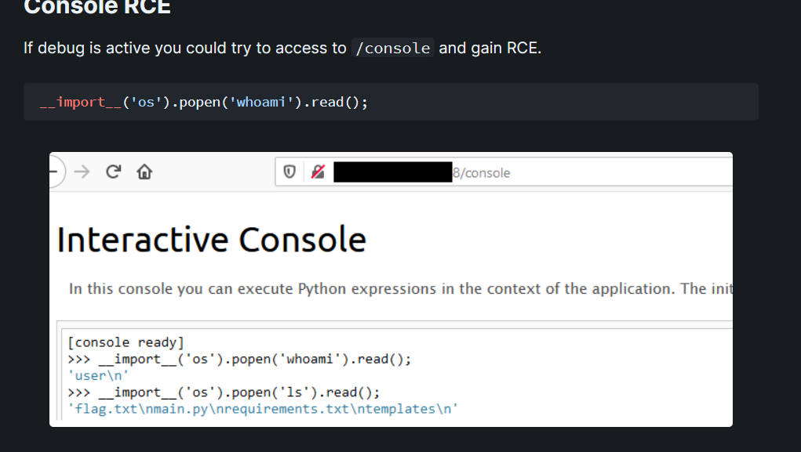
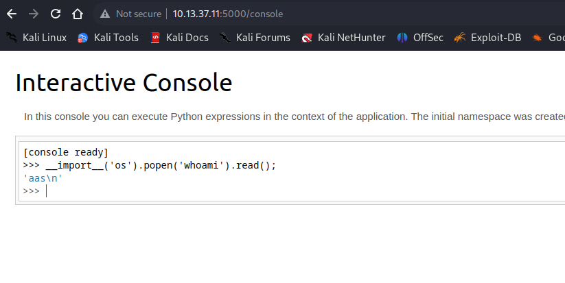
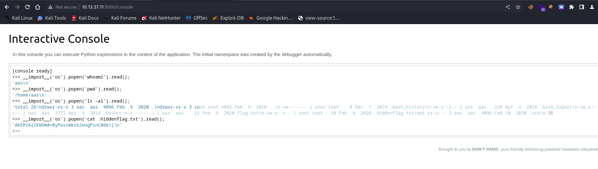
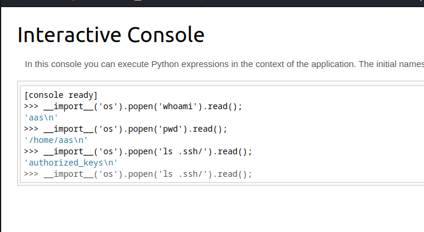
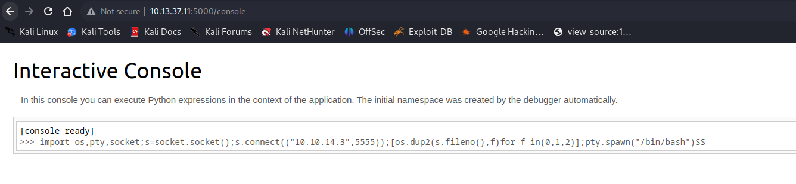
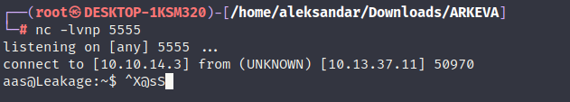

Now that we have a Console running with a valid pincode, we can potentially run some commands on the console with a specially wrapped commando in python format and get exceuted them in the backend server. It would be something similar:

This is extremely dangerous cause it can give us our first foothold into machine and gain a working reverse shell to interact with victim!

Indeed it's working, but before trying to gain a Reverse shell I will try to do some manual enumeration:

And magically we found another flag, plus we can see the .ssh folder, but can we read the id_rsa?

Nah, this means we have to craft a Reverse shell and gain a revshell!

We know that Console handles directly python code, which means it should be easy for us to get a Revshell by executing directly some python code:

And magically we have a shell:

Now we can move forward with enumeration!

* * *