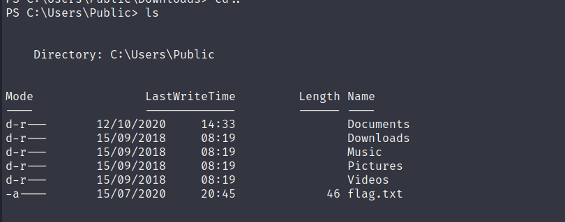
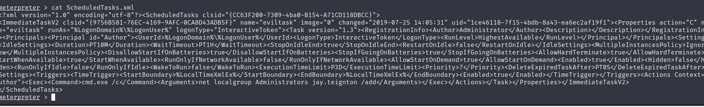
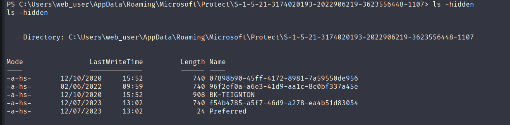
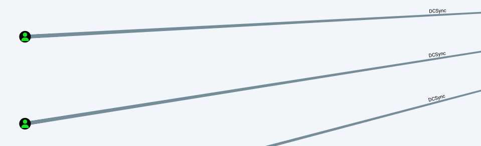
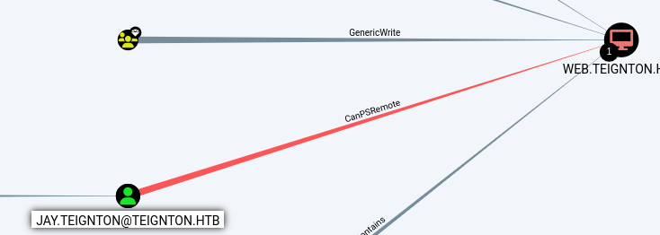
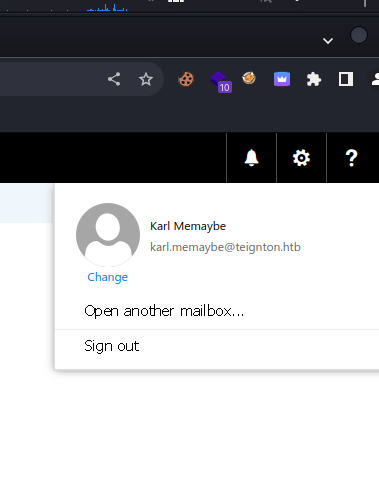
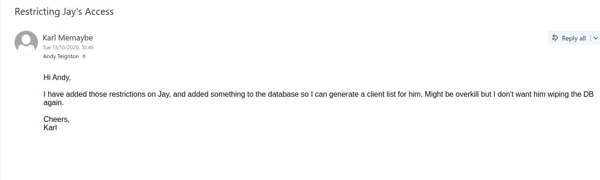

Now that we have our first RCE we can start by checking our permissions:

```Bash
PS C:\> whoami /all

USER INFORMATION
----------------

User Name         SID                                           
================= ==============================================
teignton\web_user S-1-5-21-3174020193-2022906219-3623556448-1107


GROUP INFORMATION
-----------------

Group Name                                  Type             SID          Attributes                                        
=========================================== ================ ============ ==================================================
Everyone                                    Well-known group S-1-1-0      Mandatory group, Enabled by default, Enabled group
BUILTIN\Users                               Alias            S-1-5-32-545 Mandatory group, Enabled by default, Enabled group
BUILTIN\Pre-Windows 2000 Compatible Access  Alias            S-1-5-32-554 Mandatory group, Enabled by default, Enabled group
NT AUTHORITY\BATCH                          Well-known group S-1-5-3      Mandatory group, Enabled by default, Enabled group
CONSOLE LOGON                               Well-known group S-1-2-1      Mandatory group, Enabled by default, Enabled group
NT AUTHORITY\Authenticated Users            Well-known group S-1-5-11     Mandatory group, Enabled by default, Enabled group
NT AUTHORITY\This Organization              Well-known group S-1-5-15     Mandatory group, Enabled by default, Enabled group
LOCAL                                       Well-known group S-1-2-0      Mandatory group, Enabled by default, Enabled group
Authentication authority asserted identity  Well-known group S-1-18-1     Mandatory group, Enabled by default, Enabled group
Mandatory Label\Medium Plus Mandatory Level Label            S-1-16-8448                                                    


PRIVILEGES INFORMATION
----------------------

Privilege Name                Description                    State   
============================= ============================== ========
SeMachineAccountPrivilege     Add workstations to domain     Disabled
SeChangeNotifyPrivilege       Bypass traverse checking       Enabled 
SeIncreaseWorkingSetPrivilege Increase a process working set Disabled


USER CLAIMS INFORMATION
-----------------------

User claims unknown.

Kerberos support for Dynamic Access Control on this device has been disabled.
```

And checking under Desktop we can see a saved password?

```BAsh
PS C:\Users\web_user> cd Desktop
PS C:\Users\web_user\Desktop> ls


    Directory: C:\Users\web_user\Desktop


Mode                LastWriteTime         Length Name                                                                  
----                -------------         ------ ----                                                                  
-a----       20/07/2023     20:27             18 password.txt                                                          


PS C:\Users\web_user\Desktop> cat password.txt
B6rQx_d&RVqvcv2A
PS C:\Users\web_user\Desktop>
```

Next moving around under Public folder we get the Fifth flag:



* * *

## PE

Now we have several way to precede:

- Understand who's password belongs to? (tried password spray on RPD,WINRM, MSSQL but nothing came out)
- Upload WinPeas and check for some more stuff
- Upload Sharphound and check for extra stuff

If I run a exploit suggester with MSFConsole:

```BAsh
#   Name                                                           Potentially Vulnerable?  Check Result
 -   ----                                                           -----------------------  ------------
 1   exploit/windows/local/bypassuac_dotnet_profiler                Yes                      The target appears to be vulnerable.
 2   exploit/windows/local/bypassuac_sdclt                          Yes                      The target appears to be vulnerable.
 3   exploit/windows/local/bypassuac_sluihijack                     Yes                      The target appears to be vulnerable.
 4   exploit/windows/local/cve_2020_1048_printerdemon               Yes                      The target appears to be vulnerable.
 5   exploit/windows/local/cve_2020_1337_printerdemon               Yes                      The target appears to be vulnerable.
 6   exploit/windows/local/cve_2022_21882_win32k                    Yes                      The target appears to be vulnerable.
 7   exploit/windows/local/cve_2022_21999_spoolfool_privesc         Yes                      The target appears to be vulnerable.
 8   exploit/windows/local/ms16_032_secondary_logon_handle_privesc  Yes                      The service is running, but could not be validated.
```

If I run Winpeas:

[winpeas.txt](../../../_resources/winpeas.txt)

Checking the GPO I see a task that can be a leftover from other users:



Then checking on DPAPI we have some master keys:



Now to decrypt them we to find the SID:

```BAsh
PS C:\Users\web_user\AppData\Roaming\Microsoft\Protect\S-1-5-21-3174020193-2022906219-3623556448-1107> get-localuser | Select name,sid
get-localuser | Select name,sid

Name                 SID                                           
----                 ---                                           
Administrator        S-1-5-21-3174020193-2022906219-3623556448-500 
Guest                S-1-5-21-3174020193-2022906219-3623556448-501 
krbtgt               S-1-5-21-3174020193-2022906219-3623556448-502 
jay.teignton         S-1-5-21-3174020193-2022906219-3623556448-1103
andy.teignton        S-1-5-21-3174020193-2022906219-3623556448-1104
karl.memaybe         S-1-5-21-3174020193-2022906219-3623556448-1105
abbie.buckfast       S-1-5-21-3174020193-2022906219-3623556448-1106
web_user             S-1-5-21-3174020193-2022906219-3623556448-1107
```

Then we need to "unhide" secrets:

```Bash
PS C:\Users\web_user\AppData\Roaming\Microsoft\Protect\S-1-5-21-3174020193-2022906219-3623556448-1107> attrib -s -h ./*
attrib -s -h ./*
PS C:\Users\web_user\AppData\Roaming\Microsoft\Protect\S-1-5-21-3174020193-2022906219-3623556448-1107> ls
ls


    Directory: C:\Users\web_user\AppData\Roaming\Microsoft\Protect\S-1-5-21-3174020193-2022906219-3623556448-1107


Mode                LastWriteTime         Length Name                                                                  
----                -------------         ------ ----                                                                  
-a----       12/10/2020     15:52            740 07898b90-45ff-4172-8981-7a59550de956                                  
-a----       02/06/2022     09:59            740 96f2ef0a-a6e3-41d9-aa1c-8c0bf337a45e                                  
-a----       12/10/2020     15:52            908 BK-TEIGNTON                                                           
-a----       12/07/2023     13:02            740 f54b4785-a5f7-46d9-a278-ea4b51d83054                                  
-a----       12/07/2023     13:02             24 Preferred
```

I will dump the result of WinPeas Exploit suggester for better tracking:

```Bash
[?] Windows vulns search powered by Watson(https://github.com/rasta-mouse/Watson)
 [*] OS Version: 1809 (17763)
 [*] Enumerating installed KBs...
 [!] CVE-2019-0836 : VULNERABLE
  [>] https://exploit-db.com/exploits/46718
  [>] https://decoder.cloud/2019/04/29/combinig-luafv-postluafvpostreadwrite-race-condition-pe-with-diaghub-collector-exploit-from-standard-user-to-system/

 [!] CVE-2019-0841 : VULNERABLE
  [>] https://github.com/rogue-kdc/CVE-2019-0841
  [>] https://rastamouse.me/tags/cve-2019-0841/

 [!] CVE-2019-1064 : VULNERABLE
  [>] https://www.rythmstick.net/posts/cve-2019-1064/

 [!] CVE-2019-1130 : VULNERABLE
  [>] https://github.com/S3cur3Th1sSh1t/SharpByeBear

 [!] CVE-2019-1253 : VULNERABLE
  [>] https://github.com/padovah4ck/CVE-2019-1253
  [>] https://github.com/sgabe/CVE-2019-1253

 [!] CVE-2019-1315 : VULNERABLE
  [>] https://offsec.almond.consulting/windows-error-reporting-arbitrary-file-move-eop.html

 [!] CVE-2019-1385 : VULNERABLE
  [>] https://www.youtube.com/watch?v=K6gHnr-VkAg

 [!] CVE-2019-1388 : VULNERABLE
  [>] https://github.com/jas502n/CVE-2019-1388

 [!] CVE-2019-1405 : VULNERABLE
  [>] https://www.nccgroup.trust/uk/about-us/newsroom-and-events/blogs/2019/november/cve-2019-1405-and-cve-2019-1322-elevation-to-system-via-the-upnp-device-host-service-and-the-update-orchestrator-service/                                                                                                                                                                            
  [>] https://github.com/apt69/COMahawk

 [!] CVE-2020-0668 : VULNERABLE
  [>] https://github.com/itm4n/SysTracingPoc

 [!] CVE-2020-0683 : VULNERABLE
  [>] https://github.com/padovah4ck/CVE-2020-0683
  [>] https://raw.githubusercontent.com/S3cur3Th1sSh1t/Creds/master/PowershellScripts/cve-2020-0683.ps1

 [!] CVE-2020-1013 : VULNERABLE
  [>] https://www.gosecure.net/blog/2020/09/08/wsus-attacks-part-2-cve-2020-1013-a-windows-10-local-privilege-escalation-1-day/

 [*] Finished. Found 12 potential vulnerabilities.
```

Possible to write on tasks folder:

```Bash
Folder: C:\windows\tasks
    FolderPerms: Authenticated Users [WriteData/CreateFiles]
   =================================================================================================


    Folder: C:\windows\system32\tasks
    FolderPerms: Authenticated Users [WriteData/CreateFiles]
```

Access the Network Share Clients:

```Bash
???????????? Network Shares
    address (Path: C:\Program Files\Microsoft\Exchange Server\V15\Mailbox\address)
    ADMIN$ (Path: C:\Windows)
    C$ (Path: C:\)
    Clients (Path: C:\Clients) -- Permissions: AllAccess
    IPC$ (Path: )
    NETLOGON (Path: C:\Windows\SYSVOL\sysvol\TEIGNTON.HTB\SCRIPTS)
    SYSVOL (Path: C:\Windows\SYSVOL\sysvol)
```

WEB_USER hash:

```Bash
???????????? Enumerating Security Packages Credentials
  Version: NetNTLMv2
  Hash:    web_user::TEIGNTON:1122334455667788:2f2b8cf3b4c13b452209a80332ae5546:0101000000000000b73e052481c3d901ca7cb9aab46eba84000000000800300030000000000000000000000000210000e94a56c249bf23bb6969449cb208b431b4486ad7416c7bde76ec42fb2d44071f0a00100000000000000000000000000000000000090000000000000000000000
```

And lastly some certs from Exchange:

```Bash
???????????? Enumerating machine and user certificate files
                                                                                                                                                                                             
  Issuer             : CN=WEB
  Subject            : CN=WEB
  ValidDate          : 13/10/2020 00:39:14
  ExpiryDate         : 13/10/2025 00:39:14
  HasPrivateKey      : True
  StoreLocation      : LocalMachine
  KeyExportable      : True
  Thumbprint         : D8B93CEFE1F3C98D24B41A738801498E71BD451F

  Enhanced Key Usages
       Server Authentication
   =================================================================================================

  Issuer             : CN=Microsoft Exchange Server Auth Certificate
  Subject            : CN=Microsoft Exchange Server Auth Certificate
  ValidDate          : 13/10/2020 00:40:35
  ExpiryDate         : 17/09/2025 00:40:35
  HasPrivateKey      : True
  StoreLocation      : LocalMachine
  KeyExportable      : True
  Thumbprint         : 4F250258210116A94B86136CB91169BBF4F82E2A

  Enhanced Key Usages
       Server Authentication
   =================================================================================================

  Issuer             : CN=WMSvc-SHA2-WEB
  Subject            : CN=WMSvc-SHA2-WEB
  ValidDate          : 12/10/2020 19:31:49
  ExpiryDate         : 10/10/2030 19:31:49
  HasPrivateKey      : True
  StoreLocation      : LocalMachine
  KeyExportable      : True
  Thumbprint         : 1C2D29937485B9D7C1C4AD24413D298E08606C6E

  Enhanced Key Usages
       Server Authentication
```

* * *

## AD Analysys

I uploaded SHarphound to perform an AD enumeration as web_user and this is what i found:

- Both Administrator and Jay have DCSync rights:

****

- Only Jay can PS-Remote on the Web server:



This mean if we can get to Jay's account then we can basically get to Admin!

* * *

## Back on Track

Now all the research were lost and I decided to understand which accoun belonged to that password we found in WEB_USER's Desktop file, and after some try/catch I found out that it let us login into OWA as Karl.Memaybe:



We can see that he implemented something into DB to block Jay's account(I guess he means that Linked server we found in preivous step):



Except this mail, Karl don't have any other interesting stuff or have no Read delegations to open other user's email boxes.