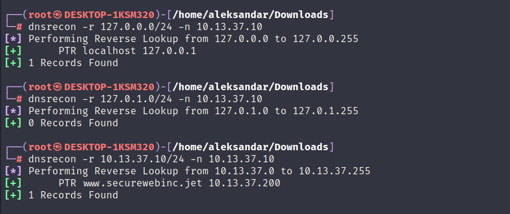

We know from out initial Network scan that DNS service is open to the "outside" on the machine. Even if DNS itself is not a "dangerous" service in terms of purely hacking point it can itself be useful during enumeration time and unveil DNS records that can lead us to find VHOSTS, subdomains and other interesting stuff.

First thing first we can see that the DNS is using  bind on a Ubuntu machine:

```Bash
┌──(root㉿DESKTOP-1KSM320)-[/home/aleksandar/Downloads]
└─# dig version.bind CHAOS TXT @10.13.37.10

; <<>> DiG 9.18.16-1-Debian <<>> version.bind CHAOS TXT @10.13.37.10
;; global options: +cmd
;; Got answer:
;; ->>HEADER<<- opcode: QUERY, status: NOERROR, id: 33572
;; flags: qr aa rd; QUERY: 1, ANSWER: 1, AUTHORITY: 1, ADDITIONAL: 1
;; WARNING: recursion requested but not available

;; OPT PSEUDOSECTION:
; EDNS: version: 0, flags:; udp: 4096
;; QUESTION SECTION:
;version.bind.                  CH      TXT

;; ANSWER SECTION:
version.bind.           0       CH      TXT     "9.10.3-P4-Ubuntu"

;; AUTHORITY SECTION:
version.bind.           0       CH      NS      version.bind.

;; Query time: 29 msec
;; SERVER: 10.13.37.10#53(10.13.37.10) (UDP)
;; WHEN: Thu Jul 27 10:14:17 CEST 2023
;; MSG SIZE  rcvd: 84
```

Now the running version of BIND is quite old and there are some CVE out there that may lead to a DOS ex this one ([CVE-2015-5477](https://www.exploit-db.com/exploits/37721)) but again our scope is to find a way in and not to disrupt any service or mean any harm to the daily operations.

Next we could try to perform a Zone trasnsfer but we would need to know atleas the Domain used:

```Bash
┌──(root㉿DESKTOP-1KSM320)-[/home/aleksandar/Downloads]
└─# dig axfr @10.13.37.10 

; <<>> DiG 9.18.16-1-Debian <<>> axfr @10.13.37.10
; (1 server found)
;; global options: +cmd
;; Query time: 30 msec
;; SERVER: 10.13.37.10#53(10.13.37.10) (UDP)
;; WHEN: Thu Jul 27 10:19:46 CEST 2023
;; MSG SIZE  rcvd: 28
```

Indeed it fails without shipping the domain name.

I will come back when I find the FQDN and do through enumeration.

* * *

## Dig Deeper

Here I missed to enumerate more deeply, indeed the solution was to check for reverse lookup and that should unveil the FQDN and then we could attempt to do a Zone transfer since a SOA record is available.



We can use DIG:

```Bash
┌──(root㉿DESKTOP-1KSM320)-[/home/aleksandar/Downloads]
└─# dig @10.13.37.10 -x 10.13.37.10

; <<>> DiG 9.18.16-1-Debian <<>> @10.13.37.10 -x 10.13.37.10
; (1 server found)
;; global options: +cmd
;; Got answer:
;; ->>HEADER<<- opcode: QUERY, status: NXDOMAIN, id: 20298
;; flags: qr aa rd; QUERY: 1, ANSWER: 0, AUTHORITY: 1, ADDITIONAL: 1
;; WARNING: recursion requested but not available

;; OPT PSEUDOSECTION:
; EDNS: version: 0, flags:; udp: 4096
;; QUESTION SECTION:
;10.37.13.10.in-addr.arpa.      IN      PTR

;; AUTHORITY SECTION:
37.13.10.in-addr.arpa.  604800  IN      SOA     www.securewebinc.jet. securewebinc.jet. 3 604800 86400 2419200 604800

;; Query time: 39 msec
;; SERVER: 10.13.37.10#53(10.13.37.10) (UDP)
;; WHEN: Thu Jul 27 11:25:36 CEST 2023
;; MSG SIZE  rcvd: 109
```

And doing so we could do a reverse lookup of the DNS server itself to unveil the FQDN. Now we can add that to our machine and do a zone transfer.

If we ask for any DNS record we don't get that much more:

```Bash
┌──(root㉿DESKTOP-1KSM320)-[/home/aleksandar/Downloads]
└─# dig ANY @10.13.37.10 securewebinc.jet                                                                                                                                                    

; <<>> DiG 9.18.16-1-Debian <<>> ANY @10.13.37.10 securewebinc.jet
; (1 server found)
;; global options: +cmd
;; Got answer:
;; ->>HEADER<<- opcode: QUERY, status: NOERROR, id: 32634
;; flags: qr aa rd; QUERY: 1, ANSWER: 3, AUTHORITY: 0, ADDITIONAL: 2
;; WARNING: recursion requested but not available

;; OPT PSEUDOSECTION:
; EDNS: version: 0, flags:; udp: 4096
;; QUESTION SECTION:
;securewebinc.jet.              IN      ANY

;; ANSWER SECTION:
securewebinc.jet.       604800  IN      SOA     www.securewebinc.jet. securewebinc.jet. 2 604800 86400 2419200 604800
securewebinc.jet.       604800  IN      NS      www.securewebinc.jet.
securewebinc.jet.       604800  IN      A       10.13.37.10

;; ADDITIONAL SECTION:
www.securewebinc.jet.   604800  IN      A       10.13.37.10

;; Query time: 59 msec
;; SERVER: 10.13.37.10#53(10.13.37.10) (TCP)
;; WHEN: Thu Jul 27 11:28:19 CEST 2023
;; MSG SIZE  rcvd: 131
```

And same if we attempt to do a domain zone transfer we don't get that much more:

```BAsh
┌──(root㉿DESKTOP-1KSM320)-[/home/aleksandar/Downloads]
└─# dig AXFR @10.13.37.10 securewebinc.jet

; <<>> DiG 9.18.16-1-Debian <<>> AXFR @10.13.37.10 securewebinc.jet
; (1 server found)
;; global options: +cmd
securewebinc.jet.       604800  IN      SOA     www.securewebinc.jet. securewebinc.jet. 2 604800 86400 2419200 604800
securewebinc.jet.       604800  IN      NS      www.securewebinc.jet.
securewebinc.jet.       604800  IN      A       10.13.37.10
www.securewebinc.jet.   604800  IN      A       10.13.37.10
securewebinc.jet.       604800  IN      SOA     www.securewebinc.jet. securewebinc.jet. 2 604800 86400 2419200 604800
;; Query time: 29 msec
;; SERVER: 10.13.37.10#53(10.13.37.10) (TCP)
;; WHEN: Thu Jul 27 11:29:25 CEST 2023
;; XFR size: 5 records (messages 1, bytes 167)
```