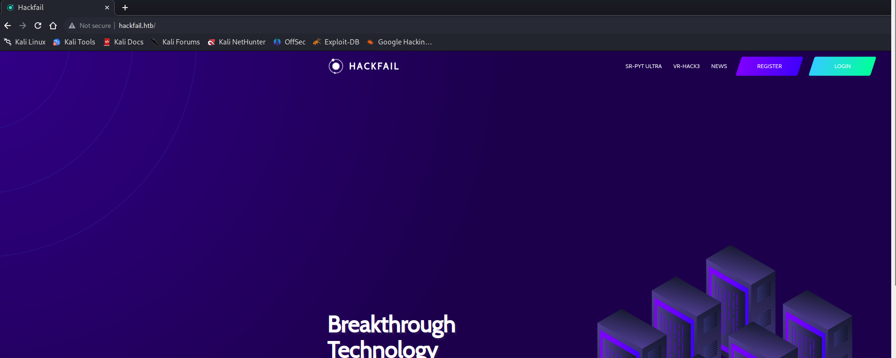
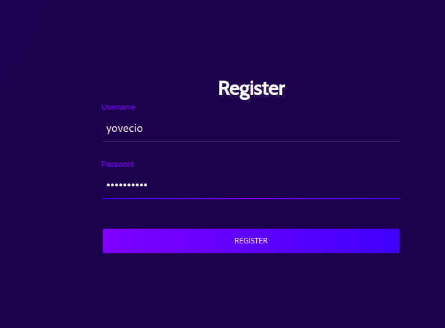
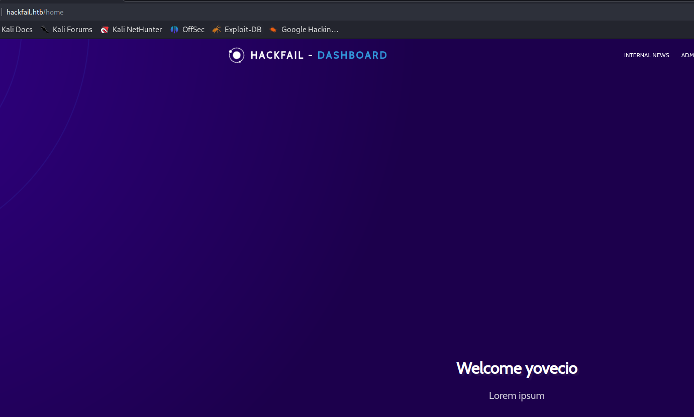
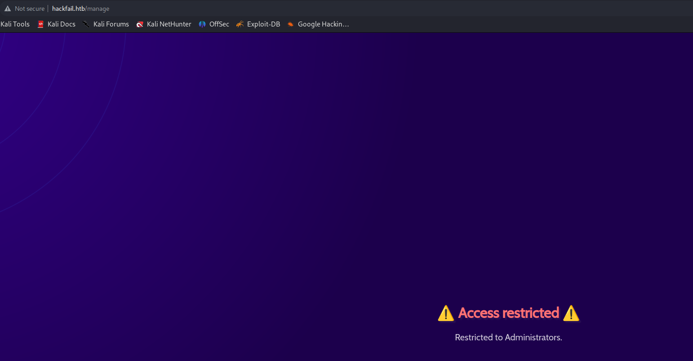
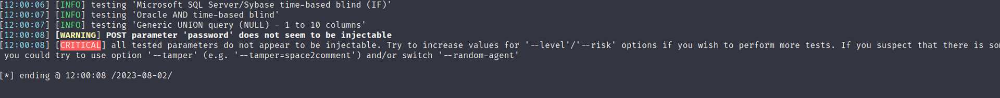
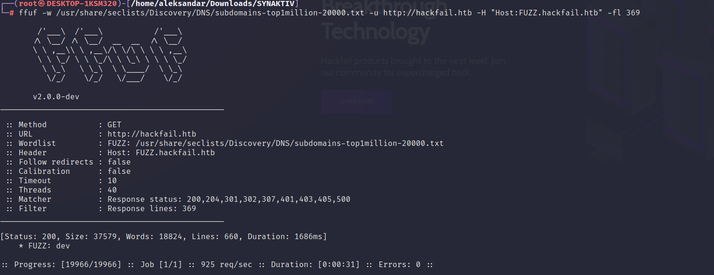

Now that we added the Domain to resolve IP in our local DNS server we can see the real VHOST what is all about:



I checked source code of the several pages hosted in the website but nothing really came out so far so I will create an account and login to inspect from the inside.





And now from the dashboard seems like we can't administer the pages since we need to be admins:



But we can see the news posts:


So far I can't see anything strange here so I will perform some basic enumeration like:

- Testing the login page for some SQLi but it's failing



- Then I will check for hidden subdomains/VHOSTS and we can find a dev subdomain



- Lastly I will check for hidden Webdirectories on the main website

```Bash
┌──(root㉿DESKTOP-1KSM320)-[/home/aleksandar/Downloads/SYNAKTIV]
└─# ffuf -w /usr/share/seclists/Discovery/Web-Content/directory-list-2.3-small.txt -u http://hackfail.htb/FUZZ -fl 70

        /'___\  /'___\           /'___\       
       /\ \__/ /\ \__/  __  __  /\ \__/       
       \ \ ,__\\ \ ,__\/\ \/\ \ \ \ ,__\      
        \ \ \_/ \ \ \_/\ \ \_\ \ \ \ \_/      
         \ \_\   \ \_\  \ \____/  \ \_\       
          \/_/    \/_/   \/___/    \/_/       

       v2.0.0-dev
________________________________________________

 :: Method           : GET
 :: URL              : http://hackfail.htb/FUZZ
 :: Wordlist         : FUZZ: /usr/share/seclists/Discovery/Web-Content/directory-list-2.3-small.txt
 :: Follow redirects : false
 :: Calibration      : false
 :: Timeout          : 10
 :: Threads          : 40
 :: Matcher          : Response status: 200,204,301,302,307,401,403,405,500
 :: Filter           : Response lines: 70
________________________________________________

[Status: 301, Size: 310, Words: 20, Lines: 10, Duration: 44ms]
    * FUZZ: img

[Status: 301, Size: 310, Words: 20, Lines: 10, Duration: 39ms]
    * FUZZ: css

[Status: 301, Size: 309, Words: 20, Lines: 10, Duration: 49ms]
    * FUZZ: js

[Status: 200, Size: 2146, Words: 906, Lines: 66, Duration: 4643ms]
    * FUZZ: home

[Status: 302, Size: 250, Words: 60, Lines: 12, Duration: 67ms]
    * FUZZ: logout

[Status: 301, Size: 312, Words: 20, Lines: 10, Duration: 53ms]
    * FUZZ: fonts

[WARN] Caught keyboard interrupt (Ctrl-C)
```

Nothing that much I guess we have to move to the dev site instead.

* * *

## Poking the Dev thingy..

I created a new account and logged in but seems like the website is exactly the same, even during fuzzing time seems like some kind of throttling is in place:

