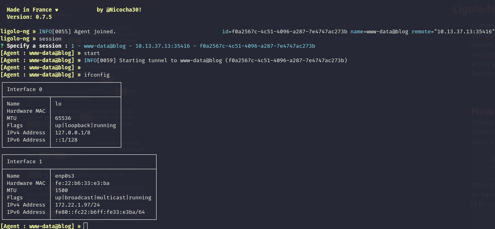

Now since i know that the blog machine has the following subnet, it is time to setup a pivoting:

```bash
www-data@blog:/var/www/blog/public$ ip a
ip a
1: lo: <LOOPBACK,UP,LOWER_UP> mtu 65536 qdisc noqueue state UNKNOWN group default qlen 1000
    link/loopback 00:00:00:00:00:00 brd 00:00:00:00:00:00
    inet 127.0.0.1/8 scope host lo
       valid_lft forever preferred_lft forever
    inet6 ::1/128 scope host 
       valid_lft forever preferred_lft forever
13: enp0s3@if14: <BROADCAST,MULTICAST,UP,LOWER_UP> mtu 1500 qdisc noqueue state UP group default qlen 1000
    link/ether fe:22:b6:33:e3:ba brd ff:ff:ff:ff:ff:ff link-netnsid 0
    inet 172.22.1.97/24 brd 172.22.1.255 scope global enp0s3
       valid_lft forever preferred_lft forever
    inet6 fe80::fc22:b6ff:fe33:e3ba/64 scope link 
       valid_lft forever preferred_lft forever
www-data@blog:/var/www/blog/public$ 

```



And for some reasons I had to use a static binary of NMAP in order to see what machines where open don't know why:  
<br/>