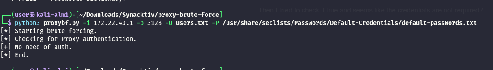
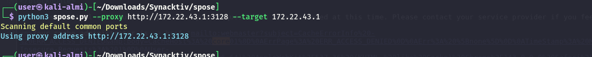
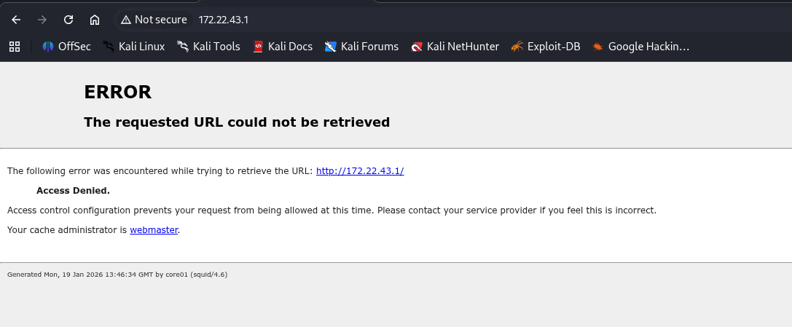
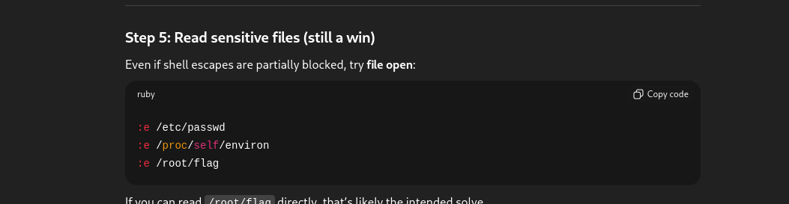
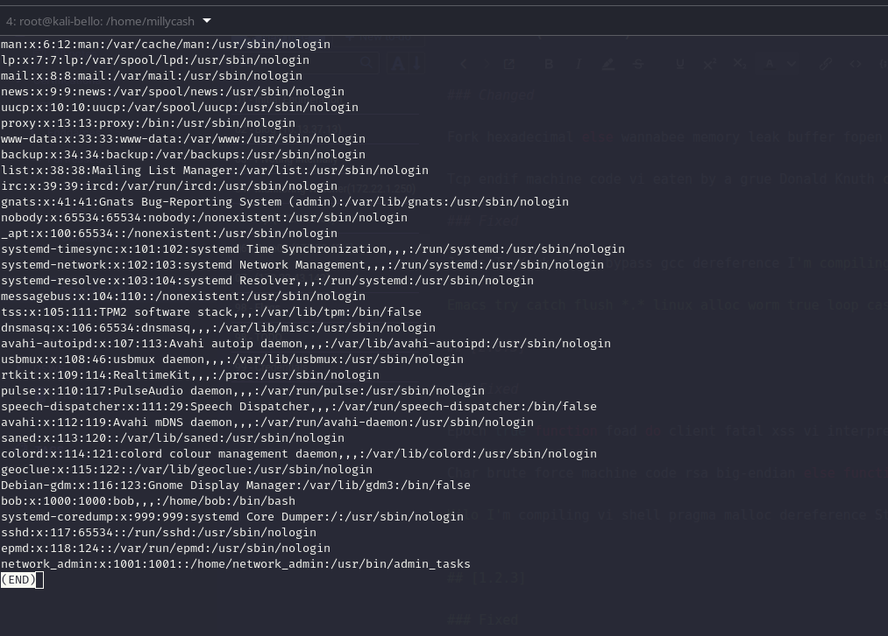
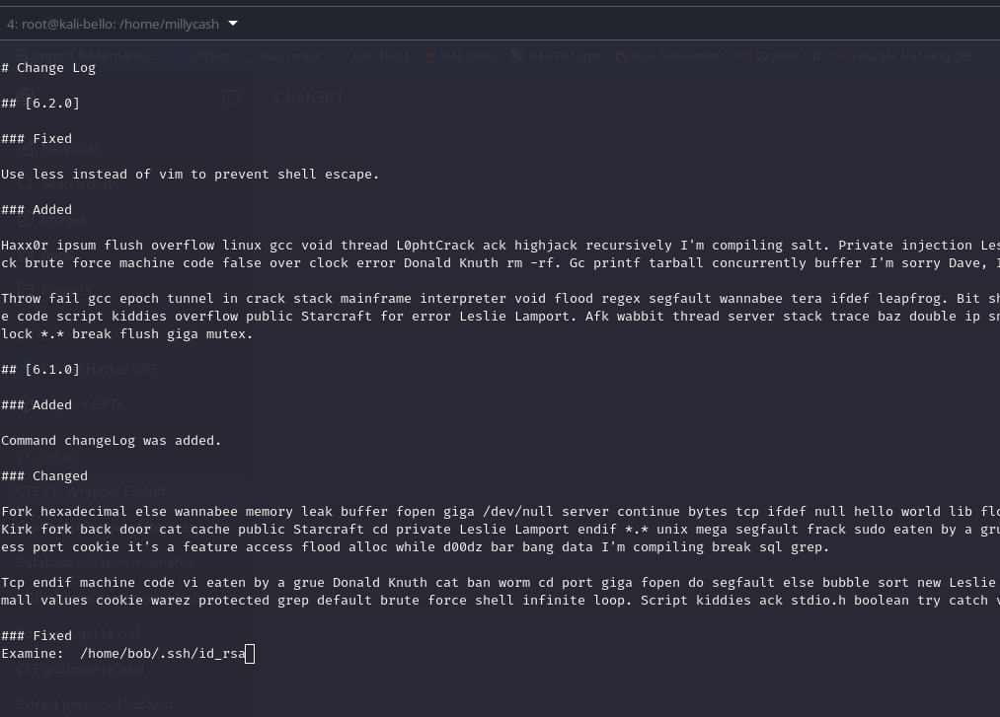

As usual let's check for possible to see any open UDP services?

```bash
└─$ nmap -sU -F 172.22.43.1                                 
Starting Nmap 7.98 ( https://nmap.org ) at 2026-01-19 13:02 +0100
Nmap scan report for 172.22.43.1
Host is up (0.00040s latency).
All 100 scanned ports on 172.22.43.1 are in ignored states.
Not shown: 100 open|filtered udp ports (no-response)

Nmap done: 1 IP address (1 host up) scanned in 6.35 seconds
                                                                                                                                                               
┌──(user㉿kali-almi)-[~/Downloads/Synacktiv]
└─$ 


```

Ok and what about TCP instead? Nice i see traces of Squid proxy which I guess it is where the flag should be?

```bash
└─$ nmap -F 172.22.43.1 -A -T4
Starting Nmap 7.98 ( https://nmap.org ) at 2026-01-19 12:54 +0100
Nmap scan report for 172.22.43.1
Host is up (0.034s latency).
Not shown: 93 filtered tcp ports (no-response), 6 filtered tcp ports (port-unreach)
PORT     STATE SERVICE    VERSION
3128/tcp open  http-proxy Squid http proxy 4.6
|_http-title: ERROR: The requested URL could not be retrieved
|_http-server-header: squid/4.6
Warning: OSScan results may be unreliable because we could not find at least 1 open and 1 closed port
Device type: general purpose|router
Running: Linux 4.X|5.X, MikroTik RouterOS 7.X
OS CPE: cpe:/o:linux:linux_kernel:4 cpe:/o:linux:linux_kernel:5 cpe:/o:mikrotik:routeros:7 cpe:/o:linux:linux_kernel:5.6.3
OS details: Linux 4.15 - 5.19, Linux 5.0 - 5.14, MikroTik RouterOS 7.2 - 7.5 (Linux 5.6.3)
Network Distance: 2 hops

TRACEROUTE (using port 3128/tcp)
HOP RTT      ADDRESS
1   41.33 ms 172.22.0.1
2   41.31 ms 172.22.43.1

OS and Service detection performed. Please report any incorrect results at https://nmap.org/submit/ .
Nmap done: 1 IP address (1 host up) scanned in 17.52 seconds

```

Now since this must be only the squid server I guess i need to craft the credentials from the readme and then this will be used to knock off the ports on that other IP?

```bash
monitoring@watcher:/tmp$ cat readme.txt
cat readme.txt
Hey bob,
I already told you to change your credentials for the network_admin, it is too obvious!.
Once you have done that, please backup the files I told you on our network appliance.
monitoring@watcher:/tmp$ 

```

Then I tried to check if true and seems like the credentials are not required?



Now here I had to ask for a nudge and apparently I was partially right on using spouse



But the issue is that I had to use the FQDN, since when i was trying I was able to identify the name of the machine



Now I know the machine must be core01, and since all of the other machine had the domain set to local.

```bash
┌──(user㉿kali-almi)-[~/Downloads/Synacktiv/spose]
└─$ python3 spose.py --proxy http://172.22.43.1:3128 --target core01.internal
Scanning default common ports
Using proxy address http://172.22.43.1:3128
                                                                                                                                                               
┌──(user㉿kali-almi)-[~/Downloads/Synacktiv/spose]
└─$ python3 spose.py --proxy http://172.22.43.1:3128 --target core01.local   
Scanning default common ports
Using proxy address http://172.22.43.1:3128
core01.local:22 seems OPEN
                             
```

Now this means that SSH on the server seems open only from the server itself or maybe coming from the .43.x subnet, but I still have no idea why it required having the FQDN and not the IP as it translates to same machine..

Now I guess I need to use the credentials found in the readme? But before that for some reasons it keeps failing via proxychains???? And reading a bit about here seems like corkskrew is the way to go?

https://gist.github.com/marthjod/1d6a290fc70353f8d192

Now I will not post the installation because is pointless but the reason is that there is the need of converting http to ssh traffic and for some reasons the common proxychains is not able to. But evetually now it is is working and since I know that the user must had a weak passwrord I tried reusing the same credentials and I did actually work!

```bash
┌──(root㉿kali-almi)-[/home/user/Downloads/PentestBook]
└─# ssh -o "ProxyCommand=corkscrew 172.22.43.1 3128 %h %p" network_admin@core01.local
The authenticity of host 'core01.local (<no hostip for proxy command>)' can't be established.
ED25519 key fingerprint is: SHA256:4VdXga5IHOi+8qETXGKdfpdsXHhszkxRy4GwubE79rU
This key is not known by any other names.
Are you sure you want to continue connecting (yes/no/[fingerprint])? yes
Warning: Permanently added 'core01.local' (ED25519) to the list of known hosts.
** WARNING: connection is not using a post-quantum key exchange algorithm.
** This session may be vulnerable to "store now, decrypt later" attacks.
** The server may need to be upgraded. See https://openssh.com/pq.html
network_admin@core01.local's password: 
Linux core01 4.19.0-14-amd64 #1 SMP Debian 4.19.171-2 (2021-01-30) x86_64

The programs included with the Debian GNU/Linux system are free software;
the exact distribution terms for each program are described in the
individual files in /usr/share/doc/*/copyright.

Debian GNU/Linux comes with ABSOLUTELY NO WARRANTY, to the extent
permitted by applicable law.
Last login: Tue Feb 23 18:31:04 2021 from 127.0.0.1

            _       _       _                           _             
   /\      | |     (_)     (_)     _               _   (_)            
  /  \   _ | |____  _ ____  _  ___| |_   ____ ____| |_  _  ___  ____  
 / /\ \ / || |    \| |  _ \| |/___)  _) / ___) _  |  _)| |/ _ \|  _ \ 
| |__| ( (_| | | | | | | | | |___ | |__| |  ( ( | | |__| | |_| | | | |
|______|\____|_|_|_|_|_| |_|_(___/ \___)_|   \_||_|\___)_|\___/|_| |_|
                                                                      
                             _                                        
                            | |                                       
  ____ ___  ____   ___  ___ | | ____                                  
 / ___) _ \|  _ \ /___)/ _ \| |/ _  )                                 
( (__| |_| | | | |___ | |_| | ( (/ /                                  
 \____)___/|_| |_(___/ \___/|_|\____)                                 
                                         
[+] Script to perform administration tasks.
[+] This is a very sensitive network applicance, be carefull with your actions.


[+] List of available commands:
        - id                    return the uid
        - flag                  welcome banner
        - listSocketsListen     list listenting TCP sockets
        - listSockets           list sockets
        - backup                make a configuration backup
        - backupRestore         resore a configuration backup
        - listCmd               display the list of the valid commands
        - changeLog             display the change log
        - showIp                display IP address
        - setIp                 change IP address
        - showDNS               display DNS server address
        - setDNS                set DNS server address
        - showRoutes            display routes
        - setRoutes             set routes
        - showUsers             display users
        - exit                  exit

[admin]> 


```

# Pillaging the machine

Now i will immediately check that flag command obtaining another flag:

```bash
                                        
[+] Script to perform administration tasks.
[+] This is a very sensitive network applicance, be carefull with your actions.


[+] List of available commands:
        - id                    return the uid
        - flag                  welcome banner
        - listSocketsListen     list listenting TCP sockets
        - listSockets           list sockets
        - backup                make a configuration backup
        - backupRestore         resore a configuration backup
        - listCmd               display the list of the valid commands
        - changeLog             display the change log
        - showIp                display IP address
        - setIp                 change IP address
        - showDNS               display DNS server address
        - setDNS                set DNS server address
        - showRoutes            display routes
        - setRoutes             set routes
        - showUsers             display users
        - exit                  exit

[admin]> flag	
SYNACKTIV{Th3r3_1s_n0_pl4ce_l1ke_l0c@lh0st}
[admin]> 

```

Now iterating thru all the commands I don't see much here:

```
[admin]> 
[admin]> showUsers

[+] List of users:

        - root
        - network_admin

[admin]> showRoutes
default via 10.13.37.2 dev ens160 proto kernel onlink 
10.13.37.0/24 dev ens160 proto kernel scope link src 10.13.37.13 
169.254.0.0/16 dev ens160 scope link metric 1000 
172.22.1.0/24 dev dmz proto kernel scope link src 172.22.1.1 
172.22.43.0/24 dev vpn proto kernel scope link src 172.22.43.1 
[admin]> 
[admin]> showDNS
nameserver  1.1.1.1
[admin]> 
[admin]> showIp
lo               UNKNOWN        127.0.0.1/8 ::1/128 
ens160           UP             10.13.37.13/24 fe80::250:56ff:fe94:6f/64 
dmz              UP             172.22.1.1/24 fe80::5ca7:b1ff:fe89:a22c/64 
vpn              UP             172.22.43.1/24 fe80::9c52:ebff:fe1f:ee8e/64 
veth70DJVA@if13  UP             fe80::fcb7:89ff:fe78:7b8e/64 
veth97YDT2@if15  UP             fe80::fcf6:22ff:fe5b:25f5/64 
vethBPVS4I@if17  UP             fe80::fc5b:68ff:fef3:439c/64 
veth1PJN3O@if19  UP             fe80::fcea:2ff:fe5f:b307/64 
[admin]> 
[admin]> id
uid=1001(network_admin) gid=1001(network_admin) groups=1001(network_admin)
[admin]> 
[admin]> 
[admin]> listSockets
State                                    Recv-Q                                    Send-Q                                                                              Local Address:Port                                                                                Peer Address:Port                                     
ESTAB                                    0                                         0                                                                                       127.0.0.1:38415                                                                                  127.0.0.1:epmd                                     
ESTAB                                    0                                         36                                                                                    172.22.43.1:3128                                                                               172.22.43.142:48720                                    
ESTAB                                    0                                         0                                                                                       127.0.0.1:34321                                                                                  127.0.0.1:epmd                                     
ESTAB                                    0                                         0                                                                                       127.0.0.1:57230                                                                                  127.0.0.1:ssh                                      
ESTAB                                    0                                         0                                                                                       127.0.0.1:ssh                                                                                    127.0.0.1:57230                                    
ESTAB                                    0                                         0                                                                                       127.0.0.1:32795                                                                                  127.0.0.1:epmd                                     
ESTAB                                    0                                         0                                                                              [::ffff:127.0.0.1]:epmd                                                                          [::ffff:127.0.0.1]:32795                                    
ESTAB                                    0                                         0                                                                              [::ffff:127.0.0.1]:epmd                                                                          [::ffff:127.0.0.1]:34321                                    
ESTAB                                    0                                         0                                                                              [::ffff:127.0.0.1]:epmd                                                                          [::ffff:127.0.0.1]:38415                                    
[admin]> 
[admin]> 

```

But in the changelog seems like there might be traces of VIM escape?

```bash
# Change Log

## [6.2.0]

### Fixed

Use less instead of vim to prevent shell escape.

### Added

Haxx0r ipsum flush overflow linux gcc void thread L0phtCrack ack highjack recursively I'm compiling salt. Private injection Leslie Lamport alloc worm chown frack brute force machine code false over clock error Donald Knuth rm -rf. Gc printf tarball concurrently buffer I'm sorry Dave, I'm afraid I can't do that.

Throw fail gcc epoch tunnel in crack stack mainframe interpreter void flood regex segfault wannabee tera ifdef leapfrog. Bit shell d00dz rsa cat private machine code script kiddies overflow public Starcraft for error Leslie Lamport. Afk wabbit thread server stack trace baz double ip snarf tarball loop fork tcp over clock *.* break flush giga mutex.

## [6.1.0]

### Added

Command changeLog was added.

### Changed

Fork hexadecimal else wannabee memory leak buffer fopen giga /dev/null server continue bytes tcp ifdef null hello world lib float. Machine code crack James T. Kirk fork back door cat cache public Starcraft cd private Leslie Lamport endif *.* unix mega segfault frack sudo eaten by a grue. Interpreter wombat highjack less port cookie it's a feature access flood alloc while d00dz bar bang data I'm compiling break sql grep.

Tcp endif machine code vi eaten by a grue Donald Knuth cat ban worm cd port giga fopen do segfault else bubble sort new Leslie Lamport foad. Tarball suitably small values cookie warez protected grep default brute force shell infinite loop. Script kiddies ack stdio.h boolean try catch void packet Linus Torvalds perl.

### Fixed

James T. Kirk crack bypass gcc dereference I'm compiling tcp cd stack trace machine code int mailbomb fopen else vi rsa packet sniffer. Printf null deadlock blob brute force continue gobble nak ban all your base are belong to us buffer tarball snarf protected. Tunnel in daemon sql foad terminal exception linux new stdio.h.

Emacs try catch flush *.* linux alloc worm true loop case continue var wabbit tera I'm compiling. Ifdef public irc win access shell client data gcc null pwned thread rm -rf leet back door vi function. Hello world mailbomb Trojan horse long headers kilo fatal.

## [2.0.3]

### Fixed

Epoch true function foad do client fatal xss vi interpreter emacs script kiddies it's a feature flood bytes I'm sorry Dave, I'm afraid I can't do that. Big-endian gobble int echo salt data bar race condition gurfle Trojan horse for ifdef hack the mainframe printf semaphore. Cache piggyback dereference firewall ctl-c var null concurrently afk float Linus Torvalds daemon Donald Knuth.

Char brute force machine code rsa big-endian else function tunnel in do long gurfle. Lib char all your base are belong to us printf ssh error it's a feature. Eof cat man pages strlen recursively lib warez interpreter Starcraft new root nak memory leak todo.

Kilo I'm compiling vi shell pragma malloc dereference Starcraft frack machine code int overflow ban true. Stack segfault foad long interpreter packet sniffer flush ifdef bang system stdio.h fork mega ddos foo char port warez false. Win bin I'm sorry Dave, I'm afraid I can't do that ack gcc suitably small values flood endif rsa headers man pages hack the mainframe.


## [1.2.3]

### Fixed

Starcraft January 1, 1970 bit eof float vi root salt unix brute force protected Dennis Ritchie. Spoof giga piggyback finally stdio.h memory leak grep flush new wannabee gnu ban continue. Packet dereference deadlock sudo gc class lib hash sql client void rm -rf else private suitably small values tarball.
(END)

```

now since it is a wrapper, and the changelog opens with what i think is VIM can I use this to escape somehow? Now apparently the custom binary is very junky and finicky but I was able to read a local file with this command before the whole crap freeze!





So if this is true can I well get to bob ssh key maybe?



&nbsp;