## RUSTSCAN:
`PORT   STATE SERVICE REASON          VERSION
21/tcp open  ftp     syn-ack ttl 127 Microsoft ftpd
| ftp-syst: 
|_  SYST: Windows_NT
| ftp-anon: Anonymous FTP login allowed (FTP code 230)
|_Can't get directory listing: PASV failed: 425 Cannot open data connection.
23/tcp open  telnet? syn-ack ttl 127
80/tcp open  http    syn-ack ttl 127 Microsoft IIS httpd 7.5
|_http-server-header: Microsoft-IIS/7.5
|_http-title: MegaCorp
| http-methods: 
|   Supported Methods: OPTIONS TRACE GET HEAD POST
|_  Potentially risky methods: TRACE
Warning: OSScan results may be unreliable because we could not find at least 1 open and 1 closed port
`
* * *
## FTP:
So far we can surf the ftp as guest:
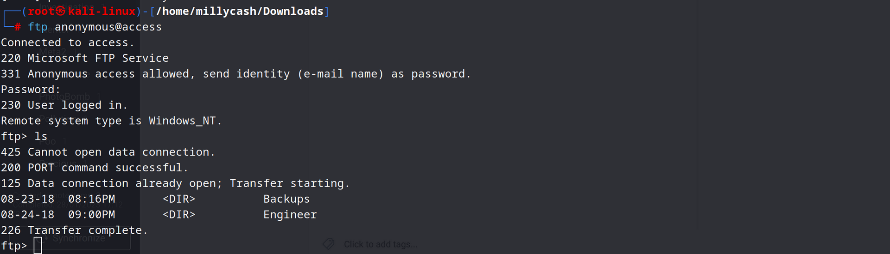
Tring to download anything, it's failing:
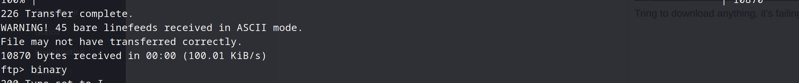
The solutions is to use binary mode: https://stackoverflow.com/questions/37187986/bare-linefeeds-received-in-ascii-mode-warning-when-listing-directory-on-my-ftp

Now we have a zip file and a Access database?
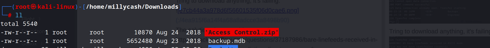

The zip file seems having a pst file that is password protected and an Access db that needs to be mounted..
To make my life easier i mounted the DB in my Windows machine with a Access from O365 suite and exported all users from the USERINFO table.
`John: 020481
Mark: 010101
Sunita: 000000
Mary: 666666
Monica: 123321`

Opening the file in linux shows that i've missed a table that have something more interesting:
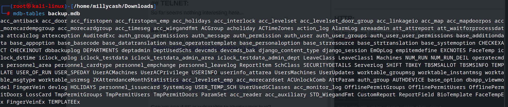
About all tables we should check auth_user:
`┌──(root㉿kali-linux)-[/home/millycash/Downloads]
└─# mdb-export backup.mdb auth_user            
id,username,password,Status,last_login,RoleID,Remark
25,"admin","admin",1,"08/23/18 21:11:47",26,
27,"engineer","access4u@security",1,"08/23/18 21:13:36",26,
28,"backup_admin","admin",1,"08/23/18 21:14:02",26,
`

Using the pasword from engineer we can unzip the archive and export the pst...
https://linux.die.net/man/1/readpst

Using the tool we can convert it to a mbox and then parse the text easy with cat:
`┌──(root㉿kali-linux)-[/home/millycash/Downloads]
└─# cat Access\ Control.mbox 
From "john@megacorp.com" Fri Aug 24 01:44:07 2018
Status: RO
From: john@megacorp.com <john@megacorp.com>
Subject: MegaCorp Access Control System "security" account
To: 'security@accesscontrolsystems.com'
Date: Thu, 23 Aug 2018 23:44:07 +0000
MIME-Version: 1.0
Content-Type: multipart/mixed;
	boundary="--boundary-LibPST-iamunique-696909418_-_-"
----boundary-LibPST-iamunique-696909418_-_-
Content-Type: multipart/alternative;
	boundary="alt---boundary-LibPST-iamunique-696909418_-_-"
--alt---boundary-LibPST-iamunique-696909418_-_-
Content-Type: text/plain; charset="utf-8"
Hi there,
The password for the “security” account has been changed to 4Cc3ssC0ntr0ller.  Please ensure this is passed on to your engineers.
Regards,
John
`

What can we do with this password now?

* * *
## TELNET:
So far seems nothing interesting here...

Now we have a username and password from secuirty account from pst we can try to login to system with telnet:
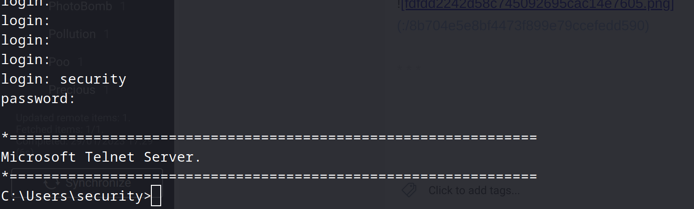

Runa and grab last flag:
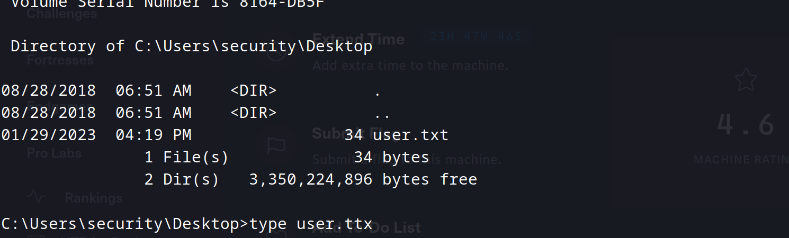
* * *
## HTTP:
So far nothing interesting came our from a subdomain enumeration:
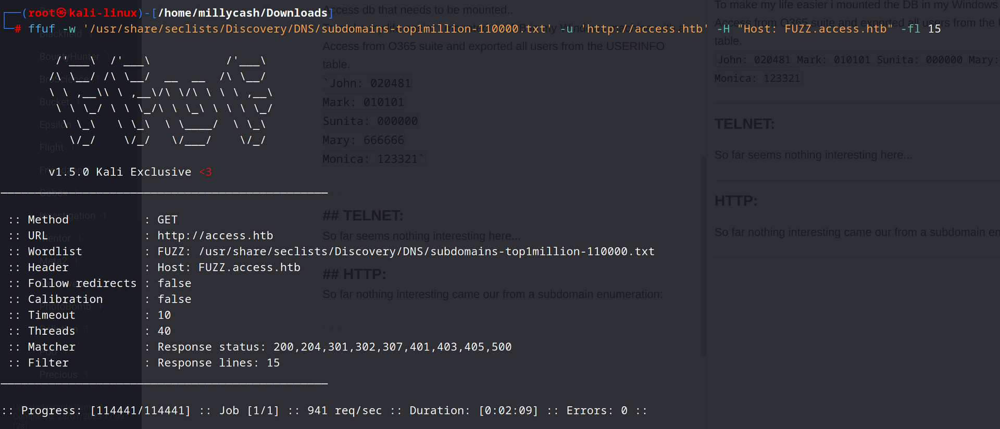

We found some folders but no files?
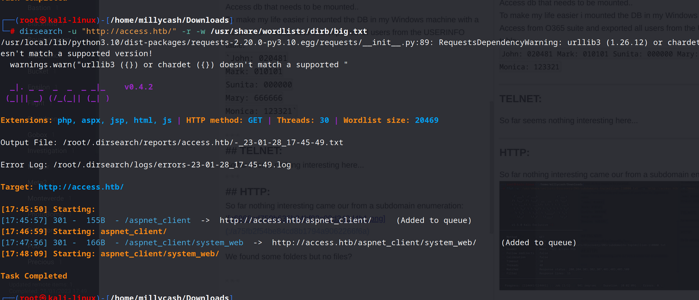

Can we see if IIS is vulnerable to shortnames bug?
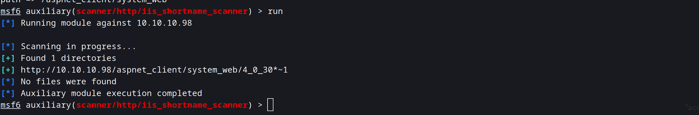

* * *
## PRIVESC:
Now checking manually for permissions with whoami/all shows thta we dont't have any particular permissions nor are part of any special group since there aren't any AD environment.

Surfing for files i found something interesting in the root directory:
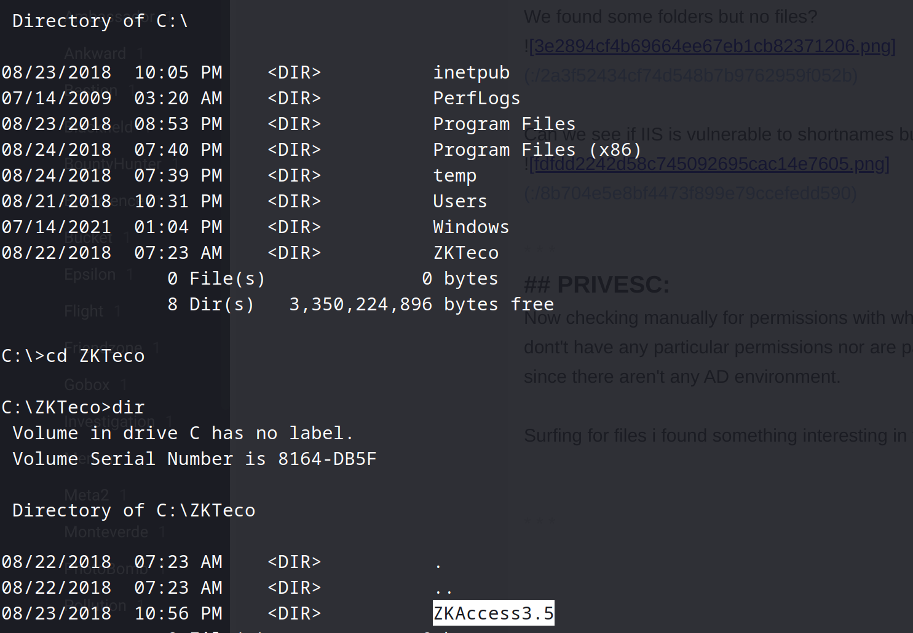

Checking about the software seems like a exploit is available:
https://www.exploit-db.com/exploits/40323

Checking the .exe configuration i find another db:
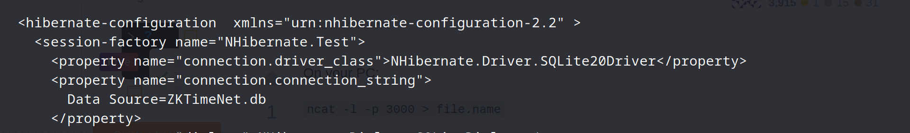
Which seems to be a SQLlite:
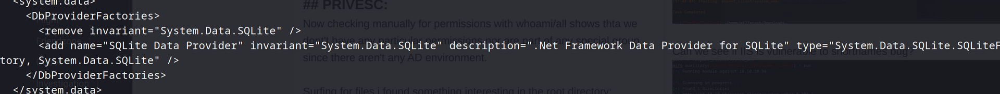

Edit: I was totally wrong the solution was to check into Public folder:
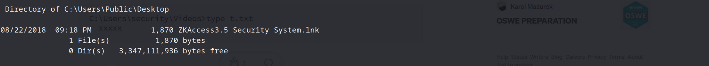

Now that we can see that the link is using some saved password:
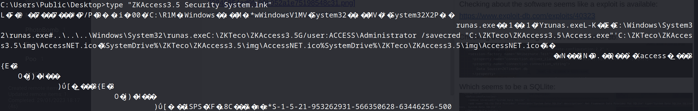

We can use this guide om privescalation: https://steflan-security.com/windows-privilege-escalation-runas-stored-credentials/

Checking for saved credentials, and bingo!:
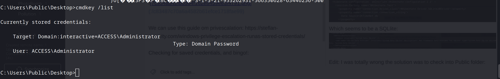

Now we should upload a nc.exe copy and we can run this part with saved credentials:
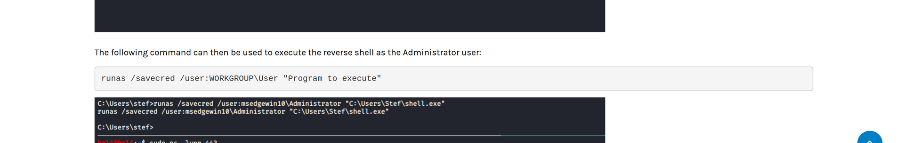

Now running nc.exe to forward traffic to our listener as Administrator with saved creds:
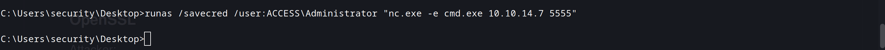

Get's us a shell:
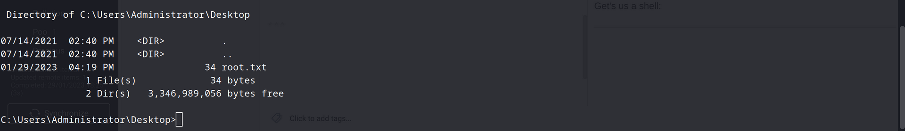

Grab last flag!
* * *