## RUSTSCAN:
`PORT   STATE SERVICE REASON         VERSION
22/tcp open  ssh     syn-ack ttl 63 OpenSSH 8.9p1 Ubuntu 3 (Ubuntu Linux; protocol 2.0)
| ssh-hostkey:
|   256 7254afbaf6e2835941b7cd611c2f418b (ECDSA)
| ecdsa-sha2-nistp256 AAAAE2VjZHNhLXNoYTItbmlzdHAyNTYAAAAIbmlzdHAyNTYAAABBBCMaN1wQtPg5uk2w3xD0d0ND6JQgzw40PoqCSBDGB7Q0/f5lQSGU2eSTw4uCdL99hdM/+Uv84ffp2tNkCXyV8l8=
|   256 59365bba3c7821e326b37d23605aec38 (ED25519)
|_ssh-ed25519 AAAAC3NzaC1lZDI1NTE5AAAAIFsq9sSC1uhq5CBWylh+yiC7jz4tuegMj/4FVTp6bzZy
80/tcp open  http    syn-ack ttl 63 nginx 1.18.0 (Ubuntu)
| http-methods:
|_  Supported Methods: GET HEAD
|_http-title: Site doesn't have a title (text/html).
|_http-server-header: nginx/1.18.0 (Ubuntu)
Warning: OSScan results may be unreliable because we could not find at least 1 open and 1 closed port`
* * *
## SSH:
Nothing here, not untlill we find a username and password so we can login via SSH.
So far OpenSSH is pretty new and no know CVE or exploits are available for the istalled version on the machine.
* * *
## HTTP:
Visiting manually the website we find that URL is re-writed towards: http://hat-valley.htb/
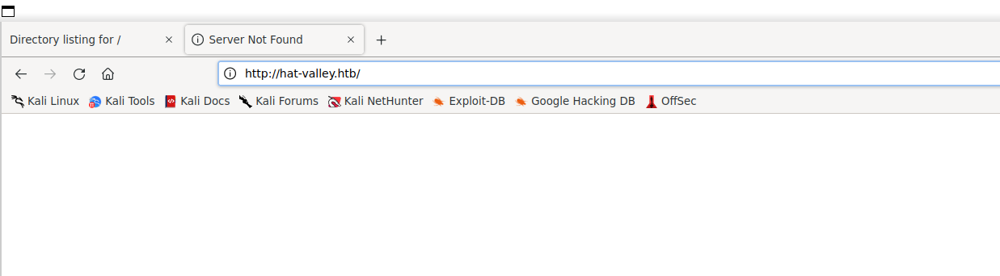
So let's add it to our hosts file and move forward with enumeration.

Opening the website and checking again we can find several informations:
1. Website uses Javascript?
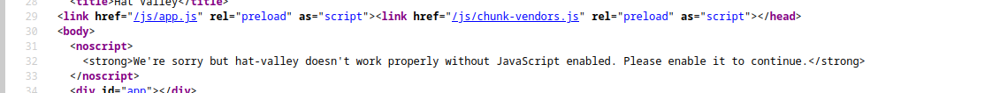
2. Possible uses?

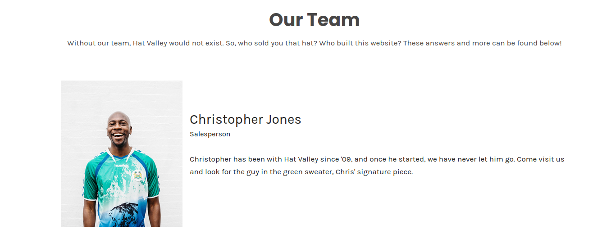
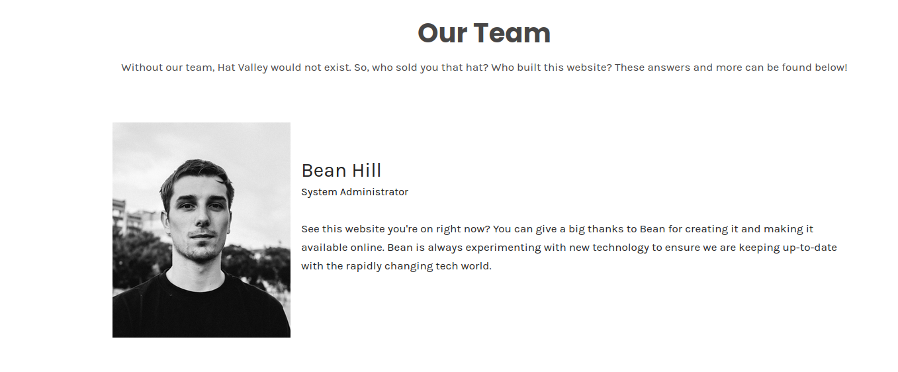
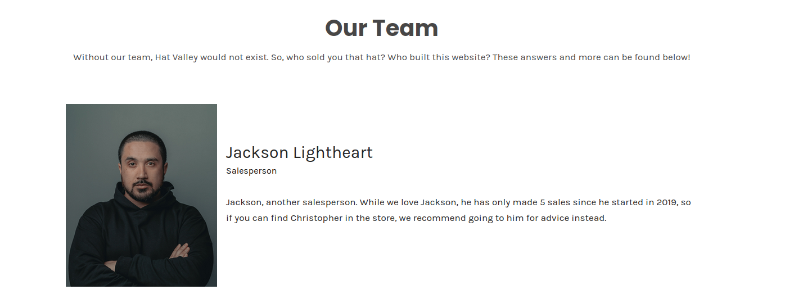
3. Possible subdomain?
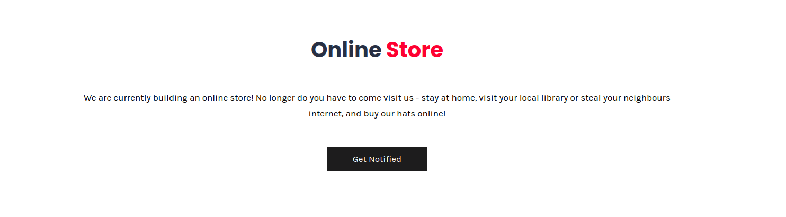

Moving foward and checking if we can find the subdomain for the store or anything other:
`
 :: Method           : GET
 :: URL              : http://hat-valley.htb
 :: Wordlist         : FUZZ: /usr/share/seclists/Discovery/DNS/subdomains-top1million-110000.txt
 :: Header           : Host: FUZZ.hat-valley.htb
 :: Follow redirects : false
 :: Calibration      : false
 :: Timeout          : 10
 :: Threads          : 40
 :: Matcher          : Response status: 200,204,301,302,307,401,403,405,500
 :: Filter           : Response lines: 9
________________________________________________

store                   [Status: 401, Size: 188, Words: 6, Lines: 8, Duration: 35ms]
:: Progress: [114441/114441] :: Job [1/1] :: 1099 req/sec :: Duration: [0:02:08] :: Errors: 0 ::`

Now we should add this extra subdomain since it can probably be the Shop that is WIP (mentioned before on the main page).

So far these webdirectories have been found on the main website:
`Target: http://hat-valley.htb/
[14:10:10] Starting:
[14:10:10] 301 -  171B  - /js  ->  /js/
[14:10:32] 301 -  173B  - /css  ->  /css/
[14:10:34] 200 -    4KB - /favicon.ico
[14:10:53] 301 -  179B  - /static  ->  /static/`

And these on the subdomain:
`Target: http://store.hat-valley.htb/
[14:15:53] Starting:
[14:15:54] 301 -  178B  - /js  ->  http://store.hat-valley.htb/js/
[14:16:14] 301 -  178B  - /cart  ->  http://store.hat-valley.htb/cart/
[14:16:18] 301 -  178B  - /css  ->  http://store.hat-valley.htb/css/
[14:16:23] 301 -  178B  - /fonts  ->  http://store.hat-valley.htb/fonts/
[14:16:26] 301 -  178B  - /img  ->  http://store.hat-valley.htb/img/
[14:16:28] 403 -  564B  - /js/
[14:16:42] 200 -  918B  - /README.md
[14:16:48] 301 -  178B  - /static  ->  http://store.hat-valley.htb/static/`

Now reading the /README.md we can get from the log what is going on the Store website:
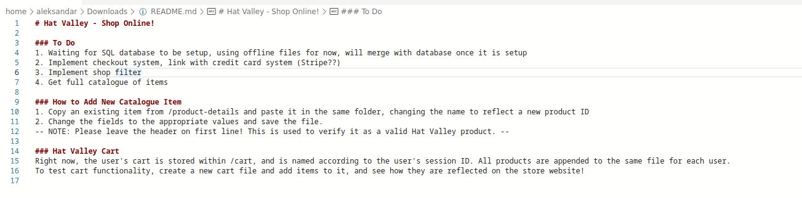

Going back to Burpsuite we can se several thigs that are interesting from the sitemap(yellow ones!!):
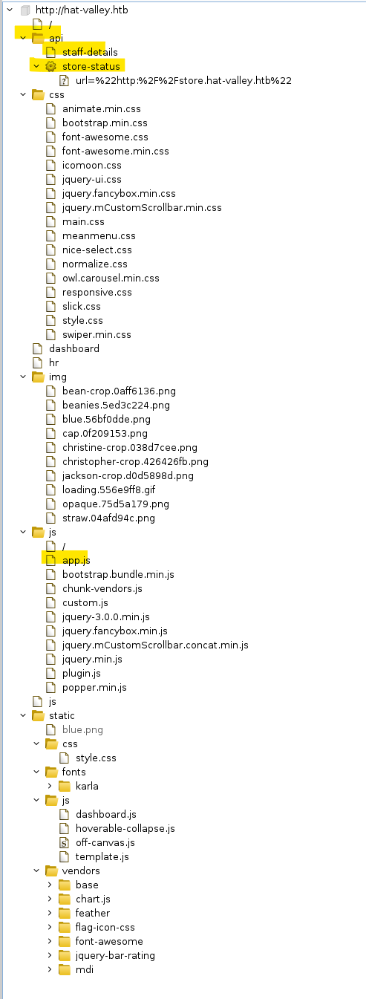

Now trying to see what app.js have to offer:
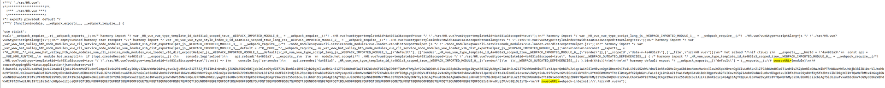
Seems like there is a webdirectory on **http://hat-valley.htb/hr**

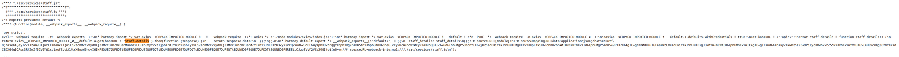
There is a API parameter called staff-details

Hr page have a login:

But if we try to edit the token from guest to user?
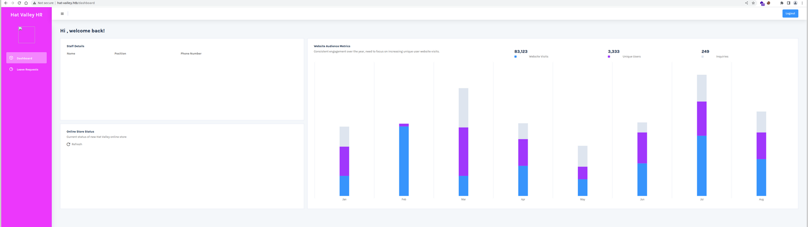

What if we can try to fuzz API?
`┌──(root㉿DESKTOP-1KSM320)-[/home/aleksandar/Downloads]
└─# curl "http://hat-valley.htb/api/staff-details"
[{"user_id":1,"username":"christine.wool","password":"6529fc6e43f9061ff4eaa806b087b13747fbe8ae0abfd396a5c4cb97c5941649","fullname":"Christine Wool","role":"Founder, CEO","phone":"0415202922"},{"user_id":2,"username":"christopher.jones","password":"e59ae67897757d1a138a46c1f501ce94321e96aa7ec4445e0e97e94f2ec6c8e1","fullname":"Christopher Jones","role":"Salesperson","phone":"0456980001"},{"user_id":3,"username":"jackson.lightheart","password":"b091bc790fe647a0d7e8fb8ed9c4c01e15c77920a42ccd0deaca431a44ea0436","fullname":"Jackson Lightheart","role":"Salesperson","phone":"0419444111"},{"user_id":4,"username":"bean.hill","password":"37513684de081222aaded9b8391d541ae885ce3b55942b9ac6978ad6f6e1811f","fullname":"Bean Hill","role":"System Administrator","phone":"0432339177"}]`

Can we crack their hashes? Seems like hashtype is SHA256
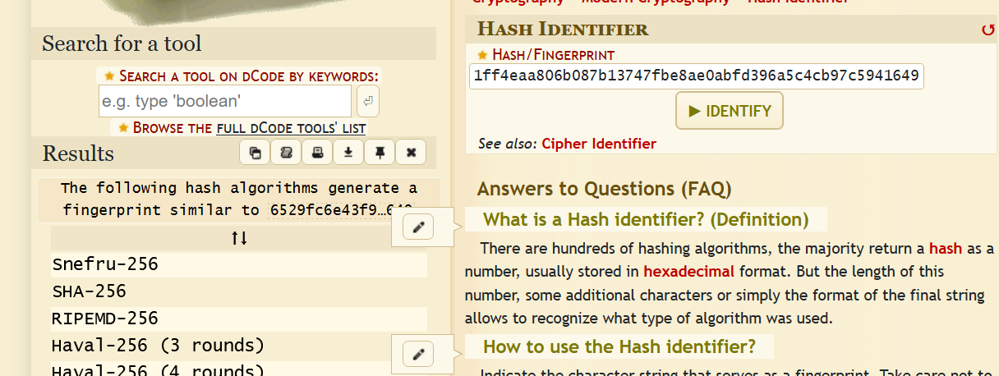
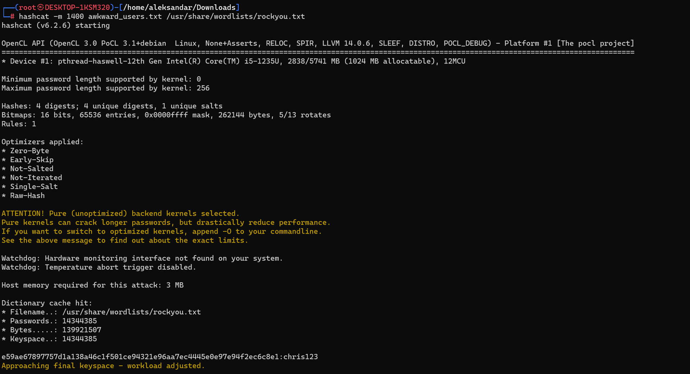

We have password for **christopher.jones:chris123**

* * *
