## RUSTSCAN:
`PORT      STATE SERVICE      REASON          VERSION
22/tcp    open  ssh          syn-ack ttl 127 OpenSSH for_Windows_7.9 (protocol 2.0)
| ssh-hostkey: 
|   2048 3a56ae753c780ec8564dcb1c22bf458a (RSA)
| ssh-rsa AAAAB3NzaC1yc2EAAAADAQABAAABAQC3bG3TRRwV6dlU1lPbviOW+3fBC7wab+KSQ0Gyhvf9Z1OxFh9v5e6GP4rt5Ss76ic1oAJPIDvQwGlKdeUEnjtEtQXB/78Ptw6IPPPPwF5dI1W4GvoGR4MV5Q6CPpJ6HLIJdvAcn3isTCZgoJT69xRK0ymPnqUqaB+/ptC4xvHmW9ptHdYjDOFLlwxg17e7Sy0CA67PW/nXu7+OKaIOx0lLn8QPEcyrYVCWAqVcUsgNNAjR4h1G7tYLVg3SGrbSmIcxlhSMexIFIVfR37LFlNIYc6Pa58lj2MSQLusIzRoQxaXO4YSp/dM1tk7CN2cKx1PTd9VVSDH+/Nq0HCXPiYh3
|   256 cc2e56ab1997d5bb03fb82cd63da6801 (ECDSA)
| ecdsa-sha2-nistp256 AAAAE2VjZHNhLXNoYTItbmlzdHAyNTYAAAAIbmlzdHAyNTYAAABBBF1Mau7cS9INLBOXVd4TXFX/02+0gYbMoFzIayeYeEOAcFQrAXa1nxhHjhfpHXWEj2u0Z/hfPBzOLBGi/ngFRUg=
|   256 935f5daaca9f53e7f282e664a8a3a018 (ED25519)
|_ssh-ed25519 AAAAC3NzaC1lZDI1NTE5AAAAIB34X2ZgGpYNXYb+KLFENmf0P0iQ22Q0sjws2ATjFsiN
135/tcp   open  msrpc        syn-ack ttl 127 Microsoft Windows RPC
139/tcp   open  netbios-ssn  syn-ack ttl 127 Microsoft Windows netbios-ssn
445/tcp   open  microsoft-ds syn-ack ttl 127 Windows Server 2016 Standard 14393 microsoft-ds
5985/tcp  open  http         syn-ack ttl 127 Microsoft HTTPAPI httpd 2.0 (SSDP/UPnP)
|_http-title: Not Found
|_http-server-header: Microsoft-HTTPAPI/2.0
47001/tcp open  http         syn-ack ttl 127 Microsoft HTTPAPI httpd 2.0 (SSDP/UPnP)
|_http-server-header: Microsoft-HTTPAPI/2.0
|_http-title: Not Found
49664/tcp open  msrpc        syn-ack ttl 127 Microsoft Windows RPC
49665/tcp open  msrpc        syn-ack ttl 127 Microsoft Windows RPC
49666/tcp open  msrpc        syn-ack ttl 127 Microsoft Windows RPC
49667/tcp open  msrpc        syn-ack ttl 127 Microsoft Windows RPC
49668/tcp open  msrpc        syn-ack ttl 127 Microsoft Windows RPC
49669/tcp open  msrpc        syn-ack ttl 127 Microsoft Windows RPC
49670/tcp open  msrpc        syn-ack ttl 127 Microsoft Windows RPC
Warning: OSScan results may be unreliable because we could not find at least 1 open and 1 closed port
OS fingerprint not ideal because: Missing a closed TCP port so results incomplete
Host script results:
|_clock-skew: mean: -19m59s, deviation: 34m37s, median: -1s
| smb2-time: 
|   date: 2023-01-28T13:31:13
|_  start_date: 2023-01-28T13:23:24
| smb2-security-mode: 
|   311: 
|_    Message signing enabled but not required
| smb-os-discovery: 
|   OS: Windows Server 2016 Standard 14393 (Windows Server 2016 Standard 6.3)
|   Computer name: Bastion
|   NetBIOS computer name: BASTION\x00
|   Workgroup: WORKGROUP\x00
|_  System time: 2023-01-28T14:31:14+01:00
| smb-security-mode: 
|   account_used: guest
|   authentication_level: user
|   challenge_response: supported
|_  message_signing: disabled (dangerous, but default)
| p2p-conficker: 
|   Checking for Conficker.C or higher...
|   Check 1 (port 32880/tcp): CLEAN (Couldn't connect)
|   Check 2 (port 26941/tcp): CLEAN (Couldn't connect)
|   Check 3 (port 46596/udp): CLEAN (Timeout)
|   Check 4 (port 18741/udp): CLEAN (Failed to receive data)
|_  0/4 checks are positive: Host is CLEAN or ports are blocked

`
* * *
## SSH:
Nothing so far without a user credentials, the service is not known for any common CVE.
* * *
## SMB:
So far nothing interesting came out from SMB enumeration as guest user:
` ========================================
|    SMB Dialect Check on bastion.htb    |
 ========================================
[*] Trying on 445/tcp
[+] Supported dialects and settings:
Supported dialects:
  SMB 1.0: true
  SMB 2.02: true
  SMB 2.1: true
  SMB 3.0: true
  SMB 3.1.1: true
Preferred dialect: SMB 3.0
SMB1 only: false
SMB signing required: false
==========================================================
|    Domain Information via SMB session for bastion.htb    |
==========================================================
[*] Enumerating via unauthenticated SMB session on 445/tcp
[+] Found domain information via SMB
NetBIOS computer name: BASTION
NetBIOS domain name: ''
DNS domain: Bastion
FQDN: Bastion
Derived membership: workgroup member
Derived domain: unknown
`

But taking as granted what Nmap scripts found seems like Samba support guest user:
` smb-security-mode: 
|   account_used: guest
|   authentication_level: user
|   challenge_response: supported
|_  message_signing: disabled (dangerous, but default)`

Checking manually for shares we find a SMb share that seems containing backups??
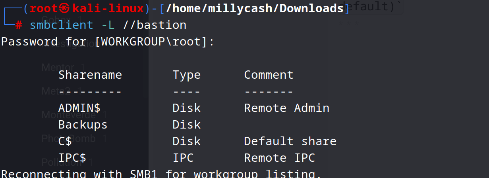
The content:
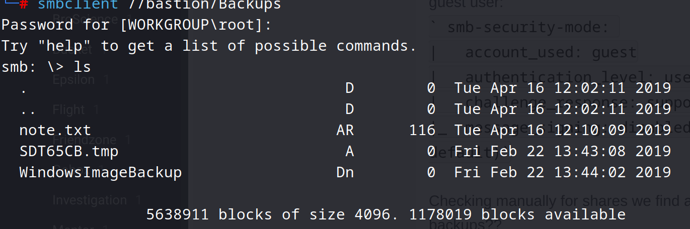
Now the only file or better say folder that interests us right now is the Windows backup folder, we may can export some user and passwords from there... 
Let's first recursively download whole map:
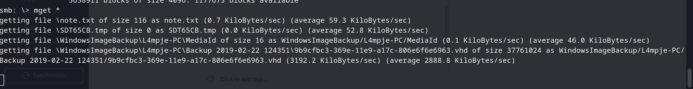

Now scrolling thru all the XML files we can find a possible username??
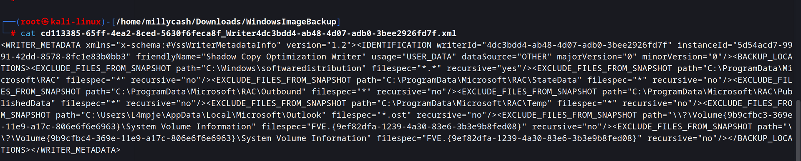
`C:\Users\L4mpje\AppData\Local\Microsoft\Outlook`

Now i don't think we have to analyze the disk with Autopsy/Volatility but instead we shall bruteforce L4mpje password with either Hydra, MSF or Crackmapexec?

Edit: the solutions was siplier that this, since we know from the note in the SMB share we can't dowload the VHD files we should map the SMB share instead and the mount the VHD files..

Like this: https://linuxize.com/post/how-to-mount-cifs-windows-share-on-linux/
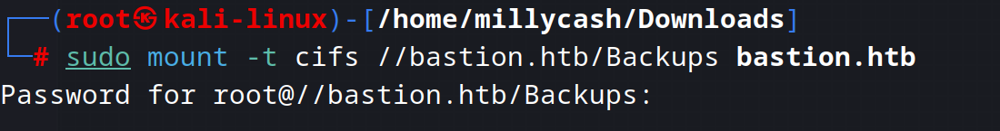

And now we can surf the share:
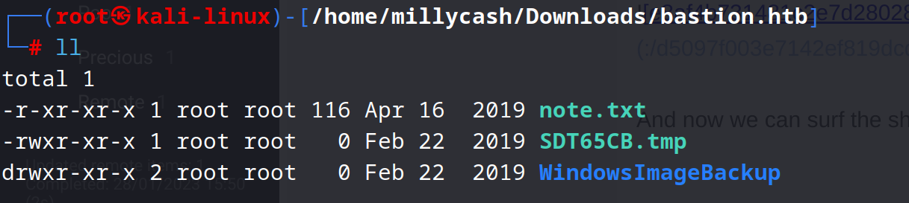
Now we can try to map the VHD file with this guide: https://www.how2shout.com/linux/mount-virtual-hard-disk-vhd-file-ubuntu-linux/

Now we can surf for files :)
Scrolling thru system32/config we can find SAM backups(password from registry):
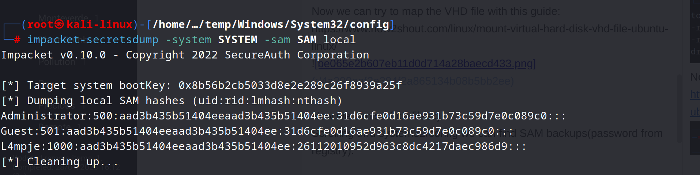

We mounted the disk to /temp and gave to secrets-dump the SAM and SYTEM file.
Now with john the ripper we can crack those hashes:
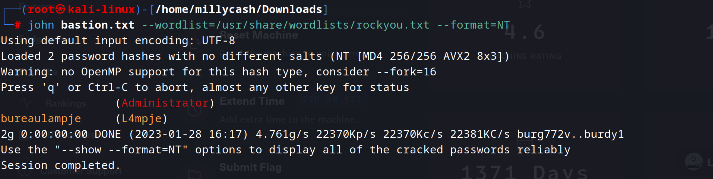
* * *
## USER.TXT:
Login with new password from L4mpje: bureaulampje with evil-winrm and move forward with first flag.
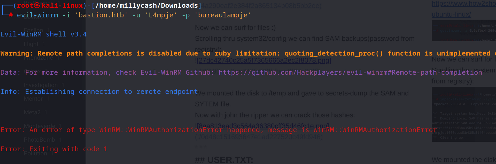

Edit it's not working with WIN-RM but we can login to ssh instead?
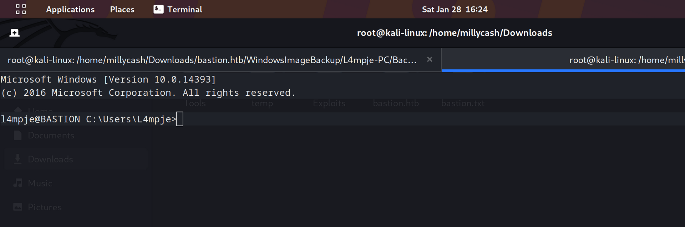

Now run and grab first flag:
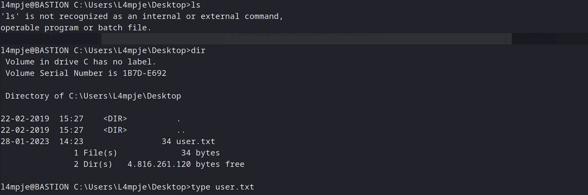
* * *
## ROOT.TXT:
Now checking privs, we can't do that much but checking machine tags we are sure that is something about Mremoteng.

No Mremoteng are available but since i used the SW in past i know that program saves a XML with all the connections and password may be saved there in cleartext. Let's surf to the install directory and check what can we find...

Checking this we can guess that Mremoteng config is saved in L4mpje's Appdata:
http://forum.mremoteng.org/viewtopic.php?f=3&t=2179
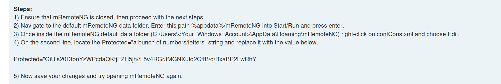

Surfing we can find al lot of xml configs:
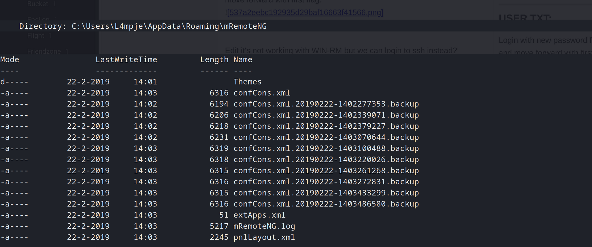

Can we get Admin password from it?
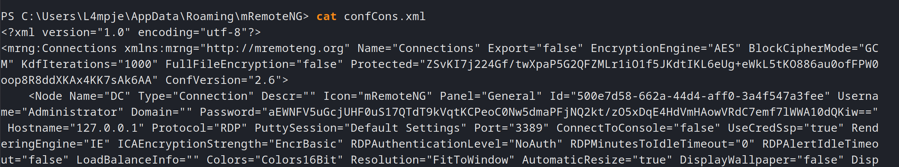

Seems like can't decrypt with John so I surfed a bit and found this:
https://github.com/gquere/mRemoteNG_password_decrypt
Edit: didn't worked, can this one work instead?

https://github.com/kmahyyg/mremoteng-decrypt.git
And yess!!!
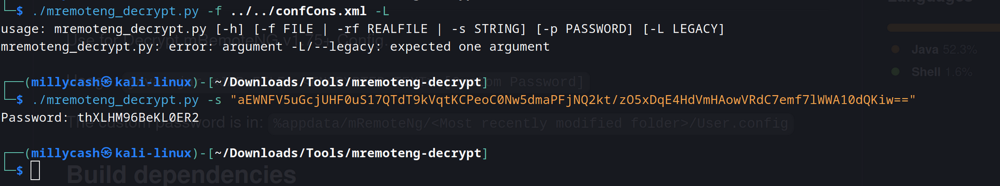

Login into Evil-Winrm and grab last flag:
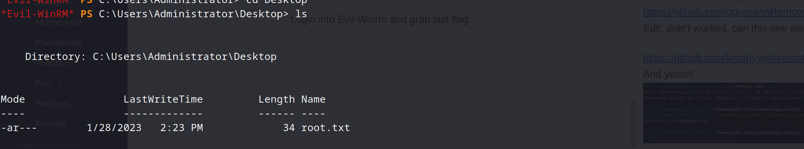

* * *

* * *