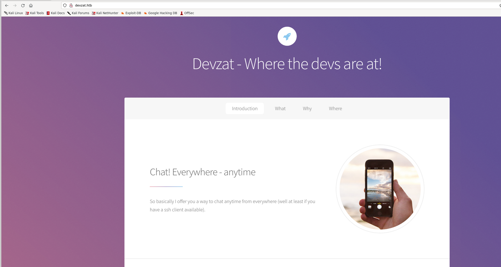
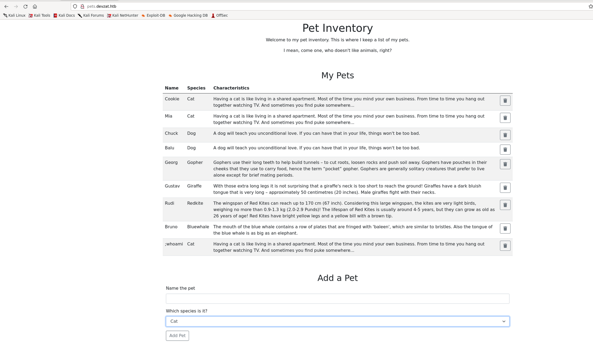
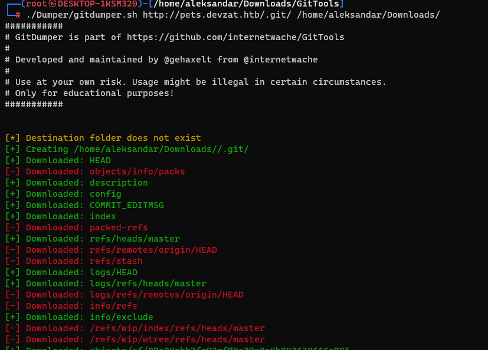
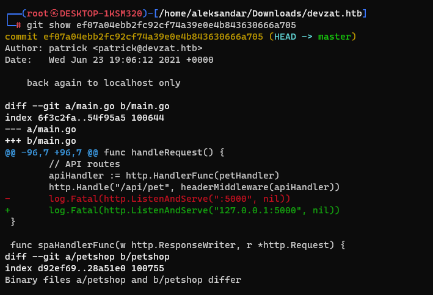
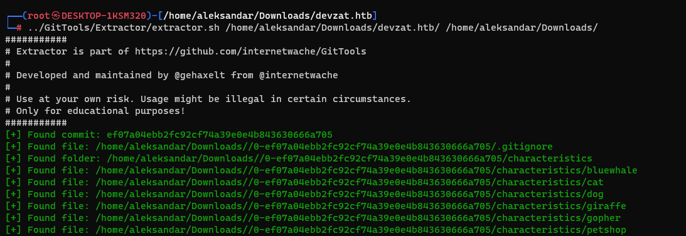
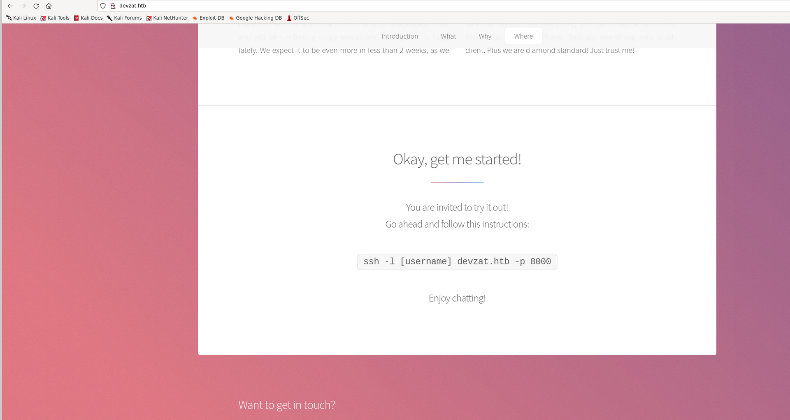
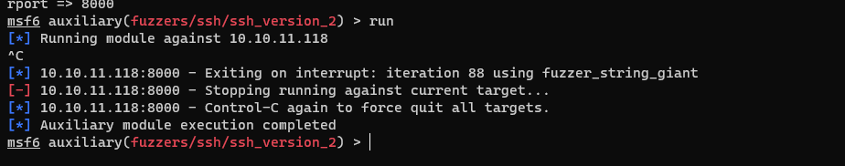
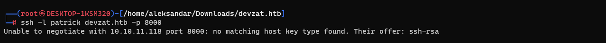
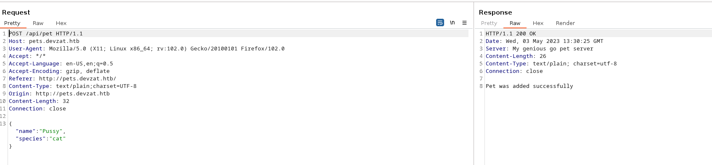
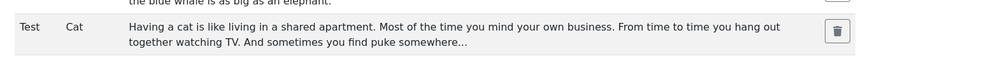

## RUSTSCAN:

```Bash
PORT     STATE SERVICE REASON         VERSION
22/tcp   open  ssh     syn-ack ttl 63 OpenSSH 8.2p1 Ubuntu 4ubuntu0.2 (Ubuntu Linux; protocol 2.0)
| ssh-hostkey:
|   3072 c25ffbde32ff44bf08f5ca49d4421a06 (RSA)
| ssh-rsa AAAAB3NzaC1yc2EAAAADAQABAAABgQDNaY36GNxswLsvQjgdNt0oBgiJp/OExsv55LjY72WFW03eiJrOY5hbm5AjjyePPTm2N9HO7uK230THXoGWOXhrlzT3nU/g/DkQyDcFZioiE7M2eRIK2m4egM5SYGcKvXDtQqSK86ex4I31Nq6m9EVpVWphbLfvaWjRmIgOlURo+P76WgjzZzKws42mag2zIrn5oP+ODhOW/3ta289/EMYS6phUbBd0KJIWm9ciNfKA2D7kklnuUP1ZRBe2DbSvd2HV5spoLQKmtY37JEX7aYdETjDUHvTqgkWsVCZAa5qNswPEV7zFlAJTgtW8tZsjW86Q0H49M5dUPra4BEXfZ0/idJy+jpMkbfj6+VjlsvaxxvNUEVrbPBXe9SlbeXdrNla5nenpbwtWNhckUlsEZjlpv8VnHqXt99s1mfHJkgO+yF09gvVPVdglDSqMAla8d2rfaVD68RfoGQc10Af6xiohSOA8LIa0f4Yaw+PjLlcylF5APDnSjtQvHm8TnQyRaVM=
|   256 bccde8ee0aa9157652bc19a4a3b2baff (ECDSA)
| ecdsa-sha2-nistp256 AAAAE2VjZHNhLXNoYTItbmlzdHAyNTYAAAAIbmlzdHAyNTYAAABBBCenH4vaESizD5ZgkV+1Yo3MJH9MfmUdKhvU+2Z2ShSSWjp1AfRmK/U/rYaFOoeKFIjo1P4s8fz3eXr3Pzk/X80=
|   256 62ef72524f19538bf29bbe46884bc3d0 (ED25519)
|_ssh-ed25519 AAAAC3NzaC1lZDI1NTE5AAAAIKTxLGFW04ssWG0kheQptJmR5sHKtPI2G+zh4FVF0pBm
80/tcp   open  http    syn-ack ttl 63 Apache httpd 2.4.41
| http-methods:
|_  Supported Methods: HEAD GET POST OPTIONS
|_http-title: devzat - where the devs at
|_http-server-header: Apache/2.4.41 (Ubuntu)
8000/tcp open  ssh     syn-ack ttl 63 (protocol 2.0)
| fingerprint-strings:
|   NULL:
|_    SSH-2.0-Go
| ssh-hostkey:
|   3072 6aeedb90a610309f94ffbf61952a2063 (RSA)
|_ssh-rsa AAAAB3NzaC1yc2EAAAADAQABAAABgQDTPm8Ze7iuUlabZ99t6SWJTw3spK5GP21qE/f7FOT/P+crNvZQKLuSHughKWgZH7Tku7Nmu/WxhZwVUFDpkiDG1mSPeK6uyGpuTmncComFvD3CaldFrZCNxbQ/BbWeyNVpF9szeVTwfdgY5PNoQFQ0reSwtenV6atEA5WfrZzhSZXWuWEn+7HB9C6w1aaqikPQDQSxRArcLZY5cgjNy34ZMk7MLaWciK99/xEYuNEAbR1v0/8ItVv5pyD8QMFD+s2NwHk6eJ3hqks2F5VJeqIZL2gXvBmgvQJ8fBLb0pBN6xa1xkOAPpQkrBL0pEEqKFQsdJaIzDpCBGmEL0E/DfO6Dsyq+dmcFstxwfvNO84OmoD2UArb/PxZPaOowjE47GRHl68cDIi3ULKjKoMg2QD7zrayfc7KXP8qEO0j5Xws0nXMll6VO9Gun6k9yaXkEvrFjfLucqIErd7eLtRvDFwcfw0VdflSdmfEz/NkV8kFpXm7iopTKdcwNcqjNnS1TIs=
1 service unrecognized despite returning data. If you know the service/version, please submit the following fingerprint at https://nmap.org/cgi-bin/submit.cgi?new-service :
SF-Port8000-TCP:V=7.93%I=7%D=5/3%Time=645252D7%P=x86_64-pc-linux-gnu%r(NUL
SF:L,C,"SSH-2\.0-Go\r\n");
```

* * *

## SSH:

As usual we can't do much about SSH service since it's a pretty new version with no known exploit out in the wild and bruteforce is not a contemned resultion way.

I will come back as soon I find some crendetials to interact with service but for now I will move forward with enumeration of other services.

* * *

## HTTP:

So far launching manually the website and checking for it's content on the browser we are presented with following page:



Checking manually HTML source code didn't showed up any code remains or particular comments. But we have a potential username?


Now as usual I will try to fuzz for webpages/directories and subdomains. So starting by subdomains I usually like FFUF:

```Bash
┌──(root㉿DESKTOP-1KSM320)-[/home/aleksandar/Downloads]
└─# ffuf -w /usr/share/seclists/Discovery/DNS/subdomains-top1million-20000.txt -u http://devzat.htb/ -H 'Host:FUZZ.devzat.htb' -fl 10

        /'___\  /'___\           /'___\
       /\ \__/ /\ \__/  __  __  /\ \__/
       \ \ ,__\\ \ ,__\/\ \/\ \ \ \ ,__\
        \ \ \_/ \ \ \_/\ \ \_\ \ \ \ \_/
         \ \_\   \ \_\  \ \____/  \ \_\
          \/_/    \/_/   \/___/    \/_/

       v2.0.0-dev
________________________________________________

 :: Method           : GET
 :: URL              : http://devzat.htb/
 :: Wordlist         : FUZZ: /usr/share/seclists/Discovery/DNS/subdomains-top1million-20000.txt
 :: Header           : Host: FUZZ.devzat.htb
 :: Follow redirects : false
 :: Calibration      : false
 :: Timeout          : 10
 :: Threads          : 40
 :: Matcher          : Response status: 200,204,301,302,307,401,403,405,500
 :: Filter           : Response lines: 10
________________________________________________

[Status: 200, Size: 510, Words: 20, Lines: 21, Duration: 39ms]
    * FUZZ: pets

:: Progress: [19966/19966] :: Job [1/1] :: 1298 req/sec :: Duration: [0:00:22] :: Errors: 0 ::
```

Ok seems like we have a subdomain/vhost avalable on the machine but before moving forward what about potential website structure fuzzing?

```Bash
┌──(root㉿DESKTOP-1KSM320)-[/home/aleksandar/Downloads]
└─# dirsearch -u 'http://devzat.htb/'

  _|. _ _  _  _  _ _|_    v0.4.3.post1
 (_||| _) (/_(_|| (_| )

Extensions: php, aspx, jsp, html, js | HTTP method: GET | Threads: 25 | Wordlist size: 11460

Output File: /home/aleksandar/Downloads/reports/http_devzat.htb/__23-05-03_14-44-34.txt

Target: http://devzat.htb/

[14:44:34] Starting:
[14:44:37] 403 -  275B  - /.ht_wsr.txt
[14:44:37] 403 -  275B  - /.htaccess.orig
[14:44:37] 403 -  275B  - /.htaccess.sample
[14:44:37] 403 -  275B  - /.htaccess.save
[14:44:37] 403 -  275B  - /.htaccess_extra
[14:44:37] 403 -  275B  - /.htaccess.bak1
[14:44:37] 403 -  275B  - /.htaccess_sc
[14:44:37] 403 -  275B  - /.htaccess_orig
[14:44:37] 403 -  275B  - /.htaccessBAK
[14:44:37] 403 -  275B  - /.htaccessOLD
[14:44:37] 403 -  275B  - /.htaccessOLD2
[14:44:37] 403 -  275B  - /.htm
[14:44:37] 403 -  275B  - /.html
[14:44:37] 403 -  275B  - /.htpasswd_test
[14:44:37] 403 -  275B  - /.htpasswds
[14:44:37] 403 -  275B  - /.httr-oauth
[14:44:46] 301 -  309B  - /assets  ->  http://devzat.htb/assets/
[14:44:46] 200 -  472B  - /assets/
[14:44:56] 200 -  524B  - /images/
[14:44:56] 301 -  309B  - /images  ->  http://devzat.htb/images/
[14:44:57] 301 -  313B  - /javascript  ->  http://devzat.htb/javascript/
[14:44:58] 200 -    6KB - /LICENSE.txt
[14:45:07] 200 -  539B  - /README.txt
[14:45:09] 403 -  275B  - /server-status/
[14:45:09] 403 -  275B  - /server-status

Task Completed
```

Ok nothing special so I guess we can move forward and check pets vhost for potential information... Opening pets seems like we have a website where we can add some informations as petname/type:



No comments or strange stuff into HTML source code so I will move to directories webfuzzing:

```Bash
//Web Dirs Fuzzing
Target: http://pets.devzat.htb/

[14:54:12] Starting:
[14:54:15] 301 -   41B  - /.git  ->  /.git/
[14:54:15] 200 -  166B  - /.git/
[14:54:15] 200 -   13B  - /.git/branches/
[14:54:15] 200 -   29B  - /.git/COMMIT_EDITMSG
[14:54:15] 200 -   81B  - /.git/description
[14:54:15] 200 -   97B  - /.git/config
[14:54:15] 404 -   19B  - /.git/FETCH_HEAD
[14:54:15] 200 -   23B  - /.git/HEAD
[14:54:15] 404 -   19B  - /.git/head
[14:54:15] 404 -   19B  - /.git/hooks/commit-msg
[14:54:15] 404 -   19B  - /.git/hooks/post-update
[14:54:15] 404 -   19B  - /.git/hooks/applypatch-msg
[14:54:15] 200 -  180B  - /.git/hooks/
[14:54:15] 404 -   19B  - /.git/hooks/pre-commit
[14:54:15] 404 -   19B  - /.git/hooks/pre-applypatch
[14:54:15] 404 -   19B  - /.git/hooks/pre-push
[14:54:15] 404 -   19B  - /.git/hooks/pre-rebase
[14:54:15] 404 -   19B  - /.git/hooks/prepare-commit-msg
[14:54:15] 404 -   19B  - /.git/hooks/update
[14:54:15] 404 -   19B  - /.git/hooks/pre-receive
[14:54:15] 200 -   43B  - /.git/info/
[14:54:15] 200 -    4KB - /.git/index
[14:54:15] 404 -   19B  - /.git/info/attributes
[14:54:15] 200 -  191B  - /.git/info/exclude
[14:54:15] 404 -   19B  - /.git/info/refs
[14:54:15] 200 -   63B  - /.git/logs/
[14:54:15] 404 -   19B  - /.git/logs/head
[14:54:15] 200 -  231B  - /.git/logs/HEAD
[14:54:15] 301 -    0B  - /.git/logs/refs  ->  refs/
[14:54:15] 301 -    0B  - /.git/logs/refs/heads  ->  heads/
[14:54:15] 404 -   19B  - /.git/logs/refs/remotes/origin
[14:54:15] 404 -   19B  - /.git/logs/refs/remotes
[14:54:15] 200 -  231B  - /.git/logs/refs/heads/master
[14:54:15] 404 -   19B  - /.git/logs/refs/remotes/origin/HEAD
[14:54:15] 404 -   19B  - /.git/logs/refs/remotes/origin/master
[14:54:15] 200 -  315B  - /.git/objects/
[14:54:15] 404 -   19B  - /.git/packed-refs
[14:54:15] 404 -   19B  - /.git/objects/info/packs
[14:54:15] 301 -    0B  - /.git/refs/heads  ->  heads/
[14:54:15] 200 -   67B  - /.git/refs/
[14:54:15] 404 -   19B  - /.git/refs/remotes/origin
[14:54:15] 404 -   19B  - /.git/refs/remotes
[14:54:15] 200 -   41B  - /.git/refs/heads/master
[14:54:15] 404 -   19B  - /.git/refs/remotes/origin/master
[14:54:15] 404 -   19B  - /.git/refs/remotes/origin/HEAD
[14:54:15] 301 -    0B  - /.git/refs/tags  ->  tags/
[14:54:26] 301 -   42B  - /build  ->  /build/
[14:54:26] 404 -   19B  - /build/build.properties
[14:54:26] 200 -   63B  - /build/
[14:54:26] 404 -   19B  - /build/reference/web-api/explore
[14:54:26] 404 -   19B  - /build/Release
[14:54:26] 404 -   19B  - /build/buildinfo.properties
[14:54:29] 301 -   40B  - /css  ->  /css/
[14:54:48] 403 -  280B  - /server-status/
[14:54:48] 403 -  280B  - /server-status

Task Completed
```

That git subfolder seems interesting so let's see if we dump it locally what can we read from it?



Ok seems like there is an interanal API answering on port 5000?



On the same way I will use extractor to extract the code from git logs and create a repository locally easy to surf:



* * *

## PORT 8000:

From a first manual enumeration seems like port 8000 is hosting a custom made SSH service and judging by what website is showing up we have some assurance on that:



Offcourse the port 8000 is not accessible from browser but then googling around that particular service seems like there are ready to use modules in Metasploit: https://felicitynavyfaye.blogspot.com/2021/03/ssh-20-go-exploit.html

I will run the mentioned ssh 2.0 fuzzer in MetaSploit and report when it's finished:



Nothing came our so I guess this will be our ssh when we are done!

Trying manuallyb to login unfortunately is not working: 



* * *

## Road to Local.txt:

Ok now I guess from checking .git source code we have to play around with pets website and more specifically the API in order to get back or get a RCE eventually!

Here I checked for tips and apparetly the foot hold was in the main.go code, i will let here a snippet of the code:

```GO
func loadCharacter(species string) string {
 cmd := exec.Command("sh", "-c", "cat characteristics/"+species)
 stdoutStderr, err := cmd.CombinedOutput()
 if err != nil {
  return err.Error()
 }
 return string(stdoutStderr)
}

func getPets(w http.ResponseWriter, r *http.Request) {
 json.NewEncoder(w).Encode(Pets)
}

func addPet(w http.ResponseWriter, r *http.Request) {
 reqBody, _ := ioutil.ReadAll(r.Body)
 var addPet Pet
 err := json.Unmarshal(reqBody, &addPet)
 if err != nil {
  e := fmt.Sprintf("There has been an error: %+v", err)
  http.Error(w, e, http.StatusBadRequest)
  return
 }

 addPet.Characteristics = loadCharacter(addPet.Species)
 Pets = append(Pets, addPet)
```

More specific that "loadcharachter" function that does and  sh -c command... It basically executes a command on the backend machine, wondering if is exploitable?

If we try to add a test animal that is not matching the default animal type does it work?

Which standard works:





What about a custom pettype:


Seems lyke yes, so can we do a lfi?