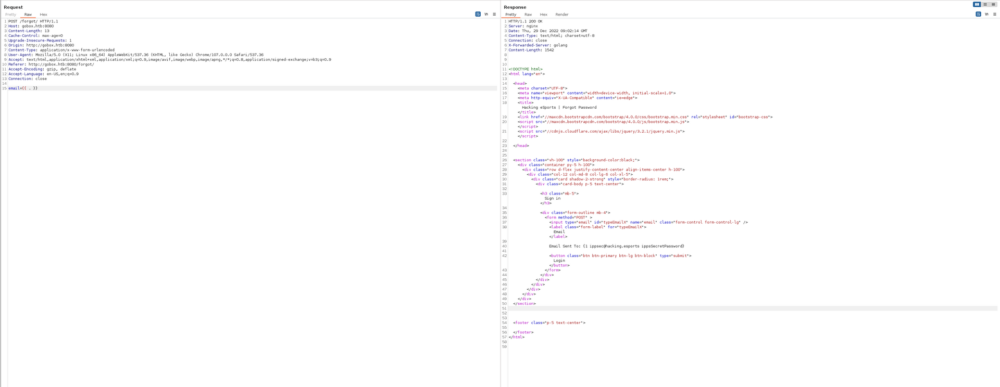
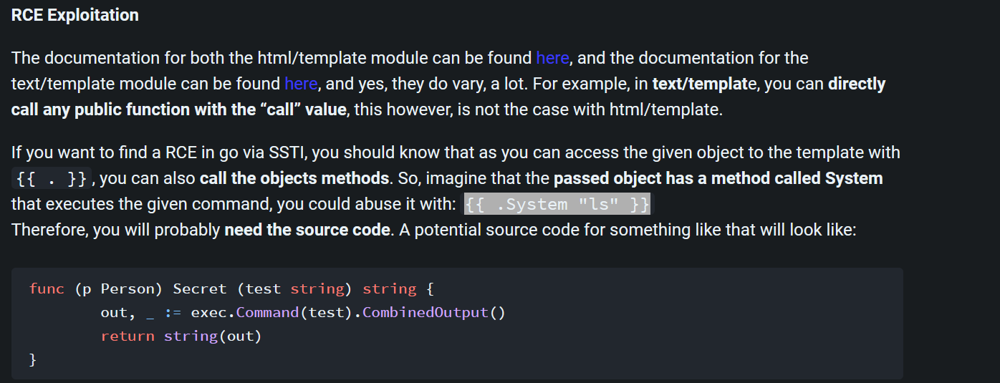
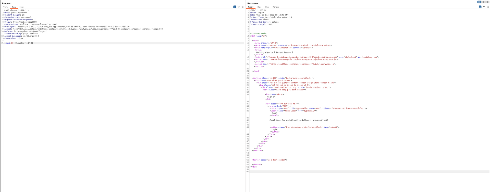

## Rustscan
PORT     STATE SERVICE REASON         VERSION
22/tcp   open  ssh     syn-ack ttl 63 OpenSSH 8.2p1 Ubuntu 4ubuntu0.3 (Ubuntu Linux; protocol 2.0)
| ssh-hostkey:
|   3072 d8f5efd2d3f98dadc6cf24859426ef7a (RSA)
| ssh-rsa AAAAB3NzaC1yc2EAAAADAQABAAABgQCgSpafkjRVogAlgtxt6cFN7sU4sRTiGYC01QloBpbOwerqFUoYNyhCdNP/9rvdhwFpXomoMhDxioWQZb1RTSbR5aCwkzwDRnLz5PKN/7faaoEVjFM1vSnjGwWxzPZJw4Xy8wEbvMDlNZQbWu44UMWhLH+Vp63egRsut0SkTpUy3Ovp/yb3uAeT/4sUPG+LvDgzXD2QY+O1SV0Y3pE+pRmL3UfRKr2ltMfpcc7y7423+3oRSONHfy1upVUcUZkRIKrl9Qb4CDpxbVi/hYfAFQcOYH+IawAounkeiTMMEtOYbzDysEzVrFcCiGPWOX5+7tu4H7jYnZiel39ka/TFODVA+m2ZJiz2NoKLKTVhouVAGkH7adYtotM62JEtow8MW0HCZ9+cX6ki5cFK9WQhN++KZej2fEZDkxV7913KaIa4HCbiDq1Sfr5j7tFAWnNDo097UHXgN5A0mL1zNqwfTBCHQTEga/ztpDE0pmTKS4rkBne9EDn6GpVhSuabX9S/BLk=
|   256 463d6bcba819eb6ad06886948673e172 (ECDSA)
| ecdsa-sha2-nistp256 AAAAE2VjZHNhLXNoYTItbmlzdHAyNTYAAAAIbmlzdHAyNTYAAABBBJ9LolyD5tnJ06EqjRR6bFX/7oOoTeFPw2TKsP1KCHJcsPSVfZIafOYEsWkaq67dsCvOdIZ8VQiNAKfnGiaBLOo=
|   256 7032d7e377c14acf472adee5087af87a (ED25519)
|_ssh-ed25519 AAAAC3NzaC1lZDI1NTE5AAAAIJOP8cvEQVqCwuWYT06t/DEGxy6sNajp7CzuvfJzrCRZ
80/tcp   open  http    syn-ack ttl 63 nginx
| http-methods:
|_  Supported Methods: GET HEAD POST
|_http-title: Hacking eSports | {{.Title}}
4566/tcp open  http    syn-ack ttl 63 nginx
|_http-title: 403 Forbidden
8080/tcp open  http    syn-ack ttl 63 nginx
| http-methods:
|_  Supported Methods: GET HEAD POST OPTIONS
|_http-title: Hacking eSports | Home page
|_http-open-proxy: Proxy might be redirecting requests
|_http-favicon: Unknown favicon MD5: 271532D72FD5025CF19147524DE66481
Warning: OSScan results may be unreliable because we could not find at least 1 open and 1 closed port
OS fingerprint not ideal because: Missing a closed TCP port so results incomplete
* * *
## Port 80
No subdomain have been discovered.
No relevant webdirectories have been discovered,
* * *
## Port 4566
No webdirectories have been discovered.
No subdomains have been discovered.
* * *
## Port 8080
No subdomain have been discovered.
Webdirectories discovered:
Target: http://gobox.htb:8080/

[09:27:44] Starting:
[09:28:07] 301 -   65B  - /axis2//axis2-web/HappyAxis.jsp  ->  /axis2/axis2-web/HappyAxis.jsp
[09:28:07] 301 -   54B  - /axis//happyaxis.jsp  ->  /axis/happyaxis.jsp
[09:28:07] 301 -   59B  - /axis2-web//HappyAxis.jsp  ->  /axis2-web/HappyAxis.jsp
[09:28:11] 301 -   87B  - /Citrix//AccessPlatform/auth/clientscripts/cookies.js  ->  /Citrix/AccessPlatform/auth/clientscripts/cookies.js
[09:28:17] 301 -   74B  - /engine/classes/swfupload//swfupload.swf  ->  /engine/classes/swfupload/swfupload.swf
[09:28:17] 301 -   77B  - /engine/classes/swfupload//swfupload_f9.swf  ->  /engine/classes/swfupload/swfupload_f9.swf
[09:28:18] 301 -   62B  - /extjs/resources//charts.swf  ->  /extjs/resources/charts.swf
[09:28:19] 301 -   43B  - /forgot  ->  /forgot/
[09:28:22] 301 -   72B  - /html/js/misc/swfupload//swfupload.swf  ->  /html/js/misc/swfupload/swfupload.swf

Task Completed

The first page that seems interesting is /forgot where we could get a reset password from our account, which doesn't help us that much right now but maybe we could try SSTi?

Knowing that is based on Go, we check in https://book.hacktricks.xyz/pentesting-web/ssti-server-side-template-injection#ssti-in-go
And we get the account by quering the data structure

Loggin into http://gobox.htb:8080/ we get the pages soucecode
`

package main

import(
    "html/template"
    "net/http"
    "log"
    "os/exec"
    "fmt"
    "bytes"
    "strings"
)

// compile all templates and cache them
var templates = template.Must(template.ParseGlob("templates/*"))

type Data struct {
    Title string // Must be exported!
    Body string  // Must be exported!
}

type User struct {
        ID       int
        Email    string
        Password string
}

func (u User) DebugCmd (test string) string {
  ipp := strings.Split(test, " ")
  bin := strings.Join(ipp[:1], " ")
  args := strings.Join(ipp[1:], " ")
  if len(args) > 0{
    out, _ := exec.Command(bin, args).CombinedOutput()
    return string(out)
  } else {
    out, _ := exec.Command(bin).CombinedOutput()
    return string(out)
  }
}

// Renders the templates
func renderTemplate(w http.ResponseWriter, tmpl string, page *Data) {
	err := templates.ExecuteTemplate(w, tmpl, page)
	if err != nil {
    http.Error(w, err.Error(), http.StatusInternalServerError)
    return
	}
}

func IndexHandler(w http.ResponseWriter, r *http.Request) {
  switch r.Method {
  case "GET":
	page := &Data{Title:"Home page", Body:"Welcome to our brand new home page."}
	renderTemplate(w, "index", page)
  case "POST":
	page := &Data{Title:"Home page", Body:"Welcome to our brand new home page."}
    if r.FormValue("password") == "ippsSecretPassword" {
      renderTemplate(w, "source", page )
    } else {
      renderTemplate(w, "index", page)
    }
  }
}

func ForgotHandler(w http.ResponseWriter, r *http.Request) {
    switch r.Method {
    case "GET":
      page := &Data{Title:"Forgot Password", Body:""}
      renderTemplate(w, "forgot", page)
    case "POST":
      var user1 = &User{1, "ippsec@hacking.esports", "ippsSecretPassword"}
      var tmpl = fmt.Sprintf(`Email Sent To: %s`, r.FormValue("email"))

      t, err := template.New("page").Parse(tmpl)
      if err != nil {
          fmt.Println(err)
      }

      var tpl bytes.Buffer
      t.Execute(&tpl, &user1)
      page := &Data{Title:"Forgot Password", Body:tpl.String()}
      renderTemplate(w, "forgot", page)
    }
}

func main(){
  http.HandleFunc("/", IndexHandler)
  http.HandleFunc("/forgot/", ForgotHandler)
  log.Fatal(http.ListenAndServe(":80", nil))
}
`

Now i had to check for tips on web since i'm not that into SSTI and web hacking but Hacktricks have a good explanation about how to get a RCE

Basically we know that we could call both object methods with {{ .Method "command"}} and by knowing that we have a fuction called DebugCmd from the source code we could use it as leverage to our RCE

Now let's try to get a rce 

* * *