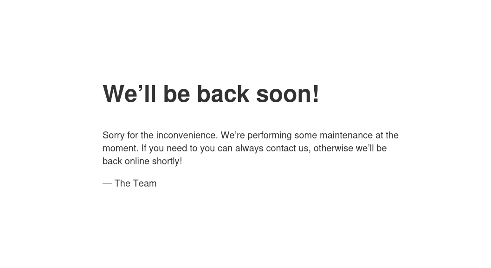
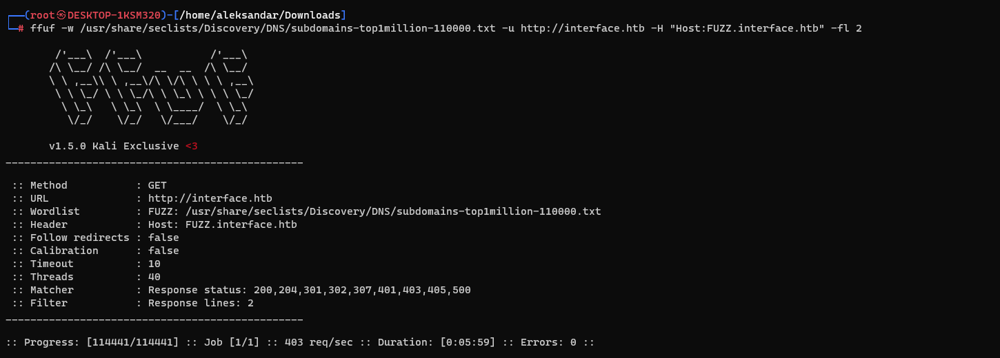
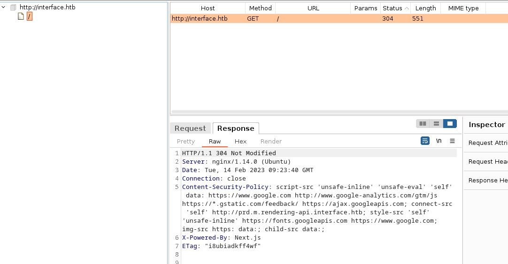

## RUSTSCAN:
`PORT   STATE SERVICE REASON         VERSION
22/tcp open  ssh     syn-ack ttl 63 OpenSSH 7.6p1 Ubuntu 4ubuntu0.7 (Ubuntu Linux; protocol 2.0)
| ssh-hostkey:
|   2048 7289a0957eceaea8596b2d2dbc90b55a (RSA)
| ssh-rsa AAAAB3NzaC1yc2EAAAADAQABAAABAQDsUhYQQaT6D7Isd510Mjs3HcpUf64NWRgfkCDtCcPC3KjgNKdOByzhdgpqKftmogBoGPHDlfDboK5hTEm/6mqhbNQDhOiX1Y++AXwcgLAOpjfSExhKQSyKZVveZCl/JjB/th0YA12XJXECXl5GbNFtxDW6DnueLP5l0gWzFxJdtj7C57yai6MpHieKm564NOhsAqYqcxX8O54E9xUBW4u9n2vSM6ZnMutQiNSkfanyV0Pdo+yRWBY9TpfYHvt5A3qfcNbF3tMdQ6wddCPi98g+mEBdIbn1wQOvL0POpZ4DVg0asibwRAGo1NiUX3+dJDJbThkO7TeLyROvX/kostPH
|   256 01848c66d34ec4b1611f2d4d389c42c3 (ECDSA)
| ecdsa-sha2-nistp256 AAAAE2VjZHNhLXNoYTItbmlzdHAyNTYAAAAIbmlzdHAyNTYAAABBBGrQxMOFdtvAa9AGgwirSYniXm7NpzZbgIKhzgCOM1qwqK8QFkN6tZuQsCsRSzZ59+3l+Ycx5lTn11fbqLFqoqM=
|   256 cc62905560a658629e6b80105c799b55 (ED25519)
|_ssh-ed25519 AAAAC3NzaC1lZDI1NTE5AAAAIPtZ4bP4/4TJNGMNMmXWqt2dLijhttMoaeiJYJRJ4Kqy
80/tcp open  http    syn-ack ttl 63 nginx 1.14.0 (Ubuntu)
| http-methods:
|_  Supported Methods: GET HEAD
|_http-title: Site Maintenance
|_http-favicon: Unknown favicon MD5: 21B739D43FCB9BBB83D8541FE4FE88FA
|_http-server-header: nginx/1.14.0 (Ubuntu)
Warning: OSScan results may be unreliable because we could not find at least 1 open and 1 closed port
OS fingerprint not ideal because: Missing a closed TCP port so results incomplete`
* * *
## SSH:
So far we can't do much about it, the SSH version is kinda new so there aren't any exploits usable in the wild so far. 
We may have to come back later...
* * *
## HTTP:
Logging into website we can see only a bare page that says the site is under maintenance and no traces about possible FQDN have been found:

Running FFUF didn't show any potential new subdomain so far:

Here i was a bit out of ideas here so I had to check for tips and someone pointed towards CSP(Content-Security Policy), so checking thru all the Burpsuite logs we could find anther subdomain in the CSP:

* * *
