## RUSTSCAN
`
PORT   STATE SERVICE REASON         VERSION
22/tcp open  ssh     syn-ack ttl 63 OpenSSH 8.2p1 Ubuntu 4ubuntu0.5 (Ubuntu Linux; protocol 2.0)
| ssh-hostkey: 
|   3072 2f1e6306aa6ebbcc0d19d4152674c6d9 (RSA)
| ssh-rsa AAAAB3NzaC1yc2EAAAADAQABAAABgQC8CUW+gkrjaTI+EeIVcW/8kCM0oaKxGk63NkzFaKj8cgPfImUg8NbMX7xSoQR2DJP88LCJWpm/7KgYyHgaI4w29TRZTGFrv1MKoALQKO/6GDUxLtoHaSA1KrXph74L9eNp/Q/xAzmjfNqLL3qCAotSUZndEWV7C7EQYj73e88Rvw+bV8mQ0O+habEygGVEFuEgOJpN0e3YM3EJoxo1N5CVJMBUJ4Jb7FoYYckIAYTZTV3fuembGRoG0Lvw6YbIOYA8URxLqcBxsMSOkznhf219fl2KXiT9Y7505L/HAeWG4NW4LAuDereMuaUDe4vWEMHYx0KH7m3UuJ7zxcPqHU7K94KW8cZVNlWjoNPDKrPTEgPDfDRlUNpVRyE87DcBgOzNGNFJHYhj2K46RKtv+TO9MjYKvC+nXFSNgPkdFaCQcfpqd61FtaVsin5Ho/v1XfhqDG0d7N7uDM28zCmNVfnl9+MI0jpBmiFaH8V0ZjR7EZlkk+7Xb3bI2Kq3KVaif7s=
|   256 274520add2faa73a8373d97c79abf30b (ECDSA)
| ecdsa-sha2-nistp256 AAAAE2VjZHNhLXNoYTItbmlzdHAyNTYAAAAIbmlzdHAyNTYAAABBBG5ZpYGYsM/eNsAOYy3iQ9O7/OdK6q63GKK1bd2ZA5qhePdO+KJOOvgwxKxBXoJApVfBKV0oVn3ztPubO2mdp5g=
|   256 4245eb916e21020617b2748bc5834fe0 (ED25519)
|_ssh-ed25519 AAAAC3NzaC1lZDI1NTE5AAAAIJ4m4ta/VBtbCv+5FEPfydbXySZHyzU7ELt9lBsbjl5S
80/tcp open  http    syn-ack ttl 63 Apache httpd 2.4.41
|_http-title: Did not follow redirect to http://eforenzics.htb/
|_http-server-header: Apache/2.4.41 (Ubuntu)
| http-methods: 
|_  Supported Methods: GET HEAD POST OPTIONS
Warning: OSScan results may be unreliable because we could not find at least 1 open and 1 closed port

`
* * *
## SSH
We can't do anything here, we may come back if we find proper credentials or ssh keys but so far SSH bruteforce will not be involved in the initial stage.
* * *
## HTTP
From our first enumeration with Rustscan it showed up that the read FQDN is eforenzics.htb and not investigation.htb which means we should add that domain to our host file and we can move forward.

Our first subdomain/vhosts enumeration didn't showed up any possible subdomains so far:
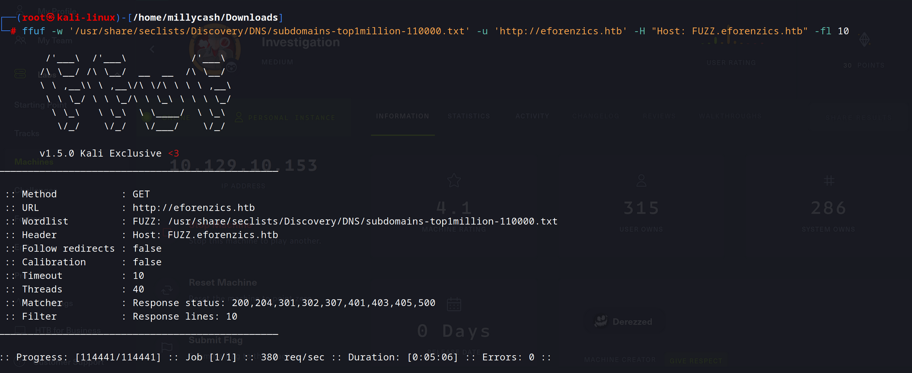

Checking for potential webdirectories leads us to a upload.php that might be interesting:
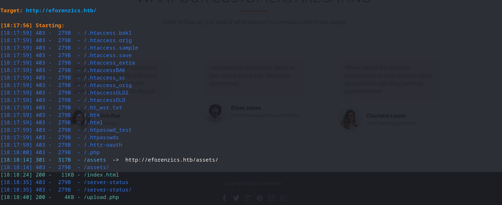

Surfing directly to the site we can't find anything interesting in the webpage sourcecode so far but we may have a list of possible users?

Moving thru all the sides seems like the only page that matters is under "Free services"

Seems like we may upload some jpg files and we can get back something. Wondering if the image plugin used may leads us to some RCE? We need first to upload some files and check with burpsuite what can we find?

From out first test seems like we uploaded a png file and so far we get a txt result under /analysed_images/:
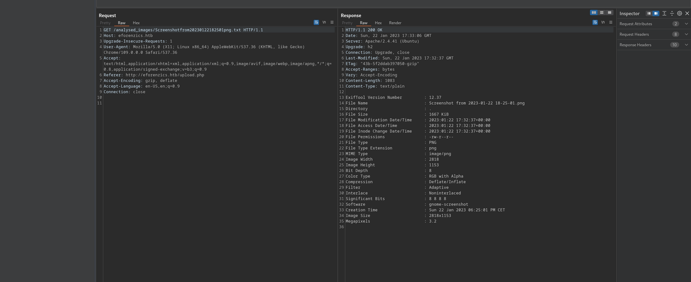
From the page we se that upload.php run Exiftool version 12.37 and it shows you exif result on a new txt file under /analysed_images/filename.txt

Wondering if we can trigger a RCE with this exploit?
https://github.com/convisolabs/CVE-2021-22204-exiftool

Edit: is not working but checking more seems like there is another CVE from 2022 that covers the version <=2.38
https://gist.github.com/ert-plus/1414276e4cb5d56dd431c2f0429e4429
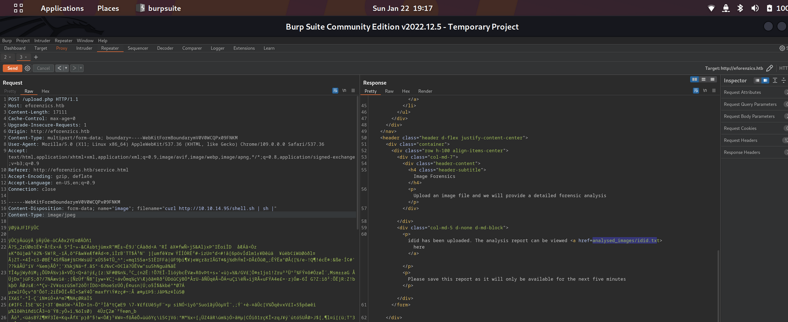

All the tries are not working, i mean seems like slash is not parsed:
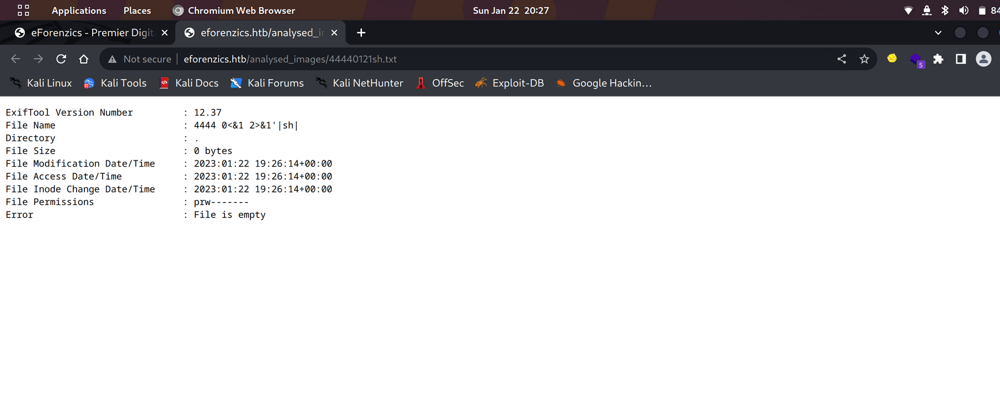

So i had to check for tips and apparently the solutions is to use base64 encode and decode, something like this:
`
echo 'base64_payload'|base64 -d|sh|
`
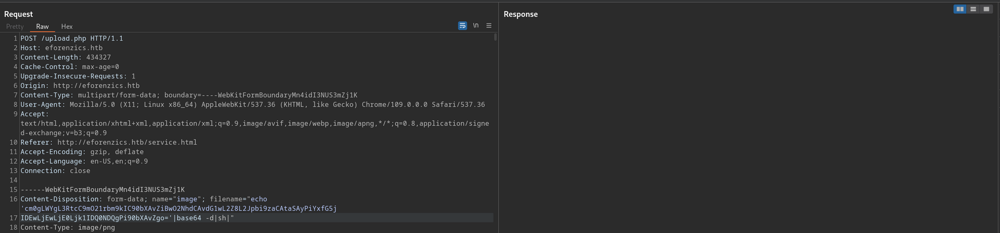
And doint this we get a RCE:
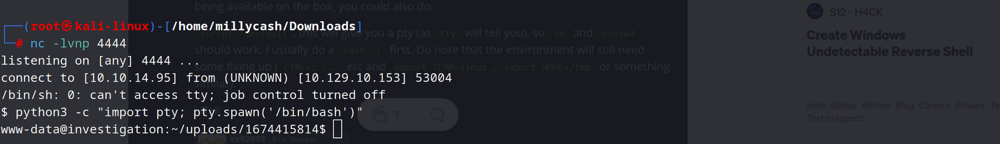
* * *
## User.txt
Doing a manual enumerations shows us that there is only one user except root of course which is "Smorton" where we can't read user.txt so we must find a leverage path to his account and then to root. I will suggest to upload linpeas and check what can we find?

`
╔══════════╣ Sudo version
╚ https://book.hacktricks.xyz/linux-hardening/privilege-escalation#sudo-version
Sudo version 1.8.31

╔══════════╣ CVEs Check
Vulnerable to CVE-2021-3560

Potentially Vulnerable to CVE-2022-2588

╔══════════╣ Users with console
root:x:0:0:root:/root:/bin/bash
smorton:x:1000:1000:eForenzics:/home/smorton:/bin/bash

╔══════════╣ Unexpected in /opt (usually empty)
total 12
drwxr-xr-x  3 root root 4096 Sep 30 22:30 .
drwxr-xr-x 18 root root 4096 Jan  9 16:53 ..
dr-xr-xr-x  8 root root 4096 Sep 30 22:30 exiftool

╔══════════╣ Interesting GROUP writable files (not in Home) (max 500)
╚ https://book.hacktricks.xyz/linux-hardening/privilege-escalation#writable-files
  Group www-data:
/usr/local/investigation/analysed_log
`

About those folders the only one which seems interesting is the last one that is about to contain a Windows event log message from possibly ourlook:
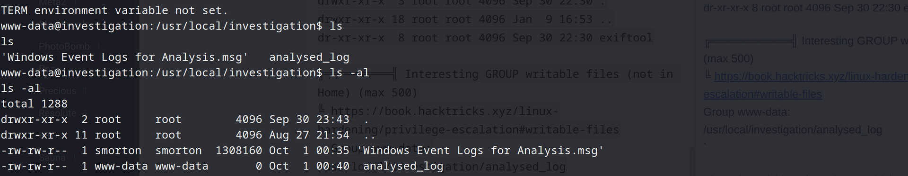

Now i had to convert the email from msg(outlook format) to eml with this tool:
https://freeelectron.ro/opening-msg-outlook-files-in-ubuntu-or-linux-mint/

Then it can be opened as a normal text editor, Now we have some base64 data to analyze:
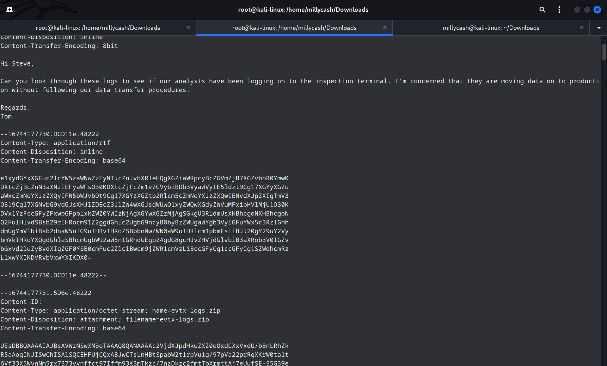

`
{\rtf1\ansi\ansicpg1252\fromtext \fbidis \deff0{\fonttbl
{\f0\fswiss Arial;}
{\f1\fmodern Courier New;}
{\f2\fnil\fcharset2 Symbol;}
{\f3\fmodern\fcharset0 Courier New;}}
{\colortbl\red0\green0\blue0;\red0\green0\blue255;}
\uc1\pard\plain\deftab360 \f0\fs20 Hi Steve,\par
\par
Can you look through these logs to see if our analysts have been logging on to the inspection terminal. I'm concerned that they are moving data on to production without following our data transfer procedures. \par
\par
Regards.\par
Tom\par
}
`

Decoding the second part of the file shows us a windows event viewer file:
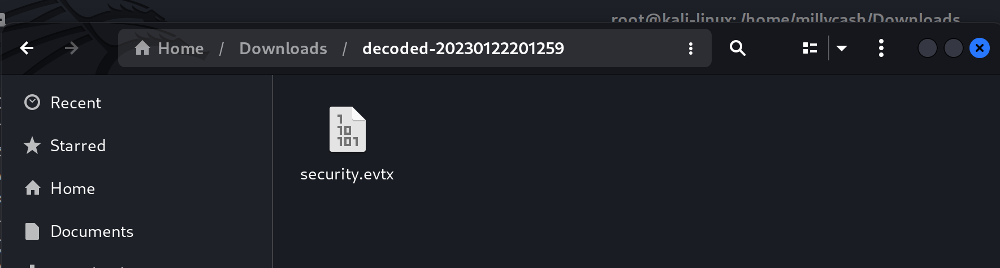

Now we need to export all the data to a either xml or json file so we can parse it more easily. We can use something like this:
https://github.com/omerbenamram/evtx

Edit: I decided to import the evtx file directly into my windows host and after a long long time scrolling thru all the logs i finally found it. The key was to order events by task category and more specifically under "Logon" we could see user typed in his password in the user field and tried to login.
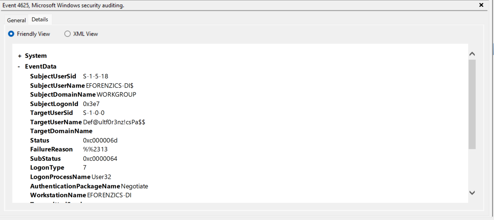

`    "EventData": {
      "AuthenticationPackageName": "Negotiate",
      "FailureReason": "%%2313",
      "IpAddress": "127.0.0.1",
      "IpPort": "0",
      "KeyLength": 0,
      "LmPackageName": "-",
      "LogonProcessName": "User32 ",
      "LogonType": 7,
      "ProcessId": "0x180",
      "ProcessName": "C:\\Windows\\System32\\svchost.exe",
      "Status": "0xc000006d",
      "SubStatus": "0xc0000064",
      "SubjectDomainName": "WORKGROUP",
      "SubjectLogonId": "0x3e7",
      "SubjectUserName": "EFORENZICS-DI$",
      "SubjectUserSid": "S-1-5-18",
      "TargetDomainName": "",
      "TargetUserName": "Def@ultf0r3nz!csPa$$",
      "TargetUserSid": "S-1-0-0",
      "TransmittedServices": "-",
      "WorkstationName": "EFORENZICS-DI"
    },
    "System": {
      "Channel": "Security",
      "Computer": "eForenzics-DI",
      "Correlation": {
        "#attributes": {
          "ActivityID": "6A946884-A5BC-0001-D968-946ABCA5D801"
        }
      },
      "EventID": 4625,`
But now we have a password and we can ssh into the machine and grab our first flag.

* * *
## ROOT

Now checking sudo -l shows like smorton can:
`smorton@investigation:~$ sudo -l
Matching Defaults entries for smorton on investigation:
    env_reset, mail_badpass, secure_path=/usr/local/sbin\:/usr/local/bin\:/usr/sbin\:/usr/bin\:/sbin\:/bin\:/snap/bin

User smorton may run the following commands on investigation:
    (root) NOPASSWD: /usr/bin/binary
`

Since we are speaking of a custom program we can download the file and check with ghidra(main function):
`

undefined8 main(int param_1,long param_2)

{
  __uid_t _Var1;
  int iVar2;
  FILE *__stream;
  undefined8 uVar3;
  char *__s;
  char *__s_00;
  
  if (param_1 != 3) {
    puts("Exiting... ");
                    /* WARNING: Subroutine does not return */
    exit(0);
  }
  _Var1 = getuid();
  if (_Var1 != 0) {
    puts("Exiting... ");
                    /* WARNING: Subroutine does not return */
    exit(0);
  }
  iVar2 = strcmp(*(char **)(param_2 + 0x10),"lDnxUysaQn");
  if (iVar2 != 0) {
    puts("Exiting... ");
                    /* WARNING: Subroutine does not return */
    exit(0);
  }
  puts("Running... ");
  __stream = fopen(*(char **)(param_2 + 0x10),"wb");
  uVar3 = curl_easy_init();
  curl_easy_setopt(uVar3,0x2712,*(undefined8 *)(param_2 + 8));
  curl_easy_setopt(uVar3,0x2711,__stream);
  curl_easy_setopt(uVar3,0x2d,1);
  iVar2 = curl_easy_perform(uVar3);
  if (iVar2 == 0) {
    iVar2 = snprintf((char *)0x0,0,"%s",*(undefined8 *)(param_2 + 0x10));
    __s = (char *)malloc((long)iVar2 + 1);
    snprintf(__s,(long)iVar2 + 1,"%s",*(undefined8 *)(param_2 + 0x10));
    iVar2 = snprintf((char *)0x0,0,"perl ./%s",__s);
    __s_00 = (char *)malloc((long)iVar2 + 1);
    snprintf(__s_00,(long)iVar2 + 1,"perl ./%s",__s);
    fclose(__stream);
    curl_easy_cleanup(uVar3);
    setuid(0);
    system(__s_00);
    system("rm -f ./lDnxUysaQn");
    return 0;
  }
  puts("Exiting... ");
                    /* WARNING: Subroutine does not return */
  exit(0);
`

Now program without values exits by itself, so it expects first a value and then a lDnxUysaQn.
Like this: /binary XXXX lDnxUysaQn

This will pass the if and go into running mode. Now scrolling down the code we can se that perl is called so we could write a perl revshell and host on our http server with a NC listening.

Now giving URL to our hosted perl script with revshell as first parameter and the string should kick our revshell:
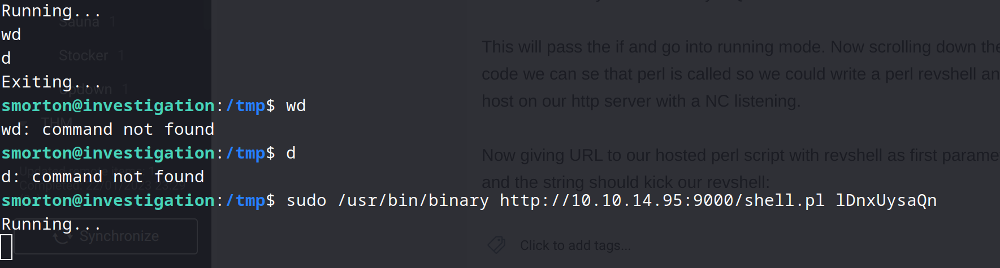
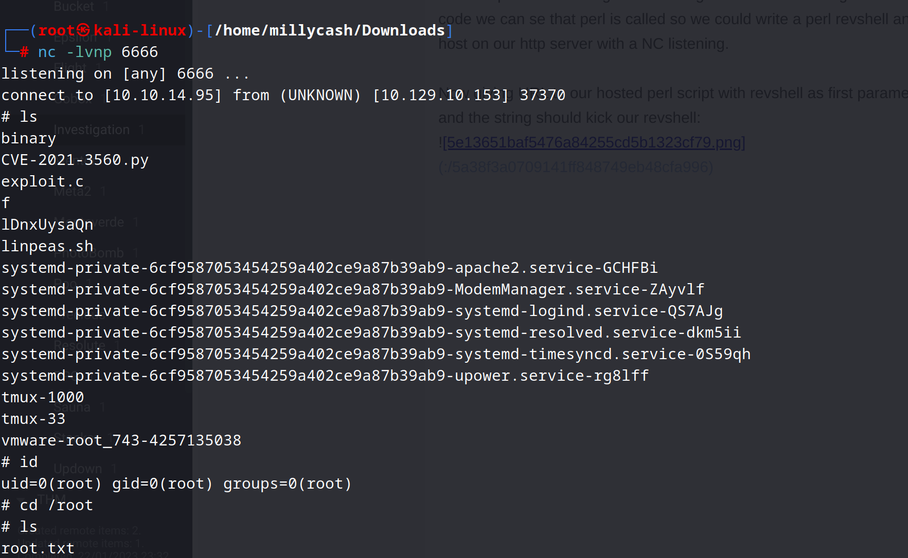