## RUSTSCAN
PORT   STATE SERVICE REASON         VERSION
22/tcp open  ssh     syn-ack ttl 63 OpenSSH 8.9p1 Ubuntu 3 (Ubuntu Linux; protocol 2.0)
| ssh-hostkey:
|   256 c73bfc3cf9ceee8b4818d5d1af8ec2bb (ECDSA)
| ecdsa-sha2-nistp256 AAAAE2VjZHNhLXNoYTItbmlzdHAyNTYAAAAIbmlzdHAyNTYAAABBBO6yWCATcj2UeU/SgSa+wK2fP5ixsrHb6pgufdO378n+BLNiDB6ljwm3U3PPdbdQqGZo1K7Tfsz+ejZj1nV80RY=
|   256 4440084c0ecbd4f18e7eeda85c68a4f7 (ED25519)
|_ssh-ed25519 AAAAC3NzaC1lZDI1NTE5AAAAIJjv9f3Jbxj42smHEXcChFPMNh1bqlAFHLi4Nr7w9fdv
80/tcp open  http    syn-ack ttl 63 Apache httpd 2.4.52
| http-methods:
|_  Supported Methods: GET HEAD POST OPTIONS
|_http-server-header: Apache/2.4.52 (Ubuntu)
|_http-title: Did not follow redirect to http://mentorquotes.htb/
Warning: OSScan results may be unreliable because we could not find at least 1 open and 1 closed port
OS fingerprint not ideal because: Missing a closed TCP port so results incomplete
Aggressive OS guesses: Linux 4.15 - 5.6 (95%), Linux 5.3 - 5.4 (95%), Linux 2.6.32 (95%), Linux 5.0 - 5.3 (95%), Linux 3.1 (95%), Linux 3.2 (95%), AXIS 210A or 211 Network Camera (Linux 2.6.17) (94%), ASUS RT-N56U WAP (Linux 3.4) (93%), Linux 3.16 (93%), Linux 5.0 - 5.4 (93%)
No exact OS matches for host (test conditions non-ideal).
* * *
## HTTP
At first sight we get redirected toward mentorquotes.htb so let's add it to our host and continue with enumeration.
So far nothing shows up in the HTML page source code except that banner picture is hosted in a s3 bucket...
No extra subdomains have been found with FFUF and an extensive worlist of subdomains:
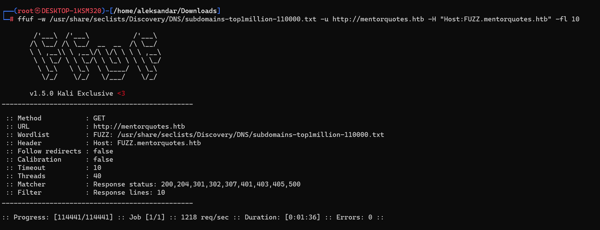

Moving to webdiscovery with Dirsearch didn't gave us something:
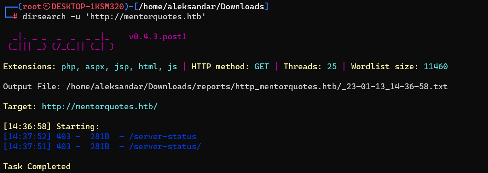

Right now we have nothing, I really think we need to pursuite the s3 path and check what can we find more in the bucket.
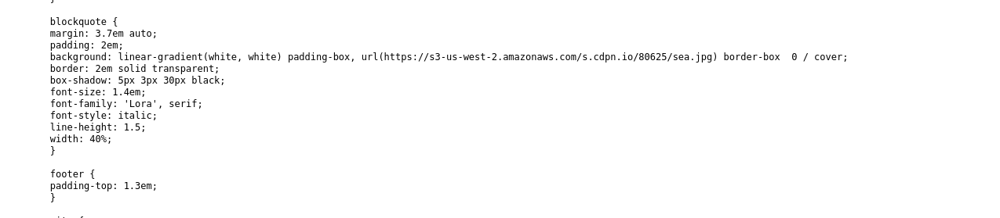

Edit: here i checked for some hints in the forum and people tell to check UDP ports.
So here i had to check for tips and apparently the issue is with FFUF where it's not matching http code 404, and one of the subdomains was matching only with that code which instead using WFUZZ showed it automatically!
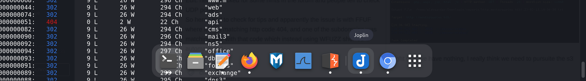
* * *
## NMAP(UDP)
Apparently we habe dhcp and snmp here:
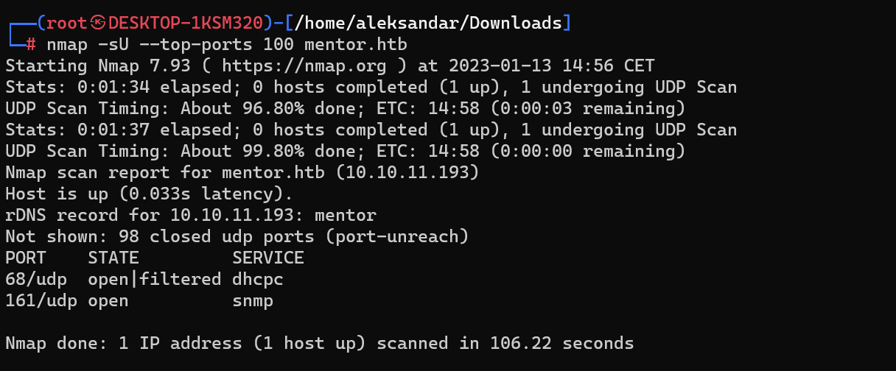
We will try to enumerate snmp now!
* * *
## SNMP
Let's fire up MSF and check what can we find in the SNMP protocoll:
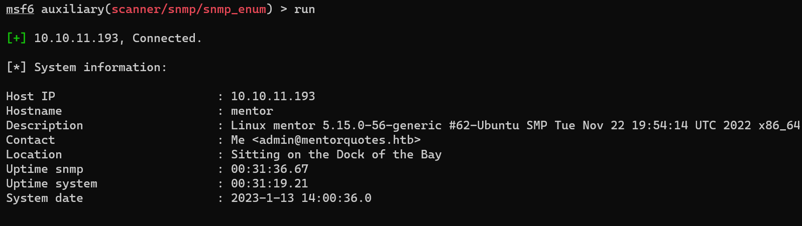
From this i guess we are talking about a docker vm... but no clue about what to do next.
Since everyone on the forum was telling to enumerate better snmp i got back and tried to bruteforce for communitys trings in MSF, knowing that public gave us a username and i found another community string:
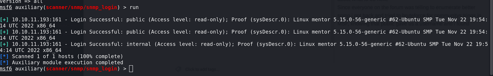

And using snmpwalk to enumerate everything with "internal" as community string on v2c we get much much more informations but nothing that gave us any extra subdomain.
* * *
## API Website
Running a Webdirectories search shows us some more directories:
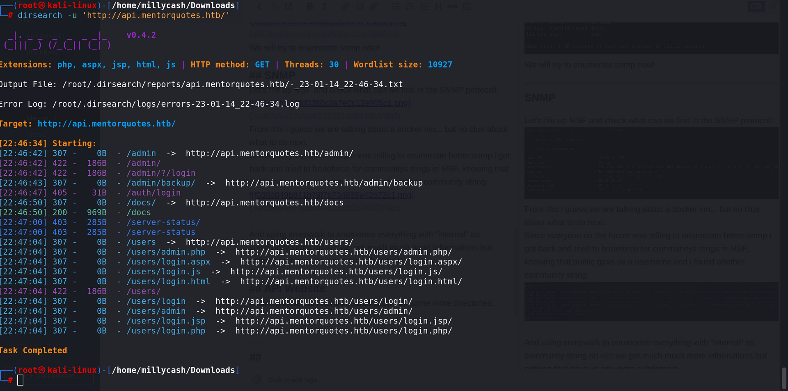
The only website that seems matters is the /docs folder and we see the api used and some tutoral on how to catch some informations:
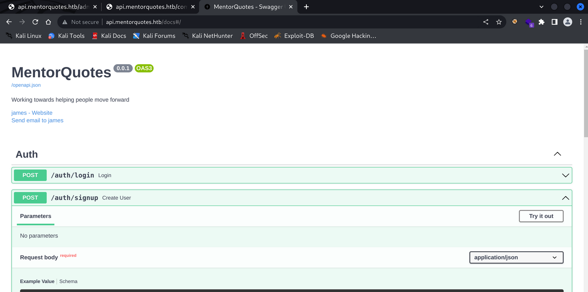

Adding our user we see that we got ID:4 which i guess we can grab other users by id:
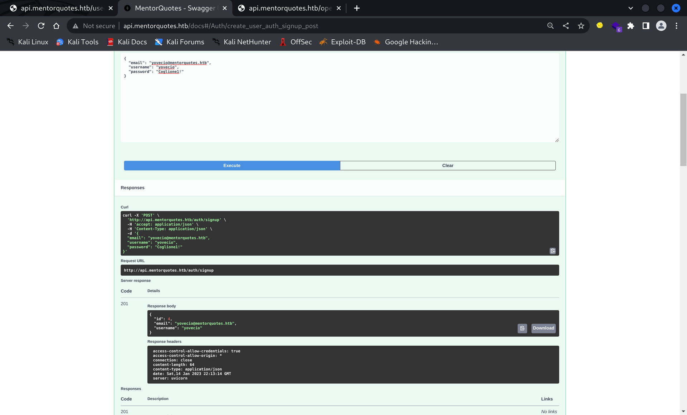

But first we need to login into API with our fresh user:
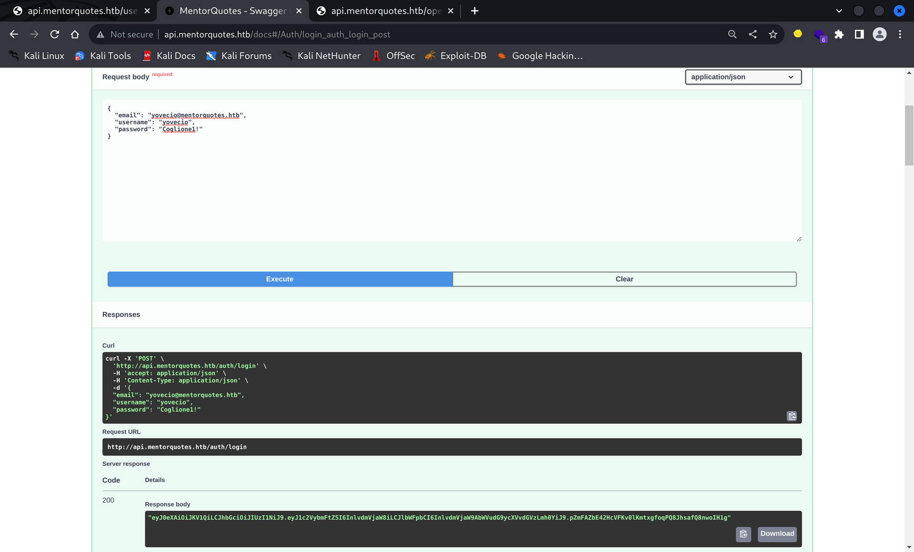

Now that we are logged in we got out auth string that we can use to grab all the users:

* * *
## 